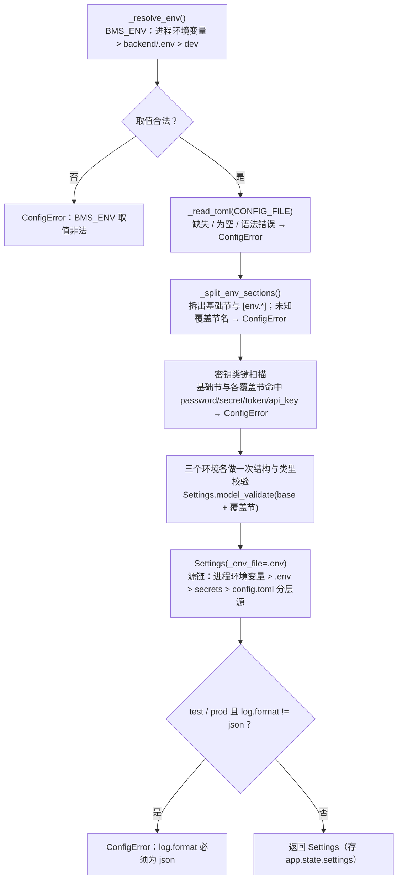

# 配置管理详细设计

> BMS · 阶段一 / 02-01 任务 · 任务级详细设计（可落地、可逐项验收）

[文档首页](../../../../../../文档首页.md) › [01 配置管理](../03_后端基础能力_01_配置管理.md) › 01 详细设计　|　[← 03 后端基础能力](../../03_后端基础能力.md)

## 1. 概述 <a id="overview"></a>

本文档是任务 [01 配置管理](../03_后端基础能力_01_配置管理.md) 的**详细设计**，粒度到「按序落地、逐条验收」，位于 `bms文档/设计/` 全局粗设计之下一级。实施与测试以本文档为准，偏差先回写本文档（定稿口径记录于[第 14 节](#align)）。

上游依据（可追溯）：

- 需求 [03-1](../../../../需求/03_需求_后端基础能力.md#r03-1)
- 《[项目规划说明](../../../../../../规划/项目规划说明.md)》「环境与配置」节
- 《[总体项目规划](../../../../../../规划/总体项目规划.md)》「配置与变更管理」节
- 《[命名规范](../../../../../../规范/命名规范.md)》「基础设施命名」节
- 《[后端开发规范](../../../../../../规范/后端开发规范.md)》「目录与分层职责」节
- 《[架构设计 · 后端基础类体系](../../../../../../设计/架构设计/33_架构设计_后端基础类体系.md)》「core 横切基座」节

与前后任务的关系：[01_02 backend 工程初始化](../../../01_工程骨架/01_工程骨架_02_backend工程初始化/设计/02_详细设计_01_backend工程初始化.md) 已交付 `config.toml` 注释占位与工厂基线；[01_03 backend 分层目录与职责](../../../01_工程骨架/01_工程骨架_03_backend分层目录与职责/设计/03_详细设计_01_backend分层目录与职责.md) 已交付 `app/core/config.py` 占位、`app/api/deps.py` 占位与 `app.state` 挂载约定；本任务在其上填充配置加载与启动校验。下游消费方：[02 日志体系](../../03_后端基础能力_02_日志体系/03_后端基础能力_02_日志体系.md) 用 `[log]`；[03 健康检查](../../03_后端基础能力_03_健康检查/03_后端基础能力_03_健康检查.md) 用 `[redis]`；阶段二[数据访问底座](../../../../需求/02_需求_后端基座.md#r02-3)用 `[database]`；阶段二安全基座与阶段四认证用 `[security]`；阶段六文件管理用 `[minio]`。职责边界见[第 9 节](#boundary)。

## 2. 现状与差距 <a id="gap"></a>

| 项 | 现状（01_02 / 01_03 交付） | 本任务目标 | 动作 |
| --- | --- | --- | --- |
| `backend/config.toml` | 仅注释头，无实际键 | 全量分区与键清单 + `[env.*]` 覆盖节，键逐项中文注释 | 填充 |
| `backend/app/core/config.py` | 仅模块 docstring 占位 | `Settings` 模型 + `load_settings()` + `ConfigError` | 实现 |
| `backend/app/api/deps.py` | 占位（docstring + TODO） | 新增 `get_settings(request)` 依赖 | 新增函数 |
| `backend/app/main.py` | 工厂无 lifespan（仅 TODO 注册位） | lifespan 内加载配置 → `app.state.settings`；根路由读配置 | 修改 |
| `backend/.env.example` | 缺失 | 全部 `BMS_` 应用键 + 占位值 | 新建 |
| `backend/pyproject.toml` | dev 组无 `asgi-lifespan` | dev 组新增 `asgi-lifespan`（测试内执行 lifespan） | 修改 |
| `backend/tests/conftest.py` | `ASGITransport` 直接建客户端，不跑 lifespan | `LifespanManager` 包裹 + 宿主环境隔离夹具 | 修改 |
| `backend/tests/core/test_config.py` | 缺失 | 加载 / 覆盖 / 校验失败用例 | 新建 |
| `backend/.gitignore` | — | 无需改动（仓库根 `.gitignore` 已含 `.env`） | — |

## 3. 目标目录与交付物清单 <a id="tree"></a>

```text
backend/
├── pyproject.toml          # dev 组新增 asgi-lifespan（修改）
├── config.toml             # 全量分区与键清单 + [env.*] 覆盖节（填充）
├── .env.example            # 新增：全部 BMS_ 应用键与占位值（不含真实密钥）
├── app/
│   ├── main.py             # lifespan 内加载配置 → app.state.settings（修改）
│   ├── core/
│   │   └── config.py       # Settings 模型 + load_settings() + ConfigError（实现）
│   └── api/
│       └── deps.py         # 新增 get_settings(request)（修改）
└── tests/
    ├── conftest.py         # client 夹具改用 LifespanManager + 环境隔离（修改）
    └── core/
        └── test_config.py  # 配置加载/覆盖/校验失败用例（新增）
```

交付物清单：

| 文件 | 类型 | 说明 |
| --- | --- | --- |
| `backend/config.toml` | 填充 | 分区与键清单（[第 4 节](#toml)） |
| `backend/.env.example` | 新建 | 环境变量模板（[第 8 节](#secrets)） |
| `backend/app/core/config.py` | 实现 | 模型与加载校验（[第 5 节](#model)、[第 6 节](#loading)） |
| `backend/app/api/deps.py` | 修改 | `get_settings` 依赖（[第 7 节](#boot)） |
| `backend/app/main.py` | 修改 | lifespan 挂载与根路由读配置（[第 7 节](#boot)） |
| `backend/pyproject.toml` | 修改 | dev 组新增 `asgi-lifespan` |
| `backend/tests/conftest.py` | 修改 | lifespan 执行与环境隔离（[第 10 节](#tests)） |
| `backend/tests/core/test_config.py` | 新建 | 配置用例（[第 10 节](#tests)） |

> 不新增空目录、不新增 `.gitkeep`；不新增迁移脚本与业务代码。

## 4. config.toml 设计 <a id="toml"></a>

### 4.1 分层与优先级 <a id="toml-layers"></a>

优先级由低到高：**基础节 < `[env.{BMS_ENV}]` 覆盖节 < `backend/.env` < 进程环境变量**。基础节给**安全默认值**（INFO 日志、不放开跨域）；三个环境覆盖节**全部显式**写出，便于三环境一窥到底。

### 4.2 键清单 <a id="toml-keys"></a>

```toml
# BMS 后端配置（阶段一 02-01 配置管理）
# 环境分层：BMS_ENV = dev | test | prod（未设置默认 dev）
# 优先级：基础节 < [env.{BMS_ENV}] 覆盖节 < backend/.env < 进程环境变量
# 密钥类配置（password / secret / token / api_key）只走环境变量，不写入本文件；数据库 url 不含密码

[app]
name = "BMS 基础管理系统"   # 应用名（根路由与 OpenAPI 展示）
env = "dev"                 # 展示用默认值；实际环境以 BMS_ENV 为准，二者不做一致性校验
debug = false               # 调试开关（阶段一不驱动行为，供后续任务消费）

[server]
host = "0.0.0.0"   # 监听地址
port = 8000        # 监听端口（1-65535）
workers = 1        # worker 数（≥1）

[log]
level = "INFO"            # 级别：DEBUG / INFO / WARNING / ERROR / CRITICAL
format = "json"           # 渲染形态：console（可读）/ json（单行 JSON）
slow_request_ms = 1000    # 慢请求阈值（毫秒，≥1），超阈值记 WARNING

[database]
# 三库连接声明；url / url_template 不含密码，密码由 BMS_DATABASE__{库}__PASSWORD 注入
[database.platform]
url = "sqlite+aiosqlite:///./bms_platform.db"   # 平台库地址（开发用 SQLite 模拟）
replicas = []                                    # 只读副本地址列表（阶段一为空）
pool_size = 5                                    # 连接池常驻连接数
max_overflow = 10                                # 连接池溢出上限
pool_recycle = 3600                              # 连接回收秒数（≥1）
pool_pre_ping = true                             # 取连接前探活

[database.tenants]
url_template = "sqlite+aiosqlite:///./bms_tenant_{code}.db"   # 租户库模板，{code} 为租户编码
replicas = []
pool_size = 5
max_overflow = 10
pool_recycle = 3600
pool_pre_ping = true

[database.archive]
url = "sqlite+aiosqlite:///./bms_archive.db"   # 归档库地址（阶段六起使用）
replicas = []
pool_size = 5
max_overflow = 10
pool_recycle = 3600
pool_pre_ping = true

[redis]
host = "127.0.0.1"    # Redis 地址
port = 6379           # Redis 端口（1-65535）
db = 0                # 逻辑库编号（≥0）
max_connections = 20  # 连接池上限（≥1）

[cors]
allow_origins = []        # 允许来源；生产由 nginx 同源反代，基础默认不放开跨域
allow_credentials = true  # 是否允许携带凭据
allow_methods = ["*"]     # 允许的方法
allow_headers = ["*"]     # 允许的请求头

[minio]
# MinIO 配置（阶段一占位，键随阶段六 文件管理细化）；secret_key 只走环境变量

[security]
# 安全基座配置（阶段一占位，键随阶段二安全基座 / 阶段四认证细化）；密钥只走环境变量

# === 环境覆盖节（优先级高于基础节，低于 backend/.env 与进程环境变量）===

[env.dev]
[env.dev.log]
level = "DEBUG"          # 开发：DEBUG 便于排障
format = "console"       # 开发：console 可读渲染
slow_request_ms = 500    # 开发：阈值从严
[env.dev.cors]
allow_origins = ["http://localhost:5173", "http://localhost:5174"]   # PC 5173 / 移动端 5174（vite 直连场景）

[env.test]
[env.test.log]
level = "INFO"
format = "json"          # 测试：强制单行 JSON
slow_request_ms = 1000
[env.test.cors]
allow_origins = []       # 测试：不放开跨域

[env.prod]
[env.prod.app]
debug = false            # 生产：调试关闭
[env.prod.log]
level = "INFO"
format = "json"          # 生产：强制单行 JSON
slow_request_ms = 2000   # 生产：阈值从宽
[env.prod.cors]
allow_origins = []       # 生产：nginx 同源反代，不放开跨域
```

口径：

- **`url` 不含密码**：`[database.*]` 的 `url` / `url_template` 不含账号密码（可含用户名）；密码仅由 `BMS_DATABASE__{库}__PASSWORD` 注入，阶段二建引擎时拼接。
- **`[minio]` / `[security]` 为真实空节**：模型侧定义为全可选子模型，空节合法；后续阶段在模型上加键即可，不触发「未知键」误判。
- **`[env.*]` 与 `env` 表**：`env` 是覆盖节容器，不参与配置模型（加载时剔除）；三个环境节均参与结构与类型校验（[第 6 节](#loading)）。
- **三环境差异**：日志级别与形态（`level` / `format` / `slow_request_ms`）、CORS 来源，与需求 03-1「完成标准」一致。
- 键名遵循《命名规范》「基础设施命名」节（`config.toml` 小节小写英文、环境变量 `BMS_` + 双层下划线）。

## 5. 配置模型设计 <a id="model"></a>

### 5.1 模型结构 <a id="model-structure"></a>

`backend/app/core/config.py`：

```python
"""配置加载：config.toml 分区 + 环境覆盖节 + BMS_ 环境变量覆盖 + 启动校验。

优先级（低→高）：config.toml 基础节 < [env.{BMS_ENV}] 覆盖节 < backend/.env < 进程环境变量。
密钥类（password / secret / token / api_key）只走环境变量，不写入 config.toml。
"""

from __future__ import annotations

import os
import re
import tomllib
from pathlib import Path
from typing import Any, Literal

from dotenv import dotenv_values
from pydantic import (
    BaseModel,
    ConfigDict,
    Field,
    SecretStr,
    ValidationError,
    field_validator,
    model_validator,
)
from pydantic_settings import BaseSettings, PydanticBaseSettingsSource, SettingsConfigDict

ENV_NAMES: tuple[str, ...] = ("dev", "test", "prod")
DEFAULT_ENV = "dev"

# backend/ 目录：app/core/config.py 上溯 core → app → backend
BACKEND_DIR = Path(__file__).resolve().parents[2]
CONFIG_FILE = BACKEND_DIR / "config.toml"
DOTENV_FILE = BACKEND_DIR / ".env"

# 内嵌账号密码的连接串：//user:pass@host
_CREDENTIAL_URL = re.compile(r"://[^/@:]*:[^/@]*@")
_SECRET_KEY_NAMES = frozenset({"password", "secret", "secret_key", "private_key", "token", "api_key"})
_SECRET_KEY_SUFFIXES = ("_password", "_secret", "_token", "_api_key")


class ConfigError(RuntimeError):
    """配置加载或校验失败（启动中止）；消息含键路径与原因，不含配置值。"""


class _StrictModel(BaseModel):
    """严格子模型基类：出现未知键（拼错）即校验失败。"""

    model_config = ConfigDict(extra="forbid")


class AppSettings(_StrictModel):
    name: str = "BMS 基础管理系统"
    env: str = "dev"          # 展示用，不与 BMS_ENV 做一致性校验
    debug: bool = False


class ServerSettings(_StrictModel):
    host: str = "0.0.0.0"
    port: int = Field(default=8000, ge=1, le=65535)
    workers: int = Field(default=1, ge=1)


class LogSettings(_StrictModel):
    level: Literal["DEBUG", "INFO", "WARNING", "ERROR", "CRITICAL"] = "INFO"
    format: Literal["console", "json"] = "json"
    slow_request_ms: int = Field(default=1000, ge=1)


class _PoolSettings(_StrictModel):
    """连接池与只读副本声明（各库共用）。"""

    replicas: list[str] = Field(default_factory=list)
    pool_size: int = Field(default=5, ge=0)
    max_overflow: int = Field(default=10, ge=0)
    pool_recycle: int = Field(default=3600, ge=1)
    pool_pre_ping: bool = True

    @field_validator("replicas")
    @classmethod
    def _reject_replica_credentials(cls, value: list[str]) -> list[str]:
        for item in value:
            _reject_credential(item)
        return value


class DatabaseConnection(_PoolSettings):
    """单库连接声明（platform / archive）：url 不含密码。"""

    url: str
    password: SecretStr | None = None   # 仅 BMS_DATABASE__{库}__PASSWORD

    @field_validator("url")
    @classmethod
    def _reject_url_credentials(cls, value: str) -> str:
        _reject_credential(value)
        return value


class TenantDatabaseConnection(_PoolSettings):
    """租户库连接声明（一租户一库）：以 url_template 的 {code} 占位渲染。"""

    url_template: str
    password: SecretStr | None = None

    @field_validator("url_template")
    @classmethod
    def _check_template(cls, value: str) -> str:
        _reject_credential(value)
        if "{code}" not in value:
            raise ValueError("租户库模板必须包含 {code} 占位")
        return value


class DatabaseSettings(_StrictModel):
    platform: DatabaseConnection
    tenants: TenantDatabaseConnection
    archive: DatabaseConnection


class RedisSettings(_StrictModel):
    host: str = "127.0.0.1"
    port: int = Field(default=6379, ge=1, le=65535)
    db: int = Field(default=0, ge=0)
    max_connections: int = Field(default=20, ge=1)
    password: SecretStr | None = None   # 仅 BMS_REDIS__PASSWORD


class MinioSettings(_StrictModel):
    """MinIO（阶段一占位，键随阶段六细化）；secret_key 只走环境变量。"""

    endpoint: str | None = None
    bucket: str | None = None
    access_key: str | None = None


class SecuritySettings(_StrictModel):
    """安全基座（阶段一占位，键随阶段二安全基座 / 阶段四认证细化）；密钥只走环境变量。"""


class CorsSettings(_StrictModel):
    allow_origins: list[str] = Field(default_factory=list)
    allow_credentials: bool = True
    allow_methods: list[str] = Field(default_factory=lambda: ["*"])
    allow_headers: list[str] = Field(default_factory=lambda: ["*"])

    @model_validator(mode="after")
    def _check_wildcard_with_credentials(self) -> CorsSettings:
        if self.allow_credentials and "*" in self.allow_origins:
            raise ValueError("allow_credentials=true 时 allow_origins 不得为 *（浏览器规范拒绝该组合）")
        return self


class Settings(BaseSettings):
    """应用配置（config.toml 分层 + BMS_ 环境变量覆盖）。"""

    model_config = SettingsConfigDict(
        env_prefix="BMS_",
        env_nested_delimiter="__",
        dotenv_filtering="match_prefix",   # .env 仅取 BMS_ 前缀键，避免无关键触发未知键报错
        extra="forbid",
        case_sensitive=False,
    )

    app: AppSettings
    server: ServerSettings
    log: LogSettings
    database: DatabaseSettings
    redis: RedisSettings
    minio: MinioSettings
    security: SecuritySettings
    cors: CorsSettings

    @classmethod
    def settings_customise_sources(
        cls,
        settings_cls: type[BaseSettings],
        init_settings: PydanticBaseSettingsSource,
        env_settings: PydanticBaseSettingsSource,
        dotenv_settings: PydanticBaseSettingsSource,
        file_secret_settings: PydanticBaseSettingsSource,
    ) -> tuple[PydanticBaseSettingsSource, ...]:
        """源优先级：init > 进程环境变量 > .env > secrets 目录 > config.toml 分层源。"""
        return (
            init_settings,
            env_settings,
            dotenv_settings,
            file_secret_settings,
            TomlLayeredSource(settings_cls),
        )
```

### 5.2 字段与校验规则 <a id="model-rules"></a>

| 键（`config.toml`） | 环境变量 | 类型 / 取值 | 校验规则 |
| --- | --- | --- | --- |
| `app.name` | `BMS_APP__NAME` | str | — |
| `app.env` | `BMS_APP__ENV` | str | 仅展示，不与 `BMS_ENV` 校验 |
| `app.debug` | `BMS_APP__DEBUG` | bool | — |
| `server.host` | `BMS_SERVER__HOST` | str | — |
| `server.port` | `BMS_SERVER__PORT` | int | 1–65535 |
| `server.workers` | `BMS_SERVER__WORKERS` | int | ≥1 |
| `log.level` | `BMS_LOG__LEVEL` | 枚举 | DEBUG / INFO / WARNING / ERROR / CRITICAL |
| `log.format` | `BMS_LOG__FORMAT` | 枚举 | console / json；`test`/`prod` 强制 `json` |
| `log.slow_request_ms` | `BMS_LOG__SLOW_REQUEST_MS` | int | ≥1 |
| `database.{库}.url` | `BMS_DATABASE__{库}__URL` | str | 必填；不得内嵌账号密码 |
| `database.tenants.url_template` | `BMS_DATABASE__TENANTS__URL_TEMPLATE` | str | 必填；含 `{code}`；不得内嵌凭据 |
| `database.{库}.password` | `BMS_DATABASE__{库}__PASSWORD` | SecretStr | 只允许环境变量；`config.toml` 写该键启动失败 |
| `database.{库}.replicas` | — | list[str] | 每项不得内嵌凭据 |
| `database.{库}.pool_size` / `max_overflow` | — | int | ≥0 |
| `database.{库}.pool_recycle` | — | int | ≥1 |
| `database.{库}.pool_pre_ping` | — | bool | — |
| `redis.host` / `db` / `max_connections` | `BMS_REDIS__*` | str / int | `db` ≥0、`max_connections` ≥1 |
| `redis.port` | `BMS_REDIS__PORT` | int | 1–65535 |
| `redis.password` | `BMS_REDIS__PASSWORD` | SecretStr | 只允许环境变量 |
| `minio.*` | `BMS_MINIO__*` | str \| None | 阶段一占位，全可选 |
| `security.*` | `BMS_SECURITY__*` | — | 阶段一占位（当前无键） |
| `cors.allow_origins` | `BMS_CORS__ALLOW_ORIGINS` | list[str] | `allow_credentials=true` 时不得含 `*` |
| `cors.allow_credentials` / `allow_methods` / `allow_headers` | `BMS_CORS__*` | bool / list[str] | — |

> 未知或拼错的分区/键（基础节、任一 `[env.*]` 节、`.env`、环境变量）一律校验失败——`Settings` 与全部子模型均 `extra="forbid"`。

## 6. 加载与覆盖机制 <a id="loading"></a>

### 6.1 加载流程 <a id="loading-flow"></a>



### 6.2 实现要点 <a id="loading-impl"></a>

```python
class TomlLayeredSource(PydanticBaseSettingsSource):
    """config.toml 源：基础节与 [env.{BMS_ENV}] 深合并后返回（剔除 env 覆盖节容器）。"""

    def get_field_value(self, field: Any, field_name: str) -> tuple[Any, str, bool]:
        """本源于 __call__ 整体返回，不逐字段解析。"""
        raise NotImplementedError

    def __call__(self) -> dict[str, Any]:
        base, overlays = _split_env_sections(_read_toml(CONFIG_FILE))
        return _deep_merge(base, overlays.get(_resolve_env(), {}))


def _read_toml(path: Path) -> dict[str, Any]:
    """读取并解析 TOML；缺失、为空、语法错误均中止启动。"""
    if not path.is_file():
        raise ConfigError(f"配置文件缺失：{path}")
    try:
        data = tomllib.loads(path.read_text(encoding="utf-8"))
    except tomllib.TOMLDecodeError as exc:
        raise ConfigError(f"配置文件解析失败：{path}（{exc}）") from exc
    if not data:
        raise ConfigError(f"配置文件为空，缺少基础配置节：{path}")
    return data


def _split_env_sections(raw: dict[str, Any]) -> tuple[dict[str, Any], dict[str, dict[str, Any]]]:
    """拆分基础节与 [env.*] 覆盖节；覆盖节名非法即中止。"""
    data = dict(raw)
    overlays = data.pop("env", {})
    if not isinstance(overlays, dict):
        raise ConfigError("配置项 [env] 必须是覆盖节容器（[env.dev] / [env.test] / [env.prod]）")
    unknown = [name for name in overlays if name not in ENV_NAMES]
    if unknown:
        raise ConfigError(f"未知的环境覆盖节 [env.{unknown[0]}]，仅允许 {', '.join(ENV_NAMES)}")
    return data, overlays


def _deep_merge(base: dict[str, Any], overlay: dict[str, Any]) -> dict[str, Any]:
    """递归合并：字典逐层下钻，标量由 overlay 覆盖。"""
    merged = dict(base)
    for key, value in overlay.items():
        current = merged.get(key)
        merged[key] = _deep_merge(current, value) if isinstance(current, dict) and isinstance(value, dict) else value
    return merged


def _resolve_env() -> str:
    """解析运行环境：进程环境变量 > backend/.env > dev；非法值中止。"""
    value = os.environ.get("BMS_ENV") or dotenv_values(DOTENV_FILE).get("BMS_ENV") or DEFAULT_ENV
    if value not in ENV_NAMES:
        raise ConfigError(f"配置项 BMS_ENV 取值非法：{value!r}（仅允许 {', '.join(ENV_NAMES)}）")
    return value


def _reject_credential(value: str) -> None:
    """连接串不得内嵌账号密码（密码只走环境变量）。"""
    if _CREDENTIAL_URL.search(value):
        raise ValueError("连接串不得内嵌账号密码，密码请走环境变量")


def _secret_keys_in(data: dict[str, Any], prefix: str = "") -> list[str]:
    """递归找出密钥类键，返回带路径的键名。"""
    found: list[str] = []
    for key, value in data.items():
        path = f"{prefix}{key}"
        lowered = key.lower()
        if lowered in _SECRET_KEY_NAMES or lowered.endswith(_SECRET_KEY_SUFFIXES):
            found.append(path)
        elif isinstance(value, dict):
            found.extend(_secret_keys_in(value, f"{path}."))
    return found


def _env_var_name(path: str) -> str:
    """键路径 → 环境变量名：database.platform.password → BMS_DATABASE__PLATFORM__PASSWORD。"""
    return "BMS_" + path.replace(".", "__").upper()


def _format_errors(exc: ValidationError) -> str:
    """ValidationError → 键路径 + 原因（只取 loc / msg，不回显配置值）。"""
    return "；".join(f"[{'.'.join(str(part) for part in err['loc'])}] {err['msg']}" for err in exc.errors())


def load_settings() -> Settings:
    """加载并校验配置；任何失败抛 ConfigError（启动中止）。

    Returns:
        Settings: 校验通过的配置对象。

    Raises:
        ConfigError: 文件缺失/为空、BMS_ENV 非法、未知键、类型/取值非法、密钥写入文件等。
    """
    env = _resolve_env()
    base, overlays = _split_env_sections(_read_toml(CONFIG_FILE))

    # 1) 密钥类键不得写入配置文件（基础节与各环境覆盖节）
    for label, section in [("", base), *((f"env.{name}.", ov) for name, ov in overlays.items())]:
        for key in _secret_keys_in(section):
            raise ConfigError(
                f"密钥类配置不得写入 config.toml：[{label}{key}]，请改用环境变量 {_env_var_name(f'{label}{key}')}"
            )

    # 2) 三个环境覆盖节均做结构与类型校验（任一节拼错键即失败）
    for name in ENV_NAMES:
        try:
            Settings.model_validate(_deep_merge(base, overlays.get(name, {})))
        except ValidationError as exc:
            raise ConfigError(f"[{name}] 环境配置校验失败：{_format_errors(exc)}") from exc

    # 3) 当前环境：走源链（进程环境变量 > .env > config.toml 分层源），环境变量覆盖生效
    try:
        settings = Settings(_env_file=DOTENV_FILE if DOTENV_FILE.is_file() else None)
    except ValidationError as exc:
        raise ConfigError(f"[{env}] 环境配置校验失败：{_format_errors(exc)}") from exc

    # 4) test / prod 强制单行 JSON 日志（需求 03-2）
    if env in ("test", "prod") and settings.log.format != "json":
        raise ConfigError(f"[{env}] 配置项 log.format 必须为 json（test / prod 强制单行 JSON 日志）")
    return settings
```

依赖与兼容性口径：

- `TomlLayeredSource` 继承 `PydanticBaseSettingsSource`（抽象方法 `get_field_value` / `__call__`，本源只用 `__call__`）。
- `dotenv_filtering="match_prefix"` 需 pydantic-settings ≥ 2.7；当前锁定 **2.15.0**（已核实取值域为 `match_prefix` / `only_existing`），无需新增依赖。
- TOML 解析用标准库 `tomllib`（Python ≥ 3.11；本项目 3.14）。
- `BMS_ENV` 不从 pydantic 字段读取（它是环境选择器，不是配置键）。

### 6.3 失败分支 <a id="loading-failures"></a>

| 失败情形 | 触发方式 | 错误信息（要点） |
| --- | --- | --- |
| `BMS_ENV` 非法 | `BMS_ENV=staging` | `BMS_ENV 取值非法：'staging'（仅允许 dev, test, prod）` |
| 配置文件缺失 / 为空 / 语法错误 | 删 `config.toml` / 清空 / 写坏 | 指出文件路径与原因 |
| 未知环境覆盖节 | `[env.staging]` | 指出节名与允许值 |
| 密钥类键写入文件 | `[database.platform] password = "x"` | 指出键路径 + 应改用的环境变量名 |
| 连接串内嵌密码 | `url = "mysql://u:p@h/db"` | 键路径 + `连接串不得内嵌账号密码` |
| 租户库模板缺占位 | `url_template` 无 `{code}` | 键路径 + 占位要求 |
| 缺必填键 | 删 `database.platform.url` | `[database.platform.url] Field required` |
| 类型 / 取值非法 | `server.port = 0`、`log.level = "TRACE"` | 键路径 + 取值约束 |
| 未知 / 拼错键 | `[server] portt = 1`、`[env.test.log] formatx = "s"` | 键路径 + `Extra inputs are not permitted` |
| test / prod 日志形态非法 | `[env.test.log] format = "console"` | 指出 `log.format` 与 `json` 要求 |

> 全部错误经 `ConfigError` 抛出（消息由 `loc` + `msg` 组成，**不包含配置值**），在 lifespan 内冒泡 → uvicorn 启动失败并以非 0 退出码结束。

## 7. 启动集成与配置读取 <a id="boot"></a>

### 7.1 应用工厂（`app/main.py`） <a id="boot-main"></a>

```python
from collections.abc import AsyncIterator
from contextlib import asynccontextmanager

from fastapi import FastAPI, Request

from app import __version__
from app.api.deps import get_settings
from app.core.config import load_settings


def create_app() -> FastAPI:
    """创建 FastAPI 应用（lifespan 内加载配置，失败即中止启动）。"""

    @asynccontextmanager
    async def lifespan(app: FastAPI) -> AsyncIterator[None]:
        """启动：加载校验配置并挂到 app.state；日志初始化归 02-02。"""
        app.state.settings = load_settings()
        # TODO(02-02): 依 app.state.settings.log 初始化 structlog 与请求日志中间件
        yield

    app = FastAPI(title="BMS 基础管理系统", version=__version__, lifespan=lifespan)
    # ……异常处理器、demo_service、路由注册保持 01_03 现状……

    @app.get("/")
    def root(request: Request) -> dict[str, object]:
        """应用信息（应用名取自配置；响应结构 03-3 换统一响应模型）。"""
        settings = get_settings(request)
        return {
            "code": 0,
            "message": "ok",
            "data": {"name": settings.app.name, "version": __version__},
        }

    return app
```

### 7.2 配置读取（`app/api/deps.py`） <a id="boot-deps"></a>

```python
"""公共依赖：从应用状态读取已加载的配置（lifespan 内完成加载）。"""

from typing import cast

from fastapi import Request

from app.core.config import Settings


def get_settings(request: Request) -> Settings:
    """返回当前应用实例的配置对象。"""
    return cast(Settings, request.app.state.settings)
```

### 7.3 加载时序与读取约定 <a id="boot-order"></a>

- **时序**：`create_app()` 构造实例（不读配置）→ lifespan 启动 → `load_settings()`（失败即中止）→ 挂 `app.state.settings` → 后续初始化（日志 02-02、健康检查 03）从 `app.state.settings` 读。
- **配置先于日志**：日志的级别与渲染形态来自 `[log]`，因此配置校验必须先于日志初始化，且配置失败时不初始化日志、直接中止。
- **读取方式**：业务代码经 `get_settings(request)` 依赖获取，禁止在模块顶层实例化 `Settings()`（避免导入期读环境、便于测试隔离）。
- **`[server]` 本阶段不驱动启动**：启动命令保持 `uvicorn app.main:create_app --factory`；由配置驱动 host/port/workers 随部署阶段（编排/启动脚本）接入。
- **`app.state.settings` 类型**：`state` 为动态属性（pyright strict），在 `get_settings` 内 `cast(Settings, ...)` 收口，其余位置不直接访问 `app.state.settings`。

## 8. 敏感值保护与环境变量模板 <a id="secrets"></a>

### 8.1 保护规则 <a id="secrets-rules"></a>

| 规则 | 落地位置 | 说明 |
| --- | --- | --- |
| 密钥类键不得写入 `config.toml` | `load_settings` 第 1 步（`_secret_keys_in`） | 基础节与各 `[env.*]` 节一并扫描；命中即失败并给出应改用的环境变量名 |
| 连接串不得内嵌账号密码 | `DatabaseConnection.url` / `TenantDatabaseConnection.url_template` / `replicas` 校验器 | 正则 `://user:pass@host` 命中即失败；密码改走 `BMS_DATABASE__{库}__PASSWORD` |
| 敏感字段用 `SecretStr` | `database.*.password`、`redis.password` | 模型 `repr` / 日志默认输出 `**********`，即使误打印也不泄露明文 |
| 错误信息不回显配置值 | `_format_errors` 只取 `loc` + `msg` | 规避 pydantic 默认错误文本中的 `input_value` |
| 密钥不落库、不入镜像 | 部署约定 | 生产走 Secret 管理（阶段二/部署阶段），本任务只保证文件内不出现 |

### 8.2 环境变量模板（`backend/.env.example`） <a id="secrets-example"></a>

```dotenv
# BMS 后端环境变量模板：复制为 backend/.env 后按需取消注释填写（.env 已 gitignore，不入库）
# 约定：config.toml 提供默认值，此处只需填敏感项与本地差异项；密钥类仅在此处提供

# 环境：dev | test | prod（进程环境变量 > 本文件 > 默认 dev）
BMS_ENV=dev

# 应用与服务（一般无需覆盖）
# BMS_APP__NAME=BMS 基础管理系统
# BMS_APP__ENV=dev
# BMS_APP__DEBUG=false
# BMS_SERVER__HOST=0.0.0.0
# BMS_SERVER__PORT=8000
# BMS_SERVER__WORKERS=1

# 日志（一般无需覆盖）
# BMS_LOG__LEVEL=DEBUG
# BMS_LOG__FORMAT=console
# BMS_LOG__SLOW_REQUEST_MS=500

# 数据库：url / url_template 不含密码，密码仅在此注入
# BMS_DATABASE__PLATFORM__URL=mysql+aiomysql://bms@127.0.0.1:3306/bms_platform
# BMS_DATABASE__PLATFORM__PASSWORD=change-me
# BMS_DATABASE__TENANTS__URL_TEMPLATE=mysql+aiomysql://bms@127.0.0.1:3306/bms_tenant_{code}
# BMS_DATABASE__TENANTS__PASSWORD=change-me
# BMS_DATABASE__ARCHIVE__URL=mysql+aiomysql://bms@127.0.0.1:3306/bms_archive
# BMS_DATABASE__ARCHIVE__PASSWORD=change-me

# Redis
# BMS_REDIS__HOST=127.0.0.1
# BMS_REDIS__PORT=6379
# BMS_REDIS__DB=0
# BMS_REDIS__PASSWORD=change-me

# CORS（列表按 JSON 数组写法）
# BMS_CORS__ALLOW_ORIGINS=["http://localhost:5173"]

# MinIO（阶段六）
# BMS_MINIO__ENDPOINT=127.0.0.1:9000
# BMS_MINIO__BUCKET=bms-files
# BMS_MINIO__ACCESS_KEY=change-me
# BMS_MINIO__SECRET_KEY=change-me
```

口径：

- **键全部列出、默认以注释呈现**：仅 `BMS_ENV` 生效；其余键提供占位示例值但不激活，避免「复制即用」把示例值写成真配置。
- **与 `deploy/.env` 分离**：基础设施凭据（库 root 口令、GitLab 令牌等）留在 `deploy/.env`，两者不混。
- `.env` 由仓库根 `.gitignore` 第 151 行的 `.env` 规则覆盖，不入库；`.env.example` 入库且不含真实密钥。
- `.env` 中的非 `BMS_` 前缀键由 `dotenv_filtering="match_prefix"` 忽略，不会触发未知键校验失败。

## 9. 职责边界 <a id="boundary"></a>

| 事项 | 归属 | 说明 |
| --- | --- | --- |
| `config.toml` 键清单、`Settings` 模型、加载/覆盖/校验、`.env.example`、`get_settings` | **02-01（本文档）** | 本任务交付 |
| 依赖锁定与 Python 3.14 兼容复核（含 `asgi-lifespan` 落入 `uv.lock`） | 01_06 口径沿用 | 新增 dev 依赖后按同口径重新锁定 |
| structlog 初始化、请求日志中间件、脱敏清单、`[log]` 的消费 | 02-02 | 读 `app.state.settings.log`；本任务只保证键语义正确 |
| `/readyz` 依赖检查项、`[redis]` 的消费 | 02-03 | 读 `app.state.settings.redis` |
| `[database]` 建引擎（连接池参数生效、租户库按 `{code}` 渲染、密码拼接） | 阶段二 数据访问底座 / 多租户数据拓扑 | 本任务只做建模与取值校验，不建立连接 |
| `[security]` 键与安全原语 | 阶段二 安全基座 / 阶段四 认证 | 本任务留空节占位 |
| `[minio]` 键与文件管理接入 | 阶段六 文件管理 | 本任务留空节占位 |
| `CORSMiddleware` 注册与跨域实测 | 前端联调（另立） | 本任务只保证 `[cors]` 三环境加载正确 |
| 由配置驱动 uvicorn host/port/workers | 部署阶段（编排 / 启动脚本） | 本阶段启动命令保持显式传参 |

> 原则：本任务只做「配置建模 + 加载覆盖 + 启动校验 + 测试」，不建连接、不注册中间件、不实现日志；占位节可被后续任务直接扩展，不返工。

## 10. 测试设计 <a id="tests"></a>

### 10.1 测试组织 <a id="tests-org"></a>

- 用例**先登记 Kiwi TCMS（mjbk 8060）再写代码**（《[测试规范](../../../../../../规范/测试规范.md)》「用例管理」节），代码以 `@pytest.mark.kiwi_id(编号)` 标注（marker 已在 `pyproject.toml` 登记）。
- 单测文件 `backend/tests/core/test_config.py`；接口侧沿用 `tests/api/`（`LifespanManager` 下验证配置已挂载）。
- 临时配置文件写在 `tmp_path`，通过 `monkeypatch.setattr(config, "CONFIG_FILE", path)` 注入；`BMS_ENV` 用 `monkeypatch.setenv`。

### 10.2 用例清单 <a id="tests-cases"></a>

| # | 拟登记用例 | 类型 | 断言要点 |
| --- | --- | --- | --- |
| 1 | 未设置 BMS_ENV 默认 dev 加载 | 单元 | `log.level=DEBUG`、`log.format=console`、`cors.allow_origins` 含 5173 |
| 2 | test 环境覆盖节生效 | 单元 | `log.level=INFO`、`log.format=json`、`cors.allow_origins=[]` |
| 3 | prod 环境覆盖节生效 | 单元 | `log.format=json`、`log.slow_request_ms=2000`、`app.debug=False` |
| 4 | 环境变量覆盖配置键（优先级高于覆盖节） | 单元 | `BMS_DATABASE__PLATFORM__URL` 注入后覆盖生效，且胜过 `[env.*]` 同键 |
| 5 | 嵌套环境变量覆盖 | 单元 | `BMS_LOG__SLOW_REQUEST_MS=123` → `123` |
| 6 | 缺必填键启动失败 | 单元 | 删 `database.platform.url` → `ConfigError` 含 `database.platform.url` |
| 7 | 类型 / 取值非法启动失败 | 单元 | `server.port=0`、`log.level="TRACE"` → `ConfigError` 含对应键名 |
| 8 | 未知 / 拼错键启动失败（含非当前环境节） | 单元 | `[server] portt`、`[env.test.log] formatx` → `ConfigError` 含键名 |
| 9 | BMS_ENV 非法值启动失败 | 单元 | `BMS_ENV=staging` → `ConfigError` 含合法取值 |
| 10 | 密钥类键写入 config.toml 启动失败 | 单元 | `[database.platform] password="x"` → `ConfigError` 含环境变量名 |
| 11 | 连接串内嵌密码启动失败 | 单元 | `url = "mysql://u:p@h/db"` → `ConfigError` 含键名 |
| 12 | 租户库模板缺 `{code}` 启动失败 | 单元 | `url_template` 无占位 → `ConfigError` |
| 13 | test / prod 下日志形态非法启动失败 | 单元 | `[env.test.log] format="console"` → `ConfigError` 指出 `log.format` |
| 14 | CORS 通配与凭据组合非法 | 单元 | `allow_credentials=true` + `allow_origins=["*"]` → `ConfigError` |
| 15 | `.env` 兜底解析环境 | 单元 | `DOTENV_FILE` 指向含 `BMS_ENV=test` 的临时文件、进程变量清空 → 解析为 `test` |
| 16 | 仓库 config.toml 无密钥明文 | 单元 | 读实际 `config.toml`：无密钥类键名、URL 无 `://user:pass@` 形态 |
| 17 | lifespan 挂载配置并可读 | 接口 | `LifespanManager` 下 `GET /` 的 `data.name` 来自配置；`app.state.settings` 就位 |
| 18 | lifespan 内配置失败中止启动 | 接口 | 指向非法临时配置 → `LifespanManager` 进入时抛 `ConfigError` |

### 10.3 测试夹具改造 <a id="tests-fixture"></a>

```python
"""pytest 公共夹具：ASGI 内存客户端（真实执行 lifespan）与环境隔离。"""

from collections.abc import AsyncIterator
from pathlib import Path

import pytest
from asgi_lifespan import LifespanManager
from httpx import ASGITransport, AsyncClient

from app.core import config
from app.main import create_app


@pytest.fixture(autouse=True)
def _isolate_config(monkeypatch: pytest.MonkeyPatch, tmp_path: Path) -> None:
    """隔离宿主环境：清空 BMS_ENV，并把 .env 指向不存在的临时路径（默认 dev + 仓库 config.toml）。"""
    monkeypatch.delenv("BMS_ENV", raising=False)
    monkeypatch.setattr(config, "DOTENV_FILE", tmp_path / ".env")


@pytest.fixture
async def client() -> AsyncIterator[AsyncClient]:
    """ASGITransport 异步客户端夹具（每用例独立应用实例，进入时执行 lifespan）。"""
    app = create_app()
    async with LifespanManager(app):
        async with AsyncClient(transport=ASGITransport(app=app), base_url="http://test") as c:
            yield c
```

### 10.4 覆盖率口径 <a id="tests-coverage"></a>

- `app/core/config.py` 为 core 基座代码，本任务目标行覆盖率 **≥ 90%**，且**全部成功 / 失败分支均有用例**（不靠覆盖率倒推用例）。
- 不改变骨架期全局门禁（整体 ≥ 70%，见[需求 04-1](../../../../需求/04_需求_CI流水线.md#r04-1)与《测试规范》「覆盖率要求」节）；`pytest-cov` 由 04-1 流水线接入。

## 11. 实施步骤 <a id="steps"></a>

按序执行，每步附验证点：

1. **Kiwi 登记**：登记[第 10.2 节](#tests-cases)用例并取得用例 ID（分类沿用「平台骨架」，标签 `config`）。
2. **开发依赖**：`pyproject.toml` dev 组加入 `asgi-lifespan` → `uv lock`（阿里云 PyPI 镜像）→ `uv sync`。
3. **config.toml 填充**：按[第 4.2 节](#toml-keys)写入全量键与三环境覆盖节 → `python -c "import tomllib,pathlib;tomllib.loads(pathlib.Path('config.toml').read_text(encoding='utf-8'))"` 解析通过。
4. **`.env.example`**：按[第 8.2 节](#secrets-example)新增 → 核对无真实密钥。
5. **配置模块**：按[第 5 节](#model)/[第 6 节](#loading)实现 `app/core/config.py`。
6. **读取依赖**：`app/api/deps.py` 新增 `get_settings`（[第 7.2 节](#boot-deps)）。
7. **工厂接入**：`app/main.py` 加 lifespan、根路由读配置（[第 7.1 节](#boot-main)），保留 01_03 的异常处理器、`demo_service` 与路由注册。
8. **测试**：改造 `tests/conftest.py`（[第 10.3 节](#tests-fixture)、`asgi-lifespan`），新增 `tests/core/test_config.py`（18 条）并回填 `kiwi_id`。
9. **验证**：`uv run ruff check .`、`uv run pyright`、`uv run pytest` 全绿；三环境实测 `BMS_ENV=dev|test|prod uv run uvicorn app.main:create_app --factory` 均可启动；故意写错键 / 置非法 `BMS_ENV` 实测启动失败、退出码非 0 且错误信息含键名、无配置值。
10. **提交**：经用户明确指令后再 `git commit`（遵循工作区根《AGENTS.md》提交纪律）。

## 12. 验收映射 <a id="accept-map"></a>

| 任务完成标准 | 设计落点 | 验证方法 |
| --- | --- | --- |
| `BMS_ENV=dev\|test\|prod` 三环境可切换加载（未设置时默认 dev） | [§4](#toml)、[§6](#loading) | 用例 1/2/3 + 三环境启动实测 |
| `BMS_DATABASE__PLATFORM__URL` 注入后覆盖生效且优先级高于 `[env.*]` | [§6.1](#loading-flow)、[§5.1](#model-structure) | 用例 4/5 |
| 缺必填键、类型/取值非法、未知/拼错键、`BMS_ENV` 非法四类均启动失败 | [§6.3](#loading-failures) | 用例 6/7/8/9 |
| 非 0 退出码中止、指出键名与原因、不回显配置值 | [§6.2](#loading-impl)、[§6.3](#loading-failures) | 用例 8 + 步骤 9 实测 |
| 三环境差异处（日志级别、CORS）加载结果正确 | [§4.2](#toml-keys)、[§6](#loading) | 用例 1/2/3/13/14 |
| 密钥类配置不出现在 `config.toml`、`.env.example` 与日志中（url 不含密码） | [§8](#secrets) | 用例 10/11/16 + `SecretStr` 检查 |
| 单测覆盖加载/覆盖/校验失败路径，覆盖率随全局门禁，用例同步 Kiwi | [§10](#tests) | 用例 1-18 + Kiwi 登记回填 |
| 结果存 `app.state.settings`，可被下游读取 | [§7](#boot) | 用例 17/18 |

## 13. 风险与开放项 <a id="risk"></a>

| 风险 / 开放项 | 说明 | 处置 |
| --- | --- | --- |
| 非当前环境节也参与校验 | 三个 `[env.*]` 节各自与基础节合并后整体校验；某节缺必填键（基础节已给全量默认）或类型不符即启动失败 | 有意从严（需求「不静默忽略」）；基础节保证全量默认，正常配置不受影响 |
| `BMS_ENV` 支持 `.env` 兜底 | 环境来源有两处（进程变量、`.env`），排查时需知情 | 错误信息与 `.env.example` 均写明取值顺序；优先级固定为 进程变量 > `.env` > dev |
| 环境变量对 `list` 字段需 JSON 写法 | `BMS_CORS__ALLOW_ORIGINS` 必须写 JSON 数组，写 `a,b` 会解析失败 | 在 `.env.example` 注明写法；失败信息含键名 |
| `SecretStr` 不等于加密 | 仅保证 `repr` / 日志不泄露明文，不改变存储形态 | 生产由 Secret 管理承载（部署阶段）；本任务只保证文件与日志不出现 |
| 阶段二建引擎时密码拼接方式未定 | `url`（不含密码）+ `password` 的合并方式（URL 重写 / connect_args）归阶段二 | 本任务只固定键语义；阶段二在数据访问底座设计中细化，不回改本任务键名 |
| 达梦 / MySQL / PostgreSQL URL 形态差异 | 三库 URL 方言不同，本阶段只做「不含密码」格式校验 | 三库实际连通与参数生效随阶段二 05-1 集成验证 |
| dev 放开 5173/5174 跨域 | vite 代理下本不需要；放开是为「直连后端」排障与文档调试场景 | 生产不由 CORS 放行（nginx 同源反代），`prod` 节 `allow_origins=[]` |
| prod 未强制 `debug=false` | 现只在 `[env.prod]` 显式写死，无校验拦截 | 列为开放项：是否加「prod 禁止 debug=true」校验随阶段二安全基座定 |

## 14. 对齐记录 <a id="align"></a>

前置确认与全局设计对照后的定稿口径：

| # | 事项 | 定稿口径 | 落点 |
| --- | --- | --- | --- |
| 1 | 数据库凭据落位 | `config.toml` 存**不含密码**的 `url` / `url_template`，密码仅由 `BMS_DATABASE__{库}__PASSWORD` 注入 | [§4.2](#toml-keys)、[§5.1](#model-structure) |
| 2 | 每库主库键名 | 用 `url`（对齐《命名规范》`BMS_DATABASE__PLATFORM__URL` 与需求示例），副本用 `replicas`；需求「primary」措辞按此落地 | [§5.1](#model-structure) |
| 3 | 租户库地址 | `url_template` 含 `{code}` 占位，阶段二按租户编码渲染 | [§4.2](#toml-keys)、[§5.1](#model-structure) |
| 4 | `[app].env` 与 `BMS_ENV` | `[app].env` 保留但**仅作展示 / 默认值**，不与 `BMS_ENV` 做一致性校验 | [§4.2](#toml-keys)、[§5.1](#model-structure) |
| 5 | `[minio]` / `[security]` 占位 | **真实空节 + 全可选子模型**（空节合法，后续阶段加键不误判） | [§4.2](#toml-keys)、[§5.1](#model-structure) |
| 6 | 环境分层写法 | 基础节给**安全默认**（INFO / json / 不放开跨域），dev / test / prod 三节**全显式**覆盖 | [§4.1](#toml-layers)、[§4.2](#toml-keys) |
| 7 | `BMS_ENV` 取值顺序 | 进程环境变量 > `backend/.env` > 默认 `dev` | [§6.2](#loading-impl)、[§8.2](#secrets-example) |
| 8 | 测试执行 lifespan | dev 组新增 `asgi-lifespan`，`conftest` 用 `LifespanManager` 包裹（接口测试与启动失败用例真实走 lifespan） | [§10.3](#tests-fixture) |
| 9 | CORS 中间件归属 | 本任务只保证 `[cors]` 三环境加载校验；`CORSMiddleware` 注册与跨域实测随前端联调另立 | [§9](#boundary) |
| 10 | 密钥写入文件的拦截 | `config.toml` 出现密钥类键名即启动失败，并给出应改用的环境变量名 | [§6.2](#loading-impl)、[§8.1](#secrets-rules) |
| 11 | `.env.example` 呈现 | 全部 `BMS_` 键列出，仅 `BMS_ENV` 生效、其余以注释占位（避免复制即覆盖真实配置） | [§8.2](#secrets-example) |

> 本文档依《文档生成规范》编写
