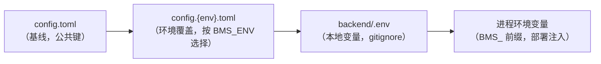

# 配置管理详细设计

> BMS · 阶段一 / 03 后端基础能力 · 子任务 01 · 任务级详细设计（可落地、可逐项验收）

[文档首页](../../../../../../文档首页.md) › [03 后端基础能力](../../03_后端基础能力.md) › [01 配置管理](../03_后端基础能力_01_配置管理.md) › 详细设计　|　[← 父任务](../03_后端基础能力_01_配置管理.md)

## 1. 概述 <a id="overview"></a>

本文档是任务 [01 配置管理](../03_后端基础能力_01_配置管理.md) 的**详细设计**，粒度到「按序落地、逐条验收」，位于 `bms文档/设计/` 全局粗设计之下一级；与全局设计不一致时以本文档为 03-1 的执行依据，不一致点记录于 [第 14 节](#align)。

上游依据（可追溯）：

- 需求 [03-1](../../../../需求/03_需求_后端基础能力.md#r03-1)、[02-10](../../../../需求/02_需求_后端基座.md#r02-10)
- 《[项目规划说明](../../../../../../规划/项目规划说明.md)》「环境与配置」「部署与运维」节
- 《[架构设计 · 后端基础类体系](../../../../../../设计/架构设计/04_架构设计_后端基础类体系.md)》「core 横切基座」节
- 《[后端开发规范](../../../../../../规范/后端开发规范.md)》「目录与分层职责」节、《[命名规范](../../../../../../规范/命名规范.md)》「基础设施命名」节
- 《[部署发布规范](../../../../../../规范/部署发布规范.md)》「环境管理」节、《[开发部署规划](../../../../../../规划/开发部署规划.md)》「配置与凭据管理」节

与前后任务的关系：02-10（[配置基座结构占位](../../../02_后端基座/02_后端基座_03_core横切基座/02_后端基座_03_core横切基座_02_配置基座结构占位/02_后端基座_03_core横切基座_02_配置基座结构占位.md)）已交付 `app/core/config.py` 的结构占位（分区模型 + `get_settings()`，只返默认值、不读文件）；本任务在其上落**真实读取 + 环境分层 + `BMS_` 覆盖 + 启动校验**，落地后回填 02-10 基座登记。03-2 日志体系消费 `[log]`、03-3 健康检查消费 `[redis]`，均依赖本任务的真实配置入口。

## 2. 现状与差距 <a id="gap"></a>

| 项 | 现状（02-10 交付） | 本任务目标 | 动作 |
| --- | --- | --- | --- |
| `app/core/config.py` | 分区模型 + `get_settings()` 返回默认值，**不读文件 / env** | pydantic-settings 建模、真实读取、分层覆盖、启动校验 | 重写 |
| `backend/config.toml` | 仅注释头（03-1 填充） | 基线分区与关键键清单 + 逐项中文注释 | 填充 |
| 环境分层文件 | 缺失 | `config.dev.toml` / `config.test.toml` / `config.prod.toml`（按 `BMS_ENV` 覆盖） | 新建 |
| `backend/.env.example` | 缺失 | 列出全部 `BMS_` 应用键与占位示例值 | 新建 |
| 启动校验 | 无（默认值恒合法） | 缺必填键 / 类型取值非法 / `BMS_ENV` 非法 / 未知拼错键四类启动失败并指出键名 | 新增 |
| `app/main.py` lifespan | 仅模块注册校验 + 资源释放 | 增补配置启动校验（prod 密钥、WorkerId 接线） | 修改 |
| `app/db/engine.py` | 直接用 `target.url` | 改用 `target.resolved_url()`（兼容密码分字段注入） | 修改 |
| `tests/core/test_config.py` | Kiwi 32 结构占位用例 | 保留结构回归，新增真实加载用例（新编号） | 修改 |

## 3. 交付物清单 <a id="tree"></a>

```text
backend/
├── config.toml              # 修改：基线分区与关键键清单（逐项中文注释，不含密钥）
├── config.dev.toml          # 新增：dev 覆盖（日志 console/DEBUG、CORS 放行本地前端）
├── config.test.toml         # 新增：test 覆盖（日志 json/INFO、CORS 空）
├── config.prod.toml         # 新增：prod 覆盖（日志 json/WARNING、CORS 空）
├── .env.example             # 新增：全部 BMS_ 应用键与占位示例值（密钥留空）
├── app/core/config.py       # 修改：真实加载 / 分层 / 覆盖 / 校验 / 密码兼容
├── app/main.py              # 修改：lifespan 增补配置启动校验
├── app/db/engine.py         # 修改：取用 resolved_url()
├── tests/core/test_config.py # 修改：保留 Kiwi 32 回归 + 新增真实加载用例
├── tests/conftest.py        # 修改：BMS_ 环境变量清理 + 配置缓存清理夹具
└── README.md                # 修改：目录树补 config.{env}.toml 与 .env.example

bms文档/
├── 设计/架构设计/04_架构设计_后端基础类体系.md  # 修改：§4 表行与 §6 配置基座条目改为「真实读取」
├── 后端基类清单.md                              # 修改：配置基座状态改为「已交付（真实读取）」
└── 项目/01_项目骨架/需求/02_需求_后端基座.md    # 修改：02-10 实现期要点注块回填
```

> 无空目录、无 `.gitkeep`；`config.{env}.toml` 与 `config.toml` 均入库（不含任何密钥与本地资源信息）。

## 4. 配置分层与文件设计 <a id="layering"></a>

### 4.1 加载优先级 <a id="priority"></a>

采用「基线文件 + 环境覆盖文件」，叠加顺序为**低 → 高**（后者覆盖前者）：



- 基线 `config.toml`：所有分区的公共键与安全默认值（无密钥、无本地资源）。
- 环境覆盖 `config.{env}.toml`：仅承载三环境差异（日志级别 / 格式、CORS、debug）。
- `backend/.env`：本地开发覆盖（复制 `.env.example` 而来，gitignore）；进程环境变量优先级最高（12-factor 部署注入）。

### 4.2 环境选择 <a id="env-select"></a>

- 生效环境（`effective env`）解析顺序：**`BMS_ENV`（进程环境 → `backend/.env`）→ `config.toml` 的 `[app].env` → `dev`**。
- 取值域 `dev` / `test` / `prod`；**非法值启动失败**并指出 `BMS_ENV`（或 `[app].env`）。
- 生效环境**强制回写** `app.env`（`BMS_ENV` 为准，避免与 `[app].env` 两处漂移）；`BMS_APP__ENV` 不作为覆盖入口。
- 环境覆盖文件不存在时跳过（如 `BMS_ENV=test` 而 `config.test.toml` 缺失，则仅基线生效）。

### 4.3 `config.toml`（基线） <a id="base-file"></a>

```toml
# BMS 后端配置（基线；三环境差异见 config.dev.toml / config.test.toml / config.prod.toml）
# 环境由 BMS_ENV 指定（缺省取本文件 [app].env，再缺省 dev）；环境变量（BMS_ 前缀）优先级最高。
# 密钥类配置一律不写入本文件，经 BMS_ 环境变量注入。

[app]
# 应用名（进入 OpenAPI 与日志）
name = "BMS 基础管理系统"
# 运行环境（dev/test/prod；实际生效值由 BMS_ENV 决定并回写）
env = "dev"
# 调试开关（dev 覆盖为 true）
debug = false
# 雪花 ID WorkerId（0~1023，同环境多副本须全局唯一）
worker_id = 0

[server]
# 监听地址
host = "0.0.0.0"
# 监听端口
port = 8000
# 工作进程数
workers = 1

[log]
# 日志级别（DEBUG/INFO/WARNING/ERROR/CRITICAL；真实渲染见 03-2）
level = "INFO"
# 渲染形态（console 可读 / json 单行；真实渲染见 03-2）
format = "json"
# 慢请求阈值（毫秒）
slow_request_ms = 1000

[database.platform]
# 平台库连接串（不含密码；密码经 BMS_DATABASE__PLATFORM__PASSWORD 或完整 URL 注入）
url = "sqlite+aiosqlite:///./bms_platform.db"
# 只读副本连接串（可选，空表示不分离）
replicas = []
[database.platform.pool]
# 连接池参数（SQLite 不生效）
pool_size = 5
max_overflow = 10
pool_timeout = 30.0
pool_recycle = 1800

[database.tenants]
# 租户库连接串模板（每租户库经 EngineRegistry 解析，MVP 占位为单文件）
url = "sqlite+aiosqlite:///./bms_tenant_demo.db"
replicas = []
[database.tenants.pool]
pool_size = 5
max_overflow = 10
pool_timeout = 30.0
pool_recycle = 1800

[database.archive]
# 归档库连接串（只读）
url = "sqlite+aiosqlite:///./bms_archive.db"
replicas = []
[database.archive.pool]
pool_size = 5
max_overflow = 10
pool_timeout = 30.0
pool_recycle = 1800

[redis]
# Redis 连接串（密钥经 BMS_REDIS__URL 注入）
url = "redis://localhost:6379/0"

[minio]
# 对象存储（占位；真实接入随文件管理阶段）
endpoint = ""
access_key = ""
secret_key = ""
bucket = "bms"
secure = false

[security]
# 安全（占位；真实实现随认证阶段）；secret_key 仅经环境变量注入
secret_key = ""
algorithm = "HS256"
access_token_expire_minutes = 60

[cors]
# 允许来源（dev 覆盖放行前端开发服务器；test/prod 空，生产由 nginx 同源反代）
allow_origins = []
allow_methods = ["*"]
allow_headers = ["*"]
allow_credentials = true
```

### 4.4 三环境覆盖文件 <a id="overlay-files"></a>

`config.dev.toml`（`BMS_ENV=dev`，缺省环境）：

```toml
# dev 环境覆盖（可读日志 + 放行本地前端开发服务器）
[app]
debug = true

[log]
level = "DEBUG"
format = "console"

[cors]
allow_origins = ["http://localhost:5173", "http://127.0.0.1:5173"]
```

`config.test.toml`（`BMS_ENV=test`，CI 三库集成 / E2E）：

```toml
# test 环境覆盖（结构化日志，不开放跨域）
[log]
level = "INFO"
format = "json"

[cors]
allow_origins = []
```

`config.prod.toml`（`BMS_ENV=prod`，客户交付）：

```toml
# prod 环境覆盖（结构化日志、收紧级别，不开放跨域）
[log]
level = "WARNING"
format = "json"

[cors]
allow_origins = []
```

> DB / Redis 等连接串的三环境差异由部署环境变量（`BMS_DATABASE__PLATFORM__URL` 等）注入，不写入覆盖文件，避免本地资源信息入库。

## 5. 配置模型设计 <a id="models"></a>

`app/core/config.py` 保留 02-10 的分区模型与 `BaseSettings`（配置分区公共基，继承 `BaseSchema`，拒绝未知键 / 字段名填充），在其上：

- 顶层 `Settings` 改为**多重继承 `pydantic_settings.BaseSettings` + 本地 `BaseSettings`**（`class Settings(PydanticBaseSettings, BaseSettings)`），从而启用 pydantic-settings 的源机制；MRO 为 `Settings → pydantic.BaseSettings → 本地 BaseSettings → BaseSchema → pydantic.BaseModel → BaseObject`，`BaseSchema` 的序列化与 `extra="forbid"` 配置保留。为避免命名冲突，pydantic-settings 的基类别名导入（`BaseSettings as PydanticBaseSettings`）。

### 5.1 关键字段与必填口径 <a id="fields"></a>

**核心键必填**（模型无默认值，缺失即启动失败）；**密钥与占位键可选**（给默认值，prod 再校验非空）。

| 分区 | 键 | 必填 | 默认 | 环境变量覆盖 |
| --- | --- | --- | --- | --- |
| app | name | 是 | — | `BMS_APP__NAME` |
| app | env | 否 | `dev` | 由 `BMS_ENV` 决定（不回改） |
| app | debug | 否 | `false` | `BMS_APP__DEBUG` |
| app | worker_id | 否 | `0`（0~1023） | `BMS_APP__WORKER_ID` |
| server | host | 是 | — | `BMS_SERVER__HOST` |
| server | port | 是 | — | `BMS_SERVER__PORT` |
| server | workers | 否 | `1` | `BMS_SERVER__WORKERS` |
| log | level | 是 | — | `BMS_LOG__LEVEL` |
| log | format | 否 | `json`（`console`/`json`） | `BMS_LOG__FORMAT` |
| log | slow_request_ms | 否 | `1000` | `BMS_LOG__SLOW_REQUEST_MS` |
| database.platform | url | 是 | — | `BMS_DATABASE__PLATFORM__URL` |
| database.platform | password | 否 | `""` | `BMS_DATABASE__PLATFORM__PASSWORD` |
| database.platform | replicas | 否 | `[]` | `BMS_DATABASE__PLATFORM__REPLICAS` |
| database.platform.pool | pool_size / max_overflow / pool_timeout / pool_recycle | 否 | `5 / 10 / 30.0 / 1800` | `BMS_DATABASE__PLATFORM__POOL__*` |
| database.tenants / archive | 同上（url 有默认 SQLite 文件） | 否 | dev SQLite | `BMS_DATABASE__TENANTS__*` / `BMS_DATABASE__ARCHIVE__*` |
| redis | url | 否 | `redis://localhost:6379/0` | `BMS_REDIS__URL` |
| minio | endpoint / access_key / secret_key / bucket / secure | 否 | `"" / "" / "" / bms / false` | `BMS_MINIO__*` |
| security | secret_key / algorithm / access_token_expire_minutes | 否 | `"" / HS256 / 60` | `BMS_SECURITY__*` |
| cors | allow_origins / allow_methods / allow_headers / allow_credentials | 否 | `[] / ["*"] / ["*"] / true` | `BMS_CORS__*` |

- `log.level` 经校验归一化为大写，取值限 `{DEBUG, INFO, WARNING, ERROR, CRITICAL}`；`log.format` 用 `Literal["console", "json"]`。
- `app.worker_id` 用 `Field(ge=0, le=1023)` 约束。
- 复杂类型（`replicas` / `allow_origins` 等）环境变量按 **JSON 数组**解析（pydantic-settings 标准形态）。

### 5.2 敏感项注入（两者兼容） <a id="secrets"></a>

`DatabaseTargetSettings` 新增 `password: str = ""` 并提供 `resolved_url()`：

- **完整 URL 覆盖**：`BMS_DATABASE__PLATFORM__URL` 传含密码完整 URL，直接生效（部署主用法，与《开发部署规划》示例一致）。
- **分字段注入**：`BMS_DATABASE__PLATFORM__PASSWORD` 非空时，`resolved_url()` 用 `sqlalchemy.engine.make_url(url).set(password=...)` 合成（`password` 字段优先级高于 URL 内已有密码）。
- `resolved_url()` 返回的连接串**可能含密码**，仅用于建引擎、禁止写入日志；`config.toml` 与覆盖文件始终不含密码。

## 6. 加载与校验设计 <a id="loader"></a>

### 6.1 加载实现 <a id="load-impl"></a>

```python
_ENVIRONMENTS = ("dev", "test", "prod")
_CONFIG_DIR = Path(__file__).resolve().parents[2]          # backend/
_BASE_CONFIG = "config.toml"


def _config_dir() -> Path:
    """配置目录（默认 backend/ 根；测试可 monkeypatch）。"""
    return _CONFIG_DIR


def _resolve_environment() -> str:
    """解析生效环境：BMS_ENV（进程 / .env）→ config.toml [app].env → dev；非法值报错。"""
    raw = os.environ.get("BMS_ENV", "").strip()
    if not raw and (_config_dir() / ".env").is_file():
        raw = (dotenv_values(_config_dir() / ".env").get("BMS_ENV") or "").strip()
    if not raw:
        base = _config_dir() / _BASE_CONFIG
        if base.is_file():
            raw = str(tomllib.loads(base.read_text(encoding="utf-8")).get("app", {}).get("env", "")).strip()
    if not raw:
        return "dev"
    if raw not in _ENVIRONMENTS:
        raise ConfigError(f"环境取值非法：{raw}（允许 dev/test/prod；由 BMS_ENV 或 [app].env 指定）")
    return raw


class _EnvSelectorSource(PydanticBaseSettingsSource):
    """强制回写 app.env = 生效环境 的配置源（优先级最高）。"""

    def __init__(self, settings_cls: type[PydanticBaseSettings], env: str) -> None:
        super().__init__(settings_cls)
        self._env = env

    def get_field_value(self, field: FieldInfo, field_name: str) -> tuple[Any, str, bool]:
        return None, "", False

    def __call__(self) -> dict[str, Any]:
        return {"app": {"env": self._env}}
```

`Settings.settings_customise_sources` 组装源（**优先序高 → 低**）：

```python
@classmethod
def settings_customise_sources(
    cls, settings_cls, init_settings, env_settings, dotenv_settings, file_secret_settings
):
    env = _resolve_environment()
    overlay = _config_dir() / f"config.{env}.toml"
    files = [_config_dir() / _BASE_CONFIG] + ([overlay] if overlay.is_file() else [])
    return (
        _EnvSelectorSource(settings_cls, env),      # 1 生效环境回写 app.env
        init_settings,                              # 2 显式入参
        env_settings,                               # 3 进程环境变量 BMS_
        dotenv_settings,                            # 4 backend/.env
        file_secret_settings,                       # 5 密钥目录（预留）
        TomlConfigSettingsSource(                   # 6 TOML：基线 → 环境覆盖（深合并）
            settings_cls, toml_file=files, deep_merge=True
        ),
    )
```

- `toml_file` 传**路径列表** + `deep_merge=True`：按序深合并，后文件覆盖前文件（仅覆盖出现的键）。
- `SettingsConfigDict`：`env_prefix="BMS_"`、`env_nested_delimiter="__"`、`env_file=_CONFIG_DIR / ".env"`、`extra="forbid"`、`populate_by_name=True`、`case_sensitive=False`。

### 6.2 启动校验与读取接口 <a id="getter"></a>

```python
def load_settings() -> Settings:
    """读取并校验配置；失败时汇总键名并抛 ConfigError。"""
    try:
        return Settings()
    except ValidationError as exc:
        raise ConfigError(_summarize(exc)) from exc


@lru_cache(maxsize=1)
def get_settings() -> Settings:
    """取应用配置单例（首次取用即读取 + 校验）。"""
    return load_settings()


def validate_startup(settings: Settings) -> None:
    """启动期补充校验与接线（lifespan 调用）。"""
    if settings.app.env == "prod" and not settings.security.secret_key:
        raise ConfigError("生产环境必须提供 security.secret_key（BMS_SECURITY__SECRET_KEY）")
    configure_id_generator(settings.app.worker_id)
```

- `_summarize(ValidationError)` 仅取**键路径 + 原因**（`err["loc"]` 用 `.` 连接、`err["msg"]`），**不打印 `input_value`**，避免把密钥类输入写入日志 / 报错信息。
- `ConfigError` 定义于 `app/core/exceptions.py`（**纳入统一异常体系**）：`ConfigError(BizError)`，错误码 `ErrorCode.CONFIG=40001`（4xxxx 系统配置段，`http_status=500`），`config.py` 直接复用，不再本地定义；启动期抛出同样走应用启动失败路径（不经请求链路），但归属统一异常与错误码登记。`ErrorCode.CONFIG` 同步登记于《架构设计 · 接口与集成》「错误码分段」节与 `core/error_codes.py`。
- 首次取用即加载：`create_app()` 内 `get_settings()` 调用点即完成读取校验，配置错误在应用构造期失败快；`lifespan` 内再调 `validate_startup(get_settings())` 做 prod 密钥校验与 WorkerId 接线。

### 6.3 四类失败路径 <a id="failures"></a>

| 情形 | 触发 | 报错落点 | 是否指出键名 |
| --- | --- | --- | --- |
| 缺必填键 | `config.toml` 缺 `app.name` / `server.host` / `server.port` / `log.level` / `database.platform.url` | pydantic `missing` → `ConfigError` | 是（键路径，如 `database.platform.url`） |
| 类型 / 取值非法 | `server.port` 非整数、`log.format` 非 console/json、`app.worker_id` 越界、`log.level` 非法 | pydantic / 字段校验 → `ConfigError` | 是 |
| `BMS_ENV` 非法 | `BMS_ENV`（或 `[app].env`）∉ `{dev,test,prod}` | `_resolve_environment()` → `ConfigError` | 是（含 `BMS_ENV` / `[app].env` 提示） |
| 未知 / 拼错键 | `config.toml` / 覆盖文件出现未知分区或键（`extra="forbid"`） | pydantic `extra_forbidden` → `ConfigError` | 是（键路径，如 `log.levle`） |

## 7. 环境变量与 `.env.example` <a id="env-example"></a>

`backend/.env.example` 列出全部 `BMS_` 应用键与占位示例值（密钥占位留空），与 `deploy/.env`（基础设施凭据）严格分开：

```dotenv
# BMS 后端环境变量模板：复制为 backend/.env 填实值（backend/.env 已 gitignore，不入库）
# 规则：环境变量优先级最高；嵌套键用双层下划线映射 config.toml 路径（BMS_<分区>__<键>）
# 密钥类只在此占位；基础设施凭据（库 root 口令、令牌等）只留 deploy/.env，两者不混

# ===== 环境选择 =====
BMS_ENV=dev

# ===== 应用 =====
BMS_APP__NAME=BMS 基础管理系统
BMS_APP__DEBUG=true
BMS_APP__WORKER_ID=0

# ===== 服务 =====
BMS_SERVER__HOST=0.0.0.0
BMS_SERVER__PORT=8000
BMS_SERVER__WORKERS=1

# ===== 日志 =====
BMS_LOG__LEVEL=DEBUG
# console（dev）| json（test / prod）
BMS_LOG__FORMAT=console
BMS_LOG__SLOW_REQUEST_MS=1000

# ===== 数据库（URL 不含密码；密码走 __PASSWORD 或完整 URL） =====
# 平台库：BMS_DATABASE__PLATFORM__URL=mysql+aiomysql://bms_dev@<host>:3306/bms_dev
BMS_DATABASE__PLATFORM__PASSWORD=
# 只读副本（JSON 数组）：BMS_DATABASE__PLATFORM__REPLICAS=["mysql+aiomysql://..."]
# 连接池：BMS_DATABASE__PLATFORM__POOL__POOL_SIZE=5 ...
# 租户库 / 归档库同构：BMS_DATABASE__TENANTS__URL / BMS_DATABASE__ARCHIVE__URL ...
BMS_DATABASE__TENANTS__PASSWORD=
BMS_DATABASE__ARCHIVE__PASSWORD=

# ===== Redis =====
# BMS_REDIS__URL=redis://<host>:6379/0

# ===== MinIO（占位，随文件管理阶段） =====
# BMS_MINIO__ENDPOINT=http://<host>:9000
BMS_MINIO__ACCESS_KEY=
BMS_MINIO__SECRET_KEY=
# BMS_MINIO__BUCKET=bms

# ===== 安全（占位，随认证阶段） =====
BMS_SECURITY__SECRET_KEY=
# BMS_SECURITY__ALGORITHM=HS256
# BMS_SECURITY__ACCESS_TOKEN_EXPIRE_MINUTES=60

# ===== 跨域 =====
# BMS_CORS__ALLOW_ORIGINS=["http://localhost:5173"]
# BMS_CORS__ALLOW_METHODS=["*"]
# BMS_CORS__ALLOW_HEADERS=["*"]
# BMS_CORS__ALLOW_CREDENTIALS=true
```

> `app.env` 由 `BMS_ENV`（或 `[app].env`）决定，故不列 `BMS_APP__ENV`；`BMS_ENV` 亦支持写在 `backend/.env`。

## 8. 应用基类体系与集成点 <a id="integration"></a>

| 集成点 | 文件 | 改动 |
| --- | --- | --- |
| 启动校验 | `app/main.py` lifespan | `validate_startup(get_settings())`（prod 密钥校验 + `configure_id_generator`） |
| 引擎取连接串 | `app/db/engine.py` | `target.url` → `target.resolved_url()`（两处），兼容密码分字段注入 |
| 日志级别 | `app/core/logging.py` | 不变（已在 `configure_logging(settings)` 读 `settings.log.level`，生产由 03-2 接管） |
| 雪花 ID | `app/core/id.py` | `initial_worker_id()` 与 `BMS_WORKER_ID` 旧名兜底已移除（2026-09-14 闭环）；WorkerId 仅经配置 `app.worker_id`（`BMS_APP__WORKER_ID`）启动期 `configure_id_generator` 注入，导入期默认 0 |
| 模型基类 | `app/core/config.py` | `Settings` 纳入 `BaseObject` 体系（`to_dict` / `to_json` 可用），分区模型继承 `BaseSettings` |

> `Settings` 是唯一边界模型（函数式 `get_settings()` 非类继承）；分区模型与 `Settings` 均继承 `BaseSchema`，稳定序列化由 `BaseObject` 统一提供。

## 9. 测试设计（Kiwi 先行） <a id="tests"></a>

**先登记 Kiwi TCMS 用例取得编号，再写代码并标注 `@pytest.mark.kiwi_id(N)`**。原 Kiwi 32（配置占位：分区 / 默认 / 单例 / 序列化 / `extra=forbid`）作为结构回归**保留**；本任务新增用例在平台**新登记编号**（预计 62 起，实施时以平台自增主键为准并回填）。

| 拟登记用例 | 类型 | 断言要点 |
| --- | --- | --- |
| 缺省环境 | 加载 | 无 `BMS_ENV` 时 `app.env == "dev"`；dev 覆盖生效（`log.level=DEBUG`、`format=console`、`app.debug=true`、CORS 放行 localhost:5173） |
| test 环境 | 加载 | `BMS_ENV=test` → `app.env=test`、`log.level=INFO`、`format=json`、`cors.allow_origins == []` |
| prod 环境 | 加载 | `BMS_ENV=prod` → `app.env=prod`、`log.level=WARNING` |
| 环境变量覆盖 | 覆盖 | `BMS_DATABASE__PLATFORM__URL` 注入后覆盖生效；`BMS_SERVER__PORT` 覆盖 |
| 分层优先级 | 覆盖 | 进程环境 > `.env` > `config.{env}.toml` > `config.toml`（逐层覆盖验证） |
| 密码分字段 | 覆盖 | `BMS_DATABASE__PLATFORM__PASSWORD` 注入后 `resolved_url()` 含密码；空密码时 `resolved_url() == url` |
| `BMS_ENV` 非法 | 失败 | 取 `staging` → `ConfigError`，信息含 `BMS_ENV` |
| 缺必填键 | 失败 | 临时配置缺 `database.platform.url` → `ConfigError`，信息含键路径 |
| 类型 / 取值非法 | 失败 | `BMS_SERVER__PORT=abc`、`log.format=text`、`worker_id=2000` → `ConfigError` |
| 未知 / 拼错键 | 失败 | 临时配置加 `[log] levle="X"` / 未知分区 → `ConfigError`，信息含键路径 |
| prod 密钥校验 | 启动 | `app.env=prod` 且 `security.secret_key` 为空 → `validate_startup` 抛 `ConfigError` |
| WorkerId 接线 | 启动 | `validate_startup` 后 `configure_id_generator` 生效（`generate_id()` 正常产出） |
| 单例与序列化 | 结构 | `get_settings() is get_settings()`；`cache_clear()` 后重载；`to_dict()` 含八分区 |

**测试隔离**：`tests/conftest.py` 增 autouse 夹具——清理 `BMS_*` 环境变量、`get_settings.cache_clear()`，避免本机 `backend/.env` 或环境变量污染；涉及临时配置的用例用 `monkeypatch.setattr(config, "_config_dir", lambda: tmp_path)` + `_env_file=None`。

## 10. 实施步骤 <a id="steps"></a>

1. **Kiwi 登记**：在 Kiwi TCMS 先登记本任务用例（第 9 节清单）并取得编号（产品「BMS 基础管理系统」/ 分类「后端基础能力」）。
2. **配置文件**：写 `config.toml`（基线）+ 三份 `config.{env}.toml` + `.env.example`（§4 / §7）。
3. **配置实现**：重写 `app/core/config.py`（源组装、环境解析、`_EnvSelectorSource`、`ConfigError`、`load_settings` / `get_settings` / `validate_startup`、`resolved_url`）。
4. **集成**：`main.py` lifespan 调 `validate_startup`；`db/engine.py` 改用 `resolved_url()`。
5. **测试**：更新 `tests/conftest.py`；在 `tests/core/test_config.py` 保留 Kiwi 32 回归并新增真实加载用例（标注新 `kiwi_id`）。
6. **文档回写**：更新 `04_架构设计_后端基础类体系.md`、`后端基类清单.md`、`02_需求_后端基座.md`（02-10 注块）、`backend/README.md`。
7. **验证**：`uv run pytest --cov=app -q`、`uv run ruff check .`、`uv run ruff format --check .`、`uv run pyright`、`python3 scripts/tools/base-check/check-base.py` 全绿；新增模块覆盖率 100%。
8. **提交**：代码（`feat(config)`）与文档（`docs(项目)`）分开提交；经用户明确指令后执行（链内自动、推送需两级确认）。

## 11. 验收映射 <a id="accept-map"></a>

| 完成标准（需求 03-1） | 设计落点 | 验证方法 |
| --- | --- | --- |
| 三环境按分层覆盖正确加载（缺省 dev） | §4 / §6.1 | 测试「缺省 / test / prod 环境」 |
| `BMS_DATABASE__PLATFORM__URL` 覆盖生效 | §6.1 / §5.2 | 测试「环境变量覆盖」 |
| 缺必填键 / 类型取值非法 / `BMS_ENV` 非法 / 未知拼错键四类启动失败并指出键名 | §6.2 / §6.3 | 测试「四类失败路径」 |
| 三环境差异处（日志级别、CORS）加载正确 | §4.4 | 测试「三环境」 |
| 密钥不出现在 `config.toml`、`.env.example`、日志 | §4.3 / §5.2 / §6.2 / §7 | 代码核对（文件无密钥、`_summarize` 不打印输入值） |
| 单测覆盖加载 / 覆盖 / 校验失败路径，覆盖率随门禁，用例同步 Kiwi | §9 | `pytest --cov` + Kiwi 登记 |
| 回填 02-10 基座登记 | §12 | 架构节点 / 基类清单登记核对 |

## 12. 职责边界与登记落点 <a id="boundary"></a>

**职责边界**：

| 事项 | 归属 |
| --- | --- |
| `config.toml` / 分层覆盖 / `BMS_` 覆盖 / 启动校验 / `.env.example` / 密码兼容 | **03-1（本文档）** |
| 配置分区模型与 `get_settings()` 结构签名 | 02-10（已完成，本任务回填） |
| structlog 结构化输出、上下文字段、脱敏、请求日志中间件 | 03-2（消费 `[log]`） |
| `/healthz` `/readyz` 探针与 `redis` 检查项 | 03-3（消费 `[redis]`） |
| 安全原语真实实现（secret_key 用途） | 认证阶段 |

**登记落点**（实施完成后回写）：

| 落点 | 修改 |
| --- | --- |
| `bms文档/设计/架构设计/04_架构设计_后端基础类体系.md` | §4 基类表中 `BaseSettings` / 配置基座行状态改为「已交付（真实读取）」；§6「配置基座」条目补真实读取与分层 |
| `bms文档/后端基类清单.md` | 「配置基座」状态「已交付（结构占位）」→「已交付（真实读取）」 |
| `bms文档/项目/01_项目骨架/需求/02_需求_后端基座.md` | 02-10 实现期要点注块补「真实读取已由 03-1 完成并回填」 |
| 任务 03-1 / 父任务 03 / 需求 03-1 / 计划 03_01 | 状态、完成日期、偏差与遗留三处一致 |

## 13. 风险与开放项 <a id="risk"></a>

| 风险 / 开放项 | 说明 | 处置 |
| --- | --- | --- |
| `BMS_WORKER_ID` 与 `BMS_APP__WORKER_ID` 并存 | `id.py` 导入期读 `BMS_WORKER_ID`，配置为 `BMS_APP__WORKER_ID` | **已闭环（2026-09-14 按用户拍板直接移除旧名）**：删除 `id.py` 的 `initial_worker_id()` 与 `BMS_WORKER_ID` 导入期兜底，WorkerId 统一 `BMS_APP__WORKER_ID`（启动期 `configure_id_generator` 生效）；Kiwi 30 用例与 02-4-04 设计 / 记录同步回写 |
| prod `security.secret_key` 非空校验 | 认证阶段尚未实现，prod 仍属占位 | 先按非空校验；认证阶段按实际密钥形态复核（可放宽或调整键名） |
| 临时配置测试的路径注入 | 加载器锚定 backend 根 | 通过 monkeypatch `_config_dir()` 指向临时目录；`.env` 用 `_env_file=None` 隔离 |
| 连接串含密码进入内存 | 兼容完整 URL 覆盖，故 `resolved_url()` 可能含密码 | 仅用于建引擎；日志脱敏由 03-2 统一承接，本任务不打印配置值 |
| 覆盖文件命名 | 需求只提 `config.toml` | 环境覆盖文件由详细设计补充（需求允许新增键 / 结构），已在 §14 记录 |

## 14. 对齐记录 <a id="align"></a>

| # | 事项 | 定稿口径 | 落点 |
| --- | --- | --- | --- |
| 1 | 环境分层 | **基线 `config.toml` + 环境覆盖 `config.{env}.toml`**，按 `BMS_ENV` 选择，深合并 | §4 |
| 2 | `app.env` 与 `BMS_ENV` | `BMS_ENV` 为准；未设置时取 `[app].env`；生效值强制回写 `app.env` | §4.2 / §6.1 |
| 3 | 必填键 | 核心键必填（name / host / port / level / platform.url），密钥与占位键可选、prod 再校验 | §5.1 / §6.2 |
| 4 | 敏感项注入 | **两者兼容**：完整 URL 覆盖 + `password` 分字段（经 `resolved_url()` 合成） | §5.2 |
| 5 | `.env` 读取 | 读取 `backend/.env`（gitignore），进程环境变量优先级更高 | §6.1 / §7 |
| 6 | 加载校验时机 | 首次取用即加载校验（`create_app` 失败快）；lifespan 补充启动校验 | §6.2 |
| 7 | 三环境差异值 | dev：DEBUG/console/CORS localhost；test：INFO/json/CORS 空；prod：WARNING/json/CORS 空 | §4.4 |
| 8 | 未知键拦截 | `extra="forbid"`（顶层与分区内均拒绝），报错含键路径 | §6.1 / §6.3 |
| 9 | `config.toml` 定位 | 以 `backend/` 根为锚（`__file__` 上溯），与 CWD 无关 | §6.1 |
| 10 | WorkerId 接线 | 新增 `app.worker_id`（`BMS_APP__WORKER_ID`），启动时 `configure_id_generator` | §5.1 / §6.2 |
| 11 | Kiwi 编号 | 保留 Kiwi 32 结构回归；新增用例在平台**新登记编号**后回填 | §9 |
| 12 | 环境覆盖文件 | 新增 `config.{env}.toml`（需求只锁 `config.toml` 分区与关键键，允许详细设计补充） | §4.1 / §4.4 |
| 13 | `ConfigError` 基类 | 纳入统一异常体系：`ConfigError(BizError)`（`ErrorCode.CONFIG=40001`，4xxxx 系统配置段），定义于 `core/exceptions.py` | §6.2 |
| 14 | WorkerId 旧名移除（2026-09-14 偏差闭环） | 按用户拍板直接移除 `BMS_WORKER_ID` 导入期兜底（`initial_worker_id()` 删除），WorkerId 统一 `BMS_APP__WORKER_ID`；Kiwi 30 用例与 02-4-04 设计 / 记录同步 | §8 / §13 |

> 本文档依《文档生成规范》编写 · 关键决策逐项确认
