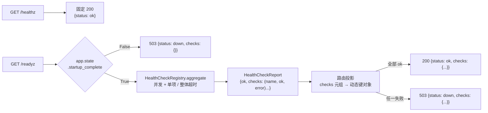

# 健康检查详细设计

> BMS · 阶段一 / 03 后端基础能力 · 子任务 03 · 任务级详细设计（可落地、可逐项验收）

[文档首页](../../../../../../文档首页.md) › [03 后端基础能力](../../03_后端基础能力.md) › [03 健康检查](../03_后端基础能力_03_健康检查.md) › 详细设计　|　[← 父任务](../../03_后端基础能力.md)

## 1. 概述 <a id="overview"></a>

本文档是任务 [03 健康检查](../03_后端基础能力_03_健康检查.md) 的**详细设计**，粒度到「按序落地、逐条验收」；与全局设计不一致时以本文档为 03-3 的执行依据，不一致点记录于 [第 14 节](#align)。

上游依据（可追溯）：

- 需求 [03-3](../../../../需求/03_需求_后端基础能力.md#r03-3)、[02-39](../../../../需求/02_需求_后端基座.md#r02-39)（健康检查项基座，本任务落地真实实现并回填登记）
- 《[项目规划说明](../../../../../../规划/项目规划说明.md)》「部署与运维」「基础设施编排」节
- 《[API接口规范](../../../../../../规范/API接口规范.md)》「URL 与资源设计」「统一响应」节（两探针豁免 `{code, message, data}` 包裹）、《[后端开发规范](../../../../../../规范/后端开发规范.md)》「后端基座体系（强制）」「目录与分层职责」节
- 《[架构设计 · 可观测性](../../../../../../设计/架构设计/27_架构设计_子系统_可观测性.md)》「健康检查与优雅停机」节、《[架构设计 · 后端基础类体系](../../../../../../设计/架构设计/04_架构设计_后端基础类体系.md)》「core 横切基座」节

与前后任务的关系：02-3-12（[健康检查项注册表基座](../../../02_后端基座/02_后端基座_03_core横切基座/02_后端基座_03_core横切基座_12_健康检查项注册表基座/02_后端基座_03_core横切基座_12_健康检查项注册表基座.md)）已交付 `BaseHealthCheck` / `BaseHealthCheckRegistry` 契约、聚合模板、`NullHealthCheckRegistry` 占位与 `/readyz` 占位聚合路由；02-5-1（[数据访问底座](../../../02_后端基座/02_后端基座_05_机制底座/02_后端基座_05_机制底座_01_数据访问底座/02_后端基座_05_机制底座_01_数据访问底座.md)）已交付 `EngineFactory` / `EngineRegistry`（SQLite 可跑）供 `database` 检查项取连接对象；03-1（[配置管理](../../03_后端基础能力_01_配置管理/03_后端基础能力_01_配置管理.md)）已交付 `get_settings().redis.url` 与配置分层入口；03-2（[日志体系](../../03_后端基础能力_02_日志体系/03_后端基础能力_02_日志体系.md)）已将 `/healthz` `/readyz` 列入请求日志排除清单。本任务在以上基座上落**真实 redis / database 检查项、探针响应契约与启动完成态判定**，完成后回填 02-39 基座登记。

## 2. 现状与差距 <a id="gap"></a>

| 项 | 现状（02-3-12 交付） | 本任务目标 | 动作 |
| --- | --- | --- | --- |
| `app/health/base.py` 数据契约 | `HealthCheckResult{name, healthy, detail}` / `HealthCheckReport{healthy, items}`；`aggregate` 串行遍历、单项异常兜底固定文案「检查执行异常」 | 契约改为响应形态 `{name, ok, error}` / `{ok, checks}`；`aggregate` 并发执行 + 单项 / 整体两级超时 + 兜底写异常类名 | 修改（契约升级，用户拍板） |
| `app/health/` 真实实现 | 仅 `NullHealthCheckRegistry`（固定通过、不探依赖） | 新增真实内存注册表 `HealthCheckRegistry` 与 `RedisHealthCheck` / `DatabaseHealthCheck` | 新增 `registry.py` / `checks.py` |
| `app/api/health.py` `/readyz` | 占位聚合：`status ∈ {ok, degraded}`、`checks` 为列表、无启动态判定 | 需求契约：`status ∈ {ok, down}`、`checks` 为动态键对象、每项 `{ok, error}`；lifespan 初始化未完成期间一律 503 | 重写 |
| `config.toml` / `core/config.py` | 无健康检查超时配置 | 新增 `[health]` 分区（`check_timeout_ms` / `total_timeout_ms`）与 `HealthSettings` | 修改 |
| `app/main.py` | 装配 `NullHealthCheckRegistry`；无启动完成态；lifespan 无 shutdown 状态切换 | 装配真实注册表 + 两项检查项；`app.state.startup_complete` 由 lifespan 维护 | 修改 |
| `tests/health/`、`tests/api/test_health.py` | Kiwi 45 契约用例（`healthy` / `detail` / `items` 断言）；`/readyz` 占位 200 / 503 用例 | 契约断言随改名更新；新增探针响应契约与并发 / 超时 / 启动态用例 | 修改 / 新增 |

## 3. 交付物清单 <a id="tree"></a>

```text
backend/
├── config.toml                               # 修改：新增 [health] 分区（check_timeout_ms / total_timeout_ms）
├── .env.example                              # 修改：新增 BMS_HEALTH__CHECK_TIMEOUT_MS / BMS_HEALTH__TOTAL_TIMEOUT_MS
├── app/core/config.py                        # 修改：新增 HealthSettings 并入 Settings
├── app/health/base.py                        # 修改：契约更名为响应形态 + 超时常量 + 构造参数 + aggregate 并发/两级超时/类名兜底
├── app/health/registry.py                    # 新增：HealthCheckRegistry（真实内存注册表）
├── app/health/checks.py                      # 新增：RedisHealthCheck / DatabaseHealthCheck
├── app/api/health.py                         # 修改：/readyz 真实契约 + 启动完成态判定（/healthz 不变）
├── app/main.py                               # 修改：装配真实注册表与检查项、startup_complete 标志、lifespan 状态切换
├── tests/health/test_health_registry.py      # 修改：Kiwi 45 契约回归（改名）+ Kiwi 65 聚合并发 / 超时
├── tests/health/test_checks.py               # 新增：Kiwi 65 检查项单测（redis 桩 / 内存 SQLite）
├── tests/api/test_health.py                  # 修改：Kiwi 2 回归 + Kiwi 64 探针响应契约 + Kiwi 65 启动态
└── tests/integration/test_health_integration.py  # 新增：真实 Redis 集成用例（标 integration，随 04_02 启用）

bms文档/
├── 设计/架构设计/04_架构设计_后端基础类体系.md       # 修改：§6 健康检查条目改为「真实实现」
├── 设计/架构设计/27_架构设计_子系统_可观测性.md     # 修改：「健康检查与优雅停机」节补响应契约与超时口径
├── 后端基类清单.md                                   # 修改：健康检查项注册表行「占位」→「已交付（真实实现）」
├── 规范/API接口规范.md                               # 修改：「统一响应」节补探针豁免条款（裸结构 + 传输层状态码）
├── 项目/01_项目骨架/需求/02_需求_后端基座.md         # 修改：02-39 注块补「真实实现已由 03-3 完成并回填」
├── 项目/01_项目骨架/需求/03_需求_后端基础能力.md     # 修改：需求 03-3 状态 + 实现期要点注块
├── 项目/01_项目骨架/需求/00_需求_项目骨架.md         # 修改：03-3 状态与 03 域计数（2/3 → 3/3）
├── 项目/01_项目骨架/计划/01_计划_项目骨架.md         # 修改：03_03 行迁「已完成任务」表 + 剩余 / 里程碑回写 + §3.1 健康检查行销项
├── 项目/01_项目骨架/任务/03_后端基础能力.md          # 修改：子任务状态与状态说明
└── 项目/01_项目骨架/任务/03_后端基础能力_01_配置管理/ # 修改：03-1 设计键清单补 [health] 分区（跨任务回写）
```

## 4. 健康检查链路与组件设计 <a id="architecture"></a>

### 4.1 运行链路 <a id="flow"></a>



### 4.2 组件与职责 <a id="components"></a>

| 组件 | 文件 | 职责 |
| --- | --- | --- |
| `BaseHealthCheck`（不变） | `app/health/base.py` | 检查项契约：`name` + 异步 `check() -> HealthCheckResult` |
| `HealthCheckResult` / `HealthCheckReport`（改造） | `app/health/base.py` | 响应形态数据契约：单项 `{name, ok, error}`、报告 `{ok, checks}`；`error` 仅未就绪时为异常类名 |
| `BaseHealthCheckRegistry`（改造） | `app/health/base.py` | 注册表契约 + **聚合模板**：并发执行、单项 / 整体两级超时、异常类名兜底、注册顺序保序、空集视为就绪 |
| `NullHealthCheckRegistry`（保留） | `app/health/base.py` | 占位实现（无检查项、固定通过、不探依赖）；仍作契约回归基座 |
| `HealthCheckRegistry` | `app/health/registry.py` | 真实内存注册表：`register` 追加、`checks` 返回注册顺序元组；超时值经构造注入 |
| `RedisHealthCheck` | `app/health/checks.py` | `redis` 检查项：懒建 `redis.asyncio` 客户端 + `PING`；实现 `BaseAsyncResource.aclose` 释放连接 |
| `DatabaseHealthCheck` | `app/health/checks.py` | `database` 检查项：经 `EngineRegistry` 取平台引擎 + `SELECT 1` |
| `/readyz` 路由 | `app/api/health.py` | 启动完成态判定 → 聚合 → 响应投影 → 200 / 503（裸结构，不做 `{code, message, data}` 包裹） |
| 应用装配 | `app/main.py` | 构造注册表（注入配置超时值）、注册两项检查项、`RedisHealthCheck` 登记 `ResourceManager`、维护 `startup_complete` |

## 5. 基座契约与聚合设计 <a id="contract"></a>

### 5.1 数据契约（响应形态） <a id="datacontract"></a>

```python
@dataclass(frozen=True)
class HealthCheckResult(BaseObject):
    name: str                 # 检查项名称（依赖类取 DEPENDENCIES）
    ok: bool                  # 是否就绪
    error: str | None = None  # 未就绪原因——仅异常类名（就绪为 None）

@dataclass(frozen=True)
class HealthCheckReport(BaseObject):
    ok: bool                  # 总体是否就绪（全部检查项通过）
    checks: tuple[HealthCheckResult, ...] = ()  # 注册顺序，稳定
```

- `healthy` → `ok`、`detail` → `error`、`items` → `checks`（字段级更名，用户拍板「改基座契约」）。
- `error` 语义收敛为**异常类名**（如 `ConnectionError` / `TimeoutError`），不含连接串 / 堆栈 / SQL；人类可读文案不再进入探针响应。
- `/readyz` 的 `checks` JSON 对象由报告元组按注册顺序投影（键 = `name`），属序列化投影，不引入第二套契约。

### 5.2 超时常量与聚合算法 <a id="aggregate"></a>

- 常量（`app/health/base.py`）：`DEFAULT_CHECK_TIMEOUT_MS = 2000`、`DEFAULT_TOTAL_TIMEOUT_MS = 5000`。
- `BaseHealthCheckRegistry.__init__(*, check_timeout_ms=DEFAULT_CHECK_TIMEOUT_MS, total_timeout_ms=DEFAULT_TOTAL_TIMEOUT_MS)` 存为实例私有值；真实注册表由装配侧注入 `[health]` 配置生效值；占位 / 测试子类用默认值即可（向后兼容：无参构造不变）。
- `aggregate()` 算法（单点收敛，替换原串行实现）：

```python
async def aggregate(self) -> HealthCheckReport:
    checks = self.checks()
    if not checks:
        return HealthCheckReport(ok=True)  # 空集视为就绪

    results: dict[int, HealthCheckResult] = {}

    async def run(index, check):
        try:
            async with asyncio.timeout(self._check_timeout_ms / 1000):
                results[index] = await check.check()
        except Exception as exc:  # 超时（TimeoutError）与检查项异常统一收敛
            results[index] = HealthCheckResult(name=check.name, ok=False, error=type(exc).__name__)

    try:
        async with asyncio.timeout(self._total_timeout_ms / 1000):
            await asyncio.gather(*(run(i, c) for i, c in enumerate(checks)))
    except TimeoutError:
        pass  # 整体超时：未完成项按下文兜底

    ordered = tuple(
        results.get(i) or HealthCheckResult(name=check.name, ok=False, error="TimeoutError")
        for i, check in enumerate(checks)
    )
    return HealthCheckReport(ok=all(item.ok for item in ordered), checks=ordered)
```

- **并发**：`asyncio.gather` 并发执行全部检查项；结果按下标回填，输出保持**注册顺序**（稳定序）。
- **单项超时**：每项 `asyncio.timeout(check_timeout_ms)` 包裹，超时经外层 `except` 记 `error="TimeoutError"`。
- **整体超时**：`asyncio.timeout(total_timeout_ms)` 包裹 `gather`；超时后取消未完成项，未回填项统一 `error="TimeoutError"`（不影响已完成项结果）。
- **取消语义**：`CancelledError` 为 `BaseException`，不被 `except Exception` 吞掉，取消正常向上传播。
- **失败隔离**：单项异常 / 超时不中断其他项；空注册表 `ok=True`（未接入依赖不判定为失败）。

## 6. 检查项设计 <a id="checks"></a>

### 6.1 检查项清单与启用阶段 <a id="check-list"></a>

| 检查项 | `name`（取 `DEPENDENCIES`） | 探测方式 | 启用阶段 |
| --- | --- | --- | --- |
| `RedisHealthCheck` | `redis` | `redis.asyncio` 客户端 `PING` | 本任务（阶段一） |
| `DatabaseHealthCheck` | `database` | `EngineRegistry` 取平台引擎（`PLATFORM_DB_KEY`）+ `SELECT 1` | 本任务（数据访问底座已交付） |
| `minio`（未实现） | `minio` | 对象存储探针（`BaseObjectStorage` 注入） | 阶段八文件管理接入时注册（未注册即从 `checks` 省略） |

- 检查项**不自行捕获异常**：IO 异常 / 超时统一由 `aggregate` 兜底为异常类名，避免各检查项重复 try/except 与口径漂移。
- 检查项 `name` 与 `DEPENDENCIES` 对齐（单测断言 `name in DEPENDENCIES`）；注册顺序 `redis` → `database`（响应 `checks` 键序）。

### 6.2 `RedisHealthCheck` <a id="redis-check"></a>

- 继承 `BaseHealthCheck, BaseAsyncResource`（与 `NullHealthCheckRegistry` 同类多继承形态）；构造入参 `url`（装配侧取 `settings.redis.url`，03-1 生效值）。
- 懒建客户端：首次 `check` 时 `Redis.from_url(url)` 并缓存；`check` 调 `ping()`，成功返回 `HealthCheckResult(name="redis", ok=True)`。
- `aclose()` 关闭客户端并清空引用（幂等）；装配侧 `resources.register(redis_check)`，随应用生命周期释放（与 `EngineRegistry` 同机制）。
- URL 形态经 `[redis] url` 配置（含 `BMS_` 覆盖）；密码不入日志（03-2 脱敏域覆盖连接串密码）。

### 6.3 `DatabaseHealthCheck` <a id="db-check"></a>

- 构造注入 `EngineRegistry`（应用级单例）；`check` 经 `registry.get(PLATFORM_DB_KEY)` 取引擎，`async with engine.connect()` + `text("SELECT 1")` 执行。
- 语句与连接经 SQLAlchemy 异步接口，四库方言通用；`pool_pre_ping` 由 `EngineFactory` 承担，探针不额外建连接池。
- SQLite（开发 / 测试）下连接会创建空库文件（平台库 URL 指向文件时）；测试一律用内存库或桩引擎，避免落文件（见 §13）。

## 7. 探针路由与启动完成态设计 <a id="route"></a>

### 7.1 `/readyz` 响应契约 <a id="readyz"></a>

| 场景 | HTTP | 响应体 |
| --- | --- | --- |
| 全部就绪 | 200 | `{"status": "ok", "checks": {"redis": {"ok": true, "error": null}, "database": {"ok": true, "error": null}}}` |
| 任一未就绪 | 503 | `{"status": "down", "checks": {"redis": {"ok": false, "error": "ConnectionError"}, ...}}` |
| 启动未完成 | 503 | `{"status": "down", "checks": {}}` |

- `status` 取值域 `{ok, down}`（不再有 `degraded`）；`checks` 为动态键对象（注册哪个出现哪个）；每项 `{ok: bool, error: str|null}`。
- 未注册检查项（如未接入的 `minio`）从 `checks` 省略，不做「未接入即失败」判定。
- 两探针**豁免**《API接口规范》「统一响应」包裹，直接返回裸结构；HTTP 状态码保留传输层语义（200 / 503），不套用「业务失败统一 200」。
- 鉴权豁免：探针不在 Bearer 校验范围（与登录 / 刷新同列豁免清单，认证阶段落地时生效）；限流排除清单预留（阶段六）；请求日志排除已在 03-2 落地（不记任何级别）。

### 7.2 启动完成态 <a id="startup"></a>

- `app.state.startup_complete`：`create_app` 初始 `False`；lifespan startup 完成配置校验 / 模块注册校验后置 `True`；shutdown 开始（`yield` 返回）先置 `False` 再释放资源。
- `/readyz` 首判该标志：`False` → 立即 503 `{"status": "down", "checks": {}}`，**不执行依赖探测**（避免初始化中的实例被编排接入流量；shutdown 置 False 兼作对外摘流）。
- 行为边界：uvicorn 在 lifespan startup 完成前不接请求，该标志主要覆盖初始化窗口与优雅停机窗口，并为单测提供可判定的状态位。

### 7.3 路由与依赖 <a id="route-deps"></a>

- `/healthz` 与 `/readyz` 保持现有独立 `APIRouter`（`app/api/health.py`），`app/main.py` 统一 include（探针挂根路径）。
- `get_health_check_registry`（`app/api/deps.py` 已导出）取 `request.app.state.health_check_registry`；路由另取 `Request` 读 `startup_complete`。
- 路由**不硬编码**依赖检查、不另起聚合（《后端开发规范》「健康检查」强制口径）。

## 8. 配置与集成点 <a id="config"></a>

### 8.1 `[health]` 配置分区 <a id="health-config"></a>

- `config.toml` 新增（基线；三环境共用，不做环境差异）：

```toml
[health]
# 就绪探针单项检查超时（毫秒）
check_timeout_ms = 2000
# 就绪探针整体总超时（毫秒；建议 ≥ check_timeout_ms）
total_timeout_ms = 5000
```

- `app/core/config.py` 新增 `HealthSettings(BaseSettings)`：`check_timeout_ms: int = Field(2000, ge=1)`、`total_timeout_ms: int = Field(5000, ge=1)`；`Settings` 增 `health` 字段并计入未知键 / 类型校验体系。
- `backend/.env.example` 新增 `BMS_HEALTH__CHECK_TIMEOUT_MS` / `BMS_HEALTH__TOTAL_TIMEOUT_MS`（与既有键清单口径一致）。
- 约定：`total_timeout_ms < check_timeout_ms` 时整体超时先生效（未完成项按 `TimeoutError` 兜底），不做跨字段强校验，文档中注明。

### 8.2 应用装配（`app/main.py`） <a id="assembly"></a>

- 装配顺序：`settings` → `EngineFactory` / `EngineRegistry` / `ResourceManager`（既有）→ 构造 `HealthCheckRegistry(check_timeout_ms=settings.health.check_timeout_ms, total_timeout_ms=settings.health.total_timeout_ms)` → 注册 `RedisHealthCheck(settings.redis.url)` 与 `DatabaseHealthCheck(engine_registry)` → `resources.register(redis_check)` → `app.state.health_check_registry = health_registry`、`app.state.startup_complete = False`。
- lifespan：startup 校验通过后置 `startup_complete = True`；`yield` 结束（含异常）后置 `False` 并 `resources.aclose()`（现有释放链不变，`redis_check` 随逆序释放）。
- 移除 `NullHealthCheckRegistry` 装配（占位实现保留供契约回归与测试）。

### 8.3 相邻能力衔接 <a id="adjacent"></a>

| 衔接点 | 现状 | 本任务动作 |
| --- | --- | --- |
| 请求日志排除（03-2） | `/healthz` `/readyz` 已排除 | 无需改动 |
| 租户豁免路径（02-3-12） | 两探针已在豁免清单 | 无需改动 |
| 编排探针（部署阶段） | 计划 | 设计口径：`timeoutSeconds` 建议 ≥ 5s（覆盖整体总超时） |
| 依赖状态指标 / 监控展示（后续） | `HealthCheckReport` 供 `bms_dependency_up` 读取 | 契约字段更名后，消费方按新契约读取（尚无实现，无破坏面） |

## 9. 测试设计（Kiwi 先行） <a id="tests"></a>

**先登记 Kiwi TCMS 用例取得编号，再写代码并标注 `@pytest.mark.kiwi_id(N)`**。本任务新增 **2 条**用例（预计 64 / 65 起，实施时以平台自增主键为准并回填）；Kiwi 45（基座契约）随字段更名更新断言后**保留回归**；Kiwi 2（`/healthz`）保留。

| 拟登记用例 | 文件 | 断言要点 |
| --- | --- | --- |
| Kiwi 64 · 探针响应契约 | `tests/api/test_health.py` | `/readyz` 就绪 200：`status="ok"`、`checks` 键 = 注册项、每项 `{ok:true, error:null}`；未就绪 503：`status="down"`、`ok=false`、`error` 为异常类名；响应体无连接串 / 密码 / 堆栈；未注册检查项从 `checks` 省略；`/healthz` 回归固定 200 |
| Kiwi 65 · 聚合与启动态 | `tests/health/test_health_registry.py`、`tests/health/test_checks.py`、`tests/api/test_health.py` | 聚合并发（两慢检查执行区间重叠，总耗时 < 串行和）；单项超时 → `error="TimeoutError"`；整体超时 → 未完成项 `TimeoutError`、已完成项结果保留；异常兜底为类名（`RuntimeError`）；注册顺序保序；空注册表 `ok=True`；检查项 `name ∈ DEPENDENCIES`；redis 检查项 ping 成功 / 失败（monkeypatch `Redis.from_url`）；database 检查项内存 SQLite 成功 / 不可连接失败；启动态：无 lifespan 时 503 `{status:down, checks:{}}`，经 lifespan 后 200 |
| Kiwi 45 · 基座契约回归 | `tests/health/test_health_registry.py` | 继承链 / `key` / 占位标记、`DEPENDENCIES` 复用、`HealthCheckResult` / `HealthCheckReport` 新字段契约与 frozen、空注册表固定通过、`create_app` 装配真实注册表（依赖解析） |
| 集成（标 `integration`） | `tests/integration/test_health_integration.py` | 真实 Redis（`BMS_TEST_REDIS_URL`）下完整装配 `/readyz` 200 且 `checks.redis.ok=true`；未配置时跳过（随 04_02 重验证层启用） |

- **测试隔离**：沿用 `tests/conftest.py` 的 `BMS_` 环境清理与配置缓存清理；就绪用例经 `app.router.lifespan_context(app)` 显式运行 lifespan（ASGITransport 默认不跑 lifespan），路由契约用例以测试注册表覆盖 `app.state.health_check_registry`，避免依赖真实 Redis；超时用例传小值（如 50ms），不引入真实等待放大。
- **覆盖率**：新增模块（`registry.py` / `checks.py`）与 `aggregate` 改造路径 100%，整体随全局门禁。

## 10. 实施步骤 <a id="steps"></a>

1. **Kiwi 登记**：在 Kiwi TCMS 登记本任务 2 条用例（产品「BMS 基础管理系统」/ 分类「平台骨架」/ P2 / CONFIRMED / 标签「自动化」），取得编号回填设计与用例标注。
2. **配置**：`config.toml` 补 `[health]`；`.env.example` 补两键；`core/config.py` 新增 `HealthSettings` 并入 `Settings`。
3. **基座改造**：`health/base.py` 字段改名、超时常量与构造参数、`aggregate` 并发 + 两级超时 + 类名兜底。
4. **真实注册表**：新增 `health/registry.py`（`HealthCheckRegistry`）。
5. **检查项**：新增 `health/checks.py`（`RedisHealthCheck` / `DatabaseHealthCheck`）。
6. **路由**：`api/health.py` 重写 `/readyz`（契约投影 + 启动态）。
7. **装配**：`main.py` 接入真实注册表 / 检查项 / `startup_complete`，lifespan 状态切换。
8. **测试**：更新 `tests/health/test_health_registry.py`（Kiwi 45 / 65）；新增 `tests/health/test_checks.py`（Kiwi 65）；重写 `tests/api/test_health.py`（Kiwi 2 / 64 / 65）；新增集成用例。
9. **验证**：`uv run pytest --cov=app -q`、`uv run ruff check .`、`uv run ruff format --check .`、`uv run pyright`、`python3 scripts/tools/base-check/check-base.py` 全绿；本地起服务实测（起 / 停 Redis 的 200 / 503 两态、database 检查、启动态与响应字段）。
10. **回写**：架构 04 / 27、《后端基类清单》、API接口规范、需求 02-39 / 03-3 / 00 总览、计划（03_03 行 + 剩余 / 里程碑 + §3.1 行）、任务 / 父任务；03-1 跨任务回写（[health] 键清单）。
11. **记录**：任务目录 `实施/`、`测试/` 各一份记录（信息 / 过程 / 问题与处置 / 验证 / 覆盖率 / 偏差与遗留）。
12. **提交**：代码（`feat(health)`）与文档（`docs(项目)`）分开提交；链内自动，推送需两级确认。

## 11. 验收映射 <a id="accept-map"></a>

| 完成标准（需求 03-3） | 设计落点 | 验证方法 |
| --- | --- | --- |
| 本地起服务后两探针均 200 且响应体结构正确（`/healthz` 固定；`/readyz` `status="ok"` 且 `checks.redis={ok:true,error:null}`） | §5.1 / §7.1 / §7.3 | 本地实测 + Kiwi 64 用例 |
| 停 Redis 后 `/readyz` 503、`status="down"`、`checks.redis.ok=false`、`error` 为异常类名；`/healthz` 保持 200 | §5.2 / §6.2 / §7.1 | 本地实测 + Kiwi 64 用例 |
| `error` 与响应体无密码 / 连接串 / 堆栈信息 | §5.1 / §6.2 | Kiwi 64 不泄露断言 |
| `database` 检查项启用并验证（停平台库 → 503 且 `checks.database.ok=false`） | §6.1 / §6.3 | 本地实测 + Kiwi 65 database 检查项用例 |
| `minio` 随文件管理接入（未接入省略） | §6.1 / §7.1 | 键集断言（未注册不出现） |
| 各检查项并发执行、单项 2s、整体 5s | §5.2 / §8.1 | Kiwi 65 并发 / 超时用例 |
| 启动初始化未完成期间 `/readyz` 一律 503 | §7.2 | Kiwi 65 启动态用例 |
| 探针豁免统一响应、鉴权 / 限流排除预留 | §7.1 | 响应体裸结构断言 + 设计登记 |
| 单测覆盖两探针两态与 `checks` 结构，覆盖率随门禁，用例同步 Kiwi | §9 | `pytest --cov` + Kiwi 登记 |
| 复用 02-3-12 注册表基座并回填登记 | §12 | 架构节点 / 基类清单 / 需求注块核对 |

## 12. 职责边界与登记落点 <a id="boundary"></a>

**职责边界**：

| 事项 | 归属 |
| --- | --- |
| 真实 redis / database 检查项、探针响应契约、启动完成态 | **03-3（本文档）** |
| 注册表契约与聚合模板、`/readyz` 占位路由 | 02-3-12（已完成，本任务升级契约并回填） |
| `[health]` 配置键（分区扩展） | 本任务落 `[health]`；03-1 设计键清单跨任务回写 |
| 数据访问底座（引擎 / 注册表 / 会话） | 02-5-1（已完成，本任务只消费） |
| `minio` 检查项 | 阶段八文件管理接入时注册 |
| 探针结果缓存与探测频率限流、失败告警联动 | 可观测性 / 运维阶段（计划 §3.1 留存） |
| 优雅停机（K8s preStop / `terminationGracePeriod` 完整链路） | 部署与运维阶段 |
| 依赖状态指标（`bms_dependency_up`）与系统监控展示 | 可观测性 / 系统监控模块阶段（按新契约读取报告） |
| 鉴权豁免清单、限流排除清单 | 认证（阶段六）/ 限流阶段落地时按探针名单排除 |

**登记落点**（实施完成后回写）：

| 落点 | 修改 |
| --- | --- |
| `bms文档/设计/架构设计/04_架构设计_后端基础类体系.md` | §6「健康检查与就绪探针」条目改为真实实现（真实检查项 / 并发与超时 / 启动态） |
| `bms文档/设计/架构设计/27_架构设计_子系统_可观测性.md` | 「健康检查与优雅停机」节补响应契约（`ok/down`、`checks` 对象）与超时口径 |
| `bms文档/后端基类清单.md` | 健康检查项注册表行「占位」→「已交付（真实实现）」并补 `checks.py` / `registry.py` 登记 |
| `bms文档/规范/API接口规范.md` | 「统一响应」节补探针豁免条款（裸结构 + 传输层状态码） |
| `bms文档/项目/01_项目骨架/需求/02_需求_后端基座.md` | 02-39 注块补「真实实现已由 03-3 完成并回填」 |
| `bms文档/项目/01_项目骨架/需求/03_需求_后端基础能力.md` | 需求 03-3 状态、完成日期 + `> 注：` 实现期要点 |
| `bms文档/项目/01_项目骨架/需求/00_需求_项目骨架.md` | 03-3 行状态、03 域计数（2/3 → 3/3） |
| `bms文档/项目/01_项目骨架/计划/01_计划_项目骨架.md` | 03_03 行迁「已完成任务」表 + 剩余统计与里程碑回写 + §3.1「健康检查项真实实现」行销项（缓存 / 限流 / 告警联动留后续） |
| `bms文档/项目/01_项目骨架/任务/03_后端基础能力.md` | 子任务状态 / 状态说明 |
| 03-1（配置管理） | 设计键清单覆盖文件内容补 `[health]` 分区；实施记录补跨任务回写条 |

## 13. 风险与开放项 <a id="risk"></a>

| 风险 / 开放项 | 说明 | 处置 |
| --- | --- | --- |
| SQLite 探针创建空库文件 | 平台库 URL 指向文件时，`connect` 会创建空库文件（本地开发行为） | 测试用内存库 / 桩引擎；开发环境属预期运行产物，随落库阶段写入正式表结构 |
| 达梦同步驱动异步封装未回补 | `dm+dmPython` 异步封装随落库阶段 | `database` 检查语句与连接走 SQLAlchemy 通用接口，回收补后自然生效；DM 实测随落库阶段 |
| 整体超时下已取消项语义 | 未完成项统一记 `TimeoutError`，可能与真实耗时原因不同 | 单项超时（2s）先于整体（5s）生效，整体超时属防御；响应仍有明确错误类名 |
| Redis 客户端懒建 | 首次探测建连、后续复用；若探针频繁且 Redis 不可达，连接可能被取消中断 | `aclose` 兜底释放；探针缓存与频率限流随可观测性 / 运维阶段 |
| 契约更名影响面 | `healthy/detail/items` 消费方为 `/readyz` 与 Kiwi 45（唯一） | 同任务内一并更新；`bms_dependency_up` 指标尚无实现，无外部破坏面 |
| 启动 / 停机标志单进程语义 | `startup_complete` 为进程内状态，多副本各自判定 | 与编排探针配合按副本摘流，属预期语义 |
| `[health]` 为新增配置分区 | 03-1 需求锁定分区清单，本任务扩展 | 已登记跨任务回写 03-1 设计键清单；不改 03-1 需求 |

## 14. 对齐记录 <a id="align"></a>

| # | 事项 | 定稿口径 | 落点 |
| --- | --- | --- | --- |
| 1 | 检查项启用范围 | redis + database 同启（platform 库 `SELECT 1`）；minio 随阶段八 | §6.1 |
| 2 | 响应契约落点 | 改基座契约：`HealthCheckResult{name,ok,error}` / `HealthCheckReport{ok,checks}`（影响 02-39 与 Kiwi 45） | §5.1 |
| 3 | 并发与超时落点 | 升级基座 `aggregate`：`asyncio.gather` 并发 + 单项 / 整体两级超时 | §5.2 |
| 4 | 超时参数形态 | 新增 `[health]` 分区（`check_timeout_ms` / `total_timeout_ms`，毫秒） | §8.1 |
| 5 | Redis 客户端生命周期 | 应用级单客户端懒连接，`BaseAsyncResource.aclose` 经 `ResourceManager` 释放 | §6.2 / §8.2 |
| 6 | 启动完成态 | `app.state.startup_complete` + lifespan 维护（初始 False、startup 末尾 True、shutdown False） | §7.2 |
| 7 | 启动未完成响应体 | 503 + `{"status":"down","checks":{}}` | §7.1 |
| 8 | 异常兜底口径 | 聚合兜底统一 `type(exc).__name__`（超时 = `TimeoutError`） | §5.2 |
| 9 | 代码落点 | 检查项 `app/health/checks.py`；真实注册表 `app/health/registry.py` | §4.2 |
| 10 | Kiwi 方案 | 新增 2 条（预计 64 探针契约 / 65 聚合与启动态）；Kiwi 45 断言随改名更新并保留；Kiwi 2 保留 | §9 |
| 11 | 设计文件名 | `03_详细设计_01_健康检查.md` | 本文件 |
| 12 | 定稿后续行 | 按《AI开发规范》一条龙自动续行（遇需拍板处停） | §10 |
| 13 | `checks` JSON 对象投影 | 报告元组按注册顺序投影为动态键对象（序列化投影，非第二套契约） | §5.1 / §7.1 |
| 14 | shutdown 置 False | 除启动窗口外，优雅停机窗口兼作对外摘流（扩展语义，随 §7.2 落地） | §7.2 |

> 本文档依《文档生成规范》编写 · 关键决策逐项确认
