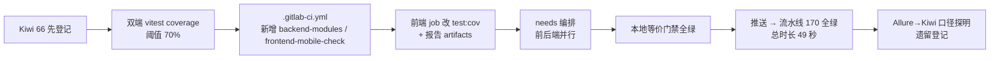

# CI 流水线激活实施记录

> 项目骨架 · 04 CI 与阶段验收 · 01 CI 流水线激活 · 实施记录

[文档首页](../../../../../../文档首页.md) › [04-1 CI 流水线激活](../04_CI与阶段验收_01_CI流水线激活.md) › 实施　|　[← 父任务](../04_CI与阶段验收_01_CI流水线激活.md)

## 1. 实施信息 

| 项 | 值 |
| --- | --- |
| 任务 | [01 CI 流水线激活](../04_CI与阶段验收_01_CI流水线激活.md) |
| 对应需求 | [04-1](../../../../需求/04_需求_CI与阶段验收.md#r04-1) |
| 详细设计 | [01_详细设计_01_CI流水线激活](../设计/01_详细设计_01_CI流水线激活.md) |
| 实施日期 | 2026-09-14 |
| 实施人 | minjian |
| 实施环境 | 开发机（Ubuntu；Python 3.14 / uv；Node 22 双端）+ mjbk GitLab Runner（并发上限 2） |
| Kiwi 用例 | 66（CI 流水线激活：冒烟层 job 全绿 / 覆盖率门禁 / 模块清单校验 / 开关守卫） |
| 提交 | `4c6553d`（feat(ci)：job 与覆盖率阈值、needs 编排）；同日前置修复 `2081fd1`（apt 清华源）、`b1dc02e`（coverage 产物出库） |
| 结论 | 完成 |

## 2. 实施概览 

结果小结：冒烟层由 8 个 job 扩到 10 个（新增 `backend-modules`、`frontend-mobile-check`），前端双端接入 Vitest v8 coverage 并以 70% 阈值阻断，`needs` 编排后流水线总时长由分钟级降到 **49 秒**且全绿；`pytest` / `ruff` / `pyright` / `base-check` / `check_modules` 本地全绿。

## 3. 实施过程 

1. **Kiwi 先登记**：经 mjbk 容器内 Django shell 登记本任务 1 条用例并取得编号 **66**（产品「BMS 基础管理系统」/ 分类「平台骨架」/ P2 / CONFIRMED / 标签「自动化」/ `is_automated=True`），题面含冒烟层 job 全绿、覆盖率门禁、模块清单校验、免跑层与开关守卫五项断言。
2. **前端覆盖率配置**：`frontend/vitest.config.ts` 与 `frontend-mobile/vitest.config.ts` 各增 `coverage` 段（`provider: v8`、`reporter: text/lcov/json-summary`、`reportsDirectory: coverage`、阈值 `statements/branches/functions/lines = 70`）；采集口径保持 vitest 默认（被用例导入的文件），全量 `src/**` 随阶段四扩面。
3. **CI 新增两 job**：`backend-modules`（lint 阶段，`cd backend && uv run python -m ops.check_modules`；**必须 `-m`**，直接跑脚本因 `sys.path` 不含 backend 根而 `ModuleNotFoundError`，本地已实测）；`frontend-mobile-check`（test 阶段，ESLint + `npm run test:cov`，与 `frontend-check` 完全对称）。
4. **前端 job 改造**：`frontend-check` / `frontend-mobile-check` 由 `npm run test` 改为 `npm run test:cov`，新增 `coverage` 正则（`/^All files\s*\|\s*(\d+(?:\.\d+)?)/`）与 `coverage/` 报告 artifacts（`when: always`、`expire_in: 30 days`）。
5. **needs 并行编排**：`frontend-check` / `frontend-mobile-check` → `ci-base-build`（optional）；`frontend-build` → `frontend-check`；`frontend-mobile-build` → `frontend-mobile-check`；`backend-image` → `backend-test`（均 `optional: true` 兼容 MR 流水线无 `ci-base-build` 的场景）；失败阻断语义不变。
6. **口径同步**：`.gitlab-ci.yml` 头注释与 `backend-test` 注释更新为「整体 ≥ 70%；核心模块 ≥ 80% 子阈值随认证 / RBAC 阶段接入」；《开发部署规划》与《测试规范》在 2026-09-14 已同步相同口径。
7. **本地等价门禁**：逐条复现 CI 命令（见 §5），全部通过。
8. **推送验证**：推送 `4c6553d` → 流水线 **170 全绿**（11 个 job）；顺带确认同日早前修复（`backend-typecheck` 缺 `libatomic.so.1` → 镜像装 `libatomic1`；镜像重建卡在 Debian 官方源 → apt 换清华源；镜像标签口径纳入 Dockerfile）均在 CI 生效。
9. **Allure→Kiwi 口径验证**：json-rpc 端点可达但匿名调用返回 `-32098 Authentication failed`；PyPI 上官方插件 `kiwitcms-pytest-plugin`（15.4）可安装，其入口点为 **pytest11 插件** `tcms_pytest_plugin`，注册选项仅 `--kiwitcms`（**在执行时直接写 Kiwi**，非解析 Allure 报告），凭据经 `TCMS_API_URL` / `TCMS_USERNAME` / `TCMS_PASSWORD` 注入。结论：**口径已明、接线前置为 Kiwi 凭据变量 + `verify-enabled` 开关**，本任务不接线，登记遗留。

## 4. 问题与处置 

| # | 问题 / 现象 | 原因 | 处置与落点 |
| --- | --- | --- | --- |
| 1 | `backend-typecheck` 首跑失败：`libatomic.so.1: cannot open shared object file`（exit 127） | pyright 自带预编译 node 依赖系统库，`python:3.14-slim` 未装 | `deploy/ci/Dockerfile.backend` 装 `libatomic1`；镜像哈希口径纳入 Dockerfile 以触发重建（`Dockerfile.backend` / `build-base.sh`，提交 `4d82e58`） |
| 2 | 镜像重建长时间无进度（`apt-get update` 卡 5 分钟） | Debian 官方源在 mjbk 实测约 76 KB/s | `Dockerfile.backend` apt 换清华源（实测 10.5 MB/s）；重建降到约 30 秒（提交 `2081fd1`） |
| 3 | 登记 Kiwi 用例时 `add_tag("自动化")` 报 `Field 'id' expected a number but got '自动化'` | 该版本 `TestCase.add_tag` 期望 Tag 实例而非名称 | 改用 `Tag = TestCase.tag.field.related_model` 取模型后 `get_or_create` + `add_tag(tag)`；用例 66 补标签成功 |
| 4 | 提交时误把本地 `npm run test:cov` 生成的 `coverage/`（44 个 HTML）带入提交 | `.gitignore` 只忽略 `htmlcov/`、`.coverage*`，**缺 `coverage/` 规则**（该目录此前已被跟踪） | `git rm -r --cached` 双端 coverage（60 文件）+ `.gitignore` 补 `coverage/` + `.graphifyignore` 补产物排除项（提交 `b1dc02e`、工作区 `ca1434a`） |

## 5. 验证结果 

| 验证项 | 命令 / 依据 | 结果 |
| --- | --- | --- |
| 后端 lint / 格式 | `uv run ruff check .`、`uv run ruff format --check .` | 通过 |
| 后端类型 | `uv run pyright` | 0 errors（CI job `backend-typecheck` 24.6 秒通过） |
| 后端单测 + 覆盖率门禁 | `uv run pytest -q --cov=app --cov-branch --cov-report=term --cov-fail-under=70` | **404 passed / 3 skipped**，TOTAL **99.75%** ≥ 70% |
| 模块注册清单校验 | `uv run python -m ops.check_modules` | `[模块注册] 校验通过（4 项）`，退出码 0 |
| 前端双端 | `npm run lint && npm run test:cov` | 各 4 spec / 18 用例通过，`All files` **100%** ≥ 70% |
| 基座文档自检 | `python3 scripts/tools/base-check/check-base.py`（bms 根） | 五项通过（断链 0 / 跨层 0 / 措辞残留 0 / 清单 146=146 / 编号引用 0） |
| 流水线冒烟层 | 流水线 **170**（`4c6553dc`） | **success**，11 job 全绿，总时长 **49 秒**（`backend-modules` 2.6s、`frontend-mobile-check` 8.3s、`backend-typecheck` 24.6s） |
| 免跑层 | 纯业务文档推送（`074f4fb`） | 未建流水线（符合 workflow rules） |
| 基座路径触发 | 含《测试规范》《文档首页》改动的推送（`9ec9c64`） | 建流水线 167，`base-integrity` 通过 |

## 6. 偏差与遗留 

- **设计偏差**：无。实施与详细设计 §4.2 needs 矩阵、§5 job 表、§6 覆盖率口径、§7 模块校验形态一致；实施中新增的两处镜像修复（`libatomic1`、apt 清华源）与标签哈希口径已在《开发部署规划》《测试规范》与计划 §6 同步。
- **遗留（均已登记归口）**：
  1. **Allure→Kiwi 接线**：口径已探明（`kiwitcms-pytest-plugin` + `--kiwitcms` + `TCMS_API_URL`/`TCMS_USERNAME`/`TCMS_PASSWORD`），前置＝Kiwi 用户凭据作 CI/CD masked 变量 + `deploy/ci/verify-enabled` 开关 → 计划 §3.1；
  2. **核心模块覆盖率 ≥ 80%**：随认证 / RBAC 阶段模块落地接入 → 计划 §3.1；
  3. **重验证层激活**：本任务不创建开关，各 job 前置（E2E 待 `backend/tests/e2e` 用例、三库随落库阶段、Trivy 待外网、契约快照随开关）→ 设计 §8 与计划 §3.1；
  4. **CI 基础镜像 push `blob unknown`**：best-effort 降级（本机镜像可用），恢复强制推送待 registry 排查 → 计划 §6。

> 本文档依《文档生成规范》编写
