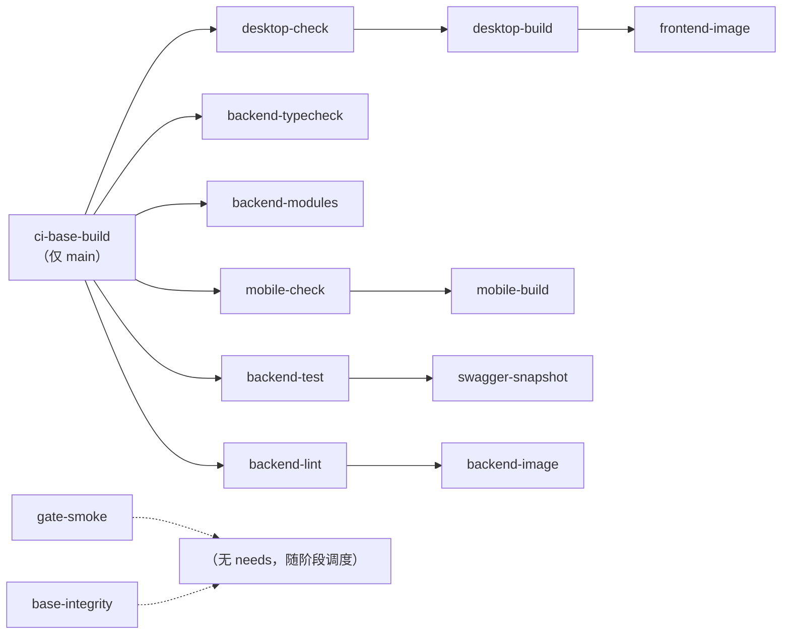

# CI 流水线激活详细设计

> BMS · 阶段一 / 04 CI 与阶段验收 · 子任务 01 · 任务级详细设计（可落地、可逐项验收）

[文档首页](../../../../../../文档首页.md) › [04 CI 与阶段验收](../../04_CI与阶段验收.md) › [01 CI 流水线激活](../04_CI与阶段验收_01_CI流水线激活.md) › 详细设计　|　[← 父任务](../04_CI与阶段验收_01_CI流水线激活.md)

## 1. 概述 <a id="overview"></a>

本文档是任务 [01 CI 流水线激活](../04_CI与阶段验收_01_CI流水线激活.md) 的**详细设计**，粒度到「按序落地、逐条验收」；与全局设计不一致时以本文档为 04-1 的执行依据，不一致点记录于 [第 16 节](#align)。

上游依据（可追溯）：

- 需求 [04-1](../../../../需求/04_需求_CI与阶段验收.md#r04-1)（本任务对应需求）
- 《[开发部署规划](../../../../../../规划/开发部署规划.md)》「开发工作流与 CI」节（分层流水线、CI 基础镜像）、《[测试规范](../../../../../../规范/测试规范.md)》「覆盖率要求」「三库方言测试」「CI 执行策略」节
- 《[总体项目规划](../../../../../../规划/总体项目规划.md)》「监控与报告」节、《[架构设计 · 测试与质量](../../../../../../设计/架构设计/32_架构设计_测试与质量.md)》「CI 流水线」「代码质量门禁」节
- 计划 [04_01 排期](../../../../计划/01_计划_项目骨架.md#todo)（3h，依赖 `03_02` / `03_03`）

与前后任务的关系：03-2 日志体系、03-3 健康检查已于 2026-09-14 落地（冒烟层有真实内容可跑）；02-14 ~ 02-16 机制底座已交付 `ModuleRegistry`（供 `backend/ops/check_modules.py` 复用校验）。本任务只改 **CI 配置 + 前端测试配置 + 文档口径**，不产生业务代码；完成后 04-2 才可收口三库占位与流水线口径，04-3 / 04-4 依赖本任务产出的流水线证据。

## 2. 现状与差距 <a id="gap"></a>

| 项 | 现状（2026-09-14 实测） | 本任务目标 | 动作 |
| --- | --- | --- | --- |
| 冒烟层 job 集 | gate-smoke / base-integrity / backend-lint / **backend-typecheck**（2026-09-14 补）/ backend-test（`--cov-fail-under=70`）/ desktop-check（lint + test）/ desktop-build / mobile-build | 补「模块注册清单校验」与「移动端 lint+test」两个 job；前端覆盖率接入并设阈值 | 修改 + 新增 |
| 前端覆盖率 | `apps/desktop` / `frontend-mobile` 各有 `vitest.config.ts`，**无 coverage 配置**；CI 跑 `pnpm run test`（`test:cov` 脚本闲置）；本地实测双端 4 spec / 18 用例全过、汇总 100% | 双端接入 v8 coverage + 阈值 70% 阻断；CI 改跑 `test:cov`，报告归档 | 修改（2 配置 + 2 job） |
| 模块注册清单校验 | `backend/ops/check_modules.py` 已存在（复用 `ModuleRegistry.validate()`），**未接入 CI**；实测直接 `python ops/check_modules.py` 报 `ModuleNotFoundError`（`sys.path` 不含 backend 根），`python -m ops.check_modules` 通过（4 项） | 新增独立 job，以 `uv run python -m ops.check_modules` 调用 | 新增 |
| 后端核心模块 ≥ 80% | 仅整体 ≥ 70%；CI 注释为「随后续骨架确定模块路径后补入」 | 阶段一不落子阈值；核心模块路径（auth / rbac / wf / audit / 收付款）随认证 / RBAC 阶段接入 | 注释与需求口径对齐 |
| 重验证层 | 全部 job 以分档 `deploy/ci/verify/*` 守卫（设计时为单开关 `verify-enabled`，2026-09-15 改分档并开 P1 + P2，见 [实施 02](../实施/02_实施_02_重验证层分档激活.md)），**本任务未创建开关**；`backend/tests/e2e` 目录不存在、`backend/tests/integration` 存在（2 条 Redis 集成用例，未配 `BMS_TEST_REDIS_URL` 时跳过） | 本任务**不创建**开关，逐项登记激活前置（[§8](#verify)） | 登记 |
| 缺陷自动上报 | `defect-capture`（`.post`、main + `on_failure` + 开关）已定义未激活；依赖 `MYSQL_ROOT_PASSWORD` 等 CI 变量 | 随重验证层开关一并激活；本任务只保证定义与守卫口径正确 | 登记 |
| CI 基础镜像 | `deploy/ci/build-base.sh` + 两份 Dockerfile；标签 = 三份锁文件 + 两份 Dockerfile 哈希；后端镜像装 `libatomic1` 且 apt 走清华源 | 维持（[§9](#image)） | 已就绪 |
| 作业编排 | 阶段串行（lint → test → build），runner 并发上限 2，冒烟层 6 个 job 呈「2 并发 × 3 轮」 | 用 `needs` 让前端链与后端链并行（[§4.2](#needs)） | 修改 |

## 3. 交付物清单 <a id="tree"></a>

```text
bms/
├── .gitlab-ci.yml                              # 修改：新增 backend-modules / mobile-check；前端 job 改跑 test:cov + 报告归档；needs 并行编排
├── apps/desktop/vitest.config.ts                   # 修改：coverage（v8 + 阈值 70% + 报告目录）
├── frontend-mobile/vitest.config.ts            # 修改：同上
├── deploy/ci/Dockerfile.backend                # 已就绪（libatomic1 + apt 清华源，2026-09-14）
└── deploy/ci/build-base.sh                     # 已就绪（哈希纳入 Dockerfile，2026-09-14）

bms文档/
├── 项目/01_项目骨架/任务/04_CI与阶段验收/04_CI与阶段验收_01_CI流水线激活/设计/01_详细设计_01_CI流水线激活.md  # 本文件
├── 项目/01_项目骨架/需求/04_需求_CI与阶段验收.md      # 实施后回写：需求 04-1 状态与完成日期
├── 项目/01_项目骨架/需求/00_需求_项目骨架.md          # 实施后回写：总清单 04-1 行
├── 项目/01_项目骨架/计划/01_计划_项目骨架.md          # 实施后回写：04_01 行迁「已完成任务」表 + 剩余统计与里程碑
├── 项目/01_项目骨架/任务/04_CI与阶段验收/04_CI与阶段验收.md  # 实施后回写：子任务状态与状态说明
├── 规范/测试规范.md                                   # 已同步（§13 冒烟层与 CI 基础镜像口径，2026-09-14）
└── 规划/开发部署规划.md                               # 已同步（「开发工作流与 CI」节，2026-09-14）
```

## 4. 流水线总体设计与作业编排 <a id="pipeline"></a>

### 4.1 分层与阶段 <a id="layers"></a>

| 层 | 阶段 | 触发 | job | 门禁作用 |
| --- | --- | --- | --- | --- |
| 免跑层 | — | 纯业务文档 / 规划 / 设计推送 | 无 | 不建流水线（workflow rules 以 changes 排除法判定） |
| prepare | prepare | 仅 main | `ci-base-build` | 按哈希重建 CI 基础镜像（幂等跳过） |
| 冒烟层（lint） | lint | 含代码改动的 main 直推 / MR / web / api | `gate-smoke`、`base-integrity`、`backend-lint`、`backend-typecheck`、**`backend-modules`** | 环境门禁、基座文档自检、后端静态检查、类型检查、模块注册清单校验 |
| 冒烟层（test） | test | 同上 | `backend-test`、`desktop-check`、**`mobile-check`** | pytest + 后端覆盖率；双端 ESLint + Vitest + 前端覆盖率 |
| 冒烟层（build） | build | 同上 | `desktop-build`、`mobile-build` | 双端产物可构建 |
| 重验证层 | verify / .post | 仅 main + `deploy/ci/verify/*`（分档） | `e2e-playwright`、`integration-mysql` / `integration-postgres` / `integration-dm8`、`backend-image` / `frontend-image`、`container-scanning`、`swagger-snapshot`、`allure-report`、`defect-capture` | 见 [§8](#verify)（本任务不激活） |

粗体为本次新增。

### 4.2 needs 编排（并行化） <a id="needs"></a>

现状冒烟层 6 个 job 在 runner 并发上限 2 下按阶段串行（`desktop-check` 必须等全部 lint job 结束）。本任务用 `needs` 解除无关依赖的阶段栅栏，前后端两条链并行：



`needs` 矩阵（`optional: true` 用于覆盖 MR 流水线中 `ci-base-build` 不存在的场景）：

| job | needs |
| --- | --- |
| `desktop-check` / `mobile-check` | `ci-base-build`（optional） |
| `desktop-build` | `desktop-check`（optional） |
| `mobile-build` | `mobile-check`（optional） |
| `backend-image` | `backend-test`（optional，现状已等价） |
| `frontend-image` | `desktop-build`（optional，现状已有） |
| `swagger-snapshot` | `backend-test`（optional，现状已有） |
| `allure-report` | `backend-test`、`e2e-playwright`（optional，现状已有） |
| `container-scanning` | `backend-image`（optional，现状已有） |
| `backend-lint` / `backend-typecheck` / `backend-modules` / `backend-test` / `gate-smoke` / `base-integrity` | 不设 `needs`（本身在首两阶段，无前置） |

- **语义不变**：`needs` 只改变调度顺序，任一 job 失败仍使流水线红（阻断下游依赖它的 job），门禁强度不变。
- **预期收益**：冒烟层由「3 轮 × 2 并发」压到「2 轮左右」，单轮总时长预期缩短 1.5 ~ 2 分钟（以实施后流水线实测为准）。

### 4.3 触发与免跑层（保持不变） <a id="rules"></a>

- `web` / `api` 来源始终可显式发起任意分支流水线；MR 事件建流水线。
- main 直推**仅当 changes 命中**代码与基础设施路径时建流水线：`backend/**`、`apps/desktop/**`、`frontend-mobile/**`、`deploy/**`、`.gitlab-ci.yml` + 基座路径（`bms文档/规范/**`、`bms文档/资料/**`、`bms文档/资源/**`、`bms文档/基座文档清单.md`）。
- 纯业务文档（`项目/**`、`规划/**`、`设计/**`）改动**不建流水线**（既有口径，本任务不改）。

## 5. 冒烟层 job 设计 <a id="smoke"></a>

| job | 阶段 | image | 守卫（exists） | 命令 | 门禁语义 |
| --- | --- | --- | --- | --- | --- |
| `gate-smoke` | lint | `python:3.14-slim` | 无（无条件） | 断言 `sys.version_info >= (3,14)` | Python 版本不符即红 |
| `base-integrity` | lint | `python:3.14-slim` | 无（无条件） | `python scripts/tools/base-check/check-base.py` | 五项（链接 / 跨层 / 措辞 / 清单 / 编号引用）任一不为零即红 |
| `backend-lint` | lint | `ci-backend:py314` | `backend/pyproject.toml` | `cd backend && uv run ruff check .` | lint 有告警即红 |
| `backend-typecheck` | lint | `ci-backend:py314` | `backend/pyproject.toml` | `cd backend && uv run pyright` | strict 类型错误即红（2026-09-14 已落地，实测 0 errors） |
| **`backend-modules`** | lint | `ci-backend:py314` | `backend/pyproject.toml` | `cd backend && uv run python -m ops.check_modules` | 模块注册项冲突 / 非法即红（退出码 1） |
| `backend-test` | test | `ci-backend:py314` | `backend/pyproject.toml` | `cd backend && uv run pytest --cov=app --cov-branch --cov-report=term --cov-fail-under=70` | 用例失败或覆盖率 < 70% 即红；`coverage` 正则提取 `TOTAL` 行 |
| `desktop-check` | test | `ci-frontend:node22` | `apps/desktop/package.json` | `cp -a /opt/ci/apps/desktop/node_modules apps/desktop/node_modules` → `cd apps/desktop && pnpm run lint && pnpm run test:cov` | ESLint 有告警（`--max-warnings 0`）或用例失败或覆盖率 < 70% 即红 |
| **`mobile-check`** | test | `ci-frontend:node22` | `frontend-mobile/package.json` | 同构（复制 `/opt/ci/frontend/apps/mobile/node_modules`） | 同上（移动端） |
| `desktop-build` | build | `ci-frontend:node22` | `apps/desktop/package.json` | `pnpm run build`（`vue-tsc -b && vite build`） | 构建失败即红 |
| `mobile-build` | build | `ci-frontend:node22` | `frontend-mobile/package.json` | `pnpm run build` | 同上（移动端） |

口径说明：

- **exists 守卫**：`backend/pyproject.toml`、`apps/desktop/package.json`、`frontend-mobile/package.json` 各自守卫对应 job（`exists` 是「任一命中」语义，故一个 job 只用一条守卫路径，避免误激活）。
- **MR 与 main 双分支规则**：每个带守卫的 job 同时写 `merge_request_event` 与默认分支两条 `rules`（沿用现状），保证单人期与未来多人期口径一致。
- **零安装**：前端 job 一律从 CI 基础镜像内预装目录 `cp -a` `node_modules`（不做 `pnpm install --frozen-lockfile`）；后端 job 一律 `uv run`（镜像内 `UV_PROJECT_ENVIRONMENT=/opt/bms-venv`、`UV_NO_SYNC=1`）。
- **不新增业务代码**：所有 job 只调用仓库既有的脚本 / 命令。

## 6. 覆盖率门禁设计 <a id="coverage"></a>

### 6.1 后端 <a id="cov-backend"></a>

- 命令：`uv run pytest --cov=app --cov-branch --cov-report=term --cov-fail-under=70`（现状保持）。
- 阈值：**整体 ≥ 70%**（阶段一唯一硬阈值，`pytest-cov` 直接阻断）。
- **核心模块 ≥ 80% 前置**：核心模块路径（auth / rbac / wf / audit / 收付款）**尚不存在**，本阶段不落子阈值（`pytest-cov` 多阈值需按路径逐个配置，模块落地后再加）；CI 注释与需求口径同步为「随认证 / RBAC 阶段接入」。
- GitLab `coverage` 正则沿用现状（匹配 `TOTAL` 行）。

### 6.2 前端（双端） <a id="cov-frontend"></a>

`apps/desktop/vitest.config.ts` 与 `frontend-mobile/vitest.config.ts` 增加 coverage 段（其余字段不变）：

```ts
  test: {
    environment: 'jsdom',
    include: ['tests/**/*.spec.ts'],
    coverage: {
      provider: 'v8',
      reporter: ['text', 'lcov', 'json-summary'],
      reportsDirectory: 'coverage',
      thresholds: { statements: 70, branches: 70, functions: 70, lines: 70 },
    },
  },
```

- **采集口径（骨架期）**：沿用 vitest 默认行为——只统计**被用例导入**的文件；**不**显式 `include: ['src/**']` 全量拉入（否则页面 / 路由 / i18n 语言包等未覆盖文件会把汇总拉低，与本阶段「组件库尚未建设」的事实不符）。全量 `src/**` 采集与阈值随后续（前端组件库）扩面。
  - 实测基线（2026-09-14）：双端各 4 个 spec / 18 用例全过，汇总 `All files` 100%（阈值 70% 有余量）；`src/i18n/{en-US,zh-CN}.ts` 等未被导入文件在明细中记 0%（不影响汇总，采集细节以实施时 `test:cov` 输出为准）。
- **阻断方式**：`thresholds` 由 vitest 自身判定，低于阈值 `vitest run` 退出码非零 → job 红；CI 不再传阈值参数（单一口径来源）。
- **报告归档**：`coverage/` 作 artifacts（`expire_in: 30 days`，`when: always`），便于失败回溯；`text` reporter 供作业日志直读；**本地产物不入库**（`.gitignore` 已忽略 `coverage/`，2026-09-14 清理出库）。
- **GitLab coverage 正则（新）**：取 text 报表 `All files` 行的 `% Stmts`（`/^All files\s*\|\s*(\d+(?:\.\d+)?)/`），实施时以实际输出核对后固化（正则不符只影响界面数字展示，不影响门禁阻断）。

## 7. 模块注册清单校验 job 设计 <a id="modules"></a>

- **调用方式（关键）**：`cd backend && uv run python -m ops.check_modules`。
  - 必须用模块方式：直接 `python ops/check_modules.py` 时 `sys.path[0]` 为脚本所在目录，`import app.services.module_registry` 报 `ModuleNotFoundError`（2026-09-14 实测）；模块方式把当前工作目录（`backend/`）纳入 `sys.path`，实测通过（`[模块注册] 校验通过（4 项）`，退出码 0）。
  - `backend/ops/__init__.py` 已存在，模块方式成立。
- **校验内容**：`ModuleRegistry().validate()`——平台模块清单的表前缀 / 业务码 / 错误码段唯一性与格式校验（`sys_module` 落库后同一份规则由启动 / CI 查重复用）。
- **失败语义**：冲突或非法时打印 `[模块注册] <明细>` 并退出码 1 → job 红。
- **独立 job 理由**：失败定位清晰（与 ruff / pytest 结果分离）、可单独重跑、后续模块接入增多时可扩展为清单快照比对。

## 8. 重验证层与开关设计（本任务不激活） <a id="verify"></a>

> **开关口径变更（2026-09-15，[实施 02](../实施/02_实施_02_重验证层分档激活.md) 回写）**：单文件 `deploy/ci/verify-enabled` 改为**分档** `deploy/ci/verify/{contract,defect,report,image,e2e,db}`，P1（`contract` + `defect`）与 P2（`report`）已开；本文已按分档口径更新，历史单开关设计见 [04-01 实施 01](../实施/01_实施_01_CI流水线激活.md)。

开关：分档文件 `deploy/ci/verify/{contract,defect,report,image,e2e,db}`（原设计为单文件 `verify-enabled`，2026-09-15 改分档，见[实施 02](../实施/02_实施_02_重验证层分档激活.md)）。本任务**不创建**开关；各 job 的激活前置逐项登记如下，阶段一以「**就绪项全绿**」口径闭项（未就绪项不删 job、不放行）：

| job | 激活前置（未满足前的状态） | 判定 |
| --- | --- | --- |
| `e2e-playwright` | `backend/tests/e2e` 用例就位（**当前目录不存在**，激活必红） | 前置未满足 |
| `integration-mysql` / `integration-postgres` / `integration-dm8` | 阶段二 后端基座与服务化地基（Alembic 迁移 + 真库集成用例；当前仅 Redis 集成用例，未配 `BMS_TEST_REDIS_URL` 时跳过） | 随后续（04-2 占位口径） |
| `container-scanning`（Trivy） | 外网可达（Trivy DB 拉取）+ 镜像推送可用（当前 registry 报 `blob unknown`） | 暂缓（暂缓口径写入阶段测试报告） |
| `swagger-snapshot` | 技术就绪（`app.openapi()` 可导出）；随开关一并开启 | 随开关 |
| `allure-report` | 已归档 `allure-results` / `allure-report`；**结果导入 Kiwi TCMS 口径待验证**（见 [§15](#risk)） | 随开关 + 导入口径验证 |
| `defect-capture` | `MYSQL_ROOT_PASSWORD` 等 CI/CD 变量配齐 + 开关（触发条件 `main + on_failure`） | 随开关 |

另：**重验证层 job 的临时脚本口径**（`e2e-playwright` / 集成 job 内 `pip install uv && uv sync --frozen`）随阶段推进改为消费 CI 基础镜像，减少重复安装（本任务不改，登记为后续优化）。

## 9. CI 基础镜像设计（已落地，登记口径） <a id="image"></a>

- **标签口径**：`TAG = sha256(backend/uv.lock + apps/desktop/pnpm-lock.yaml + frontend-mobile/pnpm-lock.yaml + deploy/ci/Dockerfile.backend + deploy/ci/Dockerfile.apps/desktop)[:12]`，写入镜像 label `bms.lock-hash`；本地已存在同哈希镜像则跳过（构建与消费共用宿主 docker daemon，**本流水线即用新镜像**）。
  - 2026-09-14 修正：原口径只含三份锁文件，导致「只改 Dockerfile（系统依赖）」不触发重建 → 现纳入两份 Dockerfile。
- **后端镜像**（`ci-backend:py314`）：`python:3.14-slim` → apt 换**清华源**装 `libatomic1` → `pip install uv` → `COPY pyproject.toml uv.lock` + `uv sync --frozen --no-install-project`（venv `/opt/bms-venv`，`UV_NO_SYNC=1`）。
  - `libatomic1` 是 pyright 自带预编译 node 的运行依赖（缺失报 `libatomic.so.1: cannot open shared object file`）；apt 官方源在 mjbk 实测约 76 KB/s（会卡死镜像重建），清华源实测 10.5 MB/s。
- **前端镜像**（`ci-frontend:node22`）：`node:22-slim` → 复制 `apps/desktop/` 与 `frontend-mobile/` 的 `package.json`/`pnpm-lock.yaml` → `pnpm install --frozen-lockfile`（`npm_config_registry` 指向 npmmirror）。
- **push best-effort**：registry 对层报 `blob unknown` → 警告后使用本机镜像继续（不阻塞冒烟层）；恢复强制推送待 registry 排查（登记于计划「风险与对策」节）。
- 实测：镜像重建 30 秒（清华源 + docker 层缓存命中 `uv sync` 层）。

## 10. 失败与降级策略 <a id="fallback"></a>

| 场景 | 处置 |
| --- | --- |
| 外部包源慢 / 不可达 | apt 走清华源；PyPI 走清华（`PIP_INDEX_URL` / `UV_DEFAULT_INDEX`）；npm 走 npmmirror（`NPM_CONFIG_REGISTRY`）——均在 `.gitlab-ci.yml` variables 内固定 |
| registry push 失败（`blob unknown`） | `build-base.sh` 内 best-effort 降级，用单 runner 本机镜像继续；不阻塞冒烟层 |
| 重验证层 job 未就绪 | 分档 `deploy/ci/verify/*` 守卫（删档即关），前置逐项登记（[§8](#verify)） |
| Trivy 外网不可达 | 暂缓（不创建开关即不执行），暂缓口径写阶段测试报告 |
| runner 并发上限 2 | `needs` 并行编排（[§4.2](#needs)）+ 单 job 控制在 3 分钟内；大任务（构建 / 集成）错峰 |
| pyright 需系统库 | 已固化进 CI 基础镜像（`libatomic1`），不再依赖宿主 |
| 前端覆盖率阈值误伤后续阶段 | 阈值口径集中在 `vitest.config.ts`（单一口径来源），扩面阶段四按需调整 |

## 11. 测试设计与 Kiwi 用例（先行登记） <a id="tests"></a>

**先登记 Kiwi TCMS 用例取得编号，再实施并在任务测试记录中回填编号**。按「一任务一条用例」约定，本任务登记 **1 条**（**Kiwi 66**，2026-09-14 平台登记：分类「平台骨架」/ P2 / CONFIRMED / 标签「自动化」）：

| 拟登记用例 | 断言要点 |
| --- | --- |
| CI 流水线激活与门禁 | ① 含代码改动的 main 推送自动建流水线且冒烟层全绿（job 清单含 `backend-typecheck`、`backend-modules`、`desktop-check`、`mobile-check`、双端构建）；② 覆盖率门禁生效：后端 < 70%（本地以 `--cov-fail-under` 复现）/ 前端 < 70%（本地改阈值复现）时失败；③ 模块注册清单校验：`uv run python -m ops.check_modules` 通过（退出码 0），构造冲突时退出码 1；④ 免跑层：纯业务文档推送不建流水线、基座路径改动触发 `base-integrity`；⑤ 重验证层开关守卫：无对应档位文件时该类 job 不出现 |

本地等价复现命令（CI 即被测对象，全部命令可在开发机执行）：

```bash
# 后端四项
cd backend
uv run ruff check . && uv run ruff format --check . && uv run pyright
uv run pytest -q --cov=app --cov-branch --cov-report=term --cov-fail-under=70
uv run python -m ops.check_modules            # 必须 -m
# 前端双端
cd ../frontend        && pnpm run lint && pnpm run test:cov
cd ../frontend-mobile && pnpm run lint && pnpm run test:cov
# 基座文档自检（须在 bms 仓库根）
python3 scripts/tools/base-check/check-base.py
```

**覆盖率基线（2026-09-14 实测）**：前端与移动端各 4 spec / 18 用例全过、汇总 100%；后端整体 ≈ 99%（`--cov` 全量）。

## 12. 实施步骤 <a id="steps"></a>

1. **Kiwi 登记**：登记本任务 1 条用例（分类「平台骨架」/ P2 / CONFIRMED / 标签「自动化」）并回填编号。
2. **前端覆盖率配置**：双端 `vitest.config.ts` 增 coverage 段；本地 `pnpm run test:cov` 双端达标（≥ 70%）。
3. **CI job**：`.gitlab-ci.yml` 新增 `backend-modules`（lint）与 `mobile-check`（test）；`desktop-check` / `mobile-check` 改跑 `pnpm run test:cov` + artifacts；`backend-test` 注释口径对齐（核心 80% 前置）。
4. **needs 编排**：按 [§4.2](#needs) 矩阵加 `needs`（全部 `optional: true` 兜底）。
5. **本地全量门禁**：按 [§11](#tests) 命令逐条复现全绿（含 `-m ops.check_modules`）。
6. **推送验证**：推送 main → 确认流水线**建了且全绿**、新增 job 出现在作业列表；再以纯业务文档改动验证「不建流水线」。
7. **Allure→Kiwi 口径验证**：验证 Kiwi 官方 pytest 插件（`--tcms-*` / API）与 JSON-RPC 导入口径；通则登记接线方案，不通则登记遗留（不阻断本任务）。
8. **回写**：需求 04-1（状态 / 完成日期）、`00_需求_项目骨架.md` 总清单、计划 04_01 行与剩余统计、任务文档与域总览；测试规范 / 开发部署规划已在 2026-09-14 同步（如有增量再补）。
9. **记录**：任务目录 `实施/`、`测试/` 各一份（信息 / 过程 / 问题与处置 / 验证 / 覆盖率 / 偏差与遗留）。
10. **提交**：CI 与前端配置（`feat(ci)` / `chore(apps/desktop)`）与文档（`docs(项目)`）分开提交；推送走两级确认。

## 13. 验收映射 <a id="accept-map"></a>

| 完成标准（需求 04-1） | 设计落点 | 验证方法 |
| --- | --- | --- |
| 含代码改动的 main 推送自动跑冒烟层且全绿（含 pyright 与模块注册清单校验） | [§4.3](#rules) / [§5](#smoke) / [§7](#modules) | 推送后看流水线作业列表与结论 + Kiwi 用例① |
| 重验证层就绪项全绿（未就绪项按守卫口径标注） | [§8](#verify) | 流水线中重验证 job 不出现（无开关）+ 前置表登记核对 |
| 后端与前端覆盖率报告产出且低于阈值时 pipeline 红 | [§6.1](#cov-backend) / [§6.2](#cov-frontend) | 后端 `--cov-fail-under=70`；前端本地临时改阈值复现失败 + artifacts 报告 |
| 纯业务文档推送不触发 CI（不建流水线） | [§4.3](#rules) | 纯文档改动推送后看无新流水线 |
| 基座文档改动触发 `base-integrity` 且通过 | [§5](#smoke) | 基座路径改动推送后查该 job 结论 |
| CI 基础镜像按口径自动重建、push 降级不阻塞 | [§9](#image) | `ci-base-build` 作业日志（哈希标签 + 跳过/重建 + push 警告） |
| 冒烟层耗时可控（并发 2） | [§4.2](#needs) / [§10](#fallback) | 流水线总时长实测对比 |

## 14. 职责边界与登记落点 <a id="boundary"></a>

**职责边界**：

| 事项 | 归属 |
| --- | --- |
| 冒烟层 job 集 / 覆盖率门禁 / 模块清单校验 job / needs 编排 / CI 基础镜像口径 | **04-1（本文档）** |
| 三库集成脚本占位（`backend/ops/test_db.py`）与流水线收口口径 | 04-2 |
| 阶段验收门禁逐项核对与证据索引 | 04-3 |
| 阶段测试报告与 README | 04-4 |
| 重验证层真库 / E2E / Trivy / Allure 导入 Kiwi 接线 | 后续阶段（前置见 [§8](#verify)） |
| 核心模块覆盖率 ≥ 80% | 认证 / RBAC 阶段（模块路径确定后） |
| 前端全量 `src/**` 覆盖率采集与阈值 | 阶段四（前端组件库） |

**登记落点**（实施完成后回写）：

| 落点 | 修改 |
| --- | --- |
| `bms文档/项目/01_项目骨架/需求/04_需求_CI与阶段验收.md` | 需求 04-1 状态、完成日期 + 实施期偏差（如有） |
| `bms文档/项目/01_项目骨架/需求/00_需求_项目骨架.md` | 总清单 04-1 行状态、域地图计数 |
| `bms文档/项目/01_项目骨架/计划/01_计划_项目骨架.md` | 04_01 行迁「已完成任务」表 + 剩余统计与里程碑回写 |
| `bms文档/项目/01_项目骨架/任务/04_CI与阶段验收/04_CI与阶段验收.md` | 子任务状态与状态说明 |
| `bms文档/项目/01_项目骨架/任务/04_CI与阶段验收/04_CI与阶段验收_01_CI流水线激活/` | `实施/`、`测试/` 记录各一份 |
| `bms文档/规范/测试规范.md`、`bms文档/规划/开发部署规划.md` | 已同步（2026-09-14）；实施中如口径有增量再补 |

## 15. 风险与开放项 <a id="risk"></a>

| 风险 / 开放项 | 说明 | 处置 |
| --- | --- | --- |
| Allure 结果导入 Kiwi TCMS 口径未验证 | Kiwi 平台的 pytest 插件 / JSON-RPC 会话口径尚未实测（`Auth.login` 曾报 `Unsupported field`） | 本任务只做口径验证，不通则登记遗留（不阻断 04-1）；导入接线可随 04-4 或后续阶段 |
| registry push `blob unknown` | CI 基础镜像 push 失败（单 runner 场景本机镜像可用） | best-effort 降级；恢复强制推送待 registry 排查（计划「风险与对策」节已登记） |
| 前端覆盖率采集口径 | 「被导入文件」口径下，未被用例导入的文件不计入分母，阈值达成偏易 | 阶段四切全量 `src/**` 时同步上调阈值覆盖面；本阶段已明确口径并写入规范 |
| 阈值修改影响面 | 前端阈值集中在配置里，后续调阈值需改两处（双端） | 双端同款配置，改动成对同步；如需单点化管理可后续抽共享配置 |
| needs 编排引入的调度副作用 | `needs` 使 job 可越过阶段栅栏启动 | 全部 `needs` 带 `optional: true`；失败阻断语义不变（[§4.2](#needs)），实施后以一次真实流水线验证 |
| 单 job 时长 | pyright（约 2.5 分钟）为当前最长 job | 可后续在镜像内预热 node 运行时；本阶段先以 needs 并行摊平总时长 |
| 阶段一安全用例集 / 依赖漏洞扫描未接 | 《测试规范》「安全测试用例」要求的安全专项与 Dependency Scanning 尚无 job | 登记为后续阶段（重验证层 / 定时流水线）待办 |

## 16. 对齐记录 <a id="align"></a>

| # | 事项 | 定稿口径 | 落点 |
| --- | --- | --- | --- |
| 1 | 前端覆盖率采集口径 | 骨架期＝被测试导入文件；全量 `src/**` 随后续扩面 | [§6.2](#cov-frontend) |
| 2 | 前端覆盖率阈值 | 双端 70%（statements / branches / functions / lines），由 `vitest.config.ts` 自判阻断 | [§6.2](#cov-frontend) |
| 3 | 移动端口禁 | 新增 `mobile-check`（ESLint + Vitest），与 `desktop-check` 对称 | [§5](#smoke) |
| 4 | 模块注册清单校验形态 | 独立 job `backend-modules`，命令 `uv run python -m ops.check_modules`（必须 `-m`） | [§7](#modules) |
| 5 | Allure → Kiwi 导入 | 本任务只验证口径；不通则登记遗留，不阻断 | [§15](#risk) |
| 6 | 后端核心模块 ≥ 80% | 阶段一不落子阈值；随认证 / RBAC 阶段（模块路径确定后）接入 | [§6.1](#cov-backend) |
| 7 | 作业编排 | 用 `needs`（含 `optional: true`）让前端链与后端链并行，门禁强度不变 | [§4.2](#needs) |
| 8 | Kiwi 用例方案 | 本任务登记 1 条（CI 流水线激活与门禁） | [§11](#tests) |
| 9 | 重验证层开关 | 本任务**不创建**开关（后由实施 02 改分档并开 P1 + P2）；逐项登记激活前置 | [§8](#verify) |
| 10 | CI 基础镜像哈希口径 | 三份锁文件 + 两份 Dockerfile（2026-09-14 修正，Dockerfile 变更亦触发重建） | [§9](#image) |
| 11 | 后端镜像系统依赖 | 装 `libatomic1`（pyright 预编译 node 依赖）且 apt 走清华源（2026-09-14 实测修复） | [§9](#image) |
| 12 | pyright 门禁 | 新增 `backend-typecheck`（lint 阶段，strict），2026-09-14 随流水线 166 全绿验证 | [§5](#smoke) |
| 13 | Trivy 严重度口径 | 统一为 **CRITICAL / HIGH 阻断**（规划 / 架构 / 规范 / 需求同步，2026-09-14） | [§8](#verify) |
| 14 | 设计文件名 | `01_详细设计_01_CI流水线激活.md` | 本文件 |
| 15 | 定稿后续行 | 按《AI开发规范》一条龙自动续行（遇需拍板处停） | [§12](#steps) |
| 16 | 实施结果（2026-09-14） | 无设计偏差：10 个冒烟层 job 全绿（流水线 170，总时长 **49 秒**），新增 `backend-modules` / `mobile-check` 生效，前端双端覆盖率阈值 70% 与报告 artifacts 生效；Kiwi 66 登记；实施中另修两处镜像问题（`libatomic1`、apt 清华源）并同步《开发部署规划》《测试规范》口径；Allure→Kiwi 口径已探明（`kiwitcms-pytest-plugin` + `--kiwitcms` + 凭据变量，执行时直写平台），接线随开关登记遗留 | [§12](#steps) / [§15](#risk) |

> 本文档依《文档生成规范》编写 · 关键决策逐项确认
