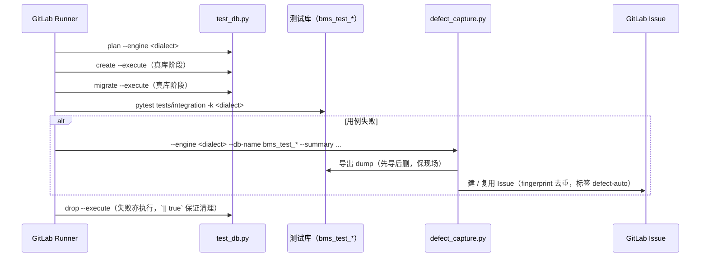

# 三库集成与流水线收口详细设计

> BMS · 阶段一 / 04 CI 与阶段验收 · 子任务 02 · 任务级详细设计（可落地、可逐项验收）

[文档首页](../../../../../../文档首页.md) › [04 CI 与阶段验收](../../04_CI与阶段验收.md) › [02 三库集成与流水线收口](../04_CI与阶段验收_02_三库集成与流水线收口.md) › 详细设计　|　[← 父任务](../04_CI与阶段验收_02_三库集成与流水线收口.md)

## 1. 概述 <a id="overview"></a>

本文档是任务 [02 三库集成与流水线收口](../04_CI与阶段验收_02_三库集成与流水线收口.md) 的**详细设计**，粒度到「按序落地、逐条验收」；与全局设计不一致时以本文档为 04-2 的执行依据，不一致点记录于 [第 13 节](#align)。

上游依据（可追溯）：

- 需求 [04-2](../../../../需求/04_需求_CI与阶段验收.md#r04-2)（本任务对应需求）
- 《[测试规范](../../../../../../规范/测试规范.md)》「测试数据」「三库方言测试」「CI 执行策略」节、《[数据库开发规范](../../../../../../规范/数据库开发规范.md)》「迁移规范（Alembic）」「SQL 编写（三库兼容）」「多租户与分片」节
- 《[开发部署规划](../../../../../../规划/开发部署规划.md)》「开发工作流与 CI」节、《[项目规划说明](../../../../../../规划/项目规划说明.md)》「数据库兼容」节
- 计划 [04_02 排期](../../../../计划/01_计划_项目骨架.md#todo)（1h，依赖 `02_05`、`04_01`）

与前后任务的关系：`02_05` 机制底座已交付数据访问底座 / 多租户拓扑 / 模块注册**占位**（`app/db/{engine,registry,session,tenant,routing}.py`、`ops/migrate_tenants.py`、`ops/init_tenant.py`，需求 [02-14](../../../../需求/02_需求_后端基座.md#r02-14) ~ [02-16](../../../../需求/02_需求_后端基座.md#r02-16)）；[04_01](../../04_CI与阶段验收_01_CI流水线激活/04_CI与阶段验收_01_CI流水线激活.md) 已完成（冒烟层 10 job、`needs` 编排、双端覆盖率门禁，见 [04_01 详细设计](../../04_CI与阶段验收_01_CI流水线激活/设计/01_详细设计_01_CI流水线激活.md#verify)）。本任务把三库集成收口到「**脚本占位 + 用例骨架 + 开关守卫 + 口径登记**」，不连真库、不建库、不跑迁移；真实三库集成随首个落库阶段（认证 / RBAC）激活。

## 2. 现状与差距 <a id="gap"></a>

| 项 | 现状（2026-09-15 实测） | 本任务目标 | 动作 |
| --- | --- | --- | --- |
| 测试库流程脚本 | **不存在**；`ops/migrate_tenants.py` / `ops/init_tenant.py` 仅有 `--dry-run` 输出固定租户库清单（3 条单测覆盖，见 `tests/ops/test_tenant_ops.py`） | 新增 `backend/ops/test_db.py`（`plan` / `create` / `migrate` / `drop` 四子命令 + `--engine mysql\|postgres\|dm8`），占位期一律计划模式 | 新增 |
| 三库 CI job | `integration-mysql` / `integration-postgres` / `integration-dm8`（`.integration-base` 锚点）以 `deploy/ci/verify-enabled` 守卫；image 为 `python:3.14-slim`，`before_script` 内 `pip install uv && uv sync --frozen` | 改为消费 `ci-backend:py314`（去掉 job 内安装）；补「激活条件 + 所需 CI 变量清单」注释；新增**常跑**的 `integration-plan` job（无需真库） | 修改 + 新增 |
| 集成用例 | `tests/integration/` 仅 3 条（`health` 1、`redis` 2），形态为「未配环境变量即跳过」；**无三库 / 拓扑路由用例** | 新增 `tests/integration/test_tenant_routing_integration.py` 骨架（租户/平台引擎、租户库路由、跨租户隔离、批量迁移库清单）；同步扩充单测（`ops/test_db.py` 子命令、租户解析链与豁免） | 新增 + 扩充 |
| `-k "$DB_DIALECT"` 匹配风险 | 现有集成用例名不含 dialect，真库 job 激活后 `pytest -k mysql` 将**无匹配用例**（pytest 退出码 5 → job 误判失败） | 设计固定「按 dialect 命名 / 标记」约定并列为激活前置 | 登记（[§7.3](#activation)） |
| Alembic 在线迁移 | `alembic/env.py` 在线分支 `raise NotImplementedError`（占位），`versions/` 为空 | 占位期不跑迁移；`test_db.py migrate` 仅输出计划，真实迁移归落库阶段 | 登记 |
| 达梦方言口径 | 需求 04-2 已列三项（软删除复合唯一索引 / 迁移脚本 / schema 前缀） | 细化为实测项清单并登记落点（本设计 §8） | 登记 |

## 3. 交付物清单 <a id="tree"></a>

```text
backend/
├── ops/test_db.py                                    # 新增：测试库流程占位（plan / create / migrate / drop + --engine）
└── tests/
    ├── ops/test_test_db.py                           # 新增：子命令与退出码单测（计划输出、非法参数、--execute 占位提示）
    ├── db/test_tenant.py                             # 扩充：租户解析链 / 豁免路径 / 未知租户占位断言
    └── integration/test_tenant_routing_integration.py # 新增：拓扑路由集成骨架（integration 标记，未配环境跳过）

.gitlab-ci.yml                                        # 修改：新增 integration-plan（常跑）；集成 job 换 ci-backend:py314 + 去安装 + 激活条件注释

bms文档/
├── 项目/01_项目骨架/任务/04_CI与阶段验收/04_CI与阶段验收_02_三库集成与流水线收口/设计/02_详细设计_01_三库集成与流水线收口.md  # 本文件
├── 项目/01_项目骨架/需求/04_需求_CI与阶段验收.md        # 实施后回写：需求 04-2 状态 / 完成日期 + 实施结果注块
├── 项目/01_项目骨架/需求/00_需求_项目骨架.md            # 实施后回写：总清单 04-2 行、域地图计数
├── 项目/01_项目骨架/计划/01_计划_项目骨架.md            # 实施后回写：04_02 行迁已完成 + 剩余统计 / 甘特 + §3.1 达梦实测项
└── 项目/01_项目骨架/任务/04_CI与阶段验收/04_CI与阶段验收.md  # 实施后回写：子任务状态与状态说明
```

## 4. 测试库流程设计 <a id="testdb"></a>

### 4.1 库清单与命名（与 CI 变量对齐，唯一事实源） <a id="dblist"></a>

| 方言 | 测试库 / 模式名 | 连接用户 | 端口 | 对应 CI 变量（现有取值） |
| --- | --- | --- | --- | --- |
| MySQL | `bms_test_mysql` | `bms_test` | 3306 | `BMS_TEST_DB_URL`（`mysql+aiomysql://bms_test:${MYSQL_TEST_PASSWORD}@<mjbk>:3306/bms_test_mysql`） |
| PostgreSQL | `bms_test_pg` | `bms_test` | 5432 | `BMS_TEST_DB_URL`（`postgresql+psycopg://bms_test:${POSTGRES_TEST_PASSWORD}@<mjbk>:5432/bms_test_pg`） |
| 达梦 DM8 | 模式 `BMS_TEST_DM` | `SYSDBA` | 5236 | `BMS_TEST_DB_URL`（`dm+dmPython://SYSDBA:${DM8_TEST_PASSWORD}@<mjbk>:5236/BMS_TEST_DM`） |

- 前缀 `bms_test` 与《测试规范》「测试数据」节一致（`bms_test` 前缀、与开发数据隔离）；**库名以本表为准**，`ops/test_db.py` 的固定清单与 `.gitlab-ci.yml` 中 `BMS_TEST_DB_URL` 的库名必须逐字一致（避免两处漂移）。
- 建库标准（真实执行时）：MySQL `utf8mb4`、PostgreSQL `UTF8`、达梦 `UTF8` + schema 前缀（《数据库开发规范》「多租户与分片」节）。
- 测试数据（真库阶段）：固定夹具 `tests/fixtures/`、种子 `tests/seeds/`，用例级隔离用事务回滚或唯一键后缀；密码只走 CI 变量，不入库、不入日志。

### 4.2 `ops/test_db.py` 子命令与退出码 <a id="cli"></a>

```bash
# 计划（无真库、无副作用；CI 常跑 job 与本地核对用）
uv run python -m ops.test_db plan --engine mysql
uv run python -m ops.test_db plan --engine postgres
uv run python -m ops.test_db plan --engine dm8
# 真库阶段串联（占位期一律只打印计划）
uv run python -m ops.test_db create --engine mysql --execute
uv run python -m ops.test_db migrate --engine mysql --execute
uv run python -m ops.test_db drop --engine mysql --execute
```

| 子命令 | 语义 | 占位期行为 | 退出码 |
| --- | --- | --- | --- |
| `plan` | 输出该方言的**固定库清单与执行步骤** | 打印 `[test-db] mysql → 建库 bms_test_mysql / 迁移 / 用例 / 删库（plan）` 类固定文本 | 0 |
| `create` | 建库（真实阶段：字符集 / 排序规则 / 幂等存在即跳过） | 打印计划 + 「真实建库归落库阶段」 | 0（无 `--execute`）；`--execute` 亦 0（占位提示） |
| `migrate` | Alembic 迁移（真实阶段：`alembic upgrade head` 指向该方言） | 同上 | 同上 |
| `drop` | 删库清理（真实阶段：幂等 `IF EXISTS`） | 同上 | 同上 |

- **调用口径**：一律 `uv run python -m ops.test_db`（模块方式）。直接 `python ops/test_db.py` 的 `sys.path[0]` 为脚本目录，一旦脚本内引用 `app.*`（如读配置基座取域名 / 端口）即 `ModuleNotFoundError`——与 `ops/check_modules.py` 同一坑（04_01 已实测并写入 CI 注释）。
- **占位口径**：不带 `--execute` 一律为计划模式；带 `--execute` 也只打印占位提示并返回 0，**不建库、不迁移、不删库**。真实执行随首个落库阶段填实现（同时把 Alembic `env.py` 在线分支接通）。
- **参数规范化**：`--engine` 取值 `mysql|postgres|dm8`（与缺陷归档脚本 `defect_capture.py --engine` 同枚举，便于失败路径直接串联）；非法取值由 argparse 报错退出码 2；`--host/--port/--user` 缺省取配置 / 环境变量（占位期不连接，仅用于打印计划）。
- **固定清单函数可测**：库清单以模块级常量 + `resolve_test_database(engine)` 函数给出（对齐 `ops/migrate_tenants.py` 的 `resolve_databases` 形态），便于单测与 CI 断言。

### 4.3 失败 dump 与清理时序（真库阶段口径，本阶段只登记） <a id="failure"></a>



- 时序要点：**先 dump 再 drop**（《测试规范》「缺陷管理」节）；drop 失败不覆盖原失败结论（`|| true`）；dump 归档 `/mnt/data/backup/defects/<缺陷号>/`（runner 卷映射）。
- 缺陷链路 job 现状：`defect-capture`（`.post` 阶段、`main + on_failure + verify-enabled`）已就位，本任务只把「集成 job 失败 → 归档 → 清理」的顺序写进设计并登记为激活清单项。

## 5. CI 设计 <a id="ci"></a>

### 5.1 新增常跑 job `integration-plan` <a id="plan-job"></a>

```yaml
# ---- 三库测试库流程计划校验（无需真库；脚本占位期的 CI 实证）----
integration-plan:
  stage: test
  image: $REGISTRY_IMAGE_PREFIX/ci-backend:py314
  rules:
    - if: $CI_PIPELINE_SOURCE == "merge_request_event"
      exists:
        - backend/ops/test_db.py
    - if: $CI_COMMIT_BRANCH == $CI_DEFAULT_BRANCH
      exists:
        - backend/ops/test_db.py
  script:
    - cd backend
    - uv run python -m ops.test_db plan --engine mysql
    - uv run python -m ops.test_db plan --engine postgres
    - uv run python -m ops.test_db plan --engine dm8
```

- **不加开关**：纯计划输出、不连库、几秒完成（与 `backend-modules` 同量级），对每次冒烟层无实质成本，换来「脚本占位」在 CI 有实证。
- 守卫用 `backend/ops/test_db.py`（脚本就位即生效）；`stage: test`，不设 `needs`（与其它冒烟层 job 同层，失败即红）。

### 5.2 三库真库 job 改造（仍守门，不激活） <a id="integration-jobs"></a>

| 项 | 现状 | 改为 |
| --- | --- | --- |
| `image` | `python:3.14-slim` | `$REGISTRY_IMAGE_PREFIX/ci-backend:py314`（与后端其它 job 同环境，`uv run` 直接用镜像内 venv） |
| `before_script` | `pip install uv && cd backend && uv sync --frozen` | **删除**（镜像已预建 venv，`UV_PROJECT_ENVIRONMENT=/opt/bms-venv`、`UV_NO_SYNC=1`） |
| `script` | `uv run pytest tests/integration -k "$DB_DIALECT" -v` | `cd backend` → `uv run python -m ops.test_db plan --engine "$DB_DIALECT"` → `uv run pytest tests/integration -k "$DB_DIALECT" -v`（真库阶段在两行之间插入 `create --execute` / `migrate --execute`，失败路径按 [§4.3](#failure) 先 dump 后 drop） |
| 注释 | 仅「重验证层开关」 | 补**激活条件 + 所需 CI/CD 变量**：`deploy/ci/verify-enabled` 开关；`MYSQL_TEST_PASSWORD`、`POSTGRES_TEST_PASSWORD`、`DM8_TEST_PASSWORD`、`MYSQL_ROOT_PASSWORD`（缺陷 dump 用）、`GITLAB_API_TOKEN`（Issue 用）；真库地址随 `BMS_TEST_DB_URL` 内联 |

- 三个 job 的 `variables`（`DB_DIALECT` / `BMS_TEST_DB_URL`）保持不变。
- `needs` 加 `backend-test`（optional）？本任务**不加**：真库 job 属重验证层，保持「开关 + 阶段栅栏」现状，避免与冒烟层耦合（激活时随重验证层一并评估）。

### 5.3 与冒烟层的关系 <a id="relation"></a>

- `integration-plan` 入冒烟层（常跑）；三库真库 job 与 `e2e-playwright`、`container-scanning`、`swagger-snapshot`、`allure-report`、`defect-capture` 同属重验证层（开关守卫），阶段一以「就绪项全绿」口径闭项（04_01 设计 [§8](../../04_CI与阶段验收_01_CI流水线激活/设计/01_详细设计_01_CI流水线激活.md#verify) 已登记各 job 前置）。

## 6. 用例骨架设计 <a id="tests"></a>

### 6.1 拓扑路由集成骨架 <a id="integration-skeleton"></a>

新增 `tests/integration/test_tenant_routing_integration.py`（模块级 `pytestmark = pytest.mark.integration`，形态对齐既有 Redis 集成用例）：

| # | 用例 | 断言位（占位期对占位实现断言） | 跳过条件 |
| --- | --- | --- | --- |
| 1 | 平台引擎取用 | `EngineRegistry.get(PLATFORM_DB_KEY)` 两次取用同一引擎；`active_keys` 含平台键 | 未配 `BMS_TEST_DB_URL` |
| 2 | 租户解析与路由 | `resolve_tenant(header="demo")` → `db_key == "tenant_demo"`；`EngineRegistry.get("tenant_demo")` 可解析 | 同上 |
| 3 | 跨租户隔离 | 以 `db_key` 分离断言：不同 `db_key` 取得不同引擎实例；占位数据按库键隔离（真实阶段改为「写入租户 A 表 → 租户 B 查不到」） | 同上 |
| 4 | 批量迁移库清单 | `ops.migrate_tenants.resolve_databases("all")` == `("bms_platform", "bms_tenant_demo", "bms_archive")`；`ops.test_db.plan` 输出含固定测试库名 | 无（纯清单断言，可真跑） |
| 5 | 引擎释放与预算 | `release(db_key)` 后 `active_keys` 变化；`check_connection_budget` 边界（超预算返回异常 / False，按实现契约） | 同上 |

- 例外：用例 4 为纯清单断言，**不需要真库**，可作为真库阶段 `-k` 匹配之外的「常绿」骨架（命名含 `plan`，不参与 dialect 过滤）。
- 环境变量约定：`BMS_TEST_DB_URL`（平台 / 主库）、`BMS_TEST_TENANT_DB_URL`（租户库，若需要独立连接）——均未配置即 `pytest.skip`，不阻塞冒烟层。

### 6.2 单测扩充 <a id="unit"></a>

| 文件 | 新增 / 扩充 | 断言要点 |
| --- | --- | --- |
| `tests/ops/test_test_db.py` | 新增 | `plan` 三方言输出固定库清单（与 [§4.1](#dblist) 表逐字一致）；`create/migrate/drop` 无 `--execute` 为计划模式、带 `--execute` 打印占位提示；非法 `--engine` 退出码 2；`resolve_test_database` 返回固定名 |
| `tests/ops/test_tenant_ops.py` | 保持 | 既有 3 条（`migrate --dry-run` 固定库清单、target 分支、`init_tenant` 步骤）回归 |
| `tests/db/test_tenant.py` | 扩充 | 解析链优先级（子域名 → 请求头 → token）、未知租户 `TenantNotFoundError`（404 / 80001）、豁免路径返回 `None`、无来源回落 `demo`；无真实连接（占位） |

## 7. 流水线收口口径与激活前置 <a id="closing"></a>

### 7.1 收口结论 <a id="conclusion"></a>

- 三库集成在本阶段交付：**流程脚本占位（可计划）** + **用例骨架（可跳过 / 可匹配）** + **开关守卫口径（不激活）** + **激活前置与变量清单登记**；真实建库、迁移、真库用例随后续落库阶段填实现（同时接通 Alembic 在线分支与 `test_db.py --execute`）。

### 7.2 开关与守卫 <a id="switch"></a>

- 真库 job 与 `defect-capture` 继续以 `deploy/ci/verify-enabled` 守卫；**本任务不创建该文件**（无开关 → 重验证层 job 不出现，冒烟层不受影响）。

### 7.3 激活前置清单（登记项） <a id="activation"></a>

| # | 前置 | 现状 / 说明 |
| --- | --- | --- |
| 1 | `deploy/ci/verify-enabled` 开关 | 不创建（阶段一不激活） |
| 2 | CI/CD 变量配齐 | `MYSQL_TEST_PASSWORD` / `POSTGRES_TEST_PASSWORD` / `DM8_TEST_PASSWORD` / `MYSQL_ROOT_PASSWORD` / `GITLAB_API_TOKEN`（masked） |
| 3 | `test_db.py` 真实执行 | `create` / `migrate` / `drop` 填实现 + Alembic `env.py` 在线分支接通 |
| 4 | **`-k "$DB_DIALECT"` 有匹配用例** | 现无匹配用例，激活会因 pytest 退出码 5（无用例收集）误判失败 → 真库用例按 dialect 命名（如 `test_*_mysql.py`）或加方言标记（`dialect_mysql`），并保证每方言 ≥ 1 条 |
| 5 | 失败 dump 链路变量 | `MYSQL_ROOT_PASSWORD`（`defect_capture.py` 导出 dump 用）+ `GITLAB_API_TOKEN`（Issue 用）+ runner 卷 `/mnt/data/backup/defects` |
| 6 | 达梦驱动与方言 | `dmPython` 连达梦实测（阶段一 01-6 已验连接；方言用例随落库阶段） |

## 8. 达梦方言登记与实测项 <a id="dm8"></a>

| # | 实测项 | 口径与风险 | 登记落点 |
| --- | --- | --- | --- |
| 1 | 软删除复合唯一索引 | `(唯一键, deleted_at)` 复合唯一在达梦的 NULL 语义与 MySQL / PostgreSQL 差异（软删行 `deleted_at` 非空） | 本设计 + 需求 04-2 注块 + 计划 §3.1 |
| 2 | 迁移脚本 DDL | 达梦对 `ALTER TABLE` / 默认值 / 注释支持的差异；Alembic 方言生成的 DDL 需实测复核 | 同上 |
| 3 | schema 前缀与标识符大小写 | 达梦 schema 前缀、小写标识符口径（《命名规范》「数据库命名」节）与 `sys_*` 平台表前缀映射 | 同上 |
| 4 | 类型映射 | `BaseModel` 四库类型映射在达梦的实际落库表现（BIGINT / DATETIME 精度 / BOOLEAN 兼容） | 《数据库开发规范》「SQL 编写（三库兼容）」节回写（随落库阶段） |

不通过时的处置：按《项目规划说明》「数据库兼容」节口径调整并**修订对应需求**（不隐性放宽）。

## 9. 测试设计与 Kiwi 用例（先行登记） <a id="kiwi"></a>

**先登记 Kiwi TCMS 用例取得编号，再实施并在任务测试记录中回填编号**。按「一任务一条用例」约定，本任务登记 **1 条**（编号以平台为准）：

| 拟登记用例 | 断言要点 |
| --- | --- |
| 三库集成与流水线收口（占位口径） | ① `integration-plan` job 常跑且三方言 `plan` 输出固定库清单（与设计 §4.1 表逐字一致）；② `create/migrate/drop` 无 `--execute` 为计划模式、带 `--execute` 仅打印占位提示且**不建库 / 不迁移 / 不删库**（退出码 0）；③ 拓扑路由集成骨架就位：纯清单用例常绿、需真库用例未配环境时跳过、`-k "$DB_DIALECT"` 匹配约定已登记；④ 真库 job 已换 `ci-backend:py314` 且无 job 内安装步骤；⑤ 无 `deploy/ci/verify-enabled` 时三库真库 job 不出现 |

本地等价复现命令：

```bash
cd backend
uv run python -m ops.test_db plan --engine mysql && \
uv run python -m ops.test_db plan --engine postgres && \
uv run python -m ops.test_db plan --engine dm8
uv run pytest tests/ops tests/db -q                 # 单测（含 test_db 子命令与租户解析）
uv run pytest tests/integration -q                  # 集成骨架（未配环境即跳过）
```

## 10. 实施步骤 <a id="steps"></a>

1. **Kiwi 登记**：登记本任务 1 条用例（分类「平台骨架」/ P2 / CONFIRMED / 标签「自动化」）并回填编号。
2. **脚本**：新增 `backend/ops/test_db.py`（`plan` / `create` / `migrate` / `drop` + `--engine`，占位口径，模块方式调用）。
3. **单测**：新增 `tests/ops/test_test_db.py`；扩充 `tests/db/test_tenant.py`。
4. **集成骨架**：新增 `tests/integration/test_tenant_routing_integration.py`（5 条，见 [§6.1](#integration-skeleton)）。
5. **CI**：新增 `integration-plan` job；三库集成 job 换 `ci-backend:py314`、去 `before_script` 安装、脚本补 `plan` 一步、注释补激活条件与变量清单。
6. **本地门禁**：`uv run ruff check . && uv run ruff format --check . && uv run pyright && uv run pytest -q --cov=app --cov-branch --cov-fail-under=70`；`python3 scripts/tools/base-check/check-base.py`。
7. **推送验证**：推送 main → 确认流水线新建且全绿、`integration-plan` 出现、三库真库 job 不出现。
8. **回写**：需求 04-2（状态 / 完成日期 + 实施结果注块）、`00_需求_项目骨架.md` 总清单与域地图、计划 04_02 行与剩余统计 / 甘特、任务文档与域总览；设计 §7.3 前置清单与 §8 实测项在计划 §3.1 登记。
9. **记录**：任务目录 `实施/`、`测试/` 各一份。
10. **提交**：代码（`feat(ci)` / `feat(ops)`）与文档（`docs(项目)`）分开提交；推送走两级确认。

## 11. 验收映射 <a id="accept-map"></a>

| 完成标准（需求 04-2） | 设计落点 | 验证方法 |
| --- | --- | --- |
| 测试库流程脚本与用例骨架就位 | [§4.2](#cli) / [§6](#tests) | `uv run python -m ops.test_db plan` 三方言 + `pytest tests/ops tests/db -q` |
| `--dry-run` 输出固定库清单 | [§4.1](#dblist) / [§4.2](#cli) | `plan` 输出与库清单表逐字比对（单测断言） |
| 开关守卫口径明确 | [§5.2](#integration-jobs) / [§7.2](#switch) | 流水线作业列表（无开关即不出现真库 job）+ CI 注释核对 |
| 三库真库集成为后续阶段待办且已在计划登记 | [§7.3](#activation) / [§8](#dm8) | 计划 §3.1 行核对 |
| `pytest` / `ruff` / `pyright` 全绿 | [§10](#steps) 6 | 本地门禁 + 流水线冒烟层 |
| **不连真库** | [§4.2](#cli) / [§7.2](#switch) | `--execute` 占位提示 + 流水线无真库 job |

## 12. 职责边界与登记落点 <a id="boundary"></a>

**职责边界**：

| 事项 | 归属 |
| --- | --- |
| 测试库流程脚本占位 / 用例骨架 / `integration-plan` job / 集成 job 镜像与注释 / 达梦实测项登记 | **04-2（本文档）** |
| 冒烟层 job 集、覆盖率门禁、`needs` 编排 | [04_01](../../04_CI与阶段验收_01_CI流水线激活/04_CI与阶段验收_01_CI流水线激活.md)（已完成） |
| 数据访问底座 / 多租户拓扑 / 模块注册占位（引擎 / 注册表 / 解析链 / 迁移脚本） | `02_05`（已完成，本任务只消费） |
| 真实建库 / Alembic 在线迁移 / 真库用例与方言实测 | 首个落库阶段（认证 / RBAC），计划 §3.1 |
| M1 门禁核对与阶段报告 | [04_03](../../04_CI与阶段验收_03_M1验收门禁核对/04_CI与阶段验收_03_M1验收门禁核对.md)、[04_04](../../04_CI与阶段验收_04_测试报告与README/04_CI与阶段验收_04_测试报告与README.md) |

**登记落点**（实施完成后回写）：需求 04-2 状态 / 完成日期 + `> 注：` 实施结果块；`00_需求_项目骨架.md` 总清单与域地图；计划 04_02 行迁「已完成任务」表 + 剩余统计 / 甘特；计划 §3.1 补达梦实测项与真库激活前置；任务文档与域总览状态；任务目录 `实施/`、`测试/` 记录。

## 13. 风险与开放项 <a id="risk"></a>

| 风险 / 开放项 | 说明 | 处置 |
| --- | --- | --- |
| `-k "$DB_DIALECT"` 无匹配用例 | 真库 job 激活后 pytest 退出码 5 → 误判失败 | 列为激活前置（[§7.3](#activation) 第 4 项）：按 dialect 命名或加标记，保证每方言 ≥ 1 条 |
| 库名两处漂移 | `ops/test_db.py` 固定清单与 `.gitlab-ci.yml` 的 `BMS_TEST_DB_URL` 库名 | 设计定清单为唯一事实源；单测断言逐字一致（`integration-plan` 每次跑守着） |
| 占位脚本被误用为真实执行 | 真库阶段前 `--execute` 无副作用，但调用方可能误以为已建库 | `--execute` 打印显式占位提示；设计 §7.3 第 3 项登记「填实现」为激活前置 |
| 达梦方言差异晚暴露 | 索引 / DDL / 大小写在落库阶段才实测 | 本任务登记清单（[§8](#dm8)）+ 计划 §3.1；不通过即按「数据库兼容」节口径调整并修订需求 |
| CI 变量缺失导致激活失败 | 真库 job 依赖 5 个 masked 变量 | 激活前置清单（[§7.3](#activation) 第 2 / 5 项）逐项核对后再创建开关 |
| 集成 job 与冒烟层耦合 | 未加 `needs`，激活后仍受阶段栅栏约束 | 有意保持（真库 job 属重验证层）；激活时随重验证层一并评估调度 |

## 14. 对齐记录 <a id="align"></a>

| # | 事项 | 定稿口径 | 落点 |
| --- | --- | --- | --- |
| 1 | 占位脚本形态 | 单脚本 `backend/ops/test_db.py`，四子命令 `plan` / `create` / `migrate` / `drop` + `--engine mysql\|postgres\|dm8` | [§4.2](#cli) |
| 2 | 用例骨架落点 | **两者都做**：新增拓扑路由集成骨架 + 扩充单测（`tests/ops/test_test_db.py`、`tests/db/test_tenant.py`） | [§6](#tests) |
| 3 | 常跑计划校验 job | 新增 `integration-plan`（不加开关，几秒完成，断言固定库清单） | [§5.1](#plan-job) |
| 4 | 三库真库 job 镜像 | 改消费 `ci-backend:py314`，去掉 job 内 `pip install uv && uv sync` | [§5.2](#integration-jobs) |
| 5 | 占位口径 | 一律计划模式；`--execute` 仅打印占位提示、不产生副作用；真实执行归落库阶段 | [§4.2](#cli) |
| 6 | 开关 | 不创建 `deploy/ci/verify-enabled`；真库 job 与缺陷链路继续守门 | [§7.2](#switch) |
| 7 | 库清单唯一事实源 | `bms_test_mysql` / `bms_test_pg` / 模式 `BMS_TEST_DM`，与 CI 变量逐字一致 | [§4.1](#dblist) |
| 8 | Kiwi 用例 | 本任务登记 1 条（三库集成与流水线收口，占位口径） | [§9](#kiwi) |
| 9 | 达梦实测项 | 软删除复合唯一索引 / 迁移 DDL / schema 前缀 / 类型映射四项，登记计划 §3.1 | [§8](#dm8) |
| 10 | 设计文件名 | `02_详细设计_01_三库集成与流水线收口.md` | 本文件 |
| 11 | 定稿后续行 | 按《AI开发规范》一条龙自动续行（遇需拍板处停） | [§10](#steps) |

> 本文档依《文档生成规范》编写 · 关键决策逐项确认
