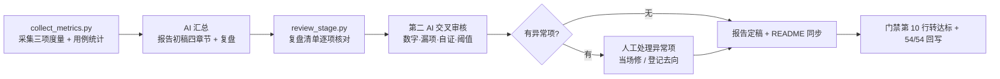

# 测试报告与 README 详细设计

> BMS · 阶段一 / 04 CI 与阶段验收 · 子任务 04 · 任务级详细设计（可落地、可逐项验收）

[文档首页](../../../../../../文档首页.md) › [04 CI 与阶段验收](../../04_CI与阶段验收.md) › [04 测试报告与 README](../04_CI与阶段验收_04_测试报告与README.md) › 详细设计　|　[← 父任务](../04_CI与阶段验收_04_测试报告与README.md)

## 1. 概述 <a id="overview"></a>

本文档是任务 [04 测试报告与 README](../04_CI与阶段验收_04_测试报告与README.md) 的**详细设计**，粒度到「按序落地、逐条验收」；与全局设计不一致时以本文档为 04-4 的执行依据，不一致点记录于 [第 14 节](#align)。

本任务是阶段一的**收口任务**：产出阶段末测试报告（数据由脚本采集 + AI 汇总 + 第二 AI 交叉审核），把根与三工程 README 同步到现状，并**把 M1 门禁第 10 行「验收留痕齐备」转为达标、阶段一 54/54 收口**。依《项目规划说明》§25.3，阶段一还须落地治理脚本 `collect_metrics.py` / `review_stage.py`（本任务实现）。

上游依据（可追溯）：

- 需求 [04-4](../../../../需求/04_需求_CI与阶段验收.md#r04-4)（本任务对应需求）
- 《[测试规范](../../../../../../规范/测试规范.md)》§12「测试报告」（四章节 + 经验教训）、§9「缺陷管理」、§6「覆盖率要求」
- 《[项目规划说明](../../../../../../规划/项目规划说明.md)》§25.2「项目度量与报告」（三项度量 + 报告节奏）、§25.3「治理机制的落地方式」（L1 执行链、治理脚本清单与落地阶段）
- 《[总体项目规划](../../../../../../规划/总体项目规划.md)》「里程碑」节（M1 基线）、《[项目骨架计划](../../../../计划/01_计划_项目骨架.md)》「里程碑对照」
- 计划 [04_04 排期](../../../../计划/01_计划_项目骨架.md#todo)（2h，依赖 04_03）

与前后任务的关系：[04_03](../../04_CI与阶段验收_03_M1验收门禁核对/04_CI与阶段验收_03_M1验收门禁核对.md) 已完成（门禁 9 达标 + 1 进行中，第 10 项即本任务）；本任务完成后阶段一三类文档与门禁全部终态。

## 2. 现状与差距 <a id="gap"></a>

| 项 | 现状（2026-09-15 实测） | 本任务目标 | 动作 |
| --- | --- | --- | --- |
| 阶段测试报告 | **不存在**；《文档首页》与《项目规划说明》已登记落点 `项目/01_项目骨架/01_测试报告_项目骨架.md` | 四章节 + 复盘 + 附录取证齐备，数据来自脚本采集 | 新增 |
| 治理脚本 | `scripts/tools/governance/` **不存在**（现有：backup / base-check / bg / check-docs / defect / dsh / gitlab / graphify / reorder-* / vision / winrm / wol / workbuddy） | 落地 `collect_metrics.py`（三项度量 + 用例执行统计）与 `review_stage.py`（阶段末复盘清单） | 新增 |
| 缺陷统计 | GitLab Issue 仅 1 条（准备期 #1「[自动缺陷] main pipeline failure」，`defect-auto`，2026-08-22 当日闭环）；**阶段一 0 条**；里程碑 0 个 | 如实统计 + 附「当场修复未建单」清单 + 链路已验通证据 | 采集 |
| 覆盖率数据 | 后端 `pytest` 417 passed / 7 skipped、覆盖率 99.75%（04-3 实测）；前端双端 Vitest v8 覆盖率已在 CI 跑（阈值 70%） | 报告以脚本采集（后端跑 pytest 取 TOTAL，前端读 coverage 产物） | 采集 |
| 根 README「项目状态」 | **过时**：写「阶段一收尾中：工程骨架 6/6、后端基座 5/5 已交付；后端基础能力 2/3（健康检查待执行）；CI 与阶段验收任务待推进」 | 改为阶段一收尾现状（54/54 与 M1 门禁结论） | 修改 |
| 四份 README | 均含「项目简介 / 快速启动 / 目录结构 / 文档导航」；根 README 快速启动已是应用工厂命令；**文档导航缺阶段一需求 / 任务 / 计划 / 测试报告** | 全面同步（状态、快速启动含本地门禁命令、目录结构、导航四件套 + 报告） | 修改 |
| 门禁第 10 行 | 「进行中（测试报告与 README 由 04-4 交付，完成即转达标）」 | 交付后转「达标」并补证据；阶段一 54/54 | 回写 |

## 3. 交付物清单 <a id="tree"></a>

```text
scripts/tools/governance/
├── collect_metrics.py                                  # 新增：三项度量 + 用例执行统计（报告数据源，只读）
└── review_stage.py                                     # 新增：阶段末复盘清单（逐项结果与遗留项，只读）

README.md                                               # 修改：项目状态 / 快速启动（本地门禁）/ 文档导航（阶段一四件套 + 报告）
backend/README.md                                       # 修改：状态 / 快速启动 / 目录结构 / 导航
apps/desktop/README.md                                      # 修改：同上
frontend-mobile/README.md                               # 修改：同上
scripts/README.md                                       # 修改：工具链清单登记 governance

bms文档/
├── 项目/01_项目骨架/
│   ├── 01_测试报告_项目骨架.md                              # 新增：四章节 + 复盘 + 附录取证（本任务主交付物）
│   ├── 需求/04_需求_CI与阶段验收.md                      # 回写：04-4 状态 / 完成日期 + 报告注块
│   ├── 需求/00_需求_项目骨架.md                          # 回写：总清单 04-4 行、§4 门禁第 10 行转达标、§4 结论 54/54、§5 域地图 4/0
│   ├── 计划/01_计划_项目骨架.md                          # 回写：04_04 迁已完成表、剩余表清空口径、统计与甘特、§5 留痕行转达标
│   └── 任务/04_CI与阶段验收/
│       ├── 04_CI与阶段验收.md                            # 回写：子任务清单 04 行 + 域状态说明（4/4）
│       └── 04_CI与阶段验收_04_测试报告与README/
│           ├── 04_CI与阶段验收_04_测试报告与README.md      # 回写：任务信息表状态 / 完成日期
│           ├── 设计/04_详细设计_01_测试报告与README.md     # 本文件
│           ├── 实施/04_实施_01_测试报告与README.md         # 新增：含数据采集与交叉审核留痕
│           └── 测试/04_测试_01_测试报告与README.md         # 新增：核对命令与结果（Kiwi 69）
└── 文档首页.md                                          # 修改：5.5 任务基线 / 5.6 报告落点状态（4/4）
```

## 4. 测试报告设计 <a id="report"></a>

### 4.1 落点与结构 <a id="report-struct"></a>

落点 `bms文档/项目/01_项目骨架/01_测试报告_项目骨架.md`（已在《文档首页》与《项目规划说明》「文档计划」节登记）。**章节固定为**（§5、附录依本轮拍板；§1~§4 依《测试规范》§12）：

| 章节 | 标题 | 数据来源 |
| --- | --- | --- |
| 1 | 用例执行统计 | `collect_metrics.py`：后端 pytest（passed / skipped / duration）、前端双端 Vitest 用例数、Playwright E2E（本阶段未启用，如实标注） |
| 2 | 缺陷统计 | `collect_metrics.py` 经 GitLab API 取 Issue（本阶段 0 条）；附「当场修复未建单」2 项清单与缺陷链路现状 |
| 3 | 覆盖率 | 后端行 / 分支覆盖（脚本跑 pytest-cov 取 TOTAL）vs 门禁（整体 ≥ 70%、核心 ≥ 80% 待模块路径确定）；前端双端 Vitest coverage vs 70% |
| 4 | 风险与遗留项 | 计划 §3.1「后续阶段待办」逐条（跨阶段基座回补窗口、机制类占位实现、三库真库、Allure 接线、核心模块覆盖率、重验证层激活前置） |
| 5 | 复盘与经验教训 | 本阶段测试与 CI 过程的问题与改进项（《测试规范》§12 要求）；素材来自各任务实施记录 §4 与本任务复盘 |
| 附录 | 数据采集命令与原始输出 | `collect_metrics.py` / `review_stage.py` / 本地门禁 / 流水线的命令与输出摘要（可复现取证） |

### 4.2 数据口径 <a id="report-data"></a>

- **工期偏差**（§25.2 度量一）：以《项目骨架计划》「里程碑对照」的 M1 基线（原 M1 `2026-09-28`）为基准，与阶段实际完成日（本任务完成日）比较；偏差 > 20% 记入报告（本阶段为**提前**，同样记录并说明原因：基座按接口占位口径交付、串行排期无阻塞）。
- **缺陷收敛**（度量二）：本阶段未收敛 P0/P1 = 0（无 Issue）→ 准出不受阻；附未建单修复清单（04-3 交叉审核发现：`swagger-snapshot` 工厂写法、`02-5-1` 记录数字），标注「已当场修复、影响面限于文档与未激活 job」。
- **覆盖率**（度量三）：后端与前端均取脚本实测值，与门禁阈值并列呈现。
- **只列三项度量**：用例通过率、CI 成功率等不单列为度量项（§25.2 已明示），仅在 §1 与附录呈现。
- 数据全部来自脚本 / CI，**不手工编数**；手工部分仅限结论与经验教训。

## 5. `collect_metrics.py` 设计 <a id="collect-metrics"></a>

### 5.1 定位与形态 <a id="cm-form"></a>

| 项 | 取值 |
| --- | --- |
| 路径 | `scripts/tools/governance/collect_metrics.py` |
| 依赖 | Python 3.14 标准库 + 仓库既有工具（uv / pytest）；GitLab 数据经 HTTP API（凭据取 `deploy/.env`，不入库） |
| 调用 | `python3 scripts/tools/governance/collect_metrics.py [--stage 01_项目骨架] [--root .] [--with-frontend] [--out <path>] [--skip-tests]` |
| 输出 | 终端分区摘要（度量三表 + 用例执行统计）+ 可选 `--out` 写 JSON；**默认不落仓库文件**（跑测试会生成 `.coverage` / `coverage/` 等本地产物，均已被 `.gitignore` 忽略；附录里粘命令与输出） |
| 只读 | 不改代码、不改数据、不建 Issue（§25.3「两个 AI 均只产出报告」口径） |

### 5.2 采集项 <a id="cm-items"></a>

| # | 采集项 | 手法 | 输出字段 |
| --- | --- | --- | --- |
| 1 | 阶段工期偏差 | 计划「里程碑对照」取 M1 基线日期；需求 / 任务文档取本阶段实际完成日（域内最后一条完成日期） | `baseline` / `actual` / `delta_days` / `delta_pct` / 是否 > 20% |
| 2 | 缺陷分布与收敛 | GitLab API：`GET /projects/:id/issues?state=all`（分页）→ 按 `labels`（`defect-*` 标签区分自动 / 手工）与 state 聚合 | `total` / `open` / `closed` / `defect_auto` / `defect_manual` / `p0_p1_open` |
| 3 | 覆盖率 | 后端：`uv run pytest -q --cov=app --cov-branch`（解析 `TOTAL` 行与 `passed/skipped`）；前端：读 `apps/desktop/coverage` / `frontend-mobile/coverage` 产物（`--with-frontend` 时先跑 `npm run test:cov`） | 后端 statements / branch %；前端双端 %；门禁阈值与是否达标 |
| 4 | 用例执行统计 | 同 #3 的 pytest 摘要 + 双端 Vitest 摘要 + Playwright（本阶段无 `tests/e2e`，标「未启用」） | passed / skipped / failed / duration |

### 5.3 与报告的关系 <a id="cm-report"></a>

- 脚本只出**数据**；报告的结论、风险与经验教训由 AI 汇总（§25.3「执行 AI」角色），再交第二 AI 交叉审核。
- 附录粘贴脚本命令与输出摘要，保证报告中每个数字可复现。

## 6. `review_stage.py` 设计 <a id="review-stage"></a>

### 6.1 定位与形态 <a id="rs-form"></a>

| 项 | 取值 |
| --- | --- |
| 路径 | `scripts/tools/governance/review_stage.py` |
| 调用 | `python3 scripts/tools/governance/review_stage.py [--stage 01_项目骨架] [--root .]` |
| 输出 | 逐项结果表（通过 / 不通过 + 证据）+ 遗留项汇总；退出码：有「不通过」→ 1 |
| 只读 | 同上；不修改任何文档（发现不一致只报，不自动改） |

### 6.2 复盘清单（逐项自动核对） <a id="rs-checks"></a>

| # | 检查项 | 手法 |
| --- | --- | --- |
| 1 | 三类文档状态一致 | 调用 `scripts/tools/check-docs/check-status.py`（subprocess，取退出码与摘要） |
| 2 | 基座自检通过 | 调用 `scripts/tools/base-check/check-base.py` |
| 3 | 门禁表结论齐备 | 《需求总览》§4：10 行、5 列、结论取值合法、达标项证据索引非空 |
| 4 | 阶段残留检查 | 本阶段需求 / 任务文档无「未开始 / 进行中」（收口后应为 0；门禁第 10 行须为「达标」） |
| 5 | 遗留项已登记 | 计划 §3.1 存在且非空；各任务实施记录 §6 提及的遗留均能在 §3.1 或报告 §4 找到归口 |
| 6 | 报告与 README 就位 | 报告四章节 + 复盘 + 附录齐备；根与三工程 README 的「快速启动 / 文档导航 / 项目状态」存在且与现状一致（关键命令串比对） |
| 7 | 记录齐备 | 各已完成任务目录存在 `实施/`；有测试的任务存在 `测试/` |
| 8 | Kiwi 用例编号引用 | 任务测试记录中的 Kiwi 编号与《TestPlan》无关项不追究；仅检查本阶段任务记录均含 `Kiwi` 字段（除设计/计划类） |

> 复盘的**结论与经验教训**由 AI 依上述结果 + 各任务实施记录 §4 汇总，写入报告 §5。

## 7. README 更新设计 <a id="readme"></a>

四份 README 通用同步点与差异：

| 文件 | 项目状态 | 快速启动 | 目录结构 | 文档导航 |
| --- | --- | --- | --- | --- |
| `README.md`（根） | 改为「阶段一收尾：54/54 完成（或 53/54 + 本任务收口），M1 门禁 10 项结论（9 达标 + 1 待本任务）」；阶段二 ~ 五现状保留 | 保留既有命令；**补本地门禁命令块**（ruff / format / pyright / pytest 含覆盖率 / check_modules / `check-status.py` / `check-base.py`）与前端 `npm run test:cov` | 与现状同步（新增 `backend/ops/`、`scripts/tools/governance/` 等本阶段新增目录） | 新增「阶段一四件套」行（需求总览 / 任务基线 / 计划 / **测试报告**）与基座 / 架构链接保持 |
| `backend/README.md` | 补「阶段一后端交付现状」（基座占位口径 + 基础能力 3/3） | 校对启动命令（应用工厂）、补门禁命令 | 同步 `app/` 新增基座目录与 `ops/` | 补阶段一需求 / 任务 / 计划 / 报告链接 |
| `apps/desktop/README.md` | 补阶段一交付现状（工程骨架 + 基类体系） | 校对 5173 / 命令与 `test:cov` | 同步 `src/` 现状 | 同上（报告 + 阶段一文档） |
| `frontend-mobile/README.md` | 同上（5174） | 同上 | 同上 | 同上 |

口径：README 只写**现状事实**（命令可粘贴执行、结构与磁盘一致），不写计划性内容；链接一律指向 `bms文档/` 内既有文件。

## 8. 报告生成与交叉审核流程 <a id="flow"></a>



- **执行 AI**：跑脚本、汇总初稿；**审核 AI**：独立会话只读复核（重点挑战：数字与脚本输出是否一致、是否漏项、是否有自证、阈值是否达标）——两者分离（§25.3 硬要求）。
- 异常项处理留痕：能当场修的当场修并记实施记录 §4；不能修的记 §6 与计划 §3.1。

## 9. 测试设计与 Kiwi 用例（先行登记） <a id="kiwi"></a>

**先登记 Kiwi TCMS 用例取得编号，再实施并在任务测试记录中回填编号**。按「一任务一条用例」约定，本任务登记 **1 条**（**Kiwi 69**，经 mjbk 容器内 Django shell 登记：分类「平台骨架」/ P2 / CONFIRMED / 标签「自动化」/ `is_automated=True`）：

| 拟登记用例 | 断言要点 |
| --- | --- |
| 测试报告与 README（阶段一收口） | ① 报告四章节 + 复盘 + 附录齐备，数据可追溯到脚本输出；② `collect_metrics.py` 三项度量与用例统计正常输出、退出码 0；③ `review_stage.py` 复盘清单全部通过；④ 门禁第 10 行已转「达标」、阶段一 54/54 完成；⑤ 四份 README 的快速启动命令与目录结构同现状一致 |

本地等价复现命令：

```bash
cd <bms 根>
python3 scripts/tools/governance/collect_metrics.py --stage 01_项目骨架
python3 scripts/tools/governance/review_stage.py --stage 01_项目骨架
python3 scripts/tools/check-docs/check-status.py && python3 scripts/tools/base-check/check-base.py
cd backend && uv run pytest -q --cov=app --cov-branch --cov-fail-under=70
```

## 10. 实施步骤 <a id="steps"></a>

1. **Kiwi 登记**：登记本任务 1 条用例并取得编号（[§9](#kiwi)）。
2. **治理脚本**：新增 `collect_metrics.py`（[§5](#collect-metrics)）与 `review_stage.py`（[§6](#review-stage)）；`scripts/README.md` 登记 `tools/governance/`。
3. **数据采集**：跑 `collect_metrics.py` 取三项度量与用例统计；跑 `review_stage.py` 取复盘清单结果。
4. **报告初稿**：按 [§4.1](#report-struct) 结构写 `01_测试报告_项目骨架.md`（四章节 + 复盘 + 附录）。
5. **交叉审核**：第二 AI 独立复核（[§8](#flow)），异常项当场处理或登记。
6. **README 同步**：四份 README 按 [§7](#readme) 更新。
7. **门禁与状态回写**：《需求总览》§4 第 10 行转「达标」+ 结论改 54/54；需求 04-4 元信息与注块；任务 04_04 与域总览；计划（§2 加行、§3 清空口径、统计 18/0、甘特、§5 留痕行）；`文档首页` 5.5 / 5.6。
8. **本地门禁**：`check-status.py` / `check-base.py` / `review_stage.py` 全通过；后端 `ruff` / `format` / `pyright` / `pytest` 全绿。
9. **记录**：任务目录 `测试/`、`实施/` 各一份。
10. **提交推送**：脚本与 README（代码类）与文档分开提交；推送后确认流水线全绿（README 属非基座文档，脚本属 `scripts/**` 不在触发路径——如未建流水线属预期）。

## 11. 验收映射 <a id="accept-map"></a>

| 完成标准（需求 04-4） | 设计落点 | 验证方法 |
| --- | --- | --- |
| 报告四章节齐备且数据来自 CI 采集 | [§4.1](#report-struct) / [§5](#collect-metrics) | 报告章节与附录命令核对；`collect_metrics.py` 输出与报告数字逐项比对 |
| README 与现状一致 | [§7](#readme) | 四份 README 的快速启动命令逐条实跑关键项（后端 `/healthz`、双端 dev 端口、门禁命令）；目录结构与磁盘比对 |
| 遗留项逐条登记 | [§4.1](#report-struct) §4 / [§6](#review-stage) | 计划 §3.1 逐行 ↔ 报告 §4 对位；`review_stage.py` 第 5 项通过 |
| （04-3 完成标准衔接）门禁第 10 行转达标、54/54 | [§10](#steps) 7 | 《需求总览》§4 第 10 行结论 + §3 总清单 54 行全「已完成」；`check-status.py` 通过 |

## 12. 职责边界与登记落点 <a id="boundary"></a>

**职责边界**：

| 事项 | 归属 |
| --- | --- |
| 测试报告、README 同步、治理脚本（`collect_metrics` / `review_stage`）、门禁第 10 行转达标与 54/54 收口 | **04-4（本文档）** |
| 门禁前 9 项结论与证据索引、状态一致性脚本 `check-status.py` | [04_03](../../04_CI与阶段验收_03_M1验收门禁核对/04_CI与阶段验收_03_M1验收门禁核对.md)（已完成） |
| 各任务级实施 / 测试记录 | 各任务（本任务只消费） |
| 机制类真实实现与跨阶段基座回补 | 各对应阶段（计划 §3.1） |

**登记落点**（实施完成后回写）：[§3](#tree) 全表 + `scripts/README.md`；报告落点已在《文档首页》《项目规划说明》登记，本任务只回写状态。

## 13. 风险与开放项 <a id="risk"></a>

| 风险 / 开放项 | 说明 | 处置 |
| --- | --- | --- |
| 前端覆盖率取数依赖产物 | `apps/desktop/coverage` 可能缺失或过时 | 默认读产物并标注采集时间；需要时 `--with-frontend` 重跑 `npm run test:cov` |
| GitLab API 凭据 | `collect_metrics.py` 取 Issue 需 token | 从 `deploy/.env` 读取（不入库、不打印）；无凭据时降级为「缺陷数据未采集（附查询命令）」而非报错退出 |
| 工期偏差为「提前」 | 偏差 > 20% 须记录（§25.2） | 报告中说明原因（占位口径 + 串行无阻塞），并注明基线来源 |
| 计划 §3 剩余排期表清空 | 阶段一收口后无剩余任务，固定列头需保留 | 保留表头 + 一行「本阶段全部完成，无剩余任务」（不破坏《计划文档规范》列头固定要求） |
| 报告章节超需求 | 需求写「四章节固定」，本轮增复盘与附录 | 已在 [§14](#align) 登记口径（复盘依《测试规范》§12、附录为取证），并在需求 04-4 注块说明 |
| 脚本范围膨胀 | 治理脚本易做成大而全 | 只做 §5.2 四项与 §6.2 八项；其余交既有脚本（check-status / check-base） |

## 14. 对齐记录 <a id="align"></a>

| # | 事项 | 定稿口径 | 落点 |
| --- | --- | --- | --- |
| 1 | 治理脚本 | **两个都实现**：`collect_metrics.py`（报告数据源）+ `review_stage.py`（复盘清单），登记 `scripts/tools/governance/` | [§5](#collect-metrics) / [§6](#review-stage) |
| 2 | 报告章节 | 四章节 + 「5. 复盘与经验教训」+ 附录「数据采集命令与原始输出」 | [§4.1](#report-struct) |
| 3 | 缺陷统计口径 | 如实统计阶段一 **0 条**缺陷 Issue；附「当场修复未建单」2 项清单与缺陷链路现状（`defect-capture` 随 `verify/defect` 档守卫；该档于 2026-09-15 开启，见 04-01 实施 02） | [§4.2](#report-data) |
| 4 | README 深度 | 四份**全面同步**（状态 / 快速启动含门禁命令 / 目录结构 / 导航补阶段一四件套与报告） | [§7](#readme) |
| 5 | 度量项范围 | 只列 §25.2 三项（工期偏差 / 缺陷收敛 / 覆盖率），用例通过率等不单列 | [§4.2](#report-data) |
| 6 | 计划剩余表口径（自定） | 清空明细但保留表头 + 「本阶段全部完成，无剩余任务」一行 | [§13](#risk) |
| 7 | 报告落点（沿用既有登记） | `bms文档/项目/01_项目骨架/01_测试报告_项目骨架.md` | [§4.1](#report-struct) |

> 本文档依《文档生成规范》编写
