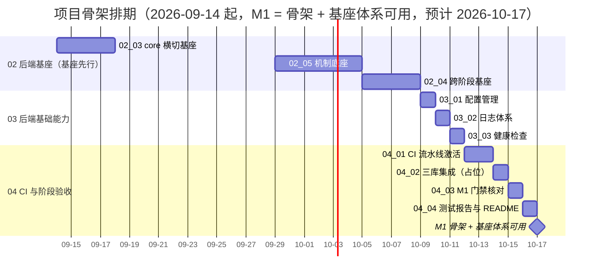

# 项目骨架计划

> BMS 基础管理系统 · 阶段一（项目骨架（含后端基座）/ M1 骨架 + 基座可用）排期计划：已完成 8 项，剩余 23 项

[文档首页](../../../文档首页.md) › 项目骨架计划　|　[任务基线 →](../任务/02_后端基座/02_后端基座.md)　[需求基线 →](../需求/00_需求_项目骨架.md)

## 1. 计划说明 

- **排期对象**：阶段一 29 条需求对应任务——域 01 工程骨架 **6/6 已完成**；域 02 后端基座 16 条（按基座分层 5 个子域，嵌套子任务并入其直属父任务行）；域 03 后端基础能力 3 条；域 04 CI 与阶段验收 4 条。
- **顺序口径（基座先行）**：后端基座按基座体系自下而上——core 横切（异常先行）→ 模块基类（含业务对接层基类占位）→ 机制底座（数据访问 / 多租户拓扑 / 模块注册，接口占位）→ 根基类与集合体系登记 → 跨阶段基座登记；随后才做依赖基座的域 03 后端基础能力（配置 / 日志 / 健康检查）；域 04 验收收口在最后。
- **本阶段基座口径**：机制类（数据访问 / 三库 / 租户 / 迁移 / 模块注册 / 三库集成）只落**接口占位**（返回固定或批量数据、不连真库、不跑迁移、不建表），工时按占位口径重估；真实实现随首个落库阶段（认证 / RBAC）填实现，不进本阶段窗口。
- **排期口径**：自 2026-09-14 起排；域 02 约 4 周（41h，串行兼职）、域 03 3 天（8h）、域 04 一周（8h）；缓冲至 2026-10-17，**M1 门禁预计 2026-10-17**。
- **工时**：已完成 65h；剩余 39h（域 02 23h + 域 03 8h + 域 04 8h）；阶段合计 **104h**（基座按接口占位口径，原实现口径 63h）。
- **里程碑锚点**：M1 = **骨架 + 基座体系可用**（原「M1 骨架可用」与「M2 后端基座可用」合并；原 M2 基线 2026-10-26，本计划预计 2026-10-17）；后续里程碑整体前移一位（原 M3 前端组件库起）。
- **负责人**：minjian（兼职，单人）。

## 2. 已完成任务（2026-09-10） 

| 编号 | 任务 | 工时（重估） | 完成日期 | 任务文件 |
| --- | --- | --- | --- | --- |
| 01_01 | monorepo 仓库根骨架 | 3h | 2026-09-10 | [01_01](../任务/01_工程骨架/01_工程骨架_01_monorepo仓库骨架/01_工程骨架_01_monorepo仓库骨架.md) |
| 01_02 | backend 工程初始化 | 3h | 2026-09-10 | [01_02](../任务/01_工程骨架/01_工程骨架_02_backend工程初始化/01_工程骨架_02_backend工程初始化.md) |
| 01_03 | backend 分层目录与职责 | 21h | 2026-09-10 | [01_03](../任务/01_工程骨架/01_工程骨架_03_backend分层目录与职责/01_工程骨架_03_backend分层目录与职责.md) |
| 01_04 | frontend 工程初始化 | 15h | 2026-09-10 | [01_04](../任务/01_工程骨架/01_工程骨架_04_frontend工程初始化/01_工程骨架_04_frontend工程初始化.md) |
| 01_05 | frontend-mobile 工程初始化 | 2h | 2026-09-10 | [01_05](../任务/01_工程骨架/01_工程骨架_05_frontend-mobile工程初始化/01_工程骨架_05_frontend-mobile工程初始化.md) |
| 01_06 | 依赖锁定与 Python 3.14 兼容验证 | 3h | 2026-09-10 | [01_06](../任务/01_工程骨架/01_工程骨架_06_依赖锁定与Python3.14兼容验证/01_工程骨架_06_依赖锁定与Python3.14兼容验证.md) |
| 02_01 | 根基类与集合体系 | 1h | 2026-09-13 | [02_01](../任务/02_后端基座/02_后端基座_01_根基类与集合体系/02_后端基座_01_根基类与集合体系.md) |
| 02_02 | 模块基类 | 17h | 2026-09-13 | [02_02](../任务/02_后端基座/02_后端基座_02_模块基类/02_后端基座_02_模块基类.md) |

**01 工程骨架域 6/6 完成**（含嵌套子任务：01-3-1 基础类 4h、01-3-2 并发集合与并发安全 8h、01-3-3 Redis 复合操作与并发语义 6h、01-4-1 前端基础类 6h、01-4-2 前端公共组合式与工具基座 6h）；01_03 重估 21h、01_04 重估 15h。**02_01 根基类与集合体系**已于 2026-09-13 登记核对完成（需求 02-1 ~ 02-4）。**02_02 模块基类**已于 2026-09-13 完成（含嵌套 02-2-1 ~ 02-2-4：数据访问 / 服务 / 请求响应 / ORM 模型基类，需求 02-5 ~ 02-8）。

## 3. 剩余任务排期（自 2026-09-14） 

| 编号 | 任务 | 工时 | 依赖 | 排期窗口 | 备注 |
| --- | --- | --- | --- | --- | --- |
| 02_03 | core 横切基座 | 8h | 工程骨架（01_03） | 2026-09-14 ~ 2026-09-17 | 异常与统一响应**落地**先行；配置 / 安全 / 日志结构占位；含 02-3-1 ~ 02-3-4 |
| 02_05 | 机制底座 | 7h | 02_02、02_03 | 2026-09-29 ~ 2026-10-04 | 数据访问 / 多租户拓扑 / 模块注册接口占位；含 02-5-1 ~ 02-5-3 |
| 02_04 | 跨阶段基座 | 8h | 02_01 ~ 02_03 | 2026-10-05 ~ 2026-10-08 | 六类基座登记 + 回补窗口 |
| 03_01 | 配置管理 | 3h | 01_02、01_03 | 2026-10-09 | 真实读取 `config.toml` + 环境分层 + 启动校验，落地后回填 02_03 基座登记 |
| 03_02 | 日志体系 | 3h | 03_01（配置加载） | 2026-10-10 | structlog JSON / 上下文字段 / 脱敏 / 请求中间件 |
| 03_03 | 健康检查 | 2h | 03_01（配置） | 2026-10-11 | `/healthz` `/readyz`；`database` 检查项随数据访问实现（后续阶段）启用 |
| 04_01 | CI 流水线激活 | 3h | 03_02、03_03 | 2026-10-12 ~ 2026-10-13 | 冒烟层 + 重验证层就绪项 + 覆盖率门禁（进行中） |
| 04_02 | 三库集成与流水线收口（占位） | 1h | 02_05（数据访问占位）、04_01 | 2026-10-14 | 测试库流程脚本占位 + 用例骨架 + 开关守卫口径 |
| 04_03 | M1 验收门禁核对 | 2h | 阶段一全部域 | 2026-10-15 | 骨架三项 + 基座体系逐项证据与结论回写 |
| 04_04 | 测试报告与 README | 2h | 04_03 | 2026-10-16 | 报告四章节 + README 一致 + 遗留项登记 |

剩余合计 **39h**；缓冲至 2026-10-17，M1 基线 2026-10-17。

### 3.1 后续阶段待办（不占本阶段日期） 

| 待办 | 后续阶段 | 说明 |
| --- | --- | --- |
| 数据访问真实实现（引擎 / 会话 / 四库方言 / 读写分离） | 认证 / RBAC 阶段 | 占位接口填实现，首次落库时落地；填 `BaseDbRepository` 骨架、`DbUnitOfWork` 事务与 `_resolve_binding` 钩子 |
| 三库拓扑 / 平台库表 / 批量迁移 / 租户隔离实测 | 认证 / RBAC 阶段 | 占位声明填实现并实测（含达梦方言） |
| 模块注册落库与接库校验 | 模块接入阶段 | `sys_module` 落表、启动 / CI 接库查重 |
| 三库真库集成测试（MySQL / PostgreSQL / 达梦） | 首个落库阶段 | 重验证层三库 job 激活（`deploy/ci/verify-enabled`） |
| Redis 集成用例（真实 Redis / Lua / WATCH / 版本号） | 首个落库阶段 | `BMS_TEST_REDIS_URL` 注入，随 04_02 重验证层执行（01-3-3 已实测通过，2 条） |
| WorkerId 自动注册（Redis） | 容器化部署阶段 | 基于 Redis 自动注册全局唯一 WorkerId（动态扩容），替代 `BMS_WORKER_ID` 配置注入 |
| 认证 / 权限错误码实现与测试 | 认证 / RBAC 阶段 | `AuthError`（20001,401）/ `PermissionError`（30001,403）码位已建；认证 / 鉴权实现、错误码细分与用例随对应阶段（架构「错误码分段」节登记） |
| 安全原语真实实现与依赖注入 | 认证阶段 | `BaseSecurity` 原语（密码哈希 bcrypt/argon2、JWT 双 token、会话黑名单）填实现并接入依赖注入 |
| 缓存 Region 分域基座 | 通用能力阶段 | dogpile Region 分域 + 全局版本号 + 三防 |
| 数据范围注入基座 | RBAC 阶段 | `BaseRepository` 范围注入钩子，规则由 RBAC 提供 |
| 分片路由基座 | 分布式与监控阶段 | `ShardingRouter` 抽象 + 按月分表落地；填 `_resolve_shard` 预留钩子 |
| 事件发布 / 消费基座 | 系统集成与消息阶段 | 统一发布接口 + 消费基类（分区有序） |
| Celery 任务基座 | 通用能力阶段 | `sys_task` 调度基类 + 执行记录 |
| ORM 审计捕获基座 | 通用能力阶段 | ORM 事件捕获 + 分区有序消费（哈希链） |

> 待办实施时在**对应阶段计划**登记窗口（同一任务文档，不重复建任务）。

## 4. 排期甘特图 

## 5. M1 验收门禁 

门禁定义与逐项核对见 [需求总览 · M1 验收门禁](../需求/00_需求_项目骨架.md#accept)（骨架三项 + 基座体系六项，共 9 个验收点）。本计划下的达成路径：

| 验收点 | 对应任务 | 达成路径 |
| --- | --- | --- |
| 本地起服务 | 01_01 ~ 01_06、03_01 | 三工程骨架已就位（2026-09-10）；配置管理落地后按环境启动 |
| 健康检查正常 | 03_03 | `/healthz` 存活 200；`/readyz` Redis 检查 200/503；`database` 项随数据访问真实实现启用 |
| CI 流水线激活通过 | 04_01、04_02 | 含代码改动的 main 推送跑冒烟层全绿；重验证层就绪项全绿（三库真库 job 守卫） |
| 基座继承链就位 | 02_01、02_02、02_03 | 09-14 ~ 10-08 基类清单与代码一致、继承约定可核对 |
| 机制底座接口齐备（占位可跑） | 02_05 | 09-29 ~ 10-04 接口 / 抽象就位、依赖注入可解析、占位返回固定 / 批量数据 |
| 异常体系生效 | 02_03 | 09-14 ~ 09-17 `BizError` 与统一响应落地，临时处理器移除 |
| 配置 / 安全 / 日志基座结构就位 | 02_03、03_01、03_02 | 结构声明就位；真实读取由 03_01 落地后回填登记 |
| 跨阶段基座登记齐备 | 02_04 | 10-05 ~ 10-08 六类基座登记与回补窗口写入计划 |
| 验收留痕齐备 | 04_03、04_04 | 10-15 ~ 10-16 门禁证据索引 + 测试报告 + 遗留项登记 |

**里程碑对照**（《总体项目规划》「里程碑」节基线，并入基座体系后重排）：

| 里程碑 | 基线 | 本计划预计 | 说明 |
| --- | --- | --- | --- |
| M1 骨架 + 基座体系可用 | 2026-09-28（原 M1）/ 2026-10-26（原 M2） | 2026-10-17 | 骨架三项 + 基座体系六项 |
| M2 组件库可用 | 原 M3 顺延 | 顺延重排 | 前端组件库阶段（见《总体项目规划》「里程碑」节） |

## 6. 风险与对策 

| 风险 | 影响 | 对策 |
| --- | --- | --- |
| 占位实现「能跑不报错」要求被弱化 | 上层链路无法先跑通，占位失去意义 | 占位契约用例护栏：依赖注入可解析、应用可启动、固定 / 批量数据可断言；`pytest` 门禁覆盖 |
| 机制类实现推迟到后续阶段 | 后续阶段需回填实现并补实测（三库 / 达梦 / 租户隔离） | 本阶段在计划「后续阶段待办」表逐条登记，实施时在该阶段计划登记窗口；需求文本保留实现要点 |
| `BaseModel` 四库类型映射与实际落库差异 | 后续落库返工 | 映射表随需求固化并在模型注释标注；达梦按 Oracle 兼容口径实测 |
| 基座与上层能力边界模糊（配置 / 日志） | 两处重复实现 | 明确「基座只落结构与占位、真实读取由 03 域落地并回填登记」；在需求 02-10 / 02-11 与 03-1 / 03-2 互相引用 |
| CI 基础镜像 push 报 `blob unknown` | 镜像推送降级 best-effort | 单 runner 本机镜像已可用，不阻塞冒烟层；继续排查 registry 后恢复强制推送 |
| 重验证层部分 job 未就绪（E2E 用例、Trivy 外网、三库集成） | 重验证层不完整 | 以 `deploy/ci/verify-enabled` 开关守卫，逐项修复就绪后开启 |
| 单人兼职投入不稳 | 里程碑延期 | 串行保守排期 + 缓冲；必要时先保基座体系核心（异常体系 → 模块基类 → 业务对接层占位） |

> 本文档依《文档生成规范》编写
