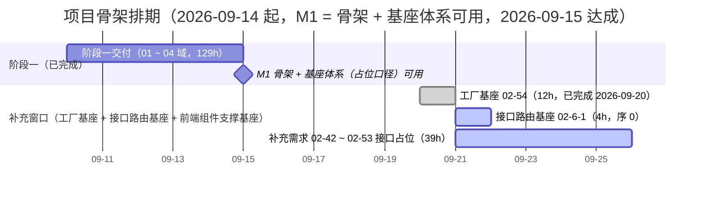

# 项目骨架计划

> BMS 基础管理系统 · 阶段一（项目骨架（含后端基座）/ M1 骨架 + 基座体系（占位口径）可用）排期计划：主体已完成 18 项 + 补充任务已完成 9 项（工厂基座 `02-3-15`、接口路由基座 `02-6-1`、用户偏好基座 `02-4-23`、列表查询与偏好契约基座 `02-4-20`、通知中心接口契约基座 `02-4-19`、AI 对话基座 `02-4-22`、全文检索查询契约基座 `02-4-21`、组织主数据查询基座 `02-4-16`、字典取数与缓存契约基座 `02-4-17`，均 2026-09-20）；因前端组件库实施与接口占位路由缺口追加补充需求（02-42 ~ 02-55），02_03 / 02_04 重开为「部分完成」并新增 02_06 接口层基座，剩余 5 项补充嵌套子任务（16h）

[文档首页](../../../文档首页.md) › 项目骨架计划　|　[任务基线 →](../任务/02_后端基座/02_后端基座.md)　[需求基线 →](../需求/00_需求_项目骨架.md)

## 1. 计划说明 

- **排期对象**：阶段一 68 条需求对应任务——域 01 工程骨架 **6/6 已完成**；域 02 后端基座 55 条（按基座分层 6 个子域 + 补充扩展基座挂入 02/02/03/04，嵌套子任务并入其直属父任务行；其中补充三「前端组件支撑基座」`02-42` ~ `02-53` 与补充四「工厂基座」`02-54`、补充五「接口路由基座」`02-55` 为 2026-09-20 追加，随阶段一补做窗口实施）；域 03 后端基础能力 3 条（任务域已建，[03 后端基础能力](../任务/03_后端基础能力/03_后端基础能力.md)，3/3 已完成、8h）；域 04 CI 与阶段验收 4 条（任务域已建，[04 CI 与阶段验收](../任务/04_CI与阶段验收/04_CI与阶段验收.md)，**4/4 已完成、8h**；无剩余）。
- **顺序口径（基座先行）**：后端基座按基座体系自下而上——core 横切（异常先行）→ 模块基类（含业务对接层基类占位）→ 机制底座（数据访问 / 多租户拓扑 / 模块注册，接口占位）→ 根基类与集合体系登记 → 跨阶段基座登记；随后才做依赖基座的域 03 后端基础能力（配置 / 日志 / 健康检查）；域 04 验收收口在最后。补充五接口路由基座收口接口占位任务的统一路由基础设施，排在补做窗口序 0。
- **本阶段基座口径**：机制类（数据访问 / 三库 / 租户 / 迁移 / 模块注册 / 三库集成）只落**接口占位**（返回固定或批量数据、不连真库、不跑迁移、不建表），工时按占位口径重估；真实实现随阶段二 后端基座填实现，不进本阶段窗口。
- **排期口径**：自 2026-09-14 起排；域 02 约 3 周（66h，含补充扩展基座 25h，串行兼职）、域 03 3 天（8h）、域 04（8h）；**实际于 2026-09-15 全部完成**（M1 基线 2026-09-28，提前 13 天；工期偏差见《[项目骨架阶段测试报告](../01_测试报告_项目骨架.md)》§4）。
- **工时**：已完成 **168h**（主体 129h + 补充四工厂基座 12h + 补充五接口路由基座 4h + 补充三用户偏好基座 2h + 列表查询与偏好契约基座 4h + 通知中心接口契约基座 3h + AI 对话基座 4h + 全文检索查询契约基座 2h + 组织主数据查询基座 4h + 字典取数与缓存契约基座 4h）；剩余 **16h**（补充嵌套子任务 5 项：`02-3-14`、`02-4-18`、`02-4-24` ~ `02-4-26`）；阶段合计 **184h**（基座按接口占位口径，原实现口径 63h）。
- **里程碑锚点**：M1 = **骨架 + 基座体系（占位口径）可用**（2026-09-15 已达成）；**M2 = 后端基座（真实实现）可用**，随阶段二 后端基座交付（机制落库、三库实测与阶段验收，范围见 §3.1）；后续 M3 后端插件化、M4 前端组件库等以《总体项目规划》「里程碑」节为准。
- **负责人**：minjian（兼职，单人）。

## 2. 已完成任务（2026-09-10 ~ 2026-09-20） 

| 编号 | 任务 | 工时（重估） | 完成日期 | 任务文件 | 偏差与遗留 |
| --- | --- | --- | --- | --- | --- |
| 01_01 | monorepo 仓库根骨架 | 3h | 2026-09-10 | [01_01](../任务/01_工程骨架/01_工程骨架_01_monorepo仓库骨架/01_工程骨架_01_monorepo仓库骨架.md) | 无 |
| 01_02 | backend 工程初始化 | 3h | 2026-09-10 | [01_02](../任务/01_工程骨架/01_工程骨架_02_backend工程初始化/01_工程骨架_02_backend工程初始化.md) | 无 |
| 01_03 | backend 分层目录与职责 | 21h | 2026-09-10 | [01_03](../任务/01_工程骨架/01_工程骨架_03_backend分层目录与职责/01_工程骨架_03_backend分层目录与职责.md) | 无 |
| 01_04 | apps/desktop 工程初始化 | 15h | 2026-09-10 | [01_04](../任务/01_工程骨架/01_工程骨架_04_frontend工程初始化/01_工程骨架_04_frontend工程初始化.md) | 无 |
| 01_05 | frontend-mobile 工程初始化 | 2h | 2026-09-10 | [01_05](../任务/01_工程骨架/01_工程骨架_05_frontend-mobile工程初始化/01_工程骨架_05_frontend-mobile工程初始化.md) | 无 |
| 01_06 | 依赖锁定与 Python 3.14 兼容验证 | 3h | 2026-09-10 | [01_06](../任务/01_工程骨架/01_工程骨架_06_依赖锁定与Python3.14兼容验证/01_工程骨架_06_依赖锁定与Python3.14兼容验证.md) | 无 |
| 02_01 | 根基类与集合体系 | 1h | 2026-09-13 | [02_01](../任务/02_后端基座/02_后端基座_01_根基类与集合体系/02_后端基座_01_根基类与集合体系.md) | 无 |
| 02_02 | 模块基类 | 18h | 2026-09-13 | [02_02](../任务/02_后端基座/02_后端基座_02_模块基类/02_后端基座_02_模块基类.md) | 无（嵌套 05 排序契约随本任务完成，需求 02-40） |
| 02_03 | core 横切基座（含扩展 9 项） | 17h | 2026-09-14 | [02_03](../任务/02_后端基座/02_后端基座_03_core横切基座/02_后端基座_03_core横切基座.md) | 无（嵌套 05 ~ 13 全部交付：数据脱敏 / 分布式锁 / 验证码密码策略 / 降级熔断 / 权限校验 / 限流幂等防重放 / 可观测性 / 健康检查项 / 开放接口 OAuth2，需求 02-24~02-26、02-29~02-32、02-39、02-41；Kiwi 39~46）。**2026-09-20 追加补充需求 02-42（验证码渠道扩展基座），本父任务重开为「部分完成」，见 §3**） |
| 02_04 | 跨阶段基座（含扩展 15 项） | 23h | 2026-09-14 | [02_04](../任务/02_后端基座/02_后端基座_04_跨阶段基座/02_后端基座_04_跨阶段基座.md) | 无（嵌套 01 ~ 15 全部交付：文件存储 / LLM 适配 / 全文检索 / 通知渠道 / 实时推送 / 出站集成 / 工作流引擎 / IdP 会话 / 数据查询提供者 / 导入导出 / 审计哈希链 / 归档策略 / 字段类型注册表 / 国际化翻译 / 首页工作台卡片，需求 02-17~02-23、02-27~02-28、02-33~02-38；Kiwi 47~61）。**2026-09-20 追加补充需求 02-43 ~ 02-53（前端组件支撑基座 11 项），本父任务重开为「部分完成」，见 §3**；2026-09-20 起补充子任务随补做窗口交付（02-4-23 / 02-4-20 / 02-4-19 / 02-4-22 / 02-4-21 / 02-4-16 / 02-4-17 已完成，Kiwi 780 / 781 / 812 / 820 / 821 / 843 / 844），剩余 5 项见 §3） |
| 02_05 | 机制底座 | 7h | 2026-09-13 | [02_05](../任务/02_后端基座/02_后端基座_05_机制底座/02_后端基座_05_机制底座.md) | 偏差：`EngineFactory` 补 `drop(db_key)`（已回写 02-5-1 设计） |
| 02_06 | 接口层基座 | 4h | 2026-09-20 | [02_06](../任务/02_后端基座/02_后端基座_06_接口层基座/02_后端基座_06_接口层基座.md) | 无（新建父任务；嵌套 01 接口路由基座随本任务完成，需求 02-55，Kiwi 779） |
| 03_01 | 配置管理 | 3h | 2026-09-14 | [03_01](../任务/03_后端基础能力/03_后端基础能力_01_配置管理/03_后端基础能力_01_配置管理.md) | 设计补充：环境覆盖文件 `config.{env}.toml` 与 `.env.example`（需求只锁 `config.toml` 分区/关键键）；`python-dotenv` 显式声明为运行时依赖；`BMS_WORKER_ID` 旧名兜底已按拍板移除（Kiwi 30 调整）；prod 密钥形态复核归口 §3.1「安全原语」行（Kiwi 62） |
| 03_02 | 日志体系 | 3h | 2026-09-14 | [03_02](../任务/03_后端基础能力/03_后端基础能力_02_日志体系/03_后端基础能力_02_日志体系.md) | 实现细节：`ts` 时间戳改用自定义处理器（本地时区 ISO8601 含偏移，取代 `TimeStamper(utc=False)` 朴素本地时间）；慢请求阈值 500/1000/2000 落三环境覆盖（跨任务回写 03-1）；trace_id 请求态回写（`X-Trace-Id` 在未捕获异常响应亦回写）；Kiwi 63 |
| 03_03 | 健康检查 | 2h | 2026-09-14 | [03_03](../任务/03_后端基础能力/03_后端基础能力_03_健康检查/03_后端基础能力_03_健康检查.md) | 拍板升级：响应契约 `healthy` / `detail` / `items` → `ok` / `error` / `checks`；`aggregate` 并发 + 单项 / 整体两级超时（`[health]` 配置，跨任务回写 03-1）；`database` 检查项随数据访问底座落地启用；Kiwi 64 / 65 |
| 04_01 | CI 流水线激活 | 3h | 2026-09-14 | [04_01](../任务/04_CI与阶段验收/04_CI与阶段验收_01_CI流水线激活/04_CI与阶段验收_01_CI流水线激活.md) | 无（2026-09-15 后续落实：重验证层改分档 `deploy/ci/verify/*` 并开 P1 + P2，见[实施 02](../任务/04_CI与阶段验收/04_CI与阶段验收_01_CI流水线激活/实施/02_实施_02_重验证层分档激活.md)；核心模块覆盖率 ≥ 80% 与前端覆盖率扩面已登记 §3.1） |
| 04_02 | 三库集成与流水线收口（占位） | 1h | 2026-09-15 | [04_02](../任务/04_CI与阶段验收/04_CI与阶段验收_02_三库集成与流水线收口/04_CI与阶段验收_02_三库集成与流水线收口.md) | 无（偏差：`tests/db/test_tenant.py` 未重复扩充——既有 Kiwi 38 已覆盖解析链 / 豁免 / 未知租户 / 依赖；遗留：真实建库迁移与方言实测随阶段二 后端基座，激活前置见 §3.1） |
| 04_03 | M1 验收门禁核对 | 2h | 2026-09-15 | [04_03](../任务/04_CI与阶段验收/04_CI与阶段验收_03_M1验收门禁核对/04_CI与阶段验收_03_M1验收门禁核对.md) | 无（门禁 9 达标 + 1 进行中，第 10 项随 04_04；核对手法微调两处、新增状态一致性核对脚本，均已回写设计 §4/§5 与实施记录 §6） |
| 04_04 | 测试报告与 README（阶段一收口） | 2h | 2026-09-15 | [04_04](../任务/04_CI与阶段验收/04_CI与阶段验收_04_测试报告与README/04_CI与阶段验收_04_测试报告与README.md) | 无（阶段测试报告四章节 + 复盘 + 附录；新增治理脚本 `collect_metrics.py` / `review_stage.py`；门禁第 10 行转达标、54/54 闭环；README 四份同步） |
| 02-3-15 | 工厂基类（后端工厂纳入基类体系） | 12h | 2026-09-20 | [02-3-15](../任务/02_后端基座/02_后端基座_03_core横切基座/02_后端基座_03_core横切基座_15_工厂基类/02_后端基座_03_core横切基座_15_工厂基类.md) | 无（`BaseFactory` + 四域工厂基类；`EngineFactory` / `SessionFactory` / `ApplicationFactory` / `IdGeneratorFactory` / 装配层插件实现工厂类化；函数入口 `create_app` / `build_session_factory` / `generate_id` / `configure_id_generator` 移除；关键工厂经工厂专用注册表按配置解析；Kiwi 778） |
| 02-6-1 | 接口路由基座 | 4h | 2026-09-20 | [02-6-1](../任务/02_后端基座/02_后端基座_06_接口层基座/02_后端基座_06_接口层基座_01_接口路由基座/02_后端基座_06_接口层基座_01_接口路由基座.md) | 无（`BaseRouter` + `RouterRegistry` 统一挂载 + 参数绑定工厂 + `require_auth` 占位；既有 4 路由改基座；Kiwi 779） |
| 02-4-23 | 用户偏好基座 | 2h | 2026-09-20 | [02-4-23](../任务/02_后端基座/02_后端基座_04_跨阶段基座/02_后端基座_04_跨阶段基座_23_用户偏好基座/02_后端基座_04_跨阶段基座_23_用户偏好基座.md) | 无（`BasePreferenceStore` / `NullPreferenceStore` / 常量 / 键规范 / `SysUserPreference` 表声明 / 占位路由；Kiwi 780） |
| 02-4-20 | 列表查询与偏好契约基座 | 4h | 2026-09-20 | [02-4-20](../任务/02_后端基座/02_后端基座_04_跨阶段基座/02_后端基座_04_跨阶段基座_20_列表查询与偏好契约基座/02_后端基座_04_跨阶段基座_20_列表查询与偏好契约基座.md) | 无（`FilterSpec` / `BaseFilterQuery` / `ListPreference` / `BaseQuerySchemeStore` 与占位路由；Kiwi 781） |
| 02-4-19 | 通知中心接口契约基座 | 3h | 2026-09-20 | [02-4-19](../任务/02_后端基座/02_后端基座_04_跨阶段基座/02_后端基座_04_跨阶段基座_19_通知中心接口契约基座/02_后端基座_04_跨阶段基座_19_通知中心接口契约基座.md) | 偏差：Kiwi 用例号为 **812**（平台预估 782 已被自动导入用例占用，按《AI开发规范》「编号以平台自增主键为准、既有编号不得复用」取登记返回值）；其余无（`BaseNotificationCenter` / `NullNotificationCenter` / `Notification` / `NotificationPayload` / `SysNotification` 表声明 / 占位路由） |
| 02-4-22 | AI 对话基座 | 4h | 2026-09-20 | [02-4-22](../任务/02_后端基座/02_后端基座_04_跨阶段基座/02_后端基座_04_跨阶段基座_22_AI对话基座/02_后端基座_04_跨阶段基座_22_AI对话基座.md) | 无（新建 `app/chat/`；`BaseChatStream` / `BaseChatSessionStore` / `BaseChatActionGate` 三契约 + 空实现 + `AiChatLog` 表声明 + 占位路由 `/api/v1/chat`；Kiwi 820） |
| 02-4-21 | 全文检索查询契约基座 | 2h | 2026-09-20 | [02-4-21](../任务/02_后端基座/02_后端基座_04_跨阶段基座/02_后端基座_04_跨阶段基座_21_全文检索查询契约基座/02_后端基座_04_跨阶段基座_21_全文检索查询契约基座.md) | 偏差：代码落点由「扩展 `02-19` 检索域」改为**新建独立 `app/globalsearch/` 域**（三契约）、加 `domains()` 与错误码 `10101`~`10107`；其余无（`BaseGlobalSearch` / `BaseAuditSearch` / `BaseFileContentSearch` 三契约 + 空实现 + 降级字段 + 占位路由 `/api/v1/search`；Kiwi 821） |
| 02-4-16 | 组织主数据查询基座 | 4h | 2026-09-20 | [02-4-16](../任务/02_后端基座/02_后端基座_04_跨阶段基座/02_后端基座_04_跨阶段基座_16_组织主数据查询基座/02_后端基座_04_跨阶段基座_16_组织主数据查询基座.md) | 无（新建 `app/org/`；`BaseOrgDataSource` / `BaseOrgNameResolver` 两契约 + 固定 / 批量空实现 + `OrgUser` / `OrgPost` / `OrgDept` / `OrgNameRef` 数据契约 + 组织错误码 `30101`~`30103` + 占位路由 `/api/v1/org`；Kiwi 843） |
| 02-4-17 | 字典取数与缓存契约基座 | 4h | 2026-09-20 | [02-4-17](../任务/02_后端基座/02_后端基座_04_跨阶段基座/02_后端基座_04_跨阶段基座_17_字典取数与缓存契约基座/02_后端基座_04_跨阶段基座_17_字典取数与缓存契约基座.md) | 无（新建 `app/dict/`；`BaseDictSource` / `BaseDictTranslator` / `DictCacheRegion` 三契约 + 参数对象 / 结果契约 + 空实现 + 字典错误码 `40101`~`40103` + 占位路由 `/api/v1/dicts`；Kiwi 844） |

**01 工程骨架域 6/6 完成**（含嵌套子任务：01-3-1 基础类 4h、01-3-2 并发集合与并发安全 8h、01-3-3 Redis 复合操作与并发语义 6h、01-4-1 前端基础类 6h、01-4-2 前端公共组合式与工具基座 6h）；01_03 重估 21h、01_04 重估 15h。**02_01 根基类与集合体系**已于 2026-09-13 登记核对完成（需求 02-1 ~ 02-4）。**02_02 模块基类**已于 2026-09-13 完成（嵌套 05 排序契约基座，需求 02-40；含 `SortSpec` / `BaseSortQuery` 排序契约与内存排序、DB 侧 `_apply_sort` 占位）。**02_03 core 横切基座**已于 2026-09-14 完成（嵌套 05 ~ 13 全部交付，Kiwi 39 ~ 46）；**02_04 跨阶段基座**已于 2026-09-14 完成（嵌套 01 ~ 15 全部交付，Kiwi 47 ~ 61）：02_03 含嵌套 05 ~ 13 数据脱敏 / 分布式锁 / 验证码密码策略 / 降级熔断 / 权限校验 / 限流幂等 / 可观测性 / 健康检查项 / 开放接口 OAuth2；02_04 含嵌套 01 ~ 15 文件存储 / LLM / 全文检索 / 通知渠道 / 实时推送 / 出站集成 / 工作流适配 / IdP 会话 / 查询提供者 / 导入导出 / 哈希链 / 归档策略 / 字段类型注册表 / 国际化翻译 / 工作台卡片（需求 02-17 ~ 02-41）。**02_05 机制底座**已于 2026-09-13 完成（含嵌套 02-5-1 ~ 02-5-3：数据访问底座、多租户数据拓扑、模块注册表，需求 02-14 ~ 02-16）。**02_03 嵌套 05 数据脱敏基座**已于 2026-09-14 完成（需求 02-29；含 `BaseMasker` / `NullMasker` + 提前交付的 `BasePermissionChecker` / `NullPermissionChecker`、`BaseSchema` 序列化自动掩码接入点，Kiwi 39）。**02_03 嵌套 06 分布式锁基座**已于 2026-09-14 完成（需求 02-30；含 `BaseDistributedLock` / `NullDistributedLock`、`build_lock_key` 与 `hold` 异步上下文，Kiwi 40）。**02_03 嵌套 07 验证码与密码策略基座**已于 2026-09-14 完成（需求 02-31；含 `BaseCaptcha` / `NullCaptcha` 与 `BasePasswordPolicy` / `NullPasswordPolicy`、验证码 key 与常量清单，Kiwi 41）。**02_03 嵌套 08 降级与熔断基座**已于 2026-09-14 完成（需求 02-32；含 `BaseFallbackPolicy` / `NullFallbackPolicy` 与 `BaseCircuitBreaker` / `NullCircuitBreaker`、`DEPENDENCIES` 依赖清单，Kiwi 42）。**02_03 嵌套 09 权限校验基座**已于 2026-09-14 完成（需求 02-24；核销式交付——复用 02-3-5 提前交付的 `BasePermissionChecker` / `NullPermissionChecker` / `require_permission`，零代码改动、用例复用 Kiwi 39，登记改标「02-3-9 复用核销」）。**02_03 嵌套 10 限流幂等防重放中间层**已于 2026-09-14 完成（需求 02-25；含 `BaseRateLimiter` / `IdempotencyStore` / `BaseReplayGuard` 三域契约与占位实现、`core/security.py` 签名原语 `SignatureCodec`（HMAC-SHA256，真实实现）与 `RateLimitError`（10005 / 429），Kiwi 43）。**02_03 嵌套 11 可观测性基座（指标与链路）**已于 2026-09-14 完成（需求 02-26；含 `BaseMetrics` / `BaseTracer` 两域契约与占位实现、`core/context.py` 链路上下文变量与入站 `TraceIdMiddleware`（纯 ASGI），Kiwi 44）。**02_03 嵌套 12 健康检查项注册表基座**已于 2026-09-14 完成（需求 02-39；含 `BaseHealthCheck` / `BaseHealthCheckRegistry` 契约与聚合模板、`NullHealthCheckRegistry` 占位、`/readyz` 占位聚合路由，Kiwi 45）。**02_03 嵌套 13 开放接口 OAuth2 服务端与 scope 基座**已于 2026-09-14 完成（需求 02-41；含 `BaseOAuthServer` / `BaseScopeChecker` 契约与占位实现、`ClientCredentials` / `OAuthToken` 数据契约与常量清单，Kiwi 46）——至此 **02_03 core 横切基座 / 02_04 跨阶段基座全部完成**。**03_03 健康检查**已于 2026-09-14 完成（真实 `redis` / `database` 检查项、聚合模板并发 + 单项 / 整体两级超时、启动完成态判定与 `/readyz` 响应契约升级；Kiwi 64 / 65）——至此 **03 域 3/3 全部完成**。**04_01 CI 流水线激活**已于 2026-09-14 完成（Kiwi 66；冒烟层补齐 pyright / 模块注册清单校验 / 移动端 lint+test 与双端覆盖率阈值 70%，`needs` 并行后流水线 170 全绿、总时长 49 秒）——至此 **04 域 1/4 完成**。

## 3. 剩余任务排期（自 2026-09-14） 

> **执行序口径（组件依赖序）**：先落统一路由基础设施（接口路由基座 `02-6-1`），再补被复用的底座件（用户偏好 / 列表查询 / 通知中心），后做 AI / 检索，再做字段件（组织 / 字典 / 文件 / 验证码），最后是与已交付前端件配套的（租户 / 打印 / 图标）；与前端组件库实施序 `07_05 → 07_04 → 08_10 → 07_07 → 06_05 → 06_06 → 06_07 → 06_04` 对齐。

| 编号 | 任务 | 工时 | 依赖 | 排期窗口 | 备注 | 偏差与遗留 |
| --- | --- | --- | --- | --- | --- | --- |
| 02-4-18 | 对象存储扩展基座 | 3h | 02_04、`02-17` / `02-25` | 阶段一补做窗口（序 8） | 需求 02-45；前端 06_07 文件上传字段 | 未开始 |
| 02-3-14 | 验证码渠道扩展基座（滑块 / 短信） | 4h | 02_03、`02-31` | 阶段一补做窗口（序 9） | 需求 02-42；前端 06_04 验证码字段 | 未开始 |
| 02-4-24 | 租户自助与品牌基座 | 3h | 02_04、`02-15` | 阶段一补做窗口（序 10） | 需求 02-51；前端 08_03_02 | 未开始 |
| 02-4-25 | 打印模板与导出 PDF 基座 | 3h | 02_04、`02-17` / `02-33` | 阶段一补做窗口（序 11） | 需求 02-52；前端 08_03_03 | 未开始 |
| 02-4-26 | 自定义图标与代码校验基座 | 3h | 02_04、`02-28` / `02-25` | 阶段一补做窗口（序 12） | 需求 02-53；前端 08_02 | 未开始 |

03 域三个任务的登记见 [任务 · 03 后端基础能力](../任务/03_后端基础能力/03_后端基础能力.md)：[03_01 配置管理](../任务/03_后端基础能力/03_后端基础能力_01_配置管理/03_后端基础能力_01_配置管理.md)、[03_02 日志体系](../任务/03_后端基础能力/03_后端基础能力_02_日志体系/03_后端基础能力_02_日志体系.md)、[03_03 健康检查](../任务/03_后端基础能力/03_后端基础能力_03_健康检查/03_后端基础能力_03_健康检查.md)；三者与需求 03-1 ~ 03-3 一一对应，工时 / 依赖台账以本计划「已完成任务」表为准（剩余排期表已清空）。

剩余合计 **16h**（5 项补充嵌套子任务，需求 02-42 ~ 02-53 未完成部分）；阶段一主体于 **2026-09-15** 收口（M1 基线 2026-09-28，提前 13 天，M1 门禁 10 项全部达标），**补充四（工厂基座 `02-3-15`）、补充五（接口路由基座 `02-6-1`）与补充三用户偏好基座 `02-4-23`、列表查询与偏好契约基座 `02-4-20`、通知中心接口契约基座 `02-4-19`、AI 对话基座 `02-4-22`、全文检索查询契约基座 `02-4-21`、组织主数据查询基座 `02-4-16`、字典取数与缓存契约基座 `02-4-17` 已于 2026-09-20 完成**，其余补充三（前端组件支撑基座）随阶段一补做窗口实施。

### 3.1 后续阶段待办（不占本阶段日期） 

| 待办 | 后续阶段 | 说明 |
| --- | --- | --- |
| **重验证层激活路线（分档开关与顺序）** | P3 随容器化部署阶段；P4 随前端组件库（`e2e`）与阶段二 后端基座（`db`） | **2026-09-15 就绪评估结论**：开关由单文件 `deploy/ci/verify-enabled` 改为**分档文件** `deploy/ci/verify/{contract,defect,report,image,e2e,db}`，各 job 只守自己的档、删文件即关档。**P1 已开**：`contract`（swagger 契约快照）+ `defect`（失败自动上报）；**P2 已开**：`report`（Allure 结果归档 + 凭据齐备时 `--kiwicms` 导入 Kiwi 产品「BMS 自动化用例（CI）」，与策展库「BMS 基础管理系统」69 条隔离）。**P3 待开** `image`：前置＝`backend/Dockerfile`、`apps/desktop/Dockerfile`（Trivy 已确认 mjbk 可达 `ghcr.io`）。**P4 待开** `e2e`（前置：`tests/e2e` 用例、`--e2e-headless` 选项、Playwright 依赖与浏览器、job 内服务编排）与 `db`（前置：`ops/test_db.py` 的 create/migrate/drop 实现、`alembic/env.py` 在线分支、方言用例命名、masked 变量） |
| 数据访问真实实现（引擎 / 会话 / 四库方言 / 读写分离） | 阶段二 后端基座 | 占位接口填实现，首次落库时落地；填 `BaseDbRepository` 骨架、`DbUnitOfWork` 事务与 `_resolve_binding` 钩子 |
| 排序契约真实实现（DB 侧 ORDER BY 白名单拼接 / 四库 NULLS 口径 / 排序字段索引 / 分页限深与游标键 / 列表筛选） | 阶段二 后端基座（DB 侧排序）· 列表接口阶段（限深与筛选） | `_apply_sort` 钩子与 `sortable_fields` 白名单已就位、内存排序已生效；真实 SQL 拼接与防注入、四库空值口径对齐、索引配合、分页限深与列表筛选随列表接口落地 |
| 三库拓扑 / 平台库表 / 批量迁移 / 租户隔离实测 | 阶段二 后端基座 | 占位声明填实现并实测（含达梦方言） |
| 真实 Alembic 迁移与租户库初始化 | 阶段二 后端基座 | `alembic/env.py` 在线分支、`versions/` 迁移与种子、`ops` 脚本实执行（批量迁移 / 新租户初始化幂等） |
| 多租户引擎 LRU / 连接预算 / 实例并发隔离实测 | 阶段二 后端基座 | `EngineRegistry` 占位填实现并实测（LRU 阈值、连接预算、进程内锁 + Redis SETNX） |
| 租户解析接入 token 与全局中间件 | 阶段二 后端基座（全局中间件）· 认证阶段（token 兜底） | token `tenant_id` 兜底、全局租户中间件（豁免路径）、会话 / 缓存租户前缀 |
| 模块注册落库与接库校验 | 阶段二 后端基座 | `sys_module` 落表、启动 / CI 接库查重（结构声明与占位校验已就位） |
| 租户模块开关 `sys_tenant_module` | 租户管理阶段 | 租户-模块关系表（平台库）：开通勾选与启停、菜单 / 接口联动；逻辑引用 `sys_module` |
| 平台接口鉴权（`platform:manage`） | 认证 / RBAC 阶段 | `GET /api/v1/modules` 等平台接口接入权限码校验（当前暂不鉴权）；权限码校验取 `BasePermissionChecker` / `require_permission`（[02-3-9 权限校验基座](../任务/02_后端基座/02_后端基座_03_core横切基座/02_后端基座_03_core横切基座_09_权限校验基座/02_后端基座_03_core横切基座_09_权限校验基座.md) 于 2026-09-14 复用核销） |
| 错误码段扩容（3 位） | 模块数接近 90 时 | 放宽 `errcode_segment` 校验为 3 位（`100` 起）、错误码顺延至 7 位；列宽已留余量、既有段不变 |
| Allure 结果导入 Kiwi TCMS（接线） | **已完成（2026-09-15）** | 口径已接线（`deploy/ci/verify/report` 档，见[04-01 实施 02](../任务/04_CI与阶段验收/04_CI与阶段验收_01_CI流水线激活/实施/02_实施_02_重验证层分档激活.md)）：结果导入独立产品「BMS 自动化用例（CI）」（流水线 178 落 424 条执行），与策展库 69 条隔离；后续仅按需维护凭据 |
| 三库真实建库 / 迁移 / 集成用例与达梦方言实测（软删除复合唯一索引 NULL 语义、迁移 DDL、schema 前缀与大小写、类型映射） | 阶段二 后端基座 | `ops/test_db.py` 的 `create` / `migrate` / `drop` 填实现 + `alembic/env.py` 在线分支接通；真库用例按方言命名或加方言标记（保证 `pytest -k "$DB_DIALECT"` 有匹配用例，否则退出码 5「无用例收集」会误判失败）；CI/CD 变量 `MYSQL_TEST_PASSWORD` / `POSTGRES_TEST_PASSWORD` / `DM8_TEST_PASSWORD` / `MYSQL_ROOT_PASSWORD` / `GITLAB_API_TOKEN` 配齐（04-02 详细设计 §7.3） |
| 三库真库集成测试（MySQL / PostgreSQL / 达梦） | 阶段二 后端基座 | 重验证层三库 job 激活（`deploy/ci/verify/db` 档） |
| Redis 集成用例（真实 Redis / Lua / WATCH / 版本号；分布式锁 SETNX 竞争 / 令牌误放防护 / TTL 到期；验证码 Redis 存取与 `verify` 单次失效；健康检查 `/readyz` 全就绪） | 阶段二 后端基座 | `BMS_TEST_REDIS_URL` 注入，随 04_02 重验证层执行（01-3-3 已实测通过，2 条；锁集成用例出处 02-3-6；验证码集成用例出处 02-3-7——Pillow 出图用例归六 认证与安全阶段；健康检查集成用例出处 03-3） |
| WorkerId 自动注册（Redis） | 容器化部署阶段 | 基于 Redis 自动注册全局唯一 WorkerId（动态扩容），替代 `BMS_APP__WORKER_ID` 配置注入（旧名 `BMS_WORKER_ID` 兜底已随 03-1 闭环移除） |
| 认证 / 权限错误码实现与测试 | 认证 / RBAC 阶段 | `AuthError`（20001,401）/ `PermissionError`（30001,403）码位已建；认证 / 鉴权实现、错误码细分与用例随对应阶段（架构「错误码分段」节登记）；权限码拒绝路径已由 02_03 嵌套 01 全局处理器统一转响应（权限守卫出处 02-3-9 复用核销） |
| 安全原语真实实现与依赖注入 | 认证阶段 | `BaseSecurity` 原语（密码哈希 bcrypt/argon2、JWT 双 token、会话黑名单）填实现并接入依赖注入；prod `security.secret_key` 密钥形态复核（当前按非空校验兜底，出处 03-1） |
| 缓存 Region 分域基座 | 通用能力阶段 | 接 dogpile Region 分域 + 全局版本号 + 三防（`CacheRegion` 契约已就位）；角色 / 权限码集合缓存与失效随 RBAC 阶段接入本机制（需求 02-24） |
| 链路追踪与 OpenTelemetry 接入 | 分布式与监控阶段 | `trace_id` 入站生成 / 透传（`X-Trace-Id`）、otel-collector + Jaeger、`trace_id`/`span_id` 与日志关联（日志体系 / 阶段十二）；`BaseTracer` 契约与占位实现、`core/context.py` 链路上下文变量与入站 `TraceIdMiddleware` 已就位（02-3-11） |
| Prometheus 指标接入（`/metrics` 端点与采集口径） | 分布式与监控阶段 | 真实 prometheus-client 采集端点、标签维度与分位、Grafana 面板；`BaseMetrics` 契约与 `NullMetrics` 占位、`METRIC_KINDS` / `METRIC_NAMES` 命名清单已就位（02-3-11）；AI 成本 / 连接数 / 积压取数随各自模块阶段 |
| 数据范围注入基座 | RBAC 阶段 | `DataScope` 契约与 `BaseRepository._apply_data_scope` 钩子已就位；读写过滤规则由 RBAC 提供 |
| 分片路由基座 | 分布式与监控阶段 | 按月分表落地；`ShardingRouter` 抽象已就位、`_resolve_shard` 已接入（占位不路由） |
| 事件发布 / 消费基座 | 系统集成与消息阶段 | 统一发布接口 + 消费基类（分区有序） |
| Celery 任务基座 | 通用能力阶段 | `sys_task` 调度基类 + 执行记录 |
| ORM 审计捕获基座 | 通用能力阶段 | ORM 事件捕获 + 分区有序消费（哈希链） |
| 数据脱敏真实实现（掩码模板与策略分派 / `reveal` 解密 / 序列化接入 / 嵌套模型掩码） | 六 认证与安全 | 需求 02-29；`BaseMasker` 契约、`NullMasker` 占位与 `BaseSchema.masked_fields` 序列化接入点已就位（02-3-5），实现期要点见需求 02-29 `> 注：` 块 |
| `data:plain` 真实权限查询与 RBAC 主体链 | 七 RBAC | 需求 02-24；替换 `NullPermissionChecker`；`BasePermissionChecker` 契约由 02-3-5 提前交付，[02-3-9 权限校验基座](../任务/02_后端基座/02_后端基座_03_core横切基座/02_后端基座_03_core横切基座_09_权限校验基座/02_后端基座_03_core横切基座_09_权限校验基座.md) 于 2026-09-14 复用核销（不重复建设）；实现期要点见需求 02-24 `> 注：` 块 |
| 权限分层真实实现（菜单 / 表单 / 业务 / 按钮 / 动作 / 字段）+ 替换 `NullPermissionChecker` | 七 RBAC | 需求 02-24；业务权限为推导层不直接授予、字段权限 `visible` / `editable` 读时过滤与写时校验、角色权限码集合缓存与失效；`BasePermissionChecker` 契约与 `require_permission` 依赖工厂已就位（02-3-5 交付、02-3-9 复用核销） |
| 导出侧脱敏（列表导出 / 导入模板） | 导入导出阶段 | 需求 02-29；导出统一经 `BaseMasker`，持 `data:plain` 方可出明文（无权限输出掩码） |
| AI 交互落库前掩码 | 十九 AI 能力 | 需求 02-29；`ai_chat_log` 提示词与响应落库前经 `BaseMasker` 掩码（日志敏感字段脱敏已由 03_02 日志体系落地：密码 / token / 密钥不落原始值，见需求 03-2 `> 注：` 块） |
| 分布式锁真实实现（Redis SETNX + TTL / Lua 令牌比对释放 / `wait` 轮询 / 看门狗续租 / Redis 短超时降级） | 八 通用能力 | 需求 02-30；`BaseDistributedLock` 契约、`NullDistributedLock` 占位与 `build_lock_key` 已就位（02-3-6）；多副本互斥实测随十三 分布式与监控阶段收口 |
| 分布式锁消费方接入（幂等去重与防重放 / beat 防重 / 引擎创建防重 / 表单定制 DDL 每租户串行） | 02-3-10（本阶段）· 通用能力与部署阶段 · 阶段二 后端基座 · 表单定制阶段 | 均按 02-3-6 契约取用 `BaseDistributedLock` + `build_lock_key`；幂等去重与防重放叠加唯一约束兜底（见《架构设计 · 接口与集成》「幂等与防重放」节），引擎创建防重与进程内锁叠加（见《架构设计 · 子系统_多租户路由》「引擎注册表」节） |
| 验证码与密码策略真实实现（Pillow 出图经线程池 / Redis 存取 `bms:global:captcha:{uuid}` / `verify` 单次失效 / sys_config 策略规则 / `pwd_history` 比对 / 90 天有效期） | 六 认证与安全 | 需求 02-31；`BaseCaptcha` / `BasePasswordPolicy` 契约与 `NullCaptcha` / `NullPasswordPolicy` 占位、验证码 key 与常量清单已就位（02-3-7）；连续失败 3 次强制与账号锁定在登录侧 / 任务调度 |
| 降级与熔断真实实现（降级矩阵按依赖配置化与动作执行通道 / RocketMQ 降级时段标记与恢复补发 / 熔断失败计数窗口与阈值 / 半开探测 / 跨实例共享计数 / 告警联动） | 性能与安全 · 分布式与监控 | 需求 02-32；`BaseFallbackPolicy` / `BaseCircuitBreaker` 契约与 `NullFallbackPolicy` / `NullCircuitBreaker` 占位、`DEPENDENCIES` 依赖清单已就位（02-3-8）；限流内部降级归 02-3-10 |
| 限流 / 幂等 / 防重放真实实现（slowapi + Redis 后端与 IP / 用户 / client 档位、Redis 故障降级 memory 后端、配额告警与 `sys_tenant_quota` 联动 / SETNX 前置拦截 + 首次结果缓存 + 幂等键唯一约束兜底 / nonce Redis 去重与 `/api/open` ingress 接入） | 性能与安全 · 开放接口 · 阶段二 后端基座 | 需求 02-25；`BaseRateLimiter` / `IdempotencyStore` / `BaseReplayGuard` 契约与占位实现、key 拼接（`build_rate_limit_key` / `build_idempotency_key`）与签名原语 `SignatureCodec`（HMAC-SHA256，真实实现）已就位（02-3-10），实现期要点见需求 02-25 `> 注：` 块；登录限流与验证码联动、幂等临界区叠加分布式锁见 02-3-10 任务文档 |
| 探针结果缓存与探测频率限流、失败告警联动 | 可观测性 / 运维 | 需求 02-39；真实 `redis` / `database` 连通性探针与两级超时已由 03_03 健康检查落地（2026-09-14，Kiwi 64 / 65，`minio` 随阶段八文件管理），缓存 / 限流 / 告警联动随可观测性与运维阶段；依赖标识取 `DEPENDENCIES`（与降级 / 熔断 / 指标同源） |
| 开放接口 OAuth2 服务端 / scope 真实实现（authlib OIDC Provider 授权码流程 + Client Credentials 自签 JWT、scope 分配 / 回收与写接口显式授予、独立撤销黑名单、`sys_open_log` 调用审计；`/api/open` 路由与 IP 白名单 / 按 client 限流） | 系统集成 · 认证阶段 · 阶段二 后端基座 | 需求 02-41；`BaseOAuthServer` / `BaseScopeChecker` 契约、`NullOAuthServer` / `NullScopeChecker` 占位与常量清单已就位（02-3-13），实现期要点见需求 02-41 `> 注：` 块；`/api/open` ingress 防重放 / 限流 / 签名复用 02-3-10 契约（`BaseReplayGuard` / `BaseRateLimiter` / `SignatureCodec`） |
| 文件存储真实实现（MinIO / 本地文件系统、私有桶 `bms-files`、按租户前缀隔离、预签名 URL；分片上传与断点续传、类型白名单与大小上限、SHA256 校验、租户存储配额、孤儿分片回收） | 文件管理阶段 · 多租户路由 · 部署与运维 | 需求 02-17；`BaseObjectStorage` 契约、`NullObjectStorage` 占位与常量清单已就位（02-4-1），实现期要点见需求 02-17 `> 注：` 块；导入导出 / 归档经本契约存取 |
| LLM 适配真实实现（外部 API DeepSeek / Qwen 与私有化端点 Ollama / vLLM、`sys_ai_provider` 端点与模型配置、API key Secret、超时重试熔断；RAG 管线与八项 AI 能力、`ai_chat_log` 交互审计、安全闸门） | AI 阶段（十七） | 需求 02-18；`BaseLlmProvider` 契约、`NullLlmProvider` 占位与常量清单已就位（02-4-2），实现期要点见需求 02-18 `> 注：` 块；AI 接口限流 / 预算复用 `BaseRateLimiter` |
| 全文检索真实实现（ElasticSearch 8.x 索引与映射、查询 DSL / 高亮、别名切换；事件同步管线与索引重建；ES 故障降级库模糊查询；租户隔离与数据权限过滤落地） | 全文检索阶段（十六） | 需求 02-19；`BaseSearchIndex` 契约、`NullSearchIndex` 占位与常量清单已就位（02-4-3），实现期要点见需求 02-19 `> 注：` 块；文件内容解析归文件管理阶段、语义检索归 AI 阶段；查询契约（多域聚合 / 审计日志 / 文件内容 + 降级字段）、错误码 `10101`~`10107` 与占位路由已就位（02-4-21），实现期要点见需求 02-48 `> 注：` 块 |
| 通知渠道真实实现（站内信落库 `sys_notification` + 实时推送、aiosmtplib 邮件、阿里 / 腾讯短信；模板与发送记录 `sys_mail_template` / `sys_sms_template` / `sys_mail_log` / `sys_sms_log`；渠道偏好过滤与免打扰时段；短信渠道故障降级） | 通知公告阶段 · 运维 | 需求 02-20；`BaseNotifier` 契约、`NullNotifier` 占位与渠道枚举已就位（02-4-4），实现期要点见需求 02-20 `> 注：` 块；实时推送取 02-4-5、模板 i18n 取 02-4-14 |
| 实时推送真实实现（python-socketio 服务端与握手鉴权、Redis 连接注册表、RedisManager 跨实例广播、事件路由消费、断线恢复、连接数指标） | 实时推送阶段 · 可观测性 | 需求 02-21；`BaseRealtimePublisher` 契约、`NullRealtimePublisher` 占位与事件常量已就位（02-4-5），实现期要点见需求 02-21 `> 注：` 块；通知 / 工作流 / 认证阶段接线推送 |
| 出站集成真实实现（httpx 统一封装与超时 / 重试 / 熔断、连接池 / 代理；Webhook 签名 `sha256(secret, body)` 与指数退避重试、`sys_webhook_log` 失败记录、事件总线异步推送） | 系统集成阶段 | 需求 02-22；`BaseHttpClient` / `BaseWebhookSender` 契约、占位实现与常量已就位（02-4-6），实现期要点见需求 02-22 `> 注：` 块；签名取 02-3-10 `SignatureCodec`、熔断降级取 02-3-8 |
| 工作流引擎真实实现（SpiffWorkflow + BPMN 2.0 解析、同步引擎线程池运行；`wf_process` / `wf_instance` / `wf_task` / `wf_record` 落库与版本管理、会签 / 或签、驳回退回、待办 / 已办查询与待办推送） | 工作流阶段 | 需求 02-23；`BaseWorkflowEngine` 契约、`NullWorkflowEngine` 占位与常量已就位（02-4-7），实现期要点见需求 02-23 `> 注：` 块；待办推送取 02-4-4 / 02-4-5、鉴权取 02-3-9、幂等取 02-3-10 |
| IdP / 会话存储真实实现（authlib OIDC / CAS、企业微信 / 钉钉免登、JIT 建号 `sys_user_identity`；`sys_session` + Redis 会话标记 `bms:{租户}:sess:{session_id}`、强制踢出、多端会话上限） | 认证阶段 | 需求 02-27；`BaseIdentityProvider` / `BaseSessionStore` 契约、占位实现与常量已就位（02-4-8），实现期要点见需求 02-27 `> 注：` 块；外部 IdP HTTP 调用取 02-4-6、服务端 OIDC Provider 取 02-3-13 |
| 数据查询提供者真实实现（报表数据集 `rpt_dataset` SQL 建模 + 只读从库 + 白名单 + 超时 / 限流 / 慢查询；字典高级查询 provider；AI 问数 NL2SQL 白名单） | 报表 BI / 表单定制 / AI 阶段 | 需求 02-28；`BaseQueryProvider` / `BaseQueryProviderRegistry` 契约、占位实现与结果契约已就位（02-4-9），实现期要点见需求 02-28 `> 注：` 块 |
| 导入导出真实实现（openpyxl 模板下载 / 上传解析 / 校验预览 / 批量入库幂等、导出流式分块与脱敏、大数据量分页拉取；模板 / 结果文件存取） | 通用能力阶段 | 需求 02-33；`BaseImporter` / `BaseExporter` 契约、占位实现与列 / 结果契约已就位（02-4-10），实现期要点见需求 02-33 `> 注：` 块；文件存取取 02-4-1、脱敏取 02-3-5 |
| 审计哈希链真实实现（SHA256 链计算与跨月衔接、ORM 捕获落 `sys_data_audit_log`、RocketMQ 分区有序消费、链校验巡检与归档前强制校验、留存销毁） | 审计哈希链阶段 · 可观测性 · 归档阶段 | 需求 02-34；`BaseHashChain` 契约、`NullHashChain` 占位与常量已就位（02-4-11），实现期要点见需求 02-34 `> 注：` 块；索引取 02-4-3、事件总线 / 任务调度协同 |
| 归档策略真实实现（`sys_archive_policy` / `sys_archive_log`、Celery 调度、热表超阈值 → 链校验 → 迁 `bms_archive`、在线 / 归档查询路由、冷化 MinIO 与物理清理、回收站） | 归档管理阶段 · 数据访问与分片 · 任务调度 | 需求 02-35；`BaseArchivePolicy` / `BaseArchiveQueryRouter` 契约、占位实现与结果契约已就位（02-4-12），实现期要点见需求 02-35 `> 注：` 块；链校验取 02-4-11、冷化 / 归档文件取 02-4-1 |
| 字段类型注册表真实实现（各字段类型校验 / 渲染元数据 / 四库类型映射、动态 DDL `ext_*`、停用不删列、分片表禁自建字段） | 表单定制阶段 · 数据访问与分片 | 需求 02-36；`BaseFieldType` / `BaseFieldTypeRegistry` 契约、占位实现与常量已就位（02-4-13），实现期要点见需求 02-36 `> 注：` 块 |
| 国际化翻译真实实现（`sys_i18n_message` 语言包 + Redis 缓存下发、语言清单动态扩展 `sys_i18n_locale`、Babel 开发期提取、i18n 附表查询与回退、`{主表}_i18n` 业务文案、用户 locale / 时区偏好） | 国际化阶段 · 前端组件体系 | 需求 02-37；`BaseTranslator` 契约、`NullTranslator` 占位与常量已就位（02-4-14），实现期要点见需求 02-37 `> 注：` 块 |
| 首页工作台卡片真实实现（`sys_dashboard_card` 双轨制、`sys_dashboard_template` 三级模板回退、布局解析接口与 Redis 缓存、内置卡数据转发、数据集卡取数、前端 gridstack 渲染） | 首页工作台阶段 · 报表 BI · 前端组件体系 | 需求 02-38；`BaseDashboardCardProvider` / `BaseDashboardCardRegistry` 契约、占位实现与常量已就位（02-4-15），实现期要点见需求 02-38 `> 注：` 块 |
| 核心模块覆盖率 ≥ 80% 门槛接入（auth / rbac / wf / audit 等核心模块路径随认证 / RBAC 阶段确定） | 认证 / RBAC 阶段 | 骨架期整体门禁 ≥ 70% 已生效；核心模块路径确定后接入 80% 子阈值（出处 04-01 详细设计 §6、测试报告 §3 口径注②） |
| 前端覆盖率全量 `src/**` 采集扩面（阈值不变，统计范围扩大） | 阶段四 前端组件库 | 骨架期统计「被用例导入的文件」；组件库建设后改为全量 `src/**` 采集并回归评估（出处 04-01 详细设计 §6.2、测试报告 §4 未决风险） |
| 前端各件业务 REST 端点（权限配置 CRUD / 审批流实例与定义 CRUD / 表单布局元数据与自建字段 DDL / 报表与大屏定义 CRUD 与播放取数 / 审计差异查询 / 文件预览生成 / 导入导出端点 / 国际化端点 / 字典 CRUD 等） | 对应阶段（七 RBAC / 八 通用能力 / 九 工作流 / 十六 报表 BI） | 按《[AI开发规范](../../../规范/AI开发规范.md)》§3.1「明确属后续阶段内部实现的不立项」，归对应阶段并在该阶段需求基线建立时补接口契约；本条为汇总登记（各件实现期所需端点出处见前端组件库各任务详细设计与实施记录） |
| 用户偏好真实实现（`sys_user_preference` 落库 upsert + Redis 缓存 `bms:{tenant}:pref:{user_id}` 先写库后删缓存 + key 白名单 + 大小 / 数量校验 + 全量 / 批量接口 + 操作日志） | 通用能力阶段 | 需求 02-50；`BasePreferenceStore` / `NullPreferenceStore` / 常量 / 键规范与占位路由已就位（02-4-23），实现期要点见需求 02-50 `> 注：` 块 |
| 列表查询与偏好真实实现（DB 侧 WHERE 拼接与筛选白名单防注入 / 字典高级查询执行引擎 / 列表偏好与查询方案 `sys_query_scheme` 落库 / `query:scheme` 权限码 / 三级作用域） | 列表接口 · 表单定制 · 通用能力 · RBAC 阶段 | 需求 02-47；`FilterSpec` / `BaseFilterQuery` / `ListPreference` / `BaseQuerySchemeStore` 与占位路由已就位（02-4-20），实现期要点见需求 02-47 `> 注：` 块 |
| 通知中心真实实现（`sys_notification` 取数与落库 / 查看即已读 / 批量已读 / 删除 / `notification.new` 推送触发 / 渠道偏好过滤与免打扰 / 按 locale 渲染 / 按用户加锁与幂等） | 通知公告阶段 | 需求 02-46；`BaseNotificationCenter` / `NullNotificationCenter` / `Notification` / `NotificationPayload` / `SysNotification` 表声明与占位路由已就位（02-4-19），实现期要点见需求 02-46 `> 注：` 块 |
| AI 对话真实实现（流式传输 SSE / WebSocket、会话投影查询与消息分页、确认撤销执行与审计落库、`sys_config` 读取 `ai.auto_execute` / `ai.auto_approve`、prompt 注入防护与 AI 接口限流 / 预算、`ai_chat_log` 建表与按月分片） | AI 阶段（十七） | 需求 02-49；`BaseChatStream` / `BaseChatSessionStore` / `BaseChatActionGate` 三契约、三空实现、`AiChatLog` 表声明与占位路由已就位（02-4-22），实现期要点见需求 02-49 `> 注：` 块 |
| 组织主数据真实实现（`sys_user` / `sys_post` / `sys_dept` 查询与分页 / 关键字命中列 / 部门子树展开 / 数据范围过滤（02-13）/ 字段脱敏（02-29）/ 权限码 `user:query` / `post:query` / `dept:query` / 错误码真实抛错分支） | RBAC / 用户 / 岗位 / 部门模块阶段 | 需求 02-43；`BaseOrgDataSource` / `BaseOrgNameResolver` 两契约、`NullOrgDataSource` / `NullOrgNameResolver` / 数据契约 / 常量 / 错误码 `30101`~`30103` 与占位路由已就位（02-4-16），实现期要点见需求 02-43 `> 注：` 块；数据范围取 02-13、脱敏取 02-29、组织表归各组织模块（本基座只读出口） |
| 字典真实取数与缓存（`sys_dict_type` / `sys_dict_item` / `_i18n` 查询、关键字命中列、级联展开、按值子集、探针截断；Redis 读写与三防、`INCR` 版本键、L1 双 Region 与版本惰性比对；写路径删 key + 版本递增；后端翻译缺失 values 批量 IN 回填；权限码 `dict:manage` / `dict:query-scheme` / 错误码真实抛错分支） | 通用能力·字典模块阶段 | 需求 02-44；`BaseDictSource` / `BaseDictTranslator` / `DictCacheRegion` 三契约、三空实现、参数对象 / 结果契约 / 常量 / 错误码 `40101`~`40103` 与占位路由已就位（02-4-17），实现期要点见需求 02-44 `> 注：` 块；L1 承接取 02-13、高级查询取 02-28 / 02-4-20；字典表归字典模块（本基座只读出口） |
| 验证码渠道 / 组织主数据 / 字典取数与缓存 / 分片秒传 / 通知中心 / 列表查询与偏好 / 全文检索查询 / AI 对话 / 用户偏好 / 租户自助 / 打印模板 / 图标与代码校验 真实实现 | 六 认证与安全 / 七 RBAC / 八 通用能力 / 九 工作流 / 十八 全文检索 / 十九 AI 能力等 | 需求 02-42 ~ 02-53 接口占位已随阶段一补做窗口落地；真实实现随对应阶段回补（同一任务文档，不重复立项；实现期要点见各需求文本） |
| 接口路由基座真实实现（登录态依赖 / 权限依赖接入 / 路由级鉴权） | 认证 / RBAC 阶段 | 需求 02-55；`BaseRouter` 与参数绑定 / 响应异常收口已随阶段一补做窗口落地，鉴权与权限依赖当前为占位；真实登录态与权限校验随认证 / RBAC 阶段接入（取 `require_permission`） |

六类跨阶段基座**契约骨架**已于阶段一 02_04 落地（`cache` / `scope` / `sharding` / `events` / `audit` / `tasks`）；**补充扩展基座（需求 02-17 ~ 02-41）**挂入 02_02 / 02_03 / 02_04 并逐条登记；**前端组件支撑基座（需求 02-42 ~ 02-53）**与**工厂基座（需求 02-54）**挂入 02_03 / 02_04、**接口路由基座（需求 02-55）**挂入 02_06 并逐条登记——真实实现均随上表回补阶段。

> 待办实施时在**对应阶段计划**登记窗口（同一任务文档，不重复建任务）。

## 4. 排期甘特图 

## 5. M1 验收门禁 

门禁定义与逐项核对见 [本计划 §5 M1 验收门禁](#accept)（骨架三项 + 基座六项 + 验收留痕，共 10 个验收点）；**逐项结论与证据索引**见该表「证据索引」列与 [04-3 实施记录 §5](../任务/04_CI与阶段验收/04_CI与阶段验收_03_M1验收门禁核对/实施/03_实施_01_M1验收门禁核对.md#verify)，阶段汇总见《[项目骨架阶段测试报告](../01_测试报告_项目骨架.md)》（**2026-09-15：10 项全部达标**）。本计划下的达成路径：

| 验收点 | 对应任务 | 达成路径 |
| --- | --- | --- |
| 本地起服务 | 01_01 ~ 01_06、[03_01](../任务/03_后端基础能力/03_后端基础能力_01_配置管理/03_后端基础能力_01_配置管理.md) | 三工程骨架已就位（2026-09-10）；配置管理已落地（03_01，2026-09-14），可按环境启动 |
| 健康检查正常 | [03_03](../任务/03_后端基础能力/03_后端基础能力_03_健康检查/03_后端基础能力_03_健康检查.md) | 已完成（2026-09-14）：`/healthz` 存活 200；`/readyz` 全就绪 200 / 依赖不可达 503（`redis` / `database` 真实探针），启动未完成态 503 |
| CI 流水线激活通过 | 04_01、04_02 | 04_01 已完成（2026-09-14）：冒烟层 10 个 job 全绿（含 pyright、模块注册清单校验、双端 lint+test 与覆盖率门禁），流水线 170 总时长 49 秒；04_02 已完成（2026-09-15）：新增常跑 `integration-plan`（三方言计划校验），三库真库 job 换 `ci-backend:py314` 并登记激活前置，流水线 174 全绿 50 秒；重验证层就绪项按开关守卫标注（未就绪项前置见 §3.1） |
| 基座继承链就位 | 02_01、02_02、02_03 | 02_01 / 02_02 / 02_03 均已完成（02_03 于 2026-09-14 完成，含扩展嵌套 05 ~ 13）——基类清单与代码一致、继承约定可核对 |
| 机制底座接口齐备（占位可跑） | 02_05 | 已完成（2026-09-13）：数据访问 / 多租户拓扑 / 模块注册接口就位、依赖注入可解析、占位返回固定 / 批量数据 |
| 异常体系生效 | 02_03 | 已完成（2026-09-14）：`BizError` 与统一响应落地，临时处理器移除 |
| 配置 / 安全 / 日志基座结构就位 | 02_03、03_01、03_02 | 02_03 结构声明已交付（配置 / 安全 / 日志基座）；配置真实读取已由 03_01 落地（2026-09-14）、日志真实实现已由 03_02 落地（2026-09-14，含请求日志中间件），登记均已回填 |
| 跨阶段基座登记齐备 | 02_04 | 已完成（2026-09-14）：六类契约骨架 + 补充扩展基座（02-17 ~ 02-41）接口占位 + 架构 §8 / 基类清单登记；回补窗口见计划 §3.1。**补充三（02-42 ~ 02-53）登记随补做窗口回写（进行中）** |
| 补充扩展基座接口占位齐备 | 02_02、02_03、02_04 | 02_02 排序契约已完成（2026-09-13）；02_03 扩展 05 ~ 13 已完成（2026-09-14，需求 02-24~02-26、02-29~02-32、02-39、02-41）；02_04 扩展 01 ~ 15 已完成（2026-09-14）——依赖注入可解析、应用可启动、无真实实现。**补充四（02-54 工厂基类）已完成（2026-09-20，Kiwi 778）**；**补充五（02-55 接口路由基座，挂 02_06）已完成（2026-09-20，Kiwi 779）**；**补充三（02-42 ~ 02-53，前端组件支撑基座）随阶段一补做窗口实施：02-4-23 用户偏好基座（2026-09-20，Kiwi 780）、02-4-20 列表查询与偏好契约基座（2026-09-20，Kiwi 781）与 02-4-19 通知中心接口契约基座（2026-09-20，Kiwi 812）已完成，其余未开始** |
| 验收留痕齐备 | 04_03、04_04 | **达标**（2026-09-15）：门禁 10 项结论与证据索引已落（见《[本计划 §5 M1 验收门禁](#accept)》与 [04-3 实施记录 §5](../任务/04_CI与阶段验收/04_CI与阶段验收_03_M1验收门禁核对/实施/03_实施_01_M1验收门禁核对.md#verify)）；[阶段测试报告](../01_测试报告_项目骨架.md)（四章节 + 复盘 + 附录）与四份 README 同步完成 |

**里程碑对照**（《总体项目规划》「里程碑」节）：

| 里程碑 | 基线 | 本计划预计 | 说明 |
| --- | --- | --- | --- |
| M1 骨架 + 基座体系（占位口径）可用 | 2026-09-28 | **2026-09-15 已达成** | 骨架三项 + 基座体系六项 + 验收留痕，共 10 个验收点全部达标 |
| M2 后端基座（真实实现）可用 | — | 随阶段二交付 | 数据访问落库 / Alembic 迁移与租户库初始化 / 多租户拓扑实测 / 模块注册与 `BaseModel` 落库 / 排序 DB 侧 / 三库真库实测（范围见 §3.1） |
| M3 后端插件化可用 · M4 组件库可用 | — | 随阶段三 / 四交付 | 见《总体项目规划》「里程碑」节 |

## 6. 风险与对策 

| 风险 | 影响 | 对策 |
| --- | --- | --- |
| 占位实现「能跑不报错」要求被弱化 | 上层链路无法先跑通，占位失去意义 | 占位契约用例护栏：依赖注入可解析、应用可启动、固定 / 批量数据可断言；`pytest` 门禁覆盖 |
| 机制类实现推迟到后续阶段 | 后续阶段需回填实现并补实测（三库 / 达梦 / 租户隔离） | 本阶段在计划「后续阶段待办」表逐条登记，实施时在该阶段计划登记窗口；需求文本保留实现要点 |
| `BaseModel` 四库类型映射与实际落库差异 | 后续落库返工 | 映射表随需求固化并在模型注释标注；达梦按 Oracle 兼容口径实测 |
| 基座与上层能力边界模糊（配置 / 日志） | 两处重复实现 | 明确「基座只落结构与占位、真实读取由 03 域落地并回填登记」；在需求 02-10 / 02-11 与 03-1 / 03-2 互相引用 |
| CI 基础镜像 push 报 `blob unknown` | 镜像推送降级 best-effort | 单 runner 本机镜像已可用，不阻塞冒烟层；继续排查 registry 后恢复强制推送 |
| 重验证层部分 job 未就绪（E2E 用例、Trivy 外网、三库真库） | 重验证层不完整 | 以分档文件 `deploy/ci/verify/{contract,defect,report,image,e2e,db}` 守卫、逐档就绪开启；P1 + P2（契约快照 / 缺陷上报 / 归档导入）已开，P3 `image` 与 P4 `e2e`·`db` 前置见 §3.1 |
| 已完成任务追加嵌套子任务（重开） | 计划口径与已完成记录错位 | 父任务状态改「部分完成」并移回剩余排期，工时按合计回写；新增嵌套子任务按「接口占位」口径逐条估（2 ~ 4h） |
| 单人兼职投入不稳 | 里程碑延期 | 串行保守排期 + 缓冲；必要时先保基座体系核心（异常体系 → 模块基类 → 业务对接层占位） |

> 本文档依《文档生成规范》编写
