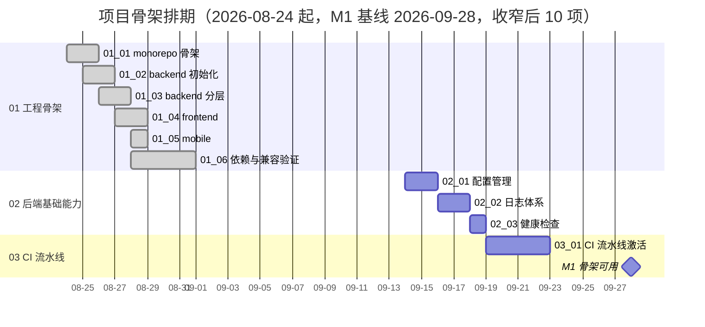

# 项目骨架计划

> BMS 基础管理系统 · 阶段一（项目骨架 / M1 骨架可用）排期计划：已完成 6 项，剩余 4 项（收窄后）

[文档首页](../../../文档首页.md) › 项目骨架计划　|　[任务基线 →](../任务/01_工程骨架/01_工程骨架.md)　[需求基线 →](../需求/00_需求_项目骨架.md)

## 1. 计划说明 

- **排期对象**：阶段一收窄后共 10 项任务（[任务基线](../需求/00_需求_项目骨架.md)：3 父任务 + 4 子任务 + 01 域嵌套子任务 5 个）；已完成 6 项（01 工程骨架域），剩余 4 项（02 后端基础能力 3 项 + 03 CI 流水线 1 项）。
- **范围收窄（2026-09-12）**：原「03 多租户数据拓扑」「04 模块注册表」全域与原「05 域 02/03/04 子任务」、原「02 域 03 异常与错误码骨架 / 05 SQLAlchemy 数据访问底座」已**迁入阶段二 后端基座**（见 `bms文档/项目/02_后端基座/`）；阶段一收敛为工程骨架 + 配置/日志/健康检查 + CI 流水线激活。
- **排期口径**：2026-08-24 起排；01 工程骨架域因实施启动顺延，实际于 2026-09-10 全部完成。剩余 4 项窗口排至 2026-09-25，其后留缓冲至 M1 门禁（2026-09-28）。
- **工时**：已完成 47h；剩余 11h（配置管理 3h + 日志体系 3h + 健康检查 2h + CI 流水线激活 3h）；阶段合计 **58h**。
- **里程碑锚点**（《总体项目规划》「甘特图」节，T+0 = 2026-08-24）：M1 = 2026-09-28（累计 5 周）；M1 门禁收窄为「本地起服务 / `/healthz` `/readyz` 正常 / CI 流水线激活通过」。
- **负责人**：minjian（兼职，单人）。

## 2. 已完成任务（2026-09-10） 

| 编号 | 任务 | 工时（重估） | 完成日期 | 任务文件 |
| --- | --- | --- | --- | --- |
| 01_01 | monorepo 仓库根骨架 | 3h | 2026-09-10 | [01_01](../任务/01_工程骨架/01_工程骨架_01_monorepo仓库骨架/01_工程骨架_01_monorepo仓库骨架.md) |
| 01_02 | backend 工程初始化 | 3h | 2026-09-10 | [01_02](../任务/01_工程骨架/01_工程骨架_02_backend工程初始化/01_工程骨架_02_backend工程初始化.md) |
| 01_03 | backend 分层目录与职责 | 21h | 2026-09-10 | [01_03](../任务/01_工程骨架/01_工程骨架_03_backend分层目录与职责/01_工程骨架_03_backend分层目录与职责.md) |
| 01_04 | frontend 工程初始化 | 15h | 2026-09-10 | [01_04](../任务/01_工程骨架/01_工程骨架_04_frontend工程初始化/01_工程骨架_04_frontend工程初始化.md) |
| 01_05 | frontend-mobile 工程初始化 | 2h | 2026-09-10 | [01_05](../任务/01_工程骨架/01_工程骨架_05_frontend-mobile工程初始化/01_工程骨架_05_frontend-mobile工程初始化.md) |
| 01_06 | 依赖锁定与 Python 3.14 兼容验证 | 3h | 2026-09-10 | [01_06](../任务/01_工程骨架/01_工程骨架_06_依赖锁定与Python3.14兼容验证/01_工程骨架_06_依赖锁定与Python3.14兼容验证.md) |

**01 工程骨架域 6/6 完成**（含嵌套子任务：01-3-1 基础类 4h、01-3-2 并发集合与并发安全 8h、01-3-3 Redis 复合操作与并发语义 6h、01-4-1 前端基础类 6h、01-4-2 前端公共组合式与工具基座 6h）；01_03 重估 21h、01_04 重估 15h。

## 3. 剩余任务排期（自 2026-09-14） 

| 编号 | 任务 | 工时 | 依赖 | 排期窗口 | 备注 |
| --- | --- | --- | --- | --- | --- |
| 02_01 | 配置管理 | 3h | 01_02 | 2026-09-14 ~ 2026-09-15 | config.toml 分区 + BMS_ 覆盖 + 启动校验 |
| 02_02 | 日志体系 | 3h | 02_01 | 2026-09-16 ~ 2026-09-17 | structlog JSON、上下文字段、脱敏、请求中间件 |
| 02_03 | 健康检查 | 2h | 02_01 | 2026-09-18 | /healthz /readyz 契约；`database` 检查项随阶段二启用 |
| 03_01 | CI 流水线激活 | 3h | 02_02/02_03 | 2026-09-19 ~ 2026-09-22 | 冒烟层 + 重验证层就绪项 + 覆盖率门禁 |

剩余合计 **11h**；缓冲至 2026-09-25，M1 基线 2026-09-28。

## 4. 排期甘特图 

## 5. M1 验收门禁 

门禁定义与逐项核对见 [需求总览 · M1 验收门禁](../需求/00_需求_项目骨架.md#accept)（本地起服务 / `/healthz` `/readyz` 正常 / CI 流水线激活通过）。本计划下的达成路径：

| 验收点 | 对应任务 | 达成路径 |
| --- | --- | --- |
| 本地起服务 | 01_01 ~ 01_06、02_01 | 三工程骨架已就位（2026-09-10）；配置管理落地后按环境启动 |
| 健康检查正常 | 02_03 | /healthz 存活 200；/readyz Redis 检查 200/503；`database` 项随阶段二启用 |
| CI 流水线激活通过 | 03_01 | 含代码改动 main 推送跑冒烟层全绿；重验证层就绪项全绿 |

**里程碑对照**（《总体项目规划》「甘特图」节基线）：

| 里程碑 | 基线 | 本计划预计 | 说明 |
| --- | --- | --- | --- |
| M0 启动就绪 | 2026-09-07 | 2026-08-22（已实质达成） | 准备期收口 |
| M1 骨架可用 | 2026-09-28 | 2026-09-28 | 三项门禁通过 |

## 6. 风险与对策 

| 风险 | 影响 | 对策 |
| --- | --- | --- |
| 健康检查 `database` 项依赖阶段二数据访问底座 | M1 门禁仅能核对存活探针与 Redis 检查项 | 探针框架与 Redis 检查项在本阶段完成，`database` 项随阶段二启用并验证（需求 02-3 已标注） |
| CI 基础镜像 push 报 `blob unknown`（Registry 元数据问题） | 镜像推送降级 best-effort | 单 runner 本机镜像已可用，不阻塞冒烟层；继续排查 registry 后恢复强制推送 |
| 重验证层部分 job 未就绪（E2E 用例、Trivy 外网） | 重验证层不完整 | 以 `deploy/ci/verify-enabled` 开关守卫，逐项修复就绪后开启；三库集成随阶段二 05-1 |
| 单人兼职投入不稳 | 里程碑延期 | 串行保守排期 + 缓冲周，里程碑评审滚动调整 |

> 本文档依《文档生成规范》编写
