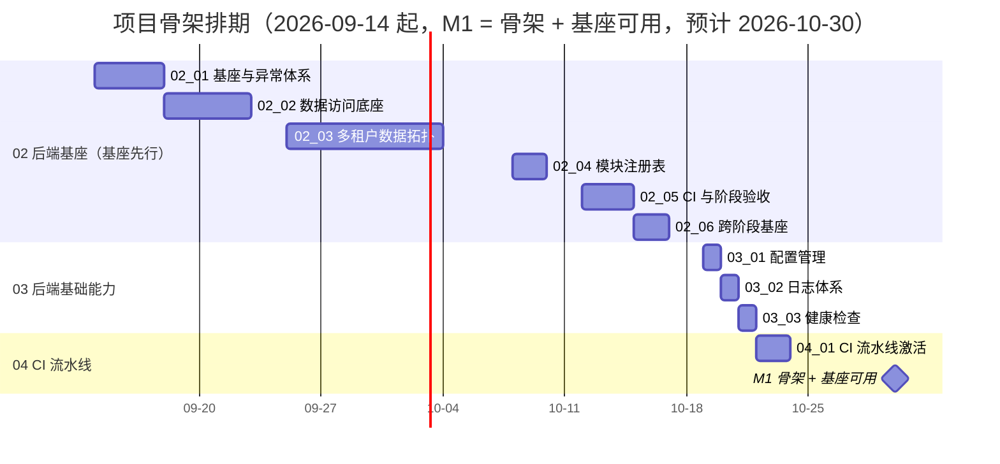

# 项目骨架计划

> BMS 基础管理系统 · 阶段一（项目骨架（含后端基座）/ M1 骨架 + 基座可用）排期计划：已完成 6 项，剩余 20 项

[文档首页](../../../文档首页.md) › 项目骨架计划　|　[任务基线 →](../任务/02_后端基座/02_后端基座.md)　[需求基线 →](../需求/00_需求_项目骨架.md)

## 1. 计划说明 

- **排期对象**：阶段一 26 条需求对应任务——域 01 工程骨架 **6/6 已完成**；域 02 后端基座 16 项（以 6 个一级任务行承载，嵌套子任务并入其直属父任务行）；域 03 后端基础能力 3 项；域 04 CI 流水线 1 项。
- **顺序口径（基座先行）**：后端基座是后端全部模块的前置地基，**先于**依赖它的域 03 后端基础能力（配置 / 日志 / 健康检查）——基座阶段对配置只提供方法与结构（占位），真实读取由 03_01 配置管理落地；CI 流水线激活在本阶段最后收口。
- **排期口径**：自 2026-09-14 起排；域 02 约 5 周（63h，串行兼职）、域 03 一周（8h）、域 04 2 天（3h）；缓冲至 2026-10-29，**M1 门禁预计 2026-10-30**。
- **工时**：已完成 47h；剩余 74h（域 02 63h + 域 03 8h + 域 04 3h）；阶段合计 **121h**。
- **里程碑锚点**：M1 = **骨架 + 基座可用**（原「M1 骨架可用」与「M2 后端基座可用」合并；原 M2 基线 2026-10-26，本计划预计 2026-10-30）；后续里程碑整体前移一位（原 M3 前端组件库起，见《总体项目规划》「里程碑」节）。
- **负责人**：minjian（兼职，单人）。

## 2. 已完成任务（2026-09-10） 

| 编号 | 任务 | 工时（重估） | 完成日期 | 任务文件 |
| --- | --- | --- | --- | --- |
| 01_01 | monorepo 仓库根骨架 | 3h | 2026-09-10 | [01_01](../任务/01_工程骨架/01_工程骨架_01_monorepo仓库骨架/01_工程骨架_01_monorepo仓库骨架.md) |
| 01_02 | backend 工程初始化 | 3h | 2026-09-10 | [01_02](../任务/01_工程骨架/01_工程骨架_02_backend工程初始化/01_工程骨架_02_backend工程初始化.md) |
| 01_03 | backend 分层目录与职责 | 21h | 2026-09-10 | [01_03](../任务/01_工程骨架/01_工程骨架_03_backend分层目录与职责/01_工程骨架_03_backend分层目录与职责.md) |
| 01_04 | frontend 工程初始化 | 15h | 2026-09-10 | [01_04](../任务/01_工程骨架/01_工程骨架_04_frontend工程初始化/01_工程骨架_04_frontend工程初始化.md) |
| 01_05 | frontend-mobile 工程初始化 | 2h | 2026-09-10 | [01_05](../任务/01_工程骨架/01_工程骨架_05_frontend-mobile工程初始化/01_工程骨架_05_frontend-mobile工程初始化.md) |
| 01_06 | 依赖锁定与 Python 3.14 兼容验证 | 3h | 2026-09-10 | [01_06](../任务/01_工程骨架/01_工程骨架_06_依赖锁定与Python3.14兼容验证/01_工程骨架_06_依赖锁定与Python3.14兼容验证.md) |

**01 工程骨架域 6/6 完成**（含嵌套子任务：01-3-1 基础类 4h、01-3-2 并发集合与并发安全 8h、01-3-3 Redis 复合操作与并发语义 6h、01-4-1 前端基础类 6h、01-4-2 前端公共组合式与工具基座 6h）；01_03 重估 21h、01_04 重估 15h。

## 3. 剩余任务排期（自 2026-09-14） 

| 编号 | 任务 | 工时 | 依赖 | 排期窗口 | 备注 |
| --- | --- | --- | --- | --- | --- |
| 02_01 | 基座与异常体系 | 10h | 01_02 / 01_03（工程骨架） | 2026-09-14 ~ 2026-09-17 | 异常与统一响应先行；含 02-1-1 / 02-1-2 |
| 02_02 | 数据访问底座 | 12h | 02_01 | 2026-09-18 ~ 2026-09-24 | 异步底座 + 基类异步切换；含 02-2-1 |
| 02_03 | 多租户数据拓扑 | 19h | 02_02 | 2026-09-25 ~ 2026-10-07 | 三库拓扑 / 模型基类 / 租户解析 / 引擎池 / 批量迁移；含 02-3-1 ~ 02-3-6 |
| 02_04 | 模块注册表 | 6h | 02_02、02_03 | 2026-10-08 ~ 2026-10-09 | 注册载体 + 唯一性校验 + 只读查询；含 02-4-1 ~ 02-4-3 |
| 02_05 | CI 与阶段验收 | 8h | 04_01、02_02、02_03 | 2026-10-12 ~ 2026-10-14 | 三库集成 / M1 门禁核对 / 测试报告；含 02-5-1 ~ 02-5-3 |
| 02_06 | 跨阶段基座 | 8h | 02_01 ~ 02_03 | 2026-10-15 ~ 2026-10-16 | 六类基座登记 + 回补窗口；含 02-6-1 |
| 03_01 | 配置管理 | 3h | 01_02、01_03 | 2026-10-19 | 真实读取 `config.toml` + 环境分层 + 启动校验，落地后回填 02_01 基座登记 |
| 03_02 | 日志体系 | 3h | 03_01（配置加载） | 2026-10-20 | structlog JSON / 上下文字段 / 脱敏 / 请求中间件 |
| 03_03 | 健康检查 | 2h | 03_01（配置） | 2026-10-21 | `/healthz` `/readyz`；`database` 检查项随 02_02 启用 |
| 04_01 | CI 流水线激活 | 3h | 03_02、03_03 | 2026-10-22 ~ 2026-10-23 | 冒烟层 + 重验证层就绪项 + 覆盖率门禁 |

剩余合计 **74h**；缓冲至 2026-10-29，M1 基线 2026-10-30。

### 3.1 跨阶段基座回补窗口（不占本阶段日期） 

| 基座 | 回补阶段 | 说明 |
| --- | --- | --- |
| 缓存 Region 分域基座 | 通用能力阶段 | dogpile Region 分域 + 全局版本号 + 三防 |
| 数据范围注入基座 | RBAC 阶段 | `BaseRepository` 范围注入钩子，规则由 RBAC 提供 |
| 分片路由基座 | 分布式与监控阶段 | `ShardingRouter` 抽象 + 按月分表落地 |
| 事件发布 / 消费基座 | 系统集成与消息阶段 | 统一发布接口 + 消费基类（分区有序） |
| Celery 任务基座 | 通用能力阶段 | `sys_task` 调度基类 + 执行记录 |
| ORM 审计捕获基座 | 通用能力阶段 | ORM 事件捕获 + 分区有序消费（哈希链） |

> 回补实施时在**对应阶段计划**登记窗口（同一任务文档，不重复建任务）。

## 4. 排期甘特图 

## 5. M1 验收门禁 

门禁定义与逐项核对见 [需求总览 · M1 验收门禁](../需求/00_需求_项目骨架.md#accept)（骨架三项 + 基座六项，共 9 个验收点）。本计划下的达成路径：

| 验收点 | 对应任务 | 达成路径 |
| --- | --- | --- |
| 本地起服务 | 01_01 ~ 01_06、03_01 | 三工程骨架已就位（2026-09-10）；配置管理落地后按环境启动 |
| 健康检查正常 | 03_03 | `/healthz` 存活 200；`/readyz` Redis 检查 200/503；`database` 项随 02_02 启用 |
| CI 流水线激活通过 | 04_01 | 含代码改动的 main 推送跑冒烟层全绿；重验证层就绪项全绿 |
| 异常体系生效 | 02_01 | 09-14 ~ 09-17 `BizError` 与统一响应落地，过渡处理器移除 |
| BaseModel 落库 | 02_03 | 09-25 ~ 10-07 模型基类与表规范，三库迁移可执行 |
| 三库拓扑可路由 | 02_02、02_03 | 09-18 ~ 10-07 底座与拓扑落地，驱动连通与迁移通过 |
| 租户隔离与批量迁移正确 | 02_03 | 解析链与批量迁移演练（`init_tenant.py` 重跑幂等） |
| 模块注册校验生效 | 02_04 | 10-08 ~ 10-09 冲突种子被拒 + 查询接口可用 |
| 跨阶段基座登记齐备 | 02_06 | 10-15 ~ 10-16 六类基座登记与回补窗口写入计划 |

**里程碑对照**（《总体项目规划》「里程碑」节基线，并入基座后重排）：

| 里程碑 | 基线 | 本计划预计 | 说明 |
| --- | --- | --- | --- |
| M1 骨架 + 基座可用 | 2026-09-28（原 M1）/ 2026-10-26（原 M2） | 2026-10-30 | 骨架三项 + 基座六项 |
| M2 组件库可用 | 原 M3 顺延 | 顺延重排 | 前端组件库阶段（见《总体项目规划》「里程碑」节） |

## 6. 风险与对策 

| 风险 | 影响 | 对策 |
| --- | --- | --- |
| 达梦方言差异与 dmPython 同步驱动接入 | 02_02 / 02_03 / 02_05 受阻 | 按 Oracle 兼容口径实测；同步驱动经 `asyncio.to_thread` 封装例外；不通过按《项目规划说明》「数据库兼容」节调整并修订需求 |
| 基类异步切换为一次性调用面改动 | 回归风险 | 集中在 02_02 完成，以回归用例护栏（行为不变）；同步内存基线保留为测试替身 |
| 跨阶段基座易在后续模块各自实现 | 口径发散 | 02_06 登记职责与契约，回补窗口写入计划；对应阶段实施时回写状态 |
| CI 基础镜像 push 报 `blob unknown`（Registry 元数据问题） | 镜像推送降级 best-effort | 单 runner 本机镜像已可用，不阻塞冒烟层；继续排查 registry 后恢复强制推送 |
| 重验证层部分 job 未就绪（E2E 用例、Trivy 外网、三库集成） | 重验证层不完整 | 以 `deploy/ci/verify-enabled` 开关守卫，逐项修复就绪后开启；三库集成随 02_05 激活 |
| 并发与连接预算参数调优（租户引擎懒加载 / LRU / 上限） | 连接耗尽或资源占用 | 连接预算按 `worker × (pool_size + max_overflow) ≤ max_connections × 70%` 启动校验并告警 |
| 单人兼职投入不稳 | 里程碑延期 | 串行保守排期 + 缓冲；必要时先保地基波核心（异常体系 → 数据访问底座 → 拓扑 → 模块注册） |

> 本文档依《文档生成规范》编写
