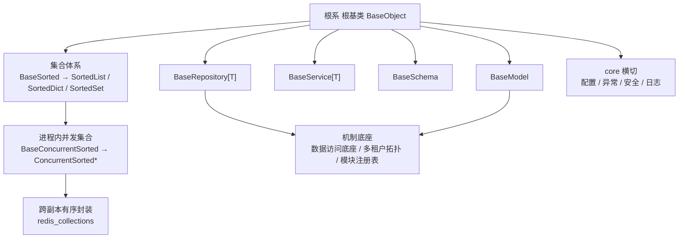

# 后端基座需求

> BMS 基础管理系统 · 阶段一（项目骨架（含后端基座）/ M1 骨架 + 基座体系（占位口径）可用）· 需求域二：后端基座（54 条）

[文档首页](../../../文档首页.md) › [项目骨架总览](00_需求_项目骨架.md) › 后端基座　|　[← 01 工程骨架](01_需求_工程骨架.md)　[03 后端基础能力 →](03_需求_后端基础能力.md)

## 1. 域说明 

本域对应阶段一「后端基座」，是**后端全部模块的前置地基**——基座体系先立，认证 / RBAC / 通用能力等模块才有统一写法。按《[架构设计 · 后端基础类体系](../../../设计/架构设计/04_架构设计_后端基础类体系.md)》「基座分层」，以 **根系 根基类 `BaseObject`** 为根，沿三条支线、按继承链**一层一层**组织，共 54 条需求：

| 子域 | 需求 | 继承关系 | 本阶段口径 |
| --- | --- | --- | --- |
| 根系 根基类 | `02-1` | 一切基类之根（无父类） | 工程骨架已交付，**登记核对** |
| 集合体系 | `02-2` ~ `02-4` | `Sorted*` → `BaseSorted` → `BaseObject`；`ConcurrentSorted*` → `BaseConcurrentSorted` → `BaseSorted` | 工程骨架已交付，**登记核对** |
| 模块基类 | `02-5` ~ `02-8` | 各自继承 `BaseObject`，平行（非继承层级） | **落地**（数据库实现占位） |
| core 横切基座 | `02-9` ~ `02-12` | 异常统一继承 `BizError` | 异常体系**落地**；配置 / 安全 / 日志**结构占位** |
| 跨阶段基座 | `02-13` | — | 六类基座**登记 + 回补窗口** |
| 机制底座 | `02-14` ~ `02-16` | 依赖 `BaseRepository` / `BaseModel`（数据访问侧） | **接口占位**（不连真库 / 不跑迁移 / 不建表） |
| 跨阶段基座（补充） | `02-17` ~ `02-28` | 能力域中间层 / 占位实现 | 外部能力适配与请求链路横切的**接口占位**，随对应阶段回补 |
| 横切扩展基座（补充二） | `02-29` ~ `02-41` | 能力域中间层 / 注册表 / 占位实现 | 安全、数据、扩展点与运维横切的**接口占位**，随对应阶段回补 |
| 前端组件支撑基座（补充三） | `02-42` ~ `02-53` | 能力域中间层 / 占位实现 | 前端组件库实施所需的协议 / 契约层**接口占位**，随对应阶段回补 |
| 工厂基座（补充四） | `02-54` | 中间层基类 | 工厂纳入基类体系（对齐前端 `BaseFactory`）：一切工厂类之根 + 既有工厂对齐，**随阶段一补做窗口首个实施**（先于补充三，作为新建基座的前置） |

**命名规则（强制）**：基类一律 `Base` 打头（`BaseObject` / `BaseSorted` / `BaseConcurrentSorted` / `BaseRepository` / `BaseService` / `BaseSchema` / `BaseModel`）；非 `Base` 打头为继承基类的具体实现类（命名自由，如 `SortedList` / `UserRepository`）。详见《[命名规范](../../../规范/命名规范.md)》「后端命名」节。

**「接口占位」口径（本阶段统一约定）**：只落**接口 / 抽象声明 + 占位实现**——依赖注入可解析、应用可启动不报错、占位返回**固定或批量数据**以便上层先跑通链路；**不连真库、不跑迁移、不建表**；实现要点保留在需求中，随对应后续阶段填实现（不需重新立项）。

**依据**：《[总体项目规划](../../../规划/总体项目规划.md)》「工作分解结构（WBS）」节「阶段内容与完成标准」节、《[总体项目规划](../../../规划/总体项目规划.md)》「阶段内容与完成标准」节、《[架构设计 · 后端基础类体系](../../../设计/架构设计/04_架构设计_后端基础类体系.md)》「基座分层」节「阶段交付与跨阶段基座契约」节、《[后端开发规范](../../../规范/后端开发规范.md)》「后端基座体系」节、《[命名规范](../../../规范/命名规范.md)》「后端命名」节、《[API接口规范](../../../规范/API接口规范.md)》、《[数据库开发规范](../../../规范/数据库开发规范.md)》。

**目标**：基座继承链就位——根系 根基类、集合体系（有序 / 并发 / 跨副本）、模块基类（repository / service / schema / model）、core 横切（异常 / 配置 / 安全 / 日志）分层清晰、继承关系可核对；异常体系与统一响应生效；机制底座（数据访问 / 多租户拓扑 / 模块注册）接口占位齐备；阶段验收门禁「异常体系生效」为本域直接承载。

**边界说明**：

- 基座对**配置 / 日志 / 安全**只提供结构占位与统一入口，真实读取、初始化与原语实现分别由「[03 后端基础能力](03_需求_后端基础能力.md)」与认证阶段落地。
- **机制底座（数据访问底座 / 多租户数据拓扑 / 模块注册表）在本域内承接**（`02-14` ~ `02-16`），沿用「接口占位、不连真库、不跑迁移、不建表」口径；真实落库与多租户数据拓扑随后续阶段（首个落库模块）填实现（不需重新立项）。
- 跨阶段基座（缓存 / 数据范围 / 分片 / 事件 / 任务 / 审计）本域只登记，实现随对应阶段回补。
- **补充跨阶段基座**（文件存储 / LLM 适配 / 全文检索 / 通知渠道 / 实时推送 / 出站集成 / 工作流适配 / 权限校验 / 限流幂等 / 可观测性 / IdP 会话 / 查询提供者）见 `02-17` ~ `02-28`，同为**接口占位**、随对应阶段回补。
- **横切扩展基座**（数据脱敏 / 分布式锁 / 验证码密码策略 / 降级熔断 / 导入导出 / 哈希链 / 归档策略 / 字段类型注册表 / 国际化翻译 / 工作台卡片 / 健康检查项 / 排序契约 / 开放接口 OAuth2）见 `02-29` ~ `02-41`，同为**接口占位**、随对应阶段回补。
- **前端组件支撑基座**（验证码渠道 / 组织主数据查询 / 字典取数与缓存 / 对象存储分片秒传 / 通知中心接口 / 列表查询与偏好 / 全文检索查询 / AI 对话流式与会话 / 用户偏好 / 租户自助与品牌 / 打印模板与导出 PDF / 自定义图标与代码校验）见 `02-42` ~ `02-53`，同为**接口占位**、随对应阶段回补。

> **补充三的来由（2026-09-20）**：阶段四前端组件库实施时，剩余与已交付组件暴露出后端**协议 / 契约 / 编排层**缺口（能力域抽象基座已由 `02-17` ~ `02-41` 覆盖，但取数 / 保存 / 发布 / CRUD 以外的横切契约未定）。按《[AI开发规范](../../../规范/AI开发规范.md)》§3.1 判别，将其中「会被多模块复用 + 现在能定接口 / 占位」的 12 条立项为**接口占位**；各阶段模块内部的业务 REST 端点（权限配置 / 审批流 / 表单布局 / 报表大屏定义 / 审计差异 / 文件预览等）不立项，归对应阶段，登记于各阶段计划「后续阶段待办」。

## 2. 需求 02-1：根系 根基类 BaseObject 登记 

优先级：2（高）

**继承关系**：`BaseObject`（无父类）——一切可继承后端类之根；`模块类 → 对应基类 → BaseObject`、`集合类 → BaseObject`。

**背景与动机**：`BaseObject` 是全部后端类的根与公共方法唯一落点，已于工程骨架交付但**未在架构登记**（设计目录零提及）；后续模块不知继承什么、公共能力加在哪，口径必然发散。

**内容**（《架构设计 · 后端基础类体系》「基类清单与继承链」节）：

1. 根基类 `BaseObject`（`app/core/base.py`）：序列化、稳定序序列化、统一字符串输出、主键相等与哈希——公共方法唯一落点，登记职责与继承链
2. 登记回写：《架构设计 · 后端基础类体系》与《后端开发规范》保持同源；标注「模块类不得重复实现基类公共方法」的强制约定

**完成标准**：`BaseObject` 职责 / 继承关系 / 代码位置在架构节点与规范一致、可核对；继承约定纳入规范且可核对。

**参考文档**：《架构设计 · 后端基础类体系》「基类清单与继承链」节、《后端开发规范》「后端基座体系」节

## 3. 需求 02-2：有序集合登记 

优先级：2（高）

**继承关系**：`SortedList` / `SortedDict` / `SortedSet` → `BaseSorted` → `BaseObject`。

**背景与动机**：有序集合是「对外输出稳定序」的公共数据形态，工程骨架已交付但未在架构登记；不登记则模块各写各的排序与序列化。

**内容**（《架构设计 · 后端基础类体系》「有序与并发集合」节）：

1. 有序集合基类 `BaseSorted[T]`（`app/core/collections.py`）与实现 `SortedList` / `SortedDict` / `SortedSet`（插入即有序）
2. 强制口径：对外输出必须稳定序（序列化走稳定序，禁止直接输出裸 `set`）；公共位置（API 响应、日志字段、任务参数 / 结果、配置映射、缓存值与导出数据）一律使用有序集合
3. 登记职责、继承关系与代码位置

**完成标准**：`BaseSorted` → `SortedList` / `SortedDict` / `SortedSet` 的继承链与职责在架构节点与规范一致、可核对；「对外稳定序」约定纳入规范且可核对。

**参考文档**：《架构设计 · 后端基础类体系》「有序与并发集合」节、《后端开发规范》「后端基座体系」节

## 4. 需求 02-3：进程内并发集合登记 

优先级：2（高）

**继承关系**：`ConcurrentSortedList` / `ConcurrentSortedDict` / `ConcurrentSortedSet` → `BaseConcurrentSorted` → `BaseSorted` → `BaseObject`。

**背景与动机**：多线程共享集合须有统一并发保护，工程骨架已交付（四种锁策略）但未在架构登记；不登记则模块各自加锁、口径发散。

**内容**（《架构设计 · 后端基础类体系》「有序与并发集合」节）：

1. 并发集合基类 `BaseConcurrentSorted`（`app/core/concurrent.py`，锁策略守卫 + SNAPSHOT 写时复制）与实现 `ConcurrentSorted*`（四种锁策略：读写锁 / 单锁 / 分片锁 / 快照替换）
2. 强制口径：读-改-写走原子复合方法、遍历取快照；锁内禁止 IO 与外部回调；**禁止进程内集合跨副本共享**
3. 登记职责、继承关系与代码位置

**完成标准**：`ConcurrentSorted*` → `BaseConcurrentSorted` → `BaseSorted` → `BaseObject` 的继承链与职责在架构节点与规范一致、可核对；锁策略选型与原子 / 快照约定纳入规范且可核对。

**参考文档**：《架构设计 · 后端基础类体系》「有序与并发集合」节、《后端开发规范》「后端基座体系」节

## 5. 需求 02-4：跨副本 Redis 封装登记 

优先级：2（高）

**继承关系**：`redis_collections`（封装模块，非类继承）——跨副本 / 多 worker 共享形态。

**背景与动机**：跨副本 / 多 worker 共享不能靠进程内集合，须统一 Redis 有序封装；工程骨架已交付但未在架构登记。

**内容**（《架构设计 · 后端基础类体系》「有序与并发集合」节）：

1. `app/core/redis_collections.py`：Redis 为唯一事实源 + 本进程只读快照 + 版本号惰性比对；复合操作（Lua / WATCH + MULTI）保证原子语义
2. 强制口径：跨副本 / 多 worker 共享必须走 Redis 封装，禁止进程内集合跨副本共享
3. 登记职责、继承关系（封装形态）与代码位置

**完成标准**：Redis 有序封装的职责与复合操作语义在架构节点与规范一致、可核对；「禁止进程内集合跨副本共享」约定纳入规范且可核对。

**参考文档**：《架构设计 · 后端基础类体系》「有序与并发集合」节、《后端开发规范》「后端基座体系」节

## 6. 需求 02-5：数据访问基类 BaseRepository 

优先级：2（高）

**继承关系**：`XxxRepository` → `BaseRepository[T]` → `BaseObject`。

**背景与动机**：数据访问基类是模块类的直接父类；工程骨架已交付同步内存基线，须在基座阶段定型（含数据库实现占位），否则各模块各自实现 CRUD。

**内容**（《架构设计 · 后端基础类体系》「各层基类与模块约定」节、《后端开发规范》「后端基座体系」节）：

1. `BaseRepository[T]`：通用 CRUD 模板方法 + `exists` / `count` 派生方法；数据库实现**占位**（不连库）；数据源 / 分片路由钩子预留
2. 继承约定：模块仓储 `XxxRepository` 必须继承、只写差异部分

**完成标准**：`BaseRepository[T]` 可继承、`exists` / `count` 行为正确（基类单测通过）；数据库实现为占位且不连库；`pytest`、`ruff`、`pyright` 全绿。

**参考文档**：《架构设计 · 后端基础类体系》「基类清单与继承链」节「各层基类与模块约定」节、《后端开发规范》「后端基座体系」节

## 7. 需求 02-6：服务基类 BaseService 

优先级：2（高）

**继承关系**：`XxxService` → `BaseService[T]` → `BaseObject`。

**背景与动机**：服务基类承上启下（委派仓储 + 统一不存在语义）；不先立，各模块各自处理「不存在」与业务规则边界。

**内容**（《架构设计 · 后端基础类体系》「各层基类与模块约定」节）：

1. `BaseService[T]`：通用 CRUD 委派仓储 + 统一不存在语义（`NotFoundError` → `BizError` 体系）
2. 继承约定：模块服务 `XxxService` 必须继承、只写业务规则，不得拼 SQL、不得跨模块直连仓储

**完成标准**：`BaseService[T]` 可继承、不存在语义行为正确（基类单测通过）；`pytest`、`ruff`、`pyright` 全绿。

**参考文档**：《架构设计 · 后端基础类体系》「各层基类与模块约定」节、《后端开发规范》「后端基座体系」节

## 8. 需求 02-7：请求 / 响应基类 BaseSchema 

优先级：2（高）

**继承关系**：`XxxCreateRequest` / `XxxResponse` → `BaseSchema` → `(pydantic.BaseModel, BaseObject)`。

**背景与动机**：请求 / 响应模型的公共配置与统一序列化须一处定义；不先立，各模块各自配置 Pydantic 与序列化，口径发散。

**内容**（《架构设计 · 后端基础类体系》「各层基类与模块约定」节）：

1. `BaseSchema`：Pydantic 公共配置（`from_attributes` / `str_strip_whitespace`）与统一序列化（继承 `BaseObject`）
2. 继承约定：请求 / 响应模型必须继承 `BaseSchema`，禁止直接继承 `pydantic.BaseModel`

**完成标准**：`BaseSchema` 可继承、公共配置与序列化行为正确（基类单测通过）；`pytest`、`ruff`、`pyright` 全绿。

**参考文档**：《架构设计 · 后端基础类体系》「各层基类与模块约定」节、《后端开发规范》「后端基座体系」节

## 9. 需求 02-8：ORM 模型基类 BaseModel 与表规范 

优先级：2（高）

**继承关系**：`XxxModel` → `BaseModel` → `BaseObject`。

**背景与动机**：全库表结构与字段行为（雪花 ID / 审计 / 软删除 / 乐观锁 / 四库类型映射）在此一次定义；不先立，几十张表建完再补基类字段将全量返工。

**内容**（《架构设计 · 数据架构》「数据规范」节、《数据库开发规范》第 2/3 节）：

1. `app/models/base.py` 的 `BaseModel` 字段（每表必备，ORM 层定义一次）：
   - 主键 `id`：雪花 ID（yitter/IdGenerator，BIGINT 跨库类型），生成器封装于 `app/core/id.py`（`generate_id()`）
   - 审计：`created_at` / `created_by` / `updated_at` / `updated_by`——由 ORM 事件自动填充（insert/update 监听），业务代码禁止手动赋值
   - 软删除：`deleted_at`（NULL=未删）；乐观锁：`version`（更新时比对，冲突返回明确错误码）
2. 四库类型映射表（基类字段跨方言实现，写入模型定义注释）：

   | 字段 | SQLite | MySQL | PostgreSQL | 达梦 DM8 |
   | --- | --- | --- | --- | --- |
   | id | INTEGER | BIGINT | BIGINT | BIGINT（自增列口径，雪花值写入） |
   | created_at 等 | DATETIME | DATETIME | TIMESTAMP | TIMESTAMP |
   | version | INTEGER | INT | INTEGER | INT |
   | 布尔（通用约定） | INTEGER 0/1 | TINYINT(1) | SMALLINT | SMALLINT（达梦无 BOOLEAN 时口径） |

   - 时间统一 UTC 存储，前端本地时区展示；金额 NUMERIC(20,4)、字符串 VARCHAR（长度显式）、禁用方言专用类型（JSON / ENUM / SERIAL）
3. 软删除机制：查询默认过滤 `deleted_at IS NULL`（repository 基类统一注入）；唯一约束统一建为 `(唯一字段, deleted_at)` 复合唯一索引；删除写时间戳释放唯一键、恢复清 NULL
4. 索引与表级规范：排序 / 逻辑外键 / 数据权限过滤字段必须建索引，命名 `idx_字段` / `uq_字段`，每表索引不超过 5 个；表名单数 snake_case、平台域前缀 `sys_`/`wf_`/`rpt_`/`ai_`、每表与字段 COMMENT 必填

**完成标准**：`BaseModel` 字段与四库类型映射定义落地、表规范写入模型注释；**建表与四库迁移验证按接口占位处理**（不连真库、不跑迁移），随后续阶段实测审计自动填充、软删除复合唯一与乐观锁冲突。

**参考文档**：《架构设计 · 数据架构》「数据规范」节、《数据库开发规范》第 2/3/4 节、《命名规范》「数据库命名」节

## 10. 需求 02-9：异常体系与统一响应 

优先级：2（高）

**继承关系**：异常统一继承 `BizError`（业务异常在 services 层抛出）。

**背景与动机**：工程骨架以 `NotFoundError` + 临时处理器过渡（body 结构与统一响应不一致）；若不在基座阶段统一，认证 / RBAC / 通用能力各模块将各自定义异常与错误响应，错误码口径必然发散。

**内容**（《后端开发规范》「异常与错误码」节、《API接口规范》）：

1. `app/core/exceptions.py`：统一异常基类 `BizError`（携带错误码与参数）+ 常用子类（参数异常 / 认证失效 / 权限不足 / 资源不存在 / 冲突等）；`NotFoundError` 过渡实现改为继承 `BizError`
2. 全局异常处理器：`BizError` → 统一响应 `{code, message, data}`（HTTP 状态码与业务错误码分离）；未捕获异常 → 500 且不暴露堆栈（开发环境可含 trace_id）
3. 统一响应模型 `ApiResponse`（Pydantic），成功 `code=0`；错误码平台段 `1xxxx`~`9xxxx` 登记于《架构设计 · 接口与集成》「错误码」节，本阶段建立骨架段位
4. 业务异常在 services 层抛出、api 层不 catch；`main.py` 注销临时 404 处理器
5. 测试：先登记 Kiwi 用例，再写自动化（异常分支 + 统一响应结构断言）

**完成标准**：`BizError` 及各子类可用；业务异常经全局处理器转统一响应结构；未捕获异常返回 500 且不泄露堆栈；错误码段位登记；临时处理器移除；`pytest`、`ruff`、`pyright` 全绿。

**参考文档**：《后端开发规范》「异常与错误码」节、《API接口规范》「统一响应与错误码」节、《架构设计 · 接口与集成》「错误码」节

## 11. 需求 02-10：配置基座结构占位 

优先级：2（高）

**继承关系**：—（core 横切基座，非继承类）。

**背景与动机**：配置是 core 横切基座的一项；基座先于上层能力，故本阶段只落**结构与入口**，真实读取交后续的配置管理任务，避免基座反向依赖上层。

**内容**（《架构设计 · 后端基础类体系》「core 横切基座」节）：

1. `app/core/config.py` 结构：配置模型（分区模型 `app` / `server` / `log` / `database` / `redis` / `cors` 等）与读取接口 `get_settings()` 的签名
2. 占位实现：返回**默认值 / 固定值**（不读 `config.toml`、不读环境变量），保证依赖注入可解析、应用可启动
3. 交接约定：真实 `config.toml` 读取、环境分层覆盖与启动校验由 [03 后端基础能力](03_需求_后端基础能力.md) 需求 03-1 落地，落地后回填本基座登记

**完成标准**：配置模型与读取接口就位、占位返回默认值、依赖注入可解析、应用可启动不报错；`pytest`、`ruff`、`pyright` 全绿。**不读配置文件**（实现期要点：真实读取由 03-1 完成并回填登记）。

**参考文档**：《架构设计 · 后端基础类体系》「core 横切基座」节、《项目规划说明》「环境与配置」节、《命名规范》「基础设施命名」节

> 注：真实读取已由 [03-1 配置管理](03_需求_后端基础能力.md#r03-1) 完成并回填——`app/core/config.py` 落 pydantic-settings 多源加载（基线 `config.toml` + 环境覆盖 `config.{env}.toml` + `BMS_` 环境变量 + `backend/.env`）、四类启动校验与 `validate_startup`（prod 密钥 + WorkerId 接线）；架构节点「core 横切基座」与《后端基类清单》「配置基座」状态已同步为「已交付（真实读取）」。

## 12. 需求 02-11：安全基座结构占位 

优先级：2（高）

**继承关系**：—（core 横切基座，非继承类）。

**背景与动机**：core 横切的安全基座需先有统一落点，认证实现才不会各自起炉灶；本阶段只落接口声明。

**内容**（《架构设计 · 后端基础类体系》「core 横切基座」节）：

1. 安全基座声明：`app/core/security.py`——密码哈希 / 校验、令牌签名与校验、会话安全原语的接口签名（实现随认证阶段）
2. 登记：安全基座的职责与代码位置回写《架构设计 · 后端基础类体系》

**完成标准**：安全基座接口声明就位、可被上层引用、依赖注入可解析、应用可启动不报错；`pytest`、`ruff`、`pyright` 全绿。**不实现安全细节**（实现期要点：随认证阶段）。

**参考文档**：《架构设计 · 后端基础类体系》「core 横切基座」节、《后端开发规范》「后端基座体系」节

## 13. 需求 02-12：日志基座接入点 

优先级：2（高）

**继承关系**：—（core 横切基座，非继承类）。

**背景与动机**：core 横切的日志基座需先有统一接入点，日志实现才不会各自起炉灶；本阶段只落接入点声明。

**内容**（《架构设计 · 后端基础类体系》「core 横切基座」节、《日志规范》）：

1. 日志基座接入点声明：structlog 初始化入口（`app/core/logging.py` 或等价位置）与「日志只写 stdout、不落文件」约定；渲染形态由配置 `[log] format` 控制（真实实现归需求 03-2 日志体系）
2. 登记：日志基座的职责与代码位置回写《架构设计 · 后端基础类体系》

**完成标准**：日志基座接入点声明就位、可被上层引用、依赖注入可解析、应用可启动不报错；`pytest`、`ruff`、`pyright` 全绿。**不实现日志细节**（实现期要点：随 03-2 日志体系）。

**参考文档**：《架构设计 · 后端基础类体系》「core 横切基座」节、《日志规范》、《后端开发规范》「后端基座体系」节

> 注：真实实现已由 [03-2 日志体系](03_需求_后端基础能力.md#r03-2) 完成并回填——`app/core/logging.py` 落 structlog 处理器链（dev console / test·prod 单行 JSON、`ts` 本地时区含偏移）、上下文字段（`trace_id` / `request_id` / `tenant` / `user_id` / `client_ip`）、敏感键名与连接串密码脱敏、stdlib / uvicorn 统一渲染；`app/api/middleware.py` 新增请求日志中间件（探针与文档路径排除、慢请求 WARNING）；架构节点「core 横切基座」与《后端基类清单》「日志基座」状态已同步为「已交付（真实实现）」。

## 14. 需求 02-13：跨阶段基座登记与回补 

优先级：3（中）

**继承关系**：—（跨阶段基座，随对应阶段回补）。

**背景与动机**：缓存、数据范围、分片、事件、任务、审计六类能力都有「基座」成分（公共封装 + 模块只写差异），但它们依赖各自后端模块；若不在基座阶段登记清楚，后续模块会各自实现，口径发散且重复。

**内容**（《架构设计 · 后端基础类体系》「阶段交付与跨阶段基座契约」节）：

1. **缓存 Region 分域基座**（回补通用能力阶段）：dogpile.cache Region 分域 + 全局版本号惰性比对；key 规范 `bms:{租户|global}:{域}:{业务键}`、全 key 带 TTL；三防在基座统一
2. **数据范围注入基座**（回补 RBAC 阶段）：`BaseRepository` 数据访问范围注入钩子（写读双向校验），规则由 RBAC 提供
3. **分片路由基座**（回补分布式与监控阶段）：`ShardingRouter` 抽象（分片键 → 物理库 / 表解析），MVP 按月分表
4. **事件发布 / 消费基座**（回补系统集成与消息阶段）：统一事件发布接口（RocketMQ 事务消息）与消费基类（分区有序消费）
5. **Celery 任务基座**（回补通用能力阶段）：任务定义入库（`sys_task`）+ 调度基类 + 执行记录（`sys_task_log`）
6. **ORM 审计捕获基座**（回补通用能力阶段）：ORM 事件捕获关键表字段级变更，审计事件走分区有序消费（哈希链）
7. 登记要求：六类基座的职责、契约与回补阶段写入《架构设计 · 后端基础类体系》与阶段一计划表；对应阶段实施时在**该阶段计划**登记窗口（同一任务文档，不重复建任务）

**完成标准**：六类跨阶段基座的职责与契约在架构节点登记；回补阶段与窗口写入阶段一计划表；本阶段可独立实现的封装骨架（接口与契约层）就位；对应阶段启动时按登记实施并回写状态；无遗漏、无重复实现。

**参考文档**：《架构设计 · 后端基础类体系》「阶段交付与跨阶段基座契约」节、《架构设计 · 数据架构》「缓存架构」节、《架构设计 · 事件总线》、《架构设计 · 任务调度》、《架构设计 · 审计哈希链》

## 15. 需求 02-14：数据访问底座（接口占位） 

优先级：2（高）

**背景与动机**：数据库接入与异步化必须集中在基类一次完成，否则每个模块各自实现异步会话，事务边界与连接预算失控；本阶段先落**接口与占位实现**，把与业务对接的数据访问边界定下来。

**内容**（《架构设计 · 数据访问与分片》、《后端开发规范》「SQL 与数据访问规范」节「异步与并发」节）：

1. 异步引擎工厂接口：按数据源创建 / 缓存 `AsyncEngine` 的签名（连接池参数、超时、`pool_pre_ping`），**占位实现不真实建连**
2. AsyncSession 工厂接口：`async_sessionmaker` 形态与请求级会话依赖注入签名；事务边界约定（`with session.begin()`）；禁止异步会话跨请求共享
3. 四库方言接口：MySQL（aiomysql）/ PostgreSQL（psycopg 3）/ 达梦 DM8（dmPython，同步驱动经 `asyncio.to_thread` 封装例外口径）/ SQLite（aiosqlite）；URL 取值经配置基座读取接口
4. 基类异步切换：`BaseRepository[T]` / `BaseService[T]` 异步签名与分页 / 软删除过滤回填基类（只加基类，模块类不改）；同步内存基线保留为测试替身
5. 读写分离占位：读写路由接口（按上下文标记选引擎），本阶段主从同源

**完成标准**：数据访问接口 / 抽象声明就位、依赖注入可解析、应用可启动不报错、占位返回固定 / 批量数据可支撑上层链路；基类异步签名一致；`pytest`、`ruff`、`pyright` 全绿。**不连真库、不跑迁移**（实现期要点：四库连通与集成用例随后续 后端基座）。

**参考文档**：《架构设计 · 数据访问与分片》、《后端开发规范》「异步与并发」节、《数据库开发规范》「迁移」节

## 16. 需求 02-15：多租户数据拓扑（接口占位） 

优先级：2（高）

**背景与动机**：多租户隔离是本系统核心约束（一租户一库）；库模型 / 命名 / 字符集 / 跨库规则、租户解析、引擎管理、批量迁移先以**声明与占位**定死，后续建库与迁移才不各写各的。

**内容**（《架构设计 · 数据架构》「数据分布」节、《架构设计 · 多租户路由》、《命名规范》「数据库命名」节）：

1. 三库模型**声明**：平台库 `bms_platform`（租户注册、平台统一菜单 / 权限码）、租户库 `bms_tenant_{code}`（一租户一库，`code` 全小写）、归档库 `bms_archive`（归档数据统一收存，只读）；开发环境多 SQLite 文件（`bms_platform.db` / `bms_tenant_demo.db` / `bms_archive.db`）一文件一库；环境库命名 `bms_dev` / `bms_test` / `bms_prod`；建库标准（字符集 MySQL utf8mb4、PostgreSQL UTF8、达梦 UTF8；达梦 schema 前缀与小写标识符口径）
2. 跨库引用原则：一律逻辑外键（code），不建物理外键；跨库查询禁止 JOIN
3. `sys_tenant` 表**声明**（平台库，租户注册与路由依据，字段与索引约定：`code`/`name`/`domain`/`db_key`/`status`/`expire_at` + 基类审计字段，`uq_code_deleted_at` / `idx_domain`）；占位数据 `demo` 租户以固定值返回
4. 租户解析链**接口**（按优先级取第一个命中）：子域名 → 请求头 `X-Tenant-ID` → token 内 tenant_id（认证阶段接入）；`TenantContext`（tenant_code / db_key / 引擎引用构造与依赖注入签名，禁止全局单例持有）；未知租户 → `HTTP 404 + 业务码 80001`；豁免路径（`/`、`/docs`、`/openapi.json`、`/healthz`、`/readyz`、平台级接口预留）
5. `EngineRegistry`（`app/db/registry.py`）**接口**：`{db_key → engine}` 注册表、平台引擎常驻、租户引擎懒加载、闲置回收（LRU + 阈值默认 30 分钟、活跃上限默认 32）、连接预算校验（worker × (pool_size + max_overflow) ≤ 数据库 `max_connections` 的 70%）、并发保护（进程内锁 + Redis SETNX）
6. Alembic 结构占位（`backend/alembic/`）与批量迁移脚本接口 `ops/migrate_tenants.py`（`--target all|tenant_code|platform`、`--db mysql|postgres|dameng`、`--dry-run`、逐库执行、失败不中断、重跑幂等）、新租户初始化接口 `ops/init_tenant.py`（建库 → 迁移 → 幂等种子）

**完成标准**：三库模型声明与建库标准登记齐备、`sys_tenant` 声明与 demo 占位数据可查询、解析链与 `TenantContext` 占位返回 demo 上下文、`EngineRegistry` 占位返回固定引擎引用、迁移脚本 `--dry-run` 输出固定库清单；依赖注入可解析、应用可启动不报错；`pytest`、`ruff`、`pyright` 全绿。**不真实建库、不连真库、不跑迁移**（实现期要点：三库实例建库、真实解析与并发隔离、懒加载 / LRU / 加锁实测随后续阶段）。

**参考文档**：《架构设计 · 数据架构》「数据分布」节、《架构设计 · 多租户路由》、《命名规范》「数据库命名」节、《数据库开发规范》「多租户与分片」节「迁移规范（Alembic）」节

## 17. 需求 02-16：模块注册表（接口占位） 

优先级：2（高）

**背景与动机**：平台「注册制」的载体——表前缀 / 错误码段 / 事件域必须先登记才能分配；本阶段先落表声明、固定注册清单、唯一性校验与只读查询占位，业务模块接入前机制已在。

**内容**（《架构设计 · 模块注册》第 2/3 节、《项目规划说明》「模块注册要素」至「错误码段规则与注册」节）：

1. `sys_module` 表**声明**（平台库，字段与索引：`module_key`/`name`/`table_prefix`/`errcode_segment`/`event_domain`/`status` + 基类审计字段，四要素 `(字段, deleted_at)` 复合唯一）；多语言模块名附表 `sys_module_i18n`（module_id + locale 联合主键 + name）
2. 占位数据：平台域固定 4 行（`sys` / `wf` / `rpt` / `ai`）以固定值返回；业务模块不预置，由产品仓库交付时登记
3. 注册方式约定：运行时**无写接口**；新增模块 = Alembic 迁移 revision 原子落地
4. 唯一性校验（对注册清单）：`table_prefix` / `errcode_segment` / `event_domain` 三要素唯一 + 格式校验（table_prefix 形如 `{简称}_`、errcode_segment 两位段号、event_domain 全小写）；启动校验入口（冲突 / 非法 → 启动失败 + CRITICAL 明细）+ CI 校验入口
5. 只读接口契约：`GET /api/v1/modules` 返回注册清单（平台域 4 行固定数据，`?status` 筛选，软删除过滤，归属平台接口豁免租户解析）；本阶段暂不鉴权（RBAC 阶段接入 `platform:manage`）；**无任何写接口**

**完成标准**：`sys_module` 与 `sys_module_i18n` 声明齐备、占位返回平台域 4 行固定数据、唯一性校验对合法 / 冲突清单判定正确、`GET /api/v1/modules` 契约正确（`?status` 筛选、POST / PUT / DELETE 等方法 405 Method Not Allowed）；依赖注入可解析、应用可启动、无写接口暴露；`pytest`、`ruff`、`pyright` 全绿。**不建表**（实现期要点：落表、种子与接库查重随后续阶段）。

**参考文档**：《架构设计 · 模块注册》第 2/3 节、《项目规划说明》「模块注册要素」至「错误码段规则与注册」节、《命名规范》「数据库命名」节、《API接口规范》第 2/3 节

## 18. 需求 02-17：文件存储基座（接口占位） 

优先级：2（高）

**背景与动机**：文件、导入导出、头像与归档等多处需要对象存储；若存储实现（MinIO / 本地文件系统）各自为政，路径、签名与生命周期口径会发散。

**内容**（《架构设计 · 后端基础类体系》「阶段交付与跨阶段基座契约」节）：

1. 统一存储接口 `BaseObjectStorage`（能力域中间层，纳入 `BaseCapability` / `BaseStub`）：`put` / `get` / `delete` / `exists` / `presign` 签名
2. 占位实现：`NullObjectStorage` 固定返回（不连 MinIO / 不落盘）
3. 登记：架构「阶段交付与跨阶段基座契约」节跨阶段基座表 + 后端基类清单；真实 MinIO / 本地文件系统随文件管理阶段回补

**完成标准**：接口 / 抽象声明就位、可被上层引用、依赖注入可解析、应用可启动不报错；**不实现真实能力**（实现期要点随对应阶段）；`pytest`、`ruff`、`pyright` 全绿。

**参考文档**：《架构设计 · 文件管理》「概述」节、《架构设计 · 后端基础类体系》「阶段交付与跨阶段基座契约」节

> 注：实现期要点——真实实现用 MinIO（S3 SDK）或本地文件系统：私有桶 `STORAGE_BUCKET`（`bms-files`）按租户前缀隔离，`put` 落对象并回填 `etag` / `size`，`presign` 生成限时 URL（TTL 取 `DEFAULT_PRESIGN_TTL`，下载 / 预览直连、后端不代理流），`get` 未命中抛 `NotFoundError`、`delete` 幂等。类型白名单 + 大小上限、分片 SHA256 / 整文件校验、租户存储配额（`storage_bytes`）、孤儿分片回收由文件管理阶段 / 多租户路由在上层实现（经本契约存取）。契约与调用面不变（02-4-1 已交付契约、占位与常量清单）。

## 19. 需求 02-18：LLM 适配基座（接口占位） 

优先级：3（中）

**背景与动机**：AI 能力需统一 Provider 接口，模型切换不侵入业务；若各功能直连不同模型 API，替换与限流口径会散落各处。

**内容**（《架构设计 · 后端基础类体系》「阶段交付与跨阶段基座契约」节）：

1. 统一 Provider 接口 `BaseLlmProvider`（能力域中间层）：`chat` / `embedding` / `ocr` 签名
2. 占位实现：`NullLlmProvider` 固定返回（不调模型）
3. 登记：跨阶段基座表 + 基类清单；真实外部 / 私有化端点（sys_ai_provider）随 AI 阶段回补

**完成标准**：接口 / 抽象声明就位、可被上层引用、依赖注入可解析、应用可启动不报错；**不实现真实能力**（实现期要点随对应阶段）；`pytest`、`ruff`、`pyright` 全绿。

**参考文档**：《架构设计 · AI服务》「LLM 适配层」节、《架构设计 · 后端基础类体系》「阶段交付与跨阶段基座契约」节

> 注：实现期要点——真实实现按 `sys_ai_provider`（平台库：`provider_key` / `type` / `endpoint` / `model` / `api_key_ref` / `status`）选择端点，外部 API（DeepSeek / Qwen）与私有化端点（Ollama / vLLM）可切换；API key 走 Secret 管理；`chat` 返回 `ChatResult`（含 `model` / `provider_key`）、`embedding` 返回与入参等长的向量、`ocr` 返回识别文本，均带超时 / 重试 / 熔断。RAG 管线（分段 / Milvus / 检索）、八项 AI 能力、`ai_chat_log` 全量审计（tokens / cost / model）、AI 接口独立限流与预算、prompt 注入防护与安全闸门（`ai.auto_execute` / `ai.auto_approve`）归 AI 阶段上层，经本契约调用。契约与调用面不变（02-4-2 已交付契约、占位与常量清单）。

## 20. 需求 02-19：全文检索基座（接口占位） 

优先级：3（中）

**背景与动机**：主数据全局搜索、审计日志检索、文件内容检索三处共用索引能力；若各自直连 ES，索引命名、租户隔离与重建口径会分散。

**内容**（《架构设计 · 后端基础类体系》「阶段交付与跨阶段基座契约」节）：

1. 统一索引接口 `BaseSearchIndex`（能力域中间层）：`index` / `delete` / `search` 签名（含租户隔离与数据权限过滤约定）
2. 占位实现：`NullSearchIndex` 固定返回（不连 ES）
3. 登记：跨阶段基座表 + 基类清单；真实 ElasticSearch 8.x 随全文检索阶段回补

**完成标准**：接口 / 抽象声明就位、可被上层引用、依赖注入可解析、应用可启动不报错；**不实现真实能力**（实现期要点随对应阶段）；`pytest`、`ruff`、`pyright` 全绿。

**参考文档**：《架构设计 · 全文检索》「索引规划」节、《架构设计 · 后端基础类体系》「阶段交付与跨阶段基座契约」节

> 注：实现期要点——真实实现用 ElasticSearch 8.x：按用途建索引（`bms-main` / `bms-prd-{模块}-{yyyyMM}` / `bms-log-{类型}-{yyyyMM}` / `bms-file`，名前缀 `SEARCH_INDEX_PREFIX`），`index` 写文档、`delete` 删文档、`search` 走查询 DSL 并返回 id + 分数 + 高亮（详情回查数据库）；索引含 `tenant_id`，查询**强制**租户隔离并叠加动作级数据权限过滤（由实现从上下文 / `DataScope` 注入，调用方不可绕过）。同步管线（变更事件 → RocketMQ → event-worker → 文本解析 → 写索引）、索引重建（事件重放 + 快照 + 别名切换）、ES 故障降级（库模糊查询兜底）归全文检索阶段；文件内容文本解析归文件管理阶段、扫描件 OCR 与语义检索（Milvus）归 AI 阶段（取 02-4-2 `BaseLlmProvider`）。契约与调用面不变（02-4-3 已交付契约、占位与常量清单）。

## 21. 需求 02-20：通知渠道基座（接口占位） 

优先级：3（中）

**背景与动机**：站内信 / 邮件 / 短信三类通知需统一发送入口；渠道实现若散落，模板、重试与落库口径会不一致。

**内容**（《架构设计 · 后端基础类体系》「阶段交付与跨阶段基座契约」节）：

1. 统一发送接口 `BaseNotifier`（能力域中间层）：`send` 签名 + 渠道枚举
2. 占位实现：`NullNotifier` 固定返回（不真实发送）
3. 登记：跨阶段基座表 + 基类清单；真实站内信 / 邮件 / 短信渠道随通知公告阶段回补

**完成标准**：接口 / 抽象声明就位、可被上层引用、依赖注入可解析、应用可启动不报错；**不实现真实能力**（实现期要点随对应阶段）；`pytest`、`ruff`、`pyright` 全绿。

**参考文档**：《架构设计 · 通知公告》「站内信与待办通知」节、《架构设计 · 后端基础类体系》「阶段交付与跨阶段基座契约」节

> 注：实现期要点——真实实现按渠道分派：站内信落 `sys_notification`（个人维度）并触发实时推送（`notification.new`）、邮件用 aiosmtplib 异步 SMTP + Jinja2 模板（多语言 `sys_mail_template_i18n`、发送记录 `sys_mail_log`）、短信接阿里云 / 腾讯云（`sys_sms_template` / `sys_sms_log`，渠道故障降级企业微信 / 钉钉）；发送前按用户偏好（`sys_user_preference` 开关与免打扰时段）过滤渠道。模板入库与在线编辑、公告与已读回执（`sys_notice` / `sys_notice_read`）、通知生成的事件消费（业务事件 → 通知组）归通知公告阶段上层，经本契约发送。契约与调用面不变（02-4-4 已交付契约、占位与渠道枚举）。

## 22. 需求 02-21：实时推送基座（接口占位） 

优先级：2（高）

**背景与动机**：待办 / 通知实时到达、会话失效广播、移动端审批提醒共用推送能力；若各模块直接操作 Socket.IO，房间与跨实例广播口径会发散。

**内容**（《架构设计 · 后端基础类体系》「阶段交付与跨阶段基座契约」节）：

1. 统一推送接口 `BaseRealtimePublisher`（能力域中间层）：`emit` / 房间 `join` / `leave` 签名
2. 占位实现：`NullRealtimePublisher` 固定返回（不连 Socket.IO / Redis）
3. 登记：跨阶段基座表 + 基类清单；真实 python-socketio + Redis 跨实例广播随实时推送阶段回补

**完成标准**：接口 / 抽象声明就位、可被上层引用、依赖注入可解析、应用可启动不报错；**不实现真实能力**（实现期要点随对应阶段）；`pytest`、`ruff`、`pyright` 全绿。

**参考文档**：《架构设计 · 实时推送》「握手与鉴权」节、《架构设计 · 后端基础类体系》「阶段交付与跨阶段基座契约」节

> 注：实现期要点——真实实现用 python-socketio（原生 WebSocket 不采用）：ASGI 应用挂载，握手阶段校验 access token 并绑定用户；连接元数据存 Redis（`user_id → [{session_id, sid}]`）支持多端并行与断线清理；经 RedisManager 适配器跨实例广播（目标 → 目标连接所在实例 → sid 推送），nginx 放行 `/socket.io` Upgrade 并做 ip_hash / Cookie 亲和；事件按域命名（`REALTIME_EVENTS`：`approval.todo` / `notification.new` / `session.revoked`），由通知公告 / 工作流 / 认证阶段经事件总线消费接线；断线重连后前端拉未读数 / 待办数补偿。连接数走 `bms_ws_connections` 指标。握手鉴权、连接注册与跨实例广播归实时推送阶段上层，经本契约推送。契约与调用面不变（02-4-5 已交付契约、占位与事件常量）。

## 23. 需求 02-22：出站集成基座（接口占位） 

优先级：3（中）

**背景与动机**：外部调用（Webhook / 第三方 API）需统一的超时、重试、熔断与签名口径；若各模块自建 httpx 调用，降级与安全口径会分散。

**内容**（《架构设计 · 后端基础类体系》「阶段交付与跨阶段基座契约」节）：

1. 统一出站接口 `BaseHttpClient`（超时 / 重试 / 熔断）与 `BaseWebhookSender`（签名 / 投递 / 重试）签名
2. 占位实现：`NullHttpClient` / `NullWebhookSender` 固定返回（不外呼）
3. 登记：跨阶段基座表 + 基类清单；真实 httpx 封装与 Webhook 投递随系统集成阶段回补

**完成标准**：接口 / 抽象声明就位、可被上层引用、依赖注入可解析、应用可启动不报错；**不实现真实能力**（实现期要点随对应阶段）；`pytest`、`ruff`、`pyright` 全绿。

**参考文档**：《架构设计 · 接口与集成》「出站集成」节、《架构设计 · 后端基础类体系》「阶段交付与跨阶段基座契约」节

> 注：实现期要点——真实实现用 httpx 统一封装：`request` 带超时（`DEFAULT_TIMEOUT`）/ 重试（`DEFAULT_MAX_RETRIES`）/ 熔断（接 02-3-8 `BaseCircuitBreaker` 与 `BaseFallbackPolicy`，复用降级机制）与连接池；Webhook 投递按出站口径 `sha256(secret, body)` 经 `core/security.py` 的 `SignatureCodec`（02-3-10）签名，指数退避重试、失败落 `sys_webhook_log`，经事件总线（RocketMQ）异步推送（与 02-3-10 前置契约口径一致，不另写 HMAC）。邮件 / 短信走 02-4-4 `BaseNotifier`、企业微信 / 钉钉免登与群机器人归系统集成 / 运维阶段。契约与调用面不变（02-4-6 已交付契约、占位与常量清单）。

## 24. 需求 02-23：工作流引擎适配基座（接口占位） 

优先级：3（中）

**背景与动机**：流程定义 / 实例 / 任务回填在多个业务模块复用（biz 单据审批）；若业务直连 SpiffWorkflow，引擎替换与实例状态口径会渗透业务。

**内容**（《架构设计 · 后端基础类体系》「阶段交付与跨阶段基座契约」节）：

1. 统一引擎适配接口 `BaseWorkflowEngine`（能力域中间层）：`deploy` / `start` / `complete_task` 签名
2. 占位实现：`NullWorkflowEngine` 固定返回（不连引擎）
3. 登记：跨阶段基座表 + 基类清单；真实 SpiffWorkflow 适配与 BPMN 解析随工作流阶段回补

**完成标准**：接口 / 抽象声明就位、可被上层引用、依赖注入可解析、应用可启动不报错；**不实现真实能力**（实现期要点随对应阶段）；`pytest`、`ruff`、`pyright` 全绿。

**参考文档**：《架构设计 · 工作流》「流程定义与版本」节、《架构设计 · 后端基础类体系》「阶段交付与跨阶段基座契约」节

> 注：实现期要点——真实实现用 SpiffWorkflow（BPMN 2.0 解析；同步引擎在异步栈中以线程池 `run_in_executor` 运行，避免阻塞事件循环）：`deploy` 落 `wf_process`（`definition_key` + `version` 唯一）并发 `wf.process.deployed`；`start` 按最新版本创建 `wf_instance`（`business_type` + `business_id` 绑定业务单据）；`complete_task` 按 `WorkflowAction`（同意 / 驳回 / 撤回）推进并生成 `wf_task` 待办、落 `wf_record` 审批记录；引擎本身不持久化，实例 / 任务 / 记录由 BMS 自建表维护；会签（多人）/ 或签（任一通过）、驳回退回指定节点、在途实例按原版本执行。待办站内信 / 邮件走 02-4-4、待办实时提醒（`approval.todo`）走 02-4-5；审批接口鉴权（`wf:approve` 等）走 02-3-9、写接口幂等走 02-3-10。Python 3.14 兼容风险：引擎未适配则整体回退 3.13（已定口径）。契约与调用面不变（02-4-7 已交付契约、占位与常量）。

## 25. 需求 02-24：权限校验基座（接口占位） 

优先级：2（高）

**背景与动机**：全部业务接口都需权限码校验入口；若校验散落各接口，权限分层（菜单 / 表单 / 业务 / 按钮 / 动作 / 字段）口径会不一致。

**内容**（《架构设计 · 后端基础类体系》「阶段交付与跨阶段基座契约」节）：

1. 统一校验接口 `BasePermissionChecker`（能力域中间层）：`check` / `require_permission` 依赖签名（与 `DataScope` 数据侧分工）
2. 占位实现：`NullPermissionChecker` 恒定允许（不读权限数据）
3. 登记：跨阶段基座表 + 基类清单；真实 RBAC + 主体链 + 权限分层随 RBAC 阶段回补

**完成标准**：接口 / 抽象声明就位、可被上层引用、依赖注入可解析、应用可启动不报错；**不实现真实能力**（实现期要点随对应阶段）；`pytest`、`ruff`、`pyright` 全绿。

**参考文档**：《架构设计 · 权限计算引擎》「权限模型」节、《架构设计 · 后端基础类体系》「阶段交付与跨阶段基座契约」节

> 注：实现期要点（七 RBAC 回补，契约与占位现状见任务 02-3-9；契约代码由 02-3-5 提前交付、02-3-9 复用核销）——
> 1. **判定口径**：`check(code)` 按「用户 → 角色」收敛后的权限码集合判定（主体链多链取并集合并去重）；绑定表 `sys_role_assign`（`subject_type` + `subject_id` + `role_id`，新增主体类型仅扩展枚举）；权限码存 `sys_business` / `sys_action`（平台库，租户可见可分配不可增删），命名 `业务:动作`。
> 2. **权限分层**：菜单 → 表单 → 业务为推导关系（业务权限为抽象解耦层、不直接授予，由已授予的菜单 / 表单按「表单 → 业务」对照推导）；按钮 → 动作 1:1 挂接；字段权限（`visible` / `editable`）读时过滤 + 写时校验，由序列化层与保存前校验承接（字段权限与 `BaseMasker` 掩码是两条独立链路）。
> 3. **接口侧接入**：新增接口一律声明 `Depends(require_permission("业务:动作"))`（《API接口规范》「鉴权与权限」节权限两级校验）；基座内与非 FastAPI 场景用方法级 `require(code)`（与依赖工厂共用 `check` 单一判定源，不建第二套判定）；平台接口（`platform:manage`）随认证 / RBAC 阶段接入；开放接口（OAuth2）的 scope 与权限码分工在 02-3-13 任务文档对齐。
> 4. **与数据侧分工**：权限码校验归本契约，行级数据范围过滤归 `DataScope`（`BaseRepository._apply_data_scope` 钩子），二者互补不替代。
> 5. **异常口径**：拒绝统一抛 `PermissionError`（30001 / 403），经全局异常处理器转统一响应体；接口内不自造 403 响应、不吞异常。
> 6. **缓存与登记**：角色 / 权限码集合的缓存与失效策略随 RBAC 阶段定稿（缓存三防属阶段八 通用能力）；回补登记见计划「后续阶段待办」表「权限分层真实实现」与「`data:plain` 真实权限查询与 RBAC 主体链」两行。

## 26. 需求 02-25：限流 / 幂等 / 防重放中间层（接口占位） 

优先级：2（高）

**背景与动机**：写接口与开放接口需统一限流、幂等键与防重放；若各模块自研，策略与 Redis 键口径会发散且难以统一治理。

**内容**（《架构设计 · 后端基础类体系》「阶段交付与跨阶段基座契约」节）：

1. 统一限流接口 `BaseRateLimiter`、幂等存储 `IdempotencyStore`、防重放校验签名（能力域中间层）
2. 占位实现：`NullRateLimiter` / `NullIdempotencyStore` 恒定通过（不连 Redis）
3. 登记：跨阶段基座表 + 基类清单；真实限流 / 幂等 / 防重放策略随性能与安全阶段回补

**完成标准**：接口 / 抽象声明就位、可被上层引用、依赖注入可解析、应用可启动不报错；**不实现真实能力**（实现期要点随对应阶段）；`pytest`、`ruff`、`pyright` 全绿。

**参考文档**：《架构设计 · 性能与安全》、《架构设计 · 接口与集成》「幂等键」节、《架构设计 · 后端基础类体系》「阶段交付与跨阶段基座契约」节

> 注：实现期要点（性能与安全 · 开放接口 · 首个落库阶段回补，契约与占位现状见任务 02-3-10）——
> 1. **限流**：slowapi（limits 库）Redis 后端，维度取 `RATE_LIMIT_DIMENSIONS`（`ip` / `user` / `client`，开放接口按 client 独立限流）；key 一律经 `build_rate_limit_key`（`bms:{租户|global}:rate:{维度}:{目标}`）；Redis 故障降级 memory 后端（本地计数）并日志告警；配额超限与 `sys_tenant_quota`（`open_calls`）联动告警；接口层经 `require` 一行接入（超配额 10005 / 429）。
> 2. **登录限流联动**：登录失败限流（5 次锁 15 分钟）与「连续失败 3 次强制图形验证码」的失败计数窗口由本中间层提供，登录侧只接线；验证码取 `BaseCaptcha`、密码策略取 `BasePasswordPolicy`。
> 3. **幂等**：写接口请求头 `Idempotency-Key`（`IDEMPOTENCY_HEADER`）→ `begin` 前置去重（Redis SETNX）→ 重复时 `load` 取首次结果直接响应 → 首次结果经 `save` 缓存（TTL `DEFAULT_IDEMPOTENCY_TTL`）；并发穿透由幂等键字段唯一约束兜底（拒绝重复提交）；key 经 `build_idempotency_key`（`bms:{租户}:idem:{键}`）。
> 4. **防重放**：仅 `/api/open` 强制——请求头 `X-Timestamp`（服务器时间 ±`REPLAY_WINDOW`）+ `X-Nonce`（Redis SETNX 去重，TTL 与窗口对齐）；签名算法与串料取 `core/security.py` 的 `SignatureCodec`（HMAC-SHA256，串料 `{method}\n{path}\n{timestamp}\n{nonce}\n{body}`，头 `X-Signature`）；密钥取 `sys_client` secret（只存哈希、不落日志）。基座编排顺序固定「时间窗 → 签名 → nonce」并短路；非 nonce 类失败由接口层抛 `AuthError`（20001 / 401）。
> 5. **临界区**：需要跨实例互斥的幂等场景叠加 `BaseDistributedLock`（02-3-6 契约）；进程内并发仍走 `core/locking.py` 原语。
> 6. **登记**：回补窗口在同一任务文档 02-3-10 内销项、不重复立项；已登记计划「后续阶段待办」表「限流 / 幂等 / 防重放真实实现」行。

## 27. 需求 02-26：可观测性基座（指标 / 链路，接口占位） 

优先级：2（高）

**背景与动机**：跨实例运维需要统一指标与链路；日志门面已就位，指标（Prometheus）与链路（OpenTelemetry）缺统一入口。

**内容**（《架构设计 · 后端基础类体系》「阶段交付与跨阶段基座契约」节）：

1. 指标接口 `BaseMetrics`（计数器 / 直方图）与链路接口 `BaseTracer`（span 上下文）签名
2. 占位实现：`NullMetrics` / `NullTracer` 固定返回（不连 Prometheus / OTel）
3. 登记：跨阶段基座表 + 基类清单；真实 Prometheus / OpenTelemetry 接入随分布式与监控阶段回补

**完成标准**：接口 / 抽象声明就位、可被上层引用、依赖注入可解析、应用可启动不报错；**不实现真实能力**（实现期要点随对应阶段）；`pytest`、`ruff`、`pyright` 全绿。

**参考文档**：《架构设计 · 可观测性》「结构化日志」节、《架构设计 · 后端基础类体系》「阶段交付与跨阶段基座契约」节

> 注：实现期要点（分布式与监控阶段回补，契约与占位现状见任务 02-3-11）——
> 1. **指标接入**：prometheus_client 暴露 `/metrics`（采集端点与 ASGI 挂载）；指标名取 `METRIC_NAMES`（`bms_` 前缀六类：请求量 / 延迟 / 依赖状态 / 实时连接数 / 消息积压 / AI 成本），新增指标按同一前缀登记；类型按 `METRIC_KINDS`（counter / gauge / histogram）映射，延迟类走直方图并定分位。
> 2. **标签维度**：标签 `MetricLabels` 为字符串键值；依赖状态类标签 `dependency` 取 `DEPENDENCIES`（与降级矩阵 / 熔断域同一清单）；标签基数受控（禁高基数字段如 userId）。
> 3. **链路接入**：OpenTelemetry SDK + otel-collector 上报 Jaeger；span 经 `BaseTracer.span(name)` 异步上下文开启；入站 `X-Trace-Id` 由 `TraceIdMiddleware` 生成 / 透传（本阶段已落直通中间件），出站调用透传同一请求头；采样策略与导出器随该阶段定稿。
> 4. **上下文落点**：链路 id / span id 存 `core/context.py` 的 `current_trace_id` / `current_span_id`；日志体系（03_02）读该变量与 `request_id` 关联，实现指标 / 日志 / 链路三合一。
> 5. **占位切换**：`NullMetrics` 空操作、`NullTracer` 仅生成占位 ID 不上报；真实实现替换时调用面零改动（装配 `app.state.metrics` / `app.state.tracer` 即可）。
> 6. **登记**：回补窗口在同一任务文档 02-3-11 内销项、不重复立项；已登记计划「后续阶段待办」表「Prometheus 指标接入」与「链路追踪与 OpenTelemetry 接入」两行。

## 28. 需求 02-27：IdP / 会话存储扩展基座（接口占位） 

优先级：3（中）

**背景与动机**：认证需支持 OIDC / CAS / 企业微信 / 钉钉等多身份源与会话存储；安全原语已有 `BaseSecurity`，但身份源适配与会话存储无统一扩展点。

**内容**（《架构设计 · 后端基础类体系》「阶段交付与跨阶段基座契约」节）：

1. 统一身份源接口 `BaseIdentityProvider`（授权 / 换取 token / 拉取用户信息）与会话存储接口 `BaseSessionStore` 签名
2. 占位实现：`NullIdentityProvider` / `NullSessionStore` 固定返回（不连外部 IdP / Redis）
3. 登记：跨阶段基座表 + 基类清单；真实多身份源适配与会话存储随认证阶段回补

**完成标准**：接口 / 抽象声明就位、可被上层引用、依赖注入可解析、应用可启动不报错；**不实现真实能力**（实现期要点随对应阶段）；`pytest`、`ruff`、`pyright` 全绿。

**参考文档**：《架构设计 · 认证与会话》「双 token 模型」节、《架构设计 · 后端基础类体系》「阶段交付与跨阶段基座契约」节

> 注：实现期要点——真实实现用 authlib 接入 OIDC（Keycloak / AD / Authing 等）为主 + CAS 兼容，企业微信 / 钉钉免登复用同一外部身份框架：`authorize` 生成授权入口（带 `state` 防 CSRF）、`exchange_token` 以授权码换令牌、`userinfo` 拉取用户并按 `subject` 映射；SSO 首次登录 JIT 自动建号（`sys_user_identity` 全局映射定位租户与用户，唯一约束防并发），本地账号密码登录并存（超管应急）。会话存储落 `sys_session`（`refresh_token_hash` / 设备 / IP / 时间）+ Redis 运行时标记 `bms:{租户}:sess:{session_id}`（TTL 与 refresh 对齐）；强制踢出删 Redis 标记 + 吊销 refresh + Socket.IO 广播 `session.revoked`；多端会话上限（默认 5，`sys_config` 可配）。对接外部 IdP 的 HTTP 调用取 02-4-6 `BaseHttpClient`；双 token（access / refresh）签发与轮换、登录 / SSO 回调路由归认证阶段。服务端 OIDC Provider / Client Credentials 取 02-3-13，两侧不重复。契约与调用面不变（02-4-8 已交付契约、占位与常量）。

## 29. 需求 02-28：数据查询提供者基座（接口占位） 

优先级：3（中）

**背景与动机**：报表数据集与字典高级查询共用「查询提供者注册表」扩展点；若各自实现，扩展点与只读数据源口径会分散。

**内容**（《架构设计 · 后端基础类体系》「阶段交付与跨阶段基座契约」节）：

1. 统一查询提供者接口 `BaseQueryProvider` 与注册表（能力域中间层）：`key` + `query` 签名（只读数据源约束）
2. 占位实现：`NullQueryProvider` 注册表固定返回（不执行 SQL）
3. 登记：跨阶段基座表 + 基类清单；真实数据集 / 字典高级查询提供者随报表 / 表单定制阶段回补

**完成标准**：接口 / 抽象声明就位、可被上层引用、依赖注入可解析、应用可启动不报错；**不实现真实能力**（实现期要点随对应阶段）；`pytest`、`ruff`、`pyright` 全绿。

**参考文档**：《架构设计 · 报表BI》「数据集管理」节、《架构设计 · 表单定制》「字典高级查询扩展点」节、《架构设计 · 后端基础类体系》「阶段交付与跨阶段基座契约」节

> 注：实现期要点——真实实现按用途注册 `BaseQueryProvider`：报表数据集走 `rpt_dataset`（`code` / `source_key` 只读从库 / `sql_text` / `fields`）SQL 建模，仅可执行平台审核过的数据集 SQL（页面禁任意 SQL），执行绑定当前租户数据源、超时限制 + 接口限流（slowapi）、慢查询纳入走查；字典高级查询 provider 按 `layout_config` 配置（可选字段 / 操作符 / 默认方案 / 结果列）取数，前端只做发现与调用；AI 问数 NL2SQL 仅在数据集白名单 + 只读从库 + 安全校验范围内生成执行。只读数据源约束（白名单 + 只读从库 + 租户隔离）由实现保证，禁止经 `query` 写库。契约与调用面不变（02-4-9 已交付契约、占位与结果契约）。

## 30. 需求 02-29：数据脱敏基座（接口占位） 

优先级：2（高）

**背景与动机**：敏感字段（手机号 / 身份证 / 密钥）需在序列化、日志与导出统一掩码，持 `data:plain` 权限方可看明文；若各处自行脱敏，口径与绕过风险都会出现。

**内容**（《架构设计 · 后端基础类体系》「阶段交付与跨阶段基座契约」节）：

1. 统一脱敏接口 `BaseMasker`（能力域中间层）：字段注册 + `mask` / 解密 `reveal`（结合 `data:plain` 权限）签名
2. 占位实现：`NullMasker` 原样返回（不掩码）
3. 登记：跨阶段基座表 + 基类清单；`BaseSchema` 序列化 / 日志 / 导出接入，真实规则随性能与安全阶段回补

**完成标准**：接口 / 抽象声明就位、可被上层引用、依赖注入可解析、应用可启动不报错；**不实现真实能力**（实现期要点随对应阶段）；`pytest`、`ruff`、`pyright` 全绿。

**参考文档**：《架构设计 · 性能与安全》「数据安全」节、《架构设计 · 后端基础类体系》「阶段交付与跨阶段基座契约」节

> 注：实现期要点（阶段六 认证与安全回补，契约与占位现状见任务 02-3-5）——
> 1. **策略与模板**：按 `MaskRule.strategy`（`MASK_STRATEGIES`：`phone` / `id_card` / `email` / `bank_card` / `name` / `custom`）分派掩码规则，手机号形如 `138****5678`，身份证 / 银行卡保留首尾，邮箱只掩本地部分；规则集中一处，禁止各模块自行掩码。
> 2. **注册来源**：敏感字段经 `BaseMasker.register(field, strategy)` 登记（序列化侧以类属性 `masked_fields` 声明）；未登记字段不掩码、原样返回。
> 3. **明文判定**：`data:plain` 由注入的 `BasePermissionChecker.check` 判定（`BaseMasker.check_plain()` 单点），调用方不传权限参数；无权限时 `mask` 返回掩码值、`reveal` 不放行。
> 4. **接入点**：`BaseSchema.masked_fields` + `current_masker` 上下文实现序列化自动掩码（未注入掩码器直通）；嵌套模型不经过外层序列化器，回补时单独处理；列表导出、`ai_chat_log` 落库前等消费方统一经 `BaseMasker` 接入。
> 5. **密钥口径**：`reveal` 的密钥只走环境变量（不入库、不入镜像、不写日志）。
> 6. **回补登记**：本阶段一的接口占位与遗留已登记计划「后续阶段待办」表，回补窗口在同一任务文档 02-3-5 内销项，不重复立项。

## 31. 需求 02-30：分布式锁基座（接口占位） 

优先级：2（高）

**背景与动机**：跨实例互斥场景（幂等、动态 DDL 串行、防重放、定时任务选主）需统一 Redis 锁；若各模块自研 SETNX，过期与续租口径会发散。

**内容**（《架构设计 · 后端基础类体系》「阶段交付与跨阶段基座契约」节）：

1. 统一锁接口 `BaseDistributedLock`（能力域中间层）：`acquire`（带 TTL）/ `release` / `extend` 签名
2. 占位实现：`NullDistributedLock` 恒定获取成功（不连 Redis）
3. 登记：跨阶段基座表 + 基类清单；真实 Redis SETNX + 过期 / 续租随通用能力 / 分布式阶段回补

**完成标准**：接口 / 抽象声明就位、可被上层引用、依赖注入可解析、应用可启动不报错；**不实现真实能力**（实现期要点随对应阶段）；`pytest`、`ruff`、`pyright` 全绿。

**参考文档**：《架构设计 · 性能与安全》「超时与资源」节、《架构设计 · 后端基础类体系》「阶段交付与跨阶段基座契约」节

> 注：实现期要点（八 通用能力回补，契约与占位现状见任务 02-3-6）——
> 1. **实现口径**：Redis `SET key token NX PX{ttl}`（带过期防死锁）；Redis 操作短超时快速失败（《架构设计 · 性能与安全》「超时与资源」节：约 500ms）。
> 2. **释放与续租**：Lua 脚本先比对令牌再删除 / 续租（`PEXPIRE`），防「锁超时后旧持有者释放新持有者的锁」。
> 3. **等待语义**：`wait > 0` 时轮询 / 订阅重试至多 `wait` 秒，超时返回 `None`；`hold` 未取到锁抛 `ConcurrentConflictError`（10004 / 409），临界区不执行。
> 4. **续租**：长任务由消费方显式 `extend`；看门狗自动续租不强制在基座内（按需再加）。
> 5. **key 口径**：一律经 `build_lock_key` 拼接（`bms:{租户|global}:lock:{资源}`，见《架构设计 · 数据架构》「key 空间规划」节）。
> 6. **降级**：Redis 不可用时放行 / 拒绝策略随实现阶段定稿并登记（与限流降级口径对齐）。

## 32. 需求 02-31：验证码 / 密码策略基座（接口占位） 

优先级：2（高）

**背景与动机**：登录图形验证码与密码策略（复杂度 / 有效期 / 历史不可重复 / 锁定）属认证公共机制；若混入登录实现，策略调整会牵动登录逻辑。

**内容**（《架构设计 · 后端基础类体系》「阶段交付与跨阶段基座契约」节）：

1. 统一验证码接口 `BaseCaptcha`（`generate` / `verify`）与密码策略接口 `BasePasswordPolicy`（`validate` / `expired` / `reused`）签名
2. 占位实现：`NullCaptcha`（恒定通过）/ `NullPasswordPolicy`（恒定允许）
3. 登记：跨阶段基座表 + 基类清单；真实 Pillow 验证码 + sys_config 密码策略随认证阶段回补

**完成标准**：接口 / 抽象声明就位、可被上层引用、依赖注入可解析、应用可启动不报错；**不实现真实能力**（实现期要点随对应阶段）；`pytest`、`ruff`、`pyright` 全绿。

**参考文档**：《架构设计 · 认证与会话》「双 token 模型」节、《架构设计 · 性能与安全》「认证与存储安全」节

> 注：实现期要点（六 认证与安全回补，契约与占位现状见任务 02-3-7）——
> 1. **验证码生成**：Pillow 出图（同步阻塞库，经线程池执行），Redis 写 `bms:global:captcha:{uuid}`（TTL `CAPTCHA_TTL` 300 秒，见《架构设计 · 数据架构》「key 空间规划」节）；返回 PNG 字节与挑战值对象。
> 2. **验证码校验**：`verify` 比对后**立即删除** key（单次有效）；过期 / 不存在返回 `False`；连续失败 3 次强制要求与失败计数窗口属登录侧口径（《架构设计 · 子系统_认证与会话》「密码与账号策略」节）。
> 3. **密码复杂度**：规则（长度上下限、大小写、数字、符号、不得含用户名）从 sys_config 读取，违规返回 `PASSWORD_VIOLATIONS` 原因码元组（不抛错），由接口层映射提示文案。
> 4. **有效期与历史**：`expired` 按 sys_config（默认 90 天）与 `pwd_changed_at` 判定；`reused` 比对 `pwd_history`（默认近 5 次，比对用 PBKDF2 哈希，见 `core/security.py` 的 `PasswordHasher`）；历史由调用方传入，基座不直连库。
> 5. **账号锁定**：180 天未登录自动锁定与锁定类型（`fail_limit` / `inactive` / `manual`）属账号治理，由任务调度与 `sys_account_lock` 承接，不在本基座。
> 6. **降级**：Redis 不可用时验证码策略（拒绝 / 放行）随实现阶段定稿并登记。

## 33. 需求 02-32：降级 / 熔断基座（接口占位） 

优先级：3（中）

**背景与动机**：依赖故障（Redis / 主库 / RocketMQ / ES / 外部接口）需统一降级与熔断策略；若各调用点自判，降级矩阵会散落且不可治理。

**内容**（《架构设计 · 后端基础类体系》「阶段交付与跨阶段基座契约」节）：

1. 统一降级接口 `BaseFallbackPolicy`（按依赖选降级路径）与熔断接口 `BaseCircuitBreaker` 签名
2. 占位实现：`NullFallbackPolicy`（不降级）/ `NullCircuitBreaker`（恒定闭合）
3. 登记：跨阶段基座表 + 基类清单；真实降级矩阵与熔断随性能与安全 / 分布式与监控阶段回补

**完成标准**：接口 / 抽象声明就位、可被上层引用、依赖注入可解析、应用可启动不报错；**不实现真实能力**（实现期要点随对应阶段）；`pytest`、`ruff`、`pyright` 全绿。

**参考文档**：《架构设计 · 性能与安全》「限流与降级」节、《架构设计 · 后端基础类体系》「阶段交付与跨阶段基座契约」节

> 注：实现期要点（性能与安全 / 分布式与监控阶段回补，契约与占位现状见任务 02-3-8）——
> 1. **降级矩阵配置化**：按依赖标识（`DEPENDENCIES`：`redis` / `database` / `rocketmq` / `elasticsearch` / `minio` / `mail_sms` / `external_api`）配置降级动作，矩阵内容见《架构设计 · 性能与安全》「限流与降级」节与《架构设计 · 部署与运维》「故障应对」节；新增依赖在 `DEPENDENCIES` 单一落点追加并同步矩阵表。
> 2. **动作执行通道**：`resolve` 只返回动作，降级路径由调用方实现（`default` 取默认值、`skip` 跳过步骤、`degrade` 走降级通道）；RocketMQ 场景需标记降级时段并在恢复后补发。
> 3. **熔断口径**：失败计数窗口、阈值、半开探测间隔由实现按配置决定（架构未固化数值），跨实例可选 Redis 共享计数；与 httpx 短超时配合实现依赖接口快速失败。
> 4. **告警联动**：降级 / 熔断状态（`CircuitState`）接入告警与可观测性（架构 32「故障应对」节），随 02-3-11 可观测性基座协同。
> 5. **边界**：限流降级（Redis → memory 后端）属限流实现内部策略（02-3-10）；主从切换 / 只读模式属阶段二 后端基座；缓存三防属阶段八 通用能力。

## 34. 需求 02-33：导入导出基座（接口占位） 

优先级：3（中）

**背景与动机**：Excel 导入导出在多个模块复用（用户、数据、报表）；若各自 openpyxl 读写，校验 / 分片 / 错误回执口径会不一致。

**内容**（《架构设计 · 后端基础类体系》「阶段交付与跨阶段基座契约」节）：

1. 统一导入接口 `BaseImporter`（解析 / 行校验 / 错误回执）与导出接口 `BaseExporter`（列定义 / 流式写出）签名
2. 占位实现：`NullImporter` / `NullExporter` 固定返回（不读写文件）
3. 登记：跨阶段基座表 + 基类清单；真实 openpyxl 导入导出随通用能力阶段回补

**完成标准**：接口 / 抽象声明就位、可被上层引用、依赖注入可解析、应用可启动不报错；**不实现真实能力**（实现期要点随对应阶段）；`pytest`、`ruff`、`pyright` 全绿。

**参考文档**：《架构设计 · 文件管理》、《架构设计 · 后端基础类体系》「阶段交付与跨阶段基座契约」节

> 注：实现期要点——真实实现用 openpyxl：导入模板下载（经 02-4-1 `BaseObjectStorage`）→ 上传解析（`parse` 按 `ColumnSpec` 映射表头）→ 行校验（`validate` 收集必填 / 类型 / 唯一性错误并回执 `RowError`）→ 校验预览 → 批量入库（幂等键 + 唯一约束兜底，分批提交）；导出按列定义流式写出（分块产出字节，供大数据量分页拉取），敏感字段经 02-3-5 `BaseMasker` 掩码后再传入 `rows`，结果文件经 `BaseObjectStorage` 落对象存储或直接回下载流。导入导出路由与前端模板 / 结果交互由通用能力阶段落地。契约与调用面不变（02-4-10 已交付契约、占位与列 / 结果契约）。

## 35. 需求 02-34：审计哈希链基座（接口占位） 

优先级：3（中）

**背景与动机**：操作 / 登录 / 开放接口 / 字段变更审计需逐条哈希串联（分片内成链、跨月表首尾衔接）；若无统一计算入口，链校验会各写各的。

**内容**（《架构设计 · 后端基础类体系》「阶段交付与跨阶段基座契约」节）：

1. 统一哈希链接口 `BaseHashChain`（能力域中间层）：`compute`（prev_hash + 记录 → record_hash）/ `verify` 签名
2. 占位实现：`NullHashChain` 固定返回（不计算）
3. 登记：跨阶段基座表 + 基类清单；真实哈希链计算与跨分片衔接随审计哈希链阶段回补

**完成标准**：接口 / 抽象声明就位、可被上层引用、依赖注入可解析、应用可启动不报错；**不实现真实能力**（实现期要点随对应阶段）；`pytest`、`ruff`、`pyright` 全绿。

**参考文档**：《架构设计 · 审计哈希链》「审计捕获」节、《架构设计 · 后端基础类体系》「阶段交付与跨阶段基座契约」节

> 注：实现期要点——真实实现 `record_hash = SHA256(prev_hash + 规范化记录内容)`（算法取 `HASH_ALGORITHM`、链头取 `GENESIS_HASH`）：`prev_hash` 取当前分片表末条 `record_hash`，分片表内成链、跨月表首条 `prev_hash` = 上月末条（分片表首条为 `GENESIS_HASH`）。审计事件经 RocketMQ **分区有序消费**（分区键 = 租户）保证同租户串行追加、杜绝并发写乱序破坏 prev_hash 衔接；ORM 事件把关键表字段级变更（旧值 / 新值）落 `sys_data_audit_log`（捕获取 `AuditCapturer`）。链校验工具逐条重算比对并定位篡改，定期巡检 + 归档前强制校验（链完整方可归档）；留存 90 天热表 + 两段式归档冷存储，哈希链随归档导出（含链头尾）。契约与调用面不变（02-4-11 已交付契约、占位与常量）。

## 36. 需求 02-35：归档策略基座（接口占位） 

优先级：3（中）

**背景与动机**：归档流转与归档数据在线查询需统一策略；若各模块自定义归档条件，策略执行与查询路由会分散。

**内容**（《架构设计 · 后端基础类体系》「阶段交付与跨阶段基座契约」节）：

1. 统一归档接口 `BaseArchivePolicy`（`matches` / `archive`）与归档查询路由签名
2. 占位实现：`NullArchivePolicy` 恒定不归档（不搬数据）
3. 登记：跨阶段基座表 + 基类清单；真实归档策略与在线查询随归档管理阶段回补

**完成标准**：接口 / 抽象声明就位、可被上层引用、依赖注入可解析、应用可启动不报错；**不实现真实能力**（实现期要点随对应阶段）；`pytest`、`ruff`、`pyright` 全绿。

**参考文档**：《架构设计 · 数据架构》「数据分布」节、《架构设计 · 后端基础类体系》「阶段交付与跨阶段基座契约」节

> 注：实现期要点——真实实现按 `sys_archive_policy` 配置化：Celery 调度执行，热表超阈值（如 90 天）经**链完整性校验**（取 02-4-11 `BaseHashChain.verify`，链完整方可归档）后迁归档库 `bms_archive`（可在线查询）；`archive` 返回 `ArchiveResult`（命中 / 已归档条数）；归档数据查询经 `BaseArchiveQueryRouter.resolve` 路由在线库 / 归档库；归档执行记录落 `sys_archive_log`、哈希链随归档导出（含链头尾）供事后独立校验；`bms_archive` 按保留期转对象存储冷化（02-4-1）、过期归档文件与软删除残留经 Celery 物理清理；回收站提供软删除查看 / 恢复（恢复动作落操作日志与字段级审计）/ 过期清理。契约与调用面不变（02-4-12 已交付契约、占位与结果契约）。

## 37. 需求 02-36：表单字段类型注册表基座（接口占位） 

优先级：3（中）

**背景与动机**：表单定制需按字段类型统一校验、渲染元数据与四库类型映射；若无注册表，字段类型扩展会渗透校验与 DDL 逻辑。

**内容**（《架构设计 · 后端基础类体系》「阶段交付与跨阶段基座契约」节）：

1. 字段类型接口 `BaseFieldType`（`validate` / 渲染元数据 / 类型映射）与注册表（`key` → 实现）签名
2. 占位实现：`NullFieldTypeRegistry` 固定返回（不校验 / 不映射）
3. 登记：跨阶段基座表 + 基类清单；真实字段类型与跨方言类型映射随表单定制阶段回补

**完成标准**：接口 / 抽象声明就位、可被上层引用、依赖注入可解析、应用可启动不报错；**不实现真实能力**（实现期要点随对应阶段）；`pytest`、`ruff`、`pyright` 全绿。

**参考文档**：《架构设计 · 表单定制》「字段扩展机制（动态 DDL）」节「服务端动态校验」节

> 注：实现期要点——真实实现为每种字段类型实现 `BaseFieldType`（`key` + `validate` / `render_metadata` / `column_type`）并注册：`validate` 做服务端动态校验（必填 / 范围 / 正则 / 选项集，返回违规原因元组，请求模型层前置校验）；`render_metadata` 提供渲染元数据（组件名 / 属性），供布局驱动渲染器按 `type` 映射组件；`column_type(dialect)` 做**四库类型映射**（`COLUMN_TYPE_DIALECTS`：mysql / postgresql / dm / sqlite）。租户自建字段落 `sys_field_ext`（`form_id` 逻辑引用、`column_name`、`type`、`options`、多语言 `sys_field_ext_i18n`），动态 DDL 在目标租户业务表 `ALTER TABLE ADD COLUMN ext_{field_key}`（停用不删列、重建复用、分片表禁止自建字段），执行归表单定制阶段 + 数据访问与分片；本契约只提供校验与列类型映射。契约与调用面不变（02-4-13 已交付契约、占位与常量）。

## 38. 需求 02-37：国际化翻译基座（接口占位） 

优先级：3（中）

**背景与动机**：前后端文案与错误消息需统一取词与语言包加载；若各模块自读语言包，locale 解析与回退口径会不一致。

**内容**（《架构设计 · 后端基础类体系》「阶段交付与跨阶段基座契约」节）：

1. 统一翻译接口 `BaseTranslator`（`translate` + locale 解析 + 语言包加载）与占位实现 `NullTranslator`
2. 占位实现：`NullTranslator` 原样返回 key（不翻译）
3. 登记：跨阶段基座表 + 基类清单；真实语言包（sys_i18n_message / Redis 缓存）与 Babel 提取随国际化阶段回补

**完成标准**：接口 / 抽象声明就位、可被上层引用、依赖注入可解析、应用可启动不报错；**不实现真实能力**（实现期要点随对应阶段）；`pytest`、`ruff`、`pyright` 全绿。

**参考文档**：《架构设计 · 国际化》「固定文案语言包」节、《架构设计 · 后端基础类体系》「阶段交付与跨阶段基座契约」节

> 注：实现期要点——真实实现按 `sys_i18n_message`（`msg_key` + `locale` 联合主键）取词，语言包经 Redis 缓存、运行时下发（新增语言免发版）；`translate(key, *, locale, params)` 按 locale 查表并做插值，缺省回退 `DEFAULT_LOCALE`；`resolve_locale(accept_language)` 按 `Accept-Language` 匹配 `sys_i18n_locale`（种子 zh-CN / en-US，动态扩展）；`load_messages(locale)` 返回语言包（前端 `GET /api/v1/i18n/messages` 拉取 + localStorage 二次缓存）。i18n key 命名 `模块.页面.字段`；错误码文案按 `error.{code}` 映射；业务数据文案（`{主表}_i18n` 附表）与运行时通知 / 邮件模板多语言归上层（国际化 / 通知公告阶段）；后端 Babel 仅开发期提取 key 入库。契约与调用面不变（02-4-14 已交付契约、占位与常量）。

## 39. 需求 02-38：首页工作台卡片提供者基座（接口占位） 

优先级：3（中）

**背景与动机**：工作台卡片采用双轨注册（内置 + 注册制）；若无提供者注册表，卡片新增会改动工作台聚合逻辑。

**内容**（《架构设计 · 后端基础类体系》「阶段交付与跨阶段基座契约」节）：

1. 卡片提供者接口 `BaseDashboardCardProvider`（`key` + 取数 / 元数据）与注册表签名
2. 占位实现：`NullDashboardCardRegistry` 固定返回（空卡片集）
3. 登记：跨阶段基座表 + 基类清单；真实卡片注册与模板解析随首页工作台阶段回补

**完成标准**：接口 / 抽象声明就位、可被上层引用、依赖注入可解析、应用可启动不报错；**不实现真实能力**（实现期要点随对应阶段）；`pytest`、`ruff`、`pyright` 全绿。

**参考文档**：《架构设计 · 首页工作台》「卡片注册机制（双轨制）」节、《架构设计 · 后端基础类体系》「阶段交付与跨阶段基座契约」节

> 注：实现期要点——真实实现按 `sys_dashboard_card` 双轨制（内置功能卡 `builtin` 平台种子 / 数据集图表卡 `dataset` 租户自建）：卡片实现 `BaseDashboardCardProvider`（`key` + `metadata` / `fetch`）并注册；`metadata` 回带名称（`sys_dashboard_card_i18n` 按 locale）、尺寸、`render_key`（前端组件映射）/ `dataset_id` / `chart_type` / 数据接口地址，随布局接口下发（前端不硬编码）；`fetch` 内置卡转发来源模块既有接口（待办 / 通知 / 公告 / 统计，**不绕行其权限校验**）、数据集卡取 02-4-9 `BaseQueryProvider`（只读从库 + 安全校验）。三级模板回退（个人 `sys_user_preference` > 角色 `sys_dashboard_template` > 平台默认）、`GET/PUT/DELETE /api/v1/dashboard/layout` 解析与 `bms:{tenant}:dashboard:layout:{user_id}` 缓存、前端 gridstack 渲染归首页工作台阶段上层。契约与调用面不变（02-4-15 已交付契约、占位与常量）。

## 40. 需求 02-39：健康检查项注册表基座（接口占位） 

优先级：2（高）

**背景与动机**：`/readyz` 需聚合 DB / Redis / MinIO 等依赖检查；若无检查项注册表，新增依赖要改探针逻辑。

**内容**（《架构设计 · 后端基础类体系》「阶段交付与跨阶段基座契约」节）：

1. 健康检查项接口 `BaseHealthCheck`（`name` + `check`）与注册表 + `/readyz` 聚合签名
2. 占位实现：`NullHealthCheckRegistry` 固定通过（不探依赖）
3. 登记：跨阶段基座表 + 基类清单；真实 DB / Redis / MinIO 检查项随健康检查（03-3）/ 可观测性阶段回补

**完成标准**：接口 / 抽象声明就位、可被上层引用、依赖注入可解析、应用可启动不报错；**不实现真实能力**（实现期要点随对应阶段）；`pytest`、`ruff`、`pyright` 全绿。

**参考文档**：《架构设计 · 可观测性》「健康检查与优雅停机」节、《架构设计 · 后端基础类体系》「阶段交付与跨阶段基座契约」节

> 注：实现期要点——真实 DB / Redis / MinIO 探针须取用连接对象（`engine_registry` / Redis 客户端 / MinIO 客户端），逐项设超时并映射为不可泄露的失败结果；探针结果可按短 TTL 缓存、多副本探测去重；依赖不可用触发告警联动（Alertmanager / webhook）。依赖类检查项 `name` 取 `DEPENDENCIES`（与降级 / 熔断 / 指标同源），禁止在探针路由内硬编码检查。**真实实现已由 03_3 健康检查（2026-09-14）完成并回填**——真实 `redis` / `database` 检查项（`app/health/checks.py`）、真实注册表 `HealthCheckRegistry`（`app/health/registry.py`）、`aggregate` 并发 + 单项 / 整体两级超时（`[health]` 配置）；契约经拍板升级为响应形态（`HealthCheckResult{name, ok, error}` / `HealthCheckReport{ok, checks}`，`error` 仅异常类名），`/readyz` 输出 `{status, checks}` 并判启动完成态；`minio` 检查项随后续文件管理接入，探针缓存 / 频率限流 / 告警联动随可观测性 / 运维阶段。

## 41. 需求 02-40：排序契约基座（接口占位） 

优先级：3（中）

**背景与动机**：列表接口需统一排序参数（字段 + 方向、白名单校验）；若各接口自定排序格式，前后端契约与防注入口径会不一致。

**内容**（《架构设计 · 后端基础类体系》「阶段交付与跨阶段基座契约」节）：

1. 排序契约 `BaseSortQuery` / `SortSpec`（字段 + 方向 + 白名单校验），与分页契约（`BasePageQuery` / `BaseCursorQuery`）配套
2. 占位实现：内存基线按 `SortSpec` 排序；DB 侧回补拼 ORDER BY（字段白名单防注入）
3. 登记：跨阶段基座表 + 基类清单；随列表接口（基础能力阶段）落地

**完成标准**：接口 / 抽象声明就位、可被上层引用、依赖注入可解析、应用可启动不报错；**不实现真实能力**（实现期要点随对应阶段）；`pytest`、`ruff`、`pyright` 全绿。

**参考文档**：《架构设计 · 数据访问与分片》「查询规范」节、《架构设计 · 后端基础类体系》「阶段交付与跨阶段基座契约」节

## 42. 需求 02-41：开放接口 OAuth2 服务端 / scope 基座（接口占位） 

优先级：3（中）

**背景与动机**：开放接口（`/api/open`）以 OAuth2 Client Credentials 换取 access token，并按 scope 控制接口范围；BMS 还需兼作 OIDC Provider 供第三方单点登录。现有 02-27 只覆盖**客户端** IdP 适配与会话存储、02-24 只覆盖内部权限校验，**服务端签发 / scope 校验 / 撤销无统一契约**。

**内容**（《架构设计 · 后端基础类体系》「阶段交付与跨阶段基座契约」节）：

1. 统一服务端接口 `BaseOAuthServer`（`issue_token` / `revoke`）与 scope 校验 `BaseScopeChecker`（`check`）签名
2. 占位实现：`NullOAuthServer` / `NullScopeChecker` 固定返回（不签发 / 恒定允许）
3. 登记：跨阶段基座表 + 基类清单；真实 authlib（OIDC Provider + Client Credentials + scope 分配 / 撤销 + 调用审计）随系统集成 / 认证阶段回补

**完成标准**：接口 / 抽象声明就位、可被上层引用、依赖注入可解析、应用可启动不报错；**不实现真实能力**（实现期要点随对应阶段）；`pytest`、`ruff`、`pyright` 全绿。

**参考文档**：《架构设计 · 接口与集成》「开放接口（OAuth2）」节、《架构设计 · 认证与会话》「双 token 模型」节、《架构设计 · 后端基础类体系》「阶段交付与跨阶段基座契约」节

> 注：实现期要点——真实实现用 authlib：Client Credentials 校验 `client_id` / `client_secret` 后自签 JWT 短 TTL（`OAuthToken.expires_in` 落实际值），scope 按 `sys_client` 注册范围**最小化分配**、写接口（POST / PUT / DELETE）需显式授予；OIDC Provider 走授权码流程（`redirect_uris` / `grant_types` 复用 `sys_client`）；`revoke` 解析 jti 入黑名单（Redis，TTL 与令牌有效期对齐）；调用审计落 `sys_open_log`（按月分片 + 哈希链）。`/api/open` 前缀隔离，叠加防重放（`BaseReplayGuard`）、按 client 限流（`BaseRateLimiter`）、IP 白名单与签名（`SignatureCodec`）；用户 access / refresh 双 token 归认证阶段，与本契约不混用。契约与调用面不变（02-3-13 已交付契约、占位与常量清单）。

## 43. 需求 02-42：验证码渠道扩展基座（滑块 / 短信，接口占位） 

优先级：2（高）

**背景与动机**：`02-31` 只覆盖图形验证码与密码策略；前端验证码字段（06_04）还需滑块挑战与短信验证码，且三类共用失败计数与限流口径。若各场景自建，挑战契约、一次性失效与「验证码 ↔ 限流 ↔ 通知渠道」协作边界会分散。

**内容**（《架构设计 · 后端基础类体系》「阶段交付与跨阶段基座契约」节、《架构设计 · 认证与会话》「密码与账号策略」节）：

1. 扩展 `CaptchaChallenge` 支持挑战类型（图形 / 滑块）；滑块挑战含轨迹凭证校验接口签名（`verify` 接受挑战类型与凭证）
2. 短信验证码发送与校验接口签名（场景枚举、手机号脱敏、冷却与限流口径）；发送经 `02-20` 通知渠道、限流经 `02-25`
3. 场景枚举 `CAPTCHA_SCENES`（登录 / 找回密码 / 绑定手机等）与各场景策略（是否强制、失败阈值）由配置下发
4. 占位实现 `NullCaptcha` 扩展为恒定通过（不真实出题 / 不发短信）
5. 登记：《[后端基类清单](../../../后端基类清单.md)》「跨阶段基座」节 + 《架构设计 · 认证与会话》「密码与账号策略」节

**完成标准**：滑块 / 短信接口签名就位、图形码契约保持向后兼容；依赖注入可解析、应用可启动不报错；`pytest`、`ruff`、`pyright` 全绿。**不实现真实能力**（真实出题 / 短信下发 / 轨迹校验随认证阶段）。

**参考文档**：《架构设计 · 认证与会话》「密码与账号策略」节、《架构设计 · 通知公告》「短信通知」节、《架构设计 · 后端基础类体系》「阶段交付与跨阶段基座契约」节、《后端基类清单》「跨阶段基座」节、[需求 02-31](#r02-31)

> 注：实现期要点（契约与占位出处：02-3-14，2026-09-20）——**契约面**：在 `02-31` 验证码域上**同插件键**扩展，图形 / 滑块 / 短信三类**共用同一编号空间与存储 key 形态**；出题入口按挑战类型分派（图形 / 滑块），短信发送单列（返回挑战带脱敏手机号 / 有效期 / 重发冷却），凭证校验分**判定入口**（布尔，不抛错）与**强制校验入口**（失败抛验证码错误）双入口——图形码旧入口降为默认实现、语义不变；场景策略经统一策略入口读取。**三类渠道职责边界**：基座只出题与**一次性校验**；短信下发经通知渠道基座（02-20）、冷却与频次经限流基座（02-25）、手机号脱敏实现期改经脱敏基座（02-29，占位期基座内固定规则保留前 3 后 4）；失败计数与「连续失败 N 次强制」、渠道不可用降级归认证流程。**场景与策略**：五项场景（登录 / 找回密码 / 绑定手机 / 解绑手机 / 注册），策略含是否强制 / 连续失败阈值 / 有效期 / 重发冷却，由 `sys_config` 按租户覆盖、缺省回落平台默认表（登录场景首次不强制）。**错误码**：落**认证段内子段 `201xx`**（校验失败 / 不存在或已过期 / 发送过于频繁），非新增独立段位。**占位语义**：三形态无状态恒定通过（不出图、不发短信、不读配置）；四端点占位路由**免登录**（验证码用于登录前场景）。**消费方**：前端验证码字段 `06_04` 只换数据通路、不改其已冻结对外契约。

## 44. 需求 02-43：组织主数据查询基座（用户 / 岗位 / 部门树 / 批量回显，接口占位） 

优先级：2（高）

**背景与动机**：前端组织选择字段（06_05）需按关键字 / 部门 / 状态查询用户与岗位、按 id 批量取名称、部门树一次性返回；这些读接口被多个字段与页面复用，若各自实现，数据范围过滤与字段脱敏口径会发散。

**内容**（《架构设计 · 后端基础类体系》「阶段交付与跨阶段基座契约」节、《架构设计 · 权限计算引擎》「权限模型」节）：

1. 统一主数据查询接口 `BaseOrgDataSource`（能力域中间层）：`users(keyword, dept_id, include_children, status, page, size)` / `posts(...)` / `dept_tree()` / `resolve_names(ids)` 签名
2. 数据范围过滤（经 `02-13` 数据范围注入）与字段脱敏（经 `02-29`）在实现侧统一接入，调用方不可绕过
3. 占位实现 `NullOrgDataSource` 返回固定 / 批量数据；部门树不分页
4. 登记：《后端基类清单》「跨阶段基座」节 + 《架构设计 · 权限计算引擎》「权限模型」节

**完成标准**：接口签名就位、依赖注入可解析、应用可启动不报错；批量回显支持按 id 列表、部门树一次性返回；`pytest`、`ruff`、`pyright` 全绿。**不实现真实能力**（真实取数随 RBAC 阶段）。

**参考文档**：《架构设计 · 权限计算引擎》「权限模型」节、《架构设计 · 数据架构》「租户库表」节、《后端基类清单》「跨阶段基座」节、[需求 02-24](#r02-24)

> 注：实现期要点——查询契约 `users` / `posts`（关键字命中用户名 / 昵称 / 手机号或岗位编码 / 名称，`dept_id` + `include_children` 按 `sys_dept.ancestors` 展开子树，`status` 取 `enabled` / `disabled`，分页返回 `list` / `total` / `page` / `size`）与 `dept_tree`（一次性返回嵌套树、**不分页**）真实取数查租户库组织表 `sys_user` / `sys_post` / `sys_dept`；回显契约 `resolve_names(target, ids)` 按目标类型批量取名称（一次查询避免 N+1），**已删除 / 停用对象不抛错**，以 `exists=False` / `status=disabled` 标记供前端回退展示 `id` 并加「已删除」标记。**租户隔离与动作级数据范围过滤（经 02-13 `DataScope`）在实现侧强制注入**（契约不显式传租户 / 范围参数、调用方不可绕过）；敏感字段（手机号 / 邮箱）经 02-29 `BaseMasker` 按 `OrgUser.masked_fields` 序列化自动掩码、持 `data:plain` 权限方可看明文。数据 `dept_id` 等过滤字段须建索引；组织表数据所有权归用户 / 岗位 / 部门模块，本基座只作只读出口（不建表、不写）。权限码 `user:query` / `post:query` / `dept:query` 与错误码 `30101`~`30103` 真实抛错随 RBAC 阶段。契约与调用面不变（02-4-16 已交付两契约、空实现、数据契约、常量、错误码与占位路由）。

## 45. 需求 02-44：字典取数与缓存契约基座（版本比对 / 批量 / 级联，接口占位） 

优先级：2（高）

**背景与动机**：前端字典字段（06_06）与列表筛选（07_05）需按类型取数、批量合并取数、级联父项过滤与标签回显，并以版本号避免重复请求；现有 `02-28` 只覆盖「字典高级查询」，普通取数与缓存版本口径无统一契约。

**内容**（《架构设计 · 数据架构》「字典与系统参数管理」节、《架构设计 · 后端基础类体系》「阶段交付与跨阶段基座契约」节）：

1. 字典取数接口 `BaseDictSource`（能力域中间层）：`by_type(type, version, keyword, parent_id, values, limit)`（版本一致时 `items` 返回 `null`）/ `batch(types, version, locale)` / `translate(...)` 签名
2. 缓存契约：Redis 键 `bms:{tenant}:dict:{locale}:{type}` + 全局版本号 `bms:{tenant}:dict:version`（写操作 INCR）；进程内 L1 经 `02-13` 缓存 Region 承载
3. 占位实现 `NullDictSource` 返回固定数据、版本一致返 `null`
4. 登记：《后端基类清单》「跨阶段基座」节 + 《架构设计 · 数据架构》「字典与系统参数管理」节

**完成标准**：接口签名就位、版本比对语义与批量合并契约可核对；依赖注入可解析、应用可启动不报错；`pytest`、`ruff`、`pyright` 全绿。**不实现真实能力**（真实取数与缓存随通用能力阶段）。

**参考文档**：《架构设计 · 数据架构》「字典与系统参数管理」「缓存架构」节、《后端基类清单》「跨阶段基座」节、[需求 02-28](#r02-28)

> 注：实现期要点——普通取数统一经 `BaseDictSource`（`app/dict/`）：`by_type`（单类型，`version` 与全局一致时 `items` 返回 `null` 以省流量；`keyword` 模糊 label / value / code、`parent_id` 级联父值（引用父条目 `value`）、`values` 按值子集（未命中不占位）、`limit` 探针上限）与 `batch`（`types` / `version` / `locale` 多类型合并，表单页 100 字段合并 1 次请求）；结果 `DictTypeResult.version` 与 `DictItem`（`value` / `label` / `code` / `parent_id` / `sort` / `status` / `color`，**不含 `attr_json`**——扩展属性仅由高级查询接口按命中子集返回、不进普通缓存链路）。**后端翻译统一经 `BaseDictTranslator`**（导出 / 通知 / 报表 / 审批 / 明细行批量），与取数**共用同一份 L1 缓存**、缺失 values 一次 IN 查询回填防 N+1、label 缺失回退主表默认 label；列表 / 表单 label 仍由前端标签翻译完成，后端不重复返回。**缓存**：类型 key `bms:{tenant}:dict:{locale}:{type}`、全局版本键 `bms:{tenant}:dict:version`（写操作 `INCR`、先写库后删缓存），进程内 L1 经 02-13 `CacheRegion` 承载（双 Region：小字典整类型 + 超大字典局部子集，按版本惰性比对），`DictCacheRegion` 为其字典域扩展（key 拼接与版本判定）；**版本比对只作优化、不作正确性兜底**（Redis 故障降级直连 DB 并始终返回全量 items）。单类型接口 locale 由实现从请求上下文（`Accept-Language`，取 02-4-14）解析、批量 / 翻译入参显式带 `locale`（默认 `zh-CN`）。高级查询（`sys_dict_attr` / `sys_dict_item.attr_json` / `sys_query_scheme`）经查询提供者（02-4-9）与查询方案基座（02-4-20），本域不重复建设；权限码 `dict:manage` / `dict:query-scheme` 与错误码 `40101`~`40103` 真实抛错随字典模块 / RBAC 阶段。契约与调用面不变（02-4-17 已交付三契约、参数对象 / 结果契约、空实现、常量、错误码与占位路由 `/api/v1/dicts`）。

## 46. 需求 02-45：对象存储扩展基座（分片上传 / 秒传，接口占位） 

优先级：2（高）

**背景与动机**：`02-17` 只覆盖对象读写与预签名；前端文件上传字段（06_07）需分片上传、秒传与断点续传。分片状态与秒传判定若各模块自建，会与对象存储基座职责边界不清、重复实现。

**内容**（《架构设计 · 文件管理》「分片上传」节、《架构设计 · 后端基础类体系》「阶段交付与跨阶段基座契约」节）：

1. 分片上传接口 `BaseMultipartUpload`（能力域中间层）：`initiate(size, sha256, mime)`（返回 `upload_id` / `part_size` / `total_parts`）/ `upload_part(upload_id, part_no, data)` / `complete(upload_id)` / `abort(upload_id)` 签名
2. 秒传判定 `check(sha256, size)` 返回既有对象引用；上传会话幂等键取 `02-25` 幂等存储
3. 职责边界：基座只管分片上传与秒传判定；分片状态机 / 孤儿回收 / 类型与大小校验由文件管理模块上层经本契约实现
4. 占位实现 `NullMultipartUpload` 固定返回
5. 登记：《后端基类清单》「跨阶段基座」节 + 《架构设计 · 文件管理》「分片上传」节

**完成标准**：接口签名与职责边界登记；依赖注入可解析、应用可启动不报错；`pytest`、`ruff`、`pyright` 全绿。**不实现真实能力**（真实分片 / 秒传随通用能力阶段）。

**参考文档**：《架构设计 · 文件管理》「分片状态机」「安全控制」节、《后端基类清单》「跨阶段基座」节、[需求 02-17](#r02-17)、[需求 02-25](#r02-25)

> 注：实现期要点——分片上传与秒传判定统一经 `BaseMultipartUpload`（`app/storage/`）：`initiate(MultipartInit)`（**入参含目标对象 `key`**——需求原文 `initiate(size, sha256, mime)` 未含 key，按 S3 / MinIO 语义取「入参含 key」，key 由上层按 `bms:{租户}:files:{业务键}` 构造；`size` 须大于 0、`part_size` 可覆盖基座缺省 5MB）返回 `MultipartSession`（`upload_id` / `key` / `part_size` / `total_parts`，`part_no` 从 1 起、`total_parts = ceil(size / part_size)`）；`upload_part(upload_id, part_no, data)` 返回 `MultipartPart`（`part_no` / `etag` / `size`）；`complete(upload_id)` 返回 `StoredObject`；`abort(upload_id)` 取消会话；`check(sha256, size)` 命中返回 `ExistingObjectRef`（`key` / `size` / `content_type` / `etag` / `stored_at`）、未命中返回 `null`，**基座只作判定与引用返回、是否复用既有对象由上层决定**。**职责边界**：基座只落分片托管与秒传判定；分片状态机（状态流转 / 断点续传分片状态 / 孤儿分片回收）、类型白名单与大小上限、SHA256 校验、租户存储配额联动归文件管理模块上层；`complete` 后的 `sys_file` 元数据与 `file.uploaded` 事件亦归上层。**幂等**：上传会话幂等经 `02-25` 幂等存储承载（初始化入口读 `Idempotency-Key` 头，缺失即跳过），契约不加幂等参数，重传与重复初始化不产生重复对象。**占位**：`NullMultipartUpload` 带内存会话表（不落盘、不连 MinIO；`check` 恒未命中、`complete` / `abort` 后会话失效、未知会话与越界分片抛 `NotFoundError`），内存会话表无 TTL、无容量上限属占位期已知项。真实分片托管 / 秒传判定 / 会话落库 / 状态机与孤儿回收随文件管理阶段；占位路由 `/api/v1/files`（uploads / parts / complete / abort / dedup，登录即可）。契约与调用面不变（02-4-18 已交付 `BaseMultipartUpload` / `NullMultipartUpload` / 四个数据契约 / 常量与提供者）。

## 47. 需求 02-46：通知中心接口契约基座（列表 / 未读 / 已读 / 删除，接口占位） 

优先级：2（高）

**背景与动机**：`02-20` 只覆盖「发送」、`02-21` 只覆盖「推送」；前端通知与消息（07_04）需列表 / 详情 / 未读计数 / 已读 / 删除接口，以及「实时推送与已读并发」的角标一致口径。缺统一契约会出现角标漂移与各模块重复实现。

**内容**（《架构设计 · 通知公告》「站内信与待办通知」节、《架构设计 · 实时推送》「事件路由」节）：

1. 通知中心读接口 `BaseNotificationCenter`（能力域中间层）：`list(filter, page)` / `detail(id)`（查看即已读）/ `unread_count()` / `mark_read(ids)` / `mark_all_read()` / `delete(id)` 签名
2. 角标一致性：未读数以服务端为唯一口径；实时推送（`02-21` 的 `notification.new` / `approval.todo`）与已读操作并发由实现侧加锁、前端以返回值校准
3. 事件负载契约：`notification.new` 负载含 `title` / `type` / `biz_type` / `biz_id` / `created_at`，供前端跳转与插入
4. 占位实现 `NullNotificationCenter` 返回空集 / 零未读
5. 登记：《后端基类清单》「跨阶段基座」节 + 《架构设计 · 通知公告》「站内信与待办通知」节

**完成标准**：接口签名与角标口径登记；依赖注入可解析、应用可启动不报错；`pytest`、`ruff`、`pyright` 全绿。**不实现真实能力**（真实取数与落库随通知公告阶段）。

**参考文档**：《架构设计 · 通知公告》「站内信与待办通知」节、《架构设计 · 实时推送》、《后端基类清单》「跨阶段基座」节、[需求 02-20](#r02-20)、[需求 02-21](#r02-21)

> 注：实现期要点——读接口统一经 `BaseNotificationCenter`（`app/notification/`），通用接口 `/api/v1/notifications`（列表 / 详情 / 未读数 / 已读 / 全部已读 / 删除，登录即可）；**未读数以服务端为唯一口径**——`mark_read` / `mark_all_read` 返回操作后的未读总数供前端校准角标（推送与已读的并发由实现侧按用户加锁裁决，契约不加锁 / 幂等键参数）；`detail(..., mark_read=True)` 查看即已读；`notification.new` 负载 `NotificationPayload`（`title` / `type` / `biz_type` / `biz_id` / `created_at`）于站内信落库后经 02-21 推送；列表筛选 / 分页复用 `BaseFilterQuery` / `BasePageQuery`；真实取数与落库（`sys_notification`）、渠道偏好过滤与按 locale 渲染随通知公告阶段。契约与调用面不变（02-4-19 已交付 `BaseNotificationCenter` / `NullNotificationCenter` / `Notification` / `NotificationPayload` 与占位路由 `/api/v1/notifications`）。

## 48. 需求 02-47：列表查询与偏好契约基座（列配置 / 查询方案 / 多列排序，接口占位） 

优先级：2（高）

**背景与动机**：`02-40` 只覆盖排序契约；前端通用表格与查询筛选区（07_05）还需列配置持久化、查询方案三级与多列排序语义。若各列表页自建，偏好协议与查询方案存储会分散、跨端不一致。

**内容**（《架构设计 · 接口与集成》「公共约定」节、《架构设计 · 数据架构》「租户库表」节）：

1. 列表查询契约扩展：多列排序（字段与方向一一对应、白名单逐项校验忽略非法）、分页（页式 / 游标）与筛选参数序列化，与 `02-40` 同源
2. 列表偏好协议：键 `list.{form_key}`（含列显隐 / 顺序 / 宽度、每页条数、密度与 `query` 子键）；偏好读写经 `02-50` 用户偏好基座
3. 查询方案契约 `BaseQuerySchemeStore`：个人 / 租户 / 平台三级、按 `target` 区分，供字典与业务列表共用
4. 占位实现 `NullQuerySchemeStore` 固定返回
5. 登记：《后端基类清单》「跨阶段基座」节 + 《架构设计 · 接口与集成》「公共约定」节

**完成标准**：查询契约与偏好协议登记；依赖注入可解析、应用可启动不报错；`pytest`、`ruff`、`pyright` 全绿。**不实现真实能力**（真实持久化随列表接口 / 通用能力阶段）。

**参考文档**：《架构设计 · 接口与集成》「公共约定」节、《架构设计 · 数据架构》「租户库表」节、《后端基类清单》「跨阶段基座」节、[需求 02-28](#r02-28)、[需求 02-40](#r02-40)、[需求 02-50](#r02-50)

> 注：实现期要点——筛选真实执行落 DB 侧 WHERE 拼接（操作符→SQL 映射、字段白名单防注入、索引配合），字典高级查询走查询提供者（02-4-9）执行引擎；列表偏好与查询方案分别落 `sys_user_preference`（键 `list.{form_key}`，经 `BasePreferenceStore`）与 `sys_query_scheme`（三级 scope、`owner_id`、`is_default`）；`resolve_default` 按个人 > 租户 > 平台解析；租户 / 共享方案维护需动作权限码 `query:scheme`（个人方案免权限码）；条件组 `conditions` 与 `FILTER_OPERATORS` 同源。契约与调用面不变（02-4-20 已交付 `FilterSpec` / `BaseFilterQuery` / `ListPreference` / `BaseQuerySchemeStore` 与占位路由 `/api/v1/query-schemes`）。

## 49. 需求 02-48：全文检索查询契约基座（多域 / 降级，接口占位） 

优先级：3（中）

**背景与动机**：`02-19` 覆盖索引 `index` / `delete` / `search`，但前端全局搜索（07_07）需多域聚合、可检索域按权限并集、降级标记与高亮安全口径。缺契约则多域聚合与降级提示会各写各的。

**内容**（《架构设计 · 全文检索》「查询路径」「降级策略」节）：

1. 多域检索接口 `BaseGlobalSearch`（能力域中间层）：`search(q, types, page, size)` 返回按域分组结果（`doc_type` / `biz_id` / `title` / `highlight` / `updated_at`）、`audit_logs(...)`、`file_content(...)` 签名
2. 可检索域按权限并集确定；租户隔离与动作级数据范围由实现强制注入，调用方不可绕过
3. 降级：检索引擎不可用时返回降级标记与替代入口，契约含降级字段
4. 占位实现 `NullGlobalSearch` 固定返回空结果 + 降级标记
5. 登记：《后端基类清单》「跨阶段基座」节 + 《架构设计 · 全文检索》「查询路径」节

**完成标准**：接口签名与降级字段登记；依赖注入可解析、应用可启动不报错；`pytest`、`ruff`、`pyright` 全绿。**不实现真实能力**（真实检索随全文检索阶段）。

**参考文档**：《架构设计 · 全文检索》「查询路径」「降级策略」节、《后端基类清单》「跨阶段基座」节、[需求 02-19](#r02-19)

> 注：实现期要点——真实 ElasticSearch 8.x 索引 / 查询 DSL / 高亮 / 别名切换与多域聚合；可检索域按权限并集的实际过滤、租户隔离与动作级数据范围强制注入（调用方不可绕过）；审计日志跨月多索引路由与时间范围校验（单次 ≤ 31 天，错误码 `10107`）、哈希链字段交叉；文件内容解析 / 重新解析与不可检索标记（`10106`）；ES 故障降级数据库模糊查询与恢复重放重建；检索限深（≤ 100 页）/ 限流 / 超时快速失败；权限码 `log:query` / `file:query` 随 RBAC、登录态随认证阶段。错误码 `10101`~`10107` 已登记于 `core/error_codes.py` 与《架构设计 · 接口与集成》「错误码分段」节。契约与调用面不变（02-4-21 已交付 `BaseGlobalSearch` / `BaseAuditSearch` / `BaseFileContentSearch` 三契约、`NullGlobalSearch` 等空实现、数据契约与降级字段、占位路由 `/api/v1/search`）。

## 50. 需求 02-49：AI 对话基座（流式 / 会话，接口占位） 

优先级：3（中）

**背景与动机**：`02-18` 只覆盖一次性 `chat` / `embedding` / `ocr`；前端 AI 助手（08_10）需流式输出与停止、会话列表与历史、自动执行确认 / 撤销。缺流式与会话契约，前端只能等整段返回、交互体验不达标。

**内容**（《架构设计 · AI 服务》「LLM 适配层」「交互审计」「安全闸门」节）：

1. 流式对话契约 `BaseChatStream`（能力域中间层）：`stream(messages, *, module)` 返回增量事件序列（`token` / `done` / `error` / 审计标识）+ `stop(stream_id)` 签名；传输形态由实现决定，契约只描述事件语义
2. 会话模型与查询：会话 / 消息结构（`module` / 状态 `streaming` / `done` / `error` / `stopped` / 引用来源 / 风险提示 / 审计标识）；会话以审计数据为派生视图
3. 自动执行确认 / 撤销接口签名与开关（`ai.auto_execute` / `ai.auto_approve`）协作口径
4. 占位实现 `NullChatStream` 固定返回单次 `done`
5. 登记：《后端基类清单》「跨阶段基座」节 + 《架构设计 · AI 服务》「LLM 适配层」节

**完成标准**：流式事件语义、会话模型与确认 / 撤销签名登记；依赖注入可解析、应用可启动不报错；`pytest`、`ruff`、`pyright` 全绿。**不实现真实能力**（真实流式 / 会话随 AI 阶段）。

**参考文档**：《架构设计 · AI 服务》「LLM 适配层」「交互审计」「安全闸门」节、《后端基类清单》「跨阶段基座」节、[需求 02-18](#r02-18)

> 注：实现期要点——真实流式传输（SSE / WebSocket 报文编解码、断线重连、中断下发）与真实 Provider 调用；会话投影查询（`ai_chat_log` 按用户 / `session_id` 聚合、消息分页）；确认 / 撤销执行与审计落库、`sys_config` 读取 `ai.auto_execute` / `ai.auto_approve` 与白名单校验；`ai_chat_log` 建表与按月分片（表结构以《数据库设计》为唯一事实源）；prompt 注入防护、AI 接口独立限流与预算；权限码 `ai:chat` 随 RBAC、登录态随认证阶段。契约与调用面不变（02-4-22 已交付 `BaseChatStream` / `BaseChatSessionStore` / `BaseChatActionGate` 三契约、`NullChatStream` 等空实现、数据契约 / 常量、`AiChatLog` 表声明与占位路由 `/api/v1/chat`）。

## 51. 需求 02-50：用户偏好基座（通用偏好读写，接口占位） 

优先级：2（高）

**背景与动机**：用户偏好（向导开关、列配置、通知偏好、工作台布局）散落多处；若各模块自建偏好读写，键规范与落库口径会发散，PC 与移动端也不一致。

**内容**（《架构设计 · 数据架构》「租户库表」节、《架构设计 · 接口与集成》「公共约定」节）：

1. 统一偏好接口 `BasePreferenceStore`（能力域中间层）：`get(key)` / `set(key, value)` / `reset(key)` 签名；键规范 `{域}.{键}`（列表偏好为 `list.{form_key}`）、单键上限统一
2. 表声明：`sys_user_preference`（用户维度、键唯一）；跨端同步与本地回退由消费方决定
3. 占位实现 `NullPreferenceStore` 固定返回默认值
4. 登记：《后端基类清单》「跨阶段基座」节 + 《架构设计 · 数据架构》「租户库表」节

**完成标准**：接口签名与键规范登记；依赖注入可解析、应用可启动不报错；`pytest`、`ruff`、`pyright` 全绿。**不实现真实能力**（真实持久化随通用能力阶段）。

**参考文档**：《架构设计 · 数据架构》「租户库表」节、《架构设计 · 接口与集成》「公共约定」节、《后端基类清单》「跨阶段基座」节、[需求 02-47](#r02-47)

> 注：实现期要点——真实实现落 `sys_user_preference` upsert（`user_id + pref_key` 唯一）+ Redis 缓存 `bms:{tenant}:pref:{user_id}`（先写库后删缓存，短 TTL）；key 白名单服务端枚举（非法 30021）、值 JSON 解析失败 / 超 `PREF_VALUE_MAX_BYTES`（30022）、key 数量超 `PREF_MAX_KEYS`（30023）、免打扰时段非法（30024）；错误码段 3xxxx；补 `GET /preferences`（全量）与 `PUT /preferences/batch`（批量、单事务、幂等键）；写路径落操作日志（偏好不参与权限计算与审计链）；登录态依赖替换 `require_auth` 占位。契约与调用面不变（02-4-23 已交付 `BasePreferenceStore` / 常量 / 键规范 / 表声明与占位路由）。

## 52. 需求 02-51：租户自助与品牌基座（我的租户 / 切换 / 品牌，接口占位） 

优先级：2（高）

**背景与动机**：前端面板与工具（08_03_02）需「我的租户列表 / 切换租户 / 品牌信息」；`02-15` 只覆盖租户库模型与解析，缺用户自助视角的契约，前端无稳定数据通路。

**内容**（《架构设计 · 多租户路由》、《架构设计 · 数据架构》「数据分布」节）：

1. 接口 `BaseTenantSelfService`（能力域中间层）：`my_tenants()` / `switch(code)` / `brand()` 签名
2. 切换租户与解析链（`02-15`）协作：切换结果经令牌 / 会话生效，解析链命中优先级不变
3. 品牌信息（名称 / 标识 / 主题）来源与租户配置协作
4. 占位实现 `NullTenantSelfService` 固定返回单租户
5. 登记：《后端基类清单》「跨阶段基座」节 + 《架构设计 · 多租户路由》「租户解析」节

**完成标准**：接口签名登记；依赖注入可解析、应用可启动不报错；`pytest`、`ruff`、`pyright` 全绿。**不实现真实能力**（真实取数随 RBAC / 租户管理阶段）。

**参考文档**：《架构设计 · 多租户路由》、《后端基类清单》「跨阶段基座」节、[需求 02-15](#r02-15)

> 注：实现期要点——真实实现分三段回补：①**RBAC 阶段**取「我加入的租户」（用户与租户关系表 + 角色名；租户隔离与动作级数据范围在实现侧强制接入、调用方不可绕过）；②**认证阶段**落令牌 / 会话换发（切换结果经重发令牌或会话内切换生效、旧租户会话标记按租户前缀失效，解析链优先级不变）；③**租户管理阶段**落品牌来源（租户配置的品牌名称 / 标识 / 主题与登录页背景，来源以《数据库设计》为准）与平台超管租户管理（开通 / 停用 / 配额 / 域名注册与批量迁移）。数据源键一律由租户编码派生；`sys_tenant` 现有字段**不新增品牌列**（品牌来源归《数据库设计》）；占位期恒定回显、零副作用；接口字段一律 snake_case（前端 camelCase 契约由宿主数据通路注入层映射）。契约与调用面不变（02-4-24 已交付契约、占位、常量与占位路由）。

## 53. 需求 02-52：打印模板与导出 PDF 基座（接口占位） 

优先级：3（中）

**背景与动机**：前端打印与导出 PDF（08_03_03）需批量打印 / 导出 PDF 与打印模板定义；`02-33` 只覆盖 Excel 导入导出，缺打印模板与 PDF 产物口径，前端只能本地打印、无法统一。

**内容**（《架构设计 · 文件管理》「导出」节、《架构设计 · 后端基础类体系》「阶段交付与跨阶段基座契约」节）：

1. 导出接口 `BasePrintExporter`（能力域中间层）：`export_pdf(template_key, data)` / `batch_print(...)` 签名；产物经 `02-17` 对象存储、限时取址
2. 打印模板定义来源（模板键 / 变量）与表单定制协作
3. 占位实现 `NullPrintExporter` 固定返回占位产物
4. 登记：《后端基类清单》「跨阶段基座」节 + 《架构设计 · 文件管理》「导出」节

**完成标准**：接口签名与模板来源登记；依赖注入可解析、应用可启动不报错；`pytest`、`ruff`、`pyright` 全绿。**不实现真实能力**（真实导出 / 模板随通用能力阶段）。

**参考文档**：《架构设计 · 文件管理》、《后端基类清单》「跨阶段基座」节、[需求 02-17](#r02-17)、[需求 02-33](#r02-33)

> 注：实现期要点（2026-09-20 登记，任务 02-4-25 已交付接口占位）——
> ① **模板来源与渲染分层**：模板定义来源（模板键 / 名称 / 单据类型 / 变量清单）经模板来源出口提供，**只出模板元数据、不承载渲染定义**；页眉 / 字段 / 明细列 / 汇总 / 签章 / 页脚的渲染定义归前端模板能力与表单定制，导出侧只按模板键 + 单据数据产出、不反向读取渲染定义。
> ② **真实 PDF 渲染**（渲染引擎与模板渲染选型、长明细跨页表头重复、签章 / 水印）归**通用能力阶段 / 表单定制阶段**；模板落库表结构与模板设计器归**表单定制阶段**（以《数据库设计》为准，本任务不动表声明）。
> ③ **产物落存储与限时取址**（PDF 写入、预签名地址生成、产物命名 / 保留期 / 清理）归**文件管理阶段**；产物对象 key 由基座统一助手派生（`bms:{租户|global}:prints:{模板键}:{单据键}`），业务与前端不得自拼。
> ④ **批量超阈值转后台任务**（任务标识、状态复查、完成通知与限时下载、失败重试）归**通用能力阶段**（任务调度基座）；占位期结果契约保留任务标识字段但不接任务基座。
> ⑤ **错误码子段**：本域错误码落**文件段（5xxxx）内打印与导出 PDF 子段 `502xx`**（模板不存在 / 产物不存在或已过期 / 批量打印超限），并新增**文件段段位基**（段位基枚举同步补「文件」）。
> ⑥ **权限码与留痕**：打印 / 导出权限码声明与校验归 RBAC 阶段（基座不内建权限码），打印 / 导出留痕审计归审计阶段。

## 54. 需求 02-53：自定义图标与代码校验基座（图标注册表 / SQL 测试 / 表达式校验，接口占位） 

优先级：3（中）

**背景与动机**：前端图标选择器与代码表达式编辑器（08_02）需自定义图标 CRUD、SQL 测试执行与表达式后端校验；这些能力无基座，若各页面自建，图标注册表与代码校验口径会分散。

**内容**（《架构设计 · 后端基础类体系》「能力收口与强制口径」节、《架构设计 · 接口与集成》「公共约定」节）：

1. 图标管理接口 `BaseIconRegistry`（能力域中间层）：`list` / `create` / `update` / `delete` 签名 + `sys_icon` 表声明（图标键 / 内容 / 分组）
2. 代码校验接口 `BaseCodeValidator`：`validate_sql(sql, *, datasource)`（只读测试执行、超时与限流）、`validate_expression(expr, *, context)` 签名
3. 占位实现 `NullIconRegistry` / `NullCodeValidator` 固定返回
4. 登记：《后端基类清单》「跨阶段基座」节 + 《架构设计 · 后端基础类体系》「能力收口与强制口径」节

**完成标准**：接口签名与表声明登记；依赖注入可解析、应用可启动不报错；`pytest`、`ruff`、`pyright` 全绿。**不实现真实能力**（真实 CRUD / 校验随对应阶段）。

**参考文档**：《架构设计 · 后端基础类体系》「能力收口与强制口径」节、《后端基类清单》「跨阶段基座」节、[需求 02-28](#r02-28)

> 注：实现期要点（2026-09-20 登记，任务 02-4-26 已交付接口占位）——
> ① **代码落点与契约口径**：两能力分置两域（图标注册表 / 代码校验各一域、各一插件键）；图标键（kebab-case）为**唯一业务标识**（新增入参携带、查询 / 更新 / 删除以其定位，主键不用于定位）；前端 icon key 由基座**统一派生**（`custom:{图标键}`），业务与前端不得自拼前缀；图标契约按拍板**补单图标详情**（清单 / 详情 / 新增 / 更新 / 删除五项），表声明按拍板取主表 + 名称多语言附表（两表，租户库）。
> ② **图标真实落库 CRUD**（两表建表与 upsert、图标键唯一约束兜底、状态启停、清单缓存与版本失效）归**通用能力阶段**；**SVG 上传与内容清洗**（类型白名单 / 大小上限 / 移除脚本·事件属性·外链）归**文件管理阶段**；**引用检查**（被菜单 / 卡片引用则先解除引用或用「停用」代替）归**菜单管理阶段**。
> ③ **SQL 只读试算**（只读语句白名单、只读从库执行、参数化防注入、超时中断、字段声明比对、结果行超限截断）归**报表 BI 阶段**（取 `02-28` 数据查询提供者）；**表达式语义校验**（字段 / 变量存在性、运算符与函数白名单、三场景同源）归 **RBAC 阶段 / 工作流阶段**（语义归权限计算引擎）。
> ④ **校验失败语义**：语法 / 白名单 / 字段 / 变量问题一律以**结果契约**表达（结论 + 诊断明细，含级别 / 类别 / 部位），**不抛业务异常**；只有执行侧故障（服务不可用 / 超时）由实现侧抛错，码位随对应阶段登记。
> ⑤ **超时与限流**：试算超时归实现侧（常量已登记）；限流经限流基座（`02-25`）在路由层承载（占位期按 IP 维度 + 解析链租户位，真实登录态接入后可按用户维度细分）。
> ⑥ **cron 合法性校验不属本域**（归任务调度阶段）；**不新增错误码**（图标不存在复用通用资源不存在 / 格式非法复用参数校验；本域跨 4xxxx / 9xxxx 段，硬塞子段会与后续阶段码位冲突）。
> ⑦ **幂等与权限**：图标三写接口接幂等基座（作用域绑当前租户位）；权限码（`icon:manage` 与报表 / 角色 / 工作流场景码）由上层声明，基座不内建。

## 55. 需求 02-54：工厂基类（后端工厂纳入基类体系） 

优先级：2（高）

**背景与动机**：前端已有独立**工厂基类** `BaseFactory`（继承插件基类，`create` 抽象 + `validate` 默认空实现），层级 `BaseFactory → 各域工厂基类 → 具体工厂类`；后端**无工厂基类**——类工厂仅 `EngineFactory`（现继承 `BaseAsyncResource`），其余为函数式创建（应用工厂 `create_app`、会话工厂 `build_session_factory`、装配层插件实现工厂闭包、雪花 ID 生成器配置等）。创建逻辑各自为政、无统一父类，扩展新工厂时无公共落点，与「主体内建必须继承」铁律不对称。

**内容**（《架构设计 · 后端基础类体系》「基座分层」「中间层基类」节、《后端基类清单》「中间层基类」节、《前端基类清单》「中间层基类」节）：

1. 新增工厂基类 `BaseFactory`（`app/core/factory.py`，中间层，继承 `BasePluggable`）：层级 `BaseFactory → 各域工厂基类 → 具体工厂类`；契约**对齐前端**——`create(options)` 抽象 + `validate(options)` 默认空实现，吸收 `key` / `plugin_name` / `contract_version`（创建入口标识）与 `aclose`（产出物释放经 `ResourceManager` 登记）；**只负责创建与装配，不承载业务判定**
2. 各域工厂基类（按创建域设）：公共创建逻辑只在域工厂基类维护
3. 既有工厂对齐：类工厂 `EngineFactory` 改挂工厂链；函数式创建（应用工厂 `create_app`、会话工厂 `build_session_factory`、装配层插件实现工厂闭包、雪花 ID 生成器配置）**类化**为对应具体工厂类；名称含 `build_*_key` 者为键拼接工具（非工厂）不纳入
4. 登记：《后端基类清单》「中间层基类」+「继承链与代码位置」+「跨端命名对照」（`BaseFactory` 双端同名）；《架构设计 · 后端基础类体系》中间层语义
5. 边界：工厂只创建与装配；模块类不得绕过工厂自建创建入口；插件实现工厂与插件注册表的协作边界不变（注册项仍可为实现类或可调用工厂）

**完成标准**：`BaseFactory` 与各域工厂基类就位、既有工厂全部改挂工厂链（无游离创建入口）；依赖注入可解析、应用可启动不报错；工厂契约用例（`validate` 触发 / `create` 产出 / 释放登记 / 可替换解析）通过；`pytest`、`ruff`、`pyright` 全绿。

**参考文档**：《架构设计 · 后端基础类体系》「基座分层」「中间层基类」节、《架构设计 · 扩展点与插件化》、《后端基类清单》「中间层基类」节、《前端基类清单》「中间层基类」节、《后端开发规范》「架构铁律」「后端基座体系」节

> 注：本需求为**补充四**，与原 12 条接口占位（补充三）不同性质——这是**真实基类实现与既有工厂迁移**；按用户拍板**排在阶段一补做窗口首个实施**（工厂链先行，后续新建基座才有统一创建落点）。实施链路（需求 → 架构 → 详细设计 → 实施）见任务 `02-3-15 工厂基类`。

## 56. 需求 02-55：接口路由基座（路由基类 / 统一挂载 / 参数绑定，接口占位） 

优先级：2（高）

**背景与动机**：后端已有零散的路由基础设施——`app/api/router.py` 手工 `include_router`、`ApiResponse` 与全局异常处理器、`deps.py` 提供者汇总、`BasePageQuery` / `BaseSortQuery` 请求契约——但**无统一路由基类**：各模块路由直接实例化 `fastapi.APIRouter`，前缀 / tags / 响应模型 / 异常映射 / 参数绑定各处自定；接口占位任务（补充三 `02-42` ~ `02-53`，含 `02-47` / `02-50`）需要落 HTTP 契约时无统一落点，会出现重复声明与口径漂移，与「主体内建必须继承」铁律不对称。

**内容**（《架构设计 · 接口与集成》「公共约定」节、《架构设计 · 后端基础类体系》「各层基类与模块约定」节、《后端开发规范》「分层职责」「后端基座体系」节）：

1. 统一模块路由基类 `BaseRouter`（`app/api/base.py`）：继承 FastAPI `APIRouter`——统一前缀 / tags / 响应模型 / 异常映射与元信息；模块（能力域）路由一律继承它，不得裸建 `APIRouter`
2. 路由注册与统一挂载：`BaseRouter` 子类登记 + 应用工厂统一挂载（替换 `api/router.py` 手工 `include_router`），新增模块路由接入即挂载
3. 参数绑定：分页 / 排序 / 筛选参数统一经 `Depends` 工厂解析（复用 `BasePageQuery` / `BaseSortQuery`，筛选参数经通用查询参数模型绑定），路由不重复声明
4. 统一响应与异常收口：统一 `ApiResponse` 包裹 + 业务异常 → 错误码 HTTP 响应（现有零散实现收口为基座）
5. 鉴权与权限依赖占位：`require_permission` 等依赖统一在路由基座挂接（登录态依赖占位，真实随认证阶段回填）
6. 登记：《后端基类清单》「接口层基座」节 + 《架构设计 · 接口与集成》「公共约定」节；真实鉴权与权限依赖随认证 / RBAC 阶段回补

**完成标准**：`BaseRouter` 与路由注册 / 统一挂载就位、现有模块路由改经基座；分页 / 排序 / 筛选参数绑定与统一响应 / 异常口径可核对；依赖注入可解析、应用可启动不报错；路由契约用例（基类继承 / 统一挂载 / 参数绑定 / 响应包裹 / 依赖解析）通过；`pytest`、`ruff`、`pyright` 全绿。**不实现真实鉴权**（登录态与权限依赖占位，随认证 / RBAC 阶段）。

**参考文档**：《架构设计 · 接口与集成》「公共约定」节、《架构设计 · 后端基础类体系》「各层基类与模块约定」节、《后端基类清单》「接口层基座」节、《后端开发规范》「分层职责」「后端基座体系」节、《API接口规范》「统一响应与错误码」「参数与分页」节、[需求 02-9](#r02-9)、[需求 02-40](#r02-40)

> 注：本需求为**补充五**，与补充三 12 条接口占位同性质（接口占位口径）——先把统一路由基础设施落定，后续接口占位任务（含 `02-4-23` 用户偏好 / `02-4-20` 列表查询与偏好 / `02-4-19` 通知中心等）都在其上落各自占位路由。按用户拍板排在**阶段一补做窗口序 0**（先于 `02-4-23`）。实施链路（需求 → 架构 → 详细设计 → 实施）见任务 `02-6-1 接口路由基座`。
>
> 注：实现期要点——真实登录态随认证阶段：`require_auth` 替换为 Bearer token 解析（失败抛 `AuthError` 20001 / 401，写请求上下文 `current_user_id`），路由级权限码经 `require_permission(code)` 统一挂接（`NullPermissionChecker` 替换为 RBAC 实现）；`/api/open` 独立前缀复用 `BaseRouter` 但挂 `/api/open`，叠加 scope 校验 / 防重放 / 按 client 限流；响应版本化（`/api/v2`）走《架构设计 · 接口与集成》「版本演进」节；`DEFAULT_RESPONSES` 随错误码扩容同步。契约与调用面不变（02-6-1 已交付 `BaseRouter` / `RouterRegistry` / 参数绑定工厂 / `require_auth` 占位）。

> 本文档依《文档生成规范》编写
