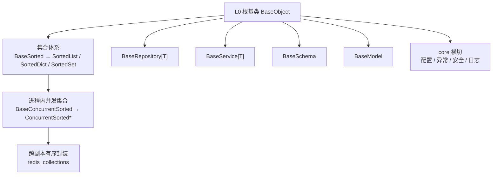

# 后端基座需求

> BMS 基础管理系统 · 阶段一（项目骨架（含后端基座）/ M1 骨架 + 基座可用）· 需求域二：后端基座（13 条）

[文档首页](../../../文档首页.md) › [项目骨架总览](00_需求_项目骨架.md) › 后端基座　|　[← 01 工程骨架](01_需求_工程骨架.md)　[03 后端基础能力 →](03_需求_后端基础能力.md)

## 1. 域说明 

本域对应阶段一「后端基座」，是**后端全部模块的前置地基**——基座体系先立，认证 / RBAC / 通用能力等模块才有统一写法。按《[架构设计 · 后端基础类体系](../../../设计/架构设计/33_架构设计_后端基础类体系.md)》「基座分层」，以 **L0 根基类 `BaseObject`** 为根，沿三条支线、按继承链**一层一层**组织，共 13 条需求：

| 子域 | 需求 | 继承关系 | 本阶段口径 |
| --- | --- | --- | --- |
| L0 根基类 | `02-1` | 一切基类之根（无父类） | 工程骨架已交付，**登记核对** |
| 集合体系 | `02-2` ~ `02-4` | `Sorted*` → `BaseSorted` → `BaseObject`；`ConcurrentSorted*` → `BaseConcurrentSorted` → `BaseSorted` | 工程骨架已交付，**登记核对** |
| 模块基类 | `02-5` ~ `02-8` | 各自继承 `BaseObject`，平行（非继承层级） | **落地**（数据库实现占位） |
| core 横切基座 | `02-9` ~ `02-12` | 异常统一继承 `BizError` | 异常体系**落地**；配置 / 安全 / 日志**结构占位** |
| 跨阶段基座 | `02-13` | — | 六类基座**登记 + 回补窗口** |

**命名规则（强制）**：基类一律 `Base` 打头（`BaseObject` / `BaseSorted` / `BaseConcurrentSorted` / `BaseRepository` / `BaseService` / `BaseSchema` / `BaseModel`）；非 `Base` 打头为继承基类的具体实现类（命名自由，如 `SortedList` / `UserRepository`）。详见《[命名规范](../../../规范/命名规范.md)》「后端命名」节。

**「接口占位」口径（本阶段统一约定）**：只落**接口 / 抽象声明 + 占位实现**——依赖注入可解析、应用可启动不报错、占位返回**固定或批量数据**以便上层先跑通链路；**不连真库、不跑迁移、不建表**；实现要点保留在需求中，随对应后续阶段填实现（不需重新立项）。

**依据**：《[总体项目规划](../../../规划/总体项目规划.md)》「工作分解结构（WBS）」节「里程碑」节（M1）、《[项目规划说明](../../../规划/项目规划说明.md)》「开发计划与验收标准」节、《[架构设计 · 后端基础类体系](../../../设计/架构设计/33_架构设计_后端基础类体系.md)》「基座分层」节「阶段落地（地基波 + 回补）」节、《[后端开发规范](../../../规范/后端开发规范.md)》「后端基座体系」节、《[命名规范](../../../规范/命名规范.md)》「后端命名」节、《[API接口规范](../../../规范/API接口规范.md)》、《[数据库开发规范](../../../规范/数据库开发规范.md)》。

**目标**：基座继承链就位——L0 根基类、集合体系（有序 / 并发 / 跨副本）、模块基类（repository / service / schema / model）、core 横切（异常 / 配置 / 安全 / 日志）分层清晰、继承关系可核对；异常体系与统一响应生效；M1 门禁「异常体系生效」为本域直接承载。

**边界说明**：

- 基座对**配置 / 日志 / 安全**只提供结构占位与统一入口，真实读取、初始化与原语实现分别由「[03 后端基础能力](03_需求_后端基础能力.md)」与认证阶段落地。
- **机制底座（数据访问底座 / 多租户数据拓扑 / 模块注册表）已从本域拆出**，另立独立需求域承接（「接口占位、不连真库、不跑迁移、不建表」口径在彼处沿用）。
- 跨阶段基座（缓存 / 数据范围 / 分片 / 事件 / 任务 / 审计）本域只登记，实现随对应阶段回补。

## 2. 需求 02-1：L0 根基类 BaseObject 登记 

优先级：2（高）　|　状态：未开始　|　完成日期：—

**继承关系**：`BaseObject`（无父类）——一切可继承后端类之根；`模块类 → 对应基类 → BaseObject`、`集合类 → BaseObject`。

**背景与动机**：`BaseObject` 是全部后端类的根与公共方法唯一落点，已于工程骨架交付但**未在架构登记**（设计目录零提及）；后续模块不知继承什么、公共能力加在哪，口径必然发散。

**内容**（《架构设计 · 后端基础类体系》「基类清单与继承链」节）：

1. 根基类 `BaseObject`（`app/core/base.py`）：序列化、稳定序序列化、统一字符串输出、主键相等与哈希——公共方法唯一落点，登记职责与继承链
2. 登记回写：《架构设计 · 后端基础类体系》与《后端开发规范》保持同源；标注「模块类不得重复实现基类公共方法」的强制约定

**完成标准**：`BaseObject` 职责 / 继承关系 / 代码位置在架构节点与规范一致、可核对；继承约定纳入规范且可核对。

**参考文档**：《架构设计 · 后端基础类体系》「基类清单与继承链」节、《后端开发规范》「后端基座体系」节

## 3. 需求 02-2：有序集合登记 

优先级：2（高）　|　状态：未开始　|　完成日期：—

**继承关系**：`SortedList` / `SortedDict` / `SortedSet` → `BaseSorted` → `BaseObject`。

**背景与动机**：有序集合是「对外输出稳定序」的公共数据形态，工程骨架已交付但未在架构登记；不登记则模块各写各的排序与序列化。

**内容**（《架构设计 · 后端基础类体系》「有序与并发集合」节）：

1. 有序集合基类 `BaseSorted[T]`（`app/core/collections.py`）与实现 `SortedList` / `SortedDict` / `SortedSet`（插入即有序）
2. 强制口径：对外输出必须稳定序（序列化走稳定序，禁止直接输出裸 `set`）；公共位置（API 响应、日志字段、任务参数 / 结果、配置映射、缓存值与导出数据）一律使用有序集合
3. 登记职责、继承关系与代码位置

**完成标准**：`BaseSorted` → `SortedList` / `SortedDict` / `SortedSet` 的继承链与职责在架构节点与规范一致、可核对；「对外稳定序」约定纳入规范且可核对。

**参考文档**：《架构设计 · 后端基础类体系》「有序与并发集合」节、《后端开发规范》「后端基座体系」节

## 4. 需求 02-3：进程内并发集合登记 

优先级：2（高）　|　状态：未开始　|　完成日期：—

**继承关系**：`ConcurrentSortedList` / `ConcurrentSortedDict` / `ConcurrentSortedSet` → `BaseConcurrentSorted` → `BaseSorted` → `BaseObject`。

**背景与动机**：多线程共享集合须有统一并发保护，工程骨架已交付（四种锁策略）但未在架构登记；不登记则模块各自加锁、口径发散。

**内容**（《架构设计 · 后端基础类体系》「有序与并发集合」节）：

1. 并发集合基类 `BaseConcurrentSorted`（`app/core/concurrent.py`，锁策略守卫 + SNAPSHOT 写时复制）与实现 `ConcurrentSorted*`（四种锁策略：读写锁 / 单锁 / 分片锁 / 快照替换）
2. 强制口径：读-改-写走原子复合方法、遍历取快照；锁内禁止 IO 与外部回调；**禁止进程内集合跨副本共享**
3. 登记职责、继承关系与代码位置

**完成标准**：`ConcurrentSorted*` → `BaseConcurrentSorted` → `BaseSorted` → `BaseObject` 的继承链与职责在架构节点与规范一致、可核对；锁策略选型与原子 / 快照约定纳入规范且可核对。

**参考文档**：《架构设计 · 后端基础类体系》「有序与并发集合」节、《后端开发规范》「后端基座体系」节

## 5. 需求 02-4：跨副本 Redis 封装登记 

优先级：2（高）　|　状态：未开始　|　完成日期：—

**继承关系**：`redis_collections`（封装模块，非类继承）——跨副本 / 多 worker 共享形态。

**背景与动机**：跨副本 / 多 worker 共享不能靠进程内集合，须统一 Redis 有序封装；工程骨架已交付但未在架构登记。

**内容**（《架构设计 · 后端基础类体系》「有序与并发集合」节）：

1. `app/core/redis_collections.py`：Redis 为唯一事实源 + 本进程只读快照 + 版本号惰性比对；复合操作（Lua / WATCH + MULTI）保证原子语义
2. 强制口径：跨副本 / 多 worker 共享必须走 Redis 封装，禁止进程内集合跨副本共享
3. 登记职责、继承关系（封装形态）与代码位置

**完成标准**：Redis 有序封装的职责与复合操作语义在架构节点与规范一致、可核对；「禁止进程内集合跨副本共享」约定纳入规范且可核对。

**参考文档**：《架构设计 · 后端基础类体系》「有序与并发集合」节、《后端开发规范》「后端基座体系」节

## 6. 需求 02-5：数据访问基类 BaseRepository 

优先级：2（高）　|　状态：未开始　|　完成日期：—

**继承关系**：`XxxRepository` → `BaseRepository[T]` → `BaseObject`。

**背景与动机**：数据访问基类是模块类的直接父类；工程骨架已交付同步内存基线，须在基座阶段定型（含数据库实现占位），否则各模块各自实现 CRUD。

**内容**（《架构设计 · 后端基础类体系》「各层基类与模块约定」节、《后端开发规范》「后端基座体系」节）：

1. `BaseRepository[T]`：通用 CRUD 模板方法 + `exists` / `count` 派生方法；数据库实现**占位**（不连库）；数据源 / 分片路由钩子预留
2. 继承约定：模块仓储 `XxxRepository` 必须继承、只写差异部分

**完成标准**：`BaseRepository[T]` 可继承、`exists` / `count` 行为正确（基类单测通过）；数据库实现为占位且不连库；`pytest`、`ruff`、`pyright` 全绿。

**参考文档**：《架构设计 · 后端基础类体系》「基类清单与继承链」节「各层基类与模块约定」节、《后端开发规范》「后端基座体系」节

## 7. 需求 02-6：服务基类 BaseService 

优先级：2（高）　|　状态：未开始　|　完成日期：—

**继承关系**：`XxxService` → `BaseService[T]` → `BaseObject`。

**背景与动机**：服务基类承上启下（委派仓储 + 统一不存在语义）；不先立，各模块各自处理「不存在」与业务规则边界。

**内容**（《架构设计 · 后端基础类体系》「各层基类与模块约定」节）：

1. `BaseService[T]`：通用 CRUD 委派仓储 + 统一不存在语义（`NotFoundError` → `BizError` 体系）
2. 继承约定：模块服务 `XxxService` 必须继承、只写业务规则，不得拼 SQL、不得跨模块直连仓储

**完成标准**：`BaseService[T]` 可继承、不存在语义行为正确（基类单测通过）；`pytest`、`ruff`、`pyright` 全绿。

**参考文档**：《架构设计 · 后端基础类体系》「各层基类与模块约定」节、《后端开发规范》「后端基座体系」节

## 8. 需求 02-7：请求 / 响应基类 BaseSchema 

优先级：2（高）　|　状态：未开始　|　完成日期：—

**继承关系**：`XxxCreateRequest` / `XxxResponse` → `BaseSchema` → `(pydantic.BaseModel, BaseObject)`。

**背景与动机**：请求 / 响应模型的公共配置与统一序列化须一处定义；不先立，各模块各自配置 Pydantic 与序列化，口径发散。

**内容**（《架构设计 · 后端基础类体系》「各层基类与模块约定」节）：

1. `BaseSchema`：Pydantic 公共配置（`from_attributes` / `str_strip_whitespace`）与统一序列化（继承 `BaseObject`）
2. 继承约定：请求 / 响应模型必须继承 `BaseSchema`，禁止直接继承 `pydantic.BaseModel`

**完成标准**：`BaseSchema` 可继承、公共配置与序列化行为正确（基类单测通过）；`pytest`、`ruff`、`pyright` 全绿。

**参考文档**：《架构设计 · 后端基础类体系》「各层基类与模块约定」节、《后端开发规范》「后端基座体系」节

## 9. 需求 02-8：ORM 模型基类 BaseModel 与表规范 

优先级：2（高）　|　状态：未开始　|　完成日期：—

**继承关系**：`XxxModel` → `BaseModel` → `BaseObject`。

**背景与动机**：全库表结构与字段行为（雪花 ID / 审计 / 软删除 / 乐观锁 / 四库类型映射）在此一次定义；不先立，几十张表建完再补基类字段将全量返工。

**内容**（《架构设计 · 数据架构》「数据规范」节、《数据库开发规范》第 2/3 节）：

1. `app/models/base.py` 的 `BaseModel` 字段（每表必备，ORM 层定义一次）：
   - 主键 `id`：雪花 ID（yitter/IdGenerator，BIGINT 跨库类型），生成器封装于 `app/core/id.py`（`generate_id()`）
   - 审计：`created_at` / `created_by` / `updated_at` / `updated_by`——由 ORM 事件自动填充（insert/update 监听），业务代码禁止手动赋值
   - 软删除：`deleted_at`（NULL=未删）；乐观锁：`version`（更新时比对，冲突返回明确错误码）
2. 四库类型映射表（基类字段跨方言实现，写入模型定义注释）：

   | 字段 | SQLite | MySQL | PostgreSQL | 达梦 DM8 |
   | --- | --- | --- | --- | --- |
   | id | INTEGER | BIGINT | BIGINT | BIGINT（自增列口径，雪花值写入） |
   | created_at 等 | DATETIME | DATETIME | TIMESTAMP | TIMESTAMP |
   | version | INTEGER | INT | INTEGER | INT |
   | 布尔（通用约定） | INTEGER 0/1 | TINYINT(1) | SMALLINT | SMALLINT（达梦无 BOOLEAN 时口径） |

   - 时间统一 UTC 存储，前端本地时区展示；金额 NUMERIC(20,4)、字符串 VARCHAR（长度显式）、禁用方言专用类型（JSON / ENUM / SERIAL）
3. 软删除机制：查询默认过滤 `deleted_at IS NULL`（repository 基类统一注入）；唯一约束统一建为 `(唯一字段, deleted_at)` 复合唯一索引；删除写时间戳释放唯一键、恢复清 NULL
4. 索引与表级规范：排序 / 逻辑外键 / 数据权限过滤字段必须建索引，命名 `idx_字段` / `uq_字段`，每表索引不超过 5 个；表名单数 snake_case、平台域前缀 `sys_`/`wf_`/`rpt_`/`ai_`、每表与字段 COMMENT 必填

**完成标准**：`BaseModel` 字段与四库类型映射定义落地、表规范写入模型注释；**建表与四库迁移验证按接口占位处理**（不连真库、不跑迁移），随后续阶段实测审计自动填充、软删除复合唯一与乐观锁冲突。

**参考文档**：《架构设计 · 数据架构》「数据规范」节、《数据库开发规范》第 2/3/4 节、《命名规范》「数据库命名」节

## 10. 需求 02-9：异常体系与统一响应 

优先级：2（高）　|　状态：未开始　|　完成日期：—

**继承关系**：异常统一继承 `BizError`（业务异常在 services 层抛出）。

**背景与动机**：工程骨架以 `NotFoundError` + 临时处理器过渡（body 结构与统一响应不一致）；若不在基座阶段统一，认证 / RBAC / 通用能力各模块将各自定义异常与错误响应，错误码口径必然发散。

**内容**（《后端开发规范》「异常与错误码」节、《API接口规范》）：

1. `app/core/exceptions.py`：统一异常基类 `BizError`（携带错误码与参数）+ 常用子类（参数异常 / 认证失效 / 权限不足 / 资源不存在 / 冲突等）；`NotFoundError` 过渡实现改为继承 `BizError`
2. 全局异常处理器：`BizError` → 统一响应 `{code, message, data}`（HTTP 状态码与业务错误码分离）；未捕获异常 → 500 且不暴露堆栈（开发环境可含 trace_id）
3. 统一响应模型 `ApiResponse`（Pydantic），成功 `code=0`；错误码平台段 `1xxxx`~`9xxxx` 登记于《架构设计 · 接口与集成》「错误码」节，本阶段建立骨架段位
4. 业务异常在 services 层抛出、api 层不 catch；`main.py` 注销临时 404 处理器
5. 测试：先登记 Kiwi 用例，再写自动化（异常分支 + 统一响应结构断言）

**完成标准**：`BizError` 及各子类可用；业务异常经全局处理器转统一响应结构；未捕获异常返回 500 且不泄露堆栈；错误码段位登记；临时处理器移除；`pytest`、`ruff`、`pyright` 全绿。

**参考文档**：《后端开发规范》「异常与错误码」节、《API接口规范》「统一响应与错误码」节、《架构设计 · 接口与集成》「错误码」节

## 11. 需求 02-10：配置基座结构占位 

优先级：2（高）　|　状态：未开始　|　完成日期：—

**继承关系**：—（core 横切基座，非继承类）。

**背景与动机**：配置是 core 横切基座的一项；基座先于上层能力，故本阶段只落**结构与入口**，真实读取交后续的配置管理任务，避免基座反向依赖上层。

**内容**（《架构设计 · 后端基础类体系》「core 横切基座」节）：

1. `app/core/config.py` 结构：配置模型（分区模型 `app` / `server` / `log` / `database` / `redis` / `cors` 等）与读取接口 `get_settings()` 的签名
2. 占位实现：返回**默认值 / 固定值**（不读 `config.toml`、不读环境变量），保证依赖注入可解析、应用可启动
3. 交接约定：真实 `config.toml` 读取、环境分层覆盖与启动校验由 [03 后端基础能力](03_需求_后端基础能力.md) 需求 03-1 落地，落地后回填本基座登记

**完成标准**：配置模型与读取接口就位、占位返回默认值、依赖注入可解析、应用可启动不报错；`pytest`、`ruff`、`pyright` 全绿。**不读配置文件**（实现期要点：真实读取由 03-1 完成并回填登记）。

**参考文档**：《架构设计 · 后端基础类体系》「core 横切基座」节、《项目规划说明》「环境与配置」节、《命名规范》「基础设施命名」节

## 12. 需求 02-11：安全基座结构占位 

优先级：2（高）　|　状态：未开始　|　完成日期：—

**继承关系**：—（core 横切基座，非继承类）。

**背景与动机**：core 横切的安全基座需先有统一落点，认证实现才不会各自起炉灶；本阶段只落接口声明。

**内容**（《架构设计 · 后端基础类体系》「core 横切基座」节）：

1. 安全基座声明：`app/core/security.py`——密码哈希 / 校验、令牌签名与校验、会话安全原语的接口签名（实现随认证阶段）
2. 登记：安全基座的职责与代码位置回写《架构设计 · 后端基础类体系》

**完成标准**：安全基座接口声明就位、可被上层引用、依赖注入可解析、应用可启动不报错；`pytest`、`ruff`、`pyright` 全绿。**不实现安全细节**（实现期要点：随认证阶段）。

**参考文档**：《架构设计 · 后端基础类体系》「core 横切基座」节、《后端开发规范》「后端基座体系」节

## 13. 需求 02-12：日志基座接入点 

优先级：2（高）　|　状态：未开始　|　完成日期：—

**继承关系**：—（core 横切基座，非继承类）。

**背景与动机**：core 横切的日志基座需先有统一接入点，日志实现才不会各自起炉灶；本阶段只落接入点声明。

**内容**（《架构设计 · 后端基础类体系》「core 横切基座」节、《日志规范》）：

1. 日志基座接入点声明：structlog 初始化入口（`app/core/logging.py` 或等价位置）与「日志只写 stdout、不落文件」约定；渲染形态由配置 `[log] format` 控制（真实实现归需求 03-2 日志体系）
2. 登记：日志基座的职责与代码位置回写《架构设计 · 后端基础类体系》

**完成标准**：日志基座接入点声明就位、可被上层引用、依赖注入可解析、应用可启动不报错；`pytest`、`ruff`、`pyright` 全绿。**不实现日志细节**（实现期要点：随 03-2 日志体系）。

**参考文档**：《架构设计 · 后端基础类体系》「core 横切基座」节、《日志规范》、《后端开发规范》「后端基座体系」节

## 14. 需求 02-13：跨阶段基座登记与回补 

优先级：3（中）　|　状态：未开始　|　完成日期：—

**继承关系**：—（跨阶段基座，随对应阶段回补）。

**背景与动机**：缓存、数据范围、分片、事件、任务、审计六类能力都有「基座」成分（公共封装 + 模块只写差异），但它们依赖各自后端模块；若不在基座阶段登记清楚，后续模块会各自实现，口径发散且重复。

**内容**（《架构设计 · 后端基础类体系》「阶段落地（地基波 + 回补）」节）：

1. **缓存 Region 分域基座**（回补通用能力阶段）：dogpile.cache Region 分域 + 全局版本号惰性比对；key 规范 `bms:{租户|global}:{域}:{业务键}`、全 key 带 TTL；三防在基座统一
2. **数据范围注入基座**（回补 RBAC 阶段）：`BaseRepository` 数据访问范围注入钩子（写读双向校验），规则由 RBAC 提供
3. **分片路由基座**（回补分布式与监控阶段）：`ShardingRouter` 抽象（分片键 → 物理库 / 表解析），MVP 按月分表
4. **事件发布 / 消费基座**（回补系统集成与消息阶段）：统一事件发布接口（RocketMQ 事务消息）与消费基类（分区有序消费）
5. **Celery 任务基座**（回补通用能力阶段）：任务定义入库（`sys_task`）+ 调度基类 + 执行记录（`sys_task_log`）
6. **ORM 审计捕获基座**（回补通用能力阶段）：ORM 事件捕获关键表字段级变更，审计事件走分区有序消费（哈希链）
7. 登记要求：六类基座的职责、契约与回补阶段写入《架构设计 · 后端基础类体系》与阶段一计划表；对应阶段实施时在**该阶段计划**登记窗口（同一任务文档，不重复建任务）

**完成标准**：六类跨阶段基座的职责与契约在架构节点登记；回补阶段与窗口写入阶段一计划表；本阶段可独立实现的封装骨架（接口与契约层）就位；对应阶段启动时按登记实施并回写状态；无遗漏、无重复实现。

**参考文档**：《架构设计 · 后端基础类体系》「阶段落地（地基波 + 回补）」节、《架构设计 · 数据架构》「缓存架构」节、《架构设计 · 事件总线》、《架构设计 · 任务调度》、《架构设计 · 审计哈希链》

> 本文档依《文档生成规范》编写
