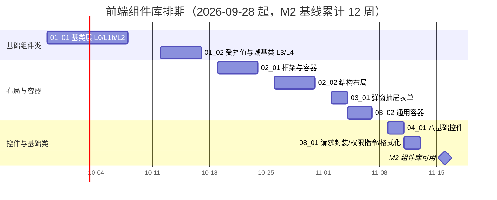

# 前端组件库计划

> BMS 基础管理系统 · 阶段二（前端组件库 / M2 组件库可用）排期计划：地基波 8 项任务逐条排期、依赖波 8 项登记回补窗口

[文档首页](../../../文档首页.md) › 前端组件库计划　|　[任务基线 →](../任务/01_基础组件类/01_基础组件类.md)　[需求基线 →](../需求/00_需求_前端组件库.md)

## 1. 计划说明 

- **排期对象**：前端组件库 16 项任务（[任务基线](../需求/00_需求_前端组件库.md)：8 父任务 + 16 子任务）。其中**地基波 8 项**（基础组件类 L0-L4、布局、容器、基础控件、基础类）为本阶段窗口内实施；**依赖波 8 项**（字段 / 展示 / 交互类）依赖后端能力，登记回补窗口、不占本阶段日期。
- **排期口径**：以阶段一 M1 达成（《总体项目规划》甘特图节：M1 累计 5 周，基线 2026-09-28）为起点，串行排 7 周至 2026-11-13，留缓冲至 M2 门禁（累计 12 周，2026-11-16）。
- **依据**：《总体项目规划》「工作分解结构（WBS）」节（阶段二）、「里程碑」节（M2）、「阶段工期估算基线」节（阶段二 7 周）；《项目规划说明》「开发计划与验收标准」节（阶段二）；《架构设计 · 前端组件体系》「阶段落地（地基波 + 回补）」节（地基波 + 回补）。
- **负责人**：minjian（兼职，单人）。

## 2. 已完成任务（—） 

| 编号 | 任务 | 工时（重估） | 完成日期 | 任务文件 |
| --- | --- | --- | --- | --- |

> 阶段二尚未开工；L1a 数据/契约基类已在阶段一交付（不计入本阶段任务）。本表随任务完成回填。

## 3. 剩余任务排期（自 2026-09-28） 

### 3.1 地基波（本阶段窗口实施）

| 编号 | 任务 | 工时 | 依赖 | 排期窗口 | 备注 |
| --- | --- | --- | --- | --- | --- |
| 01_01 | 基类层 L0 / L1b / L2 七形态基类 | 28h | 阶段一（01-4-1 L1a） | 2026-09-28 ~ 2026-10-09 | 全体组件之根，最高优先 |
| 01_02 | 受控值与域基类 L3 / L4 | 16h | 01_01 | 2026-10-12 ~ 2026-10-16 | 字段壳 / 字段权限契约 |
| 02_01 | 框架与容器（AppLayout / FormFrame / PageContainer） | 12h | 01_01 | 2026-10-19 ~ 2026-10-23 | 全站外壳 |
| 02_02 | 结构布局（导航/主从/栅格/间距/分栏/页签/卡片/折叠） | 16h | 02_01 | 2026-10-26 ~ 2026-10-30 | 页面内结构 |
| 03_01 | 弹窗抽屉表单（FormDialog / FormDrawer / ConfirmDialog） | 8h | 01_02/02_01 | 2026-11-02 ~ 2026-11-03 | 三态弹窗表单 |
| 03_02 | 通用容器（滚动/懒加载/全屏/自适应/虚拟列表/遮罩/分区/宽高比） | 14h | 02_01 | 2026-11-04 ~ 2026-11-06 | 含性能容器 |
| 04_01 | 八基础控件 | 10h | 01_02 | 2026-11-09 ~ 2026-11-10 | 字段类继承底座 |
| 08_01 | 请求封装 / 权限指令 / 格式化工具 | 8h | 01_01/阶段一 | 2026-11-11 ~ 2026-11-12 | 列表页取数入口 |

地基波合计 **112h**，窗口 2026-09-28 ~ 2026-11-12，缓冲至 2026-11-16（M2）。

### 3.2 依赖波（登记回补，不占本阶段日期）

| 编号 | 任务 | 工时 | 依赖 | 排期窗口 | 备注 |
| --- | --- | --- | --- | --- | --- |
| 05_01 | 基础与数据源字段 | 18h | 04_01、阶段五（字典） | 搁置（待阶段五） | 日期/金额/枚举/字典/树/级联 |
| 05_02 | 组织选择字段 | 6h | 05_01、阶段四（部门/用户/岗位） | 搁置（待阶段四后） | 用户/岗位/组织/部门树 |
| 05_03 | 高级交互字段 | 14h | 04_01、阶段三（验证码）、阶段五（文件） | 搁置（待阶段三/五） | 上传/富文本/穿梭框/验证码/标签 |
| 06_01 | 数据呈现 | 14h | 04_01、02_01、阶段五（列表/偏好） | 搁置（待阶段五起） | 表格/筛选/标签描述/指标卡 |
| 06_02 | 图表与搜索 | 10h | 06_01、阶段十三（报表）、阶段十五（检索） | 搁置（待阶段十三/十五） | 图表卡/全局搜索 |
| 06_03 | 反馈与查看 | 12h | 阶段五（通知/文件/审计）、阶段六（推送） | 搁置（待阶段五起） | 空态/通知/预览/审计差异等 |
| 07_01 | 操作流与设计器 | 28h | 01~04 域、阶段四~六 | 搁置（待阶段四~六） | 导入导出/审批流/表单与流程设计器 |
| 07_02 | 业务设计器与面板 | 30h | 07_01、阶段五/十三/十六 | 搁置（待阶段五/十三/十六） | 报表/大屏/AI/i18n 编辑器等 |

依赖波合计 **132h**；各任务回补时在**对应阶段计划**登记实际窗口（同一任务文档，不重复建任务）。

## 4. 排期甘特图 

## 5. M2 验收门禁 

门禁定义与逐项核对见 [需求总览 · M2 验收门禁](../需求/00_需求_前端组件库.md#accept)（基础类体系可用 / 地基波组件可用 / 组件单测通过 / 原型一致）。本计划下的达成路径：

| 验收点 | 对应任务 | 达成路径 |
| --- | --- | --- |
| 基础类体系可用 | 01_01、01_02 | 09-28 ~ 10-16 按层落地 L0-L4 基类，继承链与依赖方向合规 |
| 地基波组件可用 | 02_01、02_02、03_01、03_02、04_01、08_01 | 10-19 ~ 11-12 布局/容器/控件/基础类交付，可组装列表页与表单页骨架 |
| 组件单测通过 | 全部地基波任务 | 各任务随交付附 Vitest 组件单测，覆盖率并入前端门禁 |
| 原型一致 | 全部地基波任务 | 逐组件对照《组件设计》可交互原型验收（原型即基准） |

**里程碑对照**（《总体项目规划》「甘特图」节基线）：

| 里程碑 | 基线 | 本计划预计 | 说明 |
| --- | --- | --- | --- |
| M1 骨架可用 | 2026-09-28 | 2026-09-28 | 阶段一收口，阶段二起点 |
| M2 组件库可用 | 2026-11-16 | 2026-11-16 | 地基波全部门禁通过 |

## 6. 风险与对策 

| 风险 | 影响 | 对策 |
| --- | --- | --- |
| 基类契约发散导致下游组件返工 | 进度失控 | 01_01/01_02 先行且优先保障；以《前端开发规范》分层为唯一权威；Vitest 覆盖基类契约 |
| 45 个节点集中在一个阶段（地基波） | 阶段工期不足 | 按域拆子任务分批交付（先基类 → 框架/容器 → 控件/基础类）；里程碑中途评审滚动调整 |
| 依赖波回补过晚，页面阶段才发现组件缺失 | 阶段十二阻塞 | 回补窗口在 3.2 显式登记；06_01 通用表格（列表页底座）随阶段五尽早实施 |
| 重组件分包不当导致首屏膨胀 | 性能不达标 | 设计器族（bpmn-js/CodeMirror/ECharts/vue-flow/gridstack/wangEditor）独立分包异步加载，按《架构设计 · 前端组件体系》「分包与加载策略」节执行 |
| 单人兼职投入不稳 | 里程碑延期 | 串行保守排期 + 缓冲；必要时先交付地基地波核心（基类 + 框架 + 控件） |

> 本文档依《文档生成规范》编写
