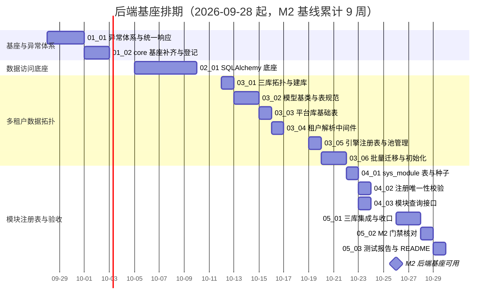

# 后端基座计划

> BMS 基础管理系统 · 阶段二（后端基座 / M2 后端基座可用）排期计划：16 项任务逐条排期

[文档首页](../../../文档首页.md) › 后端基座计划　|　[任务基线 →](../任务/01_基座与异常体系/01_基座与异常体系.md)　[需求基线 →](../需求/00_需求_后端基座.md)

## 1. 计划说明 

- **排期对象**：后端基座 16 项任务（[任务基线](../需求/00_需求_后端基座.md)：6 父任务 + 16 子任务）。其中**地基波 14 项**（域 01~05）为本阶段窗口内实施；**跨阶段基座 1 项**（域 06）以「登记 + 本阶段可独立实现的封装骨架」为主、实现主体按对应阶段回补。
- **排期口径**：以阶段一 M1 达成（《总体项目规划》甘特图节：M1 累计 5 周，基线 2026-09-28）为起点，串行排 4 周至 2026-10-23，留缓冲至 M2 门禁（累计 9 周，2026-10-26）。
- **依据**：《总体项目规划》「工作分解结构（WBS）」节（阶段二）、「里程碑」节（M2）、「阶段工期估算基线」节（阶段二 4 周）；《项目规划说明》「开发计划与验收标准」节（阶段二）；《架构设计 · 后端基础类体系》「阶段落地（地基波 + 回补）」节（地基波 + 回补）。
- **工时**：合计 **63h**（域 01 10h + 域 02 12h + 域 03 19h + 域 04 6h + 域 05 8h + 域 06 8h）。
- **负责人**：minjian（兼职，单人）。

## 2. 已完成任务（—） 

| 编号 | 任务 | 工时（重估） | 完成日期 | 任务文件 |
| --- | --- | --- | --- | --- |

> 阶段二尚未开工；阶段一已交付的 core 基座与三套基类（`BaseObject`/有序集合/并发集合/Redis 封装/`BaseRepository`/`BaseService`/`BaseSchema`）不计入本阶段任务，仅在本阶段回写登记（域 01）。本表随任务完成回填。

## 3. 剩余任务排期（自 2026-09-28） 

| 编号 | 任务 | 工时 | 依赖 | 排期窗口 | 备注 |
| --- | --- | --- | --- | --- | --- |
| 01_01 | 异常体系与统一响应 | 6h | 阶段一 02_01/02_02 | 2026-09-28 ~ 2026-09-30 | BizError + 统一响应 + 错误码登记 |
| 01_02 | core 基座补齐与登记 | 4h | 01_01 | 2026-10-01 ~ 2026-10-02 | 配置/安全基座 + 基座清单回写 |
| 02_01 | SQLAlchemy 数据访问底座 | 12h | 01 域 | 2026-10-05 ~ 2026-10-09 | 引擎/会话/四库方言/基类异步切换 |
| 03_01 | 三库拓扑与建库 | 2h | 02_01 | 2026-10-12 | 三库模型 + SQLite 模拟 |
| 03_02 | 模型基类与表规范 | 4h | 02_01/03_01 | 2026-10-13 ~ 2026-10-14 | BaseModel：雪花 ID/软删除/审计/乐观锁 |
| 03_03 | 平台库基础表 | 2h | 03_01/03_02 | 2026-10-15 | sys_tenant 字段索引 + demo 种子 |
| 03_04 | 租户解析中间件 | 3h | 03_03 | 2026-10-16 | 解析链 + TenantContext + 豁免路径 |
| 03_05 | 引擎注册表与池管理 | 3h | 02_01/03_03 | 2026-10-19 | 懒加载 + LRU 回收 + 连接预算 |
| 03_06 | 批量迁移与租户库初始化 | 5h | 03_03 | 2026-10-20 ~ 2026-10-21 | Alembic 三套方言 + 批量脚本 |
| 04_01 | sys_module 表与种子 | 3h | 03_01/03_03 | 2026-10-22 | 字段 + i18n 附表 + 平台域种子 |
| 04_02 | 注册唯一性校验 | 2h | 04_01 | 2026-10-23 | 启动校验 + CI 查重 |
| 04_03 | 模块查询接口 | 1h | 04_01 | 2026-10-23 | GET /api/v1/modules 只读契约 |
| 05_01 | 三库集成与流水线收口 | 4h | 阶段一 03_01、02_01、03 域 | 2026-10-26 ~ 2026-10-27 | bms_test 建库流程 + 集成用例 + 开关激活 |
| 05_02 | M2 验收门禁核对 | 2h | 05_01、01~06 域 | 2026-10-28 | 六项门禁证据 + 状态回写 |
| 05_03 | 测试报告与 README | 2h | 05_02 | 2026-10-29 | 报告四章节 + README 更新 + Kiwi 导入 |
| 06_01 | 跨阶段基座登记与回补 | 8h | 01 域、02 域、03 域 | 2026-10-29 ~ 2026-10-30 | 六类基座登记 + 封装骨架（实现按阶段回补） |

### 3.1 跨阶段基座回补窗口（不占本阶段日期）

| 基座 | 回补阶段 | 说明 |
| --- | --- | --- |
| 缓存 Region 分域基座 | 阶段六 通用能力 | dogpile Region 分域 + 全局版本号 + 三防 |
| 数据范围注入基座 | 阶段五 RBAC | `BaseRepository` 范围注入钩子，规则由 RBAC 提供 |
| 分片路由基座 | 阶段十一 分布式与监控 | `ShardingRouter` 抽象 + 按月分表落地 |
| 事件发布 / 消费基座 | 阶段八 系统集成与消息 | 统一发布接口 + 消费基类（分区有序） |
| Celery 任务基座 | 阶段六 通用能力 | sys_task 调度基类 + 执行记录 |
| ORM 审计捕获基座 | 阶段六 通用能力 | ORM 事件捕获 + 分区有序消费（哈希链） |

> 回补实施时在**对应阶段计划**登记窗口（同一任务文档，不重复建任务）。

## 4. 排期甘特图 

## 5. M2 验收门禁 

门禁定义与逐项核对见 [需求总览 · M2 验收门禁](../需求/00_需求_后端基座.md#accept)（异常体系 / BaseModel 落库 / 三库拓扑 / 租户隔离与批量迁移 / 模块注册校验 / 跨阶段基座登记）。本计划下的达成路径：

| 验收点 | 对应任务 | 达成路径 |
| --- | --- | --- |
| 异常体系生效 | 01_01 | 09-28 ~ 09-30 `BizError` 与统一响应落地，过渡处理器移除 |
| BaseModel 落库 | 03_02 | 10-13 ~ 10-14 模型基类与表规范，三库迁移可执行 |
| 三库拓扑可路由 | 02_01、03_01、03_05、03_06 | 10-05 ~ 10-21 底座与拓扑落地，驱动连通与迁移通过 |
| 租户隔离与批量迁移正确 | 03_04、03_06 | 10-16 ~ 10-21 解析链与批量迁移演练 |
| 模块注册校验生效 | 04_01 ~ 04_03 | 10-22 ~ 10-23 冲突种子被拒 + 查询接口可用 |
| 跨阶段基座登记齐备 | 06_01 | 10-29 ~ 10-30 六类基座登记与回补窗口写入计划 |

**里程碑对照**（《总体项目规划》「甘特图」节基线）：

| 里程碑 | 基线 | 本计划预计 | 说明 |
| --- | --- | --- | --- |
| M1 骨架可用 | 2026-09-28 | 2026-09-28 | 阶段一收口，阶段二起点 |
| M2 后端基座可用 | 2026-10-26 | 2026-10-26 | 六项门禁通过 |

## 6. 风险与对策 

| 风险 | 影响 | 对策 |
| --- | --- | --- |
| 达梦方言差异与 dmPython 同步驱动接入 | 03_02/03_06/05_01 受阻 | 按 Oracle 兼容口径实测；同步驱动经 `asyncio.to_thread` 封装例外；不通过按《项目规划说明》「数据库兼容」节调整并修订需求 |
| 基类异步切换为一次性调用面改动 | 回归风险 | 集中在 02_01 完成，以回归用例护栏（行为不变）；同步内存基线保留为测试替身 |
| 跨阶段基座易在后续模块各自实现 | 口径发散 | 06_01 登记职责与契约，回补窗口写入计划；对应阶段实施时回写状态 |
| 重验证层三库 job 激活依赖 registry/网络 | 集成 job 不稳定 | 以 `deploy/ci/verify-enabled` 开关守卫，稳定后开启；Trivy 外网不可达按暂缓口径 |
| 单人兼职投入不稳 | 里程碑延期 | 串行保守排期 + 缓冲；必要时先保地基波核心（异常体系 → 数据访问底座 → 拓扑 → 模块注册） |

> 本文档依《文档生成规范》编写
