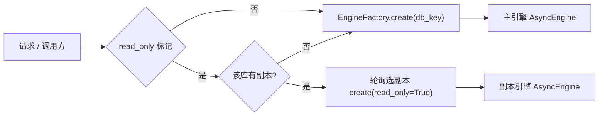

# 数据访问底座落库详细设计

> 后端基座与服务化地基 · 01 后端基座真实实现 · 01 数据访问底座落库 · 详细设计

[文档首页](../../../../../../文档首页.md) › [01 数据访问底座落库](../01_后端基座真实实现_01_数据访问底座落库.md) › 01 详细设计　|　[父任务：后端基座真实实现](../../01_后端基座真实实现.md) · [本阶段需求](../../../../需求/01_需求_后端基座真实实现.md) · [排期计划](../../../../计划/01_计划_后端基座与服务化地基.md)

## 1. 概述 <a id="overview"></a>

- **目标**：把阶段一交付的数据访问底座**接口占位**填为真实实现——引擎与多异步 bind 真实化、`AsyncSession` 工厂按请求上下文读写标记选主从、四库方言与驱动接线（含达梦同步方言）、读写分离与主库故障只读降级、`DbUnitOfWork` 事务边界落地、连接池按服务与 worker 可配并做连接预算告警。
- **依据**：《架构设计 · 数据访问与分片》「多数据源管理」「读写分离」「事务边界规则」「查询规范」节；《架构设计 · 后端基础类体系》「各层基类与模块约定」「阶段交付与跨阶段基座契约」节；《后端基类清单》「数据访问与多租户基座」节；《后端开发规范》「数据访问」「异步（§9）」节；需求 [01-1](../../../../需求/01_需求_后端基座真实实现.md#r01-1)。
- **范围（本任务）**：
  1. 引擎与会话工厂真实实现（多异步 bind、`AsyncSession` 工厂按请求上下文读写标记选主从）。
  2. 四库方言与驱动接线（MySQL / PostgreSQL / 达梦 DM8 / SQLite）；ORM 层禁方言特有功能由既有模型规范承载。
  3. `DbUnitOfWork` 事务边界落地与读写分离路由（只读标记 → 绑定 → 选引擎）。
  4. 连接池参数按服务与 worker 可配、连接预算校验告警。
- **不含（明确归口，见第 8 节）**：租户解析链与引擎注册表 LRU/连接预算核算（任务 02）；`BaseDbRepository` 真实 CRUD / 软删除 SQL / 排序 DB 侧（任务 03、04）；Alembic 在线迁移与 `ops` 批量迁移（任务 04）；三库真库集成实测、CI `verify/db` 档与达梦真库方言实测（任务 05）；达梦**异步会话适配器**（任务 05）。

## 2. 现状与差距 <a id="gap"></a>

| 关注点 | 现状（阶段一交付） | 差距（本任务目标） |
| --- | --- | --- |
| `EngineFactory` | 按 `db_key` 创建 / 缓存 `AsyncEngine` + 连接池参数；`replicas` 配置从未被读取 | 主 / 副本多绑定、只读选副本、副本轮询、同步引擎（达梦）接线 |
| `SessionFactory` | 薄封装 `async_sessionmaker`，真实现 | 无差距（保持） |
| `get_db` / `get_uow` | 恒取 `platform` 引擎、不看只读标记；`get_uow` 复用请求会话 | 按只读标记选引擎；写 / 事务强制主库 |
| `routing.py` | `WRITE_BINDING == READ_BINDING == "default"` | 读写绑定语义分离、请求方法 → 只读标记 |
| `read_only` 上下文 | 已定义，**全仓无生产代码设置** | 纯 ASGI 中间件按 HTTP 方法设置 + 路由显式覆盖 |
| 连接池 | 池参数仅挂在库目标；`check_connection_budget` 被调用处为空 | 按服务覆盖、worker 预算校验告警、`max_connections`、连接超时 |
| 主库故障降级 | 不存在 | 写失败转明确错误 + 读走副本 + 可用标记与探测恢复 |
| 达梦方言 | 仅 `dmPython` 裸驱动；`dm+dmPython` 方言**不可加载**（实测 `NoSuchModuleError`） | 引入 `dmSQLAlchemy` 方言、同步连通接线；异步适配归任务 05 |

## 3. 交付物清单 <a id="tree"></a>

```text
backend/
├── pyproject.toml                                   # 修改：新增 dmSQLAlchemy 依赖（达梦 SQLAlchemy 方言）
├── config.toml                                      # 修改：app.service、库 services 池覆盖、max_connections、connect_timeout、replicas 注释
├── .env.example                                     # 修改：新增 BMS_APP__SERVICE、BMS_DATABASE__*__SERVICES__*、MAX_CONNECTIONS、CONNECT_TIMEOUT 模板
├── app/
│   ├── core/
│   │   ├── config.py                                # 修改：AppSettings.service、DbPoolSettings.connect_timeout、DatabaseTargetSettings.max_connections/services/effective_pool
│   │   ├── error_codes.py                           # 修改：新增 DATABASE_UNAVAILABLE = 10006
│   │   └── exceptions.py                            # 修改：新增 DatabaseUnavailableError（GeneralError，503）
│   ├── db/
│   │   ├── engine.py                                # 修改：主/副本多绑定、只读选副本、轮询、连接池按服务、连接超时、同步引擎
│   │   ├── registry.py                              # 修改：get(db_key, *, read_only=False)、预算校验接线
│   │   ├── routing.py                               # 修改：绑定常量语义分离 + SAFE_METHODS / is_read_method
│   │   ├── session.py                               # 修改：get_db 按标记选引擎、get_read_db / get_write_db、get_uow 走主库
│   │   ├── health.py                                # 新增：PrimaryHealth（主库可用标记与探测，BaseAsyncResource）
│   │   └── null.py                                  # 不变
│   ├── api/
│   │   ├── middleware.py                            # 修改：新增 ReadOnlyMiddleware（纯 ASGI，按方法设只读标记）
│   │   ├── errors.py                                # 修改：OperationalError/InterfaceError → DatabaseUnavailableError（503）并标记降级
│   │   └── deps.py                                  # 修改：汇总导出 get_read_db / get_write_db / get_primary_health
│   └── main.py                                      # 修改：注册只读中间件、装配 PrimaryHealth、启动期连接预算校验告警
└── tests/
    ├── db/test_engine_routing.py                    # 新增：主/副本绑定、轮询、回退
    ├── db/test_readonly_middleware.py               # 新增：方法 → 只读标记、路由覆盖
    ├── db/test_degradation.py                       # 新增：主库故障降级与恢复
    ├── db/test_pool_config.py                       # 新增：池参数按服务、connect_args、预算告警
    ├── db/test_data_access.py                       # 修改：get_db 选引擎断言适配
    ├── db/test_unit_of_work.py                      # 修改：真实表 commit/rollback
    ├── core/test_config.py                          # 修改：新键默认与覆盖解析
    └── integration/test_db_connectivity_integration.py  # 新增：四库连通（env 守卫，方言标记）

bms文档/
└── 后端基类清单.md                                    # 修改：数据访问与多租户基座节状态回写
```

## 4. 领域设计 <a id="design"></a>

### 4.1 配置扩展 <a id="config"></a>

`app/core/config.py` 增量（均向后兼容、有默认值，既有配置不受影响）：

| 字段 | 位置 | 默认 | 说明 |
| --- | --- | --- | --- |
| `service` | `AppSettings` | `"platform"` | 服务标识（微服务名）；用于选取按服务的池覆盖 |
| `connect_timeout` | `DbPoolSettings` | `10.0` | 建连超时（秒），非 SQLite 经 `connect_args` 传入 |
| `max_connections` | `DatabaseTargetSettings` | `0` | 该库最大连接数；`0` 表示不校验连接预算 |
| `services` | `DatabaseTargetSettings` | `{}` | 按服务池覆盖：`{服务标识 → DbPoolSettings}` |
| `replicas` | `DatabaseTargetSettings` | `[]` | 只读副本 URL（既有；本任务首次真实读取） |

- `DatabaseTargetSettings.effective_pool(service: str) -> DbPoolSettings`：`services[service]` 命中则用覆盖，否则回落 `pool`。
- 环境变量键：`BMS_APP__SERVICE`、`BMS_DATABASE__<TARGET>__SERVICES__<SERVICE>__POOL__POOL_SIZE`、`BMS_DATABASE__<TARGET>__MAX_CONNECTIONS`、`BMS_DATABASE__<TARGET>__POOL__CONNECT_TIMEOUT`。
- `config.toml` 三库各补 `max_connections`（默认 `0`）与 `pool.connect_timeout`；`services` 保持空表（按需覆盖）。

### 4.2 引擎工厂：主 / 副本多绑定 <a id="engine"></a>

`EngineFactory(BaseDbFactory[str | None, AsyncEngine])` 扩展（保持 `create` 兼容既有调用）：

| 成员 | 说明 |
| --- | --- |
| `create(options=None, *, read_only=False) -> AsyncEngine` | 主 / 副本引擎创建与缓存；`read_only=False` 返回主引擎（兼容既有 `create(db_key)`） |
| `create_sync(options=None) -> Engine` | 同步引擎（达梦及连通性探测）；独立缓存，不参与异步注册表生命周期 |
| `replicas(db_key) -> list[str]` | 该库副本 URL 列表（读目标解析） |
| `drop(db_key)` / `aclose()` | 释放该库全部主/副本引擎 / 释放全部（含同步引擎） |

- 缓存键：异步引擎按 `(db_key, "write")` / `(db_key, f"read:{index}")`；同步引擎按 `db_key`。
- 只读选择：有副本则**进程内轮询**（`_rr[db_key] = (idx + 1) % len(replicas)`），无副本回落主引擎（保证 SQLite 单库开发可用）。
- 引擎参数（`_engine_kwargs(target, url)`）：
  - SQLite（`sqlite+`）：仅 `pool_pre_ping=True`（池参数不适用）。
  - 异步服务端方言（`mysql+` / `postgresql+`）：`pool_pre_ping` + `effective_pool(service)` 四项 + `connect_args={"connect_timeout": int(connect_timeout)}`。
  - 达梦（`dm+`）：`create` 抛 `ConfigError`（同步驱动无异步方言，须走任务 05 异步适配器）；`create_sync` 用 `create_engine` 正常创建，供连通性验证。
- 方言识别：由 URL 前缀判定，不硬编码方言模块；`dm` 依赖 `dmSQLAlchemy` 注册。



### 4.3 会话工厂与请求依赖 <a id="session"></a>

`app/db/session.py`：

| 成员 | 说明 |
| --- | --- |
| `SessionFactory.create(engine)` | 不变（`async_sessionmaker(engine, expire_on_commit=False)`） |
| `get_db(request)` | 请求级会话：`engine = registry.get(db_key, read_only=is_read_only())`（**按请求上下文读写标记选引擎**）；每请求独立、退出释放 |
| `get_read_db(request)` | 强制只读会话（读从库；报表数据集 / 只读接口显式覆盖用） |
| `get_write_db(request)` | 强制主库会话（写路径 / 事务用） |
| `get_uow(session = Depends(get_write_db))` | 工作单元**绑定主库会话**（写与事务强制走主库；写后同会话内读主库） |

- `db_key` 本任务固定 `platform`，以参数形式预留（`get_db(request, db_key="platform")` 语义），租户 `db_key` 由任务 02 接入。
- 会话禁止跨请求共享：均由 `async with factory()` 保证退出释放。

### 4.4 只读标记与读写绑定 <a id="routing"></a>

`app/db/routing.py` + `app/api/middleware.py`：

- `routing.py`：`WRITE_BINDING = "default"`、`READ_BINDING = "replica"`（语义分离，供仓储 `_resolve_binding` 与文档/断言使用）；`SAFE_METHODS = frozenset({"GET", "HEAD", "OPTIONS"})`、`is_read_method(method) -> bool`。
- `ReadOnlyMiddleware`（纯 ASGI，经验同 `TraceIdMiddleware`）：请求开始按 `is_read_method(scope["method"])` 设置 `read_only` 上下文，结束复位。
- **路由显式覆盖**：只读数据集 / 强制从库接口声明 `Depends(get_read_db)`；写 / 事务路径声明 `Depends(get_write_db)` 或 `Depends(get_uow)`。方法自动判定与显式覆盖共存，显式优先。

### 4.5 引擎注册表：只读参数与生命周期 <a id="registry"></a>

`EngineRegistry.get(db_key=PLATFORM_DB_KEY, *, read_only=False)`：

- 写路径：确保 `_engines[db_key]`（主引擎）存在并 `_touch`，返回主引擎。
- 读路径：同样确保 `db_key` 被登记与 `_touch`（供 LRU 跟踪），返回 `factory.create(db_key, read_only=True)`（副本轮询 / 回退主）。
- `_evict` / `release` / `_dispose` 复用既有：逐出即 `factory.drop(db_key)`（一次释放该库主 + 全部副本引擎）。平台常驻、闲置回收、活跃上限逻辑不变（细化归任务 02）。
- `check_connection_budget(...)` 公式不变；本任务新增**启动期调用**（第 4.6 节）。

### 4.6 连接池按服务与 worker、连接预算告警 <a id="pool"></a>

- 池参数解析：`DatabaseTargetSettings.effective_pool(settings.app.service)`，服务覆盖优先。
- 连接超时：`connect_args={"connect_timeout": int(pool.connect_timeout)}` 仅对 `mysql+` / `postgresql+`（SQLite 忽略；达梦登录超时参数随任务 05 实测后补）。
- 启动期连接预算校验（新增函数，`main` 装配期调用并记日志）：
  - 对每个库目标：`workers × (pool_size + max_overflow) ≤ max_connections × 70%`；`max_connections == 0` 跳过。
  - 超限记 `WARNING`（含库键、workers、池参数与预算结论），**不阻断启动**。
- 快速失败与告警：`pool_pre_ping` + `pool_timeout` + `connect_timeout` 三重快速失败；失败经运维可观测（日志）告警。

### 4.7 主库故障只读降级 <a id="degradation"></a>

`app/db/health.py` 新增 `PrimaryHealth(BaseAsyncResource)`：

| 成员 | 说明 |
| --- | --- |
| `mark_degraded(db_key)` / `mark_recovered(db_key)` | 置 / 清「主库不可用」标记（进程内） |
| `is_degraded(db_key) -> bool` | 查询标记 |
| `async probe(db_key) -> bool` | 主库探测（`SELECT 1`）：成功清标记返回 True，失败置标记返回 False |
| `aclose()` | 无副作用（幂等） |

降级编排：

- **写路径**：`get_write_db` / `get_uow` 取主库前，若 `is_degraded` 则先 `probe`；探测失败抛 `DatabaseUnavailableError`（`10006`，HTTP 503），写接口返回明确错误。
- **读路径**：`get_db` / `get_read_db` 在降级态优先副本（配置副本时）；无副本且主库探测失败时同样抛 `DatabaseUnavailableError`。
- **自动恢复**：降级期间每次写 / 读请求先 `probe`，成功即清标记恢复。
- **写失败标记**：全局异常处理器捕获 `sqlalchemy.exc.OperationalError` / `InterfaceError`，标记主库降级并转 `DatabaseUnavailableError`（503）。

### 4.8 达梦 DM8 方言接线 <a id="dm"></a>

- 依赖新增 `dmSQLAlchemy`（提供 `dm+dmPython` 同步方言，实测 Python 3.14 可加载；`dmPython` 保持）。
- `EngineFactory.create_sync` 用 `create_engine("dm+dmPython://…")` 建同步引擎；四库连通性探测（`SELECT 1`）经此路径。
- 异步路径暂不支持达梦：`create("…dm…")` 抛 `ConfigError` 并指明「达梦为同步驱动，异步适配器随任务 05」。任务 05 交付同步引擎的 `asyncio.to_thread` 异步门面，四库统一异步接口。
- `dmSQLAlchemy` 无三方异步实现，`create_async_engine("dm+dmPython://…")` 实测明确报错（`The asyncio extension requires an async driver`），故本任务以同步路径验证连通。

### 4.9 事务边界 <a id="uow"></a>

- `DbUnitOfWork`（既有真实现）保持不变：`begin()` → `session.begin()`，`commit()` / `rollback()` 委派会话；`services` 层经 `BaseTransactionalService` 显式声明边界。
- 写入 / 事务经 `Depends(get_uow)` 绑定**主库会话**，落「写与事务强制走主库」「写后同会话内读主库」。
- 异步会话禁止跨请求共享（会话生命周期由依赖管理）；大事务拆小、短事务为编码约束（标注在规范口径，本任务不改服务实现）。

## 5. 失败分支与边界 <a id="failures"></a>

| 场景 | 处理 |
| --- | --- |
| 主库不可用且请求为写 | 抛 `DatabaseUnavailableError`（10006 / 503），标记降级 |
| 主库不可用且有副本 | 读走副本；标记为降级态，写仍 503 |
| 主库不可用且无副本 | 读探测失败同样 503（无降级对象） |
| 连接超时 / 池耗尽 | 快速失败（`connect_timeout` / `pool_timeout`）→ `DatabaseUnavailableError`，记 WARNING |
| 连接预算超限 | 启动期 WARNING，不阻断 |
| 达梦配置进异步路径 | `ConfigError`，指明同步驱动 + 任务 05 适配器 |
| `max_connections=0` | 跳过预算校验 |
| 无副本配置 | 只读回退主库（开发 SQLite 可用） |
| 租户库键 | 本任务固定 platform；任务 02 接入，接口以 `db_key` 参数预留 |

## 6. 测试设计与验收映射 <a id="tests"></a>

用例先登记 Kiwi TCMS（本任务登记 **1 条用例**，多条断言共用同一 `kiwi_id`，编号以平台回读为准，见第 9 节实施步骤）。

| Kiwi | 用例 | 类型 | 断言要点 |
| --- | --- | --- | --- |
| TBD | 引擎主/副本绑定 | 单元 | 有副本只读轮询取副本、无副本回退主；`create` 兼容既有 |
| TBD | 请求上下文选引擎 | 单元 | `read_only` 标记 → `get_db` 取副本 / 主；`get_read_db`/`get_write_db` 强制 |
| TBD | 只读中间件 | 单元 | GET/HEAD/OPTIONS 只读、其余写；请求结束复位 |
| TBD | 主库故障降级 | 单元 | 降级态写 503 / 读走副本；探测成功恢复 |
| TBD | 连接池按服务与预算 | 单元 | 服务覆盖生效、`connect_args` 按方言、超限 WARNING 不阻断 |
| TBD | DbUnitOfWork 事务 | 单元 | 真实表 commit 生效 / rollback 回滚 |
| TBD | 达梦方言接线 | 单元 | `dm+dmPython` 方言可加载；`create` 抛 `ConfigError`；`create_sync` 成功 |
| TBD | 四库方言映射 | 单元 | 四类 URL → 方言 / 驱动识别正确 |
| TBD | 四库连通 | 集成 | env 守卫（`BMS_TEST_DB_URL` 等），未配置跳过；方言标记保证 `-k` 匹配 |

验收映射：

| 完成标准 | 验证方式 |
| --- | --- |
| 四库（含开发 SQLite）可连通 | SQLite 单测真连；三库集成用例 env 守卫（真库实测归任务 05） |
| 引擎按请求上下文正确选主从 | 选引擎 / 中间件 / 绑定用例 |
| `DbUnitOfWork` 事务提交 / 回滚用例通过 | 真实表事务用例 |
| 读写分离路由用例通过 | 主/副本绑定 + 降级用例 |
| 连接池参数生效 | 池参数 / connect_args / 预算用例 |
| `pytest` / `ruff` / `pyright` 全绿 | 门禁命令（含覆盖率：新增模块 100%） |

## 7. 登记落点 <a id="registry-writeback"></a>

| 落点 | 内容 |
| --- | --- |
| 《后端基类清单》「数据访问与多租户基座」节 | `EngineFactory`（主/副本、只读参数、同步引擎）、`get_db`/`get_read_db`/`get_write_db`、读写绑定、`PrimaryHealth` 状态回写 |
| 《架构设计 · 后端基础类体系》「各层基类与模块约定」节 | 数据访问底座真实化口径（读写绑定语义、只读标记来源） |
| 《后端开发规范》「数据访问」节 | 读写分离与主库降级、连接池按服务/worker 的口径补充 |
| 计划 | §3 父任务偏差与遗留跟踪；「后续阶段待办」登记达梦异步适配器（任务 05） |
| 任务 / 父任务 | 状态两处一致（需求文档不承载进度） |

## 8. 边界与开放项 <a id="boundary"></a>

- 归任务 02：租户解析链、`EngineRegistry` 租户库键解析、LRU 实测、跨租户隔离、连接预算按活跃租户数核算。
- 归任务 03 / 04：`BaseDbRepository` 真实 CRUD、软删除 SQL、`_apply_sort` DB 侧。
- 归任务 05：达梦异步适配器（`asyncio.to_thread` 门面）、三库真库集成、CI `verify/db` 档、达梦方言实测（复合唯一 NULL、迁移 DDL、schema 前缀大小写、类型映射）。
- 开放项：达梦登录超时参数（`login_timeout` 等）随任务 05 实测；副本密码若与主库不同，后续按需扩展 `replica_passwords`。
- 本任务不改 `dict` / `listing` 等模块既有 `_session`；会话入口统一归任务 03。

## 9. 实施步骤 <a id="steps"></a>


1. 读《KiwiTCMS部署使用说明》「用例约定」节，登记本任务用例并**回读编号**。
2. 配置扩展（`AppSettings.service` / `DbPoolSettings.connect_timeout` / `DatabaseTargetSettings.max_connections`·`services`·`effective_pool`）+ 错误码与异常。
3. `EngineFactory` 主/副本多绑定、轮询、按服务池、`connect_args`、`create_sync`。
4. `EngineRegistry.get(read_only=...)`、`get_db` / `get_read_db` / `get_write_db` / `get_uow`。
5. `ReadOnlyMiddleware` + `routing` 语义；`main` 注册中间件、装配 `PrimaryHealth`、预算校验告警。
6. `PrimaryHealth` + 全局异常处理器降级转译。
7. `dmSQLAlchemy` 依赖接线与同步连通路径。
8. 用例编码（含 `@pytest.mark.kiwi_id`）+ 集成用例 env 守卫；`uv run pytest` / `ruff` / `pyright` 全绿、覆盖率 100%。
9. 登记回写 + 实施 / 测试记录 + 代码与文档分开提交（`feat` / `docs`）。

## 10. 决策记录（对齐记录） <a id="align"></a>

| # | 事项 | 结论（逐项确认） |
| --- | --- | --- |
| 1 | 达梦异步范围 | 落 `dmSQLAlchemy` 方言 + 同步连通；异步适配归任务 05 |
| 2 | 副本引擎模型 | 工厂按 `db_key` 维护主 + 副本；注册表 `get` 加只读参数 |
| 3 | 只读标记来源 | 纯 ASGI 中间件按 HTTP 方法设置 + 路由显式覆盖（`get_read_db`） |
| 4 | 主库降级深度 | 写失败转明确错误 + 读走副本 + 可用标记与探测恢复 |
| 5 | 连接池配置落点 | 库默认 + 按服务覆盖（`[app].service`）+ worker 预算 |
| 6 | 连接预算处置 | 新增 `max_connections`，超限 WARNING 不阻断 |
| 7 | 主库不可用错误码 | 新增 `DATABASE_UNAVAILABLE = 10006`（1xxxx，503） |
| 8 | 四库连通实测范围 | 本任务 plumbing + SQLite 真连；三库集成用例 env 守卫，真库实测归任务 05 |
| 9 | `get_db` 租户边界 | 本任务只接读写角色，租户 `db_key` 归任务 02 |
| 10 | 需求引用修正 | 本任务按实际章节名引用；需求 01-1/01-4/01-5 三处错误引用待单独确认后回写 |
| 11 | 副本选择策略 | 进程内轮询 round-robin |
| 12 | 连接超时配置 | 新增 `connect_timeout`，按方言传入 `connect_args` |
| 13 | 会话入口统一 | 本任务不改 dict/listing，统一归任务 03 |
| 14 | Kiwi 用例粒度 | 登记 1 条用例覆盖全部断言 |

> 需求引用修正清单（待单独确认）：需求 01-1「参考文档」的《后端基类清单》「数据访问底座」节实为「数据访问与多租户基座」节；需求 01-4「参考文档」的《部署发布规范》「数据库迁移」节不存在（迁移口径在《部署发布规范》「发布流程」节第 3 步）；需求 01-5「参考文档」的《部署发布规范》「CI 分层激活」节不存在（档位定义在 `.gitlab-ci.yml` 与阶段一 CI 任务）。

## 11. 参考文档 <a id="ref"></a>

- [架构设计 · 数据访问与分片](../../../../../../设计/架构设计/13_架构设计_子系统_数据访问与分片.md)「多数据源管理」「读写分离」「事务边界规则」「查询规范」节
- [架构设计 · 多租户路由](../../../../../../设计/架构设计/12_架构设计_子系统_多租户路由.md)「引擎注册表与生命周期」节（边界）
- [架构设计 · 后端基础类体系](../../../../../../设计/架构设计/04_架构设计_后端基础类体系.md)「各层基类与模块约定」「阶段交付与跨阶段基座契约」节
- [后端基类清单](../../../../../../后端基类清单.md)「数据访问与多租户基座」节
- [后端开发规范](../../../../../../规范/后端开发规范.md)「数据访问」「异步」节
- [测试规范](../../../../../../规范/测试规范.md)
- [需求 01-1：数据访问底座落库](../../../../需求/01_需求_后端基座真实实现.md#r01-1)

> 本文档依《文档生成规范》编写 · 关键决策逐项确认
