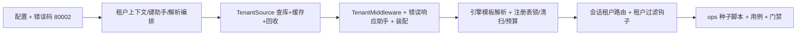

# 多租户数据拓扑落库与实测实施记录

> 后端基座与服务化地基 · 01 后端基座真实实现 · 02 多租户数据拓扑落库与实测 · 实施记录

[文档首页](../../../../../../文档首页.md) › [02 多租户数据拓扑落库与实测](../01_后端基座真实实现_02_多租户数据拓扑落库与实测.md) › 01 实施　|　[详细设计](../设计/01_详细设计_02_多租户数据拓扑落库与实测.md) · [测试记录](../测试/01_测试_02_多租户数据拓扑落库与实测.md)

## 1. 实施信息 <a id="meta"></a>

| 项 | 值 |
| --- | --- |
| 任务 | [02 多租户数据拓扑落库与实测](../01_后端基座真实实现_02_多租户数据拓扑落库与实测.md) |
| 对应需求 | [01-2](../../../../需求/01_需求_后端基座真实实现.md#r01-2) |
| 详细设计 | [01_详细设计_02_多租户数据拓扑落库与实测](../设计/01_详细设计_02_多租户数据拓扑落库与实测.md) |
| 实施日期 | 2026-09-22 |
| 实施人 | minjian |
| 实施环境 | 开发机（Ubuntu，Python 3.14 / uv） |
| 提交 | 249e2ea0（详细设计）+ b29238a3（feat：代码与用例） |
| 结论 | 完成 |

## 2. 实施概览 <a id="overview"></a>



结果小结：多租户由占位填为真实实现——解析链全局中间件（子域名 / `X-Tenant-ID` / token 租户位 + 豁免路径，未知 404 / 80001、停用 403 / 80002 就地拒绝）、平台库 `sys_tenant` 真实取数与缓存基座短 TTL / 失效 / 停用强制回收、租户库 `url_template` 解析、引擎注册表闲置清扫 / 活跃上限 / 跨实例创建锁 / 按活跃引擎数预算、请求级会话按租户库路由、仓储租户过滤钩子与双租户物理隔离实测。`ruff` / `pyright` / 全量 `pytest` 全绿（787 passed / 覆盖率 95%，新增模块 100%）。

## 3. 实施过程 <a id="process"></a>

1. **Kiwi 用例登记**：先登记本任务策展用例并回读编号 **1019**（登记输入与结果落测试仓 `scripts/kiwi/cases/`、`exports/`，台账已回填）。
2. **配置与错误码**：`TenantSettings`（`[tenant]`：缓存 TTL / 活跃上限 / 闲置阈值 / 回落开关 / 豁免路径）、`DatabaseTargetSettings.url_template`；`ErrorCode.TENANT_SUSPENDED = 80002` + `TenantSuspendedError`（403）；`config.toml` / `config.dev.toml`（`[cache] provider = "memory"`）/ `config.prod.toml`（关闭回落）/ `.env.example` 同步。
3. **租户域**：`db/tenant.py` 重构为「上下文 + 键助手 + 解析编排」——`TenantContext` 扩展（主键 / 状态 / 域名）、`tenant_{code}` 派生与反解、`tenant_hostname`（完整主机名匹配 `domain`）、`resolve_request_tenant`（三级链 / 豁免 / 回落与拒绝）、`get_tenant`（读请求态，键缺失就地解析）；`build_tenant_db_key` 迁入并由 `tenant/base.py` re-export。
4. **租户源**：新增 `db/tenant_source.py` 的 `TenantSource`——平台库 `sys_tenant` 查询（软删除过滤）、缓存基座短 TTL（优先异步方法，null 实现直查）、`invalidate`、停用租户 `registry.release` 后 403 / 80002。
5. **全局中间件**：`api/middleware.py` 新增 `TenantMiddleware`（纯 ASGI，链内层，拒绝响应带请求 / 链路 id）；`api/errors.py` 抽出 `build_error_response` 与全局处理器共用；`main.py` 装配 `TenantSource` 与注册表参数（跨实例锁 / 上限 / 阈值），中间件注册次序调整并输出租户连接预算告警。
6. **引擎与注册表**：`EngineFactory` 租户键经 `url_template` 解析（非法键快速失败、空模板回落单库、异步 / 同步同源）；`EngineRegistry` 每次访问闲置清扫、创建窗口「进程内锁 + 分布式锁基座」双锁、锁键改经 `build_lock_key`、`tenant_pool_budget_warnings` 按活跃引擎数核算。
7. **会话与仓储**：`session.py` 请求级会话按请求态租户 `db_key` 选引擎（无租户回落平台库，降级探测随库键）；`BaseScopedRepository` 增 `tenant_scoped` 与租户条件注入（条件次序软删除 → 数据范围 → 租户）。
8. **种子脚本**：新增 `ops/seed_tenant.py`（幂等建 `sys_tenant` 表 + demo/acme 种子，`--url` / `--dry-run`；dev 平台库已执行，重复执行为 0）。
9. **用例**：新增 `tests/db/test_tenant_source.py` / `test_tenant_middleware.py` / `test_tenant_routing.py`；适配 `test_tenant.py` / `test_engine_registry.py` / `test_tenant_ops.py` / `test_config.py` / 集成骨架 / `conftest.py`（用例级临时平台库 + 租户种子 + 缓存清空）；统一标注 Kiwi `1019`。
10. **登记回写**：《后端基类清单》§2 / §6 / §7 / §8；《后端开发规范》「SQL 与数据访问规范」；《架构设计 · 接口与集成》平台已发布码位（80002）；《数据库设计 · sys_tenant》迁移注记；计划与任务 / 父任务状态。

关键命令：

```bash
cd backend
uv run ruff check . && uv run ruff format --check . && uv run pyright
uv run pytest -q --cov=app --cov-branch
uv run python -m ops.seed_tenant
uv run python -m ops.check_modules
python3 scripts/tools/base-check/check-backend-base.py   # 仓库根
python3 scripts/tools/base-check/check-base.py
python3 scripts/tools/base-check/check-links.py
```

## 4. 问题与处置 <a id="issues"></a>

| 问题 / 现象 | 原因 | 处置与落点 |
| --- | --- | --- |
| 全局中间件使直构应用用例查平台库报表不存在 | 测试平台库 `bms_platform.db` 无 `sys_tenant`（迁移归 01_04） | `conftest` 增 autouse 平台库夹具：用例级临时 `bms_platform.db` + demo/acme 种子，经 `BMS_DATABASE__PLATFORM__URL` 注入 |
| 子域名匹配口径 | `_subdomain` 取首段，与注册表 `domain` 存完整主机名不一致 | 改为 `tenant_hostname`（完整主机名匹配 `domain`，去端口、≥三段域名判定） |
| 停用租户用例调用 `registry.get("tenant_sosp")` 前引擎未创建 | 断言顺序 | 用例先取引擎再解析，断言强制回收后不在活跃清单 |
| 租户缓存跨用例残留 | 缓存 Region 为进程级插件单例 | `client` 夹具前后与平台库夹具后清空 `MemoryCacheRegion`；新增异步缓存替身用例覆盖异步方法优先分支 |
| `test_degradation` 探测替身零参 | 会话降级探测改为随库键传参 | 替身签名补 `db_key`（就地适配） |
| 插件清单断言 cache provider | dev 覆盖启用 `memory` 缓存 | 断言按 dev 生效值更新（就地适配） |
| `BaseScopedRepository` 条件注入需模型含列 | 内存基线按 `ScopeCondition` 过滤 | 以类属性 `tenant_scoped` 显式声明（模型含 `tenant_id` 时置 True），上下文无主键不注入 |

## 5. 验证结果 <a id="verify"></a>

| 完成标准 | 验证方法 | 实测结果 |
| --- | --- | --- |
| 三级解析链用例通过（含豁免路径） | 解析编排 + 中间件用例（子域名 / 头 / token 位、豁免、回落与拒绝） | 通过 |
| 引擎懒加载与 LRU 回收用例通过 | 注册表用例（懒加载 / 上限逐出 / 闲置清扫 / 强制回收 / 跨实例锁） | 通过 |
| 跨租户访问拒绝用例通过 | 双租户物理隔离 + 租户过滤钩子 + 停用回收用例 | 通过 |
| 连接预算参数生效 | 按活跃引擎数预算告警用例（超限 WARNING、`max_connections=0` 跳过） | 通过 |
| 平台库 `sys_tenant` 落库与种子正确 | 种子脚本幂等用例 + 租户源真库用例 | 通过（dev 平台库已种子 demo/acme） |
| `pytest` / `ruff` / `pyright` 全绿 | 门禁命令 | `ruff` / `pyright` 全绿；`pytest` 787 passed / 8 skipped，覆盖率 95%（门禁 ≥70%），新增模块 100% |

## 6. 偏差与遗留 <a id="deviations"></a>

- **归 01_03**：`BaseDbRepository` 真实 CRUD 与 scope / 租户条件的 SQL 翻译、软删除 SQL。
- **归 01_04**：Alembic 迁移（`sys_tenant` 入迁移脚本）、SQLite 全量自动建表（本任务种子脚本建表分支届时退化为兼容）。
- **归 01_05**：三库真库集成、CI `verify/db` 档、达梦方言实测与达梦租户库连通。
- **归 06_01**：按服务建库（`bms_{service}_{tenant}`）与「每服务只持自身库引擎」。
- **开放项**：租户库只读副本与副本密码差异；`expire_at` 到期判定（租户管理阶段）；缓存失效跨实例即时联动（可经缓存基座版本键）；子域名生产泛域名与缓存 TTL 调优。
- 消费方前置契约标注见偏差与遗留闭环提交（01_03 / 01_04 / 01_05 / 06_01）。

> 本文档依《文档生成规范》编写
