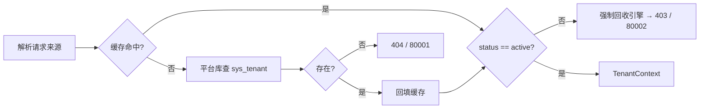
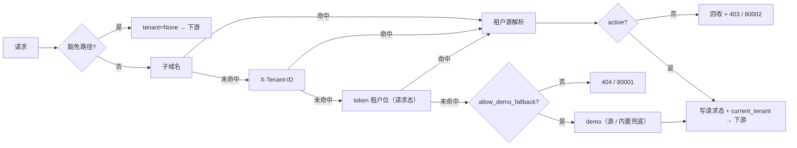

# 多租户数据拓扑落库与实测详细设计

> 后端基座与服务化地基 · 01 后端基座真实实现 · 02 多租户数据拓扑落库与实测 · 详细设计

[文档首页](../../../../../../文档首页.md) › [02 多租户数据拓扑落库与实测](../01_后端基座真实实现_02_多租户数据拓扑落库与实测.md) › 01 详细设计　|　[父任务：后端基座真实实现](../../01_后端基座真实实现.md) · [本阶段需求](../../../../需求/01_需求_后端基座真实实现.md) · [排期计划](../../../../计划/01_计划_后端基座与服务化地基.md)

## 1. 概述 <a id="overview"></a>

- **目标**：把阶段一交付的**多租户占位**填为真实实现——租户解析全局中间件（子域名 / `X-Tenant-ID` / token 三级链 + 豁免路径）、平台库 `sys_tenant` 落库与真实取数（缓存基座短 TTL）、租户库键到连接串的模板解析、引擎注册表懒加载 / LRU / 活跃上限 / 跨实例创建锁、请求级会话按租户路由与查询强制 tenant 过滤钩子，并以双租户真库完成隔离实测。
- **依据**：《架构设计 · 多租户路由》「租户解析链」「引擎注册表与生命周期」「隔离边界」节；《架构设计 · 数据访问与分片》「多数据源管理」「读写分离」「事务边界规则」节；《架构设计 · 后端基础类体系》「各层基类与模块约定」节；《后端基类清单》「数据访问与多租户基座」节；《后端开发规范》「接口开发规范 · 鉴权与权限」「SQL 与数据访问规范」「异步与并发」节；《API 接口规范》「错误码」节；需求 [01-2](../../../../需求/01_需求_后端基座真实实现.md#r01-2)。
- **范围（本任务）**：
  1. 租户解析全局中间件：解析链（子域名 → `X-Tenant-ID` → token 租户位）、豁免路径、未知 / 停用租户拒绝、上下文与请求态注入。
  2. 租户源落库与取数：`sys_tenant` 真实查询（平台库）、缓存基座短 TTL 缓存与失效、停用租户强制回收。
  3. 租户数据拓扑：`url_template` 库键 → 连接串解析、引擎注册表懒加载 / LRU / 闲置回收 / 活跃上限 / 跨实例创建锁、请求级会话按租户路由。
  4. 隔离实测：跨租户访问拒绝（物理库 + 过滤钩子）、查询强制 tenant 过滤钩子（内存基线生效、DB 翻译归 01_03）。
- **不含（明确归口，见第 8 节）**：`BaseDbRepository` 真实 CRUD 与 scope 条件 SQL 翻译（01_03）；Alembic 在线迁移与 SQLite 全量自动建表（01_04）；三库真库集成、CI `verify/db` 档、达梦方言实测与达梦租户库连通（01_05）；按服务建库与「每服务只持自身库引擎」（06_01）；租户开通 / 停用完整流程、配额与到期判定（租户管理阶段）；token 签发与认证编解码（认证阶段）；数据范围 RBAC 规则注入（RBAC 阶段）。

## 2. 现状与差距 <a id="gap"></a>

| 关注点 | 现状（01_01 及阶段一交付） | 差距（本任务目标） |
| --- | --- | --- |
| 租户解析链 | `db/tenant.py` 仅占位：内置 `demo` 命中、无来源回落 demo、无 token 位、不查库、不设上下文 | 全局中间件 + 三级链 + 查库（`sys_tenant`）；dev/test 回落、prod 拒绝；token 位读认证写入的请求态 |
| 租户上下文 | `TenantContext` 仅 `tenant_code` / `db_key` / `name`；`current_tenant` 上下文全仓无人设置 | 扩展 `tenant_id` / `status` / `domain`；中间件设置与复位上下文 |
| 平台库表 | `SysTenant` 模型已声明（`models/platform.py`）；平台库无建表与种子，解析无法真实取数 | `ops/seed_tenant.py` 幂等建表 + demo/acme 种子；租户源真实查询 |
| 租户源缓存 | 不存在 | 缓存基座（`CacheRegion`）短 TTL + 失效（`invalidate`） |
| 停用租户 | 无状态判定、无回收 | `status != active` → 403 / `80002` + 引擎强制回收（`registry.release`） |
| 租户库键解析 | `EngineFactory._target` 把非平台 / 归档键一律映射到 `database.tenants.url` 单库 | `url_template`（`{service}` / `{tenant}` / `{database}`）解析租户库连接串；空模板回落单库兼容 |
| 引擎注册表 | 懒加载 / LRU / 上限 / `release` 已具备；闲置回收只在创建窗口触发；跨实例锁仅 `redis_lock_key` 占位；参数为代码常量 | 每次访问清扫闲置 + 创建窗口 LRU；跨实例锁经分布式锁基座叠加；上限 / 阈值 / TTL 配置化；按活跃引擎数预算告警 |
| 请求级会话 | `get_db` / `get_read_db` / `get_write_db` / `get_uow` 固定 `platform` 库键 | 按请求态租户 `db_key` 选引擎（无租户回落平台库）；写路径降级探测随解析库键 |
| 查询租户过滤 | `BaseScopedRepository` 仅软删除 + 数据范围条件 | `tenant_scoped` + 上下文 `tenant_id` 强制条件注入（内存基线生效；DB WHERE 归 01_03） |
| 错误码 | `80001` 租户不存在（404） | 新增 `80002` 租户停用（403）并登记平台码位 |
| 测试 | `test_tenant` / `test_engine_registry` / 集成骨架多为占位断言；`conftest` 平台库无 `sys_tenant` | 就地适配真实语义；`client` 夹具用临时平台库 + 种子，保证全局中间件下全量用例可用 |

## 3. 交付物清单 <a id="tree"></a>

```text
backend/
├── config.toml                                      # 修改：新增 [tenant] 分区、[database.tenants] url_template 注释
├── config.dev.toml                                  # 修改：启用进程内缓存（[cache] provider = "memory"）
├── config.prod.toml                                 # 修改：[tenant] allow_demo_fallback = false
├── .env.example                                     # 修改：BMS_TENANT__* 与 BMS_DATABASE__TENANTS__URL_TEMPLATE 模板
├── app/
│   ├── core/
│   │   ├── config.py                                # 修改：TenantSettings、DatabaseTargetSettings.url_template
│   │   ├── error_codes.py                           # 修改：TENANT_SUSPENDED = 80002
│   │   └── exceptions.py                            # 修改：TenantSuspendedError（OpenTenantError，403）
│   ├── db/
│   │   ├── tenant.py                                # 修改：上下文扩展、租户库键助手、解析链编排（去占位查表）
│   │   ├── tenant_source.py                         # 新增：TenantSource（平台库查询 + CacheRegion 缓存 + 失效 + 停用回收）
│   │   ├── engine.py                                # 修改：租户库 url_template 解析（异步 / 同步引擎同源）
│   │   ├── registry.py                              # 修改：访问清扫闲置、跨实例锁叠加、配置参数、按活跃引擎数预算告警
│   │   └── session.py                               # 修改：请求级会话按租户 db_key 选引擎
│   ├── api/
│   │   ├── middleware.py                            # 修改：新增 TenantMiddleware（纯 ASGI）
│   │   ├── errors.py                                # 修改：抽出 build_error_response（中间件复用统一错误响应）
│   │   └── deps.py                                  # 修改：导出 get_tenant_source（随公共依赖汇总）
│   ├── repositories/
│   │   └── base_scoped_repository.py                # 修改：tenant_scoped + 上下文租户条件注入
│   ├── tenant/base.py                               # 修改：build_tenant_db_key 改由 db 层提供（re-export 公共契约不变）
│   └── main.py                                      # 修改：装配 TenantSource、注册中间件、注册表参数与预算告警
├── ops/
│   └── seed_tenant.py                               # 新增：平台库 sys_tenant 幂等建表 + demo/acme 种子
└── tests/
    ├── conftest.py                                  # 修改：client 夹具改临时平台库 + 租户种子
    ├── core/test_config.py                          # 修改：[tenant] 键、url_template 解析
    ├── db/test_tenant.py                            # 修改：上下文扩展 / 键助手 / 豁免 / 解析链编排
    ├── db/test_tenant_source.py                     # 新增：真库查询 + 缓存命中与失效 + 未知 / 停用 + 强制回收
    ├── db/test_tenant_middleware.py                 # 新增：链优先级 / 回落与拒绝 / 豁免 / 响应码 / 上下文复位
    ├── db/test_tenant_routing.py                    # 新增：模板解析、会话按租户选引擎、跨租户物理隔离、过滤钩子
    ├── db/test_engine_registry.py                   # 修改：锁键格式、跨实例锁、闲置清扫、配置参数
    ├── ops/test_tenant_ops.py                       # 修改：seed_tenant 幂等与 dry-run
    └── integration/test_tenant_routing_integration.py  # 修改：真实双租户隔离断言；三库用例保留 env 守卫

bms文档/
├── 后端基类清单.md                                   # 修改：数据访问与多租户基座节状态回写
├── 规范/后端开发规范.md                              # 修改：租户隔离与引擎创建双锁口径补充
├── 设计/架构设计/09_架构设计_接口与集成.md            # 修改：平台已发布码位补 80002
└── 设计/数据库设计/数据表设计/sys_tenant.md           # 修改：迁移 / 落库方式注记（种子先行、迁移归 01_04）
```

## 4. 领域设计 <a id="design"></a>

### 4.1 配置扩展 <a id="config"></a>

`app/core/config.py` 增量（均向后兼容、有默认值）：

| 字段 | 位置 | 默认 | 说明 |
| --- | --- | --- | --- |
| `resolve_cache_ttl` | `TenantSettings`（新增 `[tenant]`） | `60` | 租户解析缓存 TTL（秒；经缓存基座写入） |
| `engine_max_active` | `TenantSettings` | `32` | 租户引擎活跃上限（LRU 逐出阈值） |
| `engine_idle_timeout` | `TenantSettings` | `1800.0` | 租户引擎闲置回收阈值（秒） |
| `allow_demo_fallback` | `TenantSettings` | `True` | 无来源是否回落演示租户（prod 置 `false`） |
| `exempt_paths` | `TenantSettings` | `["/", "/docs", "/redoc", "/openapi.json", "/healthz", "/readyz"]` | 租户解析豁免路径（**精确匹配**，非前缀） |
| `url_template` | `DatabaseTargetSettings` | `""` | 租户库连接串模板，含 `{service}` / `{tenant}` / `{database}` 占位；空串回落 `url` |

- 环境变量键：`BMS_TENANT__RESOLVE_CACHE_TTL`、`BMS_TENANT__ENGINE_MAX_ACTIVE`、`BMS_TENANT__ENGINE_IDLE_TIMEOUT`、`BMS_TENANT__ALLOW_DEMO_FALLBACK`、`BMS_TENANT__EXEMPT_PATHS`、`BMS_DATABASE__TENANTS__URL_TEMPLATE`。
- `config.toml` 新增 `[tenant]` 分区（写默认值）与 `[database.tenants].url_template = ""`；`config.prod.toml` 增 `[tenant] allow_demo_fallback = false`；`config.dev.toml` 增 `[cache] provider = "memory"`（dev 进程内缓存生效，字典域用独立分区不受影响）。
- 模板示例（注释形式写入 `config.toml`）：`sqlite+aiosqlite:///./bms_tenant_{tenant}.db`、`mysql+aiomysql://bms_dev@<host>:3306/{database}`（`{database}` = `bms_{service}_{tenant}`）。

### 4.2 错误码与异常 <a id="error"></a>

- `ErrorCode.TENANT_SUSPENDED = 80002`（8xxxx 开放 / 租户段；与租户管理模块规划子段 `820xx` 不冲突）。
- `TenantSuspendedError(OpenTenantError)` → `http_status=403`（业务码 80002，前端按 `error.80002` 映射文案）。
- 登记：`core/error_codes.py` 单一登记 +《架构设计 · 接口与集成》「平台已发布码位」行补 `80002`。

### 4.3 租户上下文与数据源键助手 <a id="tenant-domain"></a>

`app/db/tenant.py` 重构（去掉占位 `_lookup`，职责收敛为「上下文 + 键 + 解析链编排」）：

| 成员 | 说明 |
| --- | --- |
| `TENANT_DB_KEY_PREFIX = "tenant_"` | 数据源键前缀（库键 `tenant_{code}`） |
| `build_tenant_db_key(code) -> str` | 由编码派生库键（自 `tenant/base.py` 迁入；`tenant/base.py` re-export，公共契约与调用面不变） |
| `parse_tenant_db_key(db_key) -> str` | 库键反解编码；前缀不符 / 空编码抛 `ConfigError` |
| `TenantContext`（dataclass） | `tenant_code` / `db_key` / `name` / `tenant_id: int \| None` / `status: str` / `domain: str \| None` |
| `DEMO_TENANT` | 内置演示租户兜底（`tenant_id=None`，仅在租户源不可用的兜底路径使用） |
| `tenant_subdomain(host) -> str \| None` | 从 Host 头取子域名（`{tenant}.` 前缀判定，≥ 三段域名） |
| `is_exempt_path(path, exempt_paths) -> bool` | 豁免路径判定（路径集来自 `[tenant].exempt_paths`） |
| `current_tenant_context() -> TenantContext` | 上下文租户；未设置 / 未知回落 `DEMO_TENANT`（既有语义保留） |
| `resolve_tenant_context(...)`（异步） | 解析链编排：子域名（按 `domain` 查）→ `X-Tenant-ID`（按 `code` 查）→ token 租户位（按 `code` 查）；无来源按回落策略处理；豁免返回 None |

- **禁止全局单例持有租户引擎**：上下文只携带库键，引擎一律经 `EngineRegistry` 按库键取用。
- token 租户位读取请求态（`scope["state"]["tenant_id"]`），**认证阶段写入即自然生效**，本任务不解码 JWT。

### 4.4 租户源：真实取数、缓存与停用回收 <a id="tenant-source"></a>

`app/db/tenant_source.py` 新增 `TenantSource(BaseObject)`：

| 成员 | 说明 |
| --- | --- |
| `__init__(registry, *, cache=None, session_factory=None, cache_ttl=60)` | 依赖引擎注册表（平台库引擎）、缓存基座（可为 null 实现）、会话工厂（缺省 `SessionFactory()`） |
| `async by_code(code) -> TenantContext` | 按编码取租户（缓存 → 平台库查询 → 回填） |
| `async by_domain(domain) -> TenantContext` | 按子域名取租户（同上） |
| `async invalidate(code=None, *, domain=None) -> None` | 失效缓存（开通 / 停用 / 改名后调用；租户管理阶段接入） |
| `_cache_key(kind, value) -> str` | `build_cache_key(tenant=None, domain=TENANT_CACHE_DOMAIN, business_key=...)`，缓存域常量 `TENANT_CACHE_DOMAIN = "tenant"` |
| `async _load(*conditions) -> SysTenant \| None` | 平台库查询：`select(SysTenant).where(..., SysTenant.deleted_at.is_(None))` |

- **缓存口径**：命中即用；未命中 / 缓存不可用直查平台库（null 实现不阻断）；缓存值为普通 `dict`（跨缓存实现可序列化），TTL 取 `[tenant].resolve_cache_ttl`；缓存**含 status**，命中后同样执行状态判定。缓存读写优先用异步方法（`aget` / `aset`，Redis 实现具备；无异步方法时回落同步契约方法）。
- **未知租户**：查询未命中 → `TenantNotFoundError`（404 / 80001）。
- **停用租户**：`status != "active"` → `await registry.release(db_key)`（强制回收该租户引擎）后抛 `TenantSuspendedError`（403 / 80002）。
- 会话生命周期：`async with session_factory.create(platform_engine)()`，退出释放；查询表为平台库常驻表，**不缓存连接**。



### 4.5 解析链与全局中间件 <a id="middleware"></a>

`app/api/middleware.py` 新增 `TenantMiddleware(BaseObject)`（纯 ASGI，形态与 `TraceIdMiddleware` / `ReadOnlyMiddleware` 一致）：

- 非 HTTP 作用域直通。
- 取 `scope["app"].state.tenant_source` 与 `settings`；**豁免路径**：写请求态 `tenant=None` 后直通（解析链不执行、上下文不设置）。
- 来源次序（首个命中即止）：`tenant_subdomain(Host)` → `X-Tenant-ID` → 请求态 token 租户位（`scope["state"]["tenant_id"]`）。
- 命中 → `resolve_tenant_context` 解析（含未知 / 停用判定）；成功写 `scope["state"]["tenant"] = ctx` 并 `set_current_tenant(ctx.tenant_code)`，`finally` 复位。
- **拒绝就地响应**：中间件捕获 `BizError` 用 `build_error_response(scope, exc)` 直接返回统一响应（不调用下游），HTTP 状态与业务码沿用全局口径（404 / 80001、403 / 80002）。
- **无来源**：`allow_demo_fallback=True`（dev/test）→ 经租户源按 `demo` 取（源不可用回落内置 `DEMO_TENANT`）；`False`（prod）→ `TenantNotFoundError`。
- **中间件顺序**：`TenantMiddleware` 最先注册（栈内层，位于 `TraceIdMiddleware` 之内），使拒绝响应仍带请求 id 与链路 id（`RequestLoggingMiddleware` / `TraceIdMiddleware` 上下文已就绪）。

`app/api/errors.py`：抽出 `build_error_response(scope, exc: BizError) -> JSONResponse`（`ApiResponse` + `exc.http_status` + `X-Request-Id` / `X-Trace-Id` 头），全局异常处理器与租户中间件共用，保证两处错误响应同源。

`get_tenant` 依赖：优先读请求态 `"tenant"` 键（含豁免的 None）；键缺失（未经中间件的场景）时按同样编排就地解析（无租户源时回落内置演示租户），保持既有路由（`/api/v1/tenants`）调用面不变。



### 4.6 引擎注册表与工厂：租户库解析与生命周期 <a id="engine"></a>

`app/db/engine.py`：

- `EngineFactory` 解析连接串时对租户键走模板：`db_key` 以 `tenant_` 开头且目标配置 `url_template` 非空 → 格式化 `{service}`（`[app].service`）、`{tenant}`（`parse_tenant_db_key`）、`{database}`（`bms_{service}_{tenant}`）；空模板回落 `target.url`（单库兼容，既有 SQLite 开发方式不变）。
- 异步 `create` 与同步 `create_sync` **同源解析**（达梦连通性探测随 01_05 覆盖租户库）。
- 只读 / 副本：租户键沿用目标 `replicas` 列表（未配置即回落主库）；租户库副本差异密码不扩展（开放项）。

`app/db/registry.py`：

| 成员 | 说明 |
| --- | --- |
| `__init__(factory, *, max_active=32, idle_timeout=1800.0, lock=None)` | 新增 `lock: BaseDistributedLock \| None`（跨实例锁；None 表示仅进程内锁） |
| `get(db_key, *, read_only=False)` | 每次访问**先清扫闲置**（`_sweep_idle`）；创建窗口「进程内锁 + 跨实例锁」双重互斥；创建前按活跃上限 LRU 逐出最久未用租户引擎 |
| `redis_lock_key(db_key)` | 改为 `build_lock_key(tenant=None, resource=f"engine:{db_key}")`（`bms:global:lock:engine:{db_key}`，与锁基座 key 规范一致） |
| `tenant_pool_budget_warnings(settings, max_active)` | 新增：按活跃引擎数核算共享租户库连接预算 `max_active × workers × (pool_size + max_overflow) ≤ tenants.max_connections × 70%`，超限 WARNING 不阻断（`max_connections == 0` 跳过） |
| `release` / `aclose` / `active_keys` / `check_connection_budget` | 保持不变（平台库键不参与强制回收） |

- 跨实例锁经分布式锁能力域（`distributed_lock` 分区，缺省 `null` 实现不连 Redis；Redis 可用时切真实实现），创建窗口 `hold(redis_lock_key(db_key), ttl=..., wait=0)`；未取到抛 `ConcurrentConflictError`（10004 / 409），不重复建引擎。
- 「活跃引擎上限」在创建窗口强制，「闲置回收」每次访问清扫，二者共同保证「避免全量租户连接常驻」。
- `main.py` 装配：`EngineRegistry(engine_factory, max_active=settings.tenant.engine_max_active, idle_timeout=settings.tenant.engine_idle_timeout, lock=resolve_plugin("distributed_lock", settings.distributed_lock.provider, expected_version=...))`；启动期并行输出 `pool_budget_warnings` 与 `tenant_pool_budget_warnings`。

### 4.7 请求级会话租户路由 <a id="session"></a>

`app/db/session.py`：

- `_resolve_db_key(request) -> str`：请求态 `tenant` 上下文存在 → `ctx.db_key`；否则回落 `PLATFORM_DB_KEY`（未过租户中间件的单测 / 平台侧调用口径不变）。
- `get_db` / `get_read_db` / `get_write_db` / `get_uow` 全部改用该库键取引擎；写路径降级探测（`PrimaryHealth`）随解析库键判定（`is_degraded(db_key)` / `probe(db_key)`）。
- 每请求独立会话、退出释放的既有纪律不变；会话禁止跨请求共享。

### 4.8 查询强制 tenant 过滤钩子 <a id="filter"></a>

`app/repositories/base_scoped_repository.py`：

- 新增类属性 `tenant_scoped: bool = False`（模型含 `tenant_id` 列时由具体仓储置 `True`——同库多租户 / 平台侧租户维度表场景）。
- `_scope_conditions()` 条件次序：软删除 → 数据范围 → **租户**；租户条件在 `tenant_scoped` 且上下文租户有 `tenant_id` 时注入 `ScopeCondition("tenant_id", "eq", tenant_id)`，内存基线经 `_matches_scope` 即生效。
- DB 侧 WHERE 翻译（含租户条件）归 01_03 的 `BaseDbRepository` 统一落地——本任务交付**条件注入点**与真库验证，不实现 CRUD。
- 语义：租户库物理隔离为第一层，tenant 条件为第二层兜底（同库多租户 / 平台侧租户表），与《架构设计 · 多租户路由》「隔离边界」一致。

### 4.9 `sys_tenant` 落库与幂等种子 <a id="seed"></a>

`ops/seed_tenant.py`（形态对齐 `ops/seed_dict.py`）：

- URL 解析：`--url` 参数 > `BMS_MIGRATION_URL` 环境变量 > 配置 `database.platform.url`。
- 执行：`SysTenant.__table__.create(engine, checkfirst=True)` 建表（幂等）→ 按 `code` + `deleted_at is null` 判存插入种子（`demo` / `acme`，`db_key = tenant_{code}`，`domain = {code}.bms.example.com`，`status = active`）。
- 输出 `[seed_tenant] 新增 N 行（幂等；重复执行输出 0）`；`--dry-run` 仅打印将执行的库与种子清单。
- 与本任务解析实测衔接：dev 运行一次即可经中间件取到两租户；**Alembic 迁移与 SQLite 全量自动建表归 01_04**（迁移落地后本脚本退化为种子脚本，建表分支兼容保留）。

### 4.10 装配接线 <a id="assembly"></a>

- `main.py`：`TenantSource(engine_registry, cache=resolve_plugin("cache", settings.cache.provider, expected_version=...), session_factory=session_factory, cache_ttl=settings.tenant.resolve_cache_ttl)` → `app.state.tenant_source`。
- 中间件注册次序调整为：`TenantMiddleware`（最先）→ `TraceIdMiddleware` → `RequestLoggingMiddleware` → `ReadOnlyMiddleware`（栈内层 → 外层：ReadOnly → RequestLogging → TraceId → Tenant → 路由）。
- `api/deps.py`：新增 `get_tenant_source(request) -> TenantSource` 并纳入 `__all__`（后续租户管理阶段写路径失效缓存取用）。
- `tenant/base.py`：`build_tenant_db_key` 改为自 `db/tenant.py` 导入（re-export），公共契约名与 `__all__` 不变。

## 5. 失败分支与边界 <a id="failures"></a>

| 场景 | 处理 |
| --- | --- |
| 来源命中但未知租户 | 中间件就地 404 / 80001，不进入下游 |
| 来源命中但租户停用 | 强制回收该租户引擎 → 403 / 80002 |
| 无来源（dev/test） | 回落 `demo`（经租户源取真实主键；源不可用回落内置演示租户） |
| 无来源（prod，`allow_demo_fallback=false`） | 404 / 80001 |
| 豁免路径 | 不解析、`tenant=None`；会话路由回落平台库 |
| 平台库不可用 | 租户源查询异常上抛 → 连接类错误经全局处理器转 10006 / 503；缓存命中时不受影响 |
| 缓存实现为 null | 直查平台库（不阻断、不报错） |
| 租户库键非法（非 `tenant_` 前缀 / 空编码） | `ConfigError` 快速失败（取库期） |
| 未配置 `url_template` | 回落 `database.tenants.url` 单库（开发 SQLite 兼容；隔离实测需配模板） |
| 跨实例锁未取到 | `ConcurrentConflictError`（10004 / 409）；null 实现不触发 |
| 活跃引擎达上限 | LRU 逐出最久未用租户引擎后再建；平台引擎不逐出 |
| 闲置超阈值 | 每次访问先清扫（`_sweep_idle`）后再取用 |
| 模型无 `tenant_id` 列 | `tenant_scoped=False` 不注入，物理库隔离为主 |
| 上下文租户无 `tenant_id`（内置兜底路径） | 不注入租户条件（仅引擎隔离；正常路径经种子 / 平台库均有主键） |
| 租户列表页 / 平台侧接口 | 走各自台账库键（平台库），不受租户路由影响 |

## 6. 测试设计与验收映射 <a id="tests"></a>

用例先登记 Kiwi TCMS（本任务登记 **1 条用例**，多条断言共用同一 `kiwi_id`，编号以平台回读为准，见第 9 节实施步骤）。

| Kiwi | 用例 | 类型 | 断言要点 |
| --- | --- | --- | --- |
| TBD | 租户上下文与解析编排 | 单元 | 键助手往返 / 非法键报错；子域名 → 头 → token 优先级；豁免判定 |
| TBD | 租户源取数 | 单元 | 真库按 code / domain 命中；未知 404 / 80001；缓存命中减少查询；`invalidate` 后重查 |
| TBD | 停用租户回收 | 单元 | `suspended` → 403 / 80002 且该租户引擎被强制回收 |
| TBD | 租户中间件 | 单元 | 链优先级 / 无来源 dev 回落、prod 拒绝 / 未知与停用响应 / 豁免放行 / 上下文复位 / 非 HTTP 直通 |
| TBD | 租户库模板解析 | 单元 | `url_template` 格式化（service / tenant / database）；空模板回落单库；非法键 `ConfigError` |
| TBD | 会话按租户路由 | 单元 | `get_db` / `get_read_db` / `get_write_db` / `get_uow` 取租户库引擎；无租户回落平台库 |
| TBD | 跨租户物理隔离 | 单元 | 租户 A 双库各自成表：写 A 读 B 为空、引擎实例分离 |
| TBD | 租户过滤钩子 | 单元 | 条件次序（软删除 → 数据范围 → 租户）；上下文缺失 / `tenant_scoped=False` 不注入 |
| TBD | 引擎注册表生命周期 | 单元 | 闲置清扫回收、上限 LRU 逐出、平台常驻、强制回收、跨实例锁调用、锁键规范 |
| TBD | 连接预算（活跃数） | 单元 | 超限 WARNING；`max_connections=0` 跳过 |
| TBD | 种子脚本 | 单元 | 幂等建表 + demo/acme 插入；重复执行为 0；dry-run 输出 |
| TBD | 配置键 | 单元 | `[tenant]` 默认与覆盖、`url_template` 解析 |
| TBD | 双租户路由集成 | 集成 | 临时平台库 + 双租户库真实隔离；三库用例 env 守卫（真库归 01_05） |

验收映射：

| 完成标准 | 验证方式 |
| --- | --- |
| 三级解析链用例通过（含豁免路径） | 解析编排 + 中间件用例（子域名 / 头 / token 位；豁免放行） |
| 引擎懒加载与 LRU 回收用例通过 | 注册表生命周期用例（懒加载 / 上限逐出 / 闲置清扫 / 强制回收） |
| 跨租户访问拒绝用例通过 | 双租户物理隔离 + 过滤钩子用例 |
| 连接预算参数生效 | 活跃引擎数预算告警用例 |
| 平台库 `sys_tenant` 落库与种子正确 | 种子脚本 + 租户源真库用例 |
| `pytest` / `ruff` / `pyright` 全绿 | 门禁命令（含覆盖率：新增模块 100%） |

## 7. 登记落点 <a id="registry-writeback"></a>

| 落点 | 内容 |
| --- | --- |
| 《后端基类清单》「数据访问与多租户基座」节 | `TenantContext` / `TenantSource` / `TenantMiddleware` / 解析链（真实取数）、`EngineFactory`（`url_template`）、`EngineRegistry`（跨实例锁 / 闲置清扫 / 配置参数）、会话按租户路由、租户过滤钩子状态回写 |
| 《后端开发规范》「接口开发规范 · 鉴权与权限」「SQL 与数据访问规范」「异步与并发」节 | 租户解析链与隔离口径、租户库路由与过滤钩子、引擎创建双锁（进程内 + 跨实例） |
| 《架构设计 · 接口与集成》「平台已发布码位」 | 补 `80002` 租户停用（403） |
| 《数据库设计 · 数据表设计》`sys_tenant.md` | 迁移 / 落库方式注记（种子先行、迁移归 01_04） |
| 计划 | §3 父任务偏差与遗留（01_02 行）；后续阶段待办（租户管理阶段接入缓存失效写路径） |
| 任务 / 父任务 | 状态两处一致（需求文档不承载进度） |

## 8. 边界与开放项 <a id="boundary"></a>

- 归 01_03：`BaseDbRepository` 真实 CRUD、scope / 租户条件的 SQL 翻译与软删除 SQL。
- 归 01_04：Alembic 迁移（`sys_tenant` 等平台表入迁移脚本）、SQLite 全量自动建表、`ops` 批量迁移。
- 归 01_05：三库真库集成、CI `verify/db` 档、达梦方言实测与达梦租户库连通（同步引擎路径）。
- 归 06_01：按服务建库（`bms_{service}_{tenant}`）、「每服务只持自身库引擎」与跨服务库访问拒绝。
- 租户管理阶段：开通 / 停用完整流程与配额、`expire_at` 到期判定、缓存失效写路径联动（可在缓存基座上加版本键实现跨实例即时失效）。
- 认证阶段：token `tenant_id` 写入请求态、切换租户与令牌换发（解析链第三级自动生效）。
- 开放项：租户库只读副本与副本密码差异；租户库 URL 模板的三库 / 达梦真实格式实测（01_05）；子域名解析的生产泛域名与缓存 TTL 取值调优。

> **契约变更（06_01 回写，2026-09-23）**：本任务第 4.3 / 4.6 节的**库键契约按需求 06-1 做了服务化扩展**——库键形态由单一 `tenant_{code}` 扩为「相对键（`platform` / `tenant_{code}`，缺省补当前服务）＋ 全限定键（`platform_{service}` / `tenant_{service}_{code}`，显式跨服务）」，库名（`bms_{service}_{tenant}`）与键派生 / 反解 / 归属校验收归 `bms_core/db/keys.py` 单一来源；`url_template` 由「仅租户目标」扩为**平台与租户目标同构**（平台占位 `{service}` / `{database}` = `bms_{service}`）。本节其余口径（解析链、引擎注册表生命周期、会话按租户路由、过滤钩子、`80001` / `80002`）**不变**——租户上下文仍携带相对键，随运行服务解析，故调用面无改动。另：本任务第 4.9 节种子写入的 `sys_tenant.db_key` 列**已废弃**（06_01 起不再写入，列改可空，库键一律由编码派生）。

## 9. 实施步骤 <a id="steps"></a>


1. 读《KiwiTCMS部署使用说明》「用例约定」节，登记本任务用例并**回读编号**（输入文件落测试仓 `scripts/kiwi/cases/`）。
2. 配置扩展（`TenantSettings`、`url_template`）+ 错误码 / 异常（`80002`）。
3. `db/tenant.py` 重构（上下文、键助手、编排）+ `tenant/base.py` re-export；`db/tenant_source.py` 新增。
4. `TenantMiddleware` + `build_error_response` 助手 + `main.py` 装配（TenantSource / 中间件次序 / 注册表参数 / 预算告警）。
5. `EngineFactory` 模板解析 + `EngineRegistry` 跨实例锁、闲置清扫、配置参数、活跃数预算。
6. `session.py` 租户路由 + `BaseScopedRepository` 租户条件注入。
7. `ops/seed_tenant.py` 幂等种子；dev 平台库实测准备。
8. 用例：`conftest` 夹具改造 + 既有用例适配 + 新增用例（`@pytest.mark.kiwi_id`）；`uv run pytest` / `ruff` / `pyright` 全绿、新增模块覆盖率 100%。
9. 登记回写 + 实施 / 测试记录 + 代码与文档分开提交（`feat` / `docs`）；偏差与遗留闭环另提。

关键命令：

```bash
cd backend
uv run ruff check . && uv run ruff format --check . && uv run pyright
uv run pytest -q --cov=app --cov-branch
uv run python -m ops.seed_tenant
uv run python -m ops.check_modules
python3 scripts/tools/base-check/check-backend-base.py   # 仓库根
```

## 10. 决策记录（对齐记录） <a id="align"></a>

| # | 事项 | 结论（逐项确认） |
| --- | --- | --- |
| 1 | 解析中间件形态 | 全局纯 ASGI `TenantMiddleware`；未知租户在中间件就地转统一错误响应；`get_tenant` 依赖保留读请求态 |
| 2 | 租户源与缓存 | 查平台库 `sys_tenant` + **缓存基座 `CacheRegion`**（短 TTL、含失效）；null 缓存实现下直查不阻断 |
| 3 | 无来源回落 | dev/test 回落 demo（`allow_demo_fallback=true`）；prod 拒绝（404 / 80001，`config.prod.toml` 关闭） |
| 4 | token 租户来源 | 预留认证写入的请求态钩子（`scope["state"]["tenant_id"]`）；本任务不解码 JWT |
| 5 | 租户库连接解析 | `DatabaseTargetSettings.url_template`（`{service}` / `{tenant}` / `{database}`）；空模板回落单库 |
| 6 | `sys_tenant` 落库 | `ops/seed_tenant.py` 幂等建表 + demo/acme 种子；Alembic 与 SQLite 全量自动建表归 01_04 |
| 7 | 配置落点 | 新增 `[tenant]` 分区（缓存 TTL / 活跃上限 / 闲置阈值 / 豁免路径 / 回落开关） |
| 8 | 跨实例创建锁 | 进程内锁 + 分布式锁基座 `hold(redis_lock_key)` 叠加；缺省 null 实现自然降级 |
| 9 | 租户过滤落点 | 仓储基类交付条件注入钩子 + 真库实测；DB WHERE 翻译归 01_03 |
| 10 | 停用租户口径 | 新增 `80002` 拒绝（403）+ `registry.release` 强制回收该租户引擎 |
| 11 | 会话层租户路由 | 接通：`get_db` / `get_read_db` / `get_write_db` / `get_uow` 按上下文租户 `db_key` 取引擎 |
| 12 | 既有测试处置 | 就地适配真实语义（旧编号保留、新用例取新编号） |
| 13 | 代码结构 | 拆分 `db/tenant.py`（上下文 / 解析编排）+ `db/tenant_source.py`（查库 / 缓存 / 回收） |
| 14 | Kiwi 用例粒度 | 登记 1 条用例覆盖全部断言（与 01_01 及平台「一任务一条」口径一致） |

## 11. 参考文档 <a id="ref"></a>

- [架构设计 · 多租户路由](../../../../../../设计/架构设计/12_架构设计_子系统_多租户路由.md)「租户解析链」「引擎注册表与生命周期」「隔离边界」「三库命名与建库标准」节
- [架构设计 · 数据访问与分片](../../../../../../设计/架构设计/13_架构设计_子系统_数据访问与分片.md)「多数据源管理」「读写分离」「事务边界规则」节
- [架构设计 · 后端基础类体系](../../../../../../设计/架构设计/04_架构设计_后端基础类体系.md)「各层基类与模块约定」「阶段交付与跨阶段基座契约」节
- [架构设计 · 接口与集成](../../../../../../设计/架构设计/09_架构设计_接口与集成.md)「错误码分段」节
- [后端基类清单](../../../../../../后端基类清单.md)「数据访问与多租户基座」节
- [后端开发规范](../../../../../../规范/后端开发规范.md)「SQL 与数据访问规范」「异步与并发」节
- [测试规范](../../../../../../规范/测试规范.md)、[KiwiTCMS 部署使用说明](../../../../../../资料/开发服务器/linux/KiwiTCMS部署使用说明.md)「用例约定」节
- [数据库设计 · sys_tenant](../../../../../../设计/数据库设计/数据表设计/sys_tenant.md)
- [01_01 数据访问底座落库详细设计](../../01_后端基座真实实现_01_数据访问底座落库/设计/01_详细设计_01_数据访问底座落库.md)
- [需求 01-2：多租户数据拓扑落库与实测](../../../../需求/01_需求_后端基座真实实现.md#r01-2)

> 本文档依《[文档生成规范](../../../../../../规范/文档生成规范.md)》编写 · 关键决策逐项确认
