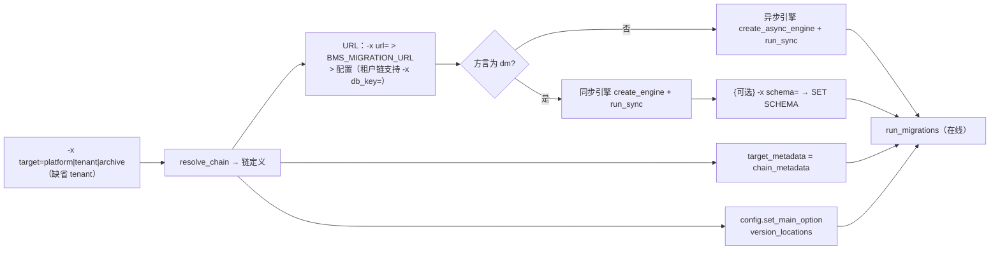
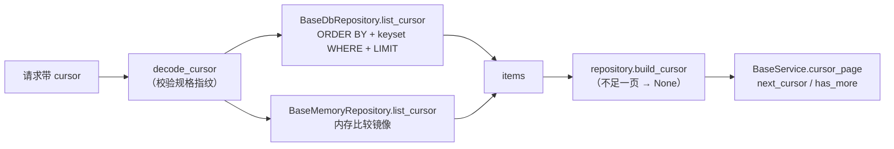

# Alembic 迁移与排序 DB 侧详细设计

> 后端基座与服务化地基 · 01 后端基座真实实现 · 04 Alembic 迁移与排序 DB 侧 · 详细设计

[文档首页](../../../../../../文档首页.md) › [04 Alembic 迁移与排序 DB 侧](../01_后端基座真实实现_04_Alembic 迁移与排序 DB 侧.md) › 01 详细设计　|　[父任务：后端基座真实实现](../../01_后端基座真实实现.md) · [本阶段需求](../../../../需求/01_需求_后端基座真实实现.md) · [排期计划](../../../../计划/01_计划_后端基座与服务化地基.md)

## 1. 概述 <a id="overview"></a>

- **目标**：把阶段一交付的**迁移与排序占位**填为真实实现——Alembic 按**数据源分链**（平台库 / 租户库 / 归档库）维护方言无关迁移脚本并接通在线分支（四库含达梦同步驱动）、补齐平台库三表迁移与开发 SQLite 自动建表、`ops` 批量迁移与新租户初始化（含库级建删能力）真实落地、排序契约 DB 侧细化（四库 NULLS 对齐、排序字段索引配合、分页限深 100 页、keyset 游标键），并在 mjbk 常驻三库完成「建库 → 迁移 → 校验 → 清理」演练。
- **依据**：《架构设计 · 数据架构》「迁移策略」节；《架构设计 · 数据访问与分片》「多数据源管理」「查询规范」节；《数据库设计 · 总览》「数据分布总览」「通用数据规范」节；《后端基类清单》「模块基类（数据访问 / 服务 / 契约 / 模型）」「数据访问与多租户基座」节；《后端开发规范》「SQL 与数据访问规范」「异步与并发」节；《数据库开发规范》「迁移规范（Alembic）」节；《部署发布规范》「发布流程」节；需求 [01-4](../../../../需求/01_需求_后端基座真实实现.md#r01-4)。
- **范围（本任务）**：
  1. **迁移链注册与目录布局**：`app/db/migration.py` 登记「数据源 → 版本目录 + 表集 + 分支标签 + URL 取法」，版本脚本按 `alembic/versions/{platform,tenant,archive}/` 分链组织。
  2. **Alembic 环境重构**：`alembic/env.py` 按 `-x target=` 选链（缺省 `tenant` 向后兼容），按链取元数据子集与版本目录；URL 解析 `-x url=` > `BMS_MIGRATION_URL` > 配置（租户链支持 `-x db_key=` 经 `url_template` 解析）；在线分支对达梦走同步引擎、支持 `-x schema=` 模式切换。
  3. **迁移脚本**：平台链首个迁移 `sys_tenant` / `sys_module` / `sys_module_i18n`；租户链既有 `0001` 迁入 `tenant/` 目录、补 `branch_labels` 并把 12 个 `ix_*` 索引名修订为 `idx_*`（消除与模型命名约定的漂移）；归档链建空目录占位。
  4. **SQLite 开发库自动建表**：启动期（lifespan）按开关与方言执行「链表建表」（`Base.metadata` 子集，幂等），不依赖迁移脚本。
  5. **`ops` 批量迁移与新租户初始化**：`ops/migrate_tenants.py`（枚举平台库 + 各租户库 + 归档库 → 逐库迁移、失败不中断 + 汇总、幂等）；`ops/init_tenant.py`（建库 → 迁移 → 幂等种子）；库级建删能力落 `app/db/admin.py` + 薄 CLI `ops/db_admin.py`（供演练与 01_05 复用）。
  6. **排序契约 DB 侧**：`_apply_sort` 白名单拼接防注入与四库 NULLS 口径统一（**NULL 恒排末位**）、排序字段索引配合断言工具、分页限深（契约层 + `[pagination].max_page`）、keyset 游标键（排序键 + 主键元组）。
  7. **迁移演练**：在 mjbk 常驻三库（MySQL / PostgreSQL / 达梦）按方言建库（达梦为模式）→ 迁移（平台链 + 租户链）→ 校验（`alembic_version`、表与索引清单）→ 清理，结论落实施 / 测试记录。
  8. **零漂移校验**：对每条链执行 Alembic autogenerate 对比「迁移后库结构 ↔ 元数据子集」，断言无差异（含反例验证）。
- **不含（明确归口，见第 8 节）**：三库真库集成用例、CI `verify/db` 档激活与达梦方言细节实测（复合唯一 NULL 语义 / 迁移 DDL 差异 / schema 前缀与大小写 / 类型映射真库确认）、`ops/test_db.py` 三库测试库流程编排（01_05）；每服务建库 `bms_{service}_{tenant}` 与多服务多库迁移编排（06_01 / 06_02）；骨架表（`sys_task` / `sys_task_log` / `sys_user_preference` / `sys_notification` / `sys_icon` / `sys_icon_i18n` / `ai_chat_log`）迁移（各自所属阶段）；分片表按月预创建（任务调度阶段）。

## 2. 现状与差距 <a id="gap"></a>

| 关注点 | 现状（阶段一 / 01_01~01_03 交付） | 差距（本任务目标） |
| --- | --- | --- |
| 迁移脚本组织 | 单目录 `alembic/versions/*.py` 单链（仅租户链 `0001_dict_and_query_scheme`，10 处 `ix_*` 索引名） | 按数据源分三链（`platform` / `tenant` / `archive`）+ 分支标签；索引名与模型命名约定对齐 |
| `alembic/env.py` | 在线 / 离线分支可用（异步引擎 + `run_sync`）；URL 解析 `-x url=` > `BMS_MIGRATION_URL` > `database.tenants.url`；元数据取全量 `Base.metadata` | 按 `-x target=` 选链（版本目录 + 元数据子集）；租户链支持 `-x db_key=` 模板解析；达梦同步引擎分支与 `-x schema=` 模式切换；空链提示 |
| 平台库迁移 | 无迁移脚本；`sys_tenant` / `sys_module` 表由 `ops/seed_tenant.py` / `ops/seed_module.py` 的 `create(checkfirst=True)` 建 | 平台链迁移建三表（`sys_tenant` / `sys_module` / `sys_module_i18n`），种子脚本退化为纯种子 |
| SQLite 开发库建表 | 各家脚本自行 `create` / 迁移；无统一自动建表 | 启动期按开关 + 方言自动建表（链表子集、幂等） |
| `ops` 批量迁移 | `ops/migrate_tenants.py` 占位（固定三库名 + dry-run 打印） | 真实实现：枚举平台库 + `sys_tenant` 各租户 + 归档库 → 逐库 Alembic 迁移，失败不中断 + 汇总，幂等 |
| 新租户初始化 | `ops/init_tenant.py` 占位（打印三步） | 真实实现：建库（MySQL / PG / SQLite / 达梦模式）→ 迁移 → 幂等种子；重复执行幂等 |
| 库级建删能力 | 无（建库 / 删库为 CI 文档中的手工口径） | `app/db/admin.py` 能力 + `ops/db_admin.py` CLI（create / drop / exists），供演练与 01_05 复用 |
| `_apply_sort` | 白名单字段 → 模型列 ORDER BY（未知忽略、全忽略回落 `id` 升序）；**无 NULLS 口径**（四库默认语义不一致：MySQL / SQLite 视 NULL 最小、PostgreSQL 视 NULL 最大） | 跨方言 NULLS 统一为「NULL 恒排末位」；排序字段索引配合断言；keyset 游标键 |
| 排序字段索引配合 | 无约束（`sortable_fields` 当前无模块声明） | 断言工具「可排序字段须有索引或为主键」+ 测试替身用例 + 规范 / 清单登记 |
| 分页限深 | `BasePageQuery.page` 仅 `ge=1`，无上限（深翻可任意大） | 契约层校验 `page ≤ [pagination].max_page`（默认 100），超限按参数非法（10001） |
| 游标分页 | 偏移口径 `LIMIT/OFFSET cursor`（内存基线按序号切片） | keyset 游标键（排序键 + 主键元组，base64url JSON 令牌）；服务层生成 `next_cursor` |
| 迁移与模型一致性 | 无校验（已发生一次索引名漂移） | autogenerate 零漂移校验（每条链） |
| 基座校验脚本 | `scripts/tools/base-check/check-backend-base.py` 只认「单链单 head」 | 改为「按链单 head + 分支标签与目录一致 + 跨链 revision 唯一」，自检同步适配 |
| 迁移演练 | 无 | 三库按方言建库（达梦为模式）→ 迁移 → 校验 → 清理，结论登记 |

## 3. 交付物清单 <a id="tree"></a>

```text
backend/
├── alembic.ini                                       # 修改：file_template（序号_描述）+ 分链注释
├── alembic/
│   ├── env.py                                        # 重写：-x target= 选链（元数据子集 / 版本目录 / URL）+ 达梦同步分支 + -x schema=
│   ├── README.md                                     # 重写：三链说明、命令示例、达梦模式口径
│   ├── script.py.mako                                # 修改：模板头注释（去掉「骨架」表述）
│   └── versions/
│       ├── platform/
│       │   └── 0001_sys_tenant_module.py             # 新增：平台库三表（sys_tenant / sys_module / sys_module_i18n）
│       ├── tenant/
│       │   └── 0001_dict_and_query_scheme.py         # 移动 + branch_labels + 12 处 ix_* → idx_*
│       └── archive/
│           └── README.md                             # 新增：空链占位说明
├── app/
│   ├── core/
│   │   └── config.py                                 # 修改：PaginationSettings（max_page）、DatabaseSettings.auto_create
│   ├── db/
│   │   ├── admin.py                                  # 新增：库级建删能力（MySQL / PG / SQLite / 达梦模式）
│   │   ├── bootstrap.py                              # 新增：SQLite 开发库自动建表（链表子集、幂等）
│   │   ├── engine.py                                 # 修改：公开 resolve_url / resolved_url（迁移与 ops 复用）
│   │   └── migration.py                              # 新增：迁移链注册（数据源 → 版本目录 / 表集 / 分支标签 / URL）
│   ├── main.py                                       # 修改：lifespan 调用 ensure_development_schema
│   ├── repositories/
│   │   ├── base_repository.py                        # 修改：effective_sort / build_cursor 契约（keyset 接线）
│   │   ├── base_memory_repository.py                 # 修改：NULL 恒末位内存排序 + keyset 游标
│   │   ├── base_db_repository.py                     # 修改：NULL 末位 ORDER BY + keyset WHERE + 限深说明
│   │   └── ordering.py                               # 新增：排序 / 游标公共实现（ORDER BY 表达式、键集谓词、内存排序、索引断言）
│   ├── schemas/
│   │   ├── cursor.py                                 # 新增：游标载荷与编解码（base64url JSON）
│   │   └── pagination.py                             # 修改：page 上限校验（读 [pagination].max_page）
│   └── services/
│       └── base_service.py                           # 修改：cursor_page 用仓储 build_cursor 生成 next_cursor
├── config.toml                                       # 修改：新增 [pagination]、[database].auto_create
├── config.prod.toml                                  # 修改：[database].auto_create = false
├── .env.example                                      # 修改：BMS_PAGINATION__MAX_PAGE、BMS_DATABASE__AUTO_CREATE 模板
├── ops/
│   ├── db_admin.py                                   # 新增：库级建删 CLI（create / drop / exists）
│   ├── init_tenant.py                                # 重写：建库 → 迁移 → 幂等种子
│   └── migrate_tenants.py                            # 重写：真实批量迁移（平台 + 各租户 + 归档）
└── tests/
    ├── alembic/
    │   ├── test_alembic_chains.py                    # 新增：链注册 / 元数据子集 / URL 解析 / 链完整性 / 空链
    │   ├── test_alembic_drift.py                     # 新增：迁移与模型零漂移（autogenerate 对比 + 反例）
    │   └── test_auto_create_tables.py                # 新增：SQLite 自动建表（开关 / 方言 / 幂等 / 链表子集）
    ├── db/test_db_admin.py                           # 新增：库级建删能力（SQLite 真跑 + 三方言 SQL 断言）
    ├── ops/test_migration_ops.py                     # 新增：批量迁移幂等 / 汇总 / dry-run、新租户初始化三步
    ├── repositories/test_ordering.py                 # 新增：NULL 末位 / keyset 谓词 / 游标编解码 / 索引断言工具
    ├── repositories/test_base_repository.py          # 修改：空值排序口径改「恒末位」+ keyset 游标（内存基线）
    ├── repositories/test_db_repository.py            # 修改：分页 / 排序 / keyset 断言（SQLite 真库）
    ├── schemas/test_cursor.py                        # 新增：游标载荷编解码与非法游标
    ├── schemas/test_pagination.py                    # 新增：限深契约（含配置可调）
    └── services/test_base_service.py                 # 修改：cursor_page 的 next_cursor / has_more（keyset）

scripts/
└── tools/base-check/check-backend-base.py            # 修改：迁移链校验改为按链单 head + 分支标签一致（含自检适配）

bms文档/
├── 后端基类清单.md                                    # 修改：§2 / §5 / §8 / §10（新增类与排序 / 游标 / 迁移契约）
├── 规范/后端开发规范.md                                # 修改：「SQL 与数据访问规范」排序 NULLS / 限深 / 游标 / 索引配合口径
├── 规范/数据库开发规范.md                              # 修改：「迁移规范（Alembic）」分链组织、命令与建删库 / 演练口径
├── 设计/架构设计/07_架构设计_数据架构.md                # 修改：「迁移策略」口径对齐（一套方言无关脚本、按数据源分链、三库执行）
├── 设计/架构设计/13_架构设计_子系统_数据访问与分片.md    # 修改：「查询规范」NULLS / 限深 / 游标键口径回写
├── 设计/数据库设计/数据表设计/sys_tenant.md             # 修改：迁移状态（平台链 0001 已落库）
├── 设计/数据库设计/数据表设计/sys_module.md             # 修改：迁移状态与种子退化注记
├── 设计/数据库设计/数据表设计/sys_module_i18n.md        # 修改：迁移状态
└── 设计/数据库设计/数据表设计/sys_dict_*.md（六份）      # 修改：迁移脚本位置（tenant 链）
```

## 4. 领域设计 <a id="design"></a>

### 4.1 迁移链注册：数据源 → 脚本链 <a id="chains"></a>

新增 `app/db/migration.py`，作为「迁移链」的**唯一登记点**（迁移脚本目录、表集、分支标签、URL 取法四处同源）：

| 成员 | 说明 |
| --- | --- |
| `MigrationChain`（数据类，继承 `BaseObject`） | `name`（链名 = 数据源名：`platform` / `tenant` / `archive`）、`branch`（分支标签，取值同 `name`）、`tables`（该库表集，`archive` 为空集）、`scope`（库语义说明：平台库 / 租户库 / 归档库） |
| `MIGRATION_CHAINS` | 三条链的注册表（键为链名，保序） |
| `DEFAULT_MIGRATION_TARGET = "tenant"` | 缺省链（向后兼容既有 `alembic upgrade head` 调用，决策 18） |
| `resolve_chain(target)` | 链解析；未知链名抛 `ConfigError` |
| `chain_metadata(chain)` | 该链表集的元数据子集（经 `Table.to_metadata` 复制，含 `Base.metadata` 的命名约定） |
| `chain_version_location(chain)` | 版本目录 `alembic/versions/<name>/` |
| `chain_url(chain, settings, *, db_key=None)` | 按链取连接串（平台 / 归档取目标 `url`；租户链 `db_key` 非空时经 `url_template` 解析，缺省回落 `database.tenants.url`） |
| `register_all_models()` | 导入全部模型模块（`app.models.*` / `app.dict.models` / `app.listing.models`），保证 `Base.metadata` 完整后再取子集 |

表集登记（与《数据库设计 · 总览》「核心表清单总表」逐表对应）：

| 链 | 表集 |
| --- | --- |
| `platform` | `sys_tenant`、`sys_module`、`sys_module_i18n` |
| `tenant` | `sys_dict_type`、`sys_dict_item`、`sys_dict_type_i18n`、`sys_dict_item_i18n`、`sys_dict_attr`、`sys_dict_attr_i18n`、`sys_query_scheme` |
| `archive` | 空（占位；归档表随归档阶段落地） |

**表集为迁移与自动建表的共同口径**：`env.py` 的 `target_metadata` 与启动期自动建表都用 `chain_metadata`，保证「迁移出来的结构 = 开发库结构 = 声明的链表集」；骨架表（`sys_task` 等）既不入链、也不被自动建表创建（决策 2）。

### 4.2 `alembic/env.py` 重构 <a id="env"></a>



| 项 | 约定 |
| --- | --- |
| 链选择 | `-x target=<链名>`；缺省 `tenant`（决策 18）；未知链名由 `resolve_chain` 抛 `ConfigError`（快速失败，不误跑库） |
| 版本目录 | `config.set_main_option("version_locations", str(chain_version_location(chain)))`；`script_location` 仍为 `alembic` |
| 目标元数据 | `chain_metadata(chain)`（子集）；`compare_type=True` 保持 Alembic 默认 + `compare_server_default` 不开启（与既有脚本口径一致，服务端默认值差异不在漂移校验范围） |
| URL 解析 | `-x url=`（显式）> `BMS_MIGRATION_URL`（环境变量）> `chain_url(...)`（配置；租户链可用 `-x db_key=tenant_{code}` 走 `url_template`） |
| 达梦分支 | 方言 `dm` 为同步驱动（无异步方言）→ 用 `create_engine(url, poolclass=NullPool)` 同步在线迁移；其余方言走 `create_async_engine`（决策 15 / Q8） |
| 模式切换 | `-x schema=`（可选）：仅达梦生效，在迁移前于同一连接执行 `SET SCHEMA <name>`（失败回落 `ALTER SESSION SET CURRENT_SCHEMA <name>`，实测结果归实施记录）；其他方言忽略该参数 |
| 空链 | 该链无 revision 时打印 `[alembic] 链 <name> 暂无迁移脚本（跳过）` 并正常退出（归档链） |
| 离线模式 | 同样按链取 URL / 元数据 / 版本目录，仅生成 SQL 不建连 |

- 既有调用零改动：只传 `-x url=` 时按缺省链 `tenant` 执行（`tests/dict/test_dict_real.py`、`tests/listing/test_query_scheme_store.py` 与 `ops/seed_dict.py` 的命令注释均因此不动，仅文档注释补显式写法）。

### 4.3 迁移脚本 <a id="scripts"></a>

**平台链首个迁移** `alembic/versions/platform/0001_sys_tenant_module.py`（`branch_labels=("platform",)`，`down_revision=None`）：

| 表 | 内容 |
| --- | --- |
| `sys_tenant` | 公共字段（`BaseModel` 口径）+ `code`(64) / `name`(128) / `domain`(255, 可空) / `db_key`(64) / `status`(16) / `expire_at`(可空)；唯一 `uq_sys_tenant_code_deleted_at`；索引 `idx_sys_tenant_domain`、`idx_sys_tenant_deleted_at` |
| `sys_module` | 公共字段 + `module_key`(32) / `name`(128) / `table_prefix`(32) / `errcode_segment`(8) / `event_domain`(64) / `status`(16)；四个复合唯一（键 / 前缀 / 码段 / 事件域 × `deleted_at`）；索引 `idx_sys_module_deleted_at` |
| `sys_module_i18n` | 公共字段 + `module_id`(BIGINT) / `locale`(16) / `name`(128)；唯一 `uq_sys_module_i18n_module_locale_deleted_at`；索引 `idx_sys_module_i18n_deleted_at` |

- 公共字段块与租户链 `0001` 的 `_base_columns()` 同源（`version` 用 `server_default=1`），业务列不加服务端默认值（与模型声明一致）；
- 方言无关（`JSON` / `Boolean` 走 SQLAlchemy 跨方言类型；达梦差异实测归 01_05）；
- 只建表不写种子（种子仍走 `ops/seed_tenant.py` / `ops/seed_module.py` 幂等脚本，其建表分支因 `checkfirst` 兼容保留、退化为纯种子路径）。

**租户链既有迁移迁址与修订** `alembic/versions/tenant/0001_dict_and_query_scheme.py`：

- 文件迁入 `tenant/` 目录，`revision` 值不变（`0001_dict_query_scheme`，避免已迁移开发库的 `alembic_version` 失配），补 `branch_labels=("tenant",)`；
- 12 处 `ix_*` 索引名统一改 `idx_*`（与 `Base.metadata` 命名约定一致，消除 autogenerate 反复 rename，决策 9）；开发租户库经 `downgrade base` → `upgrade head` 重建 + `ops/seed_dict.py` 重跑种子。

**归档链占位** `alembic/versions/archive/README.md`：说明空链语义与新增归档表时的落位方式（不放 revision）。

**`alembic.ini` / `script.py.mako`**：`file_template` 保持「序号_描述」形态（与既有 `0001_*` 一致）；模板头注释去掉「随落库阶段完善」表述，改为「链名见 `-x target=`，公共字段块对齐 `BaseModel`」。

### 4.4 SQLite 开发库自动建表 <a id="auto-create"></a>

新增 `app/db/bootstrap.py`，`main.lifespan` 在插件装配后调用（决策 6）：

| 项 | 约定 |
| --- | --- |
| 开关 | `[database].auto_create`（`DatabaseSettings.auto_create`，默认 `true`；`config.prod.toml` 置 `false`） |
| 方言判定 | 仅当目标连接串方言为 `sqlite` 时执行（MySQL / PG / 达梦环境自然跳过） |
| 目标 | 平台库 + 租户库（配置 `database.tenants.url`）+ 归档库（按链 `chain_url` 取；URL 去重，避免开发默认多库同文件时重复建表） |
| 内容 | 按链元数据子集 `run_sync(metadata.create_all, checkfirst=True)`（幂等；只建链表，不建骨架表） |
| 返回值 / 日志 | 返回已处理的链名列表，启动日志 info 输出（`sqlite_auto_create`） |

- 不替代迁移：真库（MySQL / PG / 达梦）一律走 Alembic；本机制只为「开发 / 测试 SQLite 零手工步骤」，与《架构设计 · 数据架构》「SQLite 开发库自动建表（不依赖迁移脚本）」一致；
- 测试夹具 `conftest.platform_db` 保持 `seed_tenants`（种子）职责；建表由启动期 bootstrap 与种子脚本的 `checkfirst` 共同兜底（幂等）。

### 4.5 `ops` 批量迁移、新租户初始化与库级建删 <a id="ops"></a>

**能力层** `app/db/admin.py`（库级建删，可单测）：

| 成员 | 说明 |
| --- | --- |
| `database_name_of(url)` | 目标对象名：MySQL / PG 取连接串库名；SQLite 取文件路径；达梦取模式名（大写归一） |
| `admin_url(settings, url, *, override="")` | 管理连接串：显式 `override` 优先；MySQL 取同主机无库连接、PG 取同主机 `postgres` 库；SQLite / 达梦缺省回落目标连接串 |
| `async create_database(admin_url, *, dialect, name)` | 幂等建库：MySQL `CREATE DATABASE IF NOT EXISTS`（utf8mb4）、PG 先查 `pg_database` 再 `CREATE DATABASE`、SQLite 建文件、达梦 `CREATE SCHEMA`；返回是否新建 |
| `async drop_database(admin_url, *, dialect, name)` | 幂等删库：MySQL / PG `DROP DATABASE`、SQLite 删文件、达梦 `DROP SCHEMA ... CASCADE`；返回是否删除 |
| `async database_exists(admin_url, *, dialect, name)` | 存在性检查（PG `pg_database` / MySQL `information_schema` / SQLite 文件 / 达梦 `ALL_USERS`） |

- 达梦模式的存在性视图与 `DROP SCHEMA` 语法以实测为准，结论回写实施记录（归 01_05 复评）；
- **不自动删除已存在的库 / 模式**：`create` 命中已存在仅跳过并提示，`drop` 一律要求显式调用（避免误删，符合「不擅动」纪律）。

**批量迁移** `ops/migrate_tenants.py`（重写占位实现）：

| 项 | 约定 |
| --- | --- |
| 参数 | `--target all\|platform\|tenants\|archive`（缺省 `all`）、`--db-key <库键>`（可选，单库）、`--url <连接串>`（可选，直连覆盖）、`--dry-run` |
| 清单构建 | `platform` → 平台库；`archive` → 归档库；`tenants` / `all` → 平台库查 `sys_tenant`（`deleted_at` 为空、状态不限）取各 `db_key`（缺失时按 `code` 派生） |
| 执行 | 逐库经 Alembic 程序化接口（`command.upgrade(cfg, "head")`，`cfg.cmd_opts.x = ["target=...", "url=..."]`）执行该链迁移 |
| 幂等 | `alembic_version` 已为 head → 输出「已是最新（跳过）」；重复执行不产生结构变化 |
| 失败处置 | 单库失败记 ERROR 并继续下一库；末尾汇总「成功 / 跳过 / 失败」；存在失败时退出码 1 |
| dry-run | 只打印（链名、库键、脱敏连接串）清单，不建连 |
| 平台库不可用 | 直接报错退出（不静默降级为空清单） |

**新租户初始化** `ops/init_tenant.py`（重写占位实现）：


- 参数：`--code`（必填）、`--admin-url`（建库管理连接，缺省按 `app/db/admin.py` 口径推导）、`--url`（显式租户库连接串）、`--skip-create-db`、`--dry-run`；
- 与需求 06-1 衔接：后续「新租户开通」流程直接调用本脚本三步（本期为脚本形态，接口化归租户管理阶段）。

**薄 CLI** `ops/db_admin.py`（决策 17）：子命令 `create` / `drop` / `exists`，参数 `--dialect` / `--name` / `--admin-url` / `--dry-run`；供迁移演练与 01_05 的 `ops/test_db.py` 复用（后者只做「三库测试库流程编排」，不重复实现建删）。

### 4.6 排序契约 DB 侧：NULL 恒排末位 <a id="nulls"></a>

新增 `app/repositories/ordering.py`，作为排序 / 游标的**公共实现**（DB 与内存基线同源）：

| 成员 | 说明 |
| --- | --- |
| `order_criteria(columns, specs, id_column)` | 生成 ORDER BY 元素：每条规格展开为 `(列 IS NULL) ASC` + `列 ASC/DESC`（NULL 恒末位）；末尾补 `id ASC` 保证稳定序（`id` 已在规格中时不重复补） |
| `keyset_predicate(...)` | 游标续查谓词（见 4.9） |
| `sort_items(items, specs, id_of=...)` | 内存基线排序：逐条规格先按值稳定排序（方向），再按「是否为空」稳定排序 → NULL 恒末位；末尾按 `id` 升序兜底 |
| `assert_sortable_fields_indexed(model, sortable_fields)` | 排序字段索引配合断言（见 4.7） |

DB 侧 `BaseDbRepository._apply_sort` 改为调用 `order_criteria`（仍是「白名单字段 → 模型列对象 → 表达式」，不拼用户原始输入；未知字段忽略、全忽略回落 `id ASC`）。

四库 NULLS 语义实测结论（本任务依据）：

| 库 | 默认 NULL 位置（无显式排序键） | 结论 |
| --- | --- | --- |
| MySQL 8 | NULL 最小（升序在前、降序在后） | 需显式 `IS NULL` 排序键对齐 |
| PostgreSQL 16 | NULL 最大（升序在后、降序在前） | 同上 |
| 达梦 DM8 | 计划按「NULL 最小」口径，以实测为准 | 同上（显式排序键后与库默认无关） |
| SQLite | NULL 最小 | 同上 |

- **不用 `nulls_first()` / `nulls_last()`**：实测 SQLAlchemy 对 MySQL 方言直接渲染 `NULLS LAST` 字面量（MySQL 语法不支持），故一律用跨方言 `列 IS NULL` 排序键表达（决策 3）；
- 代价：ORDER BY 多一个表达式，排序字段索引的利用略有下降 —— 以「四库行为一致 + 与 keyset 稳定序配合」换取（规范 / 清单登记该权衡）。

### 4.7 排序字段索引配合断言 <a id="index-guard"></a>

- `assert_sortable_fields_indexed(model, sortable_fields)`：取模型表的主键列、索引列与唯一约束列合集，逐一校验白名单字段；缺索引字段抛 `ConfigError`（声明不合法，4xxxx），消息列出缺失字段与「建索引或移出白名单」的处置提示。
- **不自动触发**（不在 `BaseDbRepository.__init_subclass__` 里校验，避免既有测试替身模型被误拦）：由模块在用例中显式调用（新列表接口上岗前卡一道），并作为契约测试可复用工具（决策 10）。
- 规范 / 清单登记：排序字段须建索引（与《架构设计 · 数据访问与分片》「索引：排序字段…必须建索引」一致），工具为实现侧护栏。

### 4.8 分页限深 <a id="depth"></a>

| 项 | 约定 |
| --- | --- |
| 配置 | 新增 `[pagination]` 分区：`max_page`（`PaginationSettings`，默认 `100`，`ge=1`）；环境变量 `BMS_PAGINATION__MAX_PAGE` |
| 校验点 | 契约层 `BasePageQuery.page`：`1 ≤ page ≤ max_page`（读配置）；超限 → 校验失败 → 全局参数异常（10001） |
| 越界语义 | 与既有 `BasePageQuery` 字段校验同口径（FastAPI 参数错误 → `RequestValidationError` → `ApiResponse(10001)`）；非 HTTP 调用（服务 / 仓储直接构造）同样在契约构造期拒绝 |
| 仓储 / 服务 | 不重复校验（单一口径，避免两处漂移）；内存基线与 DB 实现同受契约保护 |
| 说明 | 大数据量列表走 keyset 游标（4.9），不受页码限深影响 |

### 4.9 keyset 游标键 <a id="keyset"></a>

| 层 | 变化 |
| --- | --- |
| 游标载荷 | 新增 `app/schemas/cursor.py`：`CursorPayload`（`version` / `specs`（字段 + 方向指纹）/ `values`（末行排序键值）/ `item_id`）+ `encode_cursor` / `decode_cursor`（base64url(JSON)）；解码失败 / 版本不符 / 排序规格与本次请求不一致 / 值类型不支持 → `ParamError`（10001） |
| 值编解码 | 支持 `None` / `bool` / `int` / `float` / `str` / `datetime`（ISO 标记）；其余类型（如 `Decimal`）暂不支持，按 `ParamError` 明确报错（开放项） |
| 仓储契约 | `BaseRepository.effective_sort(query)`（`_resolve_sort` 的公开只读入口，供服务层取生效排序）、`build_cursor(query, items)`（按末行生成 `next_cursor`；不足一页返回 None）——两处为通用实现，DB 与内存基线共用 |
| DB 实现 | `list_cursor`：ORDER BY（含 NULL 末位 + `id` 兜底，经 `order_criteria`）→ 有游标时追加 `keyset_predicate` → `LIMIT limit`（不再用 OFFSET） |
| 内存实现 | `list_cursor`：排序后按「键值元组 + `id`」比较筛出严格大于游标的行 → 取 `limit` 条（与 SQL 谓词语义逐条镜像） |
| 服务层 | `BaseService.cursor_page` 改为「`list_cursor` + `build_cursor`」生成 `next_cursor` 与 `has_more`（`has_more = next_cursor is not None`） |

续查谓词（设生效排序规格 `(c₁,dir₁) … (cₖ,dirₖ)`，游标末行键值 `v₁…vₖ` 与主键 `cid`，行值 `rᵢ`）：

- 排序键：`ORDER BY (cᵢ IS NULL) ASC, cᵢ ASC|DESC …, id ASC`（NULL 恒末位）；
- 元素「严格大于」：`vᵢ IS NULL` → 恒假（NULL 组内无更大者）；否则 `(cᵢ IS NULL) OR (cᵢ > vᵢ)`（升序）/ `(cᵢ IS NULL) OR (cᵢ < vᵢ)`（降序）；
- 元素「相等」：`vᵢ IS NULL` → `cᵢ IS NULL`；否则 `cᵢ = vᵢ`；
- 整体：`ORⱼ( 相等₁…相等ⱼ₋₁ AND 严格大于ⱼ ) OR ( 相等₁…相等ₖ AND id > cid )`；无排序规格时退化为 `id > cid`。



### 4.10 迁移与模型零漂移校验 <a id="drift"></a>

- 用例对每条链：临时 SQLite 库 → 执行该链 `upgrade head` → 以该链 `chain_metadata` 为目标跑 Alembic `autogenerate` 的**差异比较**（`compare_metadata`）→ 断言差异为空（决策 16）；
- 反例：对未迁移的表（如租户链 + 骨架表）断言差异非空，验证「比对本身有效」（防校验空转）；
- 三库真库的差异比对不重复跑（SQLite 已覆盖「脚本 ↔ 模型」口径；真库结构差异归 01_05），避免用例依赖内网库。

## 5. 失败分支与边界 <a id="failures"></a>

| 场景 | 处理 |
| --- | --- |
| `-x target=` 未知链名 | `ConfigError`（启动即失败，不误跑库） |
| 未传 `-x target=` | 缺省 `tenant`（决策 18）；命令文档一律写显式写法 |
| 链无 revision（归档链） | 打印「暂无迁移脚本（跳过）」并正常退出（退出码 0） |
| 达梦进异步分支 | 不发散：按方言判定走同步引擎；异步路径对 `dm+…` 不再尝试（避免 `asyncio extension requires an async driver`） |
| `-x schema=` 未传且库为达梦 | 迁移落在连接默认模式（SYSDBA）；演练必须显式传 `-x schema=`，否则视为配置错误（实施记录登记） |
| `SET SCHEMA` 语法不被支持 | 回落 `ALTER SESSION SET CURRENT_SCHEMA`；两者均失败 → 报错退出并登记偏差（归 01_05 复评） |
| 迁移脚本与模型不一致 | 零漂移用例失败（含缺失索引 / 列 / 表的具体差异输出） |
| `auto_create` 开但方言非 SQLite | 跳过建表（日志 info），不影响启动 |
| `auto_create` 关（prod） | 不建表；SQLite 环境由迁移或手工建表负责 |
| 自动建表遇库文件不可写 | 异常上抛（启动失败，快速暴露） |
| 批量迁移平台库不可用 | 报错退出（不静默空跑） |
| 批量迁移单库失败 | 记 ERROR 继续；末尾汇总并退出码 1（幂等重跑可补） |
| 批量迁移目标库已是最新 | 输出「已是最新（跳过）」计入跳过数 |
| `db_admin create` 命中已存在 | 跳过并提示（不重建、不清空） |
| `db_admin drop` 目标不存在 | 跳过并提示；退出码 0（幂等） |
| 建库管理连接权限不足 | 报错并提示 `--admin-url`（不尝试提权） |
| 分页超限（`page > max_page`） | 参数校验失败（10001） |
| 游标非法（base64 / JSON / 版本 / 规格指纹不符 / 类型不支持） | `ParamError`（10001），不静默回落首页 |
| 游标指向的行已被删除 | keyset 谓词仍按「键值 + id 严格大于」续查，不依赖该行存在（不漏不重） |
| 排序字段不在白名单 | 该项忽略；全被忽略回落 `id ASC`（既有口径不变） |
| 排序字段无索引（模块声明白名单时） | 断言工具抛 `ConfigError`（用例期拦截，非运行期） |
| 内存基线排序遇混合类型 | 按分桶兜底比较（既有行为保持），NULL 恒末位 |

## 6. 测试设计与验收映射 <a id="tests"></a>

用例先登记 Kiwi TCMS（本任务登记 **1 条用例**，多条断言共用同一 `kiwi_id`，编号以平台回读为准，见第 9 节实施步骤）。

| Kiwi | 用例 | 类型 | 断言要点 |
| --- | --- | --- | --- |
| TBD | 迁移链注册 | 单元 | 三条链注册（目录 / 表集 / 分支标签）；未知链 `ConfigError`；元数据子集只含链表；URL 解析优先序（`-x url=` > 环境变量 > 配置；租户链 `db_key` 经模板） |
| TBD | `env.py` 链切换与达梦分支 | 单元 | `-x target=platform/tenant` 取对应版本目录与元数据；缺省 `tenant`；达梦走同步分支（引擎类型断言）；`-x schema=` 仅达梦生效 |
| TBD | 迁移链完整性 | 单元 | 每链单 head、无断链、revision 全局唯一；`branch_labels` 与目录名一致；归档链为空链 |
| TBD | 迁移与模型零漂移 | 单元 | 每条链迁移后与元数据子集差异为空；未迁移表差异非空（反例） |
| TBD | SQLite 自动建表 | 单元 | 开关开 + SQLite → 建链表（幂等、第二次为 0 张新表）；开关关 / 非 SQLite → 跳过 |
| TBD | 批量迁移 | 单元 | 临时 SQLite 平台库 + 双租户：首跑全迁移、重跑「已是最新」；单库失败不中断且汇总含失败项；dry-run 不建连 |
| TBD | 新租户初始化 | 单元 | 建库（SQLite 文件）→ 迁移 → 种子三步；重复执行幂等（建库跳过 / 迁移最新 / 种子 0 行）；`--skip-create-db` |
| TBD | 库级建删能力 | 单元 | SQLite 建 / 查 / 删文件；MySQL / PG / 达梦 建删与存在性 SQL 断言（不连真库）；已存在与不存在分支 |
| TBD | NULL 恒排末位 | 单元 | 四方言 ORDER BY 编译含 `IS NULL` 排序键；SQLite 真库升 / 降序 NULL 均末位；内存基线同口径（既有「降序空值在前」用例按新口径改） |
| TBD | 分页限深 | 单元 | `page = max_page` 通过、`max_page + 1` 校验失败；`max_page` 配置可调 |
| TBD | keyset 游标（DB） | 单元 | SQLite 真库：升 / 降序、多键、含 NULL 值逐页取完与全量排序一致（不漏不重）；`next_cursor` 生成；无游标首页 |
| TBD | keyset 游标（内存） | 单元 | 内存基线逐页结果与全量排序一致；键值含 NULL / 混合类型不抛错 |
| TBD | 游标契约 | 单元 | 编解码往返；非法 base64 / JSON / 版本 / 规格指纹不符 / 类型不支持 → `ParamError` |
| TBD | 排序字段索引断言 | 单元 | 有索引字段通过；无索引字段抛 `ConfigError`（测试替身）；主键字段视为有索引 |
| TBD | 既有回归 | 单元 | dict（含自有迁移）/ listing / 仓储 / 服务 / 配置用例全绿（缺省链与限深改动无回归） |
| TBD | 三库迁移演练 | 手工（实施记录） | mjbk 三库按方言建库 / 模式 → 迁移 → 校验（`alembic_version` / 表 / 索引）→ 清理；结论落实施与测试记录 |

验收映射：

| 完成标准 | 验证方式 |
| --- | --- |
| Alembic 三库在线迁移执行通过 | 三库真库演练记录（MySQL / PostgreSQL / 达梦）+ 零漂移用例 |
| `ops` 批量迁移幂等 | 批量迁移用例（首跑 / 重跑 / 失败汇总 / dry-run）+ 开发库实测 |
| 排序 DB 侧用例通过（白名单 / NULLS / 限深） | 排序与分页用例（四方言编译断言 + SQLite 真库 + 内存基线） |
| SQLite 开发库自动建表 | 自动建表用例 + 开发环境启动实测 |
| `pytest` / `ruff` / `pyright` 全绿 | 门禁命令（新增模块覆盖率 100%） |

## 7. 登记落点 <a id="registry-writeback"></a>

| 落点 | 内容 |
| --- | --- |
| 《后端基类清单》§2 / §5 / §8 / §10 | `BaseRepository` 排序 / 游标契约（`effective_sort` / `build_cursor`）、`BaseDbRepository`（NULL 末位 ORDER BY / keyset / 限深）、新增 `app/db/{migration,admin,bootstrap}.py`、`app/repositories/ordering.py`、`app/schemas/cursor.py`（含 `MigrationChain` / `CursorPayload` 登记）、`errors` 口径 |
| 《后端开发规范》「SQL 与数据访问规范」 | 排序 NULLS 统一口径、排序字段索引配合、分页限深（契约层）、游标 keyset 与服务层接线、开发 SQLite 自动建表边界 |
| 《数据库开发规范》「迁移规范（Alembic）」 | 按数据源分链组织、`-x target=` / `-x db_key=` / `-x schema=` 命令口径、建删库与迁移演练入口（`ops/db_admin.py`） |
| 《架构设计 · 数据架构》「迁移策略」 | 口径对齐回写：一套方言无关脚本、按数据源分链、三库执行（原「三套方言迁移脚本」表述按规范修正） |
| 《架构设计 · 数据访问与分片》「查询规范」 | NULLS 恒末位、限深 100 页（配置化）、keyset 游标键口径 |
| 《数据库设计 · 数据表设计》 | `sys_tenant` / `sys_module` / `sys_module_i18n` 迁移状态（待落库 → 已落库）；字典六表 + 查询方案表迁移脚本位置注记（`tenant` 链） |
| 计划 | §2 已完成表（01_04 行）与表头计数；§3 剩余任务移除 01_04 |
| 任务 / 父任务 | 状态两处一致（需求文档不承载进度） |
| Kiwi TCMS | 登记本任务策展用例并回读编号（`@pytest.mark.kiwi_id`） |
| 基座校验脚本 | `scripts/tools/base-check/check-backend-base.py` 迁移链校验改按链口径（同任务内更新） |
| 实施 / 测试记录 | 任务目录 `实施/`、`测试/` 各一份（含三库演练结论） |

## 8. 边界与开放项 <a id="boundary"></a>

- 归 01_05：三库真库集成用例（多数据源 / 读写分离 / 分片 / 租户隔离）、CI `verify/db` 档激活与 masked 变量、达梦方言细节实测（复合唯一 NULL 语义、迁移 DDL 差异、schema 前缀与大小写、类型映射真库确认）、`ops/test_db.py` 三库测试库流程编排（复用本任务 `app/db/admin.py` 与迁移入口）。
- 归 06_01 / 06_02：每服务建库 `bms_{service}_{tenant}`、「每服务只持自身库引擎」、多服务多库迁移编排与连接预算（本任务链注册表预留服务维度，不实现按服务分链）。
- 归所属阶段：骨架表（`sys_task` / `sys_task_log` / `sys_user_preference` / `sys_notification` / `sys_icon` / `sys_icon_i18n` / `ai_chat_log`）迁移；分片表按月预创建（任务调度阶段）。
- 归租户管理阶段：`ops/init_tenant.py` 三步的接口化（开通 / 停用流程）与配额、`expire_at` 判定。
- 开放项：达梦 `SET SCHEMA` / `ALTER SESSION SET CURRENT_SCHEMA` 语法实测结论（本任务先实测并登记，01_05 复评）；MySQL / PG 建库账号权限（需管理连接串，凭据走本地资源文档，不入库）；游标支持的排序键类型范围（`Decimal` 等按需扩展）；开发 SQLite 多库同文件时的建表去重口径（已按 URL 去重）。
- 本任务不改 `_apply_sort` 的**白名单机制**（`sortable_fields` 声明方式不变），只细化排序表达式、限深与游标；不实现 RBAC 数据范围条件翻译（既有 01_03 口径保持）。

## 9. 实施步骤 <a id="steps"></a>


1. 读《KiwiTCMS部署使用说明》「用例约定」节，登记本任务用例并**回读编号**（输入文件落测试仓 `scripts/kiwi/cases/`）。
2. 配置扩展（`PaginationSettings` / `DatabaseSettings.auto_create`）+ `app/db/migration.py` 链注册 + `EngineFactory.resolve_url` / `resolved_url` 公开化。
3. `alembic/env.py` 重构（链选择 / 元数据子集 / URL / 达梦同步分支 / `-x schema=`）+ `alembic.ini` / `script.py.mako` / `README.md`；平台链 `0001` 新建、租户链迁址与索引名修订、归档链占位。
4. `app/db/bootstrap.py` + `main.lifespan` 接线；`scripts/tools/base-check/check-backend-base.py` 迁移链校验改按链口径（含自检样例）。
5. `app/db/admin.py` + `ops/db_admin.py` / `ops/migrate_tenants.py` / `ops/init_tenant.py`。
6. `app/repositories/ordering.py`（ORDER BY / 键集谓词 / 内存排序 / 索引断言）+ `BaseDbRepository` / `BaseMemoryRepository` 接线；`app/schemas/cursor.py` + `BaseRepository`（`effective_sort` / `build_cursor`）+ `BaseService.cursor_page`。
7. 用例编码（`@pytest.mark.kiwi_id`）；`uv run pytest` / `ruff` / `pyright` 全绿、新增模块覆盖率 100%。
8. 开发库重建：租户库 `downgrade base` → `upgrade head`（`-x target=tenant`）+ `ops.seed_dict`；平台库 `-x target=platform upgrade head` + `ops.seed_tenant` / `ops.seed_module` 幂等复核。
9. 三库真库演练（`ops/db_admin create` → `ops/migrate_tenants --target …` → 校验 → `ops/db_admin drop`），结论落实施 / 测试记录。
10. 登记回写 + 实施 / 测试记录 + 代码与文档分开提交（`feat` / `docs`）；偏差与遗留闭环另提。

关键命令：

```bash
cd backend
uv run ruff check . && uv run ruff format --check . && uv run pyright
uv run pytest -q --cov=app --cov-branch
# 开发库（SQLite）重建与种子
BMS_MIGRATION_URL="sqlite+aiosqlite:///./bms_tenant_demo.db" uv run alembic -x target=tenant upgrade head
BMS_MIGRATION_URL="sqlite+aiosqlite:///./bms_tenant_demo.db" uv run python -m ops.seed_dict
BMS_MIGRATION_URL="sqlite+aiosqlite:///./bms_platform.db" uv run alembic -x target=platform upgrade head
uv run python -m ops.seed_tenant && uv run python -m ops.seed_module
# ops 批量迁移 / 建删库
uv run python -m ops.migrate_tenants --target all --dry-run
uv run python -m ops.migrate_tenants --target tenants
uv run python -m ops.db_admin create --dialect mysql --name bms_migrcheck --admin-url "<管理连接串>"
python3 scripts/tools/base-check/check-backend-base.py   # 仓库根
python3 scripts/tools/base-check/check-base.py
python3 scripts/tools/base-check/check-links.py
```

## 10. 决策记录（对齐记录） <a id="align"></a>

| # | 事项 | 结论（逐项确认） |
| --- | --- | --- |
| 1 | 迁移脚本组织 | 按数据源分目录 + 分支标签，**单套方言无关脚本**（对齐《数据库开发规范》「不写方言 SQL」；架构节点「三套方言脚本」表述按规范修正为「一套脚本、三库执行」） |
| 2 | 迁移范围 | 平台链三表；租户链沿用 `0001`；骨架表由所属阶段自带迁移 |
| 3 | NULLS 口径 | 统一「NULL 恒排末位」（跨方言 `IS NULL` 排序键显式实现；不使用 `nulls_first/last`） |
| 4 | 分页限深 | 契约层校验 + `[pagination].max_page`（默认 100），超限按 10001 |
| 5 | 游标分页 | 升级 keyset（排序键 + `id` 元组，base64url JSON 游标；内存基线同步） |
| 6 | SQLite 建表 | 启动期按方言 + `[database].auto_create` 开关自动建表（链表子集、幂等） |
| 7 | ops 落点 | 本任务落 `migrate_tenants` + `init_tenant`；`ops/test_db.py` 真实流程归 01_05（复用本任务能力） |
| 8 | 演练边界 | 本任务跑三库真库演练（不建 CI 档、不写集成用例）；集成用例与 CI 归 01_05 |
| 9 | 历史迁移索引名 | 修订 `0001` 的 12 个 `ix_*` → `idx_*`（对齐 01_03 命名约定）+ 开发库重建 |
| 10 | 排序字段索引配合 | 断言工具 + 测试替身用例（含反例）+ 规范 / 清单登记 |
| 11 | 迁移链编号 | 各链独立编号（均从 `0001` 起）+ `branch_labels` = 数据源名 |
| 12 | 归档库链 | 建空链目录 + `env.py` 支持 `-x target=archive`（无 revision 提示跳过） |
| 13 | Kiwi 用例粒度 | 登记 1 条用例覆盖全部断言 |
| 14 | 演练库名 | 独立临时库 `bms_migrcheck` / `bms_migrcheck_tenant`（达梦为模式 `BMS_MIGRCHECK` / `BMS_MIGRCHECK_TENANT`），演练后清理；清理时命中已存在对象仅跳过并提示 |
| 15 | 达梦建库方式 | 用模式（`CREATE SCHEMA` → 迁移 → `DROP SCHEMA ... CASCADE`），不新建实例 |
| 16 | 漂移校验 | 每条链 autogenerate 对比断言无差异（SQLite；含反例验证） |
| 17 | 建删库入口 | 能力落 `app/db/admin.py` + 薄 CLI `ops/db_admin.py`（create / drop / exists），供演练与 01_05 复用 |
| 18 | `-x target=` 缺省 | 缺省 `tenant`（向后兼容既有命令与用例）；ops / 文档一律显式传 |
| 19 | 演练对象数 | 每方言两个对象：平台链与租户链分库（贴近真实平台库 / 租户库拓扑），共 6 次迁移执行 |
| 20 | 索引断言触发方式 | 工具显式调用（不在 `__init_subclass__` 自动触发），避免既有测试替身模型被误拦 |
| 21 | 零漂移比对范围 | 只比对链表子集与服务端默认值之外的结构差异（`compare_server_default` 不开启，与既有脚本口径一致） |

## 11. 参考文档 <a id="ref"></a>

- [架构设计 · 数据架构](../../../../../../设计/架构设计/07_架构设计_数据架构.md)「迁移策略」节
- [架构设计 · 数据访问与分片](../../../../../../设计/架构设计/13_架构设计_子系统_数据访问与分片.md)「多数据源管理」「查询规范」节
- [数据库设计 · 总览](../../../../../../设计/数据库设计/01_数据库设计_总览.md)「数据分布总览」「通用数据规范」「核心表清单总表」节
- [后端基类清单](../../../../../../后端基类清单.md)「模块基类（数据访问 / 服务 / 契约 / 模型）」「数据访问与多租户基座」节
- [后端开发规范](../../../../../../规范/后端开发规范.md)「SQL 与数据访问规范」「异步与并发」节
- [数据库开发规范](../../../../../../规范/数据库开发规范.md)「迁移规范（Alembic）」节、[部署发布规范](../../../../../../规范/部署发布规范.md)「发布流程」节
- [数据库设计 · sys_tenant](../../../../../../设计/数据库设计/数据表设计/sys_tenant.md)、[sys_module](../../../../../../设计/数据库设计/数据表设计/sys_module.md)、[sys_module_i18n](../../../../../../设计/数据库设计/数据表设计/sys_module_i18n.md)
- [01_01 数据访问底座落库详细设计](../../01_后端基座真实实现_01_数据访问底座落库/设计/01_详细设计_01_数据访问底座落库.md)、[01_02 多租户数据拓扑详细设计](../../01_后端基座真实实现_02_多租户数据拓扑落库与实测/设计/01_详细设计_02_多租户数据拓扑落库与实测.md)、[01_03 BaseRepository 详细设计](../../01_后端基座真实实现_03_BaseRepository 异步与 BaseModel 落库/设计/01_详细设计_03_BaseRepository 异步与 BaseModel 落库.md)
- [需求 01-4：Alembic 在线迁移与租户库初始化 + 排序契约 DB 侧](../../../../需求/01_需求_后端基座真实实现.md#r01-4)
- [KiwiTCMS 部署使用说明](../../../../../../资料/开发服务器/linux/KiwiTCMS部署使用说明.md)「用例约定」节

> 本文档依《[文档生成规范](../../../../../../规范/文档生成规范.md)》编写 · 关键决策逐项确认
