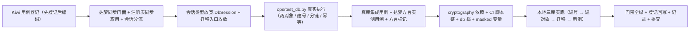

# 三库真库集成与达梦实测实施记录

> 后端基座与服务化地基 · 01 后端基座真实实现 · 05 三库真库集成与达梦实测 · 实施记录

[文档首页](../../../../../../文档首页.md) › [05 三库真库集成与达梦实测](../01_后端基座真实实现_05_三库真库集成与达梦实测.md) › 01 实施　|　[详细设计](../设计/01_详细设计_05_三库真库集成与达梦实测.md) · [测试记录](../测试/01_测试_05_三库真库集成与达梦实测.md)

## 1. 实施信息 

| 项 | 值 |
| --- | --- |
| 任务 | [05 三库真库集成与达梦实测](../01_后端基座真实实现_05_三库真库集成与达梦实测.md) |
| 对应需求 | [01-5](../../../../需求/01_需求_后端基座真实实现.md#r01-5) |
| 详细设计 | [01_详细设计_05_三库真库集成与达梦实测](../设计/01_详细设计_05_三库真库集成与达梦实测.md) |
| 实施日期 | 2026-09-22 |
| 实施人 | minjian |
| 实施环境 | 开发机（Ubuntu，Python 3.14 / uv）；mjbk 常驻三库（MySQL 8.4.11 / PostgreSQL 16 / 达梦 DM8，容器 `bms-mysql` / `bms-postgres` / 原生服务） |
| 提交 | 本任务设计与实施 / 测试记录与代码分开提交（`docs(阶段二)` / `feat(db)`） |
| 结论 | 完成 |

## 2. 实施概览 

## 3. 实施过程 

1. **Kiwi 用例登记（先登记后编码）**：登记 1 条策展用例覆盖全部断言面，平台回读编号 **1156**；登记输入 `scripts/kiwi/cases/2026-09-22_阶段二01-05_三库真库集成与达梦实测.json`（含回读 `case_id`），回读结果落 `scripts/kiwi/exports/2026-09-22_阶段二01-05_登记回读.json`，台账回写见测试资产仓用例台账。
2. **达梦运行期同步门面** `app/db/sync.py`（新增）：`SyncSession`（`execute` / `add` / `delete` / `refresh` / `get` / `flush` / `commit` / `rollback` / `close` / `get_bind` 经 `asyncio.to_thread`；`raw` 逃生口；支持 `async with`）+ `sync_session_scope` + 会话公共契约 `type DbSession = AsyncSession | SyncSession` + `is_sync_only_url`；`EngineFactory` 复用该判定（原 `_SYNC_ONLY_DIALECTS` 保留为集合定义）。
3. **注册表同步取用** `app/db/registry.py`：新增 `is_sync_only(db_key)`（按目标连接串判定）与 `get_sync(db_key, *, read_only)`（同步引擎按 `(db_key, role)` 缓存，租户键随 `release` 回收）；异步 `get` 对同步方言仍抛 `ConfigError`。
4. **会话入口分流** `app/db/session.py`：`session_scope` 与请求级依赖（`get_db` / `get_read_db` / `get_write_db` / `get_uow`）按方言分流；降级守卫抽为 `_guard_degraded` 供两条路径共用；会话类型统一为 `DbSession`。
5. **会话类型放宽**：`unit_of_work` / `repositories/base_db_repository` / `dict/{providers,query,service,sql}` / `listing/store` 的会话类型由 `AsyncSession` 改为 `DbSession`（仅类型标注，运行期语义不变）；`tenant_source` 改为经统一会话入口取数（同步方言可用）。
6. **迁移入口收敛** `app/db/migration.py`：新增 `alembic_config` / `head_revision` / `upgrade_chain`；`ops/migrate_tenants.py` 与 `ops/init_tenant.py` 去掉自建的 `Config` / `ScriptDirectory` / `SimpleNamespace(cmd_opts)`，统一复用该入口。
7. **测试库流程真实化** `ops/test_db.py`（重写）：`TEST_DATABASES` 改「按方言 → 平台 / 租户两对象」；`create` 幂等建号与授权（MySQL `CREATE USER IF NOT EXISTS` + 库级 `bms\_test%` 的 `ALL`；PostgreSQL 角色 `LOGIN CREATEDB` 且建库后转属主；达梦以 `SYSDBA` 承载）+ 建库 / 建模式；`migrate` 按对象分链（平台 → `platform`、租户 → `tenant`，达梦去模式段连接串 + `-x schema=`）；`drop` 幂等清理；未配置连接串即失败（退出码 1）；`app/db/admin.py` 新增公开执行入口 `run_statements` / `fetch_rows` 供建号与授权复用。
8. **真库集成用例** `tests/integration/test_three_db_integration.py`（新增）：`dialect` 参数化（参数 id 含方言 + `dialect_*` 标记）+ `urls` env 守卫；8 个关注点（多数据源路由 / 迁移 head 与表集 / 租户隔离 / 读写分离副本路由 / 分片键查询 / 类型往返 / 排序 NULL 末位 / 软删除复合唯一语义）；探针表按方言走同步 / 异步引擎建删。
9. **达梦方言实测用例** `tests/integration/test_dm8_dialect_measure.py`（新增）：四项实测（schema 前缀与大小写 / 复合唯一 NULL 语义 / 布尔与 JSON 落库 / `VARCHAR2(n CHAR)` 字符长度）；差异项按确认口径分支断言现状。
10. **方言标记与清单口径**：`pyproject.toml` 登记 `dialect_mysql` / `dialect_postgres` / `dialect_dm8` 三个标记；`tests/integration/test_db_connectivity_integration.py` 连通用例接入方言标记；`tests/integration/test_tenant_routing_integration.py` 与 `tests/ops/test_test_db.py` 按两对象清单改写断言（含「与 CI 变量逐字一致」防漂移）。
11. **门面与脚本单测**：`tests/db/test_sync_facade.py`（新增：方言判定 / 门面 CRUD 与事务 / 注册表同步取用与异步拒绝 / `session_scope` 与请求级依赖分流）+ `tests/ops/test_test_db.py`（重写：清单 / 管理连接推导 / 建号语句 / 计划模式无副作用 / 未配置连接串失败 / SQLite 全流程幂等）。
12. **依赖与 CI**：`pyproject.toml` 增 `cryptography>=44.0`（实测 50.0.1，MySQL 8.4 `caching_sha2_password` 冷缓存首连必需）；`.gitlab-ci.yml` 三库 job 补 `BMS_TEST_TENANT_DB_URL` / dump 变量与「create → migrate → pytest → 失败先 dump 再 drop」脚本链，档位注释转「已开」；新增 `deploy/ci/verify/db` 档文件；`deploy/.env.example` 补三个测试密码键位。
13. **凭据落地**：脚本生成三库随机强密码并写入本地凭据文件与 `deploy/.env`（不入库）；经 GitLab API 创建三个 masked 项目变量（`MYSQL_TEST_PASSWORD` / `POSTGRES_TEST_PASSWORD` / `DM8_TEST_PASSWORD`）。
14. **真库实跑**：三库建号 → 建对象 → 分链迁移 → 集成用例全绿（MySQL 9 / PostgreSQL 9 / 达梦 13）；幂等复核（建库「已存在（跳过）」、迁移「已是最新」）。
15. **登记回写与记录**：见 §6 与测试记录；方言特性三份文档、基类清单、规范、计划、任务与父任务状态、Kiwi 台账均已按实施结果回写。

## 4. 问题与处置 

| 问题 | 现象 | 处置 |
| --- | --- | --- |
| MySQL 冷缓存首连失败 | 迁移报 `RuntimeError: 'cryptography' package is required for sha256_password or caching_sha2_password auth methods`（MySQL 8.4.11 默认 `caching_sha2_password`；`aiomysql` 非 TLS 连接首次认证需 RSA 公钥取回） | 依赖补 `cryptography>=44.0`（实测 50.0.1）；锁文件变更触发 CI 基础镜像按哈希重建；本地复跑迁移通过 |
| PostgreSQL 建表权限不足 | `psycopg.errors.InsufficientPrivilege: permission denied for schema public`（PostgreSQL 15+ `public` 模式不再默认授予非属主 `CREATE`；库由管理员建出、属主为管理员） | `ops/test_db.py` 建库后 `ALTER DATABASE … OWNER TO bms_test`（管理员连接可用时；CI 路径库由测试账号自建，属主即自身、空操作） |
| 达梦复合唯一「多 NULL」不成立 | 复合唯一 `(name, deleted_at)` 下两行 `(same, NULL)` 第二行报 `-6602 违反唯一性约束条件`；单列唯一 `(name)` 的多 NULL 允许（实测取证：逐条插入观察 ① ~ ⑦） | **经确认**：登记为方言差异与影响面 + 归口信创适配阶段定案（不改平台统一口径与表结构）；用例按确认口径断言达梦现状行为 |
| 达梦 JSON 读回为字符串 | `row.tags` 读回 `'{"k":"v"}'`（字符串）而非 `dict` | **经确认**：登记差异 + 用例归一化断言（`json.loads`）；影响面归口后续（模块若直接下标访问 JSON 字段需适配） |
| 达梦标识符大小写取证口径 | 首版断言「方言反射返回大写表名」失败：反射结果实为小写（方言归一），库内对象名（`ALL_TABLES`）才是大写 | 用例改「反射归一为小写 + 库内目录查询取大写」双断言；结论回写达梦方言文档 |
| PostgreSQL 布尔条件查询 | `WHERE flag = 1` 报 `operator does not exist: boolean = integer` | 用例改参数化绑定（`flag = :flag`），四库通用 |
| 达梦 executemany 参数组不一致 | `A value is required for bind parameter 'at'`（多行插入各行列集不同） | 用例统一多行列集（显式补 `None` 列） |
| 副本 URL 断言口径 | `str(engine.url)` 为脱敏串，与原始连接串不等 | 用例改 `engine.url == make_url(platform_url)`（URL 对象比较，含密码） |
| 分片路由插件未注册 | `PluginError: 未注册的 sharding 实现：null` | 用例引入 `app.sharding.null`（导入期登记）并断言 `NullShardingRouter` |
| 依赖安装镜像 | PyPI 直连慢 | 走清华源（`uv` 默认索引已配置），`cryptography 50.0.1` 安装正常 |

## 5. 验证结果 

| 验证项 | 命令 | 结果 |
| --- | --- | --- |
| 单元用例 | `uv run pytest -q` | 892 passed / 36 skipped（跳过项为真库 / 外部服务 env 守卫用例） |
| 覆盖率 | `uv run pytest -q --cov=app --cov-branch` | 总体 **96%**；`app/db/session.py`、`app/db/sync.py` **100%**，`app/db/admin.py` 99%、`base_db_repository.py` 100% |
| 静态检查 | `uv run ruff check .` / `uv run ruff format --check .` / `uv run pyright` | 全通过（0 error / 0 warning） |
| 真库集成用例 | 三库 env 实跑 `pytest tests/integration -k <方言>` | MySQL 9 passed / PostgreSQL 9 passed / 达梦 13 passed |
| 测试库流程幂等 | `ops.test_db create/migrate --execute` 复跑 | 建库「已存在（跳过）」、迁移「已是最新」（两对象皆然） |
| ops 脚本回归 | `ops.migrate_tenants --target all --dry-run` / `ops.db_admin exists` | 清单与脱敏输出正常（迁移入口收敛无回归） |
| 基座对账 | `python3 scripts/tools/base-check/check-backend-base.py` | 通过 |
| 文档对账 | `check-base.py` / `check-links.py` / `check-docs/check-status.py --stage 02_后端基座与服务化地基` | 见测试记录 §3.1 |
| CI `verify/db` 档 | 档文件 + masked 变量 + 推送 main 实跑 | 见测试记录 §3.4 |

## 6. 登记回写 

| 落点 | 内容 |
| --- | --- |
| 《后端基类清单》 | §5 会话入口分流（`session_scope` / 请求级依赖）与 `DbSession` 契约；§8 新增 `app/db/sync.py`（`SyncSession` / `sync_session_scope`）、注册表 `is_sync_only` / `get_sync`、迁移入口（`alembic_config` / `head_revision` / `upgrade_chain`）、`ops/test_db.py`（真实执行）；§10 登记继承链（`SyncSession` 为 `BaseObject` 派生） |
| 《后端开发规范》 | 「异步与并发」补「同步方言门面」口径：目标库为同步方言时经统一会话入口分流（`SyncSession` + `asyncio.to_thread`），**新会话方法须同步维护 `DbSession` 契约与两处实现** |
| 《数据库开发规范》 | 「迁移与建表口径」补测试库流程（每方言两对象 / 平台与租户分链 / 建号与最小授权 / PostgreSQL 建库属主 / 达梦以模式为库级隔离）与迁移入口（`ops/test_db.py`、`upgrade_chain`） |
| 《数据库设计 · 方言特性》 | MySQL：测试库对象与账号、`cryptography` 冷缓存首连（实测）；PostgreSQL：建库属主与 `public` 模式 CREATE 权限（实测）；达梦：复合唯一多 NULL 差异、JSON 读回字符串、schema 与大小写双口径、类型映射真库确认、唯一约束 NULL 取证明细（实测） |
| 计划 | §1 工时台账、§2 已完成表（01_05 行六列）、§3 移除 01_05、§4 甘特移除已完成节点；「后续阶段待办」登记达梦唯一兜底与 JSON 适配归口 |
| 任务 / 父任务 | 任务 05 状态与完成日期；父任务域总览子任务表与工时口径两处一致 |
| Kiwi TCMS | 用例 **1156**（正文含两对象清单、8 关注点、达梦四项实测与差异口径） |
| 测试资产仓 | 登记输入 / 回读结果与用例台账批次行 |
| 实施 / 测试记录 | 本文件与[测试记录](../测试/01_测试_05_三库真库集成与达梦实测.md) |

## 7. 偏差与遗留 

- **偏差（已闭环）**：① 达梦复合唯一「多 NULL」差异（新增待拍板项，经确认登记差异 + 另立任务定案，用例按现状断言）；② 达梦 JSON 读回字符串（经确认登记 + 归一化断言）；③ 迁移入口收敛与 `cryptography` 依赖、PostgreSQL 属主处置为实施中新增事项（设计 §10 决策 16 ~ 18 已回写）；④ 达梦标识符大小写断言口径由「反射返回大写」修正为「反射归一为小写 + 库内目录为大写」（实测修正，设计 §4.4 已回写）。
- **遗留（归口）**：① 达梦复合唯一多 NULL 兜底方案（信创适配阶段：先排查达梦实例 / 建库选项，再评估应用层唯一校验或哨兵值）→ 计划「后续阶段待办」；② JSON 字段达梦读回字符串的适配（按影响面，若有模块直接下标访问 JSON 字段）→ 后续按需；③ `ops/init_tenant.py` 在达梦下的种子路径（`_seed` 走异步引擎，达梦需经同步门面适配）→ 租户管理阶段 / 达梦生产化；④ 真实主从复制与只读副本谓词（`待验`）→ 后续；⑤ 游标排序键类型范围（`Decimal` 等）→ 01_04 遗留保持；⑥ 骨架表迁移 → 所属阶段；⑦ 分片表按月预创建 → 任务调度阶段。

> 依《文档生成规范》编写 · 与《测试记录》配套
