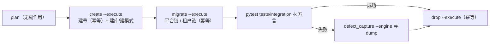
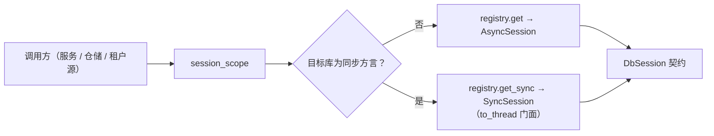

# 三库真库集成与达梦实测详细设计

> 后端基座与服务化地基 · 01 后端基座真实实现 · 05 三库真库集成与达梦实测 · 详细设计

[文档首页](../../../../../../文档首页.md) › [05 三库真库集成与达梦实测](../01_后端基座真实实现_05_三库真库集成与达梦实测.md) › 01 详细设计　|　[父任务：后端基座真实实现](../../01_后端基座真实实现.md) · [本阶段需求](../../../../需求/01_需求_后端基座真实实现.md) · [排期计划](../../../../计划/01_计划_后端基座与服务化地基.md)

## 1. 概述 <a id="overview"></a>

- **目标**：把「三库真库集成」从占位收口到真实可跑——`ops/test_db.py` 真实落地（幂等建库/建模式 + 测试账号 + 分链迁移 + 删库清理）、三库真库集成用例（多数据源 / 读写分离路由 / 分片键 / 迁移 / 租户隔离）与达梦方言四项实测（复合唯一 NULL 语义 / 迁移 DDL / schema 前缀与大小写 / 类型映射落库）自动化、达梦运行期同步门面落地（兑现 01_01 / 01_03 归口）、CI `verify/db` 档激活并将其脚本补齐为「建库 → 迁移 → 用例 → 失败先 dump 再清理」。
- **依据**：《架构设计 · 测试与质量》「测试金字塔」「CI 流水线」节；《架构设计 · 数据架构》「迁移策略」节；《架构设计 · 数据访问与分片》「多数据源管理」「读写分离」「查询规范」节；《后端开发规范》「异步与并发」节；《数据库开发规范》「迁移与建表口径」「SQL 口径（三库兼容）」节；《测试规范》「三库方言测试」「CI 执行策略」「缺陷管理」节；《部署发布规范》「环境与数据」节；需求 [01-5](../../../../需求/01_需求_后端基座真实实现.md#r01-5)；上游设计 [01_01](../../01_后端基座真实实现_01_数据访问底座落库/设计/01_详细设计_01_数据访问底座落库.md) / [01_02](../../01_后端基座真实实现_02_多租户数据拓扑落库与实测/设计/01_详细设计_02_多租户数据拓扑落库与实测.md) / [01_03](../../01_后端基座真实实现_03_BaseRepository 异步与 BaseModel 落库/设计/01_详细设计_03_BaseRepository 异步与 BaseModel 落库.md) / [01_04](../../01_后端基座真实实现_04_Alembic 迁移与排序 DB 侧/设计/01_详细设计_04_Alembic 迁移与排序 DB 侧.md)。
- **范围（本任务）**：
  1. **测试对象拓扑**：每方言两个对象——平台库 `bms_test_mysql` / `bms_test_pg` / 模式 `BMS_TEST_DM`，租户库 `bms_test_mysql_t1` / `bms_test_pg_t1` / 模式 `BMS_TEST_DM_T1`；`ops/test_db.py` 的库清单升级为「方言 → 平台 / 租户」两对象。
  2. **`ops/test_db.py` 真实实现**：`create` 幂等建库/建模式 + 幂等建测试账号与按库最小授权（管理连接用 root / postgres / SYSDBA，未提供管理凭据时跳过建号并提示）；`migrate` 按对象分链迁移（平台对象 `platform` 链、租户对象 `tenant` 链，幂等）；`drop` 幂等删库/删模式；`plan` 保留（无副作用，CI 常跑 job 与本地核对用）。
  3. **达梦运行期同步门面**：新增 `app/db/sync.py`（`SyncSession` 阻塞会话的异步门面，全部阻塞调用经 `asyncio.to_thread`）；`EngineFactory.create_sync` 支持副本路由；`EngineRegistry` 增 `get_sync` / `is_sync_only`；会话统一入口 `session_scope` 与 HTTP 会话依赖按方言分流（达梦走同步门面）；`TenantSource` 平台库取数经统一入口（达梦可跑）。
  4. **迁移执行公共入口**：`app/db/migration.py` 增 `alembic_config` / `head_revision` / `upgrade_chain`，`ops/migrate_tenants.py`、`ops/init_tenant.py`、`ops/test_db.py` 三处复用（消除既有两处重复实现）。
  5. **三库真库集成用例**：`tests/integration/test_three_db_integration.py`（按方言参数化：多数据源路由 / 迁移 head 与表集 / 租户隔离 / 副本路由 / 分片键查询 / 类型落库往返 / 排序 NULL 末位），未配 `BMS_TEST_DB_URL`（或 `BMS_TEST_TENANT_DB_URL`）即跳过。
  6. **达梦方言实测用例**：`tests/integration/test_dm8_dialect_measure.py`（schema 前缀与标识符大小写 / 软删除复合唯一 NULL 语义 / 布尔与 JSON 落库往返 / `VARCHAR2(n CHAR)` 字符长度语义），结论回写方言特性文档与类型映射登记表。
  7. **方言过滤口径**：`pyproject.toml` 登记 `dialect_mysql` / `dialect_postgres` / `dialect_dm8` 三个 marker，用例名保留方言标识（`-k` 与 `-m` 双路可命中）。
  8. **CI `verify/db` 档激活**：新增 `deploy/ci/verify/db` 档文件；`.gitlab-ci.yml` 三库 job 补 `create/migrate/drop --execute` 与「失败先 `defect_capture.py` 导 dump 再清理」链路，变量补 `BMS_TEST_TENANT_DB_URL`；GitLab 项目变量补 3 个 masked 测试密码。
- **不含（明确归口，见第 8 节）**：每服务每租户建库 `bms_{service}_{tenant}` 与多服务多库迁移编排、按服务连接预算（06_01 / 06_02）；分片表按月预创建（任务调度阶段）；父子流水线与不可变镜像（阶段九）；真实主从复制搭建（读写分离副本路由的「真实主从同步」仍属「待验」，本任务只做副本路由真库断言）；骨架表迁移（所属阶段）。

## 2. 现状与差距 <a id="gap"></a>

| 关注点 | 现状（01_01 ~ 01_04 交付） | 差距（本任务目标） |
| --- | --- | --- |
| `ops/test_db.py` | `plan` / `create` / `migrate` / `drop` 四子命令**全占位**（带 `--execute` 只打印占位提示）；库清单单对象（`bms_test_mysql` / `bms_test_pg` / 模式 `BMS_TEST_DM`） | 真实执行：两对象清单、幂等建库/建模式 + 建账号授权、分链迁移、幂等删库；保留 `plan` |
| 测试账号与权限 | mjbk 三库**无** `bms_test` 账号与 `bms_test` 前缀库（实测核对：MySQL / PG 用户与库、达梦模式均无） | 脚本幂等建号 + 最小授权（MySQL 库级 `bms\_test%`、PG `CREATEDB`、达梦 SYSDBA 模式） |
| 真库集成用例 | `test_db_connectivity_integration.py` 四条 `SELECT 1`（Kiwi 984）；`test_tenant_routing_integration.py` 的 `test_env_guarded_engine_routing` 仅「建引擎不建连」 | 三库真库集成：迁移结构 / 多数据源 / 租户隔离 / 副本路由 / 分片键 / 类型落库 / 排序 NULL 末位 |
| 达梦运行期路径 | `EngineFactory.create` 对 `dm` 直接抛 `ConfigError`；仅迁移（`env.py`）与建删库（`admin.py`）走 `asyncio.to_thread` 同步助手 | `SyncSession` 异步门面 + 会话入口分流，达梦运行期（租户源 / 服务 / 仓储）可用 |
| 达梦方言结论 | 01_04 已实测「DDL impl / 模式切换 / 版本行提交 / 模式存在性」；复合唯一 NULL 语义、`VARCHAR2` 字符长度、JSON 读写、排序 NULL 位次仍为**待验** | 四项真库实测 + 结论回写方言特性文档与类型映射登记表 |
| 迁移执行实现 | `ops/migrate_tenants.py` 与 `ops/init_tenant.py` **各有一份** `_alembic_config` / `_upgrade`（重复） | 上移 `app/db/migration.py` 公共入口，三处复用 |
| 方言筛选口径 | 无方言 marker，仅靠用例名含方言；CI 用 `pytest -k "$DB_DIALECT"` | 登记三个方言 marker + 用例名保留方言标识（双路可命中） |
| CI `verify/db` 档 | 档文件不存在（`integration-plan` 常跑；三库 job 写好但被档守卫拦住）；GitLab 项目变量缺三个测试密码 | 建档激活 + 脚本补齐 + 变量配齐 + 推送 main 实跑三库 job 全绿 |
| mjbk 环境 | 三库端口可达（3306 / 5432 / 5236），MySQL 仅 `bms_dev` / `kiwi` 库，PG 仅 `bms_dev`，达梦无测试模式 | 本任务创建测试对象并跑通全流程，演练后按测试库语义清理（本地复跑可再建） |

## 3. 交付物清单 <a id="tree"></a>

```text
backend/
├── app/
│   ├── db/
│   │   ├── engine.py                                 # 修改：同步方言常量与报错文案收敛、create_sync 支持副本路由
│   │   ├── migration.py                              # 修改：新增 alembic_config / head_revision / upgrade_chain（迁移公共入口）
│   │   ├── registry.py                               # 修改：新增 is_sync_only / get_sync（同步引擎取用，沿用清扫与记账）
│   │   ├── session.py                                # 修改：新增 DbSession 契约；session_scope 与 HTTP 会话依赖按方言分流
│   │   ├── sync.py                                   # 新增：达梦同步门面（SyncSession + sync_session_scope + 方言判定）
│   │   ├── tenant_source.py                          # 修改：平台库取数经统一会话入口（达梦走同步门面）
│   │   └── unit_of_work.py                           # 修改：DbUnitOfWork 会话类型放宽为 DbSession（同步门面亦可）
│   └── (无其它改动)
├── ops/
│   ├── test_db.py                                    # 重写：plan / create / migrate / drop 真实执行（两对象 + 账号 + 分链 + 幂等）
│   ├── migrate_tenants.py                            # 修改：迁移执行改走 app/db/migration.py 公共入口
│   └── init_tenant.py                                # 修改：同上（去重复实现）
├── pyproject.toml                                     # 修改：登记 dialect_mysql / dialect_postgres / dialect_dm8 标记
└── tests/
    ├── integration/
    │   ├── test_three_db_integration.py              # 新增：三库真库集成（7 上下文 × 3 方言，env 守卫 + 方言标记）
    │   ├── test_dm8_dialect_measure.py               # 新增：达梦方言四项实测（env 守卫 + dialect_dm8）
    │   └── test_db_connectivity_integration.py        # 修改：连通用例接入方言标记（保留原断言）
    ├── db/
    │   ├── test_sync_facade.py                       # 新增：同步门面（to_thread 调用 / 会话生命周期 / 方言判定 / 入口分流）
    │   ├── test_registry.py                          # 修改：get_sync / is_sync_only 断言
    │   ├── test_session_scope.py                     # 修改：方言分流断言（同步方言走门面）
    │   └── test_tenant_source.py                     # 修改：平台库取数经统一入口（同步方言路径）
    └── ops/test_test_db.py                           # 重写：真实执行口径（两对象清单 / 建号 SQL / 迁移与删除分支 / CI 变量一致）

.gitlab-ci.yml                                         # 修改：三库 job 脚本补 create/migrate/dump/drop + 租户 URL 变量 + 档位注释
deploy/ci/verify/db                                    # 新增：重验证层「三库真库集成」档开关文件
deploy/.env.example                                    # 修改：补三个测试密码键位占位（真实值不入库）

bms文档/
├── 设计/数据库设计/方言特性/{01_MySQL,02_PostgreSQL,03_DM8}.md   # 修改：真库实测记录与「实测 / 待验」结论
├── 设计/数据库设计/01_数据库设计_总览.md                     # 修改：「方言特性登记」状态
├── 设计/架构设计/13_架构设计_子系统_数据访问与分片.md          # 修改：达梦运行期同步门面口径
├── 设计/架构设计/32_架构设计_测试与质量.md                    # 修改：CI 三库 job（verify/db 档）激活状态
├── 后端基类清单.md                                       # 修改：SyncSession / get_sync / 迁移公共入口登记
├── 规范/数据库开发规范.md                                 # 修改：三库测试库流程与测试账号口径
├── 规范/测试规范.md                                       # 修改：三库方言测试（db 档激活 + 方言标记约定）
└── 项目/02_后端基座与服务化地基/…/01_后端基座真实实现_05_…/   # 本任务：设计 / 实施 / 测试 三件套
```

## 4. 领域设计 <a id="design"></a>

### 4.1 测试对象拓扑与库清单 <a id="topology"></a>

每方言**两个对象**（贴近真实「平台库 / 租户库」拓扑；库清单仍是唯一事实源，与 `.gitlab-ci.yml` 变量逐字一致）：

| 方言 | 平台对象 | 租户对象 | 应用侧连接串（CI 变量） |
| --- | --- | --- | --- |
| MySQL 8 | `bms_test_mysql` | `bms_test_mysql_t1` | `BMS_TEST_DB_URL` / `BMS_TEST_TENANT_DB_URL`（`mysql+aiomysql://bms_test:${MYSQL_TEST_PASSWORD}@<mjbk>:3306/…`） |
| PostgreSQL 16 | `bms_test_pg` | `bms_test_pg_t1` | `postgresql+psycopg://bms_test:${POSTGRES_TEST_PASSWORD}@<mjbk>:5432/…` |
| 达梦 DM8 | 模式 `BMS_TEST_DM` | 模式 `BMS_TEST_DM_T1` | `dm+dmPython://SYSDBA:${DM8_TEST_PASSWORD}@<mjbk>:5236/<模式名>`（**同步方言**） |

- **建库标准**：MySQL `utf8mb4` / `utf8mb4_general_ci`，PostgreSQL `UTF8`，达梦 UTF8 + 模式（复用 `app/db/admin.py` 既有语句）。
- **达梦建/删模式的连接串**：`create` / `drop` 用**去掉模式段的同主机连接串**（`dm+dmPython://SYSDBA:<pwd>@host:5236`）+ `--name <模式名>`；用例连接串带模式段（`/BMS_TEST_DM`），与 CI 变量一致。是否用带模式连接串建立前置于实施期实测（见第 8 节开放项）。
- **账号**：MySQL / PostgreSQL 测试账号 `bms_test`（达梦即 `SYSDBA`，无独立测试账号）；密码为脚本生成的随机强密码（URL 安全字符集、满足 GitLab masked 变量字符集要求），只落 GitLab masked 变量与本地资源文档 / `deploy/.env`（不入库）。

### 4.2 `ops/test_db.py` 真实实现 <a id="testdb"></a>



| 成员 / 参数 | 说明 |
| --- | --- |
| `TEST_DATABASES` | 方言 → `{platform: <库/模式名>, tenant: <库/模式名>}`（唯一事实源；与 CI 变量逐字一致，单测断言） |
| `TEST_URL_ENV` | `{"platform": "BMS_TEST_DB_URL", "tenant": "BMS_TEST_TENANT_DB_URL"}` |
| `TEST_ACCOUNT` | `{"mysql": "bms_test", "postgres": "bms_test", "dm8": "SYSDBA"}` |
| `CHAIN_BY_SCOPE` | `{"platform": "platform", "tenant": "tenant"}`（分链迁移口径） |
| `FLOW_STEPS` | `("建库", "迁移", "集成用例", "删库清理")`（`plan` 输出保持） |
| `resolve_test_database(engine, scope="platform")` | 取对象名（达梦为大写模式名） |
| `resolve_test_url(engine, scope, *, override="")` | 取对象连接串（`--url` / `--tenant-url` > 环境变量） |
| `build_target(engine, scope, *, url="", admin_url="")` | 目标解析：达梦建/删模式用去模式连接串（复用 `app/db/admin.py::resolve_target`） |
| `ensure_test_account(engine, *, admin_url, password)` | 幂等建号与授权；无管理凭据 → 跳过并打印提示 |
| `create(engine, ...)` / `migrate(engine, ...)` / `drop(engine, ...)` | 与 `--execute` 配套的三步真实执行（幂等，返回是否变更） |

子命令与退出码：

| 子命令 | 行为 | 退出码 |
| --- | --- | --- |
| `plan --engine <d>` | 打印两对象与四步骤（无副作用） | 0 |
| `create --engine <d> --execute` | 建号（幂等）→ 建库/建模式（幂等：已存在跳过） | 0 / 失败 1 |
| `migrate --engine <d> --execute` | 平台对象 → `platform` 链、租户对象 → `tenant` 链；`alembic_version` 已为 head 则「已是最新（跳过）」；达梦带 `-x schema=<模式名>` | 0 / 失败 1 |
| `drop --engine <d> --execute` | 幂等删库/删模式（不存在跳过） | 0 / 失败 1 |
| 任一子命令不带 `--execute` | 计划模式（打印库名与步骤，不建连）/ 达梦不需建号 | 0 |

**建号语句与最小授权**（幂等；密码经单引号转义，不拼用户可控输入）：

| 方言 | 建号（不存在时） | 授权 |
| --- | --- | --- |
| MySQL | `CREATE USER IF NOT EXISTS 'bms_test'@'%' IDENTIFIED BY '<pwd>'` | `GRANT ALL PRIVILEGES ON \`bms\_test%\`.* TO 'bms_test'@'%'`（含 `CREATE` / `DROP` 库位，使 CI 无需管理员密码建删测试库） |
| PostgreSQL | 查 `pg_roles` 不存在则 `CREATE ROLE bms_test LOGIN CREATEDB PASSWORD '<pwd>'`；已存在则 `ALTER ROLE … CREATEDB PASSWORD '<pwd>'` | `CREATEDB` 角色属性（`CREATE DATABASE` 必需） |
| 达梦 | 无（`SYSDBA` 即测试账号） | 模式级隔离（`CREATE SCHEMA` / `DROP SCHEMA … CASCADE`） |

- **凭据来源**：`--password` / `--admin-password` > 环境变量（MySQL `MYSQL_TEST_PASSWORD` / `MYSQL_ROOT_PASSWORD`，PostgreSQL `POSTGRES_TEST_PASSWORD` / `POSTGRES_PASSWORD`，达梦 `DM8_TEST_PASSWORD` / `DM8_SYSDBA_PASSWORD`）；一律不写入日志（仅脱敏连接串展示）。
- **CI 路径**：账号与授权在首次开通时已建立（幂等），CI job 只带测试账号凭据 → `create` 的建号步骤跳过并打印提示，建库/建模式由测试账号自身权限完成（MySQL 库级 `CREATE` / PG `CREATEDB`）。
- **调用口径**：一律 `uv run python -m ops.test_db …`（模块方式；直接跑脚本会因 `sys.path[0]` 为脚本目录而 `ModuleNotFoundError`，与 `ops/check_modules.py` 同一坑）。

### 4.3 达梦运行期同步门面 <a id="sync-facade"></a>

达梦无异步方言（`dmPython` 为同步驱动），运行期需以「同步引擎 + 线程池门面」接入，使租户源、服务与仓储在达梦下可用（01_01 设计 §8 / 01_03 设计 §8 归口本任务）。

**新增 `app/db/sync.py`**：

| 成员 | 说明 |
| --- | --- |
| `SYNC_ONLY_DIALECTS` | `frozenset({"dm"})`（**唯一来源**；`app/db/engine.py` 复用，避免两处漂移） |
| `is_sync_only_url(url)` | 按连接串方言判定是否同步方言 |
| `SyncSession`（继承 `BaseObject`） | 阻塞 `Session` 的**异步门面**：`execute` / `add` / `delete` / `refresh` / `get` / `flush` / `commit` / `rollback` / `close` / `get_bind` / `begin()`；除纯内存调用（`add` / `delete` / `get_bind`）外，全部经 `asyncio.to_thread` 执行；提供异步上下文管理器（退出即关闭会话） |
| `sync_session_scope(engine)` | 异步上下文管理器：由同步引擎建会话 → 让出 `SyncSession` → 关闭 |

**会话统一入口分流（`app/db/session.py`）**：

| 成员 | 变化 |
| --- | --- |
| `DbSession`（Protocol，新增） | 会话公共契约（`execute` / `add` / `delete` / `refresh` / `get` / `flush` / `commit` / `rollback` / `close` / `get_bind`）；`AsyncSession` 与 `SyncSession` 均结构化满足 |
| `session_scope(...)` | 按目标库方言分流：同步方言 → `registry.get_sync(db_key, read_only=…)` + `sync_session_scope`；其余 → 原异步路径；`yield` 类型改为 `DbSession`（既有 6 处调用点仅用公共方法，无需改动） |
| `get_db` / `get_read_db` / `get_write_db` | 同样分流（达梦环境下 HTTP 依赖可用），`yield` 类型 `DbSession` |
| `get_uow` | 接受 `DbSession`（写事务路径在达梦下经同步门面工作单元） |
| `DbUnitOfWork`（`unit_of_work.py`） | `session` 类型放宽为 `DbSession`（`begin()` 契约保持「异步上下文管理器」） |

**引擎与注册表**：

| 成员 | 变化 |
| --- | --- |
| `EngineFactory.create` | 同步方言报错文案改为「请走同步门面（`SyncSession`）」，不再是「随 01-05」 |
| `EngineFactory.create_sync(options=None, *, read_only=False)` | 支持副本路由（副本配置与异步路径同源：`_resolve_url_role`），同步引擎缓存键改 `(db_key, role)`；`drop` / `aclose` 同步清理全部角色 |
| `EngineRegistry.is_sync_only(db_key)` | 按目标连接串判定（不建连） |
| `EngineRegistry.get_sync(db_key, *, read_only=False)` | 取同步引擎：沿用闲置清扫与使用时间记账（`_last_used`），租户键走 LRU 逐出；**不在 `_engines`（异步视图）内登记**，释放统一经 `factory.drop(db_key)`（同库异步 + 同步引擎一并释放） |
| `TenantSource._load` | 改经 `session_scope` 统一入口取平台库会话（达梦自动走同步门面） |



### 4.4 迁移执行公共入口 <a id="migration-entry"></a>

现状：`ops/migrate_tenants.py` 与 `ops/init_tenant.py` **各自实现**一份「配置段 → `Config` → `command.upgrade`」；本任务再增第三个调用方（`ops/test_db.py`）前先收敛：

| 新增（`app/db/migration.py`） | 说明 |
| --- | --- |
| `alembic_config(chain)` | 按链取 `Config`（配置段 = 链名，`ini_section=config_section(chain)`） |
| `head_revision(chain)` | 链 head 版本号（空链返回 None；供幂等判定） |
| `upgrade_chain(chain, url, *, schema="")` | **阻塞**执行该链 `upgrade head`（`-x url=` / `-x schema=`）；调用方用 `asyncio.to_thread` 包装 |

`ops/migrate_tenants.py` / `ops/init_tenant.py` / `ops/test_db.py` 三处删除各自实现、改调公共入口（行为不变，`--dry-run`、汇总与退出码口径保持）。

### 4.5 三库真库集成用例 <a id="integration-cases"></a>

新增 `tests/integration/test_three_db_integration.py`：

- **守卫**：`BMS_TEST_DB_URL` 与 `BMS_TEST_TENANT_DB_URL` 均需配置且平台连接串方言匹配（否则 `skip`，不阻塞冒烟层）；`pytestmark = [pytest.mark.integration, pytest.mark.kiwi_id(<本任务编号>)]`。
- **方言参数化**：`pytest.param("mysql", marks=pytest.mark.dialect_mysql)` / `("postgres", …dialect_postgres)` / `("dm8", …dialect_dm8)`，参数 id 即方言标识（保证 `-k "$DB_DIALECT"` 有匹配用例）；用例函数名统一带 `_{dialect}` 后缀。
- **配置夹具**：`Settings()` 直接注入真库（平台 = `BMS_TEST_DB_URL`、租户 = `BMS_TEST_TENANT_DB_URL`、`tenants.url_template = ""`，使 `tenant_<code>` 库键回落租户连接串）；达梦走 `create_sync` / `get_sync`。

| # | 用例 | 断言要点 |
| --- | --- | --- |
| 1 | 多数据源路由 | 平台 / 租户引擎 URL 正确且互异；两库各自 `SELECT 1` 成功 |
| 2 | 迁移 head 与表集 | 平台对象 `alembic_version` = `platform` 链 head、租户对象 = `tenant` 链 head；`inspect` 表集含平台三表 / 租户七表（表集取自 `app/db/migration.py` 链注册，不重复登记） |
| 3 | 租户隔离 | 租户库写入一行 → 平台库与「同 URL 不同库键」路径均查不到；两对象为不同物理对象 |
| 4 | 读写分离路由 | 配置 `replicas=[<同实例另一连接串>]` → `read_only=True` 命中副本 URL 且副本上 `SELECT` 成功；写路径 URL 为主库（不搭真实主从） |
| 5 | 分片键查询 | `resolve_plugin("sharding")` 契约（缺省实现：`db_key="default"` + 逻辑表名）；真库执行带分片键（日期列）条件的查询返回预期行（分片表预创建归任务调度阶段） |
| 6 | 类型落库往返 | 真库建探针表 → 写入 / 读回（`Boolean` / `JSON` / `DateTime` / `VARCHAR`）→ `inspect` 列类型与编译期 DDL 类型一致 |
| 7 | 排序 NULL 末位 | 真库升 / 降序排序：NULL 行**恒排末位**（四库统一口径的真库取证） |

### 4.6 达梦方言实测用例 <a id="dm8-cases"></a>

新增 `tests/integration/test_dm8_dialect_measure.py`（守卫：`BMS_TEST_DB_URL` 方言为 `dm`；`dialect_dm8` + `integration` 标记）：

| # | 实测项 | 断言与取证 |
| --- | --- | --- |
| 1 | schema 前缀与标识符大小写 | 迁移后经连接的模式段定位对象；模式名与表名在元数据中呈**大写**；迁移脚本无 `模式名.表名` 前缀（由 `-x schema=` 会话切换生效）；`snake_case` 小写书写在查询中可用 |
| 2 | 软删除复合唯一 NULL 语义 | 建 `(唯一字段, deleted_at)` 复合唯一表：两条 `deleted_at IS NULL` 同键是否共存、软删后同键可复用、恢复不冲突（与 MySQL / PostgreSQL 已实测口径对照） |
| 3 | 布尔与 JSON 落库 | `Boolean` 落 `SMALLINT`（0/1）并经 ORM 往返正确；`JSON` 写入 / 读回往返一致（原「待验」项） |
| 4 | `VARCHAR2(n CHAR)` 字符长度 | 写入 16 个中文字符成功、17 个失败 → 长度按**字符**计（与 MySQL / PostgreSQL 语义一致） |

- 结论（含通过 / 差异与处置）回写三份方言特性文档「实测记录」节与 `tests/models/test_type_mapping.py` 登记表注记（标「实测（真库）」+ 证据指向任务测试记录）；差异项按《数据库开发规范》「未实测结论不得写入表文件或规范」口径处理。
- MySQL / PostgreSQL 侧同步补「类型落库 + 复合唯一 NULL 语义 + 排序 NULL 末位」真库实测结论（治本于方言文档「待验」项）。

### 4.7 方言过滤 marker 与命名约定 <a id="markers"></a>

| 项 | 约定 |
| --- | --- |
| marker | `pyproject.toml` 登记 `dialect_mysql` / `dialect_postgres` / `dialect_dm8`（与 `DB_DIALECT` 取值同形） |
| 用例名 | 真库用例函数名带方言后缀（`…_mysql` / `…_postgres` / `…_dm8`），参数化 id 亦含方言 |
| CI 过滤 | 维持 `pytest tests/integration -k "$DB_DIALECT" -v`（双保险；后续需要按标记统计时可改 `-m`，无需改用例） |

### 4.8 CI `verify/db` 档激活与 job 脚本 <a id="ci"></a>

**档文件** `deploy/ci/verify/db`（新增；内容为说明文本，删除即关档）：档语义（三库真库集成）、管控 job（`integration-mysql` / `integration-postgres` / `integration-dm8`）、前置变量清单、激活日期与依据（本任务）。

**`.gitlab-ci.yml`**：

| 项 | 变化 |
| --- | --- |
| 文件头档位注释 | `deploy/ci/verify/db` 由「P4 待开」改为「P4 已开（2026-09-22，01_05 三库真库集成与达梦实测）」 |
| `.integration-base.script` | `plan` → `create --execute`（失败先清理再退出）→ `migrate --execute` → `pytest tests/integration -k "$DB_DIALECT" -v` → 失败：`defect_capture.py --engine "$DB_DIALECT"`（导 dump + 建缺陷单）后 `drop --execute`（`|| true`），退出 1 → 成功：`drop --execute`（`|| true`） |
| 变量 | 三 job 各补 `BMS_TEST_TENANT_DB_URL`（租户对象，库名与 `TEST_DATABASES` 逐字一致）、`TEST_DB_NAME`（dump 用库 / 模式名）、dump 用账号与密码（`DUMP_USER` / `DUMP_PASSWORD`，取该方言 masked 变量） |
| `integration-plan` | 保留常跑（三方言 `plan`）；断言面自然覆盖两对象清单 |
| 注释 | 激活前置逐项标注为「已完成」（档 / 变量 / 脚本 / 方言用例匹配） |

**GitLab 项目变量**（经 API 创建，masked）：`MYSQL_TEST_PASSWORD`、`POSTGRES_TEST_PASSWORD`、`DM8_TEST_PASSWORD`（值由脚本生成的随机强密码；不打印、不入库）。

### 4.9 凭据与变量口径 <a id="credential"></a>

| 落点 | 内容 |
| --- | --- |
| GitLab 项目变量 | 三个 masked 测试密码（供 CI 连接测试库；CI 建删测试库由测试账号自身权限完成，不额外引入管理员变量） |
| `deploy/.env`（gitignore） | 同名键位（本地实跑 / 演练用；与 GitLab 取值一致） |
| `deploy/.env.example` | 三键位**占位**（`MYSQL_TEST_PASSWORD=` 等；不含真实值） |
| bms `用户文档/本地资源.md`（gitignore） | 测试账号、密码与测试库/模式清单补记（公开文档红线：不写入其他文档） |
| 密码形态 | `secrets.token_urlsafe(24)` 级随机（URL 安全字符集；满足 GitLab masked 变量字符集与「单行、无空白」要求），避免连接串需转义的字符 |

## 5. 失败分支与边界 <a id="failures"></a>

| 场景 | 处理 |
| --- | --- |
| `BMS_TEST_DB_URL` / `BMS_TEST_TENANT_DB_URL` 未配置或方言不匹配 | 用例 `skip`（不阻塞冒烟层）；CI 三库 job 由变量注入，缺失即前置失败 |
| `create` 命中已存在对象 | 幂等跳过（不重建、不清空）；退出码 0 |
| `create` 未提供管理凭据 | 跳过建号并打印提示（CI 路径：账号已存在）；建库仍按测试账号权限执行 |
| `create` 建号权限不足（管理凭据错误） | 报错并提示 `--admin-url` / `--admin-password`（不尝试提权） |
| 达梦建模式用带模式连接串失败 | 改为「去模式段连接串 + `--name <模式名>`」（设计即按此口径；实测若支持带模式连接串则登记结论，不回退） |
| `migrate` 目标已是链 head | 输出「已是最新（跳过）」，退出码 0 |
| `migrate` 单对象失败 | 报错退出码 1（打印链名 / 对象 / 脱敏连接串）；CI 由 job 失败路径先 dump 再清理 |
| `drop` 目标不存在 | 跳过并提示，退出码 0（幂等） |
| 达梦真库复合唯一「多 NULL」不成立 | 用例失败即暴露（不静默放宽）：登记为**方言差异**并回写 DM8 文档；兜底方案（`deleted_at` 哨兵值 / 应用层唯一性校验）需另议并单独确认后实施，不在本任务内擅自改口径 |
| 达梦 `VARCHAR2(n CHAR)` 按字节计长 | 用例失败即暴露；若为字节语义则回写方言文档并评估对字段长度口径的影响（表文件长度定义不变，风险登记） |
| `JSON` 在达梦不可读写 | 用例失败即暴露；结论回写 DM8 文档（当前标记「待验」），必要时登记偏差与处置 |
| 同步方言误走异步路径 | `session_scope` / `_open_session` 分流判定按连接串方言（不建连）；用例断言达梦环境 `registry.get` 抛 `ConfigError`、`get_sync` 可用 |
| 同步门面在线程池中抛异常 | 原样上抛（不吞异常）；会话在 `finally` 中关闭 |
| 副本未配置 | `read_only=True` 回落主库（既有口径）；用例在配置副本时断言命中副本 |
| 分片缺省实现（不路由） | 契约断言「`default` + 逻辑表名」；分片表预创建与真实分片策略归任务调度阶段 |
| CI 失败 dump 不可用（`pg_dump` / 工具缺失等） | dump 步骤 `|| true`，不覆盖原失败结论；清理步骤仍执行 |
| 测试库残留（job 中断） | `drop --execute` 幂等；本地演练对象保留供复跑，CI 每次先 `create` 再 `drop` |
| 推送 main 触发 db 档 job 失败且与本次无关 | 先看 job 日志定位；属既有能力缺陷则登记偏差与归口，不在本任务扩大范围 |

## 6. 测试设计与验收映射 <a id="tests"></a>

用例先登记 Kiwi TCMS（本任务登记 **1 条**策展用例，覆盖全部断言面；编号以平台回读为准，见第 9 节实施步骤）。

| Kiwi | 用例 | 类型 | 断言要点 |
| --- | --- | --- | --- |
| TBD | 三库真库集成与达梦实测 | 集成 | 三方言真库对象连通与迁移 head / 表集；多数据源路由；租户隔离；副本路由；分片键查询；类型落库往返；排序 NULL 末位（见 §4.5） |
| TBD | 达梦方言四项实测 | 集成 | schema 前缀与大小写 / 复合唯一 NULL 语义 / 布尔与 JSON 落库 / `VARCHAR2(n CHAR)` 字符长度（见 §4.6） |
| TBD | 测试库流程脚本 | 单元 | 两对象清单（与 CI 变量逐字一致）；建号 SQL 与授权（三方言）；`--execute` 建库 / 迁移 / 删除分支（幂等）；`plan` 无副作用；非法参数退出码 2 |
| TBD | 同步门面与会话入口分流 | 单元 | `is_sync_only_url` 判定；`SyncSession` 经 `to_thread` 执行与生命周期；`session_scope` 同步方言分流；`get_sync` 记账与释放；`registry.get` 对同步方言仍抛 `ConfigError` |
| TBD | 迁移公共入口 | 单元 | `alembic_config` / `head_revision` / `upgrade_chain` 行为；`migrate_tenants` / `init_tenant` 改用后既有断言回归通过 |
| TBD | 既有回归 | 单元 | 884 条既有用例全绿（会话/注册表/运维口径变更无回归） |

验收映射：

| 完成标准（需求 01-5） | 验证方式 |
| --- | --- |
| 三库真库集成用例全绿 | 本地三库实跑（`ops/test_db.py` 全流程 + `pytest -k`）+ CI 三库 job 通过 |
| 达梦方言实测结论登记 | DM8 用例结论 + 三份方言特性文档实测记录回写 |
| CI `verify/db` 档可运行且通过 | 档文件 + 推送 main 后三库 job 全绿（job 日志留痕） |
| 敏感变量配齐 | GitLab 项目变量核对（3 个 masked；值不落库） |
| `pytest` / `ruff` / `pyright` 全绿 | 门禁命令（新增模块覆盖率 100%） |

## 7. 登记落点 <a id="registry-writeback"></a>

| 落点 | 内容 |
| --- | --- |
| 《数据库设计 · 方言特性》三份 | 真库实测记录（类型落库 / 复合唯一 NULL 语义 / 排序 NULL 位次 / `VARCHAR2(n CHAR)` / JSON 往返）；结论由「待验」改「实测」并注明证据 |
| 《数据库设计 · 总览》「方言特性登记」 | 状态更新（已实测项补记） |
| 《架构设计 · 数据访问与分片》 | 达梦运行期以同步门面接入（同步驱动经线程池执行）口径 |
| 《架构设计 · 测试与质量》 | CI 三库 job（`verify/db` 档）已激活 |
| 《后端基类清单》 | `app/db/sync.py`（`SyncSession`）、`DbSession` 契约、`EngineRegistry.get_sync` / `is_sync_only`、`EngineFactory.create_sync` 副本路由、迁移公共入口（`alembic_config` / `head_revision` / `upgrade_chain`） |
| 《数据库开发规范》「迁移与建表口径」 | 三库测试库流程（两对象拓扑 / 建号与授权 / 分链迁移 / 清理）与 CI 档口径 |
| 《测试规范》「三库方言测试」 | db 档激活与方言标记（`dialect_*`）+ 命名约定 |
| 计划 | §1 工时台账、§2 已完成表（01_05 行）、§3 移除 01_05、甘特移除已完成节点 |
| 任务 / 父任务 | 状态两处一致（需求文档不承载进度）；任务文档「任务内容」补第 4 条（达梦运行期门面，01_01 / 01_03 归口澄清） |
| Kiwi TCMS | 登记本任务策展用例并回读编号（`@pytest.mark.kiwi_id`）；测试仓台账追加批次 |
| 本地凭据 | `deploy/.env` 与 bms `用户文档/本地资源.md` 补记测试账号与密码（均不入库） |
| 实施 / 测试记录 | 任务目录 `实施/`、`测试/` 各一份（含三库实跑与达梦实测结论、CI 流水线号） |

## 8. 边界与开放项 <a id="boundary"></a>

- 归 06_01 / 06_02：每服务每租户建库 `bms_{service}_{tenant}`、多服务多库迁移编排、按服务连接预算；本任务只有「平台 + 单租户」两对象与单服务口径。
- 归任务调度阶段：分片表按月预创建与真实分片策略（本任务只做路由契约与分片键查询断言）。
- 归阶段九：父子流水线与不可变镜像（本任务已激活的 db 档 job 作为重验证层 job 保留）。
- 属「待验」未在本任务闭合：真实主从复制（MySQL 复制 / PG 流复制）与只读副本数据同步、MySQL `lower_case_table_names` 变更影响、达梦隔离级别与索引重命名语法、PG 部分唯一索引与 `CREATE INDEX CONCURRENTLY`。
- 开放项：① 达梦「复合唯一多 NULL」实测若不成立，需另议兜底（本任务不擅改口径）；② 达梦建/删模式连接串是否可带模式段（设计按「去模式段 + `--name`」实现，实测结论回写）；③ 达梦 `SET SCHEMA` 与 `ALTER SESSION SET CURRENT_SCHEMA` 的优先级维持 01_04 结论；④ 达梦官方异步驱动若后续提供，可移除同步门面改走异步方言（门面代码与用例可整体退役）；⑤ 游标支持的排序键类型范围（`Decimal` 等）仍按需扩展。
- 本任务不改 `BaseRepository` 排序白名单机制、不实现 RBAC 数据范围、不动骨架表迁移与 `verify/{contract,defect,report}` 既有档位语义。

## 9. 实施步骤 <a id="steps"></a>


1. 读《KiwiTCMS 部署使用说明》「用例约定」节，登记本任务用例并**回读编号**（输入文件落测试仓 `scripts/kiwi/cases/`）。
2. 迁移公共入口：`app/db/migration.py` 增 `alembic_config` / `head_revision` / `upgrade_chain`；`ops/migrate_tenants.py` / `ops/init_tenant.py` 改用（既有用例回归）。
3. 同步门面与会话入口：`app/db/sync.py` + `session.py`（`DbSession` 分流）+ `unit_of_work.py` + `registry.py`（`get_sync` / `is_sync_only`）+ `engine.py`（`create_sync` 副本路由、报错文案）+ `tenant_source.py`。
4. `ops/test_db.py` 重写（两对象清单、建号与授权、分链迁移、幂等删除、`plan` 保留）。
5. 方言 marker（`pyproject.toml`）+ 真库集成用例 + 达梦实测用例 + 连通用例接标记。
6. 单元用例（`tests/db/test_sync_facade.py`、`test_registry.py` / `test_session_scope.py` / `test_tenant_source.py` 适配、`tests/ops/test_test_db.py` 重写）。
7. 本地点亮门禁：`uv run pytest -q --cov=app --cov-branch`、`ruff check` / `ruff format --check` / `pyright`、`check-backend-base.py` / `check-base.py` / `check-links.py` / `check-status.py`。
8. 本地三库实跑（mjbk 常驻三库）：生成随机密码 → `create --execute`（建号 + 建库/模式）→ `migrate --execute` → `pytest tests/integration -k …` → 达梦四项实测结论归档；按需保留对象供复跑。
9. CI：新增 `deploy/ci/verify/db` 档文件；`.gitlab-ci.yml` 三库 job 脚本与变量补齐、注释更新；经 API 建 3 个 masked 变量；推送 main 后确认 db 档三 job 全绿（**必要盯守**：本任务含 CI 脚本改动，需确认一次结果）。
10. 登记回写 + 实施 / 测试记录 + 代码与文档分开提交（`feat` / `docs`）；偏差与遗留闭环另提。

关键命令：

```bash
cd backend
# 门禁
uv run ruff check . && uv run ruff format --check . && uv run pyright
uv run pytest -q --cov=app --cov-branch
python3 ../scripts/tools/base-check/check-backend-base.py   # 仓库根执行
# 测试库流程（本地；密码经环境变量或参数，禁止写入日志）
uv run python -m ops.test_db plan   --engine mysql
uv run python -m ops.test_db create --engine mysql --execute
uv run python -m ops.test_db migrate --engine mysql --execute
uv run pytest tests/integration -k mysql -v
uv run python -m ops.test_db drop   --engine mysql --execute
# 三方言循环：mysql / postgres / dm8
```

## 10. 决策记录（对齐记录） <a id="align"></a>

| # | 事项 | 结论（逐项确认） |
| --- | --- | --- |
| 1 | 达梦运行期门面 | **纳入，最小可用形态**：会话 / 租户源入口对 `dm` 走同步引擎 + `asyncio.to_thread` 门面（兑现 01_01 / 01_03 归口） |
| 2 | 真库拓扑 | **每方言 2 个对象**：平台 `bms_test_mysql` / `bms_test_pg` / 模式 `BMS_TEST_DM`；租户 `_t1` 后缀 |
| 3 | 测试账号 | **由 `ops/test_db.py create --execute` 幂等创建**（建号 + 最小授权；管理连接 root / postgres / SYSDBA） |
| 4 | `verify/db` 档 | **本任务激活**（档文件 + 3 个 masked 变量 + 推送 main 实跑确认） |
| 5 | 迁移链口径 | **平台对象跑 `platform` 链、租户对象跑 `tenant` 链**（单库单链） |
| 6 | 达梦实测落点 | **自动化用例 + 文档回写**（三份方言特性文档 + 类型映射登记表） |
| 7 | CI 失败 dump | **补齐并接入**（create → migrate → pytest → 失败先 dump 再 drop） |
| 8 | 方言过滤 | **marker + 命名双保险**（`dialect_mysql` / `dialect_postgres` / `dialect_dm8`） |
| 9 | 读写分离 | **真库只断言副本路由**（不搭真实主从） |
| 10 | 分片范围 | **只做路由与分片键断言**（分片表预创建归任务调度阶段） |
| 11 | 凭据落地 | **脚本生成随机强密码** → GitLab masked 变量（API）+ 本地资源文档与 `deploy/.env`；`.env.example` 补占位 |
| 12 | Kiwi 用例 | **1 条**（覆盖全部断言面） |
| 13 | 门面落点 | 新增 `app/db/sync.py`（`SyncSession`）+ `DbSession` 契约；`session_scope` 与 HTTP 会话依赖分流（既有调用点仅用公共方法，零改动） |
| 14 | 同步引擎取用 | `EngineRegistry.get_sync` 沿用清扫与记账、不入 `_engines`（异步视图）；释放统一走 `factory.drop` |
| 15 | 迁移实现收敛 | `alembic_config` / `head_revision` / `upgrade_chain` 上移 `app/db/migration.py`，ops 三处复用（消除既有重复） |
| 16 | CI 不新增管理员变量 | 测试账号由建号时授予 MySQL 库级 `CREATE` / PG `CREATEDB`，CI 只带测试账号凭据即可建删测试库（避免额外敏感变量） |
| 17 | 达梦建/删模式连接串 | `create` / `drop` 用去模式段连接串 + `--name <模式名>`；用例连接串带模式段（与 CI 变量一致） |
| 18 | 验收口径 | 完成标准含「CI `verify/db` 档可运行且通过」→ 本任务推送 main 后确认一次三库 job 结果（一次性盯守，不轮询） |

## 11. 参考文档 <a id="ref"></a>

- [架构设计 · 测试与质量](../../../../../../设计/架构设计/32_架构设计_测试与质量.md)「测试金字塔」「CI 流水线」节
- [架构设计 · 数据访问与分片](../../../../../../设计/架构设计/13_架构设计_子系统_数据访问与分片.md)「多数据源管理」「读写分离」「查询规范」节
- [架构设计 · 数据架构](../../../../../../设计/架构设计/07_架构设计_数据架构.md)「迁移策略」节
- [架构设计 · 多租户路由](../../../../../../设计/架构设计/12_架构设计_子系统_多租户路由.md)「租户解析链」「隔离边界」节
- [数据库设计 · 方言特性 · MySQL](../../../../../../设计/数据库设计/方言特性/01_MySQL.md) / [PostgreSQL](../../../../../../设计/数据库设计/方言特性/02_PostgreSQL.md) / [达梦 DM8](../../../../../../设计/数据库设计/方言特性/03_DM8.md)
- [数据库设计 · 总览](../../../../../../设计/数据库设计/01_数据库设计_总览.md)「方言特性登记」节
- [后端基类清单](../../../../../../后端基类清单.md)「数据访问与多租户基座」节
- [后端开发规范](../../../../../../规范/后端开发规范.md)「异步与并发」节、[数据库开发规范](../../../../../../规范/数据库开发规范.md)「迁移与建表口径」「SQL 口径（三库兼容）」节、[测试规范](../../../../../../规范/测试规范.md)「三库方言测试」「CI 执行策略」「缺陷管理」节、[部署发布规范](../../../../../../规范/部署发布规范.md)「环境与数据」节
- [01_01 数据访问底座详细设计](../../01_后端基座真实实现_01_数据访问底座落库/设计/01_详细设计_01_数据访问底座落库.md)、[01_02 多租户数据拓扑详细设计](../../01_后端基座真实实现_02_多租户数据拓扑落库与实测/设计/01_详细设计_02_多租户数据拓扑落库与实测.md)、[01_03 BaseRepository 详细设计](../../01_后端基座真实实现_03_BaseRepository 异步与 BaseModel 落库/设计/01_详细设计_03_BaseRepository 异步与 BaseModel 落库.md)、[01_04 Alembic 与排序 DB 侧详细设计](../../01_后端基座真实实现_04_Alembic 迁移与排序 DB 侧/设计/01_详细设计_04_Alembic 迁移与排序 DB 侧.md)
- [04_02 三库集成与流水线收口详细设计](../../../../../01_项目骨架/任务/04_CI与阶段验收/04_CI与阶段验收_02_三库集成与流水线收口/设计/02_详细设计_01_三库集成与流水线收口.md)（测试库流程与 db 档激活前置的来源）
- [KiwiTCMS 部署使用说明](../../../../../../资料/开发服务器/linux/KiwiTCMS部署使用说明.md)「用例约定」节
- [需求 01-5：三库真库集成与达梦方言实测 + CI 三库 job](../../../../需求/01_需求_后端基座真实实现.md#r01-5)

> 本文档依《[文档生成规范](../../../../../../规范/文档生成规范.md)》编写 · 关键决策逐项确认
