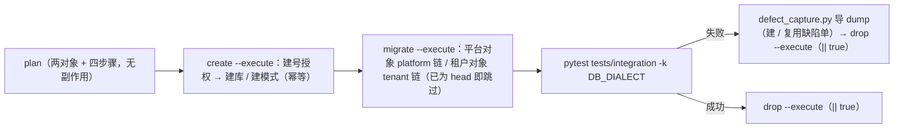
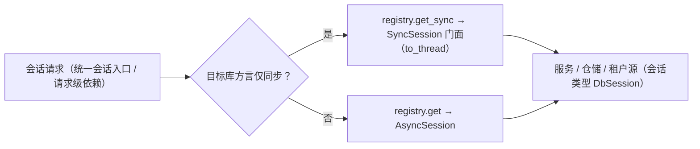

# 三库真库集成与达梦实测详细设计

> 后端基座与服务化地基 · 01 后端基座真实实现 · 05 三库真库集成与达梦实测 · 详细设计

[文档首页](../../../../../../文档首页.md) › [05 三库真库集成与达梦实测](../01_后端基座真实实现_05_三库真库集成与达梦实测.md) › 01 详细设计　|　[父任务：后端基座真实实现](../../01_后端基座真实实现.md) · [本阶段需求](../../../../需求/01_需求_后端基座真实实现.md) · [排期计划](../../../../计划/01_计划_后端基座与服务化地基.md)

## 1. 概述 <a id="overview"></a>

- **目标**：把「三库兼容是平台承诺」从**离线断言**推进到**真库实测**——`ops/test_db.py` 由占位改为真实执行（每方言两对象：平台 / 租户，分链建库与迁移、幂等建测试账号与授权、幂等清理）；三库真库集成用例覆盖多数据源路由、迁移结果与表集、租户物理隔离、读写分离副本路由、分片键查询、类型落库往返、排序 NULL 位次、软删除复合唯一语义；达梦方言四项（schema 前缀与标识符大小写 / 复合唯一 NULL 语义 / 布尔与 JSON 落库 / `VARCHAR2(n CHAR)` 字符长度）逐项实测并回写文档；补齐**达梦运行期同步门面**（01_01 / 01_03 归口本任务）使应用运行期在达梦可用；激活 CI `verify/db` 档（建库 → 迁移 → 集成用例 → 失败先导 dump 再清理）。
- **依据**：《架构设计 · 测试与质量》「测试金字塔」「CI 流水线」节；《架构设计 · 数据架构》「迁移策略」节；《架构设计 · 数据访问与分片》「多数据源管理」「读写分离」「查询规范」节；《数据库开发规范》「迁移与建表口径」「SQL 口径（三库兼容）」节；《数据库设计 · 方言特性》（[MySQL](../../../../../../设计/数据库设计/方言特性/01_MySQL.md) / [PostgreSQL](../../../../../../设计/数据库设计/方言特性/02_PostgreSQL.md) / [达梦 DM8](../../../../../../设计/数据库设计/方言特性/03_DM8.md)）；《测试规范》「三库方言测试」「CI 执行策略」节；《部署发布规范》「环境与数据」节；需求 [01-5](../../../../需求/01_需求_后端基座真实实现.md#r01-5)。
- **范围（本任务）**：
  1. **测试库流程真实化**：`ops/test_db.py` 的 `plan` / `create` / `migrate` / `drop` 落地；每方言两对象（平台对象跑 `platform` 链、租户对象跑 `tenant` 链）；`create` 幂等建账号与最小授权，PostgreSQL 建库后转属主；未配置连接串时显式失败（不静默跳过）。
  2. **达梦运行期同步门面**：新增 `app/db/sync.py`（`SyncSession` 门面 + `sync_session_scope`），`EngineRegistry.get_sync` / `is_sync_only`，会话入口按方言分流（`session_scope` 与请求级依赖），服务 / 仓储 / 租户源会话类型放宽为公共契约 `DbSession`。
  3. **真库集成用例**：`tests/integration/test_three_db_integration.py`（方言参数化 + 方言标记，8 个关注点）。
  4. **达梦方言实测用例**：`tests/integration/test_dm8_dialect_measure.py`（四项实测，含差异分支断言）。
  5. **迁移入口收敛**：`app/db/migration.py` 增 `alembic_config` / `head_revision` / `upgrade_chain`，`ops` 三处不再自建 Alembic 配置。
  6. **MySQL 8.4 认证依赖**：新增 `cryptography`（aiomysql 连接 `caching_sha2_password` 账号的冷缓存首连需其完成 RSA 公钥取回）。
  7. **CI `verify/db` 档激活**：三库 job 补 `create / migrate / pytest / 失败先 dump 再 drop` 脚本链路与租户对象变量；创建 `deploy/ci/verify/db` 档文件；三库测试密码作为 masked 变量入 GitLab 项目 CI/CD Variables。
- **不含（明确归口，见第 8 节）**：达梦复合唯一「多 NULL」差异的兜底方案（登记归口，信创适配阶段定案）；`Decimal` 等游标键类型扩展（01_04 遗留）；骨架表迁移（所属阶段）；分片表按月预创建（任务调度阶段）；`ops/init_tenant.py` 在达梦下的种子路径（`_seed` 走异步引擎，达梦需同步门面适配——本任务登记归口）。

## 2. 现状与差距 <a id="gap"></a>

| 关注点 | 现状（01_01 ~ 01_04 交付） | 差距（本任务目标） |
| --- | --- | --- |
| `ops/test_db.py` | `create` / `migrate` / `drop` 纯占位（`--execute` 仅打印占位提示） | 真实执行：每方言两对象、建号与授权、分链迁移、幂等清理、失败显式退出码 1 |
| 测试对象拓扑 | 每方言一库（`bms_test_mysql` / `bms_test_pg` / 模式 `BMS_TEST_DM`） | 每方言两对象（追加租户对象 `_t1`），平台 / 租户分链，贴近真实拓扑 |
| 测试账号 | mjbk 三库均无 `bms_test` 账号 | `create --execute` 幂等建号与最小授权（MySQL 库级 `ALL`、PostgreSQL `CREATEDB` + 属主、达梦 `SYSDBA`） |
| 达梦应用运行期 | `EngineFactory.create` 对 `dm` 抛 `ConfigError`；仅迁移与建删库走 `to_thread` | 同步门面（`SyncSession` + `to_thread`）+ 会话入口分流；运行期可用、真库用例可覆盖仓储 / 租户源路径 |
| 会话类型契约 | 服务 / 仓储 / 租户源均标注 `AsyncSession` | 放宽为公共契约 `DbSession`（异步会话或同步门面） |
| 真库集成用例 | 仅四库连通（`SELECT 1`）与 env 守卫骨架 | 8 个关注点真库断言（多数据源 / 迁移与表集 / 隔离 / 副本路由 / 分片键 / 类型往返 / NULL 位次 / 复合唯一语义） |
| 达梦方言结论 | 仅迁移相关四条实测（01_04） | 四项方言实测（schema 与大小写 / 复合唯一 NULL / 布尔与 JSON / `VARCHAR2` 字符长度）并回写方言文档 |
| 迁移入口 | `ops/migrate_tenants.py` / `ops/init_tenant.py` 各自拼装 Alembic 配置（`SimpleNamespace` 注入 `cmd_opts`） | 收敛到 `app/db/migration.py::upgrade_chain`（`ops` 三处共用） |
| MySQL 8.4 连接 | 依赖未含 `cryptography`（`caching_sha2_password` 冷缓存首连报错） | 依赖补齐，本地与 CI 镜像一致（锁文件变更触发基础镜像重建） |
| CI `verify/db` 档 | 档文件不存在；三库 job 脚本仅 `plan` + `pytest`；缺租户对象变量与测试密码 | 档文件创建 + 变量配齐 + 脚本补齐（建库 → 迁移 → 用例 → 失败先 dump 再清理） |

## 3. 交付物清单 <a id="tree"></a>

```text
backend/
├── pyproject.toml                                    # 修改：新增 cryptography 依赖（MySQL 8.4 caching_sha2_password）
├── uv.lock                                           # 修改：锁文件（触发 CI 基础镜像按哈希重建）
├── app/
│   ├── db/
│   │   ├── sync.py                                   # 新增：同步方言门面（SyncSession / sync_session_scope / DbSession 契约 / is_sync_only_url）
│   │   ├── session.py                                # 修改：DbSession 契约 + 会话入口按方言分流（session_scope / 请求级依赖）
│   │   ├── registry.py                               # 修改：is_sync_only / get_sync（同步引擎缓存）
│   │   ├── engine.py                                 # 修改：is_sync_only_url 公开判定
│   │   ├── unit_of_work.py                           # 修改：会话类型改 DbSession（同步门面同一工作单元）
│   │   ├── admin.py                                  # 修改：公开 run_statements / fetch_rows（测试库建号与授权复用）
│   │   ├── migration.py                              # 修改：alembic_config / head_revision / upgrade_chain（迁移入口收敛）
│   │   └── tenant_source.py                          # 修改：经统一会话入口取数（同步方言可用）
│   ├── repositories/base_db_repository.py            # 修改：会话类型改 DbSession
│   ├── dict/{providers,query,service,sql}.py         # 修改：会话类型改 DbSession
│   └── listing/store.py                              # 修改：会话类型改 DbSession
├── ops/
│   ├── test_db.py                                    # 重写：真实执行（plan / create / migrate / drop + 两对象）
│   ├── migrate_tenants.py                            # 修改：复用升级入口（去 SimpleNamespace 注入）
│   └── init_tenant.py                                # 修改：复用升级入口（去 SimpleNamespace 注入）
└── tests/
    ├── db/test_sync_facade.py                        # 新增：门面行为 / 注册表同步取用 / 请求级依赖分流
    ├── ops/test_test_db.py                           # 重写：两对象清单 / CI 变量一致 / 建号语句 / SQLite 全流程
    └── integration/
        ├── test_three_db_integration.py              # 新增：三库真库集成（8 关注点 × 3 方言）
        ├── test_dm8_dialect_measure.py               # 新增：达梦方言四项实测
        ├── test_db_connectivity_integration.py       # 修改：连通用例接入方言标记
        └── test_tenant_routing_integration.py        # 修改：两对象清单断言

.gitlab-ci.yml                                        # 修改：三库 job 脚本链 + 租户对象变量 + 档位注释转「已开」
deploy/ci/verify/db                                   # 新增：重验证层分档开关（激活三库 job）
deploy/.env.example                                   # 修改：补三个测试密码键位占位

bms文档/
├── 后端基类清单.md                                    # 修改：§5 / §8 / §10（同步门面 / DbSession 契约 / 注册表同步取用 / 迁移入口 / 测试库流程）
├── 规范/后端开发规范.md                                # 修改：「异步与并发」补达梦同步门面口径
├── 规范/数据库开发规范.md                              # 修改：「迁移与建表口径」补测试库流程（对象 / 账号 / 属主 / 分链）与迁移入口
├── 设计/数据库设计/方言特性/01_MySQL.md                # 修改：实测记录（测试库对象与账号、`cryptography` 冷缓存首连）
├── 设计/数据库设计/方言特性/02_PostgreSQL.md           # 修改：实测记录（建库属主与 `public` 模式 CREATE 权限）
├── 设计/数据库设计/方言特性/03_DM8.md                  # 修改：实测记录（复合唯一多 NULL 差异 / JSON 读回字符串 / 两级 schema 与大小写 / 类型映射真库确认）
└── 项目/02_后端基座与服务化地基/…                      # 修改：本任务设计与实施 / 测试记录、任务与父任务状态、计划工时与排期
```

## 4. 领域设计 <a id="design"></a>

### 4.1 测试库流程与对象拓扑 <a id="objects"></a>

**对象清单（唯一事实源，与 CI 变量逐字一致）**：`ops/test_db.py::TEST_DATABASES`（按方言 → 对象），单测断言与 `.gitlab-ci.yml` 的 `BMS_TEST_DB_URL` / `BMS_TEST_TENANT_DB_URL` 一致。

| 方言 | 平台对象（`platform` 链） | 租户对象（`tenant` 链） |
| --- | --- | --- |
| MySQL（`DB_DIALECT=mysql`） | 库 `bms_test_mysql` | 库 `bms_test_mysql_t1` |
| PostgreSQL（`DB_DIALECT=postgres`） | 库 `bms_test_pg` | 库 `bms_test_pg_t1` |
| 达梦 DM8（`DB_DIALECT=dm8`） | 模式 `BMS_TEST_DM` | 模式 `BMS_TEST_DM_T1` |

**执行链与幂等**：



| 项 | 约定 |
| --- | --- |
| 目标名解析 | 连接串库名 / 模式名即目标名；**达梦建删模式用「去模式段」连接串 + 清单内模式名**（模式尚不存在时无法作为连接参数） |
| 管理连接 | `--admin-url` > 管理员密码环境变量推导（`MYSQL_ROOT_PASSWORD` / `POSTGRES_PASSWORD` / `DM8_SYSDBA_PASSWORD`）> 达梦回落目标串；**无管理凭据即跳过建号**（CI 路径账号已存在） |
| 建号与授权 | MySQL：`CREATE USER IF NOT EXISTS 'bms_test'@'%'` + `GRANT ALL ON \`bms\_test%\`.*`；PostgreSQL：存在则 `ALTER ROLE`、否则 `CREATE ROLE … LOGIN CREATEDB`；达梦：无独立测试账号（`SYSDBA` 承载） |
| PostgreSQL 属主 | 由管理员建库时属主为管理员，`public` 模式在 PostgreSQL 15+ 默认不授予非属主 `CREATE` → 建库后 `ALTER DATABASE … OWNER TO bms_test`（CI 路径库由测试账号自建，属主已是自身，空操作） |
| 迁移 | `app/db/migration.py::upgrade_chain`（程序化 Alembic，`-x url=` / `-x schema=`）；达梦传 `-x schema=<模式名>` 并结束隐式事务（01_04 口径） |
| 失败处置 | 单对象失败记失败项、其余继续；末尾汇总并退出码 1；未配置连接串即失败（不静默跳过） |

### 4.2 达梦运行期同步门面与会话入口分流 <a id="sync-facade"></a>

达梦官方驱动 `dmPython` **无异步方言**，故新增 `app/db/sync.py` 作为「同步方言的异步门面」：

| 成员 | 说明 |
| --- | --- |
| `SyncSession` | 包装阻塞 `Session`；`execute` / `add` / `delete` / `refresh` / `get` / `flush` / `commit` / `rollback` / `close` / `get_bind` 经 `asyncio.to_thread` 执行；`raw` 暴露底层会话作逃生口；支持 `async with` |
| `sync_session_scope(engine)` | 开阻塞会话 → 让出门面 → 关闭（异常原样上抛） |
| `DbSession`（type 别名） | 会话公共契约：`AsyncSession \| SyncSession`；**新增会话方法须在契约与两处实现同步** |
| `is_sync_only_url(url)` | 方言判定（`dm` 为同步方言）；由 `EngineFactory` 复用 |



- **注册表**：新增 `is_sync_only(db_key)`（按目标连接串判定）与 `get_sync(db_key, *, read_only)`（同步引擎按 `(db_key, role)` 缓存，平台键常驻、租户键随 `release` 回收）；异步 `get` 对同步方言仍抛 `ConfigError`（保持「不静默降级」）。
- **分流落点**：`session_scope`（统一会话入口）与请求级依赖 `get_db` / `get_read_db` / `get_write_db` / `get_uow`；降级守卫抽出 `_guard_degraded` 供两条路径共用（同步方言同样禁止降级态写）。
- **类型放宽**：`unit_of_work` / `base_db_repository` / `dict/{providers,query,service,sql}` / `listing/store` / `tenant_source` 的会话类型由 `AsyncSession` 改为 `DbSession`（仅类型标注变化，运行期语义不变）。
- **边界**：门面只覆盖服务 / 仓储 / 租户源实际使用的方法集；事务边界仍归 `DbUnitOfWork`（同步门面下同一工作单元）。

### 4.3 真库集成用例设计 <a id="cases"></a>

`tests/integration/test_three_db_integration.py`：`dialect` 夹具按 `mysql` / `postgres` / `dm8` 参数化（参数 id 与用例名均含方言标识，并挂 `dialect_*` 标记，`-k` 与 `-m` 双路可命中）；`urls` 夹具校验两个 env 与方言一致，否则跳过。

| 关注点 | 断言要点 |
| --- | --- |
| 多数据源路由 | 平台 / 租户两对象连接串互异且与清单一致；两对象各可查询 |
| 迁移结果与表集 | 两对象分别处于各自链 head；链表逐表可查询（表集取自链注册表，不复制清单） |
| 租户隔离 | 平台对象可查 `sys_tenant`、不可查 `sys_dict_type`；租户对象反之（不同物理对象） |
| 读写分离路由 | 配置副本后只读请求命中副本引擎（副本 URL）、写路径绑主引擎；副本上 `SELECT` 成功（**不搭真实主从**，与「副本路由属待验」口径一致） |
| 分片 | 缺省路由契约（不路由）+ 真库按分片键（日期列）条件查询；分片表预创建归任务调度阶段 |
| 类型落库往返 | 布尔 / JSON / 日期 / 字符串写入读回一致；布尔条件查询参数化（`flag = :flag`，避免方言字面量差异） |
| 排序 NULL 位次 | 升 / 降序下 NULL 恒排末位（`order_criteria` 生成 `列 IS NULL` 排序键的真库取证） |
| 软删除复合唯一语义 | MySQL / PostgreSQL：未删行多 NULL 共存；达梦：已知差异（见 4.4）；三者共同成立「软删后同键可复用」 |

### 4.4 达梦方言实测四项与差异登记 <a id="dm8"></a>

`tests/integration/test_dm8_dialect_measure.py`（`dialect_dm8` 标记，env 守卫）：

| # | 实测项 | 实测结论 |
| --- | --- | --- |
| 1 | schema 前缀与标识符大小写 | URL 的模式段即 dmPython `schema` 连接参数（连接落在该模式内，迁移脚本不写模式前缀）；库内对象名大写、方言反射归一为小写；小写书写经折叠可用 |
| 2 | 软删除复合唯一 NULL 语义 | **已知差异**：达梦把复合唯一中的 NULL 视为相等 → 第二条同键未删行被唯一约束拒绝（`-6602`）；软删后同键可复用 |
| 3 | 布尔与 JSON 落库 | 布尔落 `SMALLINT`（0/1）且 ORM 往返正确；JSON 写入正确但**经 dmPython 读回为字符串**（应用层需 `json.loads`） |
| 4 | `VARCHAR2(n CHAR)` | 长度按**字符**计（16 个中文字符可写入、17 个被拒），与 MySQL / PostgreSQL 语义一致 |

**差异处置（已确认）**：① 复合唯一多 NULL 差异——本任务只登记差异、影响面与归口（计划「后续阶段待办」，信创适配阶段先排查达梦实例 / 建库选项能否恢复多 NULL 再定案），**不改平台统一口径与表结构**；用例断言达梦现状行为（三库分支断言，保持 CI 绿且有回归保护）。② JSON 读回字符串——用例归一化断言并回写方言文档，按影响面归口后续（模块若直接下标访问 JSON 字段需适配）。

### 4.5 迁移入口收敛 <a id="migration-entry"></a>

`app/db/migration.py` 增三个公开入口，`ops` 三处（`migrate_tenants` / `init_tenant` / `test_db`）统一复用：

| 成员 | 说明 |
| --- | --- |
| `alembic_config(chain)` | 该链 Alembic 配置（配置段 = 链名；`alembic.ini` 定位基于本模块路径） |
| `head_revision(chain)` | 该链 head 版本号（空链返回 `None`） |
| `upgrade_chain(chain, url, *, schema="")` | 程序化执行该链 `upgrade head`（注入 `-x url=` / `-x schema=`；达梦走同步引擎分支） |

- 效果：`ops/migrate_tenants.py` / `ops/init_tenant.py` 去掉各自拼装的 `Config` / `ScriptDirectory` / `SimpleNamespace(cmd_opts)`，可用性与 01_04 行为一致（`--dry-run` / 幂等 / 汇总口径不变）。

### 4.6 MySQL 8.4 认证依赖 <a id="cryptography"></a>

- MySQL 8.4 默认认证插件为 `caching_sha2_password`；`aiomysql` 在**非 TLS** 连接下完成首次（冷缓存）认证需 RSA 公钥取回，缺 `cryptography` 直接报 `cryptography package is required for sha256_password or caching_sha2_password auth methods`（真库实测暴露）。
- 处置：`backend/pyproject.toml` 增 `cryptography>=44.0`（实测安装 50.0.1）。锁文件变更 → CI `ci-base-build` 按哈希自动重建 `ci-backend:py314`（同宿主 daemon，本流水线即用新镜像）。

### 4.7 CI `verify/db` 档激活与失败 dump 链路 <a id="ci"></a>

| 项 | 约定 |
| --- | --- |
| 档文件 | 新增 `deploy/ci/verify/db`（删除即关档；列出管控 job、前置变量、测试对象） |
| 变量 | masked：`MYSQL_TEST_PASSWORD` / `POSTGRES_TEST_PASSWORD` / `DM8_TEST_PASSWORD`（测试库连接与建号）；既有 `MYSQL_ROOT_PASSWORD`（MySQL 缺陷现场 dump）与 `GITLAB_API_TOKEN`（缺陷单） |
| job 变量 | 每 job 补 `BMS_TEST_TENANT_DB_URL`（租户对象）、`TEST_DB_NAME` / `DUMP_PORT` / `DUMP_USER` / `DUMP_PASSWORD`（dump 链路） |
| 脚本链 | `plan` → `create --execute` → `migrate --execute` → `pytest tests/integration -k "$DB_DIALECT" -v` → 失败：`defect_capture.py --engine`（先 dump 后清理）→ `drop --execute`（`|| true`）→ 退出码 1；成功：`drop --execute` |
| dump 主机 | 由 `BMS_TEST_DB_URL` 解析主机（不在 job 变量里再写内网地址） |

## 5. 失败分支与边界 <a id="failures"></a>

| 场景 | 处理 |
| --- | --- |
| 未配置 `BMS_TEST_DB_URL` / `BMS_TEST_TENANT_DB_URL`（`--execute`） | 记失败项、汇总、退出码 1（不静默跳过） |
| 连接串方言与 `DB_DIALECT` 不一致 | 用例 `pytest.skip`（不误判失败）；脚本仍按清单库名执行 |
| MySQL 冷缓存首连（无 `cryptography`） | 依赖缺失即报错（本次实测暴露并修正）；修正后与 CI 镜像一致 |
| PostgreSQL 建库属主非测试账号 | 建库后 `ALTER DATABASE … OWNER TO`（管理员连接可用时）；否则迁移报 `permission denied for schema public`（错误信息即提示） |
| 达梦建删模式 | 必用「去模式段」连接串 + 显式模式名；迁移 `-x schema=<模式名>` |
| 达梦复合唯一多 NULL | 按实测现状断言（差异已登记），不改口径、不静默放宽 |
| 达梦 JSON 读回字符串 | 用例归一化（`json.loads`），差异已登记 |
| 达梦目标进异步 `registry.get` | 抛 `ConfigError`（不静默降级）；调用方须经统一会话入口（自动分流） |
| 异步方言进 `get_sync` | 抛 `ConfigError`（`platform` 键与租户键均按 URL 判定，不匹配即拒绝） |
| 测试对象已存在 / 已为 head | 幂等：建库「已存在（跳过）」、迁移「已是最新」 |
| 删对象不存在 | 幂等：「不存在（跳过）」；CI 清理用 `|| true` 不覆盖原失败结论 |
| 单对象失败 | 其余对象继续执行；末尾汇总失败项并退出码 1 |

## 6. 测试设计与验收映射 <a id="tests"></a>

用例先登记 Kiwi TCMS（本任务登记 **1 条**，编号以平台回读为准，见第 9 节）。

| Kiwi | 用例 | 类型 | 断言要点 |
| --- | --- | --- | --- |
| 见 §9 | 三库真库集成与达梦实测 | 集成 + 单元 | 见下表 |
| 见 §9 | 真库集成（8 关注点 × 3 方言） | 集成 | 多数据源路由 / 迁移与表集 / 租户隔离 / 副本路由 / 分片键 / 类型往返 / NULL 位次 / 复合唯一语义 |
| 见 §9 | 达梦方言四项实测 | 集成 | schema 与大小写 / 复合唯一 NULL（差异分支）/ 布尔与 JSON / `VARCHAR2` 字符长度 |
| 见 §9 | 测试库流程脚本 | 单元 | 两对象清单与 CI 变量逐字一致 / 建号语句 / 管理连接推导 / SQLite 全流程（建对象 → 分链迁移幂等 → 删对象幂等）/ 未配置连接串失败 |
| 见 §9 | 达梦同步门面与会话分流 | 单元 | `is_sync_only` 判定 / 门面 CRUD 与事务 / 注册表 `get_sync` 缓存与 `get` 拒绝 / `session_scope` 与请求级依赖分流 |
| 见 §9 | 既有回归 | 单元 | 全量 `pytest` / `ruff` / `pyright` 全绿（会话类型放宽与迁移入口收敛无回归） |

验收映射：

| 完成标准（需求 01-5） | 验证方式 |
| --- | --- |
| 三库真库集成用例全绿 | mjbk 常驻三库实跑（见测试记录 §3） |
| 达梦方言实测结论登记（差异与处置） | 达梦方言四项用例 + 三份方言特性文档回写 |
| CI `verify/db` 档可运行且通过 | `deploy/ci/verify/db` 档文件 + 三库 job 实跑（推送后核验）+ masked 变量齐备 |
| `pytest` / `ruff` / `pyright` 全绿 | 门禁命令（新增与改动模块覆盖率记录见测试记录） |

## 7. 登记落点 <a id="registry-writeback"></a>

| 落点 | 内容 |
| --- | --- |
| 《后端基类清单》 | §5 会话入口分流与 `DbSession` 契约；§8 新增 `app/db/sync.py`（`SyncSession` / `sync_session_scope`）、注册表 `get_sync` / `is_sync_only`、`ops/test_db.py`；§10 登记 |
| 《后端开发规范》 | 「异步与并发」补同步方言门面口径（何时分流、会话契约维护要求） |
| 《数据库开发规范》 | 「迁移与建表口径」补测试库流程（两对象 / 分链 / 建号与授权 / PostgreSQL 属主 / 达梦模式）与迁移入口 |
| 《数据库设计 · 方言特性》 | MySQL / PostgreSQL / 达梦三份实测记录（达梦重点：复合唯一多 NULL 差异、JSON 读回字符串、schema 与大小写、类型映射真库确认） |
| 计划 | §1 工时台账；§2 已完成表（01_05 行）；§3 移除 01_05；§4 甘特移除已完成节点；「后续阶段待办」登记达梦唯一兜底与 JSON 适配 |
| 任务 / 父任务 | 状态两处一致（需求文档不承载进度） |
| Kiwi TCMS | 登记本任务策展用例并回读编号（`@pytest.mark.kiwi_id`） |
| 实施 / 测试记录 | 任务目录 `实施/`、`测试/` 各一份（含三库实跑明细与达梦差异取证） |
| 测试资产仓 | `scripts/kiwi/cases|exports/2026-09-22_阶段二01-05_*` 与用例台账 |

## 8. 边界与开放项 <a id="boundary"></a>

- **归信创适配阶段**：达梦复合唯一「多 NULL」差异的兜底方案（先排查达梦实例 / 建库选项能否恢复多 NULL；否则评估应用层唯一校验或哨兵值方案）——本任务只登记差异、影响面与归口。
- **归后续（按需）**：JSON 字段在达梦下读回为字符串的适配（若有模块直接下标访问 JSON 字段）；`ops/init_tenant.py` 在达梦下的种子路径（`_seed` 现走异步引擎，达梦需经同步门面）；游标键支持类型范围（`Decimal` 等，01_04 遗留）。
- **归所属阶段 / 任务**：骨架表迁移、分片表按月预创建、每服务每租户建库与多服务迁移编排。
- **开放项**：只读副本为同实例另一连接串（真实主从复制未搭建，副本谓词仍属「待验」）；`BMS_TEST_TENANT_DB_URL` 与平台对象同实例同账号（不同库 / 模式），未引入独立租户实例；CI 基础镜像重建依赖 `ci-base-build`（锁文件变更触发）。
- **不改**：`_apply_sort` 白名单机制、排序与游标契约（01_04 口径）、`app/db/admin.py` 建删库语义（仅新增两个公开执行入口）。

## 9. 实施步骤 <a id="steps"></a>


1. 读《KiwiTCMS 部署使用说明》「用例约定」节，登记本任务用例并**回读编号**（输入文件落测试仓 `scripts/kiwi/cases/`）。
2. `app/db/sync.py` + `engine.py::is_sync_only_url` + `registry.py::is_sync_only|get_sync`。
3. `session.py` 分流（`session_scope` + 请求级依赖 + 降级守卫抽取）+ `unit_of_work` / 服务 / 仓储 / 租户源会话类型放宽。
4. `migration.py` 迁移入口 + `ops/migrate_tenants.py` / `ops/init_tenant.py` 复用；`admin.py` 公开执行入口。
5. `ops/test_db.py` 真实执行（清单 / 建号 / 建库 / 分链迁移 / 清理 / 失败汇总）。
6. 用例：真库集成 8 关注点、达梦方言四项、门面与会话、测试库脚本；`pyproject` 登记方言标记。
7. `cryptography` 依赖 + `.gitlab-ci.yml` 脚本链与变量 + `deploy/ci/verify/db` 档 + `.env.example` 键位。
8. 本地真库实跑（建号 → 建对象 → 分链迁移 → 用例），达梦差异取证与处置回写设计。
9. 门禁：`uv run pytest -q --cov=app --cov-branch` / `ruff check` / `ruff format --check` / `pyright`；基座与文档校验脚本。
10. 登记回写 + 实施 / 测试记录 + 提交（代码与文档分开）。

关键命令：

```bash
cd backend
set -a && . ../deploy/.env && set +a    # 取测试密码与管理密码（本地凭据文件，不入库）
export BMS_TEST_DB_URL="mysql+aiomysql://bms_test:$MYSQL_TEST_PASSWORD@<mjbk>:3306/bms_test_mysql"
export BMS_TEST_TENANT_DB_URL="mysql+aiomysql://bms_test:$MYSQL_TEST_PASSWORD@<mjbk>:3306/bms_test_mysql_t1"
uv run python -m ops.test_db plan --engine mysql
uv run python -m ops.test_db create --engine mysql --execute
uv run python -m ops.test_db migrate --engine mysql --execute
uv run pytest tests/integration -k mysql -v
uv run ruff check . && uv run ruff format --check . && uv run pyright
uv run pytest -q --cov=app --cov-branch
python3 ../scripts/tools/base-check/check-backend-base.py
```

## 10. 决策记录（对齐记录） <a id="align"></a>

| # | 事项 | 结论（逐项确认） |
| --- | --- | --- |
| 1 | 达梦运行期门面 | **纳入，最小可用形态**（会话 / 租户源入口对 `dm` 走同步引擎 + `asyncio.to_thread` 门面；兑现 01_01 / 01_03 归口） |
| 2 | 真库拓扑 | **每方言 2 个对象**（平台 + 租户 `_t1`；达梦为两个模式） |
| 3 | 测试账号 | 由 `ops/test_db.py create --execute` 幂等创建（建库 / 建模式 + 建号 + 最小授权；管理连接用 root / postgres / SYSDBA） |
| 4 | `verify/db` 档 | **本任务激活**（档文件 + 3 个 masked 变量 + 推送 main 实跑确认） |
| 5 | 迁移链口径 | 平台对象跑 `platform` 链、租户对象跑 `tenant` 链（单库单链） |
| 6 | 达梦实测落点 | 自动化用例 + 文档回写（三份方言特性文档与类型映射结论） |
| 7 | CI 失败 dump | 补齐并接入「失败先导 dump 再清理」链路 |
| 8 | 方言过滤口径 | marker（`dialect_mysql` / `dialect_postgres` / `dialect_dm8`）+ 用例名含方言（双保险） |
| 9 | 读写分离 | 真库只断言副本路由（不搭真实主从） |
| 10 | 分片范围 | 只做路由与分片键断言；分片表预创建归任务调度阶段 |
| 11 | 凭据落地 | 脚本生成随机强密码 → GitLab 3 个 masked 变量 + 本地资源文档与 `deploy/.env`（`.env.example` 补占位） |
| 12 | Kiwi 用例 | 1 条（编号以平台回读为准） |
| 13 | 达梦复合唯一多 NULL 差异 | **登记差异 + 另立任务定案**（保持平台统一口径与表结构不变；信创适配阶段先排查实例 / 建库选项） |
| 14 | 差异的用例表达 | 用例显式分支断言达梦现状行为（MySQL / PostgreSQL 断言多 NULL 共存） |
| 15 | 达梦 JSON 读回字符串 | 登记差异 + 用例归一化断言（应用层 `json.loads`），影响面归口后续 |
| 16 | 迁移入口收敛（实施中新增） | 新增 `alembic_config` / `head_revision` / `upgrade_chain`，`ops` 三处不再自建 Alembic 配置（不改行为） |
| 17 | MySQL 认证依赖（实施中新增） | 新增 `cryptography`（真库实测暴露；锁文件变更触发 CI 基础镜像重建） |
| 18 | PostgreSQL 建库属主（实施中新增） | 管理员建库后 `ALTER DATABASE … OWNER TO` 测试账号（PostgreSQL 15+ `public` 模式默认不授予非属主 `CREATE`） |

## 11. 参考文档 <a id="ref"></a>

- [架构设计 · 数据访问与分片](../../../../../../设计/架构设计/13_架构设计_子系统_数据访问与分片.md)「多数据源管理」「读写分离」「查询规范」节
- [架构设计 · 数据架构](../../../../../../设计/架构设计/07_架构设计_数据架构.md)「迁移策略」节
- [数据库设计 · 方言特性 · MySQL](../../../../../../设计/数据库设计/方言特性/01_MySQL.md)、[PostgreSQL](../../../../../../设计/数据库设计/方言特性/02_PostgreSQL.md)、[达梦 DM8](../../../../../../设计/数据库设计/方言特性/03_DM8.md)
- [数据库开发规范](../../../../../../规范/数据库开发规范.md)「迁移与建表口径」「SQL 口径（三库兼容）」节、[测试规范](../../../../../../规范/测试规范.md)「三库方言测试」「CI 执行策略」节
- [后端基类清单](../../../../../../后端基类清单.md)「数据访问与多租户基座」节、[后端开发规范](../../../../../../规范/后端开发规范.md)「异步与并发」节
- [01_04 详细设计](../../01_后端基座真实实现_04_Alembic 迁移与排序 DB 侧/设计/01_详细设计_04_Alembic 迁移与排序 DB 侧.md)、[01_01 详细设计](../../01_后端基座真实实现_01_数据访问底座落库/设计/01_详细设计_01_数据访问底座落库.md)、[01_02 详细设计](../../01_后端基座真实实现_02_多租户数据拓扑落库与实测/设计/01_详细设计_02_多租户数据拓扑落库与实测.md)、[01_03 详细设计](../../01_后端基座真实实现_03_BaseRepository 异步与 BaseModel 落库/设计/01_详细设计_03_BaseRepository 异步与 BaseModel 落库.md)
- [需求 01-5：三库真库集成与达梦方言实测 + CI 三库 job](../../../../需求/01_需求_后端基座真实实现.md#r01-5)
- [KiwiTCMS 部署使用说明](../../../../../../资料/开发服务器/linux/KiwiTCMS部署使用说明.md)「用例约定」节

> 本文档依《[文档生成规范](../../../../../../规范/文档生成规范.md)》编写 · 关键决策逐项确认
