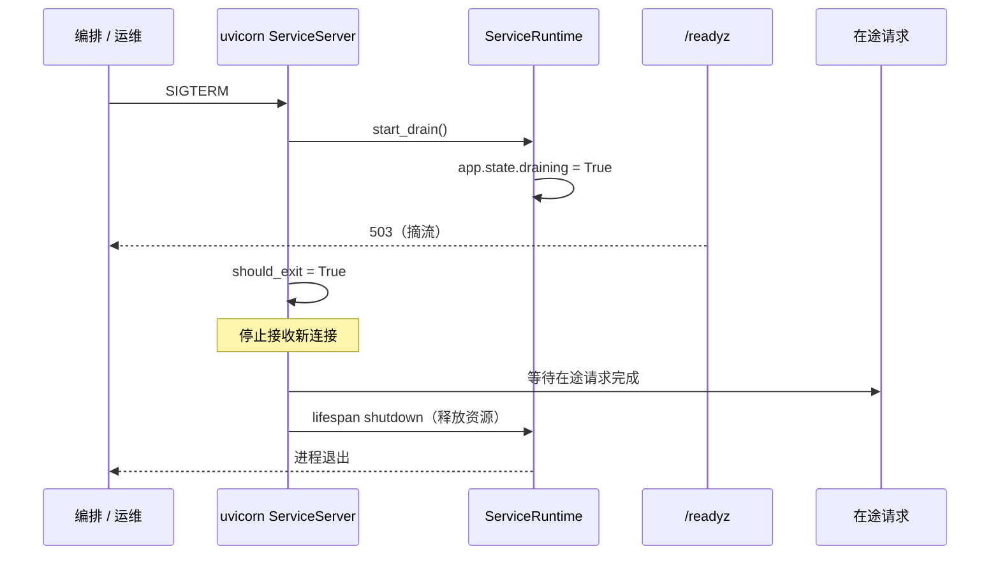

# 服务运行与健康检查详细设计

> 后端基座与服务化地基 · 02 多服务骨架与仓库 · 02 服务运行与健康检查 · 详细设计

[文档首页](../../../../../../文档首页.md) › [02 服务运行与健康检查](../02_多服务骨架与仓库_02_服务运行与健康检查.md) › 02 详细设计　|　[父任务：多服务骨架与仓库](../../02_多服务骨架与仓库.md) · [本阶段需求](../../../../需求/02_需求_多服务骨架与仓库.md) · [排期计划](../../../../计划/01_计划_后端基座与服务化地基.md)

## 1. 概述 <a id="overview"></a>

- **目标**：在 02_01 交付的 monorepo 工程骨架上，补齐「每服务可独立启动、可探活、可优雅停机」的运行能力——抽出**统一服务运行时基座**（服务身份 / 结构化日志绑定 / 停机摘流 / 配置驱动启动入口），平台服务与脚手架生成服务同构接入，使「每服务独立启动并暴露探针、就绪失败 503、SIGTERM 优雅摘流」可执行验证。
- **依据**：《架构设计 · 可观测性》「健康检查与优雅停机」节、《架构设计 · 部署与运维》「基础设施编排」「配置分层」节；《后端开发规范》「目录与分层职责」「后端基座体系」「日志与可观测性」节；《日志规范》「上下文字段」节；需求 [02-2](../../../../需求/02_需求_多服务骨架与仓库.md#r02-2)。
- **范围（本任务）**：
  1. **服务身份**：新增统一身份解析（服务包声明默认名 + `[app].service` 可覆盖，配置默认置空、启动回写解析结果），版本取服务包 `__version__`；身份注入结构化日志上下文（`service` / `service_version`）与探针响应。
  2. **每服务独立启动**：新增配置驱动的服务启动入口 `python -m bms_<服务名>`（读 `[server]` 的 host / port 程序化启动 uvicorn，单进程）。
  3. **探针与依赖就绪聚合**：沿用 02_01 的 `/healthz` `/readyz` 注册表聚合（`redis` / `database` 检查项），两探针响应追加 `service` / `version`；停机中 `/readyz` 返回 503。
  4. **优雅停机**：自定义 uvicorn `Server` 覆写 `handle_exit`——SIGTERM / SIGINT 到达即置 `draining`（`/readyz` 503 摘流），再链式调用 uvicorn 默认优雅收尾（等待在途完成、跑 lifespan shutdown、释放资源）。
  5. **同构接入**：平台服务 `bms_platform` 接入统一运行时；`scripts/new_service.py` 脚手架模板同步升级（生成件即含服务身份、启动入口、优雅停机）。
- **不含（明确归口，见第 8 节）**：minio 等检查项（随文件管理阶段）；每服务独立配置与迁移链（06_需求）；按服务归因的 OTel 指标 / 链路资源标签（08_02）；多 worker / 多副本（交编排）。

## 2. 现状与差距 <a id="gap"></a>

| 关注点 | 现状（02_01 交付后） | 差距（本任务目标） |
| --- | --- | --- |
| 服务身份 | `[app].service` 硬编码 `platform`；`bms_platform.__version__` 仅进应用 title / 根路由 | 身份统一解析（包声明 + 配置覆盖）、注入日志上下文与探针响应；配置默认置空、启动回写 |
| 日志 | structlog 全局结构化（上下文 / 脱敏 / dev console · test·prod JSON），无服务标识 | 每条日志自动携带 `service` / `service_version`（进程级绑定） |
| 独立启动 | 仅 `uvicorn bms_platform.asgi:app --port 8000` 手工命令 | 配置驱动入口 `python -m bms_<服务名>`（读 `[server]`） |
| 探针 | `/healthz` `{"status":"ok"}`、`/readyz` `{status,checks}`，注册表聚合（redis / database） | 两探针追加 `service` / `version`；停机中 `/readyz` 503 |
| 优雅停机 | 仅 lifespan 关闭置 `startup_complete=False`（此时在途已排空，摘流滞后于排空） | 信号到达即置 `draining` 摘流，再优雅收尾 |
| 脚手架 | 生成服务最小 `main.py`（未接入装配，`/readyz` 无法解析注册表；无启动入口 / 身份 / 停机） | 模板同构接入统一运行时，生成件即可独立运行并探活 |

## 3. 交付物清单 <a id="tree"></a>

```text
backend/
├── config.toml                          # 改：[app].service 置空（默认取服务包声明，启动回写）
├── .env.example                         # 改：BMS_APP__SERVICE 注释为可选覆盖
├── README.md                            # 改：快速启动补 python -m bms_platform
├── scripts/
│   └── new_service.py                   # 改：模板升级（身份 + __main__ + 运行时接入）
├── libs/bms_core/
│   ├── src/bms_core/
│   │   ├── core/
│   │   │   ├── service.py               # 新：服务身份解析 + 运行时（日志绑定 / 停机摘流）
│   │   │   ├── run.py                   # 新：配置驱动启动入口 + ServiceServer（drain 优先）
│   │   │   ├── logging.py               # 改：处理器链加 structlog.contextvars.merge_contextvars
│   │   │   └── config.py                # 改：AppSettings.service 默认置空
│   │   └── api/
│   │       └── health.py                # 改：两探针追加 service/version；draining → 503
│   └── tests/
│       └── core/                        # 新：test_service_runtime.py / test_run.py（+ test_config 调整）
└── services/platform/
    ├── src/bms_platform/
    │   ├── __init__.py                  # 改：新增 SERVICE_NAME / SERVICE_TITLE 声明
    │   ├── main.py                      # 改：接入统一运行时（身份 + 运行时实例）
    │   └── __main__.py                  # 新：python -m bms_platform 启动入口
    └── tests/                           # 改/新：探针契约用例更新 + 运行时 / 停机用例
```

## 4. 领域设计 <a id="design"></a>

### 4.1 服务身份与解析 <a id="identity"></a>

统一身份契约 `ServiceIdentity`（`bms_core/core/service.py`，继承 `BaseObject`，frozen 数据对象）：`name` / `version` / `title`。

解析口径（`attach_service` 助手，见 4.2）：

| 项 | 取值 |
| --- | --- |
| `name` | `settings.app.service` 去空白后非空则取之（配置覆盖），否则取服务包声明 `declared_name`；**解析结果回写 `settings.app.service`**（供连接池按服务覆盖与租户库 `url_template` 的 `{service}` 占位取到正确服务名） |
| `version` | 服务包 `__version__`（由服务工厂显式传入） |
| `title` | 服务中文名（由服务工厂显式传入，用于应用 title） |

- 服务包声明：各服务 `__init__.py` 声明 `SERVICE_NAME`（`bms_<名>` → `<名>`）与 `SERVICE_TITLE`；平台服务为 `platform` / `BMS 基础管理系统`。
- 配置默认置空：`[app].service` 默认由 `""` 起（`config.toml` 移除硬编码 `platform`，`.env.example` 将其注明为可选覆盖），从根本上消除「新服务读共享配置被误判为 platform」。
- 回写语义：仅当配置为空时回写；配置非空（显式指定）时保持配置值。

### 4.2 服务运行时基座 <a id="runtime"></a>

`ServiceRuntime`（`bms_core/core/service.py`，继承 `BaseObject`）：

| 成员 | 语义 |
| --- | --- |
| `identity` | 解析后的 `ServiceIdentity` |
| `draining` | 是否正在停机摘流（读 `app.state.draining`） |
| `start_drain()` | 幂等：置 `app.state.draining = True` 与 `app.state.startup_complete = False`，记一条 `service_shutdown_started` 日志（含服务标识） |
| `attach_service(app, *, declared_name, version, title, settings=None)` | 助手：解析身份 → `bind_service_identity`（进程级日志上下文）→ 构造运行时并落 `app.state.service_runtime` / `app.state.service_identity` / `app.state.draining=False` |

- 身份注入日志：`bind_service_identity` 经 `structlog.contextvars.bind_contextvars(service=..., service_version=...)` 写进程级上下文；`core/logging.py` 处理器链首部加 `structlog.contextvars.merge_contextvars`，使绑定字段对业务日志与第三方 stdlib 日志一并生效（业务代码零改动）。
- 探针读取：`bms_core/api/health.py` 从 `request.app.state.service_identity` 取身份（缺省则不附加字段，兼容未接入运行时的最小应用）。

### 4.3 配置驱动启动入口 <a id="run"></a>

`bms_core/core/run.py`：

- `ServiceServer(uvicorn.Server)`：覆写 `handle_exit(sig, frame)`——先调用注入的停机回调（`ServiceRuntime.start_drain`，信号到达即摘流），再 `super().handle_exit`（置 `should_exit`，由 uvicorn 完成停止接收新连接 → 等待在途 → lifespan shutdown → 释放资源）。
- `build_server(settings, app, *, on_drain) -> ServiceServer`：按 `[server]` 的 `host` / `port` 构造 `uvicorn.Config`（`log_config=None` / `access_log=False`，日志统一走 structlog）。
- `run_service(factory)`：`get_settings()` → `configure_logging` → `factory().create(None)` → 取 `app.state.service_runtime` 作停机回调 → `build_server(...).run()`。
- 服务入口：各服务 `__main__.py` 仅 `run_service(ApplicationFactory)`，命令统一为 `python -m bms_<服务名>`。
- **单进程口径**：入口按单进程（`workers=1`）启动，信号 drain 可靠；多副本 / 多 worker 由 Docker Compose / K8s 横向扩容承担（一服务一容器），`[server].workers` 在多副本形态下由编排使用。

### 4.4 探针与依赖就绪聚合 <a id="health"></a>

`bms_core/api/health.py`（沿用 02_01 注册表聚合，仅追加身份与摘流判定）：

| 探针 | 200 响应 | 503 响应 |
| --- | --- | --- |
| `/healthz` | `{"status":"ok","service":<名>,"version":<版>}`（不触依赖） | — |
| `/readyz` | `{"status":"ok","service":<名>,"version":<版>,"checks":{<依赖>:{ok,error}}}` | 启动未完成或**停机中**：`{"status":"down","service":<名>,"version":<版>,"checks":{}}`；依赖未就绪：`checks` 含各项、`error` 仅异常类名 |

- 摘流判定次序：`app.state.draining` 或 `not app.state.startup_complete` → 503 空 checks（不执行依赖探测）；否则聚合注册表。
- 依赖就绪聚合不变：`redis`（`PING`）/ `database`（平台库 `SELECT 1`）检查项；单项 / 整体两级超时；`minio` 检查项随文件管理阶段接入（本任务不接）。
- 探针豁免统一响应包裹与鉴权 / 限流的既有口径不变。

### 4.5 优雅停机时序 <a id="shutdown"></a>



- 关键点：**摘流先于排空**——信号一到达就置 `draining`，编排探针随即 503，不再路由新流量；uvicorn 随后完成在途与资源释放。
- 二次信号（ctrlc）仍按 uvicorn 语义强制退出。

### 4.6 平台服务接入 <a id="platform"></a>

- `bms_platform/__init__.py`：新增 `SERVICE_NAME = "platform"`、`SERVICE_TITLE = "BMS 基础管理系统"`（`__version__` 保留）。
- `bms_platform/main.py`：`ApplicationFactory.create` 中经 `attach_service(app, declared_name=SERVICE_NAME, version=__version__, title=SERVICE_TITLE, settings=settings)` 接入运行时；`app` 标题 / 根路由取身份。
- `bms_platform/__main__.py`：`run_service(ApplicationFactory)` 启动入口。
- 不改：路由前缀与响应体（探针除外，见 4.4）、中间件顺序、插件装配语义、迁移链路与表集、四库方言行为。

### 4.7 脚手架同步升级 <a id="scaffold"></a>

`scripts/new_service.py` 模板升级，生成件即同构接入：

- `__init__.py` 模板加 `SERVICE_NAME` / `SERVICE_TITLE`；
- `main.py` 模板经 `attach_service` 接入运行时（`/healthz` `/readyz` 经共享库探针与身份）；最小服务暂无依赖检查，就绪探针回退 `null` 注册表（空检查项、恒定通过，生成件显式注明「接入依赖后按配置切换实现并登记检查项」），使生成件开箱即「可启动并探活」；
- 新增 `__main__.py` 模板（`python -m bms_<名>`）；
- 生成件的冒烟用例断言应用可构造、标题 / 版本就位、`/healthz` `/readyz` 均返回 200 且携带服务身份。

## 5. 失败分支与边界 <a id="failures"></a>

| 场景 | 处理 |
| --- | --- |
| 配置 `[app].service` 为空 | 取服务包声明并回写 `settings.app.service`；连接池 / 租户模板取到正确服务名 |
| 配置 `[app].service` 显式指定 | 以配置为准（配置覆盖），不回写 |
| 应用未接入运行时 | 探针不附加身份字段（`getattr` 兜底），不抛错 |
| 停机中收到 `/readyz` | 503 空 checks，不做依赖探测 |
| 信号重复到达 | uvicorn 二次信号强制退出（沿用默认语义）；`start_drain` 幂等 |
| 非 HTTP 作用域 | 中间件既有直通口径不变；启动入口不涉及 |
| 未接管信号（如测试内直接构造 app） | `ServiceServer` 仅在 `run_service` 路径建立接管；测试直接断言 `handle_exit` → drain |
| 多 worker | 入口单进程；多 worker / 多副本交编排（本任务不含） |

## 6. 测试设计与验收映射 <a id="tests"></a>

用例先登记 Kiwi TCMS（本任务登记 **1 条**，编号以平台回读为准，见第 9 节）。

| 用例 / 文件 | 类型 | 断言要点 |
| --- | --- | --- |
| `libs/bms_core/tests/core/test_service_runtime.py` | 单元 | 身份解析（配置空 → 包声明 + 回写；配置非空 → 配置优先）；`bind_service_identity` 落地 `service` / `service_version` 上下文，日志处理器链含 `merge_contextvars`；`start_drain` 幂等且置 `draining` / `startup_complete=False` |
| `libs/bms_core/tests/core/test_run.py` | 单元 | `build_server` 取 `[server]` host / port；`ServiceServer.handle_exit` 先调停机回调再置 `should_exit` |
| `services/platform/tests/api/test_health.py`（更新） | 集成 | `/healthz` 与 `/readyz` 响应含 `service=platform` / `version`；依赖失败 503 不泄露；启动未完成 / 停机中 503 空 checks |
| `services/platform/tests/core/test_service_lifecycle.py`（新） | 集成 | 平台应用构造后身份就位；`start_drain` 后 `/readyz` 503；lifespan 退出后资源释放、`startup_complete=False` |
| `libs/bms_core/tests/ops/test_new_service.py`（更新） | 单元 | 脚手架生成件含 `__main__.py` / 身份声明 / 运行时接入，可导入构造应用且探针含身份 |
| 既有全量回归 | 单元 + 集成 | 全量 `pytest` / `ruff` / `pyright` 全绿（无行为回归） |

验收映射：

| 完成标准（需求 02-2） | 验证方式 |
| --- | --- |
| 每服务可独立启动并暴露探针 | 启动入口用例 + 平台应用构造 / 探针用例 |
| 就绪探针聚合依赖且失败返回 503 | `test_health.py`（依赖失败 503 / 未注册省略 / 停机 503） |
| 优雅停机用例通过 | `test_service_runtime.py`（drain 幂等）+ `test_run.py`（handle_exit 顺序）+ `test_service_lifecycle.py`（drain → readyz 503） |
| `pytest` / `ruff` / `pyright` 全绿 | 门禁命令（见第 9 节） |

## 7. 登记落点 <a id="registry-writeback"></a>

| 落点 | 内容 |
| --- | --- |
| 《后端基类清单》 | §7 core 横切基座补「服务运行时基座」（`core/service.py` / `core/run.py`，含身份解析 / 日志绑定 / 停机摘流 / 启动入口） |
| 《架构设计 · 可观测性》 | 「健康检查与优雅停机」节：探针响应补 `service` / `version`；摘流先于排空（`draining` → 503） |
| 《后端开发规范》 | §12「日志与可观测性」补：日志携带 `service` / `service_version`；服务运行与停机走统一运行时基座 |
| 计划 | §1 工时台账与计数；§2 已完成表（02_02 行）；§3 移除 02_02；§4 甘特调整 |
| 任务 / 父任务 | 任务 02 状态与完成日期；父任务域总览子任务表一致 |
| README（backend） | 快速启动补 `uv run python -m bms_platform` 与探针响应含服务身份说明 |
| Kiwi TCMS | 登记本任务用例并回读编号 |
| 测试资产仓 | `scripts/kiwi/cases|exports/` 对应用例与导出 |
| 实施 / 测试记录 | 任务目录 `实施/`、`测试/` 各一份 |

## 8. 边界与开放项 <a id="boundary"></a>

- **归 06_需求**：每服务独立配置（`config.<service>.toml`）与迁移链；本任务沿用 `config.toml` + `config.{env}.toml` + `BMS_` 环境变量。
- **归 08_02**：按服务归因的 OTel 指标 / 链路资源标签（`service.name` / `service.version`）；本任务交付的身份源为其输入。
- **归文件管理阶段**：`minio` 检查项接入 `/readyz`。
- **开放项**：多 worker / 多副本的停机编排（入口单进程）；探针响应追加身份属契约变更，现有消费方为零，前端 / 网关接入时以本响应为准。
- **不改**：路由前缀与业务响应体、中间件顺序、插件装配语义、迁移链路与表集、四库方言行为。

## 9. 实施步骤 <a id="steps"></a>


1. 读《KiwiTCMS 部署使用说明》「用例约定」节，登记本任务用例并**回读编号**。
2. 新增 `bms_core/core/service.py`（身份解析 + 运行时 + `attach_service`）与 `core/run.py`（`ServiceServer` / `build_server` / `run_service`）。
3. 改 `core/logging.py`（加 `merge_contextvars`）、`core/config.py`（`service` 默认置空）、`config.toml` / `.env.example`。
4. 改 `api/health.py`（两探针追加 `service` / `version`；`draining` → 503）。
5. 平台服务接入：`bms_platform/__init__.py`（声明）+ `main.py`（`attach_service`）+ `__main__.py`（入口）。
6. 升级 `scripts/new_service.py` 模板（身份 / 运行时 / `__main__`）。
7. 用例：基座单元（身份 / 日志 / drain / handle_exit）+ 服务集成（探针身份 / drain 503 / 生命周期）+ 脚手架更新 + 既有回归调整。
8. 门禁：`uv run pytest -q --cov=bms_core --cov=bms_platform --cov-branch` / `uv run ruff check .` / `uv run ruff format --check .` / `uv run pyright`；基座校验与边界护栏。
9. 启动冒烟：`python -m bms_platform`（或 TestClient）探针响应含身份。
10. 登记回写 + 实施 / 测试记录 + 提交（代码与文档分开）。

关键命令：

```bash
cd backend
uv sync --frozen
uv run pytest -q --cov=bms_core --cov=bms_platform --cov-branch
uv run ruff check . && uv run ruff format --check . && uv run pyright
uv run python -m bms_platform                       # 服务启动冒烟（Ctrl+C 触发优雅停机）
python3 ../scripts/tools/base-check/check-backend-base.py
python3 ../scripts/tools/base-check/check-service-boundaries.py
```

## 10. 决策记录（对齐记录） <a id="align"></a>

| # | 事项 | 结论（逐项确认） |
| --- | --- | --- |
| 1 | 本任务交付形态 | **统一运行时基座**（`bms_core`），平台服务与脚手架同构接入 |
| 2 | 服务名来源 | **服务包声明默认 + `[app].service` 可覆盖**；配置默认置空、启动回写解析结果 |
| 3 | 服务版本来源 | **服务包 `__version__`** |
| 4 | 日志标识 | **`service` + `service_version`**（structlog 全局上下文） |
| 5 | 启动入口 | **`python -m bms_<服务名>`**（读 `[server]`） |
| 6 | 优雅停机 | **自定义 `Server` 覆写 `handle_exit` 先 drain 再链式** |
| 7 | 探针口径 | **`/healthz` 与 `/readyz`（含 503 分支）均追加 `service` + `version`** |
| 8 | drain 标记 | **独立 `app.state.draining`** |
| 9 | 检查项范围 | **不接 minio**，沿用 `redis` / `database` |
| 10 | 按服务配置 | **不做**，归 06_需求 |
| 11 | Kiwi 用例 | **一条策展用例**（平台骨架 / P2 / CONFIRMED / 自动化） |
| 12 | 脚手架 | **同步升级**为统一运行时接入 |
| 13 | worker 口径 | **单进程**，多副本交编排 |

## 11. 参考文档 <a id="ref"></a>

- [架构设计 · 可观测性](../../../../../../设计/架构设计/27_架构设计_子系统_可观测性.md)「健康检查与优雅停机」节
- [架构设计 · 部署与运维](../../../../../../设计/架构设计/33_架构设计_部署与运维.md)「基础设施编排」「配置分层」节
- [后端开发规范](../../../../../../规范/后端开发规范.md)「目录与分层职责」「日志与可观测性」节
- [日志规范](../../../../../../规范/日志规范.md)「上下文字段」节
- [后端基类清单](../../../../../../后端基类清单.md)「core 横切基座」节
- [需求 02-2：服务运行与健康检查](../../../../需求/02_需求_多服务骨架与仓库.md#r02-2)
- [01 monorepo 多服务工程与共享基座库详细设计](../02_多服务骨架与仓库_01_monorepo 多服务工程与共享基座库/设计/01_详细设计_01_monorepo 多服务工程与共享基座库.md)
- [KiwiTCMS 部署使用说明](../../../../../../资料/开发服务器/linux/KiwiTCMS部署使用说明.md)「用例约定」节

> 本文档依《[文档生成规范](../../../../../../规范/文档生成规范.md)》编写 · 关键决策逐项确认
