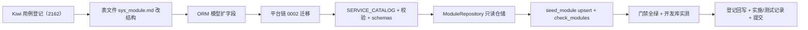

# 服务目录与注册要素登记实施记录

> 后端基座与服务化地基 · 03 服务目录与契约登记 · 01 服务目录与注册要素登记 · 实施记录

[文档首页](../../../../../../文档首页.md) › [01 服务目录与注册要素登记](../03_服务目录与契约登记_01_服务目录与注册要素登记.md) › 实施　|　[详细设计](../设计/01_详细设计_01_服务目录与注册要素登记.md) · [测试记录](../测试/01_测试_01_服务目录与注册要素登记.md)

## 1. 实施信息 

| 项 | 值 |
| --- | --- |
| 任务 | [01 服务目录与注册要素登记](../03_服务目录与契约登记_01_服务目录与注册要素登记.md) |
| 对应需求 | [03-1](../../../../需求/03_需求_服务目录与契约登记.md#r03-1) |
| 详细设计 | [01_详细设计_01_服务目录与注册要素登记](../设计/01_详细设计_01_服务目录与注册要素登记.md) |
| 实施日期 | 2026-09-22 |
| 实施人 | minjian |
| 实施环境 | 开发机（Ubuntu，Python 3.14 / uv，工作区 `.venv`）；开发平台库 SQLite `backend/bms_platform.db` |
| 提交 | 代码与文档分开提交（`feat(03_01)` / `docs(03_01)`） |
| 结论 | 完成 |

## 2. 实施概览 

## 3. 实施过程 

1. **Kiwi 用例登记（先登记后编码）**：登记输入 `test/scripts/kiwi/cases/2026-09-22_阶段二03-01_服务目录与注册要素登记.json`，平台回读编号 **2162**。
2. **表文件先行**：`设计/数据库设计/数据表设计/sys_module.md` 增 7 列、`errcode_segment` 改可空并去段位唯一、变更记录 v3（唯一事实源）。
3. **ORM 模型**：`bms_core/models/platform.py::SysModule` 增 `service_key` / `business_code` / `service_group` / `build_batch` / `service_version` / `contract_version` / `product_key`，`errcode_segment` 可空，唯一约束由 4 组收敛为 3 组。
4. **迁移**：新增平台链 `alembic/versions/platform/0002_sys_module_catalog.py`（`batch_alter_table` 四库兼容；`branch_labels=None` 随链；加列 / 段位改可空 / 去唯一）。
5. **单一来源与校验**：`bms_core/services/module_registry.py` 扩展 `ModuleRecord`（新字段）+ `ServiceGroup` + `SERVICE_CATALOG`（16 行）+ 校验规则（四要素唯一、分组 / 批次 / semver / 产品维度）；`PLATFORM_MODULES` 收敛为平台域视图（sys/wf/rpt/ai）。
6. **只读仓储**：新增 `bms_core/repositories/module_repository.py::ModuleRepository`（`BaseDbRepository[SysModule]`），`list_catalog`（分组 / 状态 / 服务维度）+ `get_by_key`。
7. **契约响应**：`bms_core/schemas/module.py::ModuleResponse` 增 7 字段，供 03_03 只读接口直接序列化。
8. **种子与校验脚本**：`ops/seed_module.py` 升级为按 `module_key` 幂等 upsert（既有 4 行补齐服务维度字段，新增 12 行）；`ops/check_modules.py` 复用离线校验。
9. **用例**：改 `tests/services/test_module_registry.py`、`tests/ops/test_module_ops.py`；新增 `tests/repositories/test_module_repository.py`；适配 `test_alembic_chains` / `test_migration_ops`（平台 head 0002）与 `platform` 的 `test_modules` / `test_type_mapping`（段位去唯一、服务目录 16 行）。
10. **门禁与实测**：全量 `pytest` / `ruff` / `pyright` / 基座校验全绿；开发平台库执行 `0002` 迁移 + 种子实测（新增 12 / 更新 4、重复执行 0/0）。

## 4. 问题与处置 

| 问题 | 现象 | 处置 |
| --- | --- | --- |
| 迁移 `branch_labels` 冲突 | 0002 声明 `branch_labels=("platform",)` 触发 `Branch name 'platform' already used` | 链首之外不重复声明分支标签，`branch_labels=None`（随链） |
| `server_default` 字符串需显式引号 | 新 NOT NULL 列 `server_default="foundation"` 会渲染为不带引号字面量 | 改用 `sa.text("'foundation'")` / `sa.text("'0.1.0'")` |
| SQLite 改可空 / 去唯一 | 需重建表 | 迁移统一走 `op.batch_alter_table`（四库兼容） |
| 开发库为旧结构（0001） | 直接种子报列不存在 | 先对开发平台库执行 `alembic -n alembic:platform -x url=… upgrade head`，再种子 |
| 既有用例断言平台域 4 行 | `test_list_modules_contract` / 种子 / 迁移 head / 段位唯一旧断言 | 按新口径适配（16 行、0002、段位不建唯一），语义未弱化 |
| 服务简称整改范围反复 | 一度把简称整改扩大到权限码 / 事件域 / 正文 / 代码 | 已全部回退；**只改模块简称与表前缀**，本次服务行沿用工程名，规范与既有简称不动（详见设计 §4.3） |

## 5. 验证结果 

| 验证项 | 命令 | 结果 |
| --- | --- | --- |
| 全量用例 | `uv run pytest -q` | **921 passed / 36 skipped**（11.9s） |
| 新增 / 修改模块覆盖率 | `uv run pytest libs/bms_core/tests --cov=…` | `module_registry.py` / `module_repository.py` / `models/platform.py` 均 **100%** |
| lint / 格式化 | `uv run ruff check .` / `uv run ruff format --check .` | 通过（580 文件） |
| 类型检查 | `uv run pyright` | 0 error / 0 warning |
| 基座对账 | `python3 scripts/tools/base-check/check-backend-base.py` | 通过（继承链 382 / 基座类 86 / 平台码 32 / 迁移链 3） |
| 文档基座 / 链接 | `check-base.py` / `check-links.py` | 通过（174 文档；断链 0 / 失效锚点 0） |
| 开发库实测 | `uv run python -m ops.seed_module` | 首次「新增 12 行 / 更新 4 行」；重复「0 / 0」；`sys_module` 16 行齐备 |

## 6. 登记回写 

| 落点 | 内容 |
| --- | --- |
| 《数据库设计 · sys_module》 | 新字段 / 索引约束（去段位唯一）/ 迁移归属 / 变更记录 v3 |
| 《数据库设计总览》 | sys_module 关键字段登记更新 |
| 《架构设计 · 模块注册》 | 「注册表结构与数据」sys_module 行扩为「服务目录与契约登记表」 |
| 《后端基类清单》 | 模块注册制行补服务目录与 `ModuleRepository` |
| 计划 | §1 计数与工时（已完成 9 项 / 94h，剩余 20 项 / 162h）；§2 已完成表加 03_01；§3 移除 03_01；§4 甘特移除 03_01 节点 |
| 任务 / 父任务 | 任务 03_01 状态与完成日期；父任务域总览子任务表一致 |
| Kiwi TCMS / 测试资产仓 | 用例 **2162**；`test/scripts/kiwi/cases|exports/2026-09-22_阶段二03-01_*` |
| 实施 / 测试记录 | 本文件与[测试记录](../测试/01_测试_01_服务目录与注册要素登记.md) |

## 7. 偏差与遗留 

- **范围澄清**：服务行 `module_key` / 表前缀沿用微服务工程名（`identity` / `identity_` 等），`platform` / `workflow` / `report` 分别沿用既有平台域简称 `sys` / `wf` / `rpt`；**不改动既有模块简称与《英文简称规范》**（表的「业务码 / 事件域 / 表前缀」三列为相互独立登记项）。
- **设计回写**：详细设计原含「模块简称 ≤5 整改」，经确认作罢并已回写（提交 `docs(03_01)`），本记录与之一致。
- **遗留（归口）**：启动 / CI 接库唯一性与契约版本兼容校验 → **03_02**；只读 HTTP 接口 → **03_03**；每服务独立库与 `sys_` 平台基础表服务归属迁移 → **06_需求**；`sys_business` 落地与 `business_code` 校验 → RBAC 阶段。
- **开放项**：平台服务行 `errcode_segment` 留空，错误码沿用平台 `1xxxx~9xxxx` 五位段；服务 / 契约版本自动回写归 09_需求契约门禁。

> 依《文档生成规范》编写 · 与《测试记录》配套
