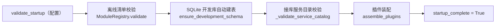

# 启动与 CI 唯一性校验详细设计

> 后端基座与服务化地基 · 03 服务目录与契约登记 · 02 启动与 CI 唯一性校验 · 详细设计

[文档首页](../../../../../../文档首页.md) › [02 启动与 CI 唯一性校验](../03_服务目录与契约登记_02_启动与 CI 唯一性校验.md) › 详细设计　|　[父任务：服务目录与契约登记](../../03_服务目录与契约登记.md) · [本阶段需求](../../../../需求/03_需求_服务目录与契约登记.md) · [排期计划](../../../../计划/01_计划_后端基座与服务化地基.md)

## 1. 概述 <a id="overview"></a>

- **目标**：把 03_01 落地的服务目录与契约登记接入**运行期与流水线的强制校验**——应用启动读平台库 `sys_module` 校验注册要素唯一 / 格式（冲突即拒启并列出冲突项），服务自报契约版本与登记值**主版本兼容**校验，CI 在冒烟层对「迁移 + 种子后」的库执行同规则查重与清单对账，运行时服务目录保持只读边界。
- **依据**：《[架构设计 · 模块注册](../../../../../../设计/架构设计/11_架构设计_子系统_模块注册.md)》「注册时机与唯一性校验」「运行时只读边界」「服务目录与契约登记」节；《[微服务演进规划](../../../../../../规划/微服务演进规划.md)》「服务化地基要求与门禁」（S1 / S7）；《[测试规范](../../../../../../规范/测试规范.md)》「CI 执行策略」节；《[后端开发规范](../../../../../../规范/后端开发规范.md)》《[命名规范](../../../../../../规范/命名规范.md)》《[日志规范](../../../../../../规范/日志规范.md)》《[数据库开发规范](../../../../../../规范/数据库开发规范.md)》；需求 [03-2](../../../../需求/03_需求_服务目录与契约登记.md#r03-2)。
- **范围（本任务）**：
  1. **共享校验内核**：`ModuleRegistry` 之上扩「接库记录转换 + 库内查重 + 清单双向对账 + 运行服务契约版本主版本兼容」；契约版本解析（semver 主版本）收敛为 `core/version.py` 单一实现（插件机制同源复用）。
  2. **服务自报契约版本**：各服务包新增 `CONTRACT_VERSION` 常量，经 `ServiceIdentity.contract_version` 带入运行期（启动校验用）；工厂基座声明同名属性。
  3. **启动校验**：`service_lifespan` 顺序调整为「离线清单校验 → 开发库自动建表 → 接库服务目录校验 → 插件装配」；接库校验空目录仅告警（未播种的开发 / 测试环境可启动），库不可读 / 表缺失 / 冲突一律 `CatalogError` 拒启。
  4. **CI 离线校验**：`ops/check_modules.py` 扩为双模式（默认离线：清单 + 服务包声明比对；`--url` 接库：读库查重 + 与清单双向对账）；`backend-modules` 冒烟 job 增「SQLite 临时库 → Alembic 迁移 → 种子 → 接库校验」。
  5. **只读边界护栏**：仓储只读（自有方法无写动词、无会话写调用）、服务目录路由仅 GET、启动校验只读（校验前后库内容不变）三条自动化用例。
- **不含（明确归口，见第 8 节）**：只读 HTTP 接口 `GET /api/v1/modules` 与 `/{service_key}`（03_03）；oasdiff 契约快照门禁与按服务发布的版本回写（09_需求）；真实库（MySQL / PostgreSQL / 达梦）的迁移后查重（verify 层集成 job 现状不变，见第 8 节）；服务版本（`service_version`）一致性核对（09 按服务发布环节消费）；`sys_business` 业务码表与 RBAC（RBAC 阶段）。

## 2. 现状与差距 <a id="gap"></a>

| 关注点 | 现状（03_01 交付后） | 差距（本任务目标） |
| --- | --- | --- |
| 启动校验 | `service_lifespan` 仅校验**内存清单**（`app.state.module_registry.validate()`），失败抛 `RuntimeError` | 读平台库 `sys_module` 校验；失败抛统一异常 `CatalogError`（错误码 40003） |
| 契约版本 | 仅登记（`sys_module.contract_version`，初值 `0.1.0`）；无任何兼容校验 | 服务包自报 `CONTRACT_VERSION` + 双端校验（启动 vs 登记、CI vs 清单），主版本不兼容拒启 |
| CI 离线校验 | `ops/check_modules.py` 只校验内存清单四要素（`uv run python -m ops.check_modules`） | 增「服务包声明 ↔ 清单」比对与 `--url` 接库查重 / 对账；CI 冒烟 job 增迁移 + 种子 + 接库校验 |
| 只读边界 | 仓储只提供读方法、无写路由（人工约定，无护栏） | 三条自动化护栏固化（仓储 / 路由 / 启动只读快照） |
| 契约版本解析 | `core/plugin.py` 私有 `_contract_major`（插件专用） | 抽为 `core/version.py` 共享实现，插件与服务目录同源 |

## 3. 交付物清单 <a id="tree"></a>

```text
backend/
├── libs/bms_core/src/bms_core/
│   ├── core/version.py                            # 新：契约版本（semver）解析与主版本比较（单一来源）
│   ├── core/plugin.py                             # 改：契约主版本解析改用 core/version（行为不变）
│   ├── core/error_codes.py                        # 改：新增 CATALOG = 40003
│   ├── core/exceptions.py                         # 改：新增 CatalogError(ConfigError)（启动期致命）
│   ├── core/service.py                            # 改：ServiceIdentity.contract_version + attach_service 入参
│   ├── services/module_registry.py                # 改：ModuleRecord.from_row / validate_catalog / 双向对账
│   ├── application.py                             # 改：契约版本属性 + lifespan 顺序调整 + 接库校验接线
│   └── schemas/module.py                          # 不改（03_01 已含 contract_version，供 03_03）
├── services/<服务名>/src/bms_<服务名>/__init__.py  # 改 ×9：新增 CONTRACT_VERSION = "0.1.0"
├── services/<服务名>/src/bms_<服务名>/main.py      # 改 ×9：工厂声明 contract_version = CONTRACT_VERSION
├── ops/check_modules.py                           # 改：离线（清单 + 服务包声明）+ --url 接库校验双模式
├── libs/bms_core/tests/core/test_service_catalog_startup.py   # 新：接库校验 / lifespan 拒启 / 只读快照 / 错误码
├── libs/bms_core/tests/services/test_module_registry.py       # 改：from_row / validate_catalog 用例
├── libs/bms_core/tests/ops/test_check_modules.py              # 改：双模式 CLI / 服务包声明比对用例
├── libs/bms_core/tests/repositories/test_module_repository.py # 改：仓储只读护栏
└── services/platform/tests/api/test_modules.py                # 改：启动冲突断言 CatalogError + 路由仅 GET 护栏

.gitlab-ci.yml                                     # 改：backend-modules 冒烟 job 增迁移 / 种子 / 接库校验三步

bms文档/
├── 设计/架构设计/11_架构设计_子系统_模块注册.md     # 改：「注册时机与唯一性校验」「运行时只读边界」节语义
├── 设计/架构设计/09_架构设计_接口与集成.md          # 改：「错误码分段」平台已发布码位补 40003
├── 后端基类清单.md                                  # 改：服务运行时 / 应用装配 / 模块注册制三行
└── 项目/02_后端基座与服务化地基/…/03_…_02_…/        # 实施/、测试/ 记录 + 任务与父任务状态 + 计划
```

## 4. 领域设计 <a id="design"></a>

### 4.1 校验分层与判定口径 <a id="layers"></a>

| 层 | 时机 | 数据来源 | 校验内容 | 失败处置 |
| --- | --- | --- | --- | --- |
| 离线清单 | 启动（lifespan 首步） | 内存 `SERVICE_CATALOG` | 四要素唯一 / 格式、分组 / 批次 / semver / 产品维度（03_01 既有 `ModuleRegistry.validate()`） | `CatalogError` 拒启 |
| 接库目录 | 启动（建表后、插件装配前） | 平台库 `sys_module`（未软删行） | 库内四要素唯一 / 格式 + 与清单双向对账 + 运行服务登记行契约版本主版本 | 空目录告警放行；其余 `CatalogError` 拒启 |
| CI 离线 | 流水线冒烟层 | 内存清单 + 服务工程声明 | 清单自校验 + 各服务包 `CONTRACT_VERSION` ↔ 清单登记主版本一致 | 打印明细、退出码 1 |
| CI 接库 | 流水线冒烟层（迁移 + 种子后） | SQLite 临时库 | 读库查重 + 与清单双向对账（空库即失败） | 打印明细、退出码 1 |

口径要点：

- **启动为空目录放行**：`sys_module` 无登记行时仅 `warning` 放行——开发 / 测试 SQLite 库未播种也能起服务；**库不可读、表缺失、有登记行但冲突一律拒启**（表缺失提示先执行平台链迁移）。
- **库读主库**：接库校验读平台库主库（不过只读副本），避免副本延迟造成误判；会话只读使用、不提交。
- **软删行不参与**：`deleted_at` 非空的历史登记行保留可追溯，校验与对账只看未软删行（与 `ModuleRepository.list_catalog` 同口径）。
- **对账字段**：`service_key` / `name` / `table_prefix` / `business_code` / `errcode_segment` / `event_domain` / `service_group` / `build_batch` / `product_key` / `status` 与清单**严格一致**；`contract_version` 按**主版本兼容**（主版本不同即冲突）；`service_version` 不参与（归 09 按服务发布环节）。
- **运行服务行必登记**：库中已有登记行时，运行服务的 `service_key` 必须在其中且契约版本主版本兼容（未登记即拒启）。

### 4.2 共享校验内核 <a id="kernel"></a>

**契约版本解析**（`core/version.py`，新；插件与服务目录同源）：

```text
core/version.py
├── CONTRACT_VERSION_RE = re.compile(r"\d+\.\d+\.\d+")   # 契约版本（X.Y.Z，semver 三段）
└── contract_major(version) -> int | None                 # 主版本号；非 X.Y.Z 返回 None
```

- `core/plugin.py` 删除私有 `_CONTRACT_VERSION_RE` / `_contract_major`，改引 `core/version.py`（错误消息与拒绝语义不变）。
- `services/module_registry.py` 的 semver 校验与主版本比较改用同一实现（删本地 `_SEMVER_RE`）。

**记录转换与接库校验**（`services/module_registry.py` 扩展）：

```text
ModuleRecord.from_row(row) -> ModuleRecord
    # 按目录字段从 ORM 行（或任意同构对象）取值构造（getattr 显式 cast，不引入模型依赖）
validate_catalog(catalog, records, *, service_key=None, contract_version=None) -> list[str]
    # 接库校验入口（启动 / CI 共用）：
    # 1) ModuleRegistry(records).validate()  库内四要素唯一 / 格式与维度一致
    # 2) _diff_catalog(catalog, records)     双向对账（缺行 / 清单外行 / 字段不符 / 契约主版本不兼容）
    # 3) _check_running_service(...)         service_key 非空时：运行服务行存在 + 契约主版本兼容
```

- 纯函数、不碰会话；会话打开与空目录判定归调用方（启动归 `application.py`，CI 归 `ops/check_modules.py`），保证启动与 CI 走同一套判定。
- 明细消息含登记标识与两侧取值（可读、可定位），错误聚合一次抛出。

### 4.3 服务自报契约版本 <a id="self-report"></a>

- **服务包常量**：`services/<服务名>/src/bms_<服务名>/__init__.py` 新增
  `CONTRACT_VERSION = "0.1.0"`（UPPER_SNAKE 常量；语义：本服务公开契约（OpenAPI）版本，破坏性变更升主版本）。
- **身份携带**：`ServiceIdentity` 增 `contract_version: str = "0.1.0"`，`attach_service(...)` 增同名入参并落身份；日志上下文仍只绑 `service` / `service_version`（探针响应不变）。
- **工厂声明**：`BaseServiceApplicationFactory.contract_version: str = "0.1.0"`（基座默认与平台初始契约版本一致）；9 个服务 `main.py` 均显式 `contract_version = CONTRACT_VERSION`（取自本包常量）。
- **双端校验**：启动比「服务自报 vs 库登记」主版本（§4.4）；CI 比「服务包常量 vs 清单登记」主版本（§4.5）——与前端模块自报 `contractVersion` 的双端校验同构。

### 4.4 启动校验接线 <a id="startup"></a>

`service_lifespan` 顺序调整为：



- 调整理由：接库校验须先有表（SQLite 开发库靠自动建表）；失败前置于插件装配，拒启时不产生已装配资源。
- 接线（`application.py` 私有助手 `_validate_service_catalog(app)`）：
  1. `session_scope(engine_registry, db_key=PLATFORM_DB_KEY, factory=session_factory)` 开平台库会话 → `ModuleRepository(session).list_catalog()` 读未软删行；
  2. 读取异常（表缺失 / 连接失败）包为 `CatalogError("服务目录不可读（请先执行平台库迁移）：…")` 拒启（`from exc` 保留原因）；
  3. 空列表 → `warning("service_catalog_empty")` 放行；
  4. 非空 → 行转 `ModuleRecord` + `validate_catalog(..., service_key=identity.name, contract_version=identity.contract_version)`；有明细 → `critical("service_catalog_invalid")` + `CatalogError("服务目录校验失败：…")`。
- 离线清单失败同样归 `CatalogError`（`critical("service_catalog_invalid")`），替换原 `RuntimeError`（原实现为游离内建异常，违背后端开发规范「异常继承统一基类」）。
- **退出码**：lifespan 启动失败即进程启动失败（uvicorn 退出码非 0），错误消息含全部冲突项；进程级退出码由启动入口承载，不在用例内起进程断言。

### 4.5 CI 离线校验 <a id="ci"></a>

**`ops/check_modules.py` 双模式**：

```text
ops/check_modules.py
├── check_offline() -> list[str]
│     ├── ModuleRegistry().validate()                      # 清单四要素 / 维度 / semver
│     └── check_service_declarations(SERVICE_CATALOG, resolve_service_contracts(services_dir))
│           # 服务工程 ↔ 清单双向：工程存在但未登记 → 报错；服务行对应工程存在 → 提取
│           # src/bms_<服务名>/__init__.py 的 CONTRACT_VERSION（AST 静态读取，无导入副作用）
│           # 未声明 / 非 semver / 主版本与清单不符 → 报错；planned 且无工程目录 → 跳过
├── check_catalog_db(url) -> list[str]                     # --url 模式（只读）
│     ├── ModuleRepository 读未软删行（异步引擎 + 会话工厂）
│     ├── 空库 → 「库中无登记行（种子未执行？）」（CI 视为失败；与启动的容错口径有意不同）
│     └── validate_catalog(SERVICE_CATALOG, records)       # 查重 + 双向对账
└── main(argv)：默认跑离线；给 --url 追加接库；明细与结论打印，退出码 0 / 1
```

**CI 冒烟 job**（`.gitlab-ci.yml` `backend-modules`，仍属 lint 冒烟层、随每次代码改动执行）：

```bash
cd backend
uv sync --frozen
uv run python -m ops.check_modules                      # 离线：清单 + 服务包声明
uv run alembic -n alembic:platform -x url="sqlite+aiosqlite:///./bms_ci_catalog.db" upgrade head
uv run python -m ops.seed_module --url "sqlite+aiosqlite:///./bms_ci_catalog.db"
uv run python -m ops.check_modules --url "sqlite+aiosqlite:///./bms_ci_catalog.db"
# 临时库 bms_ci_catalog.db 命中 .gitignore 的 backend/bms_*.db，不入库
```

### 4.6 运行时只读边界 <a id="readonly"></a>

| # | 护栏 | 落点 | 断言 |
| --- | --- | --- | --- |
| ① | 仓储只读 | `libs/bms_core/tests/repositories/test_module_repository.py` | AST 扫描 `module_repository.py`：自有方法名无写动词（create / update / delete / save / flush / commit / upsert / insert）；无 `self._session.add|flush|commit|delete` 调用 |
| ② | 目录路由仅 GET | `services/platform/tests/api/test_modules.py` | 遍历应用路由，`/api/v1/modules` 前缀下方法集合 ⊆ {GET, HEAD}（03_03 明细路由同受约束） |
| ③ | 启动校验只读 | `libs/bms_core/tests/core/test_service_catalog_startup.py` | 种子库启动前后，`sys_module` 行快照（module_key / table_prefix / contract_version / status）逐行一致 |

- 口径说明：`ModuleRepository` 继承基座通用 CRUD（通用数据访问能力），但**本仓储不自增写路径、运行时不暴露、无调用方**；写路径仅开发期种子脚本（`ops/seed_module.py`）与后续迁移种子。启动校验全程只读（只开只读语义会话、不提交）。
- 租户侧不可增删：平台表不进租户库路由（`sys_module` 属平台库），接口层无写路由（② 固化）。

## 5. 失败分支与边界 <a id="failures"></a>

| 场景 | 处理 |
| --- | --- |
| 清单内四要素重复 / 格式非法 / 分组越界 / semver 非法 | 离线校验明细聚合，`CatalogError` 拒启；CI 退出码 1 |
| 平台库不可读 / `sys_module` 表缺失（迁移未执行） | `CatalogError`「服务目录不可读（请先执行平台库迁移）」拒启 |
| `sys_module` 空表（未播种） | `warning("service_catalog_empty")` 放行（开发 / 测试容错）；CI 接库模式判失败 |
| 库内行重复（迁移种子引入） / 格式非法 | 接库校验明细聚合，拒启 |
| 清单有而库中缺行 / 库中有而清单外行 | 双向对账明细（缺行 / 未登记行），拒启 |
| 同名行字段与清单不符 | 逐字段明细（库值 vs 清单值），拒启 |
| 运行服务 `service_key` 不在库中 | 「运行服务未登记」拒启 |
| 服务自报契约版本与登记主版本不同 | 「契约版本主版本不兼容」拒启（两侧版本与主版本入消息） |
| 契约版本 minor / patch 差异（主版本相同） | 兼容放行（不报错；按主版本兼容口径） |
| 服务包未声明 `CONTRACT_VERSION` / 非 semver | CI 离线报错（启动仅校验运行服务自身，由 CI 兜底全量） |
| 服务工程存在但清单元登记 | CI 离线报错「服务工程未登记」 |
| 软删登记行 | 不参与查重与对账（可追溯保留） |
| 启动校验期间进程被杀 / 装配失败 | 校验只读、无副作用；装配失败仍走既有 `PluginError` 拒启路径 |
| CI 接库模式空库 | 明细「库中无登记行（种子未执行？）」退出码 1 |

## 6. 测试设计与验收映射 <a id="tests"></a>

用例先登记 Kiwi TCMS（本任务登记 **1 条策展用例**，多条断言共用同一 `kiwi_id`，编号以平台回读为准，见第 9 节）。

| Kiwi | 用例 | 类型 | 断言要点 |
| --- | --- | --- | --- |
| TBD | 启动接库校验 | 单元（SQLite 真库） | 正常种子库启动通过；重复 / 缺行 / 多余行 / 字段不符 / 未登记服务 / 契约主版本不符逐项拒启（`CatalogError` 码 40003）；空库放行告警；表缺失拒启；启动前后行快照一致 |
| TBD | 离线清单与契约双端 | 单元 | 清单自校验；服务包声明 ↔ 清单主版本一致（缺失 / 非 semver / 不符 / 工程未登记逐项检出）；`--url` 接库模式正常通过、空库与冲突失败、退出码 0 / 1 |
| TBD | 只读边界护栏 | 单元（源码 / 路由） | 仓储自有方法无写动词、无会话写调用；`/api/v1/modules` 路由仅 GET；运行服务路由仍可用 |
| TBD | 契约版本解析 | 单元 | `contract_major` 合法 / 非法；插件契约版本拒绝语义回归（既有用例适配后全绿） |
| — | 既有回归 | 单元 | 平台模块接口 / 生命周期 / 工厂 / 迁移等既有用例适配后全绿（启动冲突断言改 `CatalogError`、`service_identity` 增字段） |

验收映射：

| 完成标准（需求 03-2） | 验证方式 |
| --- | --- |
| 重名 / 格式错误启动被拒（退出码非 0、错误可读） | 离线与接库校验用例（明细含冲突项）+ lifespan 抛 `CatalogError`（启动失败路径，uvicorn 退出码非 0） |
| 契约版本不符启动被拒并告警 | 运行服务契约主版本不符用例 + `critical("service_catalog_invalid")` 日志断言（日志捕获） |
| CI 离线校验可拦截非法登记并随冒烟层执行 | `ops/check_modules` 双模式用例 + CI `backend-modules` job 四步（离线 / 迁移 / 种子 / 接库） |
| 只读边界 | 三条护栏用例（仓储 / 路由 / 启动只读快照） |
| `pytest` / `ruff` / `pyright` 全绿 | 门禁命令（见第 9 节） |

## 7. 登记落点 <a id="registry-writeback"></a>

| 落点 | 内容 |
| --- | --- |
| 《架构设计 · 模块注册》 | 「注册时机与唯一性校验」节补：启动读 `sys_module` 校验服务标识 / 四要素唯一与格式 + 契约版本主版本兼容（空目录容错口径）；「运行时只读边界」节补只读护栏口径 |
| 《架构设计 · 接口与集成》 | 「错误码分段」平台已发布码位补 `40003` 服务目录登记校准失败（启动期致命） |
| 《后端基类清单》 | 服务运行时基座（`ServiceIdentity` 增契约版本）、服务应用装配基座（启动顺序 + 接库校验）、模块注册制（`validate_catalog` / `ModuleRecord.from_row` / `core/version.py`）三行 |
| 计划 | §1 计数与工时；§2 已完成表加 03_02；§3 移除 03_02；§4 甘特移除 03_02 节点 |
| 任务 / 父任务 | 状态与完成日期两处一致（需求文档不承载进度） |
| Kiwi TCMS / 测试资产仓 | 登记本任务用例并回读编号；`scripts/kiwi/cases|exports/` 对应文件 |
| 实施 / 测试记录 | 任务目录 `实施/`、`测试/` 各一份 |

## 8. 边界与开放项 <a id="boundary"></a>

- **归 03_03**：只读 HTTP 接口（清单 / 明细、统一响应、404、鉴权）；本任务只固化路由只读护栏。
- **归 09_需求**：oasdiff 契约快照门禁；`service_version` / `contract_version` 随服务发布的回写口径；真实库 verify 层集成 job 的迁移后查重可复用本任务接库校验（当前冒烟层用 SQLite 临时库，MySQL / PostgreSQL / 达梦真库校验不在本任务）。
- **归 05_02 / 06_需求**：跨服务数据所有权硬校验、每服务独立库与迁移链（本任务不涉）。
- **开放项**：服务包自报契约版本当前统一 `0.1.0`，独立升版流程随 09 契约门禁；达梦下接库校验与其余平台读写同走同步门面（01_05 已实测路径），接库校验未在达梦真库单独实测（CI `integration-dm8` 仍临时关闭，见计划「后续阶段待办 #8」）。
- **不改**：`sys_module` 表结构与迁移（无 schema 变更）；既有模块注册接口响应体；探针响应字段；`ServiceIdentity` 既有字段语义（仅新增字段）。

## 9. 实施步骤 <a id="steps"></a>


1. 读《[KiwiTCMS 部署使用说明](../../../../../../资料/开发服务器/linux/KiwiTCMS部署使用说明.md)》「用例约定」与「用例登记（脚本化批量）」节，登记本任务用例并**回读编号**（输入文件落测试仓 `scripts/kiwi/cases/`）。
2. 落 `core/version.py`、`ErrorCode.CATALOG`、`CatalogError`；`core/plugin.py` 改用共享实现。
3. 扩 `module_registry.py`（`ModuleRecord.from_row` / `validate_catalog` / 双向对账 / 运行服务校验）。
4. 9 个服务包加 `CONTRACT_VERSION`、`main.py` 工厂声明；`ServiceIdentity` / `attach_service` / 工厂基座扩契约版本。
5. `application.py` 调整 lifespan 顺序与接库校验接线（`CatalogError` 拒启 + 日志事件）。
6. `ops/check_modules.py` 双模式；`.gitlab-ci.yml` `backend-modules` job 扩四步。
7. 新增 / 适配用例（`@pytest.mark.kiwi_id`）：启动接库、CI 双模式、三条护栏、契约解析；门禁全绿；开发平台库实测（迁移 + 种子 + 接库校验通过、离线通过）。
8. 登记回写 + 实施 / 测试记录 + 代码与文档分开提交（`feat` / `docs`）。

关键命令：

```bash
cd backend
uv run ruff check . && uv run ruff format --check . && uv run pyright
uv run pytest -q --cov=bms_core --cov-branch
uv run python -m ops.check_modules
uv run alembic -n alembic:platform -x url="sqlite+aiosqlite:///./bms_ci_catalog.db" upgrade head
uv run python -m ops.seed_module --url "sqlite+aiosqlite:///./bms_ci_catalog.db"
uv run python -m ops.check_modules --url "sqlite+aiosqlite:///./bms_ci_catalog.db"
# 仓库根
python3 scripts/tools/preflight/check-preflight.py --fast
python3 scripts/tools/base-check/check-backend-base.py
python3 scripts/tools/base-check/check-base.py
python3 scripts/tools/base-check/check-links.py
python3 scripts/tools/check-docs/check-status.py
```

## 10. 决策记录（对齐记录） <a id="align"></a>

| # | 事项 | 结论（逐项确认） |
| --- | --- | --- |
| 1 | 启动校验接库口径 | 接库校验 + 空表容错：读 `sys_module` 四要素 / 对账 / 运行服务契约版本；空表告警放行；库不可读、表缺失、冲突拒启 |
| 2 | 契约版本权威来源 | 服务包自报 `CONTRACT_VERSION` + 双端校验：启动比「自报 vs 登记」主版本、CI 比「自报 vs 清单」主版本 |
| 3 | CI 离线校验落点 | 扩展现有 `ops/check_modules.py`（只读 `--url` 接库模式）；`backend-modules` 冒烟 job 增迁移 / 种子 / 接库校验 |
| 4 | 只读边界护栏 | 三条自动化护栏：仓储只读、路由仅 GET、启动校验只读快照 |
| 5 | 服务版本覆盖 | 只校验契约版本；`service_version` 一致性归 09 按服务发布环节 |
| 6 | 契约主版本解析落点 | 抽 `core/version.py` 单一实现，插件（`core/plugin.py`）与服务目录同源复用 |
| 7 | 启动失败异常 | 新增 `CatalogError(ConfigError)`，错误码 `40003`（4xxxx 系统配置段内顺延）；替换原游离 `RuntimeError` |
| 8 | 接库校验读路 | 读平台库主库（不过副本），只读语义会话、不提交 |
| 9 | 对账字段口径 | 除 `contract_version`（主版本兼容）与 `service_version`（不参与）外，其余目录字段严格一致；软删行不参与 |
| 10 | CI 接库模式空库 | 判失败（种子未执行属流水线异常）；与启动的空表容错口径有意不同 |

## 11. 参考文档 <a id="ref"></a>

- [架构设计 · 模块注册](../../../../../../设计/架构设计/11_架构设计_子系统_模块注册.md)「注册时机与唯一性校验」「运行时只读边界」「服务目录与契约登记」节
- [架构设计 · 接口与集成](../../../../../../设计/架构设计/09_架构设计_接口与集成.md)「错误码分段」节
- [微服务演进规划](../../../../../../规划/微服务演进规划.md)「服务化地基要求与门禁」节
- [测试规范](../../../../../../规范/测试规范.md)「CI 执行策略」节；[后端开发规范](../../../../../../规范/后端开发规范.md)「架构铁律」「后端基座体系」节
- [后端基类清单](../../../../../../后端基类清单.md)
- [需求 03-2：启动与 CI 唯一性校验](../../../../需求/03_需求_服务目录与契约登记.md#r03-2)
- [03_01 服务目录与注册要素登记详细设计](../../03_服务目录与契约登记_01_服务目录与注册要素登记/设计/01_详细设计_01_服务目录与注册要素登记.md)
- [KiwiTCMS 部署使用说明](../../../../../../资料/开发服务器/linux/KiwiTCMS部署使用说明.md)「用例约定」「用例登记（脚本化批量）」节

> **取数路径变更（06_01 回写，2026-09-23）**：本任务交付的接库校验原为「直读本进程平台库 `sys_module`」；**06_01 起改经服务目录快照出口**——`platform`（目录单一权威）经 `ModuleRepository` 读**本服务平台库**（读失败仍 `CatalogError` 拒启，语义不变），其余服务经 `service_client` 调 `GET /api/v1/modules/snapshot`，**不可达时告警放行**并置 `app.state.catalog_degraded = True`（`/readyz` 的 `catalog` 为非必需项，不产生 503）；CI 侧离线校验（`ops/check_modules.py`）仍为硬门禁。取数编排见 `bms_core/catalog/loader.py`。**用例适配**：Kiwi 2163 的「运行服务未登记：workflow」1 条改为注入桩快照（保留原断言语义），其余冲突拒启用例（默认 `platform` 身份）语义不变；新增「快照不可达降级放行」用例。

> 本文档依《[文档生成规范](../../../../../../规范/文档生成规范.md)》编写 · 关键决策逐项确认
