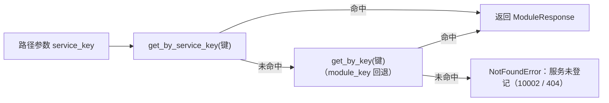

# 服务目录只读接口详细设计

> 后端基座与服务化地基 · 03 服务目录与契约登记 · 03 服务目录只读接口 · 详细设计

[文档首页](../../../../../../文档首页.md) › [03 服务目录只读接口](../03_服务目录与契约登记_03_服务目录只读接口.md) › 详细设计　|　[父任务：服务目录与契约登记](../../03_服务目录与契约登记.md) · [本阶段需求](../../../../需求/03_需求_服务目录与契约登记.md) · [排期计划](../../../../计划/01_计划_后端基座与服务化地基.md)

## 1. 概述 <a id="overview"></a>

- **目标**：把服务目录与契约登记（`sys_module`）以**只读 HTTP 接口**开放给运维与平台管理——`GET /api/v1/modules`（清单，分页 + 筛选）与 `GET /api/v1/modules/{service_key}`（明细）；只读、不含密钥 / 敏感项，未登记统一 404；数据源读平台库（服务目录单一权威），鉴权挂登录态占位随认证 / RBAC 阶段回补。
- **依据**：《[架构设计 · 模块注册](../../../../../../设计/架构设计/11_架构设计_子系统_模块注册.md)》「运行时只读边界」「服务目录与契约登记」节；《[架构设计 · 接口与集成](../../../../../../设计/架构设计/09_架构设计_接口与集成.md)》「API 设计规范」节；《[API接口规范](../../../../../../规范/API接口规范.md)》《[后端开发规范](../../../../../../规范/后端开发规范.md)》《[命名规范](../../../../../../规范/命名规范.md)》；需求 [03-3](../../../../需求/03_需求_服务目录与契约登记.md#r03-3)。
- **范围（本任务）**：
  1. **平台库只读会话依赖**：新增 `get_platform_read_db`（强制平台库 `PLATFORM_DB_KEY` + 只读语义，按方言分流）——`sys_module` 属平台库，请求带租户上下文时不能走 `get_db`（会命中租户库）。
  2. **只读仓储扩展**：`ModuleRepository` 增 `page_catalog`（筛选 + 分页 + 筛选后总数）与 `get_by_service_key`（服务维度精确匹配）；既有 `list_catalog` / `get_by_key` 保持（启动校验与既有用例消费）。
  3. **只读路由**：`bms_platform/api/modules.py` 清单接口改读库 + 分页 + 筛选（`status` / `group`）；新增明细接口（`service_key` 优先、未命中回退 `module_key`）；未登记抛 `NotFoundError`（10002 / 404，统一响应体）；路由挂 `require_auth` 登录态占位。
  4. **测试库播种**：platform 服务 conftest 会话级平台库增播种 `SERVICE_CATALOG`（16 行），接口用例在真实非空库上运行。
  5. **概要设计回写**：接口清单与公共要求同步为服务化升格后的口径（`/{service_key}`、去 i18n、保留分页）。
- **不含（明确归口，见第 8 节）**：i18n 多语言名称（归国际化阶段，`sys_module_i18n` 无种子、locale 解析链未就绪）；真实登录态与权限码校验（归认证 / RBAC 阶段，本任务只挂占位依赖）；前端「模块注册表」页面（原型设计既有资产，前端实现归对应阶段）；OpenAPI 契约快照导出与 oasdiff 门禁（归 09_需求）；平台库只读副本真实化（读写分离真实化归后续，`read_only=True` 当前无副本回落主库）。

## 2. 现状与差距 <a id="gap"></a>

| 关注点 | 现状（03_02 交付后） | 差距（本任务目标） |
| --- | --- | --- |
| 清单接口 | `GET /api/v1/modules` 读**内存清单** `ModuleRegistry`，返回数组、仅 `status` 筛选、无鉴权依赖 | 读平台库 `sys_module`（`ModuleRepository.page_catalog`）；分页结构 + `status` / `group` 筛选；挂 `require_auth` 占位 |
| 明细接口 | 不存在 | `GET /api/v1/modules/{service_key}`：`service_key` 优先回退 `module_key`；未登记 404 / 10002 |
| 平台库读会话 | `get_db` 按请求租户上下文选库（带租户头会命中租户库）；`get_read_db` 强制只读但仍按租户键 | 新增 `get_platform_read_db`：强制平台库 + 只读，供平台库读接口复用 |
| 只读仓储 | `list_catalog` / `get_by_key`（03_01 交付）；分页与按服务键查询缺失；03_03 是其既定消费方 | 增 `page_catalog`（分页 + 筛选后计数）与 `get_by_service_key` |
| 测试平台库 | 会话级库仅播种租户（`sys_module` 空表），启动接库校验走「空目录告警」路径 | 会话级库增播种 `SERVICE_CATALOG`，启动走「非空对账」路径，接口用例可查 16 行 |
| 概要设计 | 《02_概要设计_模块注册》仍为阶段一口径（`/{id}` + i18n + 分页） | 接口清单与公共要求回写为 `/{service_key}`、去 i18n、保留分页 |

## 3. 交付物清单 <a id="tree"></a>

```text
backend/
├── libs/bms_core/src/bms_core/
│   ├── db/session.py                            # 改：_open_session 支持显式 db_key；新增 get_platform_read_db
│   ├── api/deps.py                              # 改：导出 get_platform_read_db
│   └── repositories/module_repository.py        # 改：新增 page_catalog / get_by_service_key（筛选条件与 list_catalog 同源）
├── services/platform/src/bms_platform/api/modules.py   # 改：清单读库分页 + 明细路由 + require_auth + 404
├── services/platform/tests/conftest.py                 # 改：会话级平台库增播种 SERVICE_CATALOG
├── services/platform/tests/api/test_modules.py         # 改：分页 / 筛选 / 明细 / 404 / 字段护栏 / 空库用例
└── libs/bms_core/tests/
    ├── db/test_engine_routing.py                # 改：get_platform_read_db 强制平台库用例
    └── repositories/test_module_repository.py   # 改：page_catalog / get_by_service_key 用例（只读护栏扩展断言）

bms文档/
├── 设计/概要设计/02_概要设计_模块注册.md         # 改：「接口设计」节回写（清单 / 明细 / 公共要求）
├── 后端基类清单.md                                # 改：数据访问横切（get_platform_read_db）+ 模块注册制行（只读接口消费）
└── 项目/02_后端基座与服务化地基/…/03_…_03_…/     # 设计/ 详细设计；实施/、测试/ 记录；任务与父任务状态；计划回写
```

## 4. 领域设计 <a id="design"></a>

### 4.1 平台库只读会话依赖 <a id="platform-session"></a>

`sys_module` 属平台库（`bms_platform`），而 `get_db` 在请求带租户上下文时按租户库键选引擎——模块接口若用 `get_db`，运维请求携带 `X-Tenant-ID` 时会误连租户库。故新增平台库读会话依赖：

```text
bms_core/db/session.py
├── _open_session(request, *, read_only, db_key=None)   # 改：db_key 显式指定库键；None 保持按请求租户上下文解析（既有行为不变）
├── get_db / get_read_db / get_write_db                 # 不改：默认 db_key=None，行为与既有完全一致
└── get_platform_read_db(request) -> AsyncIterator[DbSession]   # 新：db_key=PLATFORM_DB_KEY + read_only=True
```

- 只读语义：`read_only=True` 经引擎工厂取副本、**无副本回落主库**（`EngineRegistry.get` 既有行为）；主库降级守卫只读路径直接放行。
- 方言分流不变：达梦等同步方言仍经 `registry.get_sync` + 同步门面（`SyncSession`）承载，调用方无须感知。
- 经 `api/deps.py` 导出（与 `get_db` / `get_read_db` 同处公共依赖汇总），业务路由经依赖注入取用。

### 4.2 只读仓储扩展 <a id="repository"></a>

```text
ModuleRepository(BaseDbRepository[SysModule])
├── list_catalog(*, group=None, status=None, service_only=False) -> list[SysModule]   # 既有，不改签名（启动校验 / 既有用例）
├── page_catalog(query, *, group=None, status=None) -> tuple[list[SysModule], int]    # 新：分页 + 筛选后总数
│     # 1) 筛选条件与 list_catalog 同源（私有 _catalog_conditions 收敛，防两处口径漂移）
│     # 2) 排序经 _resolve_sort 白名单（模型映射列；NULL 恒末位 + id 兜底），LIMIT/OFFSET
│     # 3) 同条件 COUNT（作用域 + 软删过滤 + 筛选），total 为筛选后总数
└── get_by_service_key(service_key) -> SysModule | None                               # 新：服务维度精确匹配（未软删）
```

- 软删过滤：全部读方法经 `_select()` / `_scope_where()` 默认口径（`deleted_at` 非空行不可见），与启动 / CI 校验同源。
- 只读边界：仍只提供读方法，方法名无写动词、无 `self._session` 写调用（护栏用例既有断言继续生效并扩展覆盖新方法）。

### 4.3 清单接口 <a id="list-api"></a>

- **路由**：`GET /api/v1/modules`（`BaseRouter(key="modules", prefix="/modules", tags=["module"], dependencies=[Depends(require_auth)])`）。
- **请求参数**：

| 参数 | 来源 | 说明 |
| --- | --- | --- |
| `page` / `size` | `page_query` 依赖工厂 → `BasePageQuery` | 页码从 1 起、`size` 默认 20 上限 200；页码限深 `[pagination].max_page`（超限 10001） |
| `order_by` / `order` | 同上（`BaseSortQuery`） | 多值逗号分隔 + 方向数组；白名单逐项校验、非法忽略，默认 `id` 升序 |
| `status` | 查询参数 | 状态筛选（`enabled` / `disabled` / `planned`）；缺省全部 |
| `group` | 查询参数 | 归属分组筛选（`foundation` / `capability` / `product`）；缺省全部 |

- **响应**：`ApiResponse.ok(BasePageResponse[ModuleResponse](list=…, total=…, page=…, size=…))`——统一响应 `data` 为 `{list, total, page, size}`（平台分页契约），元素字段与明细一致（`ModuleResponse` 13 字段）。
- **排序默认**：不传排序参数时 `id` 升序（即种子登记顺序，与 `list_catalog` 既有顺序一致）。
- **空库**：未播种时返回 `list=[]`、`total=0`（不报错；启动已 `warning("service_catalog_empty")`，口径一致）。
- **口径说明**：未知 `status` / `group` 值按查询语义返回空结果（不做枚举校验，与 03_01 仓储口径一致）；`page` 超上限由 `BasePageQuery` 校验器抛参数错误（10001）。
- **破坏性变更登记**：清单响应由数组改为分页对象——**消费方为零**（前端无调用、无其他服务消费，已检索确认），变更随本任务一次落地并在实施记录登记。

### 4.4 明细接口 <a id="detail-api"></a>

- **路由**：`GET /api/v1/modules/{service_key}`（同路由模块，继承路由级 `require_auth` 依赖）。
- **键解析（已确认口径）**：



- 回退理由：列表 16 行含无 `service_key` 的产品模块行（`pur` / `pay` / `sale` / `wh` / `sup` / `cw`），运维「列表所见即可点开明细」；服务行（`platform` / `identity` / …）经 `service_key` 命中，产品模块行经 `module_key` 命中。
- **响应**：`ApiResponse.ok(ModuleResponse.model_validate(row))`，字段与清单行一致（含 `module_key` / `service_key` 双键，消费方可自行区分行类型）。
- **404 口径**：`NotFoundError`（`10002` / HTTP 404）+ 统一响应体 `{code, message, data:null}`，消息 `服务未登记：{键}`；软删行视为未登记（仓储口径）。
- **路径参数不额外做格式 / 长度校验**：未命中即 404，避免「格式非法 10001」与「未登记 404」两套口径分裂；超长 / 大写等非法键自然未命中。

### 4.5 鉴权占位与只读边界 <a id="auth-readonly"></a>

- **鉴权**：路由级 `dependencies=[Depends(require_auth)]`——占位恒定放行、不解析 token（与 icons / preferences / notifications 等「登录即可」接口一致）；真实登录态与平台管理权限码随认证 / RBAC 阶段回补，调用面零改动。
- **只读边界**（需求「不提供注册 / 启停 / 切换操作」）：
  - 路由仅 GET（03_02 既有护栏用例以 OpenAPI 契约断言 `/api/v1/modules` 前缀下方法集合 ⊆ {get, head}，新增明细路由自动纳入）；
  - 仓储只读（护栏用例扩展覆盖新方法）；
  - 响应不含密钥 / 敏感项：`sys_module` 无密钥字段，`ModuleResponse` 字段集固定为 13 个目录字段——新增字段护栏用例（响应字段集严格等于 `ModuleResponse` 字段集）。

### 4.6 测试库播种 <a id="test-seed"></a>

- `services/platform/tests/conftest.py` 的会话级 `platform_db_url` fixture 增 `asyncio.run(seed_modules(platform_url))`（幂等 upsert，与 `seed_tenants` 同库先后建表不冲突）。
- 影响：platform 服务全部用例的平台库为「16 行目录 + 2 行租户」的真实形态，启动接库校验走「非空对账」路径（原 `test_startup_validation_passes_for_platform_seed` 由空库告警路径变为对账通过路径，断言不变、语义更真实）。
- `libs/bms_core/tests/conftest.py` **不动**：libs 层用例的平台库语义保持现状（空库路径由自建库用例覆盖），避免无关用例行为漂移。
- 空库行为用例：接口层用自建临时库（覆盖 `BMS_DATABASE__PLATFORM__URL`）断言「清单空数组 / total=0、明细 404」，不复用共享种子库。

## 5. 失败分支与边界 <a id="failures"></a>

| 场景 | 处理 |
| --- | --- |
| 平台库不可读 / 连接失败 | 全局处理器转 `DatabaseUnavailableError`（10006 / 503）或未捕获异常 500；启动期已由接库校验拒启，运行时按既有异常口径 |
| 未播种空库 | 清单 `list=[]` / `total=0`；明细 404（视为未登记）；不报错 |
| 未登记键（`service_key` 与 `module_key` 均未命中） | `NotFoundError`（10002 / 404）+ 统一响应体 |
| 软删登记行 | 清单不可见、明细视为未登记（仓储软删过滤口径） |
| `page` 超 `[pagination].max_page` / `size` 超上限 / 非整数 | `BasePageQuery` 校验失败 → 参数错误（10001 / HTTP 422 转统一响应） |
| `order_by` 非法字段 | 忽略该项（全忽略回落 `id` 升序），不报错（排序白名单口径） |
| `status` / `group` 未知值 | 返回空结果（查询语义，不做枚举校验） |
| 请求携带租户上下文（`X-Tenant-ID` 等） | `get_platform_read_db` 强制平台库，仍读 `sys_module`；不受租户库影响 |
| 达梦等同步方言 | 会话经同步门面（既有 `_open_session` 分流），路由代码零差异 |
| 对清单发 POST / PUT / DELETE | 405（无写路由；既有用例断言） |
| 并发 / 事务 | 只读会话不提交、无写路径；无并发副作用 |

## 6. 测试设计与验收映射 <a id="tests"></a>

用例先登记 Kiwi TCMS（本任务登记 **1 条策展用例**，多条断言共用同一 `kiwi_id`，编号以平台回读为准，见第 9 节）。

| Kiwi | 用例 | 类型 | 断言要点 |
| --- | --- | --- | --- |
| TBD | 服务目录只读接口 | 接口（SQLite 真库） | 清单分页结构（total=16 / size 分页 / page 越界）；`status` / `group` 筛选与组合；排序白名单（非法忽略）；字段集严格等于 `ModuleResponse`；明细 `service_key` 命中 / `module_key` 回退 / 未登记 404 + 10002 + 统一响应体；POST/PUT/DELETE 405 |
| TBD | 平台库读会话依赖 | 单元（引擎路由） | `get_platform_read_db` 带租户上下文时仍取平台库只读引擎（与 `get_read_db` 的租户键行为对照） |
| TBD | 仓储分页与按服务键查询 | 单元（SQLite 真库） | `page_catalog` 筛选 / 分页 / 筛选后总数；`get_by_service_key` 命中与缺失；只读护栏覆盖新方法 |
| — | 空库行为 | 接口（自建空库） | 清单空数组 + total=0；明细 404 |
| — | 既有回归 | 单元 | 平台模块接口 / 启动校验 / 仓储 / 生命周期等既有用例适配后全绿（清单断言改分页结构） |

验收映射：

| 完成标准（需求 03-3） | 验证方式 |
| --- | --- |
| 只读接口可查且字段与架构一致 | 清单 / 明细契约用例 + 字段集护栏（`ModuleResponse` 13 字段） |
| 不含密钥 / 敏感项 | 字段集严格断言（不多不少，无 `options` / 密钥类字段） |
| 未登记服务 404 与统一响应体一致 | 明细 404 用例（HTTP 404 + `code=10002` + `data=null` + `message` 可读） |
| 自动化用例覆盖 | Kiwi 策展用例 + 上述用例组 |
| `pytest` / `ruff` / `pyright` 全绿 | 门禁命令（见第 9 节） |

## 7. 登记落点 <a id="registry-writeback"></a>

| 落点 | 内容 |
| --- | --- |
| 《概要设计 · 模块注册》 | 「接口设计」节回写：接口清单（清单分页 + `status` / `group` 筛选、明细 `/{service_key}`）、公共要求（分页保留、只读、鉴权随认证 / RBAC）；i18n 归国际化阶段 |
| 《后端基类清单》 | 数据访问横切行与会话依赖行补 `get_platform_read_db`（强制平台库 + 只读）；模块注册制行补只读接口消费与仓储分页 / 按服务键查询 |
| 计划 | §1 计数与工时；§2 已完成表加 03_03；§3 移除 03_03；§4 甘特移除 03_03 节点 |
| 任务 / 父任务 | 状态与完成日期两处一致（需求文档不承载进度） |
| Kiwi TCMS / 测试资产仓 | 登记本任务用例并回读编号；`scripts/kiwi/cases|exports/` 对应文件 + 台账追加 |
| 实施 / 测试记录 | 任务目录 `实施/`、`测试/` 各一份 |

- **不改**：架构 11（「运行时只读边界」「服务目录与契约登记」语义已覆盖本任务，无新语义）；数据库设计（无 schema 变更）；`sys_module` 表结构与种子；既有路由前缀与统一响应模型。

## 8. 边界与开放项 <a id="boundary"></a>

- **归认证 / RBAC 阶段**：真实登录态解析与平台管理权限码（本任务只挂 `require_auth` 占位）。
- **归国际化阶段**：明细 / 清单的多语言名称（`sys_module_i18n` 无种子、locale 解析链未就绪）。
- **归 09_需求**：OpenAPI 契约快照导出与 oasdiff 门禁（本任务接口变更将随下一次契约快照体现）；`service_version` / `contract_version` 随服务发布的回写。
- **归前端阶段**：模块注册表页面（原型设计 04 既有资产，本任务只保证接口契约）。
- **开放项**：平台库只读走副本、无副本回落主库（读写分离真实化归后续）；达梦下平台库只读会话经同步门面（01_05 已实测路径），接口层未在达梦真库单独实测（CI `integration-dm8` 临时关闭，见计划「后续阶段待办 #8」）；清单响应结构变更属破坏性变更（消费方为零，已登记）。
- **不做**：不提供注册 / 启停 / 切换写接口；不返回密钥 / 敏感项；不引入 i18n 与分页外的查询能力（关键字 / 多值筛选等按需再议）。

## 9. 实施步骤 <a id="steps"></a>


1. 读《[KiwiTCMS 部署使用说明](../../../../../../资料/开发服务器/linux/KiwiTCMS部署使用说明.md)》「用例约定」与「用例登记（脚本化批量）」节，登记本任务用例并**回读编号**（输入文件落测试仓 `scripts/kiwi/cases/`）。
2. `db/session.py`：`_open_session` 增 `db_key` 参数、新增 `get_platform_read_db`；`api/deps.py` 导出。
3. `module_repository.py`：`_catalog_conditions` 收敛筛选、新增 `page_catalog` / `get_by_service_key`。
4. `bms_platform/api/modules.py`：清单改读库 + `page_query` + `status` / `group` + 分页响应；新增明细路由（回退解析 + 404）；路由挂 `require_auth`；删除内存清单依赖。
5. `services/platform/tests/conftest.py` 播种模块；用例新增 / 适配（`@pytest.mark.kiwi_id`）。
6. 门禁全绿；开发平台库实测（清单分页 / 筛选 / 明细 / 404 / 空库）。
7. 登记回写（概要设计 / 后端基类清单 / 计划 / 任务与父任务）+ 实施 / 测试记录 + 代码与文档分开提交（`feat` / `docs`）。

关键命令：

```bash
cd backend
uv run ruff check . && uv run ruff format --check . && uv run pyright
uv run pytest -q
uv run python -m ops.seed_module          # 开发平台库种子（幂等）
# 仓库根
python3 scripts/tools/preflight/check-preflight.py --fast
python3 scripts/tools/base-check/check-backend-base.py
python3 scripts/tools/base-check/check-base.py
python3 scripts/tools/base-check/check-links.py
python3 scripts/tools/check-docs/check-status.py
```

## 10. 决策记录（对齐记录） <a id="align"></a>

| # | 事项 | 结论（逐项确认） |
| --- | --- | --- |
| 1 | 接口数据源 | 读平台库 `sys_module`（`ModuleRepository`），清单与明细同源；内存清单不再作为接口数据源 |
| 2 | 明细查询键 | `service_key` 优先、未命中回退 `module_key`（列表 16 行皆可查明细） |
| 3 | 筛选参数 | 保留 `status`，新增 `group` |
| 4 | 分页 | 加分页：`page` / `size` + `{list, total, page, size}`（清单响应由数组改分页对象，消费方为零） |
| 5 | 鉴权占位 | 路由挂 `require_auth`（恒定放行，认证 / RBAC 阶段替换实现零改动） |
| 6 | 404 错误码 | 复用 `NotFoundError`（10002 / 404）+ 统一响应体 |
| 7 | 明细 i18n | 不含（归国际化阶段） |
| 8 | 空库行为 | 清单返回空数组 + `total=0`；明细 404（与启动空目录容错口径一致） |
| 9 | 测试库播种 | 会话级共享 fixture（platform 服务 conftest）增播种 `SERVICE_CATALOG`；libs conftest 不动 |
| 10 | 平台库会话依赖 | 新增 `get_platform_read_db` 基座依赖（强制平台库 + 只读，登记《后端基类清单》） |
| 11 | 概要设计回写 | 顺带回写《02_概要设计_模块注册》接口清单与公共要求 |

## 11. 参考文档 <a id="ref"></a>

- [架构设计 · 模块注册](../../../../../../设计/架构设计/11_架构设计_子系统_模块注册.md)「运行时只读边界」「服务目录与契约登记」节
- [架构设计 · 接口与集成](../../../../../../设计/架构设计/09_架构设计_接口与集成.md)「API 设计规范」节
- [API接口规范](../../../../../../规范/API接口规范.md)、[后端开发规范](../../../../../../规范/后端开发规范.md)、[测试规范](../../../../../../规范/测试规范.md)
- [概要设计 · 模块注册](../../../../../../设计/概要设计/02_概要设计_模块注册.md)
- [后端基类清单](../../../../../../后端基类清单.md)
- [需求 03-3：服务目录只读接口](../../../../需求/03_需求_服务目录与契约登记.md#r03-3)
- [03_01 服务目录与注册要素登记详细设计](../../03_服务目录与契约登记_01_服务目录与注册要素登记/设计/01_详细设计_01_服务目录与注册要素登记.md)
- [03_02 启动与 CI 唯一性校验详细设计](../../03_服务目录与契约登记_02_启动与 CI 唯一性校验/设计/01_详细设计_02_启动与 CI 唯一性校验.md)
- [KiwiTCMS 部署使用说明](../../../../../../资料/开发服务器/linux/KiwiTCMS部署使用说明.md)「用例约定」「用例登记（脚本化批量）」节

> 本文档依《[文档生成规范](../../../../../../规范/文档生成规范.md)》编写 · 关键决策逐项确认
