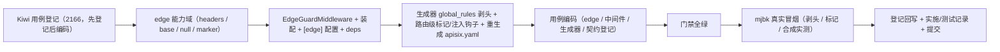

# 边缘认证与请求净化实施记录

> 后端基座与服务化地基 · 04 API网关与边缘 · 02 边缘认证与请求净化 · 实施记录

[文档首页](../../../../../../文档首页.md) › [02 边缘认证与请求净化](../04_API网关与边缘_02_边缘认证与请求净化.md) › 01 实施　|　[详细设计](../设计/01_详细设计_02_边缘认证与请求净化.md) · [测试记录](../测试/01_测试_02_边缘认证与请求净化.md)

## 1. 实施信息 

| 项 | 值 |
| --- | --- |
| 任务 | [02 边缘认证与请求净化](../04_API网关与边缘_02_边缘认证与请求净化.md) |
| 对应需求 | [04-2](../../../../需求/04_需求_API网关与边缘.md#r04-2) |
| 详细设计 | [01_详细设计_02_边缘认证与请求净化](../设计/01_详细设计_02_边缘认证与请求净化.md) |
| 实施日期 | 2026-09-23 |
| 实施人 | minjian |
| 实施环境 | 开发机（Ubuntu，Python 3.14.4 / uv）；真实冒烟于开发服务器 mjbk（Docker，APISIX 3.18.0-debian） |
| 提交 | 设计与文档 / 代码与用例分开提交（`docs(04_02)` / `feat(04_02)`） |
| 结论 | 完成 |

## 2. 实施概览 

## 3. 实施过程 

1. **Kiwi 用例登记（先登记后编码）**：登记 1 条策展用例覆盖全部断言面，平台回读编号 **2166**；登记输入 `test/scripts/kiwi/cases/2026-09-23_阶段二04-02_边缘认证与请求净化.json`，回读 `exports/2026-09-23_阶段二04-02_登记回读.json`。
2. **身份头契约（单一来源）**：新增 `bms_core/edge/headers.py`——仅标准库、无导入，供网关生成器（`ops/gateway_config.py` 精简 CI 环境）与后端同源复用：`IDENTITY_HEADERS`（`X-User-Id` / `X-Tenant-Id` / `X-User-Scopes` / `X-Service-Identity`）+ `GATEWAY_IDENTITY_HEADER`（`X-Gateway-Identity`，值 `bms-edge`）+ `STRIPPED_HEADERS` + `DEFAULT_EDGE_EXEMPT_PATHS`。
3. **边缘信任能力域**：新增 `bms_core/edge/`——`base.py`（`EdgeIdentity` / `EdgeTrustDecision` 数据契约 + `BaseEdgeTrust` 契约 + `get_edge_trust` 提供者 + `require_edge_identity` 授权下沉依赖）、`null.py`（`NullEdgeTrust` 恒定不信任）、`marker.py`（`MarkerEdgeTrust` 标记头实现，需显式参数）、`__init__.py`（轻量）。
4. **边缘守卫中间件**：`api/middleware.py` 增 `EdgeGuardMiddleware`（纯 ASGI）——无条件剥除伪造身份头；信任时回写规范身份头、置 `edge_identity` 请求态与 `current_user_id` 上下文；`[edge].require_gateway_identity` 开且非豁免路径缺失可信身份就地 401；信任模式下剥离客户端租户头、只采信网关注入值；未装配时按「未启用 + 不信任」容错。
5. **配置与装配**：`core/config.py` 增 `EdgeSettings`（`PluginSelection` 扩展 `require_gateway_identity` / `exempt_paths`）与 `Settings.edge`；`config.toml` 增 `[edge]`；`core/assembly.py` `_NULL_MODULES` 增 `bms_core.edge.null`、`PLUGIN_WIRINGS` 增 `edge`、显式登记 `MarkerEdgeTrustFactory`；`application.py` 装配 `EdgeGuardMiddleware`（先于租户解析）；`api/deps.py` 导出 `get_edge_trust` / `require_edge_identity`。
6. **网关声明式净化**：`services/gateway_catalog.py`——新增 `render_global_rules()`（`edge-sanitize`：`proxy-rewrite.headers.remove` 统一剥除伪造头）；`render_routes()` 路由级 `proxy-rewrite.headers.set` 置网关标记并合并 `ROUTE_HEADERS_SET` 注入钩子；`render_apisix_config()` 输出 `{upstreams, routes, global_rules}`；运行 `render` 重生成 `deploy/gateway/apisix.yaml`。
7. **用例与门禁**：新增 `tests/edge/test_edge.py`、扩展 `tests/api/test_middleware.py` 与 `tests/services/test_gateway_catalog.py`；契约登记清单补 `edge`（`services/platform/tests/crosscut/test_plugin_registration.py`）；全量 `pytest` / `ruff` / `pyright` / 基座校验 / 预检全绿。
8. **mjbk 真实冒烟**：同步 `deploy/gateway/apisix.yaml`（热加载）→ 同网络起临时上游 `traefik/whoami`（别名 `platform`、端口 8000）→ 逐项验证（见 §5）→ 清理无残留。
9. **登记回写与记录**：见 §6 与测试记录。

## 4. 问题与处置 

| 问题 | 现象 | 处置 |
| --- | --- | --- |
| global 规则 `headers.set` 被丢弃（关键） | `global_rules` 的 `proxy-rewrite.headers.remove` 生效，但同一规则的 `headers.set`（网关标记）未出现在上游 | mjbk 实测定位：APISIX 同一插件在 global 与 route 两处的 `headers.set` 不叠加，路由级 `proxy-rewrite` 执行后 global 的 set 被丢弃；**标记置入与身份注入移至路由级** `proxy-rewrite.headers.set`，剥头保留 global 规则——已回写详细设计 §4.4 / §5、《部署发布规范》§9 与《APISIX 部署使用说明》排障节 |
| 精简 CI 生成器依赖 | 生成器需读身份头常量，但 CI `base-integrity` 用 python:3.14-slim、无后端依赖 | 常量落 `edge/headers.py`（仅标准库、无导入），生成器与后端同源复用；`gateway_config.py check` 在预检与 CI 均通过 |
| 新增能力域的插件登记契约 | 契约测试 `test_plugin_registration.py` 期望键集未含 `edge`，全量 pytest 报「Extra items: edge」 | 预期键集补 `edge`（`NullEdgeTrust` 自动登记为 `null`、`MarkerEdgeTrustFactory` 显式登记 `marker`） |
| 新增基座类的清单对账 | `check-backend-base.py` 报 `EdgeGuardMiddleware` / `EdgeIdentity` / `EdgeTrustDecision` 未登记 | 《后端基类清单》补 HTTP 中间件行、跨阶段基座 edge 行、§10 继承链与目录 |
| 未装配中间件容错 | 单测 / 非标准装配下无 `settings` / 信任插件 | 中间件按「未启用 + 不信任」处理：仍剥伪造头、不拒绝、不崩溃（用例覆盖） |
| pyright 严格模式 | 测试内构造 `Scope` 类型不被推断 | `scope: Scope` 显式注解；pyright 0 error |

## 5. 验证结果 

| 验证项 | 命令 / 操作 | 结果 |
| --- | --- | --- |
| 全量用例 | `uv run pytest -q --cov=bms_core --cov-branch` | **982 passed / 36 skipped**；总体覆盖率 **96%** |
| 新增模块覆盖率 | 同上门禁 | `edge/*`（headers / base / null / marker）**100%**；`services/gateway_catalog.py` **100%** |
| 静态检查 | `uv run ruff check .` / `ruff format --check .` / `uv run pyright` | 全通过（0 error） |
| 基座校验 | `check-base.py` / `check-backend-base.py` / `check-service-boundaries.py` | 全通过 |
| 本地预检 | `python3 scripts/tools/preflight/check-preflight.py --fast` | 全部通过（含网关零漂移） |

**mjbk 真实冒烟证据**（APISIX 3.18.0，最小上游 `platform`，`deploy/gateway/apisix.yaml` 热加载）：

| 场景 | 请求 | 上游收到（whoami 回显） |
| --- | --- | --- |
| 伪造身份头被剥 | `GET /api/platform/v1/ping` + `X-User-Id/X-Service-Identity/X-Tenant-Id/X-User-Scopes: evil` + `X-Gateway-Identity: forged` | **不含** 全部伪造身份头（`global_rules` 剥除）；**含** `X-Gateway-Identity: bms-edge`（路由级置标记）；自定义头 `X-Custom-Probe` 正常透传 |
| 路径重写 | 同上 | 上游收到 `GET /api/v1/ping`（`proxy-rewrite` 前缀剥离，无回归） |
| 合成顺序实测 | 手工测试配置：global 剥头 + 路由级 `headers.set` 注入 `X-User-Id: injected-by-route`、`X-Gateway-Identity: bms-edge` | 伪造头被剥、路由级注入的 `X-User-Id` / 标记可达上游（global 剥头 → 路由注入的顺序正确） |
| 清理 | `docker rm -f bms-upstream-smoke` + 删备份 | 无残留上游容器；部署配置为新生成件 |

## 6. 登记回写 

| 落点 | 内容 |
| --- | --- |
| 《后端基类清单》 | HTTP 中间件行增 `EdgeGuardMiddleware`；跨阶段基座增 `edge` 行；§10 继承链与目录增 edge |
| 《架构设计 · 后端基础类体系》 | 能力域全景与跨阶段基座契约增「边缘信任」 |
| 《后端开发规范》 | §3.1 增「边缘信任与请求净化必须走基座」强制条 |
| 《部署发布规范》 | §9 增「边缘请求净化与身份头」口径与检查项 |
| 《APISIX 部署使用说明》 | §4 增请求净化来源行、§6 增验证步骤与实测结论、§9 增 global set 丢弃排障 |
| 计划 | §3 移除 04_02；§2 已完成表新增 04_02；§1 计数（已完成 13 / 剩余 16，122h / 134h）；§4 甘特移除 04_02 |
| 任务 / 父任务 | 任务 02 状态与完成日期；父任务子任务表一致 |
| 下游任务文档 | 07_03 补「前置契约（已交付）」（身份头契约 / `ROUTE_HEADERS_SET` 注入钩子 / `edge` 能力域与 `require_edge_identity`） |
| Kiwi TCMS | 用例 **2166**（契约 / 净化 / 信任边界 / 旁路 / 生成器覆盖面） |
| 测试资产仓 | `test/scripts/kiwi/cases/2026-09-23_阶段二04-02_边缘认证与请求净化.json` 与 `exports/2026-09-23_阶段二04-02_登记回读.json` |
| 实施 / 测试记录 | 本文件与[测试记录](../测试/01_测试_02_边缘认证与请求净化.md) |

## 7. 偏差与遗留 

- **偏差（已登记）**：① `global_rules` 的 `headers.set` 被路由级 `proxy-rewrite` 丢弃 → 标记置入与身份注入移至路由级（设计 §4.4 已回写，含 mjbk 实测结论）；② 网关专属标记为非密钥常量，真实防旁路靠服务 JWT / 网络隔离（开放项，见设计 §8）。
- **契约变更（消费方已标注）**：身份头契约 `X-User-Id` / `X-Tenant-Id` / `X-User-Scopes` / `X-Service-Identity` / `X-Gateway-Identity` 与 `ROUTE_HEADERS_SET` 注入钩子——消费方为 07_03（网关认证接线）与前端接入环节；现网消费方为零。
- **遗留（归口）**：① 真实用户 JWT（`openid-connect` / JWKS）与服务 JWT 校验接线 → **07_03**（含以真实实现替换 `[edge].provider`、`require_auth` 切换）；② 限流 → **04_03**；③ 前端静态产物接入与 TLS / 域名 → **部署阶段 13**；④ 信任模式的 `require_gateway_identity` 生产取值（prod 配置开启）→ 随 07_03 认证接线一并启用。
- **不改**：服务内 `/api/v1` 契约、网关外部路径约定、探针口径、既有服务目录生成规则、既有 Kiwi 用例号、`require_auth` 占位语义。

> 依《文档生成规范》编写 · 与《测试记录》配套
