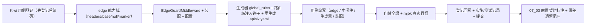

# 边缘认证与请求净化详细设计

> 后端基座与服务化地基 · 04 API网关与边缘 · 02 边缘认证与请求净化 · 详细设计

[文档首页](../../../../../../文档首页.md) › [02 边缘认证与请求净化](../04_API网关与边缘_02_边缘认证与请求净化.md) › 详细设计　|　[父任务：API网关与边缘](../../04_API网关与边缘.md) · [本阶段需求](../../../../需求/04_需求_API网关与边缘.md) · [排期计划](../../../../计划/01_计划_后端基座与服务化地基.md)

## 1. 概述 <a id="overview"></a>

- **目标**：以「网关统一认证 + 后端只授权」的零信任口径，交付**边缘请求净化**与**后端信任边界**的机制与契约——网关声明式剥掉客户端伪造的身份头、注入网关验证过的身份；后端只信任来自网关 / 带服务身份的流量、剥除伪造身份头并做授权，不重复认证。
- **依据**：《[架构设计 · API 网关与边缘](../../../../../../设计/架构设计/36_架构设计_子系统_API网关与边缘.md)》「边缘功能」「安全边界」节；《[架构设计 · 认证与会话](../../../../../../设计/架构设计/14_架构设计_子系统_认证与会话.md)》「服务身份与服务间认证」节；《[架构设计 · 性能与安全](../../../../../../设计/架构设计/31_架构设计_性能与安全.md)》「服务间安全」节；知识档案《[微服务 · 安全与认证](../../../../../../资料/知识档案/微服务/08_微服务_安全与认证.md)》；需求 [04-2](../../../../需求/04_需求_API网关与边缘.md#r04-2)；前置任务 [04_01 详细设计](../../04_API网关与边缘_01_网关接入与声明式配置/设计/01_详细设计_01_网关接入与声明式配置.md)。
- **范围（本任务）**：
  1. **网关注入头契约**：确定网关注入 / 后端信任的身份头与网关专属标记头（`X-User-Id` / `X-Tenant-Id` / `X-User-Scopes` / `X-Service-Identity` / `X-Gateway-Identity`），作为两端的唯一契约。
  2. **网关声明式请求净化**：生成器新增 `global_rules`（`edge-sanitize`：剥除客户端伪造身份头 + 置网关专属标记），路由级预留**身份注入钩子**（`ROUTE_HEADERS_SET`，07_03 填充）。
  3. **后端边缘信任能力域 `edge`**：新增横切能力域（`BaseEdgeTrust` 契约 + `EdgeIdentity` / `EdgeTrustDecision` 数据契约 + `NullEdgeTrust` 占位 + `MarkerEdgeTrust` 标记头实现 + `get_edge_trust` 提供者 + `require_edge_identity` 依赖）。
  4. **边缘守卫中间件 `EdgeGuardMiddleware`**：纯 ASGI——无条件剥除客户端伪造身份头、按配置与信任判定注入可信身份到请求态与上下文、旁路流量就地拒绝；先于租户解析执行，使租户身份只采信网关注入值。
  5. **配置与装配**：`Settings.edge` / `[edge]` 配置节（provider / 旁路开关 / 豁免路径 / 标记值经 `options`），纳入 `PLUGIN_WIRINGS` 与 `_NULL_MODULES`。
  6. **演进预留与接线点**：真实用户 JWT 校验（`openid-connect` / JWKS）与服务间服务 JWT 校验归 07_03——本任务只交付机制、契约与接线点，不改网关认证插件启用状态。
- **不含（明确归口，见第 8 节）**：边缘 JWT 校验与认证插件启用（07_03）；双类 JWT 签发与 JWKS（07_02）；OIDC IdP 接入（07_01）；限流（04_03）；mTLS（K8s 阶段）。

## 2. 现状与差距 <a id="gap"></a>

| 关注点 | 现状（04_01 交付后） | 差距（本任务目标） |
| --- | --- | --- |
| 网关身份净化 | `apisix.yaml` 仅 `upstreams` / `routes`，路由插件仅 `proxy-rewrite`（路径重写）；`ROUTE_PLUGINS` 钩子默认空 | 新增 `global_rules` 统一剥头 + 置标记；路由级预留身份注入钩子 |
| 身份头契约 | 未定义 | 定义 `X-User-Id` / `X-Tenant-Id` / `X-User-Scopes` / `X-Service-Identity` / `X-Gateway-Identity` 契约常量 |
| 后端信任边界 | 后端不识别身份头；`require_auth` 恒定放行占位；租户解析链直接采信客户端 `X-Tenant-ID` | 新增 `edge` 能力域 + `EdgeGuardMiddleware`：剥伪造头、按信任注入身份、旁路拒绝 |
| 授权下沉 | 无「可信身份」入口 | 新增 `require_edge_identity`（读可信身份、缺失 401）；`require_auth` 占位保留至 07_03 |
| 租户身份 | 直接采信客户端 `X-Tenant-ID`（多租户自选） | 边缘信任模式下剥离客户端租户头、只采信网关注入的 `X-Tenant-Id` |
| 旁路防护 | 无 | 网关专属标记头 + `[edge].require_gateway_identity` 开关（占位；真实服务 JWT 校验归 07_03） |

## 3. 交付物清单 <a id="tree"></a>

```text
backend/
├── libs/bms_core/src/bms_core/
│   ├── edge/
│   │   ├── __init__.py                        # 新：能力域包（轻量，不导入重依赖）
│   │   ├── headers.py                         # 新：身份头 / 标记头 / 剥除清单常量（仅标准库，供生成器复用）
│   │   ├── base.py                            # 新：BaseEdgeTrust 契约 + EdgeIdentity / EdgeTrustDecision + 提供者 + require_edge_identity
│   │   ├── null.py                            # 新：NullEdgeTrust（占位，恒定不信任）
│   │   └── marker.py                          # 新：MarkerEdgeTrust（网关专属标记头判定）
│   ├── api/middleware.py                       # 改：新增 EdgeGuardMiddleware（剥头 / 信任注入 / 旁路拒绝）
│   ├── core/config.py                          # 改：EdgeSettings + Settings.edge
│   ├── core/assembly.py                        # 改：_NULL_MODULES 增 bms_core.edge.null；register_platform_plugins 登记 marker 工厂；PLUGIN_WIRINGS 增 edge
│   ├── application.py                          # 改：装配 EdgeGuardMiddleware（先于租户解析）
│   └── api/deps.py                             # 改：导出 get_edge_trust / require_edge_identity
├── libs/bms_core/tests/
│   ├── edge/test_edge.py                       # 新：契约 / 占位 / 标记实现 / 提供者 / 依赖
│   ├── api/test_middleware.py                  # 改：EdgeGuardMiddleware 行为（剥头 / 注入 / 旁路拒绝 / 租户）
│   └── services/test_gateway_catalog.py        # 改：global_rules + 路由级注入钩子
└── config.toml                                 # 改：新增 [edge] 节

deploy/gateway/apisix.yaml                       # 改：重生成（global_rules 剥头 + 置标记）

bms文档/
├── 后端基类清单.md                              # 改：HTTP 中间件行 + edge 能力域登记 + 继承链
├── 设计/架构设计/04_架构设计_后端基础类体系.md    # 改：edge 能力域登记
├── 规范/后端开发规范.md                         # 改：§3.1 增「边缘信任与请求净化必须走基座」强制条
├── 规范/部署发布规范.md                         # 改：§9 增「边缘请求净化与身份头」口径与检查项
├── 资料/开发服务器/linux/APISIX部署使用说明.md    # 改：增请求净化验证（global_rules 实测结论）
└── 项目/02_后端基座与服务化地基/…
    ├── 计划/01_计划_后端基座与服务化地基.md      # 改：§1 台账/§2 已完成/§3 移除 04_02/§4 甘特
    ├── 任务/04_API网关与边缘/04_API网关与边缘.md  # 改：子任务表状态与完成日期
    ├── 任务/04_…_02_边缘认证与请求净化/           # 改：任务状态/完成日期 + 实施/测试记录
    └── 任务/07_认证与服务身份/07_…_03_…md         # 改：补「前置契约（已交付）」（边缘契约与接线点）

test/
└── scripts/kiwi/cases|exports/…                 # 新：本任务用例登记输入与回读
```

## 4. 领域设计 <a id="design"></a>

### 4.1 身份头契约与信任模型 <a id="contract"></a>

**身份头契约**（`edge/headers.py` 常量，两端的唯一来源）：

| 头 | 方向 | 语义 |
| --- | --- | --- |
| `X-Gateway-Identity` | 网关注入 | 网关专属标记（值 `bms-edge`，非密钥）；后端据此判定「来自可信边缘」 |
| `X-User-Id` | 网关注入 | 网关验证过的用户标识（07_03 经认证插件注入） |
| `X-Tenant-Id` | 网关注入 | 网关验证过的租户编码（与既有 `X-Tenant-ID` 同头，大小写不敏感） |
| `X-User-Scopes` | 网关注入 | 网关验证过的 scope 集合（逗号分隔） |
| `X-Service-Identity` | 网关注入 | 服务身份（服务间调用，07_03） |

- `IDENTITY_HEADERS`（用户 / 租户 / scope / 服务身份）+ `GATEWAY_IDENTITY_HEADER` 合成 `STRIPPED_HEADERS`：**客户端伪造的一律剥除**（网关侧与后端侧各做一遍，纵深防御）。
- 常量模块 `edge/headers.py` **仅标准库、无导入**，供网关生成器（`backend/ops/gateway_config.py` 精简 CI 环境）与后端复用，避免 CI 拉入重依赖。

**信任判定**（`BaseEdgeTrust.evaluate(headers) -> EdgeTrustDecision`）：

| 输入 | 判定 | 后端行为 |
| --- | --- | --- |
| 标记头 == 期望值 | `trusted=True`，按头解析 `EdgeIdentity` | 注入可信身份头 + 置 `edge_identity` 请求态 + `current_user_id` 上下文 |
| 标记头缺失 / 不符 | `trusted=False` | 剥除全部身份头；`require_gateway_identity` 开且非豁免路径 → 401（旁路）；否则放行（无身份） |

- **占位口径**：标记值为 Git 内非密钥常量，仅作「结构占位 + 可测」；真实防旁路靠服务 JWT（07_03）与网络隔离 / K8s mTLS，本任务在设计 §8 明确标注该开放项。
- **身份头命名**：沿用需求文档命名（决策记录 #5），与既有 `X-Tenant-ID` 大小写不敏感一致。

### 4.2 后端 `edge` 能力域 <a id="edge-domain"></a>

**契约** `bms_core/edge/base.py`：

```text
edge/base.py
├── GATEWAY_IDENTITY_HEADER / GATEWAY_IDENTITY_VALUE / USER_ID_HEADER / TENANT_ID_HEADER
│   / USER_SCOPES_HEADER / SERVICE_IDENTITY_HEADER / IDENTITY_HEADERS / STRIPPED_HEADERS
├── DEFAULT_EDGE_EXEMPT_PATHS
├── EdgeIdentity（frozen dataclass，BaseObject）：user_id / tenant_code / scopes / service_identity
├── EdgeTrustDecision（frozen dataclass，BaseObject）：trusted / identity / reason
├── BaseEdgeTrust(BasePluggable)：key = plugin_key = "edge"；抽象 evaluate(headers) -> EdgeTrustDecision
├── get_edge_trust(request) -> BaseEdgeTrust            # 依赖注入提供者（按 [edge].provider 解析）
└── require_edge_identity(request) -> EdgeIdentity       # 授权下沉依赖：无可信身份抛 AuthError（20001 / 401）
```

**实现**：

| 实现 | 文件 | 语义 |
| --- | --- | --- |
| `NullEdgeTrust`（占位，`plugin_name=null`） | `edge/null.py` | `evaluate` 恒定 `trusted=False`、`identity=None`（不信任任何来源；不引入假身份） |
| `MarkerEdgeTrust`（`plugin_name=marker`） | `edge/marker.py` | 标记头 == 期望值即信任，按头解析 `EdgeIdentity`（user_id 解析失败记 None，不整体失败） |

- `MarkerEdgeTrust` 构造需显式参数（`expected`），不经继承自动登记；由 `register_platform_plugins` 的 `MarkerEdgeTrustFactory(settings)` 显式登记（读取 `[edge].options.gateway_identity`）。
- `get_edge_trust` 复用 `resolve_plugin("edge", settings.edge.provider, expected_version=BaseEdgeTrust.contract_version)`；`[edge].provider` 空串回退 `null`。
- `require_edge_identity` 读请求态 `edge_identity`（由 `EdgeGuardMiddleware` 写入），缺失抛 `AuthError`；供后端路由声明「只授权、不重复认证」的入口。

### 4.3 边缘守卫中间件 <a id="middleware"></a>

`bms_core/api/middleware.py::EdgeGuardMiddleware`（纯 ASGI，继承 `BaseObject`；与既有中间件同口径）：

- **装配次序（关键）**：在 `application.py` 中于 `TenantMiddleware` 之后、`TraceIdMiddleware` 之前注册——后注册者在外层，故运行序为 `ReadOnly → RequestLogging → TraceId → EdgeGuard → Tenant`：**EdgeGuard 先于租户解析**，剥头 / 注入即时对租户解析可见；链路 id 与访问日志在外层，拒绝响应仍被记录并带链路 id。
- **处理流程**（仅 `http` 作用域；非 http 直通）：

```text
1. 读原始头 → 取 settings.edge（缺省按未启用）与 app.state.edge（缺省按 NullEdgeTrust）
2. decision = trust.evaluate(原始头)
3. 重建头：无条件剥除 STRIPPED_HEADERS；信任时按 EdgeIdentity 回写规范身份头（含 X-Tenant-Id）
4. 写回 scope["headers"]（租户解析读同一 scope，即时可见）
5. 置 scope["state"]["edge_identity"] / ["edge_trusted"]；置 current_user_id 上下文（请求结束复位）
6. 未信任且 [edge].require_gateway_identity 且非豁免路径 → build_error_response(AuthError) 就地返回（不进入下游）
```

- **租户身份口径（决策 #6）**：`require_gateway_identity` 开启时，客户端 `X-Tenant-ID` 一律剥除，仅采信网关注入的 `X-Tenant-Id`；未开启（dev / test）保持既有「客户端自选租户」行为不回归。
- **豁免路径**：`[edge].exempt_paths`（缺省 `/` `/docs` `/redoc` `/openapi.json` `/healthz` `/readyz`）不参与旁路拒绝与租户净化，供编排探针与文档可达。
- **健壮性**：`settings` / 信任插件缺失（未装配 / 单测直用）时按「未启用 + 不信任」处理——仍剥除伪造身份头、不拒绝，行为可预期。

### 4.4 网关声明式请求净化 <a id="gateway"></a>

生成器 `bms_core/services/gateway_catalog.py` 扩展（决策 #2：`global_rules` 统一剥头 + 路由级预留注入）：

- **`render_global_rules()`**：新增全局规则 `edge-sanitize`——`proxy-rewrite.headers` 先 `remove` 客户端伪造身份头（`STRIPPED_HEADERS`）、再 `set` 网关专属标记 `X-Gateway-Identity: bms-edge`（proxy-rewrite 头动作执行序 add → remove → set，置标记在剥除之后）。
- **`render_routes()`** 预留注入钩子 `ROUTE_HEADERS_SET: dict[str, dict[str, str]] = {}`（按 `service_key` 合并到路由 `proxy-rewrite.headers.set`，默认空）：07_03 填入 `{"X-User-Id": "$jwt_claim_sub", ...}` 即完成「注入网关验证过的身份」，不改生成结构。
- **`render_apisix_config()`** 输出 `{upstreams, routes, global_rules}`；确定性、零漂移校验不变（`ops/gateway_config.py render|check`）。

生成件 `deploy/gateway/apisix.yaml` 形态（节选）：

```yaml
global_rules:
  - id: edge-sanitize
    plugins:
      proxy-rewrite:
        headers:
          remove:
            - X-User-Id
            - X-Tenant-Id
            - X-User-Scopes
            - X-Service-Identity
            - X-Gateway-Identity
          set:
            X-Gateway-Identity: bms-edge
routes:
  - id: route-platform
    uris:
      - '/api/platform/v1'
      - '/api/platform/v1/*'
    upstream_id: platform
    plugins:
      proxy-rewrite:
        regex_uri:
          - '^/api/platform/v1(.*)$'
          - '/api/v1$1'
#END
```

- **真机实测项（强制）**：`global_rules` 中 `proxy-rewrite` 的头剥除 / 标记置入行为、以及其与路由级 `proxy-rewrite`（07_03 注入）的先后合成，须在 mjbk 实测并回写结论；若 global 规则与路由插件对同名 `proxy-rewrite` 不叠加，则降级为「剥头并入路由级 `proxy-rewrite`」（结构不变、落点平移），结论记入实施/测试记录与《APISIX 部署使用说明》。

### 4.5 配置与装配 <a id="config"></a>

`config.toml` 新增（非密钥；标记值经 `options`）：

```toml
[edge]
# 边缘信任实现选择（插件化；空串 = null 占位不信任；marker = 网关专属标记头判定）
provider = ""
# 旁路防护开关：true 时非豁免路径缺网关注入身份即拒（dev/test 关，prod 开）
require_gateway_identity = false
# 旁路 / 租户净化豁免路径（精确匹配；编排探针与文档）
exempt_paths = ["/", "/docs", "/redoc", "/openapi.json", "/healthz", "/readyz"]
# 非敏感选项（gateway_identity = 网关专属标记期望值，缺省取基座常量 bms-edge）
options = {}
```

- `Settings.edge: EdgeSettings`（`EdgeSettings → PluginSelection`，追加 `require_gateway_identity` / `exempt_paths`）；`PLUGIN_WIRINGS` 增 `PluginWiring("edge", BaseEdgeTrust, "edge", "edge")`；`_NULL_MODULES` 增 `bms_core.edge.null`；`register_platform_plugins` 增 `register_plugin("edge", "marker", MarkerEdgeTrustFactory(settings))`。

### 4.6 K8s 平移口径 <a id="k8s"></a>

| 单机（本任务） | K8s 阶段 | 说明 |
| --- | --- | --- |
| `global_rules` / 路由 `proxy-rewrite.headers` 剥头 | Ingress / Gateway API 的请求头改写 filter | 头净化语义一致 |
| 网关注入身份头（`X-*`） | 网关 / Ingress Controller 注入 | 「边缘验证身份、后端只授权」心智不变 |
| 标记头 + `[edge].require_gateway_identity` 占位 | Linkerd 自动 mTLS（传输层身份） | 传输层身份替代应用层占位标记，后端信任边界不改 |

### 4.7 与 07_03 的接线点（本任务交付 / 07_03 启用） <a id="wire"></a>

| 项 | 本任务交付 | 07_03 启用 |
| --- | --- | --- |
| 网关注入头契约 | 常量与文档契约 | `openid-connect` / 服务 JWT 校验后按契约注入 |
| 路由级注入钩子 | `ROUTE_HEADERS_SET` 结构 + 空默认 | 填 `$jwt_claim_*` 等完成注入 |
| 后端信任实现 | `BaseEdgeTrust` 契约 + `MarkerEdgeTrust` 占位 | 以「服务 JWT 校验」实现替换 `[edge].provider` |
| 旁路防护 | 标记头 + 开关 | 服务 JWT 校验（内部服务只接受带服务身份流量） |
| 授权下沉 | `require_edge_identity` | 路由接 `require_auth` / 权限码，替换占位 |

## 5. 失败分支与边界 <a id="failures"></a>

| 场景 | 处理 |
| --- | --- |
| 客户端伪造 `X-User-Id` / `X-Service-Identity` | 网关 `global_rules` 剥除；后端 `EdgeGuardMiddleware` 再剥一遍（纵深防御），下游不可见 |
| 客户端伪造租户头（信任模式开） | 客户端 `X-Tenant-ID` 剥除，仅采信网关注入 `X-Tenant-Id` |
| 直接访问后端（旁路，`require_gateway_identity=true`，非豁免路径） | `EdgeGuardMiddleware` 就地 401（AuthError / 20001），不进入下游 |
| 无 `X-Gateway-Identity`（dev 默认，未启用信任模式） | 不拒绝、无身份；身份头仍剥除；租户按既有解析链（客户端头可用） |
| `[edge].provider` 空 / 未装配信任插件 | 等价 `NullEdgeTrust`（恒定不信任）；不拒绝；行为可预期 |
| 标记值不匹配（配置与网关不一致） | 不信任 → 按旁路开关拒绝或放行无身份；由配置一致性保证 |
| `X-User-Id` 非数字 | `EdgeIdentity.user_id` 记 None，其余身份（租户 / scope / 服务身份）照常；不整体失败 |
| 网关 `global_rules` / 路由 `proxy-rewrite` 不叠加（真机实测项） | 降级为剥头并入路由级 `proxy-rewrite`；结构不变、落点平移（设计 §4.4） |
| 探针 / 文档路径（豁免） | 不参与旁路拒绝与租户净化，编排探针可达 |
| 「注入身份」端到端证据 | 本任务以「网关标记 + 校验后注入」机制可测；真实 JWT claims 注入证据归 07_03 |
| 达梦 / 三库方言 | 不涉及（网关与边缘中间件不直连数据库） |

## 6. 测试设计与验收映射 <a id="tests"></a>

用例先登记 Kiwi TCMS（本任务登记 **1 条策展用例**，多条断言共用同一 `kiwi_id`，编号以平台回读为准，见第 9 节）。

| 用例 / 文件 | 类型 | 断言要点 |
| --- | --- | --- |
| `libs/bms_core/tests/edge/test_edge.py` | 单元 | `NullEdgeTrust` 恒定不信任；`MarkerEdgeTrust` 标记匹配 → 信任并解析身份（user_id 合法 / 非法两种）、不匹配 → 不信任；`get_edge_trust` 按 provider 解析；`require_edge_identity` 有 / 无身份（401） |
| `libs/bms_core/tests/api/test_middleware.py` | 单元 | 无条件剥除伪造身份头；信任时回写规范身份头 + 置 `current_user_id`；`require_gateway_identity` 开且非豁免 → 401、豁免 → 放行；关闭时不拒绝；信任模式下客户端租户头被剥 / 网关注入租户头生效；非 http 直通；上下文复位 |
| `libs/bms_core/tests/services/test_gateway_catalog.py` | 单元 | `global_rules` 结构（id、remove 清单、set 标记）；确定性；`ROUTE_HEADERS_SET` 钩子合并与空默认；既有路由 / 重写断言不回归 |
| `libs/bms_core/tests/ops/test_gateway_config.py` | 单元 | `render` / `check` 对含 `global_rules` 的生成件零漂移通过、篡改拦截（既有断言延续） |
| 装配回归（`tests/core/test_application_factory.py` 等） | 单元 | `[edge]` 纳入装配；`PLUGIN_WIRINGS` / `_NULL_MODULES` 完整；应用可启动、探针可访问 |
| mjbk 真实冒烟 | 集成（人工留痕） | 网关拉起后：带伪造 `X-User-Id` / `X-Service-Identity` 的请求到上游 whoami 不携带身份头；网关注入标记头可见于上游；`global_rules` 与路由级 `proxy-rewrite` 合成结论留痕；后端 `EdgeGuardMiddleware` 旁路拒绝（本地 ASGI 冒烟） |
| 既有全量回归 | 单元 + 集成 | 全量 `pytest` / `ruff` / `pyright` / 基座校验全绿（无行为回归） |

验收映射：

| 完成标准（需求 04-2） | 验证方式 |
| --- | --- |
| 未认证请求被网关拒绝 | 本任务交付机制与接线点（真实 JWT 校验证据归 07_03）；边缘契约 + 旁路开关用例覆盖 |
| 伪造身份头被剥离、注入身份正确 | 网关 `global_rules` 剥头 mjbk 冒烟；后端剥头与信任注入中间件用例 |
| 后端仅信任网关 / 服务身份流量 | `EdgeGuardMiddleware` 旁路拒绝用例；`require_edge_identity` 依赖用例 |
| 用例覆盖 | Kiwi 策展用例 + 单元 / 集成用例 |
| 校验通过 | `pytest` / `ruff` / `pyright` / `check-base` / `check-backend-base` / `check-service-boundaries` / `check-status` 全绿 |

## 7. 登记落点 <a id="registry-writeback"></a>

| 落点 | 内容 |
| --- | --- |
| 《后端基类清单》 | HTTP 中间件行增 `EdgeGuardMiddleware`；横切扩展能力域增 `edge` 行；§10 继承链增 edge 链 |
| 《架构设计 · 后端基础类体系》 | 增 `edge` 能力域登记（语义与落点） |
| 《后端开发规范》 | §3.1 增「边缘信任与请求净化必须走边缘能力域基座」强制条 |
| 《部署发布规范》 | §9 增「边缘请求净化与身份头」口径与检查项 |
| 《APISIX 部署使用说明》 | 增请求净化验证与 `global_rules` 实测结论 |
| 计划 | §1 工时台账与计数；§2 已完成表（04_02 行）；§3 移除 04_02；§4 甘特调整 |
| 任务 / 父任务 | 状态与完成日期两处一致（需求文档不承载进度） |
| 下游任务文档 | 07_03 补「前置契约（已交付）」：身份头契约、`ROUTE_HEADERS_SET` 注入钩子、`edge` 能力域与 `require_edge_identity` |
| Kiwi TCMS / 测试资产仓 | 登记本任务用例并回读编号；`test/scripts/kiwi/cases|exports/` 对应文件 |
| 实施 / 测试记录 | 任务目录 `实施/`、`测试/` 各一份 |

## 8. 边界与开放项 <a id="boundary"></a>

- **归 07_03**：真实用户 JWT 校验（`openid-connect` + JWKS）与服务 JWT 校验接线；`ROUTE_HEADERS_SET` 填充真实 claims；以真实实现替换 `[edge].provider`；`require_auth` 切到真实用户体系。
- **归 07_01 / 07_02**：OIDC IdP 接入；双类 JWT 签发 / `aud` 区分 / JWKS 分发。
- **归 04_03**：限流与服务发现共享计数。
- **开放项（安全）**：网关专属标记头为非密钥常量，仅结构占位；真实防旁路依赖服务 JWT（07_03）与网络隔离（K8s mTLS）。本任务保证「机制可用、契约稳定、替换点单一」。
- **开放项（真机）**：`global_rules` 中 `proxy-rewrite` 与路由级 `proxy-rewrite` 的合成先后须 mjbk 实测；结论回写《APISIX 部署使用说明》，必要时按 §4.4 降级。
- **不改**：服务内 `/api/v1` 前缀与响应体、网关外部路径约定、探针口径、既有服务目录生成规则、既有 Kiwi 用例号、`require_auth` 现有占位语义。

## 9. 实施步骤 <a id="steps"></a>



1. 读《[KiwiTCMS 部署使用说明](../../../../../../资料/开发服务器/linux/KiwiTCMS部署使用说明.md)》「用例约定」节，登记本任务用例并**回读编号**（输入文件落 `test/scripts/kiwi/cases/`；先登记后编码）。
2. 新增 `bms_core/edge/`（`headers.py` / `base.py` / `null.py` / `marker.py` / `__init__.py`）。
3. 改 `api/middleware.py` 增 `EdgeGuardMiddleware`；`application.py` 装配；`core/config.py` 增 `EdgeSettings`；`core/assembly.py` 登记 null / marker 与 wiring；`api/deps.py` 导出。
4. 改 `services/gateway_catalog.py`（`render_global_rules` + `ROUTE_HEADERS_SET` + `render_apisix_config`）；`config.toml` 增 `[edge]`；运行 `render` 重生成 `deploy/gateway/apisix.yaml`。
5. 用例：`edge` 单元 + 中间件 + 生成器 + 装配；既有全量回归。
6. 门禁：`uv run pytest -q --cov=bms_core --cov-branch` / `ruff check` / `ruff format --check` / `pyright`；`check-base` / `check-backend-base` / `check-service-boundaries` / `check-status` / `check-preflight --fast` 全绿。
7. **mjbk 真实冒烟**（远程操作，先读部署说明）：同步 `deploy/gateway/` → 拉起 APISIX（+ 临时上游 `traefik/whoami`）→ 验证伪造身份头被剥、标记头注入、`global_rules` 与路由级 `proxy-rewrite` 合成结论；留痕到测试记录。
8. 登记回写（基类清单 / 架构 / 规范 / 部署发布规范 / APISIX 说明 / 计划 / 任务状态）+ 实施 / 测试记录 + 代码与文档分开提交。
9. 07_03 前置契约标注与偏差遗留闭环（另提交）。

关键命令：

```bash
cd backend
uv run python -m ops.gateway_config render      # 重生成 deploy/gateway/apisix.yaml
uv run python -m ops.gateway_config check       # 零漂移校验
uv run pytest -q --cov=bms_core --cov-branch
uv run ruff check . && uv run ruff format --check . && uv run pyright
# 仓库根
python3 scripts/tools/base-check/check-base.py
python3 scripts/tools/base-check/check-backend-base.py
python3 scripts/tools/base-check/check-service-boundaries.py
python3 scripts/tools/check-docs/check-status.py
python3 scripts/tools/preflight/check-preflight.py --fast
```

## 10. 决策记录（对齐记录） <a id="align"></a>

| # | 事项 | 结论（逐项确认） |
| --- | --- | --- |
| 1 | 边缘认证实现深度 | 只做机制与净化；真实 JWT 校验归 07_03 |
| 2 | 网关剥头落点 | `global_rules` 统一剥头 + 路由级预留注入（`ROUTE_HEADERS_SET`） |
| 3 | 后端信任边界落点 | 新增横切能力域 `edge`（契约 + 占位 + 标记实现 + 提供者 + 中间件 + 依赖） |
| 4 | 旁路防护依据 | 网关专属标记头 + `[edge].require_gateway_identity` 开关（占位；真实服务 JWT 校验归 07_03） |
| 5 | 身份头命名 | 沿用需求命名 `X-User-Id` / `X-Tenant-Id` / `X-Service-Identity` / `X-User-Scopes`（+ 标记 `X-Gateway-Identity`） |
| 6 | 租户身份净化 | 纳入：信任模式下剥离客户端 `X-Tenant-ID`，只采信网关注入租户头 |
| 7 | 授权下沉 | 新增 `require_edge_identity`；保留 `require_auth` 占位至 07_03 |
| 8 | 能力域 / 配置命名 | 能力域 `edge`、能力键 `edge`、配置节 `[edge]` |
| 9 | 验证深度 | 本机单测 + 装配 + mjbk 真实冒烟 |
| 10 | 登记范围 | 全量登记（基类清单 / 架构 / 规范 / 计划 / 任务 / 下游契约） |

## 11. 参考文档 <a id="ref"></a>

- [架构设计 · API 网关与边缘](../../../../../../设计/架构设计/36_架构设计_子系统_API网关与边缘.md)「边缘功能」「安全边界」节
- [架构设计 · 认证与会话](../../../../../../设计/架构设计/14_架构设计_子系统_认证与会话.md)「服务身份与服务间认证」节
- [架构设计 · 性能与安全](../../../../../../设计/架构设计/31_架构设计_性能与安全.md)「服务间安全」节
- [知识档案 · 微服务 · 安全与认证](../../../../../../资料/知识档案/微服务/08_微服务_安全与认证.md)
- [需求 04-2：边缘认证与请求净化](../../../../需求/04_需求_API网关与边缘.md#r04-2)
- [04_01 网关接入与声明式配置详细设计](../../04_API网关与边缘_01_网关接入与声明式配置/设计/01_详细设计_01_网关接入与声明式配置.md)
- [后端基类清单](../../../../../../后端基类清单.md)
- [APISIX · proxy-rewrite 插件](https://apisix.apache.org/docs/apisix/plugins/proxy-rewrite/)
- [APISIX · Deployment modes（standalone global_rules）](https://apisix.apache.org/docs/apisix/deployment-modes/)
- [KiwiTCMS 部署使用说明](../../../../../../资料/开发服务器/linux/KiwiTCMS部署使用说明.md)「用例约定」节

> 本文档依《[文档生成规范](../../../../../../规范/文档生成规范.md)》编写 · 关键决策逐项确认
