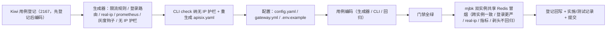

# 限流与服务发现实施记录

> 后端基座与服务化地基 · 04 API网关与边缘 · 03 限流与服务发现 · 实施记录

[文档首页](../../../../../../文档首页.md) › [03 限流与服务发现](../04_API网关与边缘_03_限流与服务发现.md) › 01 实施　|　[详细设计](../设计/01_详细设计_03_限流与服务发现.md) · [测试记录](../测试/01_测试_03_限流与服务发现.md)

## 1. 实施信息 

| 项 | 值 |
| --- | --- |
| 任务 | [03 限流与服务发现](../04_API网关与边缘_03_限流与服务发现.md) |
| 对应需求 | [04-3](../../../../需求/04_需求_API网关与边缘.md#r04-3) |
| 详细设计 | [01_详细设计_03_限流与服务发现](../设计/01_详细设计_03_限流与服务发现.md) |
| 实施日期 | 2026-09-23 |
| 实施人 | minjian |
| 实施环境 | 开发机（Ubuntu，Python 3.14.4 / uv）；真实冒烟于开发服务器 mjbk（Docker，APISIX 3.18.0-debian × 2 实例共享 bms-redis） |
| 提交 | 设计与文档 / 代码与用例分开提交（`docs(04_03)` / `feat(04_03)`） |
| 结论 | 完成 |

## 2. 实施概览 

## 3. 实施过程 

1. **Kiwi 用例登记（先登记后编码）**：登记 1 条策展用例覆盖全部断言面，平台回读编号 **2167**；登记输入 `test/scripts/kiwi/cases/2026-09-23_阶段二04-03_限流与服务发现.json`，回读 `exports/2026-09-23_阶段二04-03_登记回读.json`。
2. **生成器扩展**（`bms_core/services/gateway_catalog.py`）：新增 `env_var`（`${{VAR:=默认}}` 发出）、`rate_limit_plugin`（`limit-count` 共享 Redis：`policy=redis` / `remote_addr` / 通用 300/60s / `allow_degradation=true` / `show_limit_quota_header=true`）、`render_login_routes`（认证敏感路径独立路由 + `priority=10` + 登录档 10/60s）、`validate_service_discovery`（上游节点非 IP 护栏）、`render_plugin_metadata`（限流响应头名）、`GRAY_TRAFFIC` 灰度钩子；`render_routes` 注入限流与 `prometheus: {}`，`render_global_rules` 增 `edge-real-ip`，`render_apisix_config` 并入登录路由与 `plugin_metadata`。
3. **CLI**：`backend/ops/gateway_config.py::check` 在零漂移比对后追加 `validate_service_discovery`，违规打印并退出码 1；运行 `render` 重生成 `deploy/gateway/apisix.yaml`。
4. **部署配置**：`deploy/gateway/config.yaml` 增 `plugin_attr.prometheus`（`export_addr 0.0.0.0:9091`）与访问日志（`nginx_config.http`，stdout）；`deploy/compose/gateway.yml` 注入 `GATEWAY_REDIS_HOST` / `GATEWAY_REDIS_PASSWORD` / `GATEWAY_TRUSTED_CIDR` 环境变量并暴露指标端口；`deploy/.env.example` 补键。
5. **用例与门禁**：扩展 `tests/services/test_gateway_catalog.py`（限流 / 登录路由 / real-ip / 观测 / 灰度 / 护栏）与 `tests/ops/test_gateway_config.py`（无 IP 护栏拦截）；全量 `pytest` / `ruff` / `pyright` / 基座校验 / 预检全绿，新增模块覆盖率 100%。
6. **mjbk 真实冒烟**：同步配置 → 重组 `bms-apisix` → 起第二实例 `bms-apisix-2`（共享 `compose_default` 网络与 `bms-redis`）与临时上游 `whoami`（别名 `platform` / `identity`）→ 逐项验证（见 §5）→ 清理无残留。
7. **登记回写与记录**：见 §6 与测试记录。

## 4. 问题与处置 

| 问题 | 现象 | 处置 |
| --- | --- | --- |
| 端口 / 库环境变量替换致配置加载失败（关键） | 首轮部署日志 `failed to check the configuration of plugin limit-count err: then clause did not match`，整份 `apisix.yaml` 未加载（全 404） | 首轮配置把 `redis_port` / `redis_database` 也写成 `${{...}}`，APISIX 替换后为字符串、schema 要求整数即校验失败；改为**整数字面量**（`6379` / `0`），主机 / 密码保留环境变量替换——已回写详细设计 §4.1 / §5 / §10（含实测结论） |
| 冒烟上游缺 `identity` 别名 | 登录路由（上游 `identity`）首轮冒烟返回 503（上游不可达），限流计数正常但响应不直观 | 重建临时上游容器时同时给 `--network-alias platform --network-alias identity`，复测 10 次 200、第 11 次 429 |
| `limit-count` Redis 配置无法经 `plugin_metadata` 共享 | 调研确认 `limit-count` 的 metadata_schema 仅含响应头名，Redis 连接须写进每个插件实例 | 由生成器对每条路由统一注入完整 Redis 配置，避免遗漏；`plugin_metadata` 仅用于响应头名声明 |
| 空密码 AUTH 兼容 | dev Redis 无鉴权，密码占位缺省空串 | APISIX 源码 `conf.redis_password ~= ''` 才发 AUTH，空串不发送；mjbk 实测计数正常 |
| 直连 9080 的 IP 伪造面 | `real-ip` 之外仍可伪造 `X-Real-IP` | `trusted_addresses` 限定可信网段（默认 Docker 私网）；生产应关闭 9080 直连暴露（开放项，见设计 §8） |

## 5. 验证结果 

| 验证项 | 命令 / 操作 | 结果 |
| --- | --- | --- |
| 全量用例 | `uv run pytest -q --cov=bms_core --cov-branch` | **992 passed / 36 skipped**；总体覆盖率 **96%** |
| 新增模块覆盖率 | 同上门禁 | `services/gateway_catalog.py` / `ops/gateway_config.py` 语句 + 分支 **100%** |
| 静态检查 | `uv run ruff check .` / `ruff format --check .` / `uv run pyright` | 全通过（0 error） |
| 基座校验 | `check-base.py` / `check-backend-base.py` / `check-service-boundaries.py` / `check-status.py` | 全通过 |
| 本地预检 | `python3 scripts/tools/preflight/check-preflight.py --fast` | 全部通过（含网关零漂移 + 无硬编码 IP） |

**mjbk 真实冒烟证据**（APISIX 3.18.0；`bms-apisix` :9080/:9091 与临时 `bms-apisix-2` :9081/:9092 共享 `bms-redis`；上游 whoami 别名 `platform` / `identity`）：

| 场景 | 请求 | 实测结果 |
| --- | --- | --- |
| 多副本共享计数 | 实例 A 登录路由连打 10 次 → 第 11 次；实例 B 第 1 次 | A #1~#10 **200**（remaining 9→0）、A #11 **429**、**B #1 429**（跨实例共享配额） |
| 登录限流更严 | 登录档 10/60s vs 通用 300/60s | 登录第 11 次即 429；通用路由 `X-RateLimit-Limit: 300` / `X-RateLimit-Remaining: 299` |
| 计数落 Redis | `redis-cli --scan --pattern '*limit*'` | `plugin-limit-count:v1:/routes/route-identity-auth-login:…:172.18.0.1`（共享键） |
| real-ip 还原 | `GET /api/platform/v1/ping` + `X-Real-IP: 203.0.113.9`（可信来源） | platform 限流 key 末尾为 `203.0.113.9`（真实 IP 生效） |
| 指标端点 | `GET :9091/:9092 /apisix/prometheus/metrics` | 75 / 106 条 `apisix_*` 指标（两实例均可达） |
| 伪造身份头剥除不回归 | `GET /api/platform/v1/ping` + 伪造身份头 + `X-Custom-Probe` | 上游响应含 `X-Gateway-Identity: bms-edge` 与 `X-Custom-Probe: yes`，**不含**伪造 `X-User-Id` / `X-Service-Identity` / `X-Tenant-Id` |
| 清理 | `docker rm -f bms-upstream-smoke bms-apisix-2` + 清限流 key | 无残留容器、无限流 key 残留 |

## 6. 登记回写 

| 落点 | 内容 |
| --- | --- |
| 《部署发布规范》 | §9 增「边缘限流与共享计数」「边缘观测出口」「服务发现禁硬编码 IP」口径与检查项 |
| 《APISIX 部署使用说明》 | §4 增限流 / 观测 / real-ip 来源行、§6 增验证步骤、§9 增端口整数 schema 排障 |
| 计划 | §3 移除 04_03；§2 已完成表新增 04_03；§1 计数（已完成 14 / 剩余 15，128h / 128h）；§4 甘特移除 04_03 |
| 任务 / 父任务 | 任务 03 状态与完成日期；父任务子任务表一致 |
| 下游任务文档 | 08_01 补「前置契约（已交付）」（APISIX 指标端点 + 访问日志出口）；07_03 前置契约补「限流维度扩展钩子」 |
| Kiwi TCMS | 用例 **2167**（限流 / 登录更严 / 无 IP 护栏 / 观测 / 灰度覆盖面） |
| 测试资产仓 | `test/scripts/kiwi/cases/2026-09-23_阶段二04-03_限流与服务发现.json` 与 `exports/2026-09-23_阶段二04-03_登记回读.json` |
| 实施 / 测试记录 | 本文件与[测试记录](../测试/01_测试_03_限流与服务发现.md) |

## 7. 偏差与遗留 

- **偏差（已登记）**：① `redis_port` / `redis_database` 由「环境变量替换」改为**整数字面量**——真机实测 `limit-count` schema 要求整数、字符串占位致配置加载失败（设计 §4.1 已回写，含实测结论）；② `real-ip` 可信网段默认 Docker 私网，直连 9080 仍存在伪造面（开放项，见设计 §8）。
- **契约变更（消费方已标注）**：网关新增 `limit-count`（429 + `X-RateLimit-*` 响应头）与认证敏感路径独立限流——消费方为前端接入环节（响应头）与 07_03（限流维度扩展）；现网消费方为零。
- **遗留（归口）**：① 用户 / 租户 / client 维度限流接线 → **07_03**（复用 `rate_limit_plugin` 的 `key` 参数改 `var_combination`）；② 指标抓取 / 展示 / 告警与访问日志采集 → **08_需求**（本任务已交付端点与出口）；③ 后端接口级 slowapi 真实 Redis 后端与登录失败锁定 → **性能与安全阶段**；④ 真实灰度版本与权重发布 → **版本发布流程**（本任务只交付钩子）；⑤ 每服务独立端口 → **06_需求**。
- **不改**：服务内 `/api/v1` 契约、网关外部路径约定、探针口径、既有服务目录生成规则、既有 Kiwi 用例号、`require_auth` 占位语义。

> 依《文档生成规范》编写 · 与《测试记录》配套
