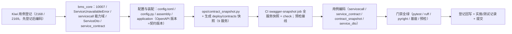

# 服务契约与同步调用实施记录

> 后端基座与服务化地基 · 05 服务间通信与一致性 · 01 服务契约与同步调用 · 实施记录

[文档首页](../../../../../../文档首页.md) › [01 服务契约与同步调用](../05_服务间通信与一致性_01_服务契约与同步调用.md) › 01 实施　|　[详细设计](../设计/01_详细设计_01_服务契约与同步调用.md) · [测试记录](../测试/01_测试_01_服务契约与同步调用.md)

## 1. 实施信息 

| 项 | 值 |
| --- | --- |
| 任务 | [01 服务契约与同步调用](../05_服务间通信与一致性_01_服务契约与同步调用.md) |
| 对应需求 | [05-1](../../../../需求/05_需求_服务间通信与一致性.md#r05-1) |
| 详细设计 | [01_详细设计_01_服务契约与同步调用](../设计/01_详细设计_01_服务契约与同步调用.md) |
| 实施日期 | 2026-09-23 |
| 实施人 | minjian |
| 实施环境 | 开发机（Ubuntu，Python 3.14.4 / uv；SQLite） |
| 提交 | 设计与文档 / 代码与用例分开提交（`docs(05_01)` / `feat(05_01)`） |
| 结论 | 完成 |

## 2. 实施概览 

## 3. 实施过程 

1. **Kiwi 用例登记（先登记后编码）**：登记 2 条策展用例——契约快照面（回读 **2168**）、同步调用与读出口面（回读 **2169**）；输入 `test/scripts/kiwi/cases/2026-09-23_阶段二05-01_服务契约与同步调用.json`，回读 `exports/2026-09-23_阶段二05-01_登记回读.json`。
2. **错误码与异常**（`core/error_codes.py` / `core/exceptions.py`）：新增通用段 `SERVICE_UNAVAILABLE = 10007` 与 `ServiceUnavailableError(GeneralError)`（HTTP 503）。
3. **服务间调用能力域**（`bms_core/servicecall/`）：`base.py`（`BaseServiceClient` / `ServiceRequest` / `ServiceResponse` / `ServiceCallPolicy` + `validate_service_request`（公开契约边界）+ `build_service_url` / `service_dependency` / `get_service_client`）、`http.py`（`HttpServiceClient`：httpx + 可注入 transport + 超时 / 重试 / 熔断 / 限流）、`null.py`（`NullServiceClient`）。
4. **跨服务读出口**（`schemas/service.py`）：新增 `ServiceDto`（响应基类派生）；只读投影沿用 `query` 域 `BaseQueryProvider`，不新建平行出口。
5. **公开契约工具**（`services/service_contract.py`）：`enabled_service_records` / `service_enabled` / `render_contract_json` / `validate_contract` / `CONTRACTS_DIR`；纯函数、不 import 服务包。
6. **配置与装配**：`Settings` 增 `service_client` 分区；`config.toml` 增 `[service_client]`；`assembly.py` 增 `service_client` 接线、`bms_core.servicecall.null` 缺省模块与 `HttpServiceClientFactory`（`provider="http"`，注入熔断 / 降级 / 限流实例与基址模板）；`application.py` 的 FastAPI 版本改用 `contract_version`（OpenAPI `info.version`=公开契约版本）；`api/deps.py` 导出 `get_service_client`。
7. **契约快照 CLI**（`ops/contract_snapshot.py`）：`export`（内存构建各启用服务 `ApplicationFactory().create(None).openapi()`，写 `deploy/contracts/<service>.json`）/ `check`（逐字节零漂移 + 契约版本一致 + 缺件 / 多余件）；生成 9 个启用服务快照。
8. **CI 与预检**：改造 `swagger-snapshot` job（`check` 门禁 + `export` 归档 `deploy/contracts/*.json`）；`deploy/ci/verify/contract` 档位说明更新；`check-preflight.py --fast` 纳 `contract_snapshot check`。
9. **登记回写与记录**：见 §6 与测试记录。

## 4. 问题与处置 

| 问题 | 现象 | 处置 |
| --- | --- | --- |
| 错误码 `10006` 已被占用（关键） | 设计确认时拟新增 `10006 服务不可用`，实施核查发现 `DATABASE_UNAVAILABLE = 10006` 已发布 | 服务不可用顺延 **`10007`**（平台错误码只改 `core/error_codes.py` 单一登记点，既有码位不复用），详细设计 §4.4 / §10 与清单登记同步按 10007 落定 |
| 契约快照漂移用例首轮失效 | 首版用例用 `replace("http","https")` 制造漂移，但 OpenAPI 文本不含 `http` 字样，替换为空操作、`check` 仍通过 | 用例改为追加换行制造确定的文本漂移；`check` 逐字节比对如期拦截（测试记录 §3） |
| OpenAPI 版本语义变更 | `application.py` 由服务版本改契约版本作为 FastAPI `version` | 各服务 `__version__` 与 `CONTRACT_VERSION` 当前同为 `0.1.0`，观测值不变；仅语义对齐（`info.version`=公开契约版本）；`test_application_factory` 测试工厂同步声明 `contract_version` |
| 新增 `service_client` 端口未登记 | `test_plugin_registration` 的端口清单断言缺少新域 | 端口清单加入 `service_client`（能力域登记语义用例，非行为回归） |
| `servicecall/base.py` 类型自引用 | `_default_rate_limit_key` 定义在 `BaseServiceClient` 之后，模块级顺序无碍；pyright 严格模式校验 `Mapping` / `cast` | 补 `cast` 与显式类型，pyright 0 error |

## 5. 验证结果 

| 验证项 | 命令 / 操作 | 结果 |
| --- | --- | --- |
| 全量用例 | `uv run pytest -q --cov=bms_core --cov=… --cov-branch --cov-fail-under=70` | **1030 passed / 36 skipped**；总体覆盖率 **95.45%** |
| 新增模块覆盖率 | 同上（`--cov=bms_core.servicecall --cov=bms_core.services.service_contract --cov=bms_core.schemas.service --cov=ops.contract_snapshot`） | 语句 + 分支 **100%** |
| 静态检查 | `uv run ruff check .` / `ruff format --check .` / `uv run pyright` | 全通过（0 error） |
| 基座校验 | `check-base` / `check-backend-base(+--self-test)` / `check-service-boundaries(+--self-test)` / `check-status` | 全通过 |
| 契约零漂移 | `uv run python -m ops.contract_snapshot check` | 通过（9 个启用服务快照与公开契约一致） |
| 本地预检 | `python3 scripts/tools/preflight/check-preflight.py --fast` | 全部通过（含契约零漂移） |

## 6. 登记回写 

| 落点 | 内容 |
| --- | --- |
| 《后端基类清单》 | §9 增「服务间调用」「服务公开契约快照」两行；§10 继承链补 `NullServiceClient` / `HttpServiceClient` → `BaseServiceClient` 与数据契约 / `ServiceDto` / `ServiceUnavailableError`；目录清单补 `servicecall/` / `schemas/service.py` / `services/service_contract.py` |
| 《后端开发规范》 | §3.2 增「服务间调用必须走基座（强制）」（公开契约路径 + 服务登记启用 + 韧性复用；跨服务读只经契约 DTO 或只读投影） |
| 计划 | §1 计数与工时（已完成 15 / 剩余 14，138h / 118h）；§2 已完成表新增 05_01；§3 移除 05_01；§4 甘特移除 05_01 节点并调整 05_02 起始 |
| 任务 / 父任务 | 任务 01 状态与完成日期；父任务子任务表一致 |
| Kiwi TCMS | 用例 **2168**（契约快照）/ **2169**（同步调用与读出口） |
| 测试资产仓 | `test/scripts/kiwi/cases/2026-09-23_阶段二05-01_服务契约与同步调用.json` 与 `exports/2026-09-23_阶段二05-01_登记回读.json` |
| 实施 / 测试记录 | 本文件与[测试记录](../测试/01_测试_01_服务契约与同步调用.md) |
| 架构节点 | 无（37 / 09 / 11 已述语义；本任务为实现细节，不回改架构语义） |

## 7. 偏差与遗留 

- **偏差（已登记）**：① 服务不可用错误码由设计确认时的 `10006` 顺延为 **`10007`**（`10006` 已被 `DATABASE_UNAVAILABLE` 占用，既有平台码位不复用）；② 契约快照漂移用例由「字符串替换」改为「追加换行」制造漂移（原替换对 OpenAPI 文本为空操作）。
- **契约变更（已登记）**：各服务 OpenAPI `info.version` 语义由服务版本改为**公开契约版本**（当前取值同为 `0.1.0`，观测值不变）；`swagger-snapshot` job 产物由单服务 `backend/swagger.json` 改为全服务 `deploy/contracts/*.json`（消费方为 09_03 契约门禁，现网消费方为零）。
- **遗留（归口）**：① 跨服务 import / 跨库访问 CI 硬校验与边界度量 → **05_02**；② oasdiff 破坏性变更门禁与 Schemathesis 契约测试 → **09_03**（消费本任务快照）；③ 服务身份 JWT 注入请求头 → **07_03**；④ 每服务独立端口与 `base_url_template` 地址来源 → **06_需求**。
- **开放项**：真实实现装配默认 `null`（`[service_client].provider` 空），不主动外呼；启用真实实现置 `provider = "http"`。非幂等方法重试保护由调用方按业务幂等要求收敛（业务幂等键归 05_03）。
- **不改**：服务内 `/api/v1` 契约与响应体、探针口径、服务目录登记规则与启动校验、网关外部路径约定、既有 Kiwi 用例号、`require_auth` 占位语义。

> 依《文档生成规范》编写 · 与《测试记录》配套
