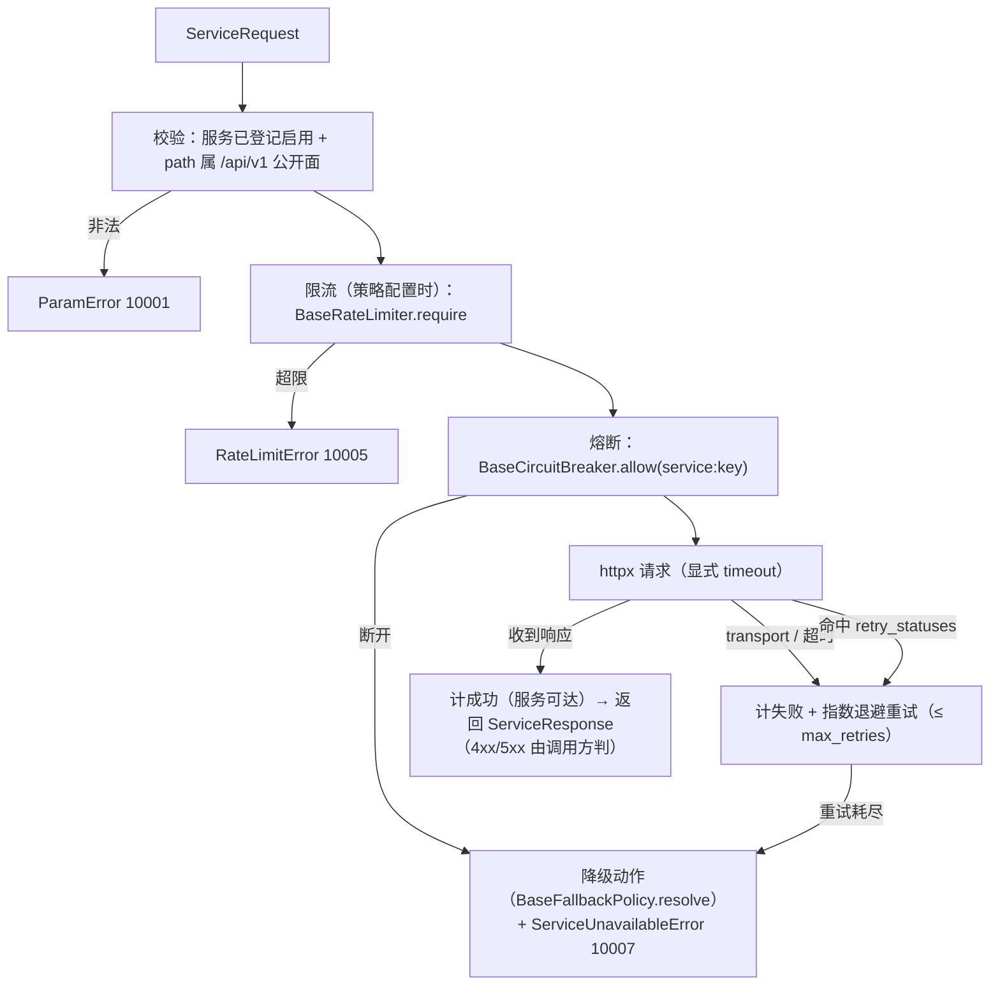

# 服务契约与同步调用详细设计

> 后端基座与服务化地基 · 05 服务间通信与一致性 · 01 服务契约与同步调用 · 详细设计

[文档首页](../../../../../../文档首页.md) › [01 服务契约与同步调用](../05_服务间通信与一致性_01_服务契约与同步调用.md) › 详细设计　|　[父任务：服务间通信与一致性](../../05_服务间通信与一致性.md) · [本阶段需求](../../../../需求/05_需求_服务间通信与一致性.md) · [排期计划](../../../../计划/01_计划_后端基座与服务化地基.md)

## 1. 概述 <a id="overview"></a>

- **目标**：在 02_01 服务化骨架（`libs/bms_core` + `services/<服务>`）与 03_需求服务目录 / 契约登记之上，交付**每服务唯一公开契约（OpenAPI）与契约快照零漂移校验**、**服务间同步调用封装（显式超时 / 重试 / 熔断 / 限流，复用基座）**、**跨服务读出口口径（契约 DTO 基类 + 只读投影沿用查询提供者）**，把「服务间只经公开契约协作、能异步就异步、能短链就短链」变成可执行、可校验的基座能力（服务化地基 S1）。
- **依据**：《[架构设计 · 服务间通信与分布式一致性](../../../../../../设计/架构设计/37_架构设计_子系统_服务间通信与一致性.md)》「服务边界与契约」「同步调用」节；《[架构设计 · 接口与集成](../../../../../../设计/架构设计/09_架构设计_接口与集成.md)》「服务间通信与契约」节；《[架构设计 · 模块注册](../../../../../../设计/架构设计/11_架构设计_子系统_模块注册.md)》「服务目录与契约登记」节；《[后端开发规范](../../../../../../规范/后端开发规范.md)》「模块边界与数据所有权」节；《[微服务演进规划](../../../../../../规划/微服务演进规划.md)》「服务化地基要求与门禁」S1 / S7；需求 [05-1](../../../../需求/05_需求_服务间通信与一致性.md#r05-1)；前置任务 [02_01 详细设计](../../../02_多服务骨架与仓库/02_多服务骨架与仓库_01_monorepo 多服务工程与共享基座库/设计/01_详细设计_01_monorepo 多服务工程与共享基座库.md) / [03_02 详细设计](../../../03_服务目录与契约登记/03_服务目录与契约登记_02_启动与 CI 唯一性校验/设计/01_详细设计_02_启动与 CI 唯一性校验.md)。
- **范围（本任务）**：
  1. **公开契约版本口径**：服务 OpenAPI 的 `info.version` 由服务版本改为服务自报**契约版本**（`CONTRACT_VERSION`），使「公开契约（OpenAPI）版本」与 sys_module 契约登记同源；服务版本仍留探针 / 日志。
  2. **契约快照与零漂移**：新增 `ops/contract_snapshot.py`（`export` 导出各启用服务 OpenAPI 为确定性 JSON 到 `deploy/contracts/<service_key>.json`；`check` 校验已提交快照与各服务 OpenAPI 零漂移、契约版本与登记主版本一致、无缺件 / 无多余件），改造既有 `swagger-snapshot` CI job（单服务产物 → 全服务快照归档 + check 门禁），并纳入本地预检。
  3. **服务间同步调用能力域** `bms_core/servicecall/`：端口 `BaseServiceClient`（插件键 `service_client`）、数据契约 `ServiceRequest` / `ServiceResponse` / `ServiceCallPolicy`、真实实现 `HttpServiceClient`（httpx，可注入 transport）与缺省 `NullServiceClient`；调用前强制**公开契约路径**（`/api/v1/` 前缀）+ **目标服务已在服务目录登记启用**；显式 `timeout` / `max_retries`（指数退避）+ 复用 `BaseCircuitBreaker` / `BaseFallbackPolicy` / `BaseRateLimiter`。
  4. **跨服务读出口**：新增跨服务契约 DTO 基类 `ServiceDto`（响应基类派生）；只读投影沿用既有 `BaseQueryProvider`（数据查询提供者），不新建平行出口；配套护栏用例与强制口径回写。
  5. **错误码**：新增通用段 `10007` 服务不可用（`ServiceUnavailableError`，HTTP 503；`10006` 已被 `DATABASE_UNAVAILABLE` 占用）。
- **不含（明确归口，见第 8 节）**：跨服务 import / 跨库访问硬校验与边界度量（05_02）；oasdiff 破坏性变更门禁与 Schemathesis 契约测试（09_03）；事务性 Outbox / 幂等消费 / 事件契约 / Saga（05_03 / 05_04）；真实服务身份 JWT（07_03，本任务调用请求头预留、不注入令牌）。

## 2. 现状与差距 <a id="gap"></a>

| 关注点 | 现状（03_02 后） | 差距（本任务目标） |
| --- | --- | --- |
| 公开契约 | 各服务有 `CONTRACT_VERSION` 并接库校验主版本；OpenAPI `info.version` 用**服务版本** | `info.version` 改用**契约版本**，公开契约版本与服务目录登记同源 |
| 契约快照 | `swagger-snapshot` job 仅导出 `bms_platform` 一份 `swagger.json` 归档，无零漂移、无全服务 | 每启用服务一份确定性快照入仓 + `check` 零漂移（改造既有 job） |
| 服务间调用 | 无服务间调用封装；`outbound/http` 为面向**外部**的 HTTP 契约（占位） | 新增 `service_client` 能力域：公开契约路径约束 + 显式超时 / 重试 / 熔断 / 限流 |
| 跨服务读 | `query`（数据查询提供者）已交付；无跨服务 DTO 基类 | 新增 `ServiceDto`；只读投影沿用查询提供者并回写强制口径 |
| 错误码 | 通用段至 `10006`（数据库不可用） | 新增 `10007` 服务不可用 |

## 3. 交付物清单 <a id="tree"></a>

```text
backend/
├── config.toml                                              # 改：新增 [service_client] 配置分区
├── libs/bms_core/src/bms_core/
│   ├── core/error_codes.py                                  # 改：新增 SERVICE_UNAVAILABLE = 10007
│   ├── core/exceptions.py                                   # 改：新增 ServiceUnavailableError（10007 / 503）
│   ├── core/config.py                                       # 改：Settings 增 service_client 分区
│   ├── core/assembly.py                                     # 改：接线 service_client + 注册 http 工厂 + null 模块
│   ├── application.py                                       # 改：FastAPI version 改用 contract_version
│   ├── schemas/service.py                                   # 新：跨服务契约 DTO 基类 ServiceDto
│   ├── services/service_contract.py                         # 新：启用服务枚举 / 快照渲染 / 契约校验（纯函数，不 import 服务）
│   └── servicecall/                                         # 新：服务间同步调用能力域
│       ├── __init__.py                                      #   新：导出面
│       ├── base.py                                          #   新：契约 / 数据 / 常量 / 校验 / 依赖提供者
│       ├── http.py                                          #   新：HttpServiceClient（httpx 真实实现）
│       └── null.py                                          #   新：NullServiceClient（占位）
├── libs/bms_core/tests/
│   ├── servicecall/__init__.py + test_servicecall.py         # 新：调用韧性 / 公开契约边界 / 读出口
│   ├── services/test_service_contract.py                    # 新：快照渲染确定性 / 契约校验 / 启用服务
│   ├── ops/test_contract_snapshot.py                        # 新：快照导出与零漂移
│   └── schemas/test_service_dto.py                          # 新：跨服务 DTO 基类
└── ops/contract_snapshot.py                                 # 新：公开契约快照 CLI（export / check）

deploy/
├── contracts/<service_key>.json                             # 新：各启用服务公开契约快照（9 份）
└── ci/verify/contract                                       # 改：档位说明（单服务 swagger → 全服务契约快照）

scripts/tools/preflight/check-preflight.py                   # 改：纳 contract_snapshot check
.gitlab-ci.yml                                               # 改：swagger-snapshot job 全服务快照 + check

bms文档/
├── 后端基类清单.md                                           # 改：新增服务间调用 / 跨服务 DTO / 契约快照登记与继承链
├── 规范/后端开发规范.md                                       # 改：§3.2 增服务间调用与跨服务读出口强制口径
├── 项目/02_后端基座与服务化地基/…
│   ├── 计划/01_计划_后端基座与服务化地基.md                    # 改：§1 台账/§2 已完成/§3 移除 05_01/§4 甘特
│   ├── 任务/05_服务间通信与一致性/05_服务间通信与一致性.md      # 改：子任务表状态与完成日期
│   ├── 任务/…_01_服务契约与同步调用/                          # 改：任务状态/完成日期 + 设计/实施/测试记录
│   └── 任务/…_02_数据所有权与边界硬校验/…                      # 改：补「前置契约（已交付）」

test/
└── scripts/kiwi/cases|exports/…                            # 新：本任务用例登记输入与回读
```

## 4. 领域设计 <a id="design"></a>

### 4.1 公开契约版本与快照 <a id="contract"></a>

**公开契约 = 服务 OpenAPI**（`/api/v1` 业务接口 + 探针 + 根路由），是服务间唯一访问面；「内部实现」指服务 Python 包与私有模块，不是路由。

- **版本口径**：`BaseServiceApplicationFactory.create()` 构造 FastAPI 时 `version=self.contract_version`（此前为服务版本）。各服务 `__version__` 与 `CONTRACT_VERSION` 当前同为 `0.1.0`，观测值不变；语义上 OpenAPI `info.version` 自此为**公开契约版本**，与 `sys_module.contract_version` 同源。服务版本仍出现在根路由 `{name, version}`、`/readyz` 探针与日志。
- **快照渲染（`bms_core/services/service_contract.py`，纯函数、不 import 服务）**：

```text
service_contract.py
├── CONTRACTS_DIR = "deploy/contracts"                      # 相对仓库根
├── contract_file_name(service_key) -> "<service_key>.json"
├── enabled_service_records() -> 启用的服务登记行（service_key 非空且 status=enabled）
├── service_enabled(service_key) -> bool                    # 服务间调用寻址前置校验
├── render_contract_json(openapi) -> str                    # 确定性 JSON（indent=2 / sort_keys / 非 ASCII 直出 + 尾换行）
└── validate_contract(service_key, openapi, record) -> [str]
    ├── 结构：openapi / info / paths 存在、paths 非空
    └── 版本：info.version == record.contract_version（格式与主版本由 core.version 判定）
```

- **CLI（`backend/ops/contract_snapshot.py`）**：动态 `import_module(f"bms_{service_key}.main")` 取 `ApplicationFactory`，**内存构建** `ApplicationFactory().create(None).openapi()`（不启 lifespan、不连库），逐服务渲染并写 `deploy/contracts/<service_key>.json`。

  | 命令 | 行为 | 退出码 |
  | --- | --- | --- |
  | `export [--print]` | 遍历启用服务，构建 OpenAPI 并写入快照目录 | 0（写失败 / 服务不可构建非 0） |
  | `check` | 逐服务比对已提交快照与实时 OpenAPI（逐字节）；检出缺件 / 多余件 / 漂移 / 契约版本不符即失败 | 0 一致；1 不一致 |

- **确定性**：同一代码 → 同文本（`sort_keys` + 固定缩进），供 Git 比对与零漂移校验（与 04_01 网关配置同法）。
- **CI**：改造既有 `swagger-snapshot` job——`uv sync` 后先 `check`（门禁），再 `export` 并归档 `deploy/contracts/*.json`。oasdiff 破坏性变更拦截留 09_03。

### 4.2 服务间同步调用能力域 <a id="servicecall"></a>

```text
bms_core/servicecall/base.py
├── DEFAULT_CALL_TIMEOUT = 5.0 / DEFAULT_MAX_RETRIES = 2 / DEFAULT_RETRY_BACKOFF = 0.1
├── DEFAULT_RETRY_STATUSES = (429, 500, 502, 503, 504)
├── DEFAULT_BASE_URL_TEMPLATE = "http://{service}:8000"     # Compose DNS，迁 K8s 平移 Service 名
├── SERVICE_CALL_DEPENDENCY_PREFIX = "service:"             # 熔断 / 降级依赖标识：service:<key>
├── ServiceCallPolicy(BaseObject, frozen)                   # timeout / max_retries / retry_statuses / retry_backoff
│                                                           #   / circuit_breaker / rate_limit / rate_limit_key
├── ServiceRequest(BaseObject, frozen)                      # service / method / path / query / headers / json_body / content / policy
├── ServiceResponse(BaseObject, frozen)                     # status_code / headers / content + payload() 解析
├── BaseServiceClient(BasePluggable, ABC)                   # key = plugin_key = "service_client"；async call(ServiceRequest)
├── validate_service_request(request) -> None               # service 已登记启用 + path 以 API_PREFIX 开头，否则 ParamError(10001)
├── build_service_url(request, base_url_template) -> str     # 基址模板 format(service=...) + path + 查询串
└── get_service_client(request) -> BaseServiceClient         # 依赖注入提供者
```

**调用语义（`HttpServiceClient.call`）**：



| 项 | 口径 |
| --- | --- |
| 协议 | REST + JSON（OpenAPI 契约），直连服务（东西向**不经网关**） |
| 超时 | 每次调用显式 `timeout`（默认 5s，`ServiceCallPolicy` 可覆盖） |
| 重试 | transport 异常与 `retry_statuses` 命中即指数退避重试；`max_retries` 默认 2（共 3 次尝试）；重试耗尽抛 10007 |
| 熔断 | 调用前 `allow`、后 `record_success` / `record_failure`（依赖名 `service:<key>`）；断开快速失败 |
| 限流 | 策略携带 `rate_limit`（`RateLimitRule`）时经 `BaseRateLimiter` 判定，超限抛 10005；默认不限 |
| 降级 | 失败时 `BaseFallbackPolicy.resolve("service:<key>", exc=...)`，动作写入 `ServiceUnavailableError.data`（基座只给动作、不接管调用链，调用方按动作处理） |
| 请求头 | 预留 `headers`；**服务身份 JWT 注入随 07_03**，本任务不注入令牌 |
| 寻址 | 基址模板取 `[service_client].options.base_url_template`（默认 `http://{service}:8000`）；`path` 必须 `/api/v1/` 开头、`service` 必须在服务目录登记启用，否则 `ParamError`（把「只经公开契约」变成可校验护栏） |

**缺省实现 `NullServiceClient`**：恒定返回 `200` 空响应、不外呼（装配默认 `null`；启用真实实现置 `[service_client].provider = "http"`）。

**装配**：`PLUGIN_WIRINGS` 增 `service_client`；`_NULL_MODULES` 增 `bms_core.servicecall.null`；`register_platform_plugins` 注册 `HttpServiceClientFactory`（`provider="http"`，构造时按配置解析熔断 / 降级 / 限流实例，`base_url_template` 取 `[service_client].options`）。

### 4.3 跨服务读出口 <a id="readside"></a>

《后端开发规范》「模块边界与数据所有权」定读侧**两条合法出口**，本任务据此落位：

| 出口 | 承载 | 说明 |
| --- | --- | --- |
| ① 契约 DTO（同步，少量 / 强一致） | `ServiceDto`（`bms_core/schemas/service.py`，继承 `BaseSchema`）+ `BaseServiceClient` | 跨服务同步读经公开契约，返回体落 `ServiceDto` 派生模型；**禁止直接依赖他服务 ORM 模型** |
| ② 只读投影（列表聚合 / 报表 / 检索） | 沿用既有 `BaseQueryProvider`（`bms_core/query/`，数据查询提供者） | **不新建平行出口**；只读出口**不得用于写** |

- `ServiceDto` 只作为跨服务契约响应 DTO 的公共基类（复用统一序列化 / ID 字符串化 / 掩码口径），不引入跨服务字段耦合。
- 护栏用例断言 `ServiceDto` 继承链与序列化口径、`ServiceDto` 可承接契约响应；跨服务读出口强制口径回写《后端开发规范》§3.2。

### 4.4 错误码与异常 <a id="errors"></a>

| 码 | 名称 | HTTP | 场景 |
| --- | --- | --- | --- |
| `10007` | `SERVICE_UNAVAILABLE` | 503 | 下游不可达 / 超时 / 重试耗尽 / 熔断断开（`ServiceUnavailableError`，`data` 携降级动作与依赖名） |
| （复用）`10001` | `PARAM` | 200 | 服务未登记启用 / 路径非公开契约面 |
| （复用）`10005` | `RATE_LIMIT` | 429 | 调用侧限流超限 |

> `10006` 已被 `DATABASE_UNAVAILABLE` 占用，故服务不可用顺延 `10007`；只改 `core/error_codes.py`（新增平台错误码单一登记点）。

### 4.5 与相邻能力域分工 <a id="boundary"></a>

| 能力 | 分工 |
| --- | --- |
| `outbound/http`、`outbound/webhook` | **外部**出站集成；服务间东西向恒走 `service_client`（本域），不复用外部出站契约 |
| `circuit` / `fallback` / `ratelimit` | 服务间调用**复用**三者基座（不重复实现计数 / 动作 / 配额） |
| `events` | 跨服务**异步**协作走事件（05_03 / 05_04）；同步调用能短链就短链、能异步就异步 |
| `query` | 只读投影出口（`BaseQueryProvider`），本任务不改造 |
| 边界硬校验 | 跨服务 import / 跨库访问的 CI 硬校验与度量归 **05_02** |

## 5. 失败分支与边界 <a id="failures"></a>

| 场景 | 处理 |
| --- | --- |
| `service` 未在服务目录登记 / 未启用 | `ParamError`（10001），不发起调用 |
| `path` 非 `/api/v1/` 开头（试图访问内部面） | `ParamError`（10001），不发起调用 |
| 下游超时 / 连接失败 | 计失败 + 指数退避重试；耗尽抛 `ServiceUnavailableError`（10007，`data.fallback` 携动作） |
| 下游返回 `retry_statuses` 命中状态 | 同上重试；耗尽抛 10007 |
| 下游返回 4xx / 非重试 5xx | 计成功（服务可达）并**原样返回** `ServiceResponse`，由调用方判定 |
| 熔断断开 | 不发起调用，快速失败抛 10007（`data.fallback` 携动作） |
| 限流超限 | `RateLimitError`（10005 / 429），不发起调用 |
| 无熔断 / 降级 / 限流实现（provider 空） | 解析到 `null` 实现：恒放行 / 恒 RAISE / 恒放行；调用语义不报错 |
| 未配置 `[service_client]`（provider 空） | 解析到 `NullServiceClient`：恒定成功、不外呼（不主动外呼） |
| 服务构建失败（快照 export / check） | 打印服务名与异常，退出码非 0 |
| 快照缺件 / 多余件 / 漂移 / 契约版本不符 | `check` 退出码 1，打印明细 |
| 达梦 / 三库方言 | 不涉及（本域不直连数据库） |

## 6. 测试设计与验收映射 <a id="tests"></a>

用例先登记 Kiwi TCMS（本任务登记 **2 条策展用例**，编号以平台回读为准，见第 9 节）。

| 用例 / 文件 | 类型 | 断言要点 |
| --- | --- | --- |
| `libs/bms_core/tests/servicecall/test_servicecall.py` | 单元 | 契约路径护栏（非 `/api/v1` / 未登记服务 → 10001）；策略默认值；`HttpServiceClient` 经 `httpx.MockTransport`：超时重试与耗尽抛 10007、命中 `retry_statuses` 重试后成功、熔断断开快速失败（不发起请求）、限流超限抛 10005、4xx 原样返回、降级动作入 `data`；`NullServiceClient` 恒定成功；`get_service_client` 解析 |
| `libs/bms_core/tests/schemas/test_service_dto.py` | 单元 | `ServiceDto` 继承 `BaseSchema`、序列化口径；只读投影出口可见（`BaseQueryProvider` 可解析） |
| `libs/bms_core/tests/services/test_service_contract.py` | 单元 | `render_contract_json` 确定性（同输入同文本）；`validate_contract` 对版本不符 / 结构缺失报错；`enabled_service_records` / `service_enabled`（planned 服务不可用） |
| `libs/bms_core/tests/ops/test_contract_snapshot.py` | 集成 | `export` 产出各启用服务快照；`check` 对已提交快照通过、缺件（空目录）失败、额外文件失败、漂移失败 |
| 既有全量回归 | 单元 + 集成 | 全量 `pytest` / `ruff` / `pyright` / 基座校验 / 预检全绿（无行为回归） |

验收映射：

| 完成标准（需求 05-1） | 验证方式 |
| --- | --- |
| 服务间调用经公开契约 | 路径前缀 / 服务登记护栏用例（10001）+ `HttpServiceClient` 用例 |
| 超时 / 重试 / 熔断可证 | `MockTransport` 驱动超时重试 / 状态重试 / 熔断快速失败用例 + 限流用例 |
| 契约快照可导出 | `ops/contract_snapshot.py export` + `deploy/contracts/*.json` + `check` 零漂移用例与 CI job |
| 禁止内部实现访问可校验 | 公开契约路径约束用例（05_02 再补跨服务 import / 跨库 CI 硬校验） |
| `pytest` / `ruff` / `pyright` 全绿 | 门禁命令（见第 9 节） |

## 7. 登记落点 <a id="registry-writeback"></a>

| 落点 | 内容 |
| --- | --- |
| 《后端基类清单》 | 横切扩展能力域增「服务间调用 `BaseServiceClient` / `NullServiceClient` / `HttpServiceClient`」与「跨服务契约 `ServiceDto` / `ServiceContract` 快照」；§10 继承链补链；目录清单补 `bms_core/servicecall/`、`schemas/service.py`、`services/service_contract.py` |
| 《后端开发规范》 | §3.2 增「服务间调用一律经服务间调用基座 + 公开契约路径」「跨服务读只经契约 DTO 或只读投影」强制口径 |
| 架构节点 | 无（37 / 09 / 11 已述语义；本任务为实现细节，落实现侧清单与本设计，不回改架构语义） |
| 计划 | §1 工时台账与计数；§2 已完成表（05_01 行）；§3 移除 05_01；§4 甘特移除已完成节点 |
| 任务 / 父任务 | 状态与完成日期两处一致（需求文档不承载进度） |
| 下游任务文档 | 05_02 补「前置契约（已交付）」：公开契约快照与边界、`service_client` 基座、`ServiceDto` / 只读投影口径 |
| Kiwi TCMS / 测试资产仓 | 登记本任务用例并回读编号；`test/scripts/kiwi/cases|exports/` 对应文件 |
| 实施 / 测试记录 | 任务目录 `实施/`、`测试/` 各一份 |

## 8. 边界与开放项 <a id="boundary"></a>

- **归 05_02**：跨服务 import / 跨库访问 / ORM 关系与表前缀的 CI 硬校验与越界度量（本任务只落公开契约路径护栏）。
- **归 09_03**：契约快照的 **oasdiff 破坏性变更门禁**（「只加不删」、升主版本）与 Schemathesis 契约测试；本任务交付快照与零漂移。
- **归 07_03**：服务身份 JWT 注入请求头（本任务预留 `headers`，不注入令牌）；真实服务间鉴权。
- **开放项**：`base_url_template` 默认按 Compose DNS `{service}:8000`，每服务独立端口随 06_需求；真实实现默认不启用（`provider` 空 → null），启用与地址随部署配置。
- **开放项**：重试对非幂等方法不做额外保护（策略可置 `max_retries=0`）；调用方按业务幂等要求自行收敛（业务幂等键归 05_03）。
- **不改**：服务内 `/api/v1` 契约与响应体、探针口径、服务目录登记规则与启动校验、网关外部路径约定、既有 Kiwi 用例号、`require_auth` 占位语义。

## 9. 实施步骤 <a id="steps"></a>


1. 读《[KiwiTCMS 部署使用说明](../../../../../../资料/开发服务器/linux/KiwiTCMS部署使用说明.md)》「用例约定」节，登记本任务 2 条用例并**回读编号**（输入文件落 `test/scripts/kiwi/cases/`；先登记后编码）。
2. `bms_core`：`error_codes.py` / `exceptions.py` 增 10007；新增 `servicecall/`（base / http / null）；新增 `schemas/service.py`、`services/service_contract.py`。
3. 配置与装配：`Settings` 增 `service_client`；`config.toml` 增 `[service_client]`；`assembly.py` 接线与注册 http 工厂；`application.py` OpenAPI 版本改契约版本。
4. `ops/contract_snapshot.py`：`export` 生成 `deploy/contracts/<service>.json`；`check` 零漂移。
5. 接线：`.gitlab-ci.yml` `swagger-snapshot` job 改全服务快照 + check；`deploy/ci/verify/contract` 说明更新；`check-preflight.py` 纳 contract check。
6. 用例：servicecall / service_contract / contract_snapshot / service_dto；既有全量回归。
7. 门禁：`uv run pytest -q --cov=bms_core --cov-branch`（新增模块覆盖率 100%）/ `uv run ruff check .` / `uv run ruff format --check .` / `uv run pyright`；`check-base` / `check-backend-base(+--self-test)` / `check-service-boundaries(+--self-test)` / `check-status` / `check-preflight --fast` 全绿。
8. 登记回写（后端基类清单 / 后端开发规范 / 计划 / 任务状态）+ 实施 / 测试记录 + 代码与文档分开提交（`feat` / `docs`）。
9. 05_02 前置契约标注与偏差遗留闭环（另提交）。

关键命令：

```bash
cd backend
uv run python -m ops.contract_snapshot export        # 生成 deploy/contracts/<service>.json
uv run python -m ops.contract_snapshot check         # 零漂移 + 契约版本一致
uv run pytest -q --cov=bms_core --cov-branch
uv run ruff check . && uv run ruff format --check . && uv run pyright
# 仓库根
python3 scripts/tools/base-check/check-base.py
python3 scripts/tools/base-check/check-backend-base.py --self-test
python3 scripts/tools/base-check/check-service-boundaries.py --self-test
python3 scripts/tools/check-docs/check-status.py
python3 scripts/tools/preflight/check-preflight.py --fast
```

## 10. 决策记录（对齐记录） <a id="align"></a>

| # | 事项 | 结论（逐项确认） |
| --- | --- | --- |
| 1 | 交付范围 | 四块全做（公开契约快照 + 同步调用封装 + 跨服务读出口 + 零漂移校验）；CI 越界硬校验留 05_02、oasdiff 门禁留 09_03 |
| 2 | 公开契约版本字段 | OpenAPI `info.version` 用服务 `CONTRACT_VERSION`（公开契约版本）；服务版本留探针 / 日志 |
| 3 | 快照落点 | `deploy/contracts/<service>.json`（每启用服务一份，确定性 JSON） |
| 4 | 快照生成与 CI | 内存构建 `ApplicationFactory().create(None).openapi()`（不启 lifespan / 不连库）；改造既有 `swagger-snapshot` job 为全服务 export + check |
| 5 | 能力域命名 | 新域 `bms_core/servicecall/`，插件键 `service_client`，配置节 `[service_client]`，端口 `BaseServiceClient` |
| 6 | 实现深度 | 真实 `HttpServiceClient`（httpx，可注入 transport）+ `NullServiceClient`；装配默认 null |
| 7 | 韧性复用 | 默认 `timeout=5s` / `max_retries=2`（指数退避）；熔断复用 `BaseCircuitBreaker`（`service:<key>`）、限流复用 `BaseRateLimiter`、失败动作复用 `BaseFallbackPolicy`（默认 raise） |
| 8 | 寻址与约束 | 基址模板 `http://{service}:8000`；`path` 必须 `/api/v1/`、`service` 必须登记启用，否则 10001 |
| 9 | 读出口承载 | `ServiceDto`（响应基类派生）+ 只读投影沿用 `BaseQueryProvider`（不新建平行出口） |
| 10 | 错误码 | 新增 `10007` 服务不可用（`10006` 已被 `DATABASE_UNAVAILABLE` 占用）；限流复用 10005、参数复用 10001 |
| 11 | Kiwi 用例 | 2 条（契约快照导出与零漂移 / 同步调用韧性与公开契约边界） |

## 11. 参考文档 <a id="ref"></a>

- [架构设计 · 服务间通信与分布式一致性](../../../../../../设计/架构设计/37_架构设计_子系统_服务间通信与一致性.md)「服务边界与契约」「同步调用」节
- [架构设计 · 接口与集成](../../../../../../设计/架构设计/09_架构设计_接口与集成.md)「服务间通信与契约」节
- [架构设计 · 模块注册](../../../../../../设计/架构设计/11_架构设计_子系统_模块注册.md)「服务目录与契约登记」节
- [后端开发规范](../../../../../../规范/后端开发规范.md)「模块边界与数据所有权」节
- [后端基类清单](../../../../../../后端基类清单.md)
- [微服务演进规划](../../../../../../规划/微服务演进规划.md)「服务化地基要求与门禁」节
- [需求 05-1：服务契约与同步调用规范](../../../../需求/05_需求_服务间通信与一致性.md#r05-1)
- [02_01 monorepo 多服务工程与共享基座库详细设计](../../../02_多服务骨架与仓库/02_多服务骨架与仓库_01_monorepo 多服务工程与共享基座库/设计/01_详细设计_01_monorepo 多服务工程与共享基座库.md)
- [03_02 启动与 CI 唯一性校验详细设计](../../../03_服务目录与契约登记/03_服务目录与契约登记_02_启动与 CI 唯一性校验/设计/01_详细设计_02_启动与 CI 唯一性校验.md)
- [httpx 官方文档（AsyncClient / MockTransport）](https://www.python-httpx.org/async/)
- [KiwiTCMS 部署使用说明](../../../../../../资料/开发服务器/linux/KiwiTCMS部署使用说明.md)「用例约定」节

> 本文档依《[文档生成规范](../../../../../../规范/文档生成规范.md)》编写 · 关键决策逐项确认
