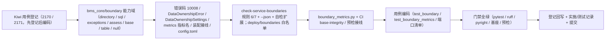

# 数据所有权与边界硬校验实施记录

> 后端基座与服务化地基 · 05 服务间通信与一致性 · 02 数据所有权与边界硬校验 · 实施记录

[文档首页](../../../../../../文档首页.md) › [02 数据所有权与边界硬校验](../05_服务间通信与一致性_02_数据所有权与边界硬校验.md) › 01 实施　|　[详细设计](../设计/01_详细设计_02_数据所有权与边界硬校验.md) · [测试记录](../测试/01_测试_02_数据所有权与边界硬校验.md)

## 1. 实施信息 

| 项 | 值 |
| --- | --- |
| 任务 | [02 数据所有权与边界硬校验](../05_服务间通信与一致性_02_数据所有权与边界硬校验.md) |
| 对应需求 | [05-2](../../../../需求/05_需求_服务间通信与一致性.md#r05-2) |
| 详细设计 | [01_详细设计_02_数据所有权与边界硬校验](../设计/01_详细设计_02_数据所有权与边界硬校验.md) |
| 实施日期 | 2026-09-23 |
| 实施人 | minjian |
| 实施环境 | 开发机（Ubuntu，Python 3.14.4 / uv；SQLite） |
| 提交 | 设计与文档 / 代码与用例分开提交（`docs(05_02)` / `feat(05_02)`） |
| 结论 | 完成 |

## 2. 实施概览 

## 3. 实施过程 

1. **Kiwi 用例登记（先登记后编码）**：登记 2 条策展用例——静态硬校验与例外白名单面（回读 **2170**）、运行时守卫与度量面（回读 **2171**）；输入 `test/scripts/kiwi/cases/2026-09-23_阶段二05-02_数据所有权与边界硬校验.json`，回读 `exports/2026-09-23_阶段二05-02_登记回读.json`。
2. **边界能力域**（`bms_core/boundary/`）：
   - `directory.py`（表前缀归属单一来源：`SHARED_TABLE_PREFIXES` / `table_prefix_of` / `prefix_owner_map` / `prefix_owner` / `owned_prefixes_for` / `is_shared_prefix` / `known_prefixes` / `known_services`，读 `SERVICE_CATALOG`）；
   - `sql.py`（`operation_of` / `extract_tables` / `analyze` + `TableRef`：去注释 / 去标识符引号 / schema 末段）；
   - `exceptions.py`（`OwnershipException` / `EXCEPTION_EXITS` / `load_exceptions` / `validate_exceptions` / `exception_allows`，`access` 只允许 `read`）；
   - `assess.py`（`OwnershipViolation` / `assess_table` / `assess_statement`：归属存在 + 非当前服务 + 非共享前缀 + 未命中只读例外方判越界）；
   - `base.py`（`BaseDataOwnershipGuard` / `OWNERSHIP_MODES` / `OwnershipStats` / `BOUNDARY_METRIC_CROSS_ACCESS` / `get_data_ownership_guard`）；
   - `table.py`（`TableOwnershipGuard`：SQLAlchemy `Engine` 类级 `before_cursor_execute`；`off` / `warn` / `enforce` 三模式；`enforce` 抛 `DataOwnershipError`；计数经 `snapshot()` 与 `bms_boundary_cross_access_total`）；`null.py`（`NullDataOwnershipGuard`）。
   - `__init__.py` 保持**轻量**（仅 docstring）——精简 CI 经 `bms_core.boundary.{directory,sql,exceptions,assess}` 复用归属与 SQL 解析，导入链只依赖标准库与服务目录。
3. **错误码 / 配置 / 装配 / 指标**：`core/error_codes.py` 增 `DATA_OWNERSHIP = 10008`；`core/exceptions.py` 增 `DataOwnershipError(GeneralError)`（500）；`core/config.py` 增 `DataOwnershipSettings`（`mode` / `exceptions_file`）与 `Settings.data_ownership`；`core/assembly.py` 增 `data_ownership_guard` 接线、`bms_core.boundary.null` 缺省模块与 `TableOwnershipGuardFactory`（`plugin_name="table"`，载入白名单 + 解析 metrics + 注入服务身份 / 模式）；`metrics/base.py` 增 `bms_boundary_cross_access_total`；`config.toml` 增 `[data_ownership]`（`provider="table"`、`mode="warn"`）。
4. **静态硬校验扩展**（`scripts/tools/base-check/check-service-boundaries.py`）：规则 6（声明越权 + 引用越界：原始 SQL / `ForeignKey` 目标 / 已知表名字符串 token）、规则 7（例外白名单结构 / 字段 / 归属校验与命中计数）、`--json` 结构化输出；自检扩展 6 个场景（跨服务 SQL / 声明越权 / 白名单放行 / 白名单 access=write 拦截等）。
5. **读侧出口例外白名单**（`deploy/boundaries/data_ownership_exceptions.json`，初始空集）：静态校验与运行时守卫共用同一事实源。
6. **边界度量**（`scripts/tools/governance/boundary_metrics.py`）：解析 `check-service-boundaries --json`，汇总「服务边界越界数 / 跨库访问数 / 表归属越界数 / 登记例外数」；可选抓取运行期 `bms_boundary_cross_access_total`（未配置 / 不可达降级标注）。
7. **CI 与预检**：`.gitlab-ci.yml` `base-integrity` 追加 `boundary_metrics.py` 报告步；`check-preflight.py --fast` 纳 boundary_metrics。
8. **登记回写与记录**：见 §6 与测试记录。

## 4. 问题与处置 

| 问题 | 现象 | 处置 |
| --- | --- | --- |
| 字符串 token 扫描误报（关键） | 首版按「服务前缀 token」扫描全部字符串，误报列名（`tenant_id`）/ 插件键（`search_index`）/ 业务码（`pur_purchase_apply`）/ 属性文档 | 收窄为**只匹配已声明表名**（跨包 `__tablename__` 并集）+ 跳过 docstring / 裸字符串表达式 + 仅标识符形态整串（`_IDENTIFIER_LIKE`）；原始 SQL 仍经 `sql.analyze` 提取 |
| 平台模型归属冲突 | `bms_core` 平台模型（`sys_*`）与能力域实现（`db/tenant_source.py` / `dict/` / `listing/`）同库；模型单独迁服务会违反「共享库不得依赖服务」铁律 | 经用户拍板：本任务按「`sys_` 归 platform（内建共享）」放行，模型 + 实现迁出**另立独立迁移任务**（计划 §7 第 9 项登记） |
| 运行时守卫计数分支 | `loop.create_task` 未持引用触发 RUF006；指标上报需覆盖有 / 无事件循环两路径 | 守卫持 `_pending_tasks` + done 回调；用例覆盖异步（有循环）与同步引擎（无循环降级）两路径 |
| 指标名清单断言 | `METRIC_NAMES` 增边界指标后既有六类断言失败 | 更新 `test_metrics.py` 期望（六类 + 边界跨库计数） |
| 基类继承护栏 | `sql.TableRef` 原为普通 dataclass、无基类 | 改为 `TableRef(BaseObject)` 并登记《后端基类清单》§10 |

## 5. 验证结果 

| 验证项 | 命令 / 操作 | 结果 |
| --- | --- | --- |
| 全量用例 | `uv run pytest -q --cov=bms_core --cov=… --cov-branch --cov-fail-under=70` | **1051 passed / 36 skipped**；总体覆盖率 **95.23%** |
| 新增模块覆盖率 | `uv run pytest libs/bms_core/tests/boundary --cov=bms_core.boundary --cov-branch` | `boundary/` 语句 + 分支 **100%** |
| 静态检查 | `uv run ruff check .` / `ruff format --check .` / `uv run pyright` | 全通过（0 error） |
| 基座校验 | `check-base` / `check-backend-base(+--self-test)` / `check-service-boundaries(+--self-test)` / `check-status` | 全通过 |
| 边界度量 | `python3 scripts/tools/governance/boundary_metrics.py` | 越界 0 / 跨库 0 / 例外 0（运行期降级标注） |
| 本地预检 | `python3 scripts/tools/preflight/check-preflight.py --fast` | 全部通过（含边界度量） |

## 6. 登记回写 

| 落点 | 内容 |
| --- | --- |
| 《后端基类清单》 | §9 增「数据所有权边界守卫」行；§10 继承链补 `NullDataOwnershipGuard` / `TableOwnershipGuard` → `BaseDataOwnershipGuard`、数据契约 / `DataOwnershipError`；目录清单补 `bms_core/boundary/` |
| 《后端开发规范》 | §3.2 增「数据所有权边界硬校验与例外登记（强制）」 |
| 计划 | §1 计数与工时（已完成 16 / 剩余 13，146h / 110h）；§2 已完成表新增 05_02；§3 移除 05_02 并调整 05_03 依赖；§4 甘特移除 05_02 节点；§7 登记「平台 / 能力域模型与实现迁出」独立任务 |
| 任务 / 父任务 | 任务 02 状态与完成日期；父任务子任务表一致 |
| Kiwi TCMS | 用例 **2170**（静态硬校验与例外白名单）/ **2171**（运行时守卫与度量） |
| 测试资产仓 | `test/scripts/kiwi/cases/2026-09-23_阶段二05-02_数据所有权与边界硬校验.json` 与 `exports/2026-09-23_阶段二05-02_登记回读.json` |
| 实施 / 测试记录 | 本文件与[测试记录](../测试/01_测试_02_数据所有权与边界硬校验.md) |
| 架构节点 | 无（07 / 11 / 37 已述语义；本任务为实现细节） |

## 7. 偏差与遗留 

- **偏差（已登记）**：① 静态引用扫描由「服务前缀 token」收窄为「**已声明表名精确匹配**」并跳过 docstring / 裸字符串——原因：前缀匹配对列名 / 插件键 / 业务码大面积误报（实施 §4）；原始 SQL 与 `ForeignKey` 形态不受影响。② 运行时守卫安装由「引用计数」简化为 `event.contains` 幂等（守卫为进程级单例，生产单进程单应用）。
- **契约变更（已登记）**：新增横切能力端口 `data_ownership_guard`、错误码 `10008`、配置节 `[data_ownership]`、指标名 `bms_boundary_cross_access_total`、白名单文件 `deploy/boundaries/data_ownership_exceptions.json`；消费方为 06_01（每服务独立库）/ 08_01（指标端点）/ 09（CI 门禁），现网消费方为零。
- **遗留（归口）**：① 平台 / 能力域模型与实现迁出 `bms_core` → **独立迁移任务**（计划 §7 第 9 项）；② 每服务独立库与 `db_key` 归属 → **06_01 / 06_02**；③ oasdiff 契约门禁与 Schemathesis → **09_03**；④ 运行期指标端点与展示 → **08_01 / 08_02**；⑤ 服务身份 JWT → **07_03**。
- **开放项**：运行时守卫生产默认 `warn`（渐进治理），`enforce` 随各服务边界稳定后按需开启；例外白名单初始为空集，后续按需登记。
- **不改**：共享库内平台模型 / 能力域实现位置、既有错误码、服务内 `/api/v1` 契约与响应体、探针口径、服务目录登记规则、网关配置、既有 Kiwi 用例号。

> 依《文档生成规范》编写 · 与《测试记录》配套
