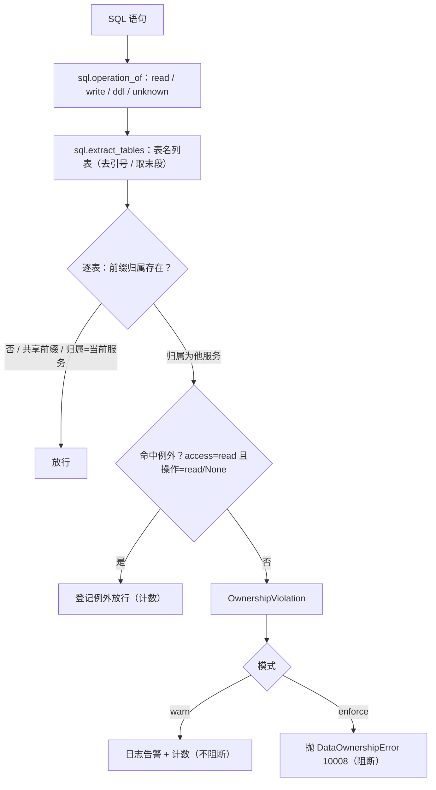

# 数据所有权与边界硬校验详细设计

> 后端基座与服务化地基 · 05 服务间通信与一致性 · 02 数据所有权与边界硬校验 · 详细设计

[文档首页](../../../../../../文档首页.md) › [02 数据所有权与边界硬校验](../05_服务间通信与一致性_02_数据所有权与边界硬校验.md) › 详细设计　|　[父任务：服务间通信与一致性](../../05_服务间通信与一致性.md) · [本阶段需求](../../../../需求/05_需求_服务间通信与一致性.md) · [排期计划](../../../../计划/01_计划_后端基座与服务化地基.md)

## 1. 概述 <a id="overview"></a>

- **目标**：在 05_01 已交付的「公开契约 + 服务间调用基座 + 跨服务读出口」之上，把**数据所有权（写方唯一、读经出口）**从纪律变成**构建期可拦截 + 运行期可检测可度量**的机器护栏（服务化地基 S2 / S7），承接 02_03 明确归口本任务的「运行时跨库访问检测 / 读侧出口 / 越界度量」：
  1. **静态硬校验**：扩展现有 `check-service-boundaries.py`——按服务目录**表前缀归属**新增「跨服务表归属 / 跨服务库访问（含原始 SQL、ForeignKey、字符串表名）」扫描与「读侧出口例外白名单」核对，越界即 CI 失败；
  2. **例外登记**：新增声明式白名单 `deploy/boundaries/data_ownership_exceptions.json`（静态校验与运行时守卫**共用同一事实源**），每条含出口 / 消费方 / 理由 / 替代方案评估 / 失效条件；
  3. **运行时跨库守卫**：新增横切能力域 `bms_core/boundary/`（插件键 `data_ownership_guard`）——在 SQLAlchemy 执行前按当前服务归属检测跨服务表访问，`warn`（记录 + 计数 + 告警）/ `enforce`（越界抛错）可配；
  4. **边界度量**：新增 `scripts/tools/governance/boundary_metrics.py`，汇总「服务边界越界数 / 跨库访问数 / 已登记例外数」（静态 + 运行时计数），供 S7 门禁与阶段验收（10_01）消费。
- **依据**：《[架构设计 · 数据架构](../../../../../../设计/架构设计/07_架构设计_数据架构.md)》「数据所有权」节；《[架构设计 · 服务间通信与分布式一致性](../../../../../../设计/架构设计/37_架构设计_子系统_服务间通信与一致性.md)》「服务边界与契约」节；《[架构设计 · 模块注册](../../../../../../设计/架构设计/11_架构设计_子系统_模块注册.md)》「服务目录与契约登记」节；《[后端开发规范](../../../../../../规范/后端开发规范.md)》「模块边界与数据所有权」节；《[微服务演进规划](../../../../../../规划/微服务演进规划.md)》「服务化地基要求与门禁」S2 / S7；需求 [05-2](../../../../需求/05_需求_服务间通信与一致性.md#r05-2)；前置任务 [05_01 详细设计](../../05_服务间通信与一致性_01_服务契约与同步调用/设计/01_详细设计_01_服务契约与同步调用.md) 与 [02_03 详细设计](../../../02_多服务骨架与仓库/02_多服务骨架与仓库_03_单体重构为分布式/设计/03_详细设计_01_单体重构为分布式.md)。
- **范围（本任务）**：上述四块；读侧出口**两条合法出口**（契约 DTO `ServiceDto` + 只读投影 `BaseQueryProvider`）已由 05_01 交付，本任务**只补使用权用例与例外登记，不改两出口代码**。
- **不含（明确归口，见第 8 节）**：平台 / 能力域模型与落库实现迁出 `bms_core`（另立独立迁移任务）；每服务独立库与 `db_key` 归属（06_01）；契约破坏性变更门禁 oasdiff / Schemathesis（09_03）；服务身份 JWT（07_03）；运行期 Prometheus 指标端点与展示（08_01 / 08_02）。

## 2. 现状与差距 <a id="gap"></a>

| 关注点 | 现状（05_01 后） | 差距（本任务目标） |
| --- | --- | --- |
| 跨服务 import | `check-service-boundaries.py` 规则 1~4 已拦（共享库↛服务 / 服务↛服务 / 分层反向 / 跨包私有） | 已满足，本任务不改 |
| 表归属 | 规则 5 只查「表名 / 表前缀跨服务唯一 + `sys_` 例外」，**不判归属** | 按服务目录表前缀判定「声明归属」，越权声明（服务声明他服务前缀）即失败 |
| 跨服务库访问 | 无静态扫描；无运行时检测（02_03 遗留） | 静态多形态扫描（SQL / ForeignKey / 字符串表名）+ 运行时 SQL 守卫 |
| 读侧出口 | `ServiceDto` + `BaseQueryProvider` 已交付 | 使用权用例 + 例外登记（白名单）机制 |
| 边界度量 | 无 | `boundary_metrics.py` 汇总越界 / 跨库 / 例外计数（S7） |
| 错误码 | 通用段至 `10007`（服务不可用） | 新增 `10008` 数据所有权违规（`enforce` 模式抛错） |

## 3. 交付物清单 <a id="tree"></a>

```text
backend/
├── config.toml                                              # 改：新增 [data_ownership] 分区
├── libs/bms_core/src/bms_core/
│   ├── core/error_codes.py                                  # 改：DATA_OWNERSHIP = 10008
│   ├── core/exceptions.py                                   # 改：DataOwnershipError（10008 / 500）
│   ├── core/config.py                                       # 改：DataOwnershipSettings + Settings.data_ownership
│   ├── core/assembly.py                                     # 改：接线 data_ownership_guard + 注册 table 工厂
│   ├── metrics/base.py                                      # 改：METRIC_NAMES 增 bms_boundary_cross_access_total
│   └── boundary/                                            # 新：数据所有权边界能力域
│       ├── __init__.py                                      #   新：轻量导出面（仅 docstring；避免精简 CI 拉重依赖）
│       ├── directory.py                                     #   新：表前缀归属（读 SERVICE_CATALOG；stdlib）
│       ├── sql.py                                           #   新：原始 SQL 表名 / 操作提取（stdlib）
│       ├── exceptions.py                                    #   新：例外白名单契约 + 加载 / 校验 / 匹配（stdlib）
│       ├── assess.py                                        #   新：越界判定纯函数 + OwnershipViolation（stdlib）
│       ├── base.py                                          #   新：BaseDataOwnershipGuard 契约 + 常量 + 提供者
│       ├── table.py                                         #   新：TableOwnershipGuard（真实；SQLAlchemy 事件挂载）
│       └── null.py                                          #   新：NullDataOwnershipGuard（缺省）
├── libs/bms_core/tests/
│   ├── boundary/__init__.py                                 # 新：测试包
│   ├── boundary/test_boundary.py                            # 新：SQL 提取 / 归属判定 / 守卫三模式 / 计数 / 例外匹配
│   ├── ops/test_boundary_metrics.py                         # 新：度量采集（静态计数 / 降级 / 违规退码）
│   └── core/…（既有 test_plugin_registration 等）            # 改：端口清单断言补 data_ownership_guard
deploy/
└── boundaries/data_ownership_exceptions.json                # 新：读侧出口例外白名单（版本 + 条目；初始空集）

scripts/
├── tools/base-check/check-service-boundaries.py             # 改：规则 6/7 + --json + 自检扩展
└── tools/governance/boundary_metrics.py                     # 新：边界 / 跨库 / 例外度量采集

.gitlab-ci.yml                                               # 改：base-integrity job 追加 boundary_metrics 报告步
scripts/tools/preflight/check-preflight.py                   # 改：--fast 纳 boundary_metrics

bms文档/
├── 后端基类清单.md                                           # 改：§9 增 data_ownership_guard 登记；§10 补继承链；目录补 bms_core/boundary/
├── 规范/后端开发规范.md                                       # 改：§3.2 增「边界硬校验 + 例外登记 + 运行时守卫」强制口径
├── 项目/02_后端基座与服务化地基/…
│   ├── 计划/01_计划_后端基座与服务化地基.md                    # 改：§1 台账/§2 已完成/§3 移除 05_02/§4 甘特；§7 登记模型迁出后续任务
│   ├── 任务/05_服务间通信与一致性/05_服务间通信与一致性.md      # 改：子任务表状态与完成日期
│   ├── 任务/…_02_数据所有权与边界硬校验/                       # 改：任务状态/完成日期 + 设计/实施/测试记录
│   └── 任务/…_03_Outbox 与幂等消费/…                          # 改：补「前置契约（已交付）」
test/
└── scripts/kiwi/cases|exports/…                             # 新：本任务用例登记输入与回读
```

## 4. 领域设计 <a id="design"></a>

### 4.1 表归属单一来源与共享前缀 <a id="ownership"></a>

**归属单一来源 = 服务目录 `SERVICE_CATALOG`**（`bms_core/services/module_registry.py`，`ModuleRecord.table_prefix` 与 `service_key`）。由此派生三个纯函数（落 `bms_core/boundary/directory.py`，**仅标准库 + 服务目录**，供精简 CI 与运行时同源复用）：

```text
directory.py
├── SHARED_TABLE_PREFIXES = ("sys_",)                 # 平台域共享前缀（内建例外）
├── table_prefix_of(table) -> str                     # 首个 `_` 前段 + `_`；无 `_` 返回原表名
├── prefix_owner_map() -> dict[str, str]              # 前缀 → 归属（service_key，缺省回落 module_key）
├── prefix_owner(prefix) -> str | None                # 未登记前缀返回 None
├── owned_prefixes_for(service) -> frozenset[str]     # 某服务（service_key）名下全部前缀
└── is_shared_prefix(prefix) -> bool                  # sys_ 等平台共享前缀
```

归属口径：

| 情形 | 归属 | 说明 |
| --- | --- | --- |
| `service_key` 非空 | 该服务 | 如 `sys_` → `platform`、`ai_` → `ai` |
| 仅登记 `module_key`（计划中模块，如 `pur_` / `pay_`） | `module_key` | 视为「未来服务」归属，其他服务引用即越界 |
| `sys_` 前缀 | **平台域共享**（内建例外） | 沿用现有规则 5 口径；任何实现服务可读（历史 / 平台元数据），不判越界 |
| `bms_core` 共享库内平台模型（`models/platform.py` 的 `sys_*`） | `platform`（`sys_` 共享） | 平台模型暂随库，归 platform 所有权（见第 8 节遗留） |
| 未登记前缀（如 `demo`） | 无归属（`None`） | 不作为跨服务越界判定（演示 / 临时表） |

> 判定式：**越界 ⇔ 前缀归属存在、归属 ≠ 当前服务、且非共享前缀、且未命中已登记例外**。

### 4.2 静态硬校验（`check-service-boundaries.py` 扩展） <a id="static"></a>

在现有五条规则上新增两条，并对既有自检补齐；脚本仍是**服务边界唯一权威护栏**，CI `base-integrity` 与本地预检复用（无需新增 job）。

| 规则 | 内容 | 判定 |
| --- | --- | --- |
| 1~4（既有） | 共享库↛服务 / 服务↛服务 / 分层反向 / 跨包私有引用 | 不变 |
| 5（既有） | 表名 / 表前缀跨服务唯一（`sys_` 例外） | 不变 |
| **6 跨服务库访问（新）** | ① **声明越权**：服务（含共享库）`__tablename__` 的**前缀归属**为他服务 → 失败；② **引用越界**：服务源码中指向他服务表前缀的**引用** → 失败 | 见下算法 |
| **7 例外白名单核对（新）** | 载入 `deploy/boundaries/data_ownership_exceptions.json`：结构 / 字段 / 归属合法性校验；命中的越界按「已登记例外」放行并计数；**未登记仍失败** | 见 4.3 |

**规则 6 引用扫描形态（多形态覆盖，按前缀归属判定）**：

1. **原始 SQL 字符串**：字符串常量形如 SQL（含 `SELECT` / `FROM` / `JOIN` / `INSERT` / `UPDATE` / `DELETE`）→ `sql.py::extract_tables` 提取表名 + 操作（read / write / ddl）；
2. **`ForeignKey("tbl.col")` 目标表**：AST 识别 `ForeignKey` 调用字符串实参 → 目标表（视为 `schema` 操作，不可白名单化）；
3. **字符串表名 token**：非 docstring 字符串常量中命中 `\b<已登记前缀>_[A-Za-z0-9_]+\b` 的 token → 视为引用（操作 `unknown`，**保守不可白名单化**）；
4. `__tablename__` 归规则 6①（声明越权）。

只扫描各包**非测试**源码；同一（文件 / 行 / 表）去重。`unknown` / `schema` / `write` 操作**不受读侧例外放行**（例外只放行 `read`）。

**跨包归属映射**：服务包 `bms_<service_key>` → `service_key`；共享库 `bms_core` 归 `platform`（其 `sys_*` 命中共享前缀放行）。

**输出**：新增 `--json`——无论通过与否均向 stdout 打印结构化结果（供 `boundary_metrics.py` 解析）：

```json
{
  "passed": false,
  "counts": {
    "cross_service_dependency": 0,
    "layer_violation": 0,
    "private_reference": 0,
    "table_ownership_violation": 0,
    "cross_service_access_violation": 0,
    "registered_exceptions_total": 0,
    "registered_exceptions_used": 0
  },
  "problems": ["[跨服务库访问] backend/services/report/src/…:12 import …"],
  "exceptions": []
}
```

自检（`--self-test`）在既有 fixture 上新增：服务声明他服务前缀（拦截）、他服务表名原始 SQL / 字符串引用（拦截）、命中白名单（放行 + 计数）、白名单字段缺失 / `access=write`（拦截）、共享前缀 `sys_`（放行）。

### 4.3 读侧出口例外登记（白名单） <a id="exceptions"></a>

**载体**：`deploy/boundaries/data_ownership_exceptions.json`（声明式、可评审、静态与运行时同源）。

```json
{
  "version": 1,
  "exceptions": [
    {
      "service": "report",
      "target_prefix": "org_",
      "access": "read",
      "exit": "readonly_projection",
      "consumer": "报表数据集跨域聚合",
      "reason": "报表需按组织维度聚合",
      "alternative": "经组织主数据基座（BaseOrgDataSource）取数",
      "expiry": "组织主数据基座数据集覆盖后移除",
      "registered_at": "2026-09-23"
    }
  ]
}
```

| 字段 | 取值 | 校验 |
| --- | --- | --- |
| `service` | 消费方 `service_key` | 必填、须在服务目录 |
| `target_prefix` | 目标表前缀 | 必填、须为已登记前缀（`sys_` 为内建共享，不得重复登记） |
| `access` | 固定 `read` | 必填；**`write` 一律拒绝**（写侧硬禁，无例外） |
| `exit` | `service_dto` / `readonly_projection` / `direct_read` | 必填；`service_dto` = 契约 DTO 出口，`readonly_projection` = 只读投影出口，`direct_read` = 已评审的跨模块直读例外 |
| `consumer` / `reason` / `alternative` / `expiry` | 文本 | 必填非空（替代方案评估与失效条件不可省） |
| `registered_at` | `YYYY-MM-DD` | 必填 |

**契约与函数**（`bms_core/boundary/exceptions.py`，stdlib）：

```text
exceptions.py
├── EXCEPTION_EXITS = ("service_dto", "readonly_projection", "direct_read")
├── DEFAULT_EXCEPTIONS_RELATIVE = "deploy/boundaries/data_ownership_exceptions.json"
├── OwnershipException(BaseObject, frozen)             # service / target_prefix / access / exit / consumer / reason / alternative / expiry / registered_at
├── load_exceptions(path) -> tuple[OwnershipException, ...]   # 解析（缺文件返回空；格式错抛 ValueError）
├── validate_exceptions(entries, *, known_prefixes, known_services) -> list[str]   # 结构 / 字段 / 归属校验
└── exception_allows(entries, *, service, prefix, operation) -> bool   # 仅 access=read 且命中 service+prefix，operation∈{read,None}
```

**静态侧**：校验失败即 CI 失败；命中例外不计违规但计数（「已登记例外使用数」）；登记未被使用仅**提示**（不作失败，促清理）。**运行时侧**：守卫构造时加载，`read` 命中放行并计数。

### 4.4 运行时跨库守卫 <a id="runtime"></a>

新增横切能力域 `bms_core/boundary/`（插件键 / 配置节 `data_ownership`）：

```text
boundary/base.py
├── OWNERSHIP_MODES = ("off", "warn", "enforce") / DEFAULT_OWNERSHIP_MODE = "warn"
├── BOUNDARY_METRIC_CROSS_ACCESS = "bms_boundary_cross_access_total"   # 计入 metrics 域
├── OwnershipViolation(BaseObject, frozen)             # service / table / prefix / owner / operation
├── BaseDataOwnershipGuard(BasePluggable, ABC)         # key = plugin_key = "data_ownership_guard"
│                                                       #   同步 assess(statement, *, service) -> tuple[OwnershipViolation, ...]
│                                                       #   snapshot() -> OwnershipStats（触及次数 / 越界数 / 阻断数）
└── get_data_ownership_guard(request) -> BaseDataOwnershipGuard   # 依赖注入提供者

boundary/assess.py（stdlib，纯函数；守卫 / 静态校验同源能力）
├── Operation = Literal["read", "write", "ddl", "schema", "unknown"]
└── assess_statement(statement, *, service, exceptions=(), shared_prefixes=SHARED_TABLE_PREFIXES) -> tuple[OwnershipViolation, ...]

boundary/table.py
├── TableOwnershipGuard(BaseDataOwnershipGuard)        # plugin_name = "table"
│   ├── __init__(service, *, mode, exceptions, metrics=None)
│   ├── assess(statement, *, service) -> violations    # 委托 assess.py
│   ├── setup() / aclose()                             # 引用计数式安装 / 卸载 SQLAlchemy 监听
│   └── _on_before_cursor_execute(conn, cursor, statement, parameters, context, executemany)
└── install_ownership_listener(guard) / uninstall_ownership_listener()   # 供测试显式挂 / 卸

boundary/null.py
└── NullDataOwnershipGuard(BaseDataOwnershipGuard)     # 恒定无越界、不安装监听（缺省）
```

**判定语义**（`assess_statement`）：



| 项 | 口径 |
| --- | --- |
| 挂载点 | SQLAlchemy `Engine` 类级 `before_cursor_execute` 事件（异步引擎底层同步引擎同属 `Engine`，一处覆盖异步 + 同步方言 + 达梦同步门面） |
| SQL 解析 | 去行 / 块注释、剥标识符引号（`"` / `` ` `` / `[]`）、大小写不敏感；识别 `FROM` / `JOIN` / `INTO` / `UPDATE` / `DELETE FROM` 后表名；schema 限定取末段 |
| 操作归类 | `SELECT` / `WITH` → read；`INSERT` / `UPDATE` / `DELETE` / `REPLACE` / `MERGE` → write；`CREATE` / `DROP` / `ALTER` / `TRUNCATE` → ddl；其余 unknown |
| 模式 | `off` 不解析；`warn` 记录 + 计数 + `warning` 日志；`enforce` 抛 `DataOwnershipError`（10008 / 500） |
| 计数 | 守卫内置线程安全计数（触发 / 越界 / 阻断）经 `snapshot()` 暴露；命中时经 `metrics.counter("bms_boundary_cross_access_total", labels={"service","prefix","owner","operation"})` 上报（metrics 缺省 `null` 时空操作） |
| 安装生命周期 | `setup()` 引用计数 +1（0→1 安装监听）；`aclose()` −1（1→0 卸载）；生产单进程单应用，测试可显式 `install` / `uninstall` 隔离 |
| 当前服务 | 取 `settings.app.service`（启动期 `attach_service` 已回写解析结果）；为空时不检测（放行） |
| 例外来源 | 构造时经 `load_exceptions` 载入（`[data_ownership].exceptions_file` 缺省相对仓库根 `deploy/boundaries/data_ownership_exceptions.json`） |

**装配接线**：

- `PLUGIN_WIRINGS` 增 `PluginWiring("data_ownership_guard", BaseDataOwnershipGuard, "data_ownership", "data_ownership_guard")`；
- `_NULL_MODULES` 增 `bms_core.boundary.null`；
- `register_platform_plugins` 注册 `TableOwnershipGuardFactory`（`plugin_name="table"`，构造时解析 `metrics`、载入例外、取 `app.service` 与 `mode`）；
- `Settings` 增 `data_ownership: DataOwnershipSettings`（`PluginSelection` 派生：`mode: Literal["off","warn","enforce"] = "warn"` + `exceptions_file: str`）；`config.toml` 增 `[data_ownership]`（`provider = "table"`、`mode = "warn"`、`options = {}`）。

### 4.5 读侧出口（用例与口径） <a id="readside"></a>

《后端开发规范》「模块边界与数据所有权」定读侧**两条合法出口**，均已由 05_01 交付，本任务**不改实现**：

| 出口 | 承载 | 本任务动作 |
| --- | --- | --- |
| ① 契约 DTO（同步，少量 / 强一致） | `ServiceDto`（`bms_core/schemas/service.py`）+ `BaseServiceClient` | 使用权用例已由 05_01 交付（Kiwi 2169），**不重复**；禁止直接依赖他服务 ORM 模型 |
| ② 只读投影（列表聚合 / 报表 / 检索） | `BaseQueryProvider`（`bms_core/query/`） | 同上；只读出口**不得用于写** |

读侧出口契约测试已由 05_01 落于 `libs/bms_core/tests/schemas/test_service_dto.py`（`ServiceDto` 继承 / 序列化、查询提供者基座可见），本任务**不重复建用例**，只补例外登记机制与《后端开发规范》§3.2 强制口径回写（新增「边界由 `check-service-boundaries` 规则 6/7 硬校验」「确需跨服务直读须登记白名单（出口 / 消费方 / 理由 / 替代方案 / 失效条件）」两句）。

### 4.6 边界度量 <a id="metrics"></a>

新增 `scripts/tools/governance/boundary_metrics.py`（只读、stdlib）：

| 命令 | 行为 |
| --- | --- |
| `python3 scripts/tools/governance/boundary_metrics.py --root <仓库根>` | 运行 `check-service-boundaries.py --json`，解析并打印「服务边界越界数（合计）/ 跨库访问数（静态）/ 表归属越界数 / 已登记例外数（使用 N）/ 运行时跨库计数（未采集）」 |
| `--metrics-url <url>` | 可选：抓取运行期 `bms_boundary_cross_access_total`（随 08_01 端点就绪后启用）；不可达 / 未配置则标注「运行期遥测随 08_01」 |
| `--out <json>` | 可选：落结构化 JSON 供阶段验收汇总 |

口径：静态越界由规则 6 硬门禁保证「有即失败」，本脚本只作**度量与留痕**（默认退出码 0；`--fail-on-violation` 可选按越界数非零退 1）。**不并入** `collect_metrics.py` 的既有「三项度量」口径（《项目规划说明》§25.2），避免口径冲突。

### 4.7 与相邻能力域分工 <a id="boundary"></a>

| 能力 | 分工 |
| --- | --- |
| `servicecall` / `query` | 读侧两条合法出口（05_01）；本任务只做例外登记与用例 |
| `events` | 跨服务异步协作（05_03 / 05_04），不经本域 |
| `metrics` | 本域跨库计数复用其计数器出口（`bms_boundary_cross_access_total`），不重复实现 |
| `check-service-boundaries.py` | 构建期硬校验唯一权威；本任务扩展规则 6/7，不回退为运行时 |
| 06_01 / 06_02 | 每服务独立库与 `db_key` 归属（物理隔离）；本域表前缀检测在其后仍有效 |

## 5. 失败分支与边界 <a id="failures"></a>

| 场景 | 处理 |
| --- | --- |
| 服务声明他服务前缀的表（`__tablename__`） | 规则 6① 失败，打印文件 / 行 / 表 / 归属 |
| 服务源码原始 SQL / 字符串 / ForeignKey 指向他服务表 | 规则 6② 失败（`unknown` / `schema` / `write` 不受例外放行） |
| 越界命中已登记例外（`access=read`、操作 read ） | 静态放行并计数；运行时不告警 |
| 例外文件缺字段 / `access=write` / `target_prefix` 未登记 / `service` 不在目录 | 规则 7 失败，打印明细 |
| 例外文件缺失 | 视为空集（不失败；首次可先落空集） |
| 例外文件 JSON 格式非法 | 规则 7 失败；运行时构造守卫时抛 `ValueError`（拒启，避免静默失效） |
| 共享前缀 `sys_` / 未登记前缀（`demo`） | 放行（不判越界） |
| 运行时 `service` 为空 | 守卫不检测（放行） |
| 运行时 `enforce` 命中越界 | 抛 `DataOwnershipError`（10008 / 500），调用方事务回滚 |
| 运行时 `warn` 命中越界 | `warning` 日志 + 计数，不阻断 |
| metrics 缺省 `null` | 计数器空操作，守卫本地计数仍可断言 |
| SQL 无法解析（DDL / 复杂语句） | 尽力提取；无法识别表名则跳过（不误报） |
| 达梦 / 三库方言 | 不涉及新增方言；SQL 解析去引号兼容三库标识符引号 |

## 6. 测试设计与验收映射 <a id="tests"></a>

用例先登记 Kiwi TCMS（本任务登记 **2 条策展用例**，编号以平台回读为准，见第 9 节）。

| 用例 / 文件 | 类型 | 断言要点 |
| --- | --- | --- |
| `libs/bms_core/tests/boundary/test_boundary.py` | 单元 | `sql.extract_tables` / `operation_of`（去引号 / schema 末段 / 多表 / 注释）；`assess_statement` 放行（自身 / 共享 / 未登记）与越界；`load_exceptions` / `validate_exceptions` / `exception_allows`；`TableOwnershipGuard` 三模式（`off` 不检测、`warn` 计数不抛、`enforce` 抛 10008）+ 计数；`NullDataOwnershipGuard` 恒定无越界 |
| `scripts/tools/base-check/check-service-boundaries.py --self-test` | 单元 | 规则 6① 声明越权拦截、6② 引用越界拦截（SQL / 字符串）、白名单放行 + 计数、白名单非法拦截、`sys_` 放行；既有五规则不回归 |
| `libs/bms_core/tests/ops/test_boundary_metrics.py` | 集成 | `boundary_metrics.py --root <tmp>` 解析 `--json` 输出计数；越界样例计数正确、`--fail-on-violation` 退码非 0 |
| `libs/bms_core/tests/core/test_plugin_registration.py`（既有） | 单元 | 端口清单补 `data_ownership_guard`（能力域登记语义） |
| 既有全量回归 | 单元 + 集成 | 全量 `pytest` / `ruff` / `pyright` / 基座校验 / 预检全绿（无行为回归） |

验收映射：

| 完成标准（需求 05-2） | 验证方式 |
| --- | --- |
| 边界硬校验可拦截跨服务 import | 既有规则 2/4 + 自检（不回归） |
| 边界硬校验可拦截跨库访问（越界即 CI 失败） | 规则 6 自检（声明越权 / 引用越界）+ `--json` 计数 + CI `base-integrity` |
| 读侧出口用例通过 | 05_01 已有 `schemas/test_service_dto.py`（Kiwi 2169）回归通过；本任务白名单机制用例通过 |
| 所有权纪律可度量 | `boundary_metrics.py` 计数（静态 + 运行时计数出口 + 例外数） |
| 运行时跨库检测与例外登记 | `test_boundary.py` 守卫三模式 + 白名单匹配 |
| `pytest` / `ruff` / `pyright` 全绿 | 门禁命令（见第 9 节） |

## 7. 登记落点 <a id="registry-writeback"></a>

| 落点 | 内容 |
| --- | --- |
| 《后端基类清单》 | §9 横切扩展能力域增「数据所有权边界守卫 `BaseDataOwnershipGuard` / `TableOwnershipGuard` / `NullDataOwnershipGuard`」与数据契约 / 例外契约；§10 继承链补链；目录清单补 `bms_core/boundary/` |
| 《后端开发规范》 | §3.2 增「边界由 `check-service-boundaries` 规则 6/7 硬校验」「确需跨服务直读须登记白名单（出口 / 消费方 / 理由 / 替代方案 / 失效条件）」 |
| 架构节点 | 无（07 / 11 / 37 已述语义；本任务为实现细节，不回改架构语义） |
| 计划 | §1 工时台账与计数；§2 已完成表（05_02 行）；§3 移除 05_02；§4 甘特移除已完成节点；§7 后续阶段待办登记「平台 / 能力域模型与实现迁出 bms_core」 |
| 任务 / 父任务 | 状态与完成日期两处一致（需求文档不承载进度） |
| 下游任务文档 | 05_03 补「前置契约（已交付）」：`sys_outbox` 表归属与 `boundary` 守卫接口 |
| Kiwi TCMS / 测试资产仓 | 登记本任务 2 条用例并回读编号；`test/scripts/kiwi/cases|exports/` 对应文件 |
| 实施 / 测试记录 | 任务目录 `实施/`、`测试/` 各一份 |

## 8. 边界与开放项 <a id="boundary"></a>

- **已定范围**：四块全做（静态硬校验 + 运行时守卫 + 例外登记 + 度量）；`sys_` 平台域共享前缀内建放行；`bms_core` 平台模型视为 `platform` 所有；硬校验复用 `base-integrity`；度量独立脚本；Kiwi 2 条。
- **归 06_01 / 06_02**：每服务独立库与 `db_key` 归属（物理隔离）；本域表前缀检测在其后仍有效。
- **归 09_03**：契约破坏性变更门禁（oasdiff / Schemathesis），本域不涉契约快照。
- **归 07_03 / 08_01**：服务身份 JWT；运行期 Prometheus 端点与 `bms_boundary_cross_access_total` 抓取（本任务先落计数出口与降级标注）。
- **独立任务（本任务登记，不实施）**：平台 / 能力域**模型与落库实现迁出 `bms_core`**（`models/platform.py` + `dict/models.py` + `listing/models.py` 及其查询实现 `db/tenant_source.py` / `repositories/module_repository.py` / `dict/` / `listing/`）——因「模型迁出必然连带共享库内实现迁出」（否则违反共享库↛服务依赖铁律），属一次专项重构，登记计划「后续阶段待办」并评估为后续任务；本任务按「`sys_` 归 platform」放行，不受影响。
- **开放项**：运行时守卫生产默认 `warn`（渐进治理）；`enforce` 随各服务边界稳定后按需开启。例外白名单初始为空集，后续按需登记。
- **不改**：共享库内平台模型 / 能力域实现位置、既有错误码、服务内 `/api/v1` 契约与响应体、探针口径、服务目录登记规则、网关配置、既有 Kiwi 用例号。

> **口径演进回写（06_03 / 06_01，2026-09-23）**：本任务交付的**表级**归属判定其后被**收窄**（06_03）与**补齐库级**（06_01）——
>
> 1. **表级（06_03 收窄）**：归属来源由「服务目录表前缀」改为**表级唯一归属登记**（`bms_core/services/table_registry.py::TABLE_OWNERSHIP`）；**`sys_` 前缀不再整体放行**，未登记表名即拒（本设计 §4.1 的 `SHARED_TABLE_PREFIXES` / `is_shared_prefix` 已删除）；基础设施表（发件箱三表）为**每服务自有**；运行时守卫 `TableOwnershipGuard` 与静态规则 5/6 同源。
> 2. **库级（06_01 补齐）**：除表级外，**取数据源引擎入口**（工厂与注册表）按**库键服务段**判定归属——全限定键（`platform_{service}` / `tenant_{service}_{code}`）非当前服务即拒（同一错误码 `10008`）；跨服务建库 / 迁移仅经运维通道显式豁免。
> 3. **分工**：库级在「取引擎入口」（本任务之外新增），表级在「运行期 SQL / 静态扫描」（本任务交付），二者互补、同属数据所有权（同码 10008）。


1. 读《[KiwiTCMS 部署使用说明](../../../../../../资料/开发服务器/linux/KiwiTCMS部署使用说明.md)》「用例约定」节，登记本任务 2 条用例并**回读编号**（输入文件落 `test/scripts/kiwi/cases/`；先登记后编码）。
2. `bms_core/boundary/`：`directory.py` / `sql.py` / `exceptions.py` / `assess.py` / `base.py` / `table.py` / `null.py` / `__init__.py`。
3. 错误码 / 异常 / 配置 / 装配 / 指标：`error_codes.py` / `exceptions.py` 增 10008；`config.py` 增 `DataOwnershipSettings`；`config.toml` 增 `[data_ownership]`；`assembly.py` 接线与注册 table 工厂；`metrics/base.py` 增指标名。
4. `deploy/boundaries/data_ownership_exceptions.json`（空集）；扩展 `check-service-boundaries.py`（规则 6/7 + `--json` + 自检）。
5. `scripts/tools/governance/boundary_metrics.py`；`.gitlab-ci.yml` `base-integrity` 追加报告步；`check-preflight.py --fast` 纳 boundary_metrics。
6. 用例：`test_boundary.py` / `test_read_side.py` / `test_boundary_metrics.py` / 自检扩展 / 端口清单断言；既有全量回归。
7. 门禁：`uv run pytest -q --cov=bms_core --cov-branch`（新增模块覆盖率 100%）/ `uv run ruff check .` / `uv run ruff format --check .` / `uv run pyright`；`check-base` / `check-backend-base(+--self-test)` / `check-service-boundaries(+--self-test)` / `check-status` / `boundary_metrics` / `check-preflight --fast` 全绿。
8. 登记回写（后端基类清单 / 后端开发规范 / 计划 / 任务状态 / 模型迁出独立任务）+ 实施 / 测试记录 + 代码与文档分开提交（`feat` / `docs`）。
9. 05_03 前置契约标注与偏差遗留闭环（另提交）。

关键命令：

```bash
cd backend
uv run pytest -q --cov=bms_core --cov-branch
uv run ruff check . && uv run ruff format --check . && uv run pyright
# 仓库根
python3 scripts/tools/base-check/check-base.py
python3 scripts/tools/base-check/check-backend-base.py --self-test
python3 scripts/tools/base-check/check-service-boundaries.py --self-test
python3 scripts/tools/governance/boundary_metrics.py --root .
python3 scripts/tools/check-docs/check-status.py
python3 scripts/tools/preflight/check-preflight.py --fast
```

## 10. 决策记录（对齐记录） <a id="align"></a>

| # | 事项 | 结论（逐项确认） |
| --- | --- | --- |
| 1 | 交付范围 | 四块全做（静态硬校验 + 运行时跨库检测 + 读侧出口例外登记 + 边界度量） |
| 2 | 静态扫描形态 | 多形态覆盖（原始 SQL / ForeignKey / 字符串表名 token / `__tablename__`），按表前缀归属判定 |
| 3 | 例外登记载体 | 声明式白名单 `deploy/boundaries/data_ownership_exceptions.json`（静态与运行时同源） |
| 4 | 运行时实现 | 新增能力域 `bms_core/boundary/`（`BaseDataOwnershipGuard` + `TableOwnershipGuard` + `NullDataOwnershipGuard`），配置节 `[data_ownership]` |
| 5 | 运行时默认模式 | `warn`（记录 + 计数 + 告警，不阻断）；`enforce` 可选（越界抛 10008） |
| 6 | `sys_` 共享前缀 | 内建共享例外（放行）；其他服务前缀严格唯一归属 |
| 7 | `bms_core` 平台模型 | 视为 `platform` 所有；**模型与实现迁出另立独立迁移任务**（登记计划后续待办，本任务不实施） |
| 8 | 硬校验落点 | 复用 `base-integrity` job（扩展脚本）+ 本地预检 |
| 9 | 度量落点 | 新增 `scripts/tools/governance/boundary_metrics.py`；不改 `collect_metrics.py` 三项口径 |
| 10 | 错误码 | 新增 `10008` 数据所有权违规（`10007` 已被服务不可用占用） |
| 11 | Kiwi 用例 | 2 条（边界硬校验与例外白名单 / 运行时跨库守卫与度量） |

## 11. 参考文档 <a id="ref"></a>

- [架构设计 · 数据架构](../../../../../../设计/架构设计/07_架构设计_数据架构.md)「数据所有权」节
- [架构设计 · 服务间通信与分布式一致性](../../../../../../设计/架构设计/37_架构设计_子系统_服务间通信与一致性.md)「服务边界与契约」节
- [架构设计 · 模块注册](../../../../../../设计/架构设计/11_架构设计_子系统_模块注册.md)「服务目录与契约登记」节
- [后端开发规范](../../../../../../规范/后端开发规范.md)「模块边界与数据所有权」节
- [后端基类清单](../../../../../../后端基类清单.md)
- [微服务演进规划](../../../../../../规划/微服务演进规划.md)「服务化地基要求与门禁」S2 / S7 节
- [需求 05-2：数据所有权与读侧出口 + 服务边界硬校验](../../../../需求/05_需求_服务间通信与一致性.md#r05-2)
- [05_01 服务契约与同步调用详细设计](../../05_服务间通信与一致性_01_服务契约与同步调用/设计/01_详细设计_01_服务契约与同步调用.md)
- [02_03 单体重构为分布式详细设计](../../../02_多服务骨架与仓库/02_多服务骨架与仓库_03_单体重构为分布式/设计/03_详细设计_01_单体重构为分布式.md)
- [KiwiTCMS 部署使用说明](../../../../../../资料/开发服务器/linux/KiwiTCMS部署使用说明.md)「用例约定」节

> 本文档依《[文档生成规范](../../../../../../规范/文档生成规范.md)》编写 · 关键决策逐项确认
