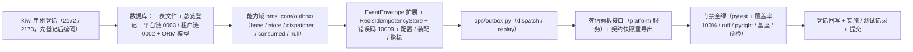

# Outbox 与幂等消费实施记录

> 后端基座与服务化地基 · 05 服务间通信与一致性 · 03 Outbox 与幂等消费 · 实施记录

[文档首页](../../../../../../文档首页.md) › [03 Outbox 与幂等消费](../05_服务间通信与一致性_03_Outbox 与幂等消费.md) › 01 实施　|　[详细设计](../设计/01_详细设计_03_Outbox 与幂等消费.md) · [测试记录](../测试/01_测试_03_Outbox 与幂等消费.md)

## 1. 实施信息 

| 项 | 值 |
| --- | --- |
| 任务 | [03 Outbox 与幂等消费](../05_服务间通信与一致性_03_Outbox 与幂等消费.md) |
| 对应需求 | [05-3](../../../../需求/05_需求_服务间通信与一致性.md#r05-3) |
| 详细设计 | [01_详细设计_03_Outbox 与幂等消费](../设计/01_详细设计_03_Outbox 与幂等消费.md) |
| 实施日期 | 2026-09-23 |
| 实施人 | minjian |
| 实施环境 | 开发机（Ubuntu，Python 3.14.4 / uv；SQLite） |
| 提交 | 设计与文档 / 代码与用例分开提交（`docs(05_03)` / `feat(05_03)`） |
| 结论 | 完成 |

## 2. 实施概览 

## 3. 实施过程 

1. **Kiwi 用例登记（先登记后编码）**：登记 2 条策展用例——发件箱 + 投递器面（回读 **2172**）、幂等消费 + 重放 + 业务幂等面（回读 **2173**）；输入 `test/scripts/kiwi/cases/2026-09-23_阶段二05-03_Outbox与幂等消费.json`，回读 `exports/2026-09-23_阶段二05-03_登记回读.json`。
2. **数据库**：三份表文件（`sys_outbox` / `sys_event_consumed` / `sys_event_dead_letter`，含变更记录与物理账本口径）→《数据库设计总览》§7.3 登记（平台库 + 租户库）→ ORM `bms_core/models/outbox.py` → `db/migration.py` 两链表集与 `_MODEL_MODULES` → 平台链 `0003_sys_outbox` / 租户链 `0002_sys_outbox` 迁移。
3. **能力域**（`bms_core/outbox/`）：`base.py`（常量 / `OutboxRecord` / `DeadLetterRecord` / `DispatchResult` / `BaseOutboxStore` / `BaseOutboxDispatcher` / 提供者）；`store.py`（`SqlOutboxStore`：同库同事务 `enqueue`、同聚合队首 `claim_pending`、标记 / 退避 / 死信 / 重放 / 看板读写 / 积压）；`dispatcher.py`（`PollOutboxDispatcher`：轮询经 `EventPublisher` 转发并标记、单库异常隔离、`enabled` 后台轮询）；`consumed.py`（`ProcessedEventStore.mark`）；`null.py`（缺省实现）。
4. **信封 / 幂等 / 错误码 / 配置 / 装配 / 指标**：`EventEnvelope` 增 `event_id` / `occurred_at` / `aggregate_key`；`idempotency/redis.py`（`RedisIdempotencyStore`，SETNX 前置去重 + 首结果存取 + 不可用降级）；`error_codes.py` 增 `OUTBOX_DELIVERY = 10009`、`exceptions.py` 增 `OutboxDeliveryError`；`config.py` 增 `OutboxSettings` 与 `outbox` / `outbox_store` 字段、`config.toml` 增 `[outbox_store]` / `[outbox]`；`assembly.py` 接线两端口 + 注册 `SqlOutboxStoreFactory` / `PollOutboxDispatcherFactory` / `RedisIdempotencyStoreFactory`；`metrics/base.py` 增 `bms_outbox_delivery_total` / `bms_outbox_backlog`；`api/deps.py` 导出提供者。
5. **CLI**（`ops/outbox.py`）：`dispatch`（手动投递）与 `replay`（按 事件 ID / 类型 / 聚合 / 时间 重置待投递）；独立进程按 provider 解析事件 / 指标实现（空 provider 直用 null，不触碰全局注册表）。
6. **死信看板接口**（`services/platform/src/bms_platform/api/outbox.py` + `schemas/outbox.py`）：`/api/v1/outbox/dead-letters` 列表 / 详情 / 重投 / 忽略；重投把对应发件箱记录重置为待投递；契约快照 `deploy/contracts/platform.json` 重导出。
7. **用例与门禁**：见测试记录；新增模块覆盖率 100%。

## 4. 问题与处置 

| 问题 | 现象 | 处置 |
| --- | --- | --- |
| 消费幂等去重实现（关键） | 初版按设计用 `SAVEPOINT`（`begin_nested`）插入 `sys_event_consumed`；SQLite（开发库）下 `RELEASE SAVEPOINT` 会提前结束隐式事务，外层回滚无法撤销幂等登记（实测「副作用回滚后登记仍在」） | 改为「事务内先查 + `(consumer, event_id)` 唯一约束兜底」；仍与业务副作用同事务、跨四库一致（回写详细设计 §4.5 与决策 8），并移除为 SAVEPOINT 新增的 `SyncSession.begin_nested` |
| 发件箱存储零参类重名 | `SqlOutboxStore` 声明 `plugin_name="sql"` 且零参 → 被插件注册表自动收集，与显式 `SqlOutboxStoreFactory` 重名 | 依 `LocalFieldTypeRegistry` 口径：真实实现不声明 `plugin_name`（避免自动收集），零参工厂也不声明 `plugin_name`、经 `register_plugin` 显式登记 |
| 迁移分支标签重复 | 新增迁移重复声明 `branch_labels=("platform"/"tenant")` → Alembic `Branch name already used` | 后续迁移不重复声明分支标签（仅链首声明），平台链 head → `0003_sys_outbox`、租户链 head → `0002_sys_outbox` |
| 既有断言适配 | 迁移 head / 链 revision、`EventEnvelope.to_dict`、指标名清单、端口清单、契约快照零漂移 | 同步更新 `test_alembic_chains` / `test_migration_ops` / `test_cross_phase_bases` / `test_metrics` / `test_plugin_registration`，并 `ops/contract_snapshot export` 重导出 |
| CLI 与同进程装配 | CLI 初版无条件 `build_plugin_registry()`，同进程后续应用装配报「注册表已构建」 | CLI 改为：仅当 provider 非空才构建注册表；空 provider 直用 `NullEventPublisher` / `NullMetrics` |
| 死信看板读取库 | 接口按请求租户库读取（演示租户回落），初版测试误落平台库致列表为空 | 测试改落租户库并断言；看板跨租户全局视图归运维阶段（登记开放项） |

## 5. 验证结果 

| 验证项 | 命令 / 操作 | 结果 |
| --- | --- | --- |
| 全量用例 | `uv run pytest -q` | **1078 passed / 36 skipped** |
| 新增模块覆盖率 | 聚焦 `libs/bms_core/tests/outbox` + `idempotency/test_idempotency_redis` + `ops/test_outbox_cli` + `platform/tests/api/test_outbox`（`--cov=bms_core.outbox,bms_core.idempotency.redis,bms_core.models.outbox --cov-branch`） | `outbox/` / `idempotency.redis` / `models.outbox` 语句 + 分支 **100%** |
| 静态检查 | `uv run ruff check .` / `ruff format --check .` / `uv run pyright` | 全通过（0 error） |
| 迁移 | `alembic -n alembic:platform upgrade head` / `-n alembic:tenant upgrade head` | 平台链 0003 / 租户链 0002 落地，链结构零漂移 |
| 契约快照 | `uv run python -m ops.contract_snapshot export` / `check` | `deploy/contracts/platform.json` 更新（新增死信接口），零漂移 |
| 基座校验 | `check-base` / `check-backend-base(+--self-test)` / `check-service-boundaries(+--self-test)` / `check-status` | 全通过 |
| 本地预检 | `python3 scripts/tools/preflight/check-preflight.py --fast` | 全部通过 |

## 6. 登记回写 

| 落点 | 内容 |
| --- | --- |
| 《数据库设计总览》 | §7.3 登记 `sys_outbox` / `sys_event_consumed` / `sys_event_dead_letter`（平台库 + 租户库） |
| 数据表文件 | 三份（字段 / 索引 / 分片归档迁移 / 变更记录；物理账本口径偏离说明） |
| 《后端基类清单》 | §9 增「事务性发件箱与幂等消费」行；§10 增发件箱 / 幂等继承链与数据契约；事件行补信封扩展；目录清单补 `bms_core/outbox/` / `models/outbox.py` / `idempotency/redis.py` |
| 《后端开发规范》 | §10「事件与任务规范」增「关键事件一律经事务性发件箱同库同事务写入」「消费者经 `ProcessedEventStore` 幂等」强制口径 |
| 计划 | §1 计数与工时（已完成 17 / 剩余 12，160h / 96h）；§2 已完成表新增 05_03；§3 移除 05_03；§4 甘特移除 05_03 节点；§7 第 10 项登记保留期清理 / 跨租户看板 / 按库投递编排 |
| 任务 / 父任务 | 任务 03 状态与完成日期；父任务子任务表一致 |
| 下游任务文档 | 05_04 补「前置契约（已交付）」 |
| Kiwi TCMS | 用例 **2172**（发件箱与投递器）/ **2173**（幂等消费与业务幂等键） |
| 测试资产仓 | `test/scripts/kiwi/cases/2026-09-23_阶段二05-03_Outbox与幂等消费.json` 与 `exports/2026-09-23_阶段二05-03_登记回读.json` |
| 实施 / 测试记录 | 本文件与[测试记录](../测试/01_测试_03_Outbox 与幂等消费.md) |
| 架构节点 | 无（16 / 37 / 06 已述语义；本任务为实现细节） |

## 7. 偏差与遗留 

- **偏差（已登记）**：① 消费幂等去重由 `SAVEPOINT` 改为「事务内查 + 唯一约束兜底」（SQLite 开发库 `RELEASE SAVEPOINT` 提前结束隐式事务，见 §4）。② `EventEnvelope` 新增三字段属契约变更（消费方现为零）。③ `dispatch_due` 目标库键空时取引擎注册表活跃键（平台 + 本进程活跃租户库），空闲租户库待下次访问续投。
- **契约变更（已登记）**：新增横切能力端口 `outbox_store` / `outbox_dispatcher`、错误码 `10009`、配置节 `[outbox_store]` / `[outbox]`、指标名 `bms_outbox_delivery_total` / `bms_outbox_backlog`、事件信封三字段、CLI `ops/outbox.py`、死信看板接口 `/api/v1/outbox/dead-letters`；消费方 05_04（事件契约 / Saga）、06_01（每服务库按库投递）、08_01（指标端点），现网消费方为零。
- **遗留（归口）**：① 发件箱 / 消费幂等 / 死信三表保留期清理与归档 → **任务调度 / 归档阶段**；② 跨租户全局死信看板视图与每服务库按库投递编排 → **06_01 / 06_02**；③ RocketMQ 真实发布 / 消费实现 → **阶段十 M10**；④ 运行期指标端点与看板展示 → **08_01 / 08_02**；⑤ 死信看板前端页面 → 通用能力 / 监控阶段。
- **开放项**：多副本并发轮询允许重复投递（消费幂等兜底），不引入跨库抢占锁（保持三方言可移植）；后台轮询生产默认关（`[outbox].enabled = false`），按需开启。
- **不改**：既有 `EventPublisher` / `EventConsumer` / `IdempotencyStore` 契约语义、服务目录登记规则、网关配置、既有 Kiwi 用例号。

> 依《文档生成规范》编写 · 与《测试记录》配套
