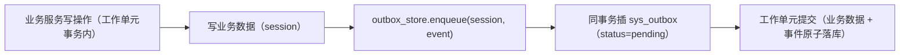
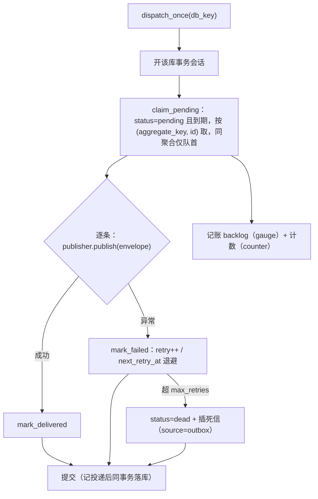
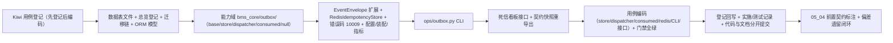

# Outbox 与幂等消费详细设计

> 后端基座与服务化地基 · 05 服务间通信与一致性 · 03 Outbox 与幂等消费 · 详细设计

[文档首页](../../../../../../文档首页.md) › [03 Outbox 与幂等消费](../05_服务间通信与一致性_03_Outbox 与幂等消费.md) › 详细设计　|　[父任务：服务间通信与一致性](../../05_服务间通信与一致性.md) · [本阶段需求](../../../../需求/05_需求_服务间通信与一致性.md) · [排期计划](../../../../计划/01_计划_后端基座与服务化地基.md)

## 1. 概述 <a id="overview"></a>

- **目标**：在 05_01（公开契约 + 服务间调用 + 读出口）与 05_02（数据所有权边界硬校验 + 运行时守卫 + 例外登记）之上，交付**事务性发件箱与幂等消费基座**，把「本地事务提交」与「事件发布」的原子性、「至少一次投递」下的「效果一次」从架构语义落为可执行、可校验、可重放、可运维的基座能力（服务化地基 S3）：
  1. **事务性发件箱**：新增 `sys_outbox` 表与写入入口——业务事务内**同库同事务**写业务数据与事件（平台库 / 租户库各自落发件箱）；
  2. **投递器**：新增能力域 `bms_core/outbox/`——轮询读取待投递事件，经事件发布端口（`EventPublisher`）转发并标记已投递；失败指数退避、超限转死信；`lifespan` 内后台轮询（配置开关）；
  3. **消费幂等**：新增 `sys_event_consumed` 表 + `ProcessedEventStore`——`(consumer, event_id)` 唯一，与业务副作用**同一本地事务**写入，命中唯一键即跳过；
  4. **顺序与重放**：发件箱按 `(aggregate_key, id)` 同聚合串行投递；Outbox 作事件账本，`ops` CLI 按类型 / 时间 / 聚合重置为待投递（消费端幂等，重放安全）；
  5. **死信看板**：新增 `sys_event_dead_letter` 表 + 只读查询 / 重投 / 忽略接口（UI 随通用能力阶段）；
  6. **业务幂等键**：新增 `RedisIdempotencyStore`（`SETNX` 前置去重 + 首次结果复用），唯一约束兜底由各业务表 `idempotency_key` 唯一索引承担。
- **依据**：《[架构设计 · 事件总线](../../../../../../设计/架构设计/16_架构设计_子系统_事件总线.md)》「生产一致性」「幂等与重试」节；《[架构设计 · 服务间通信与分布式一致性](../../../../../../设计/架构设计/37_架构设计_子系统_服务间通信与一致性.md)》「事务性 Outbox」「幂等与重放」节；《[架构设计 · 核心交互时序](../../../../../../设计/架构设计/06_架构设计_核心交互时序.md)》「跨服务调用与 Outbox 发布」节；《[架构设计 · 数据架构](../../../../../../设计/架构设计/07_架构设计_数据架构.md)》「数据所有权」节；《[后端开发规范](../../../../../../规范/后端开发规范.md)》「事件与任务规范」节；《[数据库开发规范](../../../../../../规范/数据库开发规范.md)》「迁移与建表口径」节；《[微服务演进规划](../../../../../../规划/微服务演进规划.md)》「服务化地基要求与门禁」S3；需求 [05-3](../../../../需求/05_需求_服务间通信与一致性.md#r05-3)；兄弟任务 [05_01 详细设计](../../05_服务间通信与一致性_01_服务契约与同步调用/设计/01_详细设计_01_服务契约与同步调用.md) 与 [05_02 详细设计](../../05_服务间通信与一致性_02_数据所有权与边界硬校验/设计/01_详细设计_02_数据所有权与边界硬校验.md)。
- **范围（本任务）**：上述六块（三表 + 发件箱写入 + 投递器 + 消费幂等 + 顺序重放 + 死信看板 + 业务幂等键）。
- **不含（明确归口，见第 8 节）**：事件契约版本规则与 Saga / 补偿基座（05_04）；RocketMQ 真实发布实现（阶段十 M10 集成消息）；每服务每租户独立库与按库投递编排（06_01 / 06_02）；发件箱 / 死信表的保留期清理与归档（任务调度 / 归档阶段）；运行期 Prometheus 端点与看板展示（08_01 / 08_02）；看板前端页面（通用能力 / 监控阶段）；服务身份 JWT（07_03）；oasdiff / Schemathesis 契约门禁（09_03）。

## 2. 现状与差距 <a id="gap"></a>

| 关注点 | 现状（05_02 后） | 差距（本任务目标） |
| --- | --- | --- |
| 发件箱 | 无 `sys_outbox` 表；无写入 / 轮询投递 | 三表落库 + 同库同事务写入 + 轮询投递并标记 |
| 事件信封 | `EventEnvelope`（`event_type` / `payload` / `tenant_id` / `trace_id`），**无 event_id / occurred_at / aggregate_key** | 扩展信封对齐架构事件模型，作发件箱与消费幂等同一信源 |
| 事件发布端口 | `EventPublisher`（`publish` / `publish_transactional`）为 null 占位，无真实投递编排 | 新增 `outbox` 能力域承载投递编排（发布仍经端口，M10 换实现零改动） |
| 消费幂等 | 无「已处理事件」记录 | `sys_event_consumed` + `ProcessedEventStore`（与副作用同事务） |
| 顺序 / 重放 / 死信 | 无 | `aggregate_key` 同聚合串行 + `ops` CLI 重放 + 死信表与看板接口 |
| 业务幂等键 | `IdempotencyStore` 仅 null 占位（恒定首次、不缓存） | `RedisIdempotencyStore`（`SETNX` 前置 + 首结果存取） |
| 错误码 | 通用段至 `10008`（数据所有权违规） | 新增 `10009` 发件箱投递（`10008` 已占用） |

## 3. 交付物清单 <a id="tree"></a>

```text
backend/
├── config.toml                                              # 改：新增 [outbox] 分区
├── libs/bms_core/src/bms_core/
│   ├── core/error_codes.py                                  # 改：OUTBOX_DELIVERY = 10009
│   ├── core/exceptions.py                                   # 改：OutboxDeliveryError（10009 / 500）
│   ├── core/config.py                                       # 改：OutboxSettings + Settings.outbox
│   ├── core/assembly.py                                     # 改：接线 outbox_store / outbox_dispatcher + 注册工厂 + null 模块
│   ├── metrics/base.py                                      # 改：METRIC_NAMES 增发件箱投递 / 积压指标
│   ├── events/base.py                                       # 改：EventEnvelope 增 event_id / occurred_at / aggregate_key
│   ├── idempotency/redis.py                                 # 新：RedisIdempotencyStore（SETNX 前置去重 + 首结果存取）
│   ├── models/outbox.py                                     # 新：SysOutbox / SysEventConsumed / SysEventDeadLetter
│   └── outbox/                                              # 新：事务性发件箱与幂等消费能力域
│       ├── __init__.py                                      #   新：轻量导出面（仅 docstring）
│       ├── base.py                                          #   新：常量 / 数据契约 / 端口 / 提供者
│       ├── store.py                                         #   新：SqlOutboxStore（会话绑定，flush 不提交）
│       ├── dispatcher.py                                    #   新：PollOutboxDispatcher（轮询 + 发布 + 标记 + 退避 + 死信）
│       ├── consumed.py                                      #   新：ProcessedEventStore（消费幂等）
│       └── null.py                                          #   新：NullOutboxStore / NullOutboxDispatcher
├── libs/bms_core/tests/
│   ├── outbox/__init__.py                                   #   新：测试包
│   ├── outbox/conftest.py                                   #   新：临时 SQLite 库夹具（跑迁移建两链表）
│   ├── outbox/test_outbox_store.py                          #   新：写入 / 取待投递 / 顺序 / 标记 / 退避 / 死信 / 重放
│   ├── outbox/test_outbox_dispatcher.py                     #   新：投递转发与标记 / 顺序 / 死信 / 后台循环 / 空实现
│   ├── outbox/test_consumed.py                              #   新：消费幂等去重（首次 True、重复 False、SAVEPOINT）
│   ├── idempotency/test_idempotency_redis.py                #   新：SETNX 前置 / 首结果复用（fakeredis）
│   ├── ops/test_outbox_cli.py                               #   新：CLI dispatch / replay
│   ├── metrics/test_metrics.py                              #   改：指标名清单期望
│   └── core/test_plugin_registration.py                     #   改：端口清单断言补 outbox_store / outbox_dispatcher
├── ops/outbox.py                                            # 新：CLI（dispatch 手动投递 / replay 重放）
├── alembic/versions/platform/0003_sys_outbox.py             # 新：平台链三表
└── alembic/versions/tenant/0002_sys_outbox.py               # 新：租户链三表

services/platform/
├── src/bms_platform/api/outbox.py                           # 新：死信看板接口（列表 / 详情 / 重投 / 忽略）
├── src/bms_platform/api/router.py                           # 改：登记 outbox 路由
├── src/bms_platform/schemas/outbox.py                       # 新：死信响应契约
└── tests/api/test_outbox.py                                 # 新：死信接口用例
deploy/contracts/platform.json                               # 改：路由变更后重导出契约快照

bms文档/
├── 后端基类清单.md                                           # 改：§9 增 outbox 能力域 / §10 继承链 / 目录清单
├── 规范/后端开发规范.md                                       # 改：「事件与任务规范」增 Outbox 与幂等消费强制口径
├── 设计/数据库设计/
│   ├── 01_数据库设计_总览.md                                  # 改：登记三表（平台库 + 租户库）
│   └── 数据表设计/
│       ├── sys_outbox.md                                     #   新
│       ├── sys_event_consumed.md                             #   新
│       └── sys_event_dead_letter.md                          #   新
├── 项目/02_后端基座与服务化地基/
│   ├── 计划/01_计划_后端基座与服务化地基.md                    # 改：§1 台账 / §2 已完成 / §3 移除 05_03 / §4 甘特
│   ├── 任务/05_服务间通信与一致性/05_服务间通信与一致性.md      # 改：子任务表状态与完成日期
│   ├── 任务/…_03_Outbox 与幂等消费/                           # 改：任务状态 + 设计 / 实施 / 测试记录
│   └── 任务/…_04_事件契约与 Saga 基座/…                       # 改：补「前置契约（已交付）」
test/
└── scripts/kiwi/cases|exports/…                             # 新：本任务用例登记输入与回读
```

## 4. 领域设计 <a id="design"></a>

### 4.1 数据模型与库归属 <a id="schema"></a>

三表均登记平台库 + 租户库**双链**（`sys_` 平台域共享前缀，05_02 已内建放行）：发件箱与业务数据**同库同事务**的要求，在平台业务落平台库、租户业务落租户库两条路径上同时成立；06_01 每服务库沿用同一套链表，无需返工。表结构以《数据库设计》数据表文件为唯一事实源，本节只列关键口径，字段级清单见 [sys_outbox](../../../../../../设计/数据库设计/数据表设计/sys_outbox.md)、[sys_event_consumed](../../../../../../设计/数据库设计/数据表设计/sys_event_consumed.md)、[sys_event_dead_letter](../../../../../../设计/数据库设计/数据表设计/sys_event_dead_letter.md)。

| 表 | 承载 | 关键口径 |
| --- | --- | --- |
| `sys_outbox` | 发件箱（事件账本） | `event_id` 唯一；`status`（`pending` / `delivered` / `dead`）；`aggregate_key`（同聚合有序，空=独立事件）；`retry_count` / `next_retry_at` / `delivered_at` / `error_msg` |
| `sys_event_consumed` | 消费幂等账本 | `(consumer, event_id)` 唯一；命中唯一键即视为已处理 |
| `sys_event_dead_letter` | 死信看板 | `source`（`outbox` / `consumer`）；`status`（`pending` / `replayed` / `ignored`）；`payload` / `error_msg` / `retry_count` |

- **物理账本口径（偏离说明）**：`sys_outbox` / `sys_event_consumed` / `sys_event_dead_letter` 为**基础设施账本**，行不作软删除、唯一约束**不并入 `deleted_at`**（`sys_outbox` 唯一 `event_id`、`sys_event_consumed` 唯一 `(consumer, event_id)`）——发件箱与幂等账本要求**跨方言严格唯一**（若按 `(字段, deleted_at)` 复合唯一，MySQL / PostgreSQL / SQLite 对 NULL 视作互异，去重将失效）；三表仍继承 `BaseModel`（公共字段齐全、审计自动填充）。偏离已登记于各表文件「变更记录」与本设计第 10 节。
- **迁移链**：`db/migration.py` 的 `PLATFORM_TABLES` / `TENANT_TABLES` 两处登记三表；平台链 `alembic/versions/platform/0003_sys_outbox.py`、租户链 `alembic/versions/tenant/0002_sys_outbox.py`（一套方言无关脚本、四库通用）；`_MODEL_MODULES` 增 `bms_core.models.outbox`（供 `chain_metadata` 与开发库自动建表）。
- **保留与归档**：三表当前**不分片、不归档**（保留期内可重放）；过期 `delivered` 记录与死信清理随任务调度 / 归档阶段（本任务不实施，登记开放项）。

### 4.2 事件信封扩展 <a id="envelope"></a>

`EventEnvelope` 增三个可选字段（dataclass 默认值，向后兼容，消费方现为零）：

```text
EventEnvelope（events/base.py）
├── event_id: str | None = None          # 幂等键（缺省由发件箱写入时生成雪花 ID 字符串）
├── occurred_at: datetime | None = None  # 事件发生时间（UTC；缺省取写入时刻）
├── aggregate_key: str | None = None     # 聚合 / 分区键（同聚合有序；空=独立事件）
└── （既有）event_type / payload / tenant_id / trace_id
```

- 发件箱写入时缺省补齐：`event_id = str(id_generator.next_id())`、`occurred_at = utc now`；投递时由发件箱记录**原样重建**信封（`event_id` / `occurred_at` / `aggregate_key` 保真）。

### 4.3 发件箱写入（同库同事务） <a id="enqueue"></a>

业务代码在自身事务内调用发件箱存储写入事件，**不直接操作消息队列**：



- `enqueue` 只 `session.add` + `flush`（**不提交**，事务边界归调用方工作单元），与业务数据同库同事务——事务回滚时事件随之消失（不发事件）。
- 事件类型 / 负载 / 租户 / 聚合键取自信封；`event_id` 缺省生成、`occurred_at` 缺省取写入时刻。

### 4.4 投递器（能力域 `bms_core/outbox/`） <a id="dispatcher"></a>

```text
bms_core/outbox/base.py
├── OUTBOX_STATUSES = ("pending", "delivered", "dead")
├── DEAD_LETTER_STATUSES = ("pending", "replayed", "ignored")
├── DEAD_LETTER_SOURCES = ("outbox", "consumer")
├── DEFAULT_POLL_INTERVAL = 5.0 / DEFAULT_BATCH_SIZE = 100 / DEFAULT_MAX_RETRIES = 5 / DEFAULT_RETRY_BACKOFF = 1.0
├── ORDER_SCAN_FACTOR = 10                                # 取待投递时按 limit×factor 上限扫描（同聚合分组）
├── OutboxRecord(BaseObject, frozen)                      # 发件箱行（含 to_envelope()）
├── DeadLetterRecord(BaseObject, frozen)                  # 死信行
├── DispatchResult(BaseObject, frozen)                    # published / failed / dead / backlog
├── BaseOutboxStore(BasePluggable, ABC)                   # key = plugin_key = "outbox_store"
│   ├── enqueue(session, event) -> str
│   ├── claim_pending(session, *, now, limit) -> list[OutboxRecord]
│   ├── mark_delivered(session, event_id)
│   ├── mark_failed(session, event_id, error, *, max_retries, backoff) -> bool    # True=已转死信
│   ├── replay(session, *, event_type, aggregate_key, since, limit) -> int
│   ├── list_dead_letters(session, *, status, source, offset, limit) -> (rows, total)
│   ├── get_dead_letter(session, id) -> DeadLetterRecord | None
│   ├── set_dead_letter_status(session, id, status) -> bool
│   └── backlog(session) -> int
└── BaseOutboxDispatcher(BaseAsyncResource, BasePluggable, ABC)   # key = plugin_key = "outbox_dispatcher"
    ├── dispatch_once(*, db_key) -> DispatchResult
    ├── dispatch_due() -> DispatchResult
    ├── setup() / aclose()
    └── enabled: bool
```

```text
bms_core/outbox/store.py        # SqlOutboxStore(BaseOutboxStore)：plugin_name = "sql"，SQLAlchemy 会话绑定
bms_core/outbox/dispatcher.py   # PollOutboxDispatcher(BaseOutboxDispatcher)：plugin_name = "poll"
bms_core/outbox/consumed.py     # ProcessedEventStore(BaseObject)：消费幂等（会话绑定，SAVEPOINT 去重）
bms_core/outbox/null.py         # NullOutboxStore / NullOutboxDispatcher（缺省无副作用）
```

**投递语义（`PollOutboxDispatcher.dispatch_once`）**：



| 项 | 口径 |
| --- | --- |
| 投递通道 | 经 `EventPublisher` 端口发布（当前 null 实现空操作、仍标记已投递；M10 RocketMQ 实现就绪后零改动切换） |
| 至少一次 | 发布成功但提交失败 → 下次重投；消费端按 `event_id` 幂等收敛为「效果一次」 |
| 顺序 | 取待投递按 `(aggregate_key, id)` 升序，同聚合**仅取队首**（`aggregate_key` 为空视为彼此独立、不阻塞）；队首未到期 / 失败则同聚合后续本轮跳过 |
| 重试 | 失败按 `retry_backoff × 2^retry_count` 设置 `next_retry_at`；`retry_count ≥ max_retries` 转死信 |
| 库集合 | `dispatch_due` 遍历 `[outbox].db_keys`（显式配置）或 `EngineRegistry.active_keys()`（平台库 + 本进程活跃租户库）；空闲租户库待下次访问时续投 |
| 并发 | 多副本可并发轮询、重复投递由消费幂等兜底（不引入跨库抢占锁，保持可移植三方言） |
| 后台循环 | `setup()` 在 `enabled` 时启动 `asyncio` 轮询任务，`aclose()` 取消并等待；随 `ResourceManager` 统一回收 |

**`mark_failed` 口径**：`retry_count + 1 < max_retries` → 置 `next_retry_at` 退避、保持 `pending`；否则置 `status=dead`、`delivered_at=NULL`，并插 `sys_event_dead_letter`（`source=outbox`）返回 `True`。

**`replay` 口径**：按 `event_type` / `aggregate_key` / `since`（发生时间下限）筛 `delivered` 与 `dead` 行，重置 `status=pending`、`retry_count=0`、`next_retry_at=NULL`、`delivered_at=NULL`、`error_msg=NULL`；消费端 `event_id` 幂等，重放安全。

### 4.5 消费幂等（`ProcessedEventStore`） <a id="consumed"></a>

```text
consumed.py
└── ProcessedEventStore(session)
    └── mark(*, consumer, event_id, event_type=None) -> bool
        # 首次 True（已登记，可执行副作用）；重复 False（已处理，跳过）
```

- 消费者在**自身业务事务**内先 `mark`：首次返回 `True` 后继续执行业务副作用（同事务提交）——「已处理事件」记录与副作用原子落库；
- 去重经 `SAVEPOINT`（`session.begin_nested()`）插入 `sys_event_consumed`，命中唯一键回滚该保存点并返回 `False`（不污染外层事务）；
- 契约：与业务副作用同一 `DbSession` 调用、同一事务提交；消费者不得另开会话。

### 4.6 重放 CLI 与死信看板 <a id="replay"></a>

- **`ops/outbox.py`**（stdlib + 延迟导入）：

  | 命令 | 行为 |
  | --- | --- |
  | `dispatch [--db-key K]` | 手动触发一次投递（不启 lifespan，构造 dispatcher 调 `dispatch_once`） |
  | `replay [--event-type T] [--aggregate-key K] [--since ISO] [--db-key K] [--limit N]` | 按条件重置为待投递，打印重置条数 |

- **死信看板接口**（平台服务 `services/platform/src/bms_platform/api/outbox.py`，前缀 `/api/v1/outbox`，挂 `require_auth` 登录态占位）：

  | 方法 | 路径 | 语义 |
  | --- | --- | --- |
  | GET | `/dead-letters` | 分页列表（`status` / `source` 筛选，按 `id` 倒序） |
  | GET | `/dead-letters/{id}` | 单条详情（未命中 404） |
  | POST | `/dead-letters/{id}/replay` | 重投：状态 `pending` → `replayed`，并重投对应事件（置回发件箱待投递） |
  | POST | `/dead-letters/{id}/ignore` | 忽略：状态 `pending` → `ignored` |

  - 会话取 `get_db`（按请求租户库；平台上下文回落平台库），读 `sys_` 共享前缀合法；看板跨库汇总（全局运维视图）归 08 / 监控阶段。

### 4.7 业务幂等键（`RedisIdempotencyStore`） <a id="idempotency"></a>

```text
bms_core/idempotency/redis.py
└── RedisIdempotencyStore(IdempotencyStore)     # plugin_name = "redis"
    ├── begin(key, *, ttl) -> bool              # SET key <processing> NX EX ttl：True=首次
    ├── load(key) -> payload | None             # 处理中占位返回 None；命中结果时解析返回
    └── save(key, payload, *, ttl)              # SET key <json> EX ttl
```

- 口径：`begin` 为 `SETNX` 前置去重（键空间经 `build_idempotency_key` 拼接）；`save` 写首次结果供重复请求复用；**唯一约束兜底**由各业务表 `idempotency_key` 唯一索引承担（契约不变、不新增通用幂等表）。
- 装配：注册 `RedisIdempotencyStoreFactory`（`provider="redis"`，读 `settings.redis.url`）；`[idempotency].provider` 缺省仍为空 → null 实现（Redis 不可用 / 未启用时不改行为）。

### 4.8 配置、装配与指标 <a id="assembly"></a>

- **配置**：`Settings` 增 `outbox: OutboxSettings`（派生 `PluginSelection`）：

  | 字段 | 默认 | 说明 |
  | --- | --- | --- |
  | `provider` | `"poll"` | `poll` = 真实轮询投递；空串 = null 占位 |
  | `enabled` | `false` | 后台轮询开关（真实实例仍可经 DI / CLI 调用；生产置 true） |
  | `poll_interval_seconds` | `5.0` | 轮询间隔（秒） |
  | `batch_size` | `100` | 单轮单库取待投递上限 |
  | `max_retries` | `5` | 转死信前的最大重试次数 |
  | `retry_backoff_seconds` | `1.0` | 指数退避基数（秒） |
  | `db_keys` | `[]` | 轮询库键；空 = 平台库 + `EngineRegistry.active_keys()` |

  `config.toml` 增 `[outbox]`（`provider = "poll"`、`enabled = false`、其余取默认）。

- **装配**：`PLUGIN_WIRINGS` 增 `outbox_store`（`BaseOutboxStore` / `[outbox]` / `app.state.outbox_store`）与 `outbox_dispatcher`（`BaseOutboxDispatcher` / `[outbox]` / `app.state.outbox_dispatcher`）；`_NULL_MODULES` 增 `bms_core.outbox.null`；`register_platform_plugins` 注册 `SqlOutboxStoreFactory`（`sql`）与 `PollOutboxDispatcherFactory`（`poll`，注入存储 / 发布器 / 引擎注册表 / 会话工厂 / 指标 / 配置）。
- **指标**：`METRIC_NAMES` 增 `bms_outbox_delivery_total`（counter，label `status`）与 `bms_outbox_backlog`（gauge：待投递积压）；`metrics` 缺省 null 时空操作、投递语义不受影响。

### 4.9 错误码与异常 <a id="errors"></a>

| 码 | 名称 | HTTP | 场景 |
| --- | --- | --- | --- |
| `10009` | `OUTBOX_DELIVERY` | 500 | 发件箱取待投递 / 投递编排发生非预期异常（`OutboxDeliveryError`；单条发布失败走重试 / 死信而非抛错） |
| （复用）`10002` | `NOT_FOUND` | 404 | 死信记录不存在 |
| （复用）`10003` | `CONFLICT` | 200 | 死信状态非法（非 `pending` 不可重投 / 忽略） |

> 只改 `core/error_codes.py`（平台错误码单一登记点）。

### 4.10 与相邻能力域分工 <a id="boundary"></a>

| 能力 | 分工 |
| --- | --- |
| `events` | 事件信封 / 发布 / 消费端口（本任务扩展信封，投递经 `publish` 端口；不实现 MQ） |
| `servicecall` / `query` | 同步调用与读出口（05_01）；本域只管异步事件一致性 |
| `boundary` | 数据所有权守卫（05_02）；三表 `sys_` 共享前缀内建放行 |
| `idempotency` | 本任务补 Redis 真实实现，契约不变 |
| `metrics` | 复用计数器 / 瞬时值出口（新增两个指标名） |
| 06_01 / 06_02 | 每服务独立库与按库投递编排；本域按库键可寻址，其后续用 |
| 05_04 | 事件契约版本 / Saga 补偿；本域只保证投递与幂等 |

## 5. 失败分支与边界 <a id="failures"></a>

| 场景 | 处理 |
| --- | --- |
| 业务事务回滚 | 发件箱写入随事务回滚，不发事件（原子用例断言） |
| 发布失败（异常 / 不可达） | 计失败 + 指数退避重试；超 `max_retries` 转死信并插 `sys_event_dead_letter` |
| 发布的 MQ 未就绪（provider 空） | `EventPublisher` 为 null 实现：空操作成功、仍标记已投递（总线过渡口径） |
| 同聚合队首未到期 / 失败 | 同聚合后续本轮跳过（保序）；其余聚合不受影响 |
| `aggregate_key` 为空 | 视为独立事件，不参与聚合阻塞 |
| 消费重复事件 | `ProcessedEventStore.mark` 命中唯一键返回 `False`，跳过副作用 |
| 消费 `mark` 与外层事务 | 经 `SAVEPOINT` 隔离，重复不污染外层事务 |
| 重放已投递 / 死信事件 | 重置为待投递；消费端 `event_id` 幂等，重放安全 |
| 死信重投 / 忽略状态非法 | `ConflictError`（10003） |
| 死信记录不存在 | `NotFoundError`（10002 / 404） |
| 取待投递 / 编排非预期异常 | `OutboxDeliveryError`（10009 / 500），事务回滚 |
| Redis 不可用（幂等） | 未启用即 null 实现；启用后连接失败由调用方按异常处理，唯一约束兜底 |
| `enabled=false` | 不起后台任务；DI / CLI 仍可手动投递 |
| 多副本并发轮询 | 允许重复投递，消费幂等兜底（不引入跨库锁） |
| 达梦 / 三库方言 | 不涉新方言；JSON / DATETIME / VARCHAR 按四库通用类型，DOUBLE 退避计算在应用侧 |
| 库键不存在 / 空 | 跳过该库并告警，不阻断其他库 |

## 6. 测试设计与验收映射 <a id="tests"></a>

用例先登记 Kiwi TCMS（本任务登记 **2 条策展用例**，编号以平台回读为准，见第 9 节）。

| 用例 / 文件 | 类型 | 断言要点 |
| --- | --- | --- |
| `libs/bms_core/tests/outbox/test_outbox_store.py` | 单元 | `enqueue`（缺省补齐 event_id / occurred_at、`flush` 不提交）；事务回滚不发事件；`claim_pending` 按 `(aggregate_key, id)` 且同聚合仅队首；`mark_delivered`；`mark_failed` 退避与超限转死信（插死信行）；`replay` 按类型 / 聚合 / 时间重置；死信列表 / 详情 / 状态流转；`backlog` |
| `libs/bms_core/tests/outbox/test_outbox_dispatcher.py` | 单元 | 注入假发布器：投递转发并标记 `delivered`；发布异常 → 重试 / 死信；同聚合顺序；`dispatch_due` 遍历库键与单库异常隔离；`enabled` 启停后台任务（`setup` / `aclose`）；`NullOutboxDispatcher` / `NullOutboxStore` 恒定无副作用；`OutboxDeliveryError`（注入异常存储） |
| `libs/bms_core/tests/outbox/test_consumed.py` | 单元 | 首次 `mark` True、重复 False；与副作用同事务提交 / 回滚；SAVEPOINT 不污染外层事务 |
| `libs/bms_core/tests/idempotency/test_idempotency_redis.py` | 单元 | `begin` 首次 True / 重复 False；`save` + `load` 首结果复用；TTL 生效（fakeredis）；提供者解析 |
| `libs/bms_core/tests/ops/test_outbox_cli.py` | 集成 | `dispatch` 手动投递；`replay` 条件重置并打印计数；临时 SQLite 库 |
| `services/platform/tests/api/test_outbox.py` | 集成 | 死信列表分页 / 筛选、详情 404、重投 / 忽略状态流转、非法状态 10003 |
| `libs/bms_core/tests/core/test_plugin_registration.py`（既有） | 单元 | 端口清单补 `outbox_store` / `outbox_dispatcher` |
| `libs/bms_core/tests/metrics/test_metrics.py`（既有） | 单元 | `METRIC_NAMES` 期望补发件箱指标 |
| 既有全量回归 | 单元 + 集成 | 全量 `pytest` / `ruff` / `pyright` / 基座校验 / 预检全绿（无行为回归） |

验收映射：

| 完成标准（需求 05-3） | 验证方式 |
| --- | --- |
| 库↔事件原子用例通过（回滚不发事件） | `test_outbox_store.py` 事务回滚用例 |
| 投递器转发与标记正确 | `test_outbox_dispatcher.py`（假发布器驱动）+ `ops` CLI 用例 |
| 消费幂等去重用例通过 | `test_consumed.py` + Redis 幂等用例 |
| 重放安全 | `replay` 用例 + 消费端 `event_id` 幂等 |
| 顺序投递 / 死信看板 | 同聚合顺序用例 + 死信接口用例 |
| `pytest` / `ruff` / `pyright` 全绿 | 门禁命令（见第 9 节） |

## 7. 登记落点 <a id="registry-writeback"></a>

| 落点 | 内容 |
| --- | --- |
| 《数据库设计总览》 | §7.3 登记 `sys_outbox` / `sys_event_consumed` / `sys_event_dead_letter`（平台库 + 租户库）；状态与表文件一致 |
| 数据表文件 | 三份表文件（字段 / 索引 / 分片归档迁移 / 变更记录） |
| 《后端基类清单》 | §9 横切扩展能力域增「事务性发件箱 `BaseOutboxStore` / `SqlOutboxStore` / `NullOutboxStore`」「投递器 `BaseOutboxDispatcher` / `PollOutboxDispatcher` / `NullOutboxDispatcher`」「消费幂等 `ProcessedEventStore`」「业务幂等 `RedisIdempotencyStore`」与事件信封扩展；§10 继承链补链；目录清单补 `bms_core/outbox/`、`models/outbox.py`、`idempotency/redis.py` |
| 《后端开发规范》 | 「事件与任务规范」增「关键事件一律经事务性发件箱同库同事务写入」「消费者必须经 `ProcessedEventStore` 幂等」「发件箱投递经投递器、业务不直连 MQ」强制口径 |
| 架构节点 | 无（16 / 37 / 06 已述语义；本任务为实现细节，不回改架构语义） |
| 计划 | §1 工时台账与计数；§2 已完成表（05_03 行）；§3 移除 05_03 并将 05_04 依赖改为已完成；§4 甘特移除 05_03 节点 |
| 任务 / 父任务 | 状态与完成日期两处一致（需求文档不承载进度） |
| 下游任务文档 | 05_04 补「前置契约（已交付）」：发件箱 / 消费幂等 / 重放 / 死信接口 |
| 迁移链 | `db/migration.py` 两链表集与 `_MODEL_MODULES`；两链迁移脚本 |
| Kiwi TCMS / 测试资产仓 | 登记本任务 2 条用例并回读编号；`test/scripts/kiwi/cases|exports/` 对应文件 |
| 契约快照 | `deploy/contracts/platform.json` 重导出（新增死信接口） |
| 实施 / 测试记录 | 任务目录 `实施/`、`测试/` 各一份 |

## 8. 边界与开放项 <a id="boundary"></a>

- **已定范围**：三表双链 + 发件箱写入 + 轮询投递器 + 消费幂等 + 顺序 / 重放 + 死信看板接口 + Redis 业务幂等键 + 信封扩展 + 错误码 10009；`enabled` 生产默认关（避免测试期后台任务）、配置开启。
- **归 05_04**：事件契约版本规则（只增不删 / 破坏性升版本）与 Saga / 补偿基座；本任务不涉版本字段与补偿编排。
- **归 M10 集成消息**：`EventPublisher` / `EventConsumer` 真实 RocketMQ 实现；本任务投递经端口、发布实现空操作仍标记已投递（总线过渡口径）。
- **归 06_01 / 06_02**：每服务每租户独立库与按库投递编排（本任务已按 `db_key` 可寻址，`dispatch_due` 遍历活跃库键为过渡口径）。
- **归任务调度 / 归档阶段**：发件箱与死信表保留期清理、已投递记录归档。
- **归 08_01 / 08_02**：`bms_outbox_delivery_total` / `bms_outbox_backlog` 的端点暴露与看板展示。
- **归通用能力 / 监控阶段**：死信看板前端页面（本任务只落只读接口）。
- **开放项**：多副本并发轮询允许重复投递（消费幂等兜底），跨库抢占锁不引入（保持三方言可移植）；死信看板接口当前按请求租户库读取，跨租户全局视图归运维阶段。
- **不改**：既有 `EventPublisher` / `EventConsumer` 契约语义、`IdempotencyStore` 契约、既有错误码、服务目录登记规则、网关配置、既有 Kiwi 用例号。

## 9. 实施步骤 <a id="steps"></a>



1. 读《[KiwiTCMS 部署使用说明](../../../../../../资料/开发服务器/linux/KiwiTCMS部署使用说明.md)》「用例约定」节，登记本任务 2 条用例并**回读编号**（输入文件落 `test/scripts/kiwi/cases/`；先登记后编码）。
2. 数据库：三份表文件（含变更记录）→ 总览 §7.3 登记 → `models/outbox.py` → `db/migration.py` 两链表集 + `_MODEL_MODULES` → 两链迁移脚本。
3. 能力域：`bms_core/outbox/` 的 `base.py` / `store.py` / `dispatcher.py` / `consumed.py` / `null.py` / `__init__.py`。
4. `events/base.py` 信封扩字段；`idempotency/redis.py`；`core/error_codes.py` 10009；`core/exceptions.py`；`core/config.py` `OutboxSettings`；`config.toml` `[outbox]`；`core/assembly.py` 接线与工厂；`metrics/base.py` 指标名。
5. `ops/outbox.py`（`dispatch` / `replay`）。
6. `services/platform` 死信接口（`api/outbox.py` / `schemas/outbox.py` / `router.py`）+ `deploy/contracts/platform.json` 重导出。
7. 用例：`outbox/` 三份 + `idempotency` redis + `ops` CLI + `services/platform` 接口；更新端口清单与指标名断言；既有全量回归。
8. 门禁：`uv run pytest -q --cov=bms_core --cov-branch`（新增模块覆盖率 100%）/ `uv run ruff check .` / `uv run ruff format --check .` / `uv run pyright`；`check-base` / `check-backend-base(+--self-test)` / `check-service-boundaries(+--self-test)` / `check-status` / `check-preflight --fast` 全绿。
9. 登记回写（数据库设计总览 + 表文件 / 后端基类清单 / 后端开发规范 / 迁移链 / 计划 / 任务状态）+ 实施 / 测试记录 + 代码与文档分开提交（`feat` / `docs`）。
10. 05_04 前置契约标注与偏差遗留闭环（另提交）。

关键命令：

```bash
cd backend
uv run alembic -n alembic:platform upgrade head
uv run alembic -n alembic:tenant upgrade head
uv run python -m ops.outbox dispatch
uv run pytest -q --cov=bms_core --cov-branch
uv run ruff check . && uv run ruff format --check . && uv run pyright
uv run python -m ops.contract_snapshot export
# 仓库根
python3 scripts/tools/base-check/check-base.py
python3 scripts/tools/base-check/check-backend-base.py --self-test
python3 scripts/tools/base-check/check-service-boundaries.py --self-test
python3 scripts/tools/check-docs/check-status.py
python3 scripts/tools/preflight/check-preflight.py --fast
```

## 10. 决策记录（对齐记录） <a id="align"></a>

| # | 事项 | 结论（逐项确认） |
| --- | --- | --- |
| 1 | 表归属库 | 平台链 + 租户链都建（同库同事务覆盖平台与租户业务；06_01 每服务库沿用同套链） |
| 2 | 表集合 | 三表：`sys_outbox`（发件箱）+ `sys_event_consumed`（消费幂等）+ `sys_event_dead_letter`（死信看板） |
| 3 | 投递器形态 | 新增能力域 `bms_core/outbox/`，端口 `BaseOutboxStore`（插件键 `outbox_store`）+ `BaseOutboxDispatcher`（插件键 `outbox_dispatcher`），实现 `SqlOutboxStore` / `PollOutboxDispatcher` |
| 4 | 运行方式 | `lifespan` 内 asyncio 后台轮询（配置开关 `[outbox].enabled`）；CLI 可手动投递 |
| 5 | 顺序口径 | 发件箱增 `aggregate_key`，按 `(aggregate_key, id)` 同聚合串行投递，同聚合仅取队首 |
| 6 | 重放机制 | `ops/outbox.py replay` 按 类型 / 时间 / 聚合 重置为待投递（消费端 `event_id` 幂等） |
| 7 | 业务幂等键 | 新增 `RedisIdempotencyStore`（`SETNX` 前置 + 首次结果复用），唯一约束兜底由业务表唯一索引承担 |
| 8 | 消费幂等契约 | `sys_event_consumed` 表 + `ProcessedEventStore.mark(session, consumer, event_id) -> bool`（与副作用同事务、SAVEPOINT 去重） |
| 9 | 死信看板出口 | 落表 + 只读接口（列表 / 详情 / 重投 / 忽略）；UI 前端随通用能力 / 监控阶段 |
| 10 | 事件信封 | 扩展 `EventEnvelope`：增 `event_id` / `occurred_at` / `aggregate_key`（契约变更，消费方现为零） |
| 11 | 错误码 | 新增 `10009` `OUTBOX_DELIVERY`（`10008` 已被数据所有权占用） |
| 12 | Kiwi 用例 | 2 条（发件箱 + 投递器 / 幂等消费 + 重放 + 业务幂等） |

## 11. 参考文档 <a id="ref"></a>

- [架构设计 · 事件总线](../../../../../../设计/架构设计/16_架构设计_子系统_事件总线.md)「生产一致性」「幂等与重试」节
- [架构设计 · 服务间通信与分布式一致性](../../../../../../设计/架构设计/37_架构设计_子系统_服务间通信与一致性.md)「事务性 Outbox」「幂等与重放」节
- [架构设计 · 核心交互时序](../../../../../../设计/架构设计/06_架构设计_核心交互时序.md)「跨服务调用与 Outbox 发布」节
- [架构设计 · 数据架构](../../../../../../设计/架构设计/07_架构设计_数据架构.md)「数据所有权」节
- [后端开发规范](../../../../../../规范/后端开发规范.md)「事件与任务规范」节
- [数据库开发规范](../../../../../../规范/数据库开发规范.md)「迁移与建表口径」节
- [数据库设计 · 总览](../../../../../../设计/数据库设计/01_数据库设计_总览.md) · [数据规范](../../../../../../设计/数据库设计/02_数据库设计_数据规范.md)
- [后端基类清单](../../../../../../后端基类清单.md)
- [微服务演进规划](../../../../../../规划/微服务演进规划.md)「服务化地基要求与门禁」S3 节
- [需求 05-3：事务性 Outbox 与幂等消费](../../../../需求/05_需求_服务间通信与一致性.md#r05-3)
- [05_01 服务契约与同步调用详细设计](../../05_服务间通信与一致性_01_服务契约与同步调用/设计/01_详细设计_01_服务契约与同步调用.md)
- [05_02 数据所有权与边界硬校验详细设计](../../05_服务间通信与一致性_02_数据所有权与边界硬校验/设计/01_详细设计_02_数据所有权与边界硬校验.md)
- [KiwiTCMS 部署使用说明](../../../../../../资料/开发服务器/linux/KiwiTCMS部署使用说明.md)「用例约定」节

> 本文档依《[文档生成规范](../../../../../../规范/文档生成规范.md)》编写 · 关键决策逐项确认
