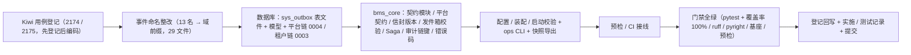

# 事件契约与 Saga 基座实施记录

> 后端基座与服务化地基 · 05 服务间通信与一致性 · 04 事件契约与 Saga 基座 · 实施记录

[文档首页](../../../../../../文档首页.md) › [04 事件契约与 Saga 基座](../05_服务间通信与一致性_04_事件契约与 Saga 基座.md) › 01 实施　|　[详细设计](../设计/01_详细设计_04_事件契约与 Saga 基座.md) · [测试记录](../测试/01_测试_04_事件契约与 Saga 基座.md)

## 1. 实施信息 

| 项 | 值 |
| --- | --- |
| 任务 | [04 事件契约与 Saga 基座](../05_服务间通信与一致性_04_事件契约与 Saga 基座.md) |
| 对应需求 | [05-4](../../../../需求/05_需求_服务间通信与一致性.md#r05-4) |
| 详细设计 | [01_详细设计_04_事件契约与 Saga 基座](../设计/01_详细设计_04_事件契约与 Saga 基座.md) |
| 实施日期 | 2026-09-23 |
| 实施人 | minjian |
| 实施环境 | 开发机（Ubuntu，Python 3.14.4 / uv；SQLite） |
| 提交 | 设计与文档 / 代码与用例分开提交（`docs(05_04)` / `feat(05_04)`） |
| 结论 | 完成 |

## 2. 实施概览 

## 3. 实施过程 

1. **Kiwi 用例登记（先登记后编码）**：登记 2 条策展用例——事件契约版本与兼容面（回读 **2174**）、Saga 三态执行与幂等补偿面（回读 **2175**）；输入 `test/scripts/kiwi/cases/2026-09-23_阶段二05-04_事件契约与Saga基座.json`，回读 `exports/2026-09-23_阶段二05-04_登记回读.json`。
2. **事件命名整改**：存量 13 个事件名统一整改为「已登记事件域」前缀（`sys.user.created` / `sys.dept.changed` / `sys.notice.published` / `sys.form.updated` / `sys.help.article.*` / `sys.task.completed` / `identity.user.jit_created` / `sys.archive.completed` 等）；回写架构 06 / 09 / 14 / 16 / 17 / 22 / 26 / 28 / 30、概要 03 / 07 / 08 / 17 / 18 / 19 / 21 / 23 / 26 / 28 / 30 / 33 / 34 / 36、组件设计 05、命名规范与知识档案；`wf.task.completed` 等已合规名不误伤。
3. **数据库**：`sys_outbox.md` 表文件加 `event_version` 列（含变更记录 v2）→ 总览登记不变（无迁移链字段）→ `models/outbox.py` 加列 → 平台链 `0004_sys_outbox_event_version` / 租户链 `0003_sys_outbox_event_version` 迁移（`batch_alter_table` 兼容 SQLite，存量行补 `1.0.0`）。
4. **事件契约**（`bms_core/events/contracts.py`）：`EventFieldSpec` / `EventContract` / `EventSubscription` / `EventContractRegistry` + 模块级默认注册表与幂等登记；`validate_event_contract` / `validate_event_registry`（命名首段为已登记事件域 / 版本 / 字段 / 保留键 / 订阅覆盖）；`check_event_compatibility`（字段只增不删 / 新增必须可选 / 破坏性升主版本 / 版本递增）/ `check_subscription_coverage` / `check_snapshot_compatibility`；运行时 `event_version_compatible` / `require_event_version_compatible`；确定性快照渲染与解析。
5. **平台默认契约**（`events/platform_events.py`）：按架构《接口与集成》「事件模型清单」平台域部分逐条声明 23 条 v1.0.0 契约；`register_platform_event_contracts` 幂等登记（订阅本期为空集，服务级随消费方落地）。
6. **版本承载与签发校验**：`EventEnvelope.event_version`；`sys_outbox.event_version` 列与 `OutboxRecord.to_envelope` 保真；`SqlOutboxStore` 增 `contract_mode` / `contract_resolver`（缺省 `off`，装配按 `[event].contract_mode` 注入），签发按模式校验登记与版本格式；`EventSettings.contract_mode` 缺省 `enforce`。
7. **Saga / 补偿基座**（`bms_core/saga/`）：`SagaStep` / `SagaDefinition` / `SagaStepOutcome` + `build_saga_consumer` / `build_saga_event` / `validate_saga_definition`；端口 `BaseSagaExecutor`（TCC 三态 `try_step` / `confirm_step` / `cancel_step`）+ 真实 `ChoreographySagaExecutor`（`ProcessedEventStore` 幂等 + 发件箱事件）+ 缺省 `NullSagaExecutor`（调用即抛 40001）；提供者 `get_saga_executor`、`[saga]` 配置节（缺省 `choreography`）。
8. **强一致口径与审计链键**：`audit/hashchain.py` 增 `build_chain_key`（`(service, tenant)` 分条）+ `GLOBAL_CHAIN_TENANT`；《后端开发规范》§10 增强制条目（审计链 / 财务 / 审批 / 排除 2PC·XA）。
9. **装配与启动校验**：`register_platform_plugins` 登记契约与 Saga 工厂、`SqlOutboxStoreFactory(settings)` 注入模式；`service_lifespan` 离线清单校验后增 `_validate_event_contracts()`（违规 `EventContractError` 拒启）；`api/deps.py` 导出 `get_saga_executor`；错误码 `10010` `EVENT_CONTRACT`。
10. **ops CLI 与门禁**：`ops/event_contracts.py`（`export` 兼容校验后写 `deploy/events/contracts.json`、`check` 零漂移 + 兼容）；`check-preflight.py --fast` 与 CI `swagger-snapshot` job 接线；`deploy/ci/verify/contract` 档位说明更新。
11. **用例与门禁**：见测试记录；新增模块语句 + 分支覆盖率 100%。

## 4. 问题与处置 

| 问题 | 现象 | 处置 |
| --- | --- | --- |
| 事件域口径冲突（关键） | 实际事件清单用对象级命名（`user.created` / `notice.published` / `sso.user.jit_created`），首段不是服务目录已登记事件域（`sys` / `identity` …），与「事件命名以注册值为依据」不一致 | 决策确认后选择「统一整改为域前缀」：13 个事件名改为 `sys.*` / `identity.*` 前缀并回写文档（消费方为零时成本最低）；契约校验执行严格口径（首段必须为已登记事件域） |
| 改名脚本误伤简写 | 架构 16「wf.* 事件（deployed/started/task.completed/…）」中简写的 `task.completed` 被误判为定时任务事件；`help.article.*` 通配未命中 | 手工回改为 `wf.task.completed`；通配补域前缀为 `sys.help.article.*` |
| 本地租户演示库迁移冲突 | `bms_tenant_demo.db` 的 `alembic_version` 停留 `0001` 但已含 05_03 建的发件箱三表（开发库自动建表不写版本号），租户链 `0002` 重放报「table sys_outbox already exists」 | 非破坏性修补：`alembic -n alembic:tenant stamp 0002_sys_outbox` 后 `upgrade head`（落地 `0003`）；机制口径登记计划 §7 第 14 项 |
| 空实现登记语义 | `NullSagaExecutor` 调用即抛错误，未挂 `BaseNullObject`，与「Null 缺省登记」断言不符 | 双继承 `BaseSagaExecutor, BaseNullObject`（占位标记 + 不产生副作用；抛错语义保留） |
| pyright 严格模式 | `fields` 默认工厂推断为 `dict[Unknown, Unknown]`；快照解析 `int(object)` 报错 | 默认工厂改 `dict[str, EventFieldSpec]`；解析处 `cast` 显式收窄类型 |
| 既有断言适配 | 信封 `to_dict` 增 `event_version`、迁移链 head（平台 0004 / 租户 0003）、插件端口清单补 `saga_executor` | 同步更新 `test_cross_phase_bases` / `test_alembic_chains` / `test_migration_ops` / `test_plugin_registration`，事件样例名随整改更新 |
| RFC 口径（快照订阅） | 订阅清单随快照渲染，但导出比对只对契约做兼容校验 | 订阅变更只需重导出（不构成违规）；主版本升级由订阅覆盖校验拦截 |

## 5. 验证结果 

| 验证项 | 命令 / 操作 | 结果 |
| --- | --- | --- |
| 全量用例 | `uv run pytest -q` | **1110 passed / 36 skipped** |
| 新增模块覆盖率 | `uv run pytest -q libs/bms_core/tests/events libs/bms_core/tests/saga libs/bms_core/tests/ops/test_event_contracts_cli.py libs/bms_core/tests/outbox libs/bms_core/tests/audit --cov=bms_core.events.contracts --cov=bms_core.events.platform_events --cov=bms_core.saga --cov=bms_core.outbox.store --cov=bms_core.audit.hashchain --cov-branch` | 契约 / 平台契约 / Saga / 发件箱存储 / 审计链键语句 + 分支 **100%** |
| 静态检查 | `uv run ruff check .` / `ruff format --check .` / `uv run pyright` | 全通过（0 error） |
| 迁移 | `alembic -n alembic:platform upgrade head` / `-n alembic:tenant upgrade head` | 平台链 0004 / 租户链 0003 落地（租户演示库经 stamp 修补后升级），链结构零漂移 |
| 事件契约快照 | `uv run python -m ops.event_contracts export` / `check` | 契约 23 条 / 订阅 0 条写入 `deploy/events/contracts.json`；零漂移通过 |
| 基座校验 | `check-base` / `check-backend-base(+--self-test)` / `check-service-boundaries(+--self-test)` / `check-status` | 全通过（基类清单补登记后） |
| 本地预检 | `python3 scripts/tools/preflight/check-preflight.py --fast` | 全部通过（含事件契约 check） |

## 6. 登记回写 

| 落点 | 内容 |
| --- | --- |
| 《数据库设计》表文件 | `sys_outbox.md` 增 `event_version` 列（含变更记录 v2、迁移链 0004 / 0003） |
| 《后端基类清单》 | §9 增「事件契约与 Saga 补偿」行（含签发模式 / 快照 / 三态执行器 / 错误码）、审计链行补 `build_chain_key`；§10 增继承链；目录清单补 `events/contracts.py` / `events/platform_events.py` / `saga/` / `ops/event_contracts.py` |
| 《后端开发规范》 | §10 增「事件契约（强制）」「Saga / 补偿（强制）」「强一致场景口径（强制）」条目；事件命名行改域前缀口径 |
| 《命名规范》 | 事件名规则与示例改域前缀（首段为已登记事件域） |
| 架构 / 概要 / 组件设计节点 | 存量事件名整改（13 名，29 文件） |
| 计划 | §1 计数与工时（已完成 18 / 剩余 11，168h / 88h）；§2 已完成表新增 05_04；§3 移除 05_04 并调整 10_01 依赖；§4 甘特移除域五节点；§7 新增第 11~14 项遗留 |
| 任务 / 父任务 | 任务 04 状态与完成日期；父任务子任务表一致 |
| Kiwi TCMS | 用例 **2174**（事件契约版本与兼容）/ **2175**（Saga 三态执行与幂等补偿） |
| 测试资产仓 | `test/scripts/kiwi/cases/2026-09-23_阶段二05-04_事件契约与Saga基座.json` 与 `exports/2026-09-23_阶段二05-04_登记回读.json` |
| 事件契约快照 | `deploy/events/contracts.json`（23 条 v1.0.0） |
| 实施 / 测试记录 | 本文件与[测试记录](../测试/01_测试_04_事件契约与 Saga 基座.md) |
| 架构节点 | 无语义变更（事件名整改属命名口径回写，架构 09 / 16 等已同步） |

## 7. 偏差与遗留 

- **偏差（已登记）**：① 存量事件名由对象级改为域前缀（13 名），属事件契约级改名——消费方为零、已回写全部引用；② `NullSagaExecutor` 采用「调用即抛」而非空操作（不静默降级），并双继承 `BaseNullObject` 以符合缺省登记语义；③ `[event].contract_mode` 缺省 `enforce`（未登记事件拒发），`warn` 可作过渡；④ 快照订阅清单只作留痕、不参与兼容违规判定。
- **契约变更（已登记）**：`EventEnvelope.event_version` 字段、`sys_outbox.event_version` 列、平台 23 条事件契约、Saga 端口 `saga_executor` + `[saga]` 配置、`[event].contract_mode`、错误码 `10010`、`ops/event_contracts.py` 与 `deploy/events/contracts.json`；消费方 05_01~03 兼容、现网零影响。
- **遗留（归口）**：① 服务级事件契约与服务级订阅随消费方实现落地登记（跨仓库订阅无法自动校验）→ **消费方实现阶段**；② 事件清单文档 ↔ 注册表对账脚本 → **后续（事件批量落地）**；③ topic 命名域与已登记事件域对齐 → **阶段十 M10**；④ 开发库自动建表与 Alembic 版本号衔接机制 → **01_04 后续 / 运维**（计划 §7 第 11~14 项）；⑤ 编排式 Saga 运行时（Temporal）与 Saga 运行监控 → **按判据再引入**。
- **开放项**：发件箱死信表不加版本列（排障以 `payload` / `event_type` 足够）；事件类型退休置 `deprecated`、不物理删除。
- **不改**：`EventPublisher` / `EventConsumer` / `IdempotencyStore` 契约语义、发件箱投递 / 幂等 / 重放 / 死信接口语义、服务目录登记规则与启动校验、网关配置、既有 Kiwi 用例号；历史任务文档过程记录不改写。

> 依《文档生成规范》编写 · 与《测试记录》配套
