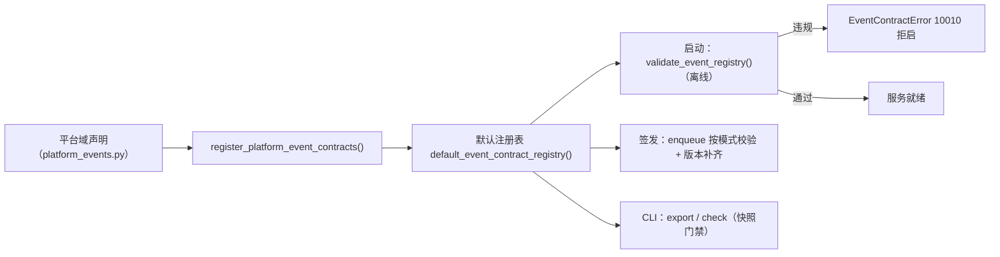
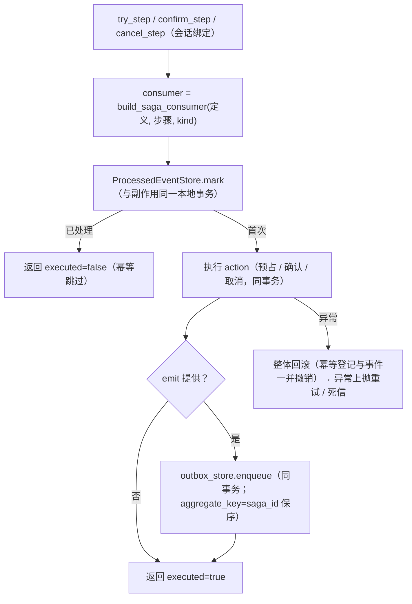
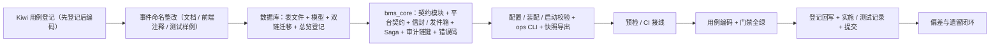

# 事件契约与 Saga 基座详细设计

> 后端基座与服务化地基 · 05 服务间通信与一致性 · 04 事件契约与 Saga 基座 · 详细设计

[文档首页](../../../../../../文档首页.md) › [04 事件契约与 Saga 基座](../05_服务间通信与一致性_04_事件契约与 Saga 基座.md) › 详细设计　|　[父任务：服务间通信与一致性](../../05_服务间通信与一致性.md) · [本阶段需求](../../../../需求/05_需求_服务间通信与一致性.md) · [排期计划](../../../../计划/01_计划_后端基座与服务化地基.md)

## 1. 概述 <a id="overview"></a>

- **目标**：在 05_03 交付的事务性发件箱与幂等消费基座之上，交付**事件契约版本规则**、**Saga / 补偿基座语义**与**强一致场景口径**，把「事件是长期契约、失败要能补偿、强一致场景有明确归属」从架构语义落为可登记、可校验、可复用、可门禁的基座能力（服务化地基 S3）：
  1. **事件版本承载**：`EventEnvelope` 增 `event_version`，发件箱 `sys_outbox` 增同名列持久化——投递保真、消费方运行时可区分新旧版本；
  2. **事件契约注册表**：新增 `bms_core/events/contracts.py`——契约（字段规格 + 版本）与订阅（消费方支持主版本集合）模型、注册表、命名 / 事件域 / 字段 / 版本校验、兼容判定（只增不删、新增可选、破坏性升主版本）；
  3. **平台默认事件契约**：新增 `bms_core/events/platform_events.py`，按架构《接口与集成》「事件模型清单」的平台域部分逐条声明 v1.0.0 契约；
  4. **事件命名整改**：存量 13 个事件名统一整改为「已登记事件域」前缀（`sys.user.created` 等），回写架构 / 概要 / 组件 / 规范引用；
  5. **契约快照门禁**：新增 `ops/event_contracts.py`（`export` 校验兼容后写 `deploy/events/contracts.json`、`check` 零漂移），接预检与 CI；
  6. **签发校验**：发件箱写入按 `[event].contract_mode`（`off` / `warn` / `enforce`）校验事件已登记契约，未登记拒发（10010）；
  7. **Saga / 补偿基座**：新增 `bms_core/saga/` 能力域——协同式参与者执行器（TCC 三态 `try` / `confirm` / `cancel`）、本地事务 + 发件箱事件 + `ProcessedEventStore` 幂等补偿；端口 `BaseSagaExecutor` + 真实实现 + 空实现（调用即抛配置错误）；
  8. **强一致口径**：审计链按 `(service, tenant)` 分条落 `build_chain_key` 助手；《后端开发规范》§10 增「强一致场景口径」强制条目（审计链 / 财务 / 审批 / 排除 2PC·XA）。
- **依据**：《[架构设计 · 服务间通信与分布式一致性](../../../../../../设计/架构设计/37_架构设计_子系统_服务间通信与一致性.md)》「跨服务一致性（Saga / 补偿）」「强一致场景处理」节；《[架构设计 · 事件总线](../../../../../../设计/架构设计/16_架构设计_子系统_事件总线.md)》「幂等与重试」节；《[架构设计 · 接口与集成](../../../../../../设计/架构设计/09_架构设计_接口与集成.md)》「事件模型清单」节；《[架构设计 · 模块注册](../../../../../../设计/架构设计/11_架构设计_子系统_模块注册.md)》「事件域」节；《[架构设计 · 审计哈希链](../../../../../../设计/架构设计/19_架构设计_子系统_审计哈希链.md)》；《[后端开发规范](../../../../../../规范/后端开发规范.md)》「事件与任务规范」节；《[微服务演进规划](../../../../../../规划/微服务演进规划.md)》「服务化地基要求与门禁」S3；需求 [05-4](../../../../需求/05_需求_服务间通信与一致性.md#r05-4)；前置任务 [05_03 详细设计](../../05_服务间通信与一致性_03_Outbox 与幂等消费/设计/01_详细设计_03_Outbox 与幂等消费.md)。
- **范围（本任务）**：上述八块（契约模型 + 注册表 + 平台默认契约 + 命名整改 + 快照门禁 + 签发校验 + Saga 三态基座 + 强一致口径与审计链分条助手），另含 `sys_outbox.event_version` 列双链迁移。
- **不含（明确归口，见第 8 节）**：RocketMQ 真实发布 / 消费（阶段十 M10）；编排式 Saga 运行时（Temporal，按判据再引入）；服务级事件契约与服务级订阅（随各消费方实现落地登记）；事件清单文档 ↔ 注册表对账脚本（事件批量落地后）；topic 命名域与事件域的对齐（M10）；事件契约变更的 oasdiff 类外部门禁（自有兼容器已覆盖）。

## 2. 现状与差距 <a id="gap"></a>

| 关注点 | 现状（05_03 后） | 差距（本任务目标） |
| --- | --- | --- |
| 事件版本 | `EventEnvelope` 无版本；发件箱无版本列 | 信封 `event_version` + `sys_outbox.event_version`（迁移双链） |
| 事件契约 | 无契约模型；事件名与载荷只存在于架构文档 | `EventContract` / `EventFieldSpec` + 兼容判定 + 注册表 + 启动校验 |
| 事件命名 | 存量 13 名首段不是已登记事件域（`user.created` / `notice.published` / `sso.user.jit_created` …） | 统一整改为域前缀（`sys.user.created` 等）并回写文档 |
| 默认事件清单 | 架构《接口与集成》「事件模型清单」为唯一清单，不可机读 | `platform_events.py` 逐条声明为 v1.0.0 契约 + 快照入仓 |
| 契约门禁 | 公开契约（OpenAPI）有快照零漂移；事件无 | `ops/event_contracts.py export/check` + 预检 + CI |
| 签发校验 | 发件箱写入不校验事件合法性 | `[event].contract_mode` 按模式校验登记（缺省 `enforce`） |
| 消费兼容 | 无消费方声明 | `EventSubscription`（支持主版本集合）+ 运行时判定 + 主版本升级覆盖校验 |
| Saga / 补偿 | 无基座；补偿靠业务自研（无消费方） | `bms_core/saga/`：三态执行器 + 幂等补偿 + 发件箱事件 |
| 强一致口径 | 架构 37 §7 有语义表；无强制口径与代码落点 | 《后端开发规范》§10 强制条目 + `build_chain_key` 分条助手 |
| 错误码 | 通用段至 `10009`（发件箱投递） | 新增 `10010` 事件契约（10009 已占用） |

## 3. 交付物清单 <a id="tree"></a>

```text
backend/
├── config.toml                                              # 改：[event] 增 contract_mode；新增 [saga]
├── libs/bms_core/src/bms_core/
│   ├── core/error_codes.py                                  # 改：EVENT_CONTRACT = 10010
│   ├── core/exceptions.py                                   # 改：EventContractError（10010 / 500）
│   ├── core/config.py                                       # 改：EventSettings.contract_mode + Settings.saga
│   ├── core/assembly.py                                     # 改：接线 saga_executor + 注册工厂 + 契约声明登记 + null 模块
│   ├── application.py                                       # 改：启动事件契约校验（离线）
│   ├── api/deps.py                                          # 改：导出 get_saga_executor
│   ├── events/base.py                                       # 改：EventEnvelope 增 event_version
│   ├── events/contracts.py                                  # 新：契约 / 订阅模型 + 注册表 + 校验 + 兼容判定 + 快照渲染
│   ├── events/platform_events.py                            # 新：平台默认事件契约（23 条，v1.0.0）
│   ├── outbox/base.py                                       # 改：OutboxRecord.event_version（to_envelope 保真）
│   ├── outbox/store.py                                      # 改：enqueue 版本补齐 + 契约模式校验；记录映射
│   ├── models/outbox.py                                     # 改：SysOutbox.event_version 列
│   ├── saga/                                                # 新：Saga / 补偿能力域
│   │   ├── __init__.py                                      #   新：轻量导出面（仅 docstring）
│   │   ├── base.py                                          #   新：常量 / 数据契约 / 定义校验 / 端口 / 提供者
│   │   ├── choreography.py                                  #   新：ChoreographySagaExecutor（协同式三态执行器）
│   │   └── null.py                                          #   新：NullSagaExecutor（调用即抛配置错误）
│   ├── services/module_registry.py                          # 改：known_event_domains()
│   └── audit/hashchain.py                                   # 改：build_chain_key（(service, tenant) 分条）
├── libs/bms_core/tests/
│   ├── events/test_event_contracts.py                       #   新：契约 / 订阅 / 兼容规则 / 注册表校验
│   ├── events/test_platform_events.py                       #   新：平台契约合法 + 快照一致
│   ├── events/test_event_null.py                            #   改：样例事件名随命名整改
│   ├── outbox/test_outbox_store.py                          #   改：版本补齐 / 持久化 / 契约模式（off·warn·enforce）
│   ├── outbox/test_consumed.py                              #   改：样例事件名
│   ├── saga/__init__.py + test_saga.py                      #   新：定义校验 / 三态幂等 / 回滚 / 发事件 / 空实现 / 提供者
│   ├── audit/test_hashchain.py                              #   改：build_chain_key
│   ├── ops/test_event_contracts_cli.py                      #   新：export / check
│   ├── core/test_plugin_registration.py                     #   改：端口清单补 saga_executor
│   └── alembic/test_alembic_chains.py                       #   改：链头（平台 0004 / 租户 0003）
├── services/platform/tests/api/test_outbox.py               # 改：样例事件名
├── ops/event_contracts.py                                   # 新：契约快照 CLI（export / check）
├── alembic/versions/platform/0004_sys_outbox_event_version.py  # 新：加 event_version 列
└── alembic/versions/tenant/0003_sys_outbox_event_version.py    # 新：加 event_version 列

deploy/
├── events/contracts.json                                    # 新：事件契约快照（确定性 JSON）
└── ci/verify/contract                                       # 改：档位说明补事件契约 check

scripts/tools/preflight/check-preflight.py                   # 改：纳 event_contracts check
.gitlab-ci.yml                                               # 改：swagger-snapshot job 增事件契约 check

frontend/packages/core/src/capabilities/form-designer.ts     # 改：注释事件名随命名整改

bms文档/
├── 后端基类清单.md                                           # 改：§9 / §10 / 目录清单（事件契约 / Saga / 审计链分条）
├── 规范/后端开发规范.md                                       # 改：§10 增事件契约、Saga 补偿、强一致场景口径
├── 规范/命名规范.md                                           # 改：事件名规则与示例（域前缀）
├── 设计/数据库设计/
│   ├── 01_数据库设计_总览.md                                  # 改：sys_outbox 迁移链登记
│   └── 数据表设计/sys_outbox.md                               # 改：event_version 列 + 变更记录
├── 设计/架构设计/ 与 设计/概要设计/ 与 设计/组件设计/          # 改：存量事件名整改（见 §4.6）
├── 资料/知识档案/后端核心/LLM适配层技术介绍.md                 # 改：示例事件名
├── 项目/02_后端基座与服务化地基/
│   ├── 计划/01_计划_后端基座与服务化地基.md                    # 改：§1 台账 / §2 已完成 / §3 移除 05_04 / §4 甘特 / §7 遗留
│   ├── 任务/05_服务间通信与一致性/05_服务间通信与一致性.md      # 改：子任务表状态与完成日期
│   ├── 任务/…_04_事件契约与 Saga 基座/                        # 改：任务状态 + 设计 / 实施 / 测试记录
│   └── 任务/…_04_事件契约与 Saga 基座/…                       # 改：本任务
test/
└── scripts/kiwi/cases|exports/…                             # 新：本任务用例登记输入与回读
```

## 4. 领域设计 <a id="design"></a>

### 4.1 事件命名与契约模型 <a id="model"></a>

**命名规则（强制）**：事件名 `{已登记事件域}.{对象}.{动作}` 的点分形式——**首段必须是服务目录 `sys_module.event_domain` 已登记的事件域**，其余段（≥1 段）表达对象与动作，全小写 snake_case。存量清单整改后平台域事件形如 `sys.user.created`、`wf.task.completed`、`file.uploaded`、`identity.user.jit_created`。

```text
events/contracts.py
├── DEFAULT_EVENT_VERSION = "1.0.0"
├── EVENT_TYPE_RE = ^[a-z][a-z0-9_]*(\.[a-z][a-z0-9_]*)+$          # 首段为事件域，其余 ≥1 段
├── EVENT_FIELD_TYPES = ("string", "integer", "number", "boolean", "datetime", "object", "array")
├── EVENT_CONTRACT_MODES = ("off", "warn", "enforce")
├── RESERVED_PAYLOAD_KEYS = ("event_id", "event_type", "event_version", "occurred_at",
│                            "tenant_id", "trace_id", "aggregate_key")   # 载荷字段不得占用信封键
├── EventFieldSpec(BaseObject, frozen)          # type / required
├── EventContract(BaseObject, frozen)           # event_type / version / fields / description / deprecated
├── EventSubscription(BaseObject, frozen)       # consumer / event_type / supported_majors / description
│   └── accepts(version) -> bool                # 版本主版本 ∈ supported_majors
├── EventContractRegistry(BaseObject)           # register / register_subscription / contract / contracts
│                                               #   / subscriptions / subscriptions_for / resolve_version
├── default_event_contract_registry()           # 模块级默认注册表（应用与 CLI 单一来源）
├── register_event_contract() / register_event_subscription()      # 幂等登记（同值重复登记为无操作）
├── resolve_event_contract() / resolve_event_version()             # 未登记返回 None / 缺省版本
├── validate_event_contract() / validate_event_registry()
├── check_event_compatibility(previous, current)                   # 兼容违规明细
├── check_subscription_coverage(previous, current, subscriptions)  # 主版本升级的订阅覆盖校验
├── event_version_compatible(contract, version) / require_event_version_compatible(subscription, event)
├── event_snapshot_payload(registry) / parse_event_snapshot(payload)
└── render_event_snapshot(registry) -> str      # 确定性 JSON（缩进 2 / 键排序 / 非 ASCII 直出 / 尾换行）
```

- **契约（`EventContract`）**：`fields` 为「字段名 → `EventFieldSpec`」映射（声明该事件载荷的对外字段与必填性）；`deprecated` 标记事件弃用（事件类型不物理删除，置弃用后保留登记与快照）；`description` 写触发时机（中文）。
- **订阅（`EventSubscription`）**：消费方在自身代码中声明「消费标识 + 事件类型 + 支持主版本集合」，用于运行期版本判定与构建期主版本升级覆盖校验。
- **事件域来源**：`services/module_registry.py` 增 `known_event_domains()`（读 `SERVICE_CATALOG` 的 `event_domain` 去重集合），契约与订阅校验共用。

### 4.2 事件版本承载 <a id="version"></a>

`EventEnvelope` 增 `event_version`（缺省 None，向后兼容；消费方现为零），发件箱同库同事务持久化版本，投递时**原样重建**：

```text
EventEnvelope（events/base.py）
├── event_version: str | None = None      # 事件契约版本（X.Y.Z；缺省由发件箱按登记契约补齐）
└── （既有）event_type / payload / tenant_id / trace_id / event_id / occurred_at / aggregate_key
```

```text
sys_outbox（models/outbox.py + 迁移）
├── event_version: VARCHAR(16) NOT NULL     # 事件契约版本；存量行迁移补 "1.0.0"
└── （既有）event_id / event_type / aggregate_key / tenant_id / payload / occurred_at / status …
```

- **写入补齐**：`enqueue` 取 `event.event_version`；为空时按登记契约版本补齐（未登记回落 `DEFAULT_EVENT_VERSION`）。
- **投递保真**：`OutboxRecord` 增 `event_version`，`to_envelope()` 带出版本；`claim_pending` / `_to_record` 同步映射。
- **迁移**：平台链 `0004_sys_outbox_event_version` / 租户链 `0003_sys_outbox_event_version` 各加一列（`server_default="1.0.0"` 补存量行；降级经 `batch_alter_table` 兼容 SQLite）；表结构以《数据库设计》[sys_outbox](../../../../../../设计/数据库设计/数据表设计/sys_outbox.md) 为唯一事实源；一套脚本四库通用。
- **不加列**：`sys_event_consumed` / `sys_event_dead_letter` 不加版本列（消费幂等键为 `event_id`；死信排障以 `payload` + `event_type` 足够），登记开放项。

### 4.3 契约与订阅注册表、启动校验 <a id="registry"></a>



- **登记入口**：应用装配期经 `register_platform_plugins` 调 `register_platform_event_contracts()` 一次性登记平台默认契约（同值重复登记无操作，幂等）；服务级契约随所属服务实现落地时补登记（开放项）。
- **启动校验**（`service_lifespan` 离线清单校验之后、接库校验之前）：`validate_event_registry(registry, domains=known_event_domains())`，违规即 `EventContractError` 拒启（与既有服务目录离线校验同口径）。
- **校验规则**：

  | 对象 | 规则 |
  | --- | --- |
  | 契约 | 事件名匹配 `EVENT_TYPE_RE` 且**首段为已登记事件域**；版本匹配契约版本格式（`core/version.py` 单一来源）；字段名小写下划线且不占用信封保留键；字段类型 ∈ `EVENT_FIELD_TYPES`；`event_type` 全局唯一（重复且不同值拒绝、同值幂等） |
  | 订阅 | `event_type` 已登记契约；`consumer` 非空；`supported_majors` 非空、全为正整数、**含契约当前主版本**；(consumer, event_type) 唯一 |

### 4.4 兼容规则与快照门禁 <a id="compat"></a>

**兼容规则（`check_event_compatibility`，只增不删 / 新增可选 / 破坏性升主版本）**：

| 变更 | 判定 | 版本要求 |
| --- | --- | --- |
| 字段删除 | 破坏性 | 升主版本 |
| 字段类型变更 | 破坏性 | 升主版本 |
| 必填性变更（任一方向） | 破坏性 | 升主版本 |
| 新增字段且 `required=false` | 兼容 | 至少升次版本 |
| 新增字段且 `required=true` | 破坏性（新增必须可选） | 升主版本 |
| 事件类型删除 | 违规（须置 `deprecated=True` 保留登记） | — |
| `deprecated` 由 `True` 回 `False` | 破坏性 | 升主版本 |
| 仅 `description` 变更 | 无结构变更 | 不要求升版本 |
| 有结构变更但版本未变 / 版本回退 | 违规 | 必须升版本且严格递增 |

- **订阅覆盖（`check_subscription_coverage`）**：事件升主版本（或新增契约）时，该事件全部已登记订阅的 `supported_majors` 必须包含新主版本，否则 export 失败——把「升主版本前消费方已就绪」变成机器校验。
- **运行时判定**：消费方以 `require_event_version_compatible(subscription, event)` 校验（主版本不属于支持集合即抛 `EventContractError` 10010，交消费失败重试 / 死信）；`accepts()` 供判定式消费。

**快照门禁（`ops/event_contracts.py`，对齐 05_01 公开契约快照模式）**：

| 命令 | 行为 | 退出码 |
| --- | --- | --- |
| `export [--print] [--root R]` | 构建注册表 → 注册表校验 → 与已提交快照比对（兼容 + 版本要求 + 订阅覆盖 + 事件类型不得消失）→ 写 `deploy/events/contracts.json` | 0 成功；1 有违规（打印明细，不写文件） |
| `check [--root R]` | 注册表校验 + 兼容校验 + 已提交快照与当前渲染**逐字节零漂移**（缺件 / 漂移即失败） | 0 一致；1 不一致 |

- 快照为确定性 JSON：`{"contracts": [...], "subscriptions": [...]}`——契约按 `event_type` 排序、字段按名排序、订阅按 `(event_type, consumer)` 排序；同代码 → 同文本，供 Git 比对与零漂移校验。
- 接线：`check-preflight.py --fast` 增 `event_contracts check`；CI `swagger-snapshot` job 的脚本在契约快照 check 之后增事件契约 check 与 export（归档同 job 产物）；`deploy/ci/verify/contract` 档位说明同步更新。

### 4.5 平台默认事件契约（v1.0.0） <a id="defaults"></a>

`events/platform_events.py` 以常量 `PLATFORM_EVENT_CONTRACTS` 逐条声明架构《接口与集成》「事件模型清单」的平台域事件（字段取「主要载荷」列），`register_platform_event_contracts()` 幂等登记；产品域事件（`pur.*` / `pay.*` / `sale.*` / `wh.*` / `sup.*` / `cw.*`）由产品仓库随服务实现声明，本期不代声明。

| 事件（整改后） | 载荷字段（类型 / 必填） |
| --- | --- |
| `sys.user.created` · `sys.user.updated` · `sys.user.deleted` | `user_id`(string/是)、`username`(string/是)、`dept_id`(string/否)、`status`(string/是) |
| `sys.user.password_reset` | `user_id`(string/是) |
| `sys.dept.changed` | `dept_id`(string/是)、`parent_id`(string/否) |
| `wf.process.deployed` | `definition_key`(string/是)、`version`(string/是) |
| `wf.instance.started` | `instance_id`(string/是)、`business_type`(string/是)、`business_id`(string/是) |
| `wf.task.completed` | `task_id`(string/是)、`instance_id`(string/是)、`approver`(string/是)、`action`(string/是) |
| `wf.instance.rejected` | `instance_id`(string/是)、`node_id`(string/是)、`comment`(string/否) |
| `wf.instance.finished` | `instance_id`(string/是)、`result`(string/是) |
| `file.uploaded` | `file_id`(string/是)、`sha256`(string/是)、`size`(integer/是) |
| `notification.sent` | `user_id`(string/是)、`type`(string/是)、`biz_type`(string/否) |
| `sys.notice.published` | `notice_id`(string/是)、`title`(string/是)、`is_top`(boolean/是) |
| `sys.form.updated` | `form_id`(string/是)、`menu_id`(string/否)、`business_id`(string/否)、`changed_type`(string/是) |
| `sys.help.article.published` · `sys.help.article.updated` · `sys.help.article.deleted` | `article_id`(string/是)、`category_id`(string/否)、`target_key`(string/否) |
| `sys.task.completed` | `task_id`(string/是)、`status`(string/是) |
| `tenant.created` · `tenant.suspended` · `tenant.activated` | `tenant_code`(string/是)、`db_key`(string/是)、`status`(string/是) |
| `identity.user.jit_created` | `user_id`(string/是)、`idp_key`(string/是) |
| `sys.archive.completed` | `policy_id`(string/是)、`archived_count`(integer/是)、`target`(string/是) |

### 4.6 存量事件命名整改 <a id="rename"></a>

按「首段必须是已登记事件域」统一整改 13 个事件名（消费方为零，改名成本最低；架构先改、下游传导）：

| 原事件名 | 整改后 | 归属事件域 |
| --- | --- | --- |
| `user.created` / `user.updated` / `user.deleted` | `sys.user.created` / `sys.user.updated` / `sys.user.deleted` | `sys` |
| `user.password_reset` | `sys.user.password_reset` | `sys` |
| `dept.changed` | `sys.dept.changed` | `sys` |
| `notice.published` | `sys.notice.published` | `sys` |
| `form.updated` | `sys.form.updated` | `sys` |
| `help.article.published` / `updated` / `deleted` | `sys.help.article.published` / `updated` / `deleted` | `sys` |
| `task.completed` | `sys.task.completed` | `sys`（与 `wf.task.completed` 分域不冲突） |
| `sso.user.jit_created` | `identity.user.jit_created` | `identity` |
| `archive.completed` | `sys.archive.completed` | `sys` |

- **回写范围**：架构设计 06 / 09 / 14 / 16 / 17 / 22 / 26 / 28 / 30；概要设计 03 / 07 / 08 / 17 / 18 / 19 / 21 / 23 / 26 / 28 / 30 / 33 / 34 / 36；组件设计 08_交互类/05_表单设计器；规范/命名规范（事件名规则与示例改为域前缀）；资料/知识档案/后端核心/LLM适配层技术介绍；前端 `form-designer.ts` 注释；既有测试样例事件名。
- **不动**：`wf.*` / `pur.*` / `pay.*` / `file.*` / `notification.*` / `tenant.*` 等已合规事件名；Socket.IO 事件（`approval.todo` 等，另一通道）；历史任务文档（过程记录不改）；`wf.task.completed` 不因 `task.completed` 整改而受影响。
- **口径落点**：《命名规范》「事件总线/Webhook 事件」行改为「点分小写，**首段为已登记事件域**，域.对象.动作」，示例同步更换。

### 4.7 Saga / 补偿基座（协同式 + TCC 三态） <a id="saga"></a>

**判据（沿用架构 37 §6）**：副作用可重复 / 单写者持有不变量 / 顺序无关的场景用「本地事务 + 事件 + 幂等」即可；**跨 ≥2 服务且部分完成业务上不可接受**（资金 / 权益可能重复消耗、长流程含人工审批）才用 Saga / 补偿。短流程用协同式（各服务订事件、各自补偿）；长流程（≥4~5 步、含超时 / 人工节点）评估引入编排式运行时（Temporal，备用，不在本任务）。

```text
bms_core/saga/base.py
├── SAGA_STEP_KINDS = ("try", "confirm", "cancel")                  # TCC：预占 / 确认 / 取消
├── SAGA_STEP_TRY / SAGA_STEP_CONFIRM / SAGA_STEP_CANCEL
├── SAGA_CONSUMER_PREFIX = "saga"
├── SagaAction = Callable[[DbSession], Awaitable[None]]              # 步骤动作（本地事务内执行）
├── SagaStep(BaseObject, frozen)          # name / try_event_type / confirm_event_type?
│                                         #   / cancel_event_type? / description
├── SagaDefinition(BaseObject, frozen)    # key / steps / description + validate() / step(name)
├── SagaStepOutcome(BaseObject, frozen)   # kind / step / executed / event_id
├── build_saga_consumer(definition_key, step_name, kind) -> str      # "saga:{定义}:{步骤}:{kind}"
├── build_saga_event(step, kind, payload, *, saga_id, tenant_id=None) -> EventEnvelope
│                                         # 事件类型取步骤对应态；aggregate_key = saga_id（同 Saga 有序）
├── validate_saga_definition(definition, *, contracts=None) -> tuple[str, ...]
├── BaseSagaExecutor(BasePluggable, ABC)  # key = plugin_key = "saga_executor"
│   ├── async try_step(session, *, definition, step, trigger_event_id, action, emit=None) -> SagaStepOutcome
│   ├── async confirm_step(…)
│   └── async cancel_step(…)
└── get_saga_executor(request) -> BaseSagaExecutor
```

```text
bms_core/saga/choreography.py   # ChoreographySagaExecutor（plugin_name = "choreography"，协同式真实实现）
bms_core/saga/null.py           # NullSagaExecutor（plugin_name = null：调用即抛 ConfigError 40001）
bms_core/saga/__init__.py       # 轻量导出面
```

**执行语义（三态一致）**：



| 项 | 口径 |
| --- | --- |
| 幂等 | 三态各自以 `ProcessedEventStore.mark(consumer=saga:{定义}:{步骤}:{kind}, event_id=触发事件 ID)` 去重；命中即 `executed=false` 跳过，不重复执行副作用 |
| 本地事务 | 动作、幂等登记、发件箱事件共用调用方会话与事务（调用方工作单元提交；回滚一并撤销） |
| 补偿幂等 | `cancel_step`（取消）即幂等补偿：同一触发事件重复投递只执行一次；**补偿动作自身仍须业务幂等**（如释放预占用绝对语义），动作失败由重试兜底 |
| TCC | `try`（预占）→ 全链成功由后续 `confirm`（确认）步骤收口；失败由 `cancel`（取消）反向补偿；确认本身是普通步进（独立幂等） |
| 有序 | 同一 Saga 的事件经 `aggregate_key = saga_id` 落发件箱，同聚合按序投递（05_03 既有能力） |
| 空实现 | `NullSagaExecutor` 三方法均抛 `ConfigError`（40001，「Saga 执行器未配置」）——不静默降级、不裸执行 |
| 配置 | `[saga].provider` 缺省 `choreography`（真实实现）；置空或非法实现名即装配期报错，运行期无降级路径 |

**定义校验**（`validate_saga_definition`）：`key` 与步骤名匹配小写下划线；步骤非空且名称唯一；每步 `try_event_type` 必填、`confirm` / `cancel` 可选，填写时须匹配事件名格式且定义内不重复；传入契约注册表时校验各事件类型**已登记契约**（与 4.3 注册表衔接）。

### 4.8 强一致场景口径 <a id="strong"></a>

口径成文（《后端开发规范》§10 增「强一致场景口径（强制）」）并与实现一致：

| 场景 | 口径 |
| --- | --- |
| 审计哈希链 | 链按 `(service, tenant)` 分条、服务内本地强一致；业务变更 + 链追加 + 发件箱**同库同事务**；跨服务由审计服务**幂等消费汇总、只校验不重算**；一条链绝不拆到多服务维护 |
| 财务 / 收付款 | 收敛到**单一账务服务**（库内 ACID）；幂等键 + 分录唯一约束；跨服务用「预占-确认-取消」；显式状态机 + 乐观锁；对账兜底 |
| 审批状态机 | 单服务内显式状态 + 合法迁移 + 本地事务 + Outbox；跨服务长流程交编排式运行时（按判据再引入） |
| 软删除复合唯一 | 属单库问题，不涉分布式事务（沿用《架构设计 · 数据架构》口径） |
| 事务模型 | **排除 2PC / XA**（Python 无事务管理器、dmPython 无 XA）；**禁止跨库两阶段提交**；跨服务一致性只走「本地事务 + 事件 + 幂等（+ 按判据的 Saga 补偿）」 |

- **代码落点**：`audit/hashchain.py` 增 `build_chain_key(*, service, tenant=None) -> str`（`{service}:{tenant|global}`，链分条键单一来源；后续审计链实现直接复用），配 `GLOBAL_CHAIN_TENANT = "global"` 常量与用例。
- 架构 37 §7 语义表不动（本任务只补强制口径与代码落点，属实现侧登记）。

### 4.9 配置、装配与错误码 <a id="assembly"></a>

- **配置**：

  | 分区 | 字段 | 默认 | 说明 |
  | --- | --- | --- | --- |
  | `[event]` | `contract_mode` | `"enforce"` | 签发契约校验模式：`off` 不校验 / `warn` 记日志放行 / `enforce` 未登记即拒发（10010）；非 `off` 时校验版本格式 |
  | `[saga]` | `provider` | `"choreography"` | Saga 执行器实现选择（`choreography` = 协同式真实实现；空串 = null 占位，调用即抛 40001） |

- **信封 / 发件箱**：`EventSettings(PluginSelection)` 增 `contract_mode`（`Settings.event` 类型随之切换）；`SqlOutboxStore` 增构造参数 `contract_mode` 与 `contract_resolver`（工厂注入配置与注册表解析；直接构造缺省 `off`，既有测试零改动）；`SqlOutboxStoreFactory(settings)` 注入模式。
- **Saga 装配**：`PLUGIN_WIRINGS` 增 `saga_executor`（`BaseSagaExecutor` / `[saga]` / `app.state.saga_executor`，占位键 `bms_core.saga.null`）；`_NULL_MODULES` 增 `bms_core.saga.null`；`register_platform_plugins` 注册 `ChoreographySagaExecutorFactory`（`choreography`；构造注入 `outbox_store`）；`config.toml` 新增 `[saga]`。
- **启动校验**：`service_lifespan` 在离线清单校验后调 `validate_event_registry()`，违规抛 `EventContractError` 拒启并释放资源（复用既有失败路径）。
- **错误码**：

  | 码 | 名称 | HTTP | 场景 |
  | --- | --- | --- | --- |
  | `10010` | `EVENT_CONTRACT` | 500 | 事件名 / 版本非法、未登记契约签发（enforce）、契约不兼容、消费版本不支持（`EventContractError`） |
  | （复用）`40001` | `CONFIG` | 200 | Saga 执行器未配置（`NullSagaExecutor` 调用） |
  | （复用）`10001` | `PARAM` | 200 | Saga 定义 / 事件构建参数非法（未定义对应态事件等） |

### 4.10 与相邻能力域分工 <a id="boundary"></a>

| 能力 | 分工 |
| --- | --- |
| `events/base`（发布 / 消费端口） | 本任务只扩信封字段与新增契约模块；发布 / 消费实现仍归 M10 |
| `outbox`（05_03） | 本任务复用：加版本列、签发校验、投递保真；不改投递 / 幂等 / 重放 / 死信契约语义 |
| `ProcessedEventStore`（05_03） | Saga 三态幂等复用，不新建幂等账本 |
| `servicecall` / `query`（05_01） | 同步调用与读出口；本域只管异步事件与一致性 |
| `module_registry`（03 域） | 事件域登记为契约校验的域来源（增 `known_event_domains()`），不改登记规则 |
| `boundary`（05_02） | 数据所有权守卫；事件契约是其「跨模块副作用走事件」纪律的配套登记 |
| `audit/hashchain` | 本任务只增链分条键助手；链计算 / 校验实现随审计阶段 |
| `09_03 契约门禁` | 公开契约（OpenAPI）的 oasdiff 门禁；事件契约兼容由本任务自带兼容器覆盖 |

## 5. 失败分支与边界 <a id="failures"></a>

| 场景 | 处理 |
| --- | --- |
| 事件名首段非已登记事件域 / 格式非法 | 注册表校验违规（启动拒启 / export 失败，10010） |
| 契约字段删除 / 类型变更 / 必填性变更 / 新增必填 | 兼容校验违规；未升主版本即 export 失败（10010） |
| 字段新增（可选）未升版本 | export 失败（须至少升次版本） |
| 事件类型从注册表消失 | export 失败（须置 `deprecated=True` 保留登记） |
| 主版本升级而订阅未覆盖新主版本 | export 失败（订阅覆盖校验，10010） |
| 消费方收到不支持主版本的事件 | `require_event_version_compatible` 抛 10010 → 消费失败重试 / 转死信人工处置 |
| 签发未登记事件（`enforce`） | `EventContractError` 10010，事务回滚不发事件 |
| 签发未登记事件（`warn`） | 记 warning 日志，按缺省版本放行 |
| 签发事件版本格式非法 | `enforce` 拒发（10010）；`warn` 记日志放行；`off` 不校验 |
| 已提交快照缺件 / 漂移 | `check` 退出码 1 并打印明细 |
| Saga 定义非法（键 / 步骤 / 事件类型） | 校验返回明细；调用侧按需拒用 |
| Saga 动作抛异常 | 事务整体回滚（幂等登记与事件一并撤销）；异常上抛走重试 / 死信 |
| Saga 重复触发（同一触发事件 ID） | 命中幂等登记，`executed=false` 跳过，副作用不重复 |
| 取消步骤未定义 `cancel_event_type` 而构建取消事件 | `ParamError` 10001（定义期校验亦提示） |
| Saga 执行器未配置（null） | 调用即抛 `ConfigError` 40001，不静默跳过、不裸执行 |
| 未登记契约时 `resolve_event_version` | 回落 `DEFAULT_EVENT_VERSION`（`1.0.0`） |
| 达梦 / 三库方言 | `sys_outbox` 加列走 Alembic 方言无关脚本；版本列为 VARCHAR，无新方言语义 |

## 6. 测试设计与验收映射 <a id="tests"></a>

用例先登记 Kiwi TCMS（本任务登记 **2 条策展用例**，编号以平台回读为准，见第 9 节）。

| 用例 / 文件 | 类型 | 断言要点 |
| --- | --- | --- |
| `libs/bms_core/tests/events/test_event_contracts.py` | 单元 | 契约校验（命名 / 事件域 / 版本 / 字段类型 / 保留键 / 重复登记幂等）；兼容规则逐条（删字段 / 改类型 / 必填变更 / 新增可选 / 新增必填 / 弃用回退 / 版本未变 / 版本回退）；订阅校验（未登记事件 / 空主版本集 / 不含当前主版本 / 重复）与 `accepts` / `require_event_version_compatible`；主版本升级订阅覆盖校验；快照渲染确定性 + 解析回环 |
| `libs/bms_core/tests/events/test_platform_events.py` | 单元 | 平台 23 条契约全部合法（事件域已登记、命名合规、字段规格合法）；注册幂等；与 `deploy/events/contracts.json` 快照一致（渲染逐字节） |
| `libs/bms_core/tests/outbox/test_outbox_store.py`（既有扩展） | 单元 | 版本缺省补齐（登记契约版本 / 未登记回落 `1.0.0`）、显式版本保真；`claim_pending` → `to_envelope` 版本保真；`contract_mode` 三态（`off` 放行、`warn` 放行、`enforce` 10010 且事务回滚不发事件）；版本格式非法在 `enforce` 拒发 |
| `libs/bms_core/tests/saga/test_saga.py` | 单元 | 定义校验（键 / 步骤名唯一 / 事件类型格式 / 契约登记联动）；`try` / `confirm` / `cancel` 首次执行 + 重复幂等（`executed` 标记）；动作异常整体回滚（幂等登记与事件撤销）；`emit` 同事务落发件箱且 `aggregate_key=saga_id`；`build_saga_event` 三态取事件类型、未定义态抛 10001；`NullSagaExecutor` 抛 40001；`get_saga_executor` 解析（choreography / null） |
| `libs/bms_core/tests/audit/test_hashchain.py`（既有扩展） | 单元 | `build_chain_key` 服务 + 租户 / 无租户（global）分条键 |
| `libs/bms_core/tests/ops/test_event_contracts_cli.py` | 集成 | `export` 写快照、违规（删字段 / 未升版本 / 移除事件）不写并退出 1；`check` 对已提交快照通过、缺件 / 漂移失败 |
| `libs/bms_core/tests/core/test_plugin_registration.py`（既有） | 单元 | 端口清单补 `saga_executor` |
| 既有全量回归 | 单元 + 集成 | 全量 `pytest` / `ruff` / `pyright` / 基座校验 / 预检全绿（无行为回归） |

验收映射：

| 完成标准（需求 05-4） | 验证方式 |
| --- | --- |
| 事件契约版本规则落地（兼容用例可证） | 兼容规则逐条用例 + 快照 export/check 用例 + 签发三态用例 |
| Saga / 补偿基座语义就位并可被消费方使用 | 三态执行 / 幂等 / 回滚 / 发事件用例 + 端口解析用例 |
| 强一致场景口径成文并与实现一致 | 规范 §10 口径 + `build_chain_key` 用例 + 注册表事件域校验用例 |
| `pytest` / `ruff` / `pyright` 全绿 | 门禁命令（见第 9 节） |

## 7. 登记落点 <a id="registry-writeback"></a>

| 落点 | 内容 |
| --- | --- |
| 《数据库设计总览》 | `sys_outbox` 迁移链登记更新（平台链 0004 / 租户链 0003） |
| 数据表文件 | `sys_outbox.md` 增 `event_version` 列与变更记录 |
| 《后端基类清单》 | §9 增「事件契约（注册表 / 订阅 / 兼容校验 / 快照）」「Saga 补偿（三态执行器 / 空实现）」与「审计链分条键」；§10 继承链补链；目录清单补 `events/contracts.py`、`events/platform_events.py`、`saga/`、`ops/event_contracts.py` |
| 《后端开发规范》 | §10 增「事件契约（强制）」「Saga / 补偿（强制）」「强一致场景口径（强制）」条目 |
| 《命名规范》 | 事件名规则与示例改域前缀，与注册表校验口径一致 |
| 架构 / 概要 / 组件设计节点 | 存量事件名整改（见 §4.6；架构先改、下游传导） |
| 计划 | §1 工时台账与计数（已完成 18 / 剩余 11，168h / 88h）；§2 已完成表（05_04 行）；§3 移除 05_04；§4 甘特移除 05_04 节点；§7 新增遗留（服务级契约 / 订阅、topic 域对齐、清单对账脚本） |
| 任务 / 父任务 | 状态与完成日期两处一致（需求文档不承载进度） |
| Kiwi TCMS / 测试资产仓 | 登记 2 条用例并回读编号；`test/scripts/kiwi/cases|exports/` 对应文件 |
| 事件契约快照 | `deploy/events/contracts.json` 入仓（export 产出） |
| 实施 / 测试记录 | 任务目录 `实施/`、`测试/` 各一份 |

## 8. 边界与开放项 <a id="boundary"></a>

- **已定范围**：契约 / 订阅模型与注册表、平台默认契约、命名整改、快照门禁、签发三态校验、Saga 三态协同式基座、强一致口径与审计链分条键、`sys_outbox.event_version` 双链迁移、错误码 10010。
- **归 M10 集成消息**：RocketMQ 真实发布 / 消费；届时 topic 命名域（如 `bms.log.*`）与已登记事件域对齐（登记遗留）。
- **归后续（按判据）**：编排式 Saga 运行时（Temporal）；Saga 运行监控（超时 / 挂起告警）。
- **归消费方实现阶段**：服务级事件契约与服务级订阅声明（本期默认清单 + 机制；订阅注册表为空集，服务级随消费方落地登记）；跨仓库（产品侧）消费方订阅无法自动校验，靠登记流程与契约快照留痕。
- **开放项**：事件清单文档 ↔ 契约注册表对账脚本（事件批量落地后评估）；发件箱死信表不加版本列（排障以 `payload` / `event_type` 足够）。
- **不改**：`EventPublisher` / `EventConsumer` / `IdempotencyStore` 契约语义、发件箱投递 / 幂等 / 重放 / 死信接口语义、服务目录登记规则与启动校验、网关配置、既有 Kiwi 用例号；历史任务文档中的过程记录不改写。

## 9. 实施步骤 <a id="steps"></a>



1. 读《[KiwiTCMS 部署使用说明](../../../../../../资料/开发服务器/linux/KiwiTCMS部署使用说明.md)》「用例约定」节，登记本任务 2 条用例并**回读编号**（输入文件落 `test/scripts/kiwi/cases/`；先登记后编码）。
2. 事件命名整改：按 §4.6 映射整改架构 / 概要 / 组件 / 规范 / 资料 / 前端注释与测试样例（逐名替换，避免误伤 `wf.task.completed` 等已合规事件名）；`check-links` 核对。
3. 数据库：`sys_outbox.md` 表文件（列 + 变更记录）→ 总览登记 → `models/outbox.py` → 平台链 `0004` / 租户链 `0003` 迁移。
4. `bms_core`：`events/contracts.py`、`events/platform_events.py`、`events/base.py` 信封扩字段；`outbox/base.py` / `outbox/store.py`（版本 + 模式校验）；`saga/`（base / choreography / null）；`audit/hashchain.py` 分条键；`services/module_registry.py` `known_event_domains()`；`core/error_codes.py` / `exceptions.py` 10010。
5. 配置与装配：`core/config.py`（`EventSettings` + `saga`）、`config.toml`（`[event].contract_mode` / `[saga]`）、`core/assembly.py`（接线 / 工厂 / 契约声明登记 / null 模块）、`application.py`（启动契约校验）、`api/deps.py`。
6. `ops/event_contracts.py`（export / check）+ 导出 `deploy/events/contracts.json`。
7. 接线：`check-preflight.py` 纳事件契约 check；`.gitlab-ci.yml` `swagger-snapshot` job 增 check / export；`deploy/ci/verify/contract` 说明更新。
8. 用例：契约 / 平台契约 / 发件箱版本与模式 / Saga / 审计链键 / CLI；更新端口清单与迁移链断言；既有全量回归。
9. 门禁：`uv run pytest -q --cov=bms_core --cov-branch`（新增模块覆盖率 100%）/ `uv run ruff check .` / `uv run ruff format --check .` / `uv run pyright`；`check-base` / `check-backend-base(+--self-test)` / `check-service-boundaries(+--self-test)` / `check-status` / `check-preflight --fast` 全绿。
10. 登记回写（数据库设计 / 后端基类清单 / 后端开发规范 / 命名规范 / 计划 / 任务状态）+ 实施 / 测试记录 + 代码与文档分开提交（`feat` / `docs`）。
11. 偏差与遗留闭环（另提交）：计划 §7 登记 / 消费方标注 / 记录闭环。

关键命令：

```bash
cd backend
uv run alembic -n alembic:platform upgrade head
uv run alembic -n alembic:tenant upgrade head
uv run python -m ops.event_contracts export
uv run python -m ops.event_contracts check
uv run pytest -q --cov=bms_core --cov-branch
uv run ruff check . && uv run ruff format --check . && uv run pyright
# 仓库根
python3 scripts/tools/base-check/check-base.py
python3 scripts/tools/base-check/check-backend-base.py --self-test
python3 scripts/tools/base-check/check-service-boundaries.py --self-test
python3 scripts/tools/check-docs/check-status.py
python3 scripts/tools/preflight/check-preflight.py --fast
```

## 10. 决策记录（对齐记录） <a id="align"></a>

| # | 事项 | 结论（逐项确认） |
| --- | --- | --- |
| 1 | 事件版本承载 | 信封增 `event_version` 并落发件箱（`sys_outbox.event_version`；平台链 0004 / 租户链 0003 小迁移） |
| 2 | 契约登记与门禁 | 注册表 + 启动校验 + 快照 CI 门禁（`deploy/events/contracts.json` + `ops/event_contracts.py` + 预检） |
| 3 | 默认事件声明 | 平台域事件逐条声明为 v1.0.0（23 条；产品事件由产品侧声明） |
| 4 | 事件名域校验 | 首段必须为服务目录已登记事件域（严格） |
| 5 | 存量命名整改 | 13 个事件名统一整改为域前缀并回写架构 / 概要 / 组件 / 规范（消费方为零时一次性对齐） |
| 6 | 兼容规则 | 字段只增不删、新增必须可选、类型 / 必填性变更与弃用回退属破坏性（升主版本）；结构变更须升版本 |
| 7 | 签发校验 | `[event].contract_mode` = `off` / `warn` / `enforce`，缺省 `enforce`（对齐数据所有权守卫模式口径） |
| 8 | Saga 形态 | 协同式参与者基座（短流程事件驱动协同）；编排式（Temporal）按判据后置 |
| 9 | Saga 端口化 | 端口 `BaseSagaExecutor` + 配置 `[saga]` + 提供者 + 空实现；`provider` 缺省 `choreography` |
| 10 | TCC 深度 | 内建三态助手（`try` / `confirm` / `cancel`） |
| 11 | 空实现语义 | `NullSagaExecutor` 调用即抛 `ConfigError`（40001），不静默跳过、不裸执行 |
| 12 | 消费兼容 | 消费方声明支持主版本集合（`EventSubscription`）+ 主版本升级订阅覆盖校验 |
| 13 | 强一致口径落点 | 《后端开发规范》§10 增强制条目（审计链 / 财务 / 审批 / 排除 2PC·XA） |
| 14 | 审计链分条 | `audit/hashchain.py` 增 `build_chain_key`（`(service, tenant)` 分条键单一来源） |
| 15 | 错误码 | 新增 `10010` `EVENT_CONTRACT`（10009 已被发件箱投递占用） |
| 16 | Kiwi 用例 | 2 条（事件契约版本与兼容 / Saga 三态执行与幂等补偿） |

## 11. 参考文档 <a id="ref"></a>

- [架构设计 · 服务间通信与分布式一致性](../../../../../../设计/架构设计/37_架构设计_子系统_服务间通信与一致性.md)「跨服务一致性（Saga / 补偿）」「强一致场景处理」节
- [架构设计 · 事件总线](../../../../../../设计/架构设计/16_架构设计_子系统_事件总线.md)「事件模型」「幂等与重试」节
- [架构设计 · 接口与集成](../../../../../../设计/架构设计/09_架构设计_接口与集成.md)「事件模型清单」节
- [架构设计 · 模块注册](../../../../../../设计/架构设计/11_架构设计_子系统_模块注册.md)「事件域」节
- [架构设计 · 审计哈希链](../../../../../../设计/架构设计/19_架构设计_子系统_审计哈希链.md)
- [后端开发规范](../../../../../../规范/后端开发规范.md)「事件与任务规范」节
- [命名规范](../../../../../../规范/命名规范.md)「基础设施命名」节
- [数据库设计 · 总览](../../../../../../设计/数据库设计/01_数据库设计_总览.md) · [sys_outbox](../../../../../../设计/数据库设计/数据表设计/sys_outbox.md)
- [后端基类清单](../../../../../../后端基类清单.md)
- [微服务演进规划](../../../../../../规划/微服务演进规划.md)「服务化地基要求与门禁」S3 节
- [需求 05-4：事件契约版本与 Saga / 补偿基座](../../../../需求/05_需求_服务间通信与一致性.md#r05-4)
- [05_03 Outbox 与幂等消费详细设计](../../05_服务间通信与一致性_03_Outbox 与幂等消费/设计/01_详细设计_03_Outbox 与幂等消费.md)
- [KiwiTCMS 部署使用说明](../../../../../../资料/开发服务器/linux/KiwiTCMS部署使用说明.md)「用例约定」节
- [微服务 · 05 通信与分布式一致性技术介绍](../../../../../../资料/知识档案/微服务/05_微服务_通信与分布式一致性.md)

> 本文档依《[文档生成规范](../../../../../../规范/文档生成规范.md)》编写 · 关键决策逐项确认
