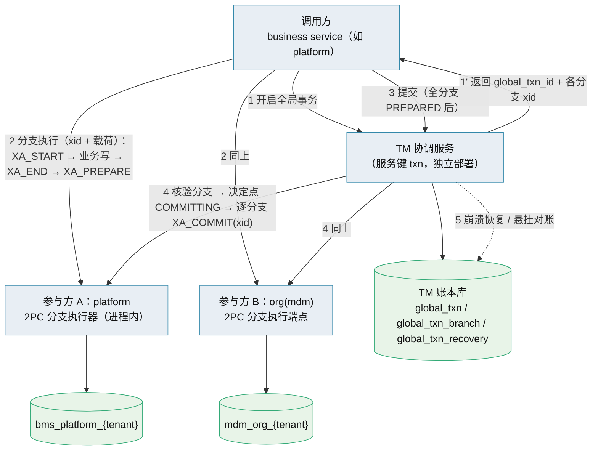
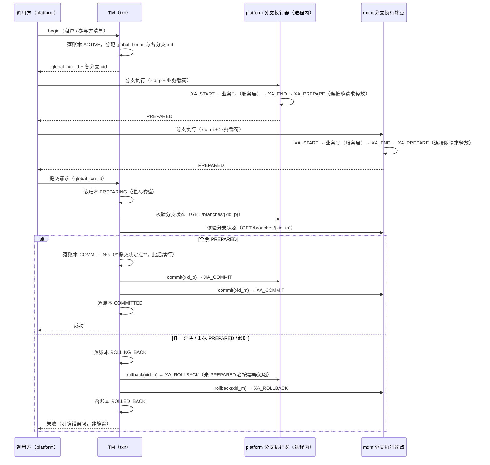

# 01 详细设计 · 跨服务事务管理器（强一致专项 · 评审稿）

> 后端基座与服务化地基 · 05_服务间通信与一致性 · 子任务 07（拟）· 详细设计（**评审稿，未立项**）

[文档首页](../../../../../../文档首页.md) › [05 服务间通信与一致性](../../05_服务间通信与一致性.md) › 详细设计

> **本稿用途**：按《后端开发规范》「强一致场景口径」的**专项立项前置**要求，先出可评审的详细设计。**评审通过后才**回写需求、阶段计划与任务状态并开工；**本稿不产生任何代码改动**。

## 0. 评审先读（结论摘要） <a id="brief"></a>

**目标**：把「角色保存（平台 + mdm 组织）」与「用户保存（用户-岗位 / 用户-部门分配）」这两条跨服务写从**最终一致**升级为**物理原子**——`prepare` 未 `commit` 前两侧变更对业务**均不可见**，从根上消除「一侧已改、另一侧未改」的业务残留。

**形态**：新增 **TM 协调服务**（服务键拟 `txn`）+ **全局事务账本库** + 各参与服务的 **2PC 参与端点**（同步引擎 + XA），按「能力基类 + 插件注册表 + 配置选择 + 提供者」落地；`[transaction_manager].provider` 默认 `null`（= 现状基线，零影响），改配置启用 `xa`，**业务调用面不变**。**决策点 1 已于 2026-10-09 定稿为 b1「分支专用同步引擎」+「分支一次请求」**（见 §3.3 与 §8 第 1 项）。

**已具备的地基（无需从零造）**：

| 能力 | 现状 | 出处 |
| --- | --- | --- |
| 三库 XA 实测 | MySQL / PostgreSQL / 达梦 单进程 2PC 全员通过，悬挂分支可见性已取证 | 任务 05_06；`libs/bms_core/tests/integration/test_cross_db_2pc.py` |
| 达梦 XA 方言 | `DMXADialect`（`dmxa`，接 `DBMS_XA`），连接串自动归一 | 任务 05_05；`libs/bms_core/db/dialects/dm_xa.py` |
| 同步引擎门面 | `SYNC_ONLY_DIALECTS` + `SyncSession`（阻塞会话的异步门面）；`DbSession = AsyncSession \| SyncSession` | `libs/bms_core/db/sync.py` |
| 服务间身份 | 服务 JWT（`aud=service`）+ `require_service(*白名单)` 内部端点范式；出站客户端自动签调用方身份 | `libs/bms_core/api/base.py`、`libs/bms_core/servicecall/http.py` |
| 服务目录 / 契约门禁 | `SERVICE_CATALOG` / `PRODUCT_ROUTES`；契约快照 / 兼容门禁 / 事件契约 | `libs/bms_core/services/module_registry.py`、`backend/ops/` |
| 幂等 / 发件箱 / 屏障 | `IdempotencyStore`、`BaseOutboxStore` + 投递器、`BaseConsistencyBarrier` | `libs/bms_core/idempotency|outbox|consistency/` |

**代码现状（本场景）**：`grants-orchestrated` 编排端点、mdm 内部写端点、参与端点 —— **全部为零**（仅在文档中定义）；现有可用的是 platform 侧角色/权限/用户写服务与 mdm 侧 `user-posts` / `user-depts` 管理面。

**必须评审拍板的 6 项**见 §8——**6 项已于 2026-10-09 全部定稿**：① b1 分支专用同步引擎 + 分支一次请求；② dev / test 恒 `null` + 用例分层 + CI `2pc` 作业；③ **多实例 + 领导者选举**；④ **`txn` 登记为平台基座服务（`errcode_segment="05"`）+ 谁挂端点谁参与**；⑤ **补 `do_recover_twophase` 且必须含两实现要点**；⑥ **`ops/txn_recovery.py` 死信 / 重放范式**。**下一步＝立项与窗口登记**（数值唯一落点仍是阶段计划）。

## 1. 设计目标与范围 <a id="goal"></a>

### 1.1 纳入范围 <a id="scope-in"></a>

| # | 跨服务写链路 | 参与方 | 原子范围 |
| --- | --- | --- | --- |
| 1 | 角色保存（权限 / 字段 / 数据范围 / 用户分配 + 角色-岗位 / 角色-部门绑定） | platform、org(mdm) | 两个 XA 分支：platform 租户库、mdm `org` 租户库 |
| 2 | 用户保存（用户-岗位 / 用户-部门分配 + 主要项） | platform、org(mdm) | 同上按需使用（单侧写时不启全局事务） |
| 3 | 后续产品服务的同类跨服务原子写 | 平台 + 各产品服务 | 按同一协议接入 |

### 1.2 不在范围 <a id="scope-out"></a>

- **非原子链路**：仍走「本地事务 + 事务性 Outbox + 幂等 + 一致性屏障」基线，不改。
- **跨 ≥4 步长流程 / 含人工审批**：仍归编排式 Saga（外部运行时按判据再引入）。
- **异步 API 暴露两阶段**：SQLAlchemy 异步 API 不暴露 `begin_twophase`，本方案**不尝试绕过**（见 §8 第 1 项）。

### 1.3 与既有能力域的关系 <a id="relation"></a>

| 能力 | 本方案下的作用 |
| --- | --- |
| 本地事务（`UnitOfWork`） | 非原子链路不变；原子链路下由 XA 分支取代（分支内多写共用一个 `xid`） |
| 事务性 Outbox | **保留且强化**：分支内「业务数据 + `sys_outbox` 条目」同库同分支，`commit` 后投递器才可见 ⇒ 事件与数据仍是原子的 |
| 幂等（`IdempotencyStore`） | 请求级幂等不变；**新增分支级幂等**（TM 驱动消息与参与端点状态机） |
| 一致性屏障 | **作用面收窄**：原子链路不再需要「等收敛」；非原子链路继续使用 |
| Saga 执行器 | 保留给跨 ≥2 步的非原子流程；**不用于本方案的原子写**（TCC 的预占态仍属可见中间态） |

## 2. 总体架构与时序 <a id="arch"></a>





**为什么这样就没有业务残留**：`prepare` 之后、`commit` 之前，两侧分支**均未提交**，任何业务读取（含权限解析）看到的都是**旧值**——不存在「一侧新值一侧旧值」的组合。提交决定点写入账本后，恢复器**只做一件事**：把未确认的分支驱动到**决定点规定的终态**。**锁窗口**：一次请求形状下（§3.3），行锁仅在「`XA_PREPARE` → TM 核验决定 → `XA_COMMIT`」窗口内持有，**不含**调用方业务处理时长。

## 3. 协调算法与状态机 <a id="algorithm"></a>

### 3.1 全局事务状态机 <a id="state"></a>

```
ACTIVE ──请求提交──> PREPARING ──全票可提交──> COMMITTING ──全分支确认──> COMMITTED
   │                    │
   │                    └──任一否决 / 准备超时──> ROLLING_BACK ──> ROLLED_BACK
   └──调用方主动放弃──> ROLLING_BACK
异常终态：HEURISTIC_COMMIT / HEURISTIC_ROLLBACK / HEURISTIC_MIXED（参与方单方面完成，见 §6）
```

| 规则 | 口径 |
| --- | --- |
| 提交决定点 | 账本置 `COMMITTING` 的那一刻，**唯一权威**；此之前一切失败 → 回滚；此之后**只 commit，不再回滚** |
| 准备阶段超时 | 按失败处理（回滚）；决定点之后**不超时回滚**（靠恢复器重驱动） |
| 幂等 | 每条驱动消息带 `global_txn_id` + `branch_id`；参与端点按分支状态机判定（已 `PREPARED` 再收**同一分支执行**（`request_hash` 相同）直接返回原结果；已 `COMMITTED` 再 `commit` 直接成功） |
| 重试 | TM 对未确认消息退避重试，直到确认；**不静默放弃** |
| 不变量 | 决定点后所有分支最终必须 `commit`；决定点前所有分支最终必须 `rollback` |

### 3.2 分支状态机（参与方侧） <a id="branch"></a>

```
ACTIVE ──prepare──> PREPARED ──commit──> COMMITTED
   │                    │
   └──rollback──> ROLLED_BACK <──rollback──┘
```

- 分支与**同步会话**绑定，但绑定窗口＝**单个请求**：`XA_START` → 分支内全部同库写 → `XA_END` + `XA_PREPARE`（**一气呵成**，见 §3.3），连接随请求释放；prepared 态由数据库服务器持有（`XA_RECOVER` / `pg_prepared_xacts` 可见）。
- 分支内**必须**包含该服务本次变更的**全部**同库写入（业务表 + 发件箱），保证「数据与事件」同分支原子。
- 分支驱动端点**只做协议执行并调用本服务已有业务方法**（不复制业务逻辑、不承载额外业务语义）。
- **锁窗口**：行锁自分支内 DML 起持有至 `XA_COMMIT` / `XA_ROLLBACK`；「一次请求」形状把窗口从「调用方整个业务处理期」压缩到「`XA_PREPARE` → TM 决定 → `XA_COMMIT`」的决定窗口（毫秒级量级）。
- 分支执行请求**中断 / 超时**（未达 `PREPARED`）：连接断开 ⇒ 事务按 XA 语义**自动回滚**，无残留；TM 随后按准备超时回滚其余分支。

### 3.3 分支执行形状（2026-10-09 定稿：一次请求） <a id="branch-shape"></a>

**定稿**：`XA_START` → 分支内全部业务写 → `XA_END` → `XA_PREPARE` **收进同一个请求**（`POST /api/v1/txn/branches`，携带 `xid` + 业务载荷），请求结束即释放连接；`prepare` **不再单独成端点**。

| 项 | 口径 |
| --- | --- |
| 谁驱动分支执行 | **调用方**（本场景 platform）；对**自己的分支在进程内执行**（同一套分支执行器，不经 HTTP），对其他服务的分支经 `/api/v1/txn/branches` 调用 |
| 谁做提交决定 | **TM**：调用方提交后，TM **核验**各分支状态（`GET /api/v1/txn/branches/{xid}`，参与方为分支状态权威），全票 `PREPARED` 才落 `COMMITTING`（决定点） |
| 为什么不由 TM 驱动分支执行 | TM 驱动则须由 TM 承载业务载荷 ⇒ 违反「TM 只做协议、不承载业务语义」；且这笔业务数据本就在调用方手里 |
| 连接与锁窗口 | 连接仅在**一个请求内**持有；行锁窗口 = 「`XA_PREPARE` → TM 核验 → 决定 → `XA_COMMIT`」，**不含**调用方业务处理时长 |
| 免掉的东西 | 不需「`xid` → 连接」挂载表、不需跨请求连接保活与泄漏处置、不需把 `xid` 透传进业务请求 |
| 代价 | 分支执行契约需携带**业务载荷**（参与方用自己的服务层执行，**不复制业务逻辑**）；TM 决定前多一次分支状态核验往返 |
| `xid` 规范 | 由 TM 生成，形态须满足三库最严约束（MySQL `XA` xid ≤ 64 字节）：建议 `gtrid = global_txn_id`、`bqual = branch_id`、`formatID = 1` |
| 同步引擎口径（b1） | 分支走**分支专用同步引擎**（`EngineFactory.create_sync` + `sync_session_scope` / `SyncSession`）；`is_sync_only` 判定扩为「**按方言 ∨ 分支上下文**」；常规读写路径**保持异步不变** |
| 双路径约束 | 分支只调用与本服务常规路径**同一套服务层方法**；用例须在「SQLite 异步 / MySQL·PG 异步与同步 / 达梦同步」两条路径各跑一遍（§7）；分支会话一律经 `sync_session_scope`（禁止裸 `Session(...)`）；分支使用独立连接池 + 独立线程池上限（在途分支数可预算） |

## 4. 全局事务账本 <a id="ledger"></a>

**库归属**：TM 专属库（`txn` 服务租户库；平台侧 `txn` 服务 + 平台/租户两条链），与业务库**物理分离**，避免「账本与分支同库」的恢复歧义。库键纳入 `SERVICE_CATALOG` 与表归属登记。

概念表（**字段级结构**按《数据库设计》另行新建表文件后落库，本稿只定语义）：

| 表 | 语义 | 关键字段（概念） |
| --- | --- | --- |
| `global_txn` | 全局事务主记录 | `global_txn_id`、`tenant`、`caller_service`、状态机、`created_at`/`updated_at`、`deadline_at`、`decided_at` |
| `global_txn_branch` | 参与方分支 | `global_txn_id`、`branch_id`、`service`、`xid`、分支状态、重试次数、最后错误、`request_hash`（幂等） |
| `global_txn_recovery` | 恢复 / 对账记录 | 发现时刻、悬挂时长、处置动作（`drive_commit` / `drive_rollback`）、处置方（恢复器 / 人工）、结论 |

**跨租户口径**：一次全局事务**只允许落在同一租户**（不跨租户），账本按 `tenant` 分区；库拓扑经既有租户库键解析能力取。

## 5. 服务侧参与端点（契约） <a id="participant"></a>

| 方法 | 路径（拟） | 语义 | 鉴权 |
| --- | --- | --- | --- |
| `POST` | `/api/v1/txn/branches` | **分支执行**：`xid` + 业务载荷；单请求内 `XA_START` → 业务写（服务层）→ `XA_END` → `XA_PREPARE`，返回 `PREPARED` / `REJECTED` | **调用方服务**身份（本场景 `platform`；`xid` 由 TM 预先分配） |
| ~~`POST`~~ | ~~`/api/v1/txn/branches/{xid}/prepare`~~ | **已合并进分支执行**（2026-10-09 定稿，见 §3.3），不再单独成端点 | — |
| `POST` | `/api/v1/txn/branches/{xid}/commit` | `commit`：`XA_COMMIT` | `require_service("txn")`（TM 驱动） |
| `POST` | `/api/v1/txn/branches/{xid}/rollback` | `rollback`：`XA_ROLLBACK` | 同上 |
| `GET` | `/api/v1/txn/branches/{xid}` | 分支状态查询（**TM 决定点前核验** / 恢复 / 对账） | 同上 |
| `GET` | `/api/v1/txn/branches/{xid}/recover` | 本库悬挂分支列举（`XA_RECOVER`，对账用） | 同上 |

**分支承载**：**无需跨请求维护「`xid` → 会话」绑定**——分支执行在**单个请求内**完成 `XA_START` → 业务写 → `XA_END` → `XA_PREPARE` 并释放连接（见 §3.3）。分支执行器按扩展后的 `is_sync_only` 判定（「**按方言 ∨ 分支上下文**」）取 `EngineFactory.create_sync` 的**同步引擎**，经 `sync_session_scope` 开会话并把 `DbSession` 传给**本服务现有服务层**（联合类型已支持同步会话），**不复制业务逻辑**。达梦本就全同步（无额外差异）；差异只存在于 MySQL / PG 的「常规路径异步 vs 分支路径同步」两条路径之间（§7 用例两路径各跑一遍）。

**TM 侧对外契约**：`POST /api/v1/txn/global`（开启）、`POST /api/v1/txn/global/{id}/commit`、`DELETE /api/v1/txn/global/{id}`（回滚）、`GET /api/v1/txn/global/{id}`（状态）；走公开契约 + 服务身份，非开放接口。

**参与库要求**：需具备两阶段能力——MySQL 原生 `XA`、PostgreSQL `PREPARE TRANSACTION`、达梦 `DBMS_XA`，**三库均已由 05_05 / 05_06 真库实测通过**（Kiwi 2245 / 2246）。**实例侧的部署与参数配置见部署说明**（[达梦 DM8](../../../../../../资料/开发服务器/linux/达梦DM8部署使用说明.md#xa) / [PostgreSQL](../../../../../../资料/开发服务器/linux/PostgreSQL部署使用说明.md#twophase)），**本稿不重复登记**。

## 6. 失败分支与边界（穷举） <a id="edge"></a>

| 场景 | 处置 | 业务可见表现 |
| --- | --- | --- |
| TM 崩溃于**决定点之前** | 账本无提交决定 → 恢复时回滚全部分支；未 `prepare` 的分支通知参与方丢弃 | 保存失败，两侧无变更 |
| TM 崩溃于**决定点之后** | 账本有提交决定 → 恢复器**重发 `commit`** 至未确认分支 | 保存最终成功，两侧一致 |
| 某参与方 `prepare` 否决 / 超时 | 置 `ROLLING_BACK`，全分支 `rollback` | 保存失败，两侧无变更 |
| 参与方崩溃（`prepare` 后） | TM 重试驱动；参与方重启后本库 `XA_RECOVER` 恢复悬挂分支并配合归位 | 取决于决定点：终态一致 |
| **分支执行请求中断 / 超时**（`XA_START` 后未达 `PREPARED`） | 连接断开 ⇒ 事务按 XA 语义**自动回滚**（无需处置）；TM 按准备超时回滚其余分支 | 该分支无变更；保存失败 |
| **全部分支 `PREPARED` 但调用方不再提交**（业务放弃 / 调用方崩溃） | 账本 `deadline_at` 到期 ⇒ TM 定时置 `ROLLING_BACK` 并逐分支 `rollback(xid)` | 保存失败，两侧无变更 |
| **悬挂分支**（长期无主） | TM 定期扫描 + 参与方 `XA_RECOVER` 对账；无法自动判定者入 `global_txn_recovery` 队列，**依账本决定点**驱动 commit / rollback | 无业务残留（分支未提交、业务不可见） |
| 启发式完成（参与方单方提交 / 回滚） | 记 `HEURISTIC_*`，**不静默**；对账冲正或按决定点定终态 | 明确告警 + 处置记录 |
| TM ↔ 参与方网络分区 | 重试到恢复；分区期间**分支未提交、业务不可见** | 保存挂起或超时失败；终态一致 |
| **TM 全副本不可用**（决策点 3：多副本 + 领导者选举把「单点」降为「**全副本同时故障**」） | 调用方**快速失败**（拒绝发起全局事务），不降级为最终一致（避免回到残留模型） | 保存失败（明确可重试） |
| **TM leader 失效 / 切换**（决策点 3） | 锁 TTL（30s）到期后新 leader 接管；重复的恢复驱动**由分支状态机幂等吸收**（已 `COMMITTED` 再 `commit` 直接成功） | 无业务影响；切换期恢复推进略有延迟 |
| **本地开发环境（SQLite）** | SQLite **本身无两阶段能力，故不参与强一致链路**（非「不可用」而是「不启用」）：开发环境 `provider=null`（见 §8 第 2 项） | 开发态退化为基线模型（与生产语义有差） |
| Redis 不可用（幂等 / 屏障） | 按 03_04 口径：**必需域 fail-closed**（抛 `RedisUnavailableError`，`10012` / 503；`degrade-open` **已作废**） | 不影响 2PC 主路径（分支执行不依赖 Redis） |

> **人工处置的边界（硬口径）**：人工只出现在「悬挂 / 启发式完成」两类**基础设施级**事件的处置队列，且动作被定义为**依账本提交决定点驱动 `commit` / `rollback`**——**不是修改业务数据内容**，全程留痕（`global_txn_recovery`）。

## 7. 测试设计 <a id="test"></a>

| 层次 | 内容 | 落点 |
| --- | --- | --- |
| 单元 | TM 状态机（含决定点唯一权威）、分支幂等状态机、账本读写、恢复器决策（注入假时钟 / 模拟崩溃点） | `libs/bms_core/tests/` 或 `services/txn/tests/` |
| 单元 / 流程（**本地可跑，不依赖真 XA**） | TM 状态机 + 编排（调用方驱动分支执行 → TM 核验 → 决定点）+ 错误码 + 幂等 + 崩溃点分流：以**假参与者**（内存 / SQLite 单库事务打桩）驱动 | `libs/bms_core/tests/` 或 `services/txn/tests/`（SQLite，本地全跑） |
| 集成（真库，**XA 语义的唯一验证处**） | 四库单库 2PC 三态；**跨服务 2PC（platform × org）**；**崩溃注入**（决定点前 / 后各一例）；悬挂可见性与回收；**达梦 `XA_RECOVER` 可回放**（列举出的 xid 可直接驱动 `commit` / `rollback`，见决策点 5）；幂等重放 | `tests/integration/`（MySQL / PG / 达梦，缺库 `skip`）；**CI 新增 `2pc` 作业**（integration 档，沿用远端常驻三库，读 `BMS_TEST_MYSQL_URL` / `BMS_TEST_PG_URL` / `BMS_TEST_DM_URL`——**收口 05_06 遗留项 2 / 5**；达梦作业随 `-70089` 修复恢复，见决策点 5） |
| 多实例 / 选举（**不依赖真库**） | **leader 选举与切换**（锁 TTL 到期接管）、**恢复器单飞**（仅 leader 驱动）、切换期重复恢复**幂等吸收** | `services/txn/tests/`（`redis` 与 `memory` 锁实现各一轮） |
| 契约 | TM 对外契约 + 参与端点契约快照、兼容门禁 | `ops/contract_snapshot.py` / `ops/contract_gate.py` |
| 环境矩阵 | SQLite（单测 / 假实现）、MySQL、PostgreSQL、达梦（**CI 作业当前因「连接阶段」`dmPython DatabaseError [CODE:-70089] Encryption module failed to load` 关闭——服务端加密模块 / 客户端环境问题，**与 XA 前置无关**；须恢复该作业**） | `.gitlab-ci.yml`、`ops/test_db.py` |
| 用例登记 | 一任务一条（编号以平台自增为准），代码标 `@pytest.mark.kiwi_id(<编号>)` | 平台用例库 |

## 8. 边界与开放项（**评审决策点**） <a id="open"></a>

| # | 待决 | 选项 | 影响 |
| --- | --- | --- | --- |
| 1 | **同步引擎策略**（**2026-10-09 定稿：b1 分支专用同步引擎——本项通过，方案具备落地条件**） | ~~(a) 全栈转同步~~（不采纳）；(b) 维持**双路径**（常路 async、2PC 路 sync）——**定稿为 b1：仅 XA 分支**走同步引擎（`EngineFactory.create_sync` + `sync_session_scope` / `SyncSession`），`is_sync_only` 判定由「按方言」扩为「**按方言 ∨ 分支上下文**」 | 依据与约束见 §3.3；改动面估 **5~8 文件 + 1 配置分区**（业务层**零改动**：`DbSession = AsyncSession \| SyncSession` 已是现状，达梦生产链路即为同步会话）。**(a) 不采纳**：`uow.begin(` **63 处**（services 57 / libs 6）、`Depends(get_uow*)` **13 处**、直接引 `AsyncSession` 的 **26 个文件**，且无业务收益（只有 XA 分支需要同步） |
| 2 | **本地开发环境无 XA**（SQLite）（**2026-10-09 定稿：b + c + a′ + CI 真库门禁，本项通过**） | **b**：dev / test 恒 `provider=null`（启动日志显式提示「开发态＝最终一致基线，非强一致」）+ **c 用例分层**：流程 / 状态机用例用**假参与者**本地全跑，XA 语义用例只走真库 + **a′ 轻量可选**：`deploy/compose/base.yml` 起 mysql + postgres（**PG 需按《[PostgreSQL 部署使用说明](../../../../../../资料/开发服务器/linux/PostgreSQL部署使用说明.md#twophase)》启用两阶段参数**），设 `BMS_TEST_MYSQL_URL` / `BMS_TEST_PG_URL` 直接跑 2PC 用例（达梦缺则 `skip`）+ **CI 门禁**：`BMS_TEST_*_URL` 纳入 CI/CD 变量、integration 档新增 `2pc` 作业。~~(a) 完全体~~不采纳 | 依据：本地开发＝**纯 SQLite**（`config.dev.toml` 的 `sqlite+aiosqlite` 模板 + `本地全套.sh`「无需 Docker / 无需 mjbk」）；**实测**：`SYNC_ONLY_DIALECTS` 不含 sqlite、`AsyncConnection.begin_twophase` **不存在**、SQLite `begin_twophase()` 抛 `NotImplementedError`；且 **mdm `org` 服务本机不纳管** ⇒ 本地跑不通跨服务链路，故 (a) 不划算。⚠️ **现状缺口（本项须一并收口）**：`test_cross_db_2pc.py` 依赖 `BMS_TEST_*_URL`，而 `.gitlab-ci.yml` **未设**（05_06 遗留项 2 / 5 未办）⇒ 2PC 用例当前在 CI **实为跳过** |
| 3 | **TM 高可用**（**2026-10-09 定稿：多实例 + 领导者选举**） | ~~(a) 单实例 + 快速恢复~~（不采纳）；**(b)** TM 起**多副本**：领导者选举**复用分布式锁基座**（`BaseDistributedLock`，「redis」实现**已默认开启**——`config.toml` `[distributed_lock]`），锁键 `bms:global:lock:txn:leader`（TTL 30s + `extend` 续租），**仅 leader 跑恢复器与定时对账**；**所有副本均可受理 API**（幂等） | 需配套：**账本行级乐观锁 / 版本列** + 分支状态机幂等——leader 切换时**在途恢复重叠由幂等吸收**（已 `COMMITTED` 再 `commit` 直接成功）；先例：`EngineRegistry._cross_instance_guard` 即「跨实例锁 + 进程内锁」同范式。**收益是可用性**（TM 不再是新单点），**正确性仍由决定点不变量保证** |
| 4 | **参与方范围与产品化**（**2026-10-09 定稿：登记为基座服务 + 「谁挂端点谁参与」**） | **`txn` 登记进 `SERVICE_CATALOG`**：`service_key="txn"`、`table_prefix="txn_"`、**`errcode_segment="05"`**（已核：现用 01-04 ／ 10-15 ／ 33，**05 空闲**）、`event_domain="txn"`、`ServiceGroup.FOUNDATION`；**不进 `PRODUCT_ROUTES`**（TM 仅服务身份、不经网关；产品路由当前仅 `mdm/org`）；**参与方＝谁挂参与端点谁参与**（能力基类天然可复用） | 影响面收敛为**一次目录登记 + 能力基类复用**；§1.1 第 3 条「后续产品服务同类原子写」＝**接入路径**，无需额外建设 |
| 5 | **达梦悬挂对账补齐**（**2026-10-09 定稿：补，且必须含两个实现要点**） | 补 `do_recover_twophase` + **① 可回放 xid 载体**（`DMXARecoveredXid(gtrid, bqual)`，`__str__`＝`gtrid|bqual`；`_xid_raw` 识别该形态**直接使用、不再哈希**）+ **②** 查询 `TABLE(DBMS_XA.XA_RECOVER())` 并以 `RAWTOHEX` 还原 | ⚠️ **真实缺陷（本次评审发现）**：`do_recover_twophase` 现恒返回空（`dm_xa.py:92-100`），而 `_xid_raw` 用 `blake2b` **不可逆派生**（`dm_xa.py:33-43`）⇒ **只补查询是补不通的**：恢复器拿到 `(gtrid, bqual)` 无法驱动 `commit` / `rollback`（二次哈希对不上）。验证通道依赖达梦 CI 作业恢复（连接阶段 `-70089`） |
| 6 | **人工处置队列的运行方式**（**2026-10-09 定稿：复用 `ops/` CLI + 死信 / 重放范式**） | 仿 `ops/outbox.py`（已有 `dispatch` / `replay`——「把已投递 / 死信重置为待投递，消费端 `event_id` 幂等，重放安全」）落地 **`ops/txn_recovery.py`**：`list --state hung|heuristic` / `drive-commit --global-txn-id ID` / `drive-rollback --global-txn-id ID`；**只驱动协议、绝不写业务数据**；全程落 `global_txn_recovery` 留痕；告警接既有指标 / 告警通道 | 责任边界明确：人的动作＝**重放 / 驱动协议**，**禁止手工改数据**（§6 硬口径） |

## 9. 实施分解（工序先后，数值归阶段计划） <a id="impl"></a>

1. **TM 服务骨架**：`txn` 服务（`SERVICE_CATALOG` 登记：`service_key="txn"` / `table_prefix="txn_"` / **`errcode_segment="05"`** / `event_domain="txn"` / `ServiceGroup.FOUNDATION`，**不入 `PRODUCT_ROUTES`**；服务身份、契约、健康检查）+ 账本表与迁移链（含**行版本列**）+ 表归属登记。
2. **TM 协调器**：状态机 + 驱动（`begin` / `commit` / `rollback` + **决定点前分支状态核验**）+ 幂等 + 退避重试 + 账本落库（**行级乐观锁**，并发写冲突即重试）。
3. **TM 恢复器**：启动期扫描 + 定时对账（决定点前后分流）+ **领导者选举**（锁键 `bms:global:lock:txn:leader`，TTL 30s + `extend` 续租；**仅 leader 驱动**，重复驱动由幂等吸收）+ `global_txn_recovery` 台账 + 告警。
4. **参与方能力域**：`BaseTransactionParticipant`（端口）+ `xa` 提供者（**分支专用同步引擎** `EngineFactory.create_sync` + `sync_session_scope` / `SyncSession`，覆盖 `dmxa` / MySQL / PG）+ `is_sync_only` 判定扩为「按方言 ∨ 分支上下文」+ `null` 缺省 + 配置分区 `[transaction_manager]` + 装配接线（**常规读写路径不改**）。
5. **参与端点**：各参与服务挂 `/api/v1/txn/branches*`（**分支执行**＝调用方服务身份 + 业务载荷；`commit` / `rollback` / 状态查询＝`require_service("txn")`）+ 契约快照。
6. **调用方接入**：把角色保存 / 用户保存的编排从「本地事务 + 反向补偿」切换为「全局事务」；**保留** `null` 提供者下的原基线分支（可回退）。
7. **达梦补齐**：`do_recover_twophase` 实现（**含两要点**：可回放 xid 载体 `DMXARecoveredXid` + `TABLE(DBMS_XA.XA_RECOVER())` 与 `RAWTOHEX` 还原）+ 达梦 CI 作业恢复。
8. **采集与运维面**：指标（全局事务数 / 准备成功率 / 悬挂数 / 恢复重驱动次数 / **leader 切换次数**）+ 告警 + **`ops/txn_recovery.py`**（`list` / `drive-commit` / `drive-rollback`，**只驱动协议**）。
9. **文档回写**：见 §11。

## 10. 迁移与回退 <a id="migration"></a>

| 项 | 口径 |
| --- | --- |
| 启用 | `[transaction_manager].provider`：`null`（缺省）→ `xa`；**改配置即切**，业务调用面不变 |
| 数据迁移 | **无**（纯能力启用，不搬数据、不改表结构） |
| 灰度 | 按环境 / 租户白名单开放；先单链路（角色保存）后全链路 |
| 多副本 / 滚动升级（决策点 3） | TM **多副本 + 领导者选举**：滚动升级期间 leader 自动切换；**账本行级乐观锁**保证并发写一致；**恢复器单飞由锁保证**，重复恢复由幂等吸收 |
| 前置自检（**启用 `xa` 时**） | 校验参与库是否具备两阶段能力：具备即正常启用；**不具备 ⇒ 就地快速失败并指向对应部署说明**（**不静默降级为 `null`**）。**能力本身三库均已实测可用**；实例侧部署条件与参数**统一登记在部署说明**（[达梦 DM8](../../../../../../资料/开发服务器/linux/达梦DM8部署使用说明.md#xa) / [PostgreSQL](../../../../../../资料/开发服务器/linux/PostgreSQL部署使用说明.md#twophase)），本稿不重复 |
| 回退 | 先**等全部在途全局事务收敛**（账本无非终态记录），再切回 `null`；回退不丢数据 |
| 回退风险 | `null` 下重新使用「本地事务 + 反向补偿」基线 ⇒ **中间态风险回归**，需在切换说明中明示 |

## 11. 登记落点与回写清单 <a id="register"></a>

| 内容 | 落点 |
| --- | --- |
| 强制口径修订 | 《[后端开发规范](../../../../../../规范/后端开发规范.md)》「强一致场景口径」——**已于 2026-10-09 修订**：「Python 无事务管理器 / `dmPython` 无 XA」的括注删除，改为「**默认路径排除**（理由＝默认路径 + 可用性 / 运维代价，非技术不可行；达梦经 `dmxa` 已可用）+ **专项立项 + 先出详细设计**启用」。**同批对齐（避免「达梦不可用」误判）**：架构 37 §4、05_04 详设、需求 05-5、知识档案《分布式事务》02 / 《微服务 · 选型对比》12、`03_DM8` 方言特性、后端基类清单、05_05 / 05_06 前置措辞、`db/dialects/dm_xa.py` 模块注释。**部署条件一律不写进设计 / 开发文档**（2026-10-09 用户要求）：达梦 `XA_COMPATIBLE_MODE` / `DBMS_XA`、PG `max_prepared_transactions` 等**统一登记在部署说明**（[达梦 DM8](../../../../../../资料/开发服务器/linux/达梦DM8部署使用说明.md#xa)「两阶段事务（XA）实例条件」/ [PostgreSQL](../../../../../../资料/开发服务器/linux/PostgreSQL部署使用说明.md#twophase)「两阶段事务参数」），设计文档只保留「**需具备两阶段能力**」与「**启动期自检失败即指向部署说明**」 |
| 架构口径 | 《[架构设计 · 服务间通信与分布式一致性](../../../../../../设计/架构设计/37_架构设计_子系统_服务间通信与一致性.md)》、[决策与风险](../../../../../../设计/架构设计/34_架构设计_决策与风险.md)（ADR）、[权限计算引擎](../../../../../../设计/架构设计/15_架构设计_子系统_权限计算引擎.md)（屏障与版本失效的交互） |
| 知识档案 | 《[跨服务 TM 方案](../../../../../../资料/知识档案/分布式事务/03_分布式事务_跨服务TM方案.md)》《[一致性屏障](../../../../../../资料/知识档案/分布式事务/04_分布式事务_一致性屏障.md)》《[选型对比（BMS）](../../../../../../资料/知识档案/分布式事务/05_分布式事务_选型对比（BMS）.md)》「触发条件」节 |
| 基类清单 | 《[后端基类清单](../../../../../../后端基类清单.md)》（`BaseTransactionManager` / `BaseTransactionParticipant` / `DMXADialect` 归属节） |
| 表设计 | TM 账本三表表文件 + 《[数据库设计 · 总览](../../../../../../设计/数据库设计/01_数据库设计_总览.md)》登记 |
| 运维命令与能力登记（决策点 3 / 4 / 6） | `ops/txn_recovery.py`（悬挂 / 启发式处置：`list` / `drive-commit` / `drive-rollback`，**只驱动协议**）；`SERVICE_CATALOG` 追加 `txn` 行（`errcode_segment="05"`、FOUNDATION、**不入 `PRODUCT_ROUTES`**）；领导者选举复用 `[distributed_lock]`（缺省已 `redis`） |
| 需求 / 任务 / 计划 | 需求 `05-5` 补充；本子任务正式立项；阶段计划状态随实施回写（**数值唯一落点**） |
| 下游口径（**阶段七编排切换清单，2026-10-09 清点登记**） | 角色侧与用户侧编排（`02_03` 追加子任务、`02_02` 追加子任务【**用户侧宿主编排尚未建**】、mdm `01_02` 嵌套子任务）按本稿改写；**口径已对齐（2026-10-09，用户「现在改」）**：绝对化「排除 2PC / XA」与「落待人工」**已全部改写**为「**默认路径排除**（非技术不可行，强一致经专项立项）+ **死信 / 幂等重放**（禁止手工改数据）」；**剩余为机制切换**——启用 `xa` 后把「本地事务 + 反向补偿」改为全局事务，**涉及文件**：① `07_RBAC…/02_用户与角色_03_角色管理_02_角色分配插件随宿主保存编排/`（设计 6 处 / 实施 2 处 / 测试 1 处 / 任务文档 2 处）；② `07_RBAC…/01_插件化挂接_01_…/设计/01_详细设计_01_…`（提交时机条）；③ `07_RBAC/需求/02_需求_用户与角色.md`（`07-11` 条）；④ `07_RBAC…/02_用户与角色_03_角色管理/02_用户与角色_03_角色管理.md`；⑤ `07_RBAC/计划/01_计划_RBAC基础模块.md`（2 处）；⑥ 概要设计 `03_概要设计_用户管理.md` / `06_概要设计_角色管理.md` + 组件设计 `07_组件设计_权限配置.md`；⑦ 架构 `03_架构设计_总体架构.md`（「排除 2PC/XA」绝对化表述）；⑧ 知识档案《分布式事务》05 选型对比（BMS） / 《微服务》12 选型对比（绝对化表述）；⑨ **mdm 侧已对齐（2026-10-09）**：`01_组织主数据承接_02` 嵌套 `_02` 与 `_03`。**切换时须同时废除「落待人工」措辞**（恢复原语＝**幂等重放**，**禁止手工改数据**） |

## 12. 参考文档 <a id="ref"></a>

- 规范 [后端开发规范](../../../../../../规范/后端开发规范.md)「强一致场景口径」
- 设计 [架构设计 · 服务间通信与分布式一致性](../../../../../../设计/架构设计/37_架构设计_子系统_服务间通信与一致性.md)
- 前置任务 [05_05 达梦 XA 自定义方言](../../05_服务间通信与一致性_05_达梦XA自定义方言/设计/01_详细设计_05_达梦XA自定义方言.md)、[05_06 分布式事务方案评估](../../05_服务间通信与一致性_06_分布式事务方案评估/设计/01_详细设计_06_分布式事务方案评估.md)
- 知识档案 [分布式事务总览](../../../../../../资料/知识档案/分布式事务/01_分布式事务_总览.md)、[两阶段提交与 XA](../../../../../../资料/知识档案/分布式事务/02_分布式事务_两阶段提交与XA.md)、[跨服务 TM 方案](../../../../../../资料/知识档案/分布式事务/03_分布式事务_跨服务TM方案.md)、[一致性屏障](../../../../../../资料/知识档案/分布式事务/04_分布式事务_一致性屏障.md)、[选型对比（BMS）](../../../../../../资料/知识档案/分布式事务/05_分布式事务_选型对比（BMS）.md)
- 实现落点：`libs/bms_core/db/sync.py`、`libs/bms_core/db/dialects/dm_xa.py`、`libs/bms_core/servicecall/`、`libs/bms_core/api/base.py`、`libs/bms_core/services/module_registry.py`

> 本文档依《[文档生成规范](../../../../../../规范/文档生成规范.md)》与《[AI开发规范](../../../../../../规范/AI开发规范.md)》编写
