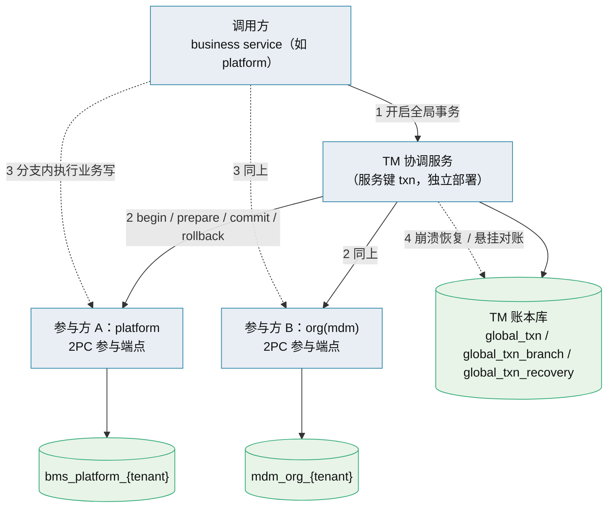
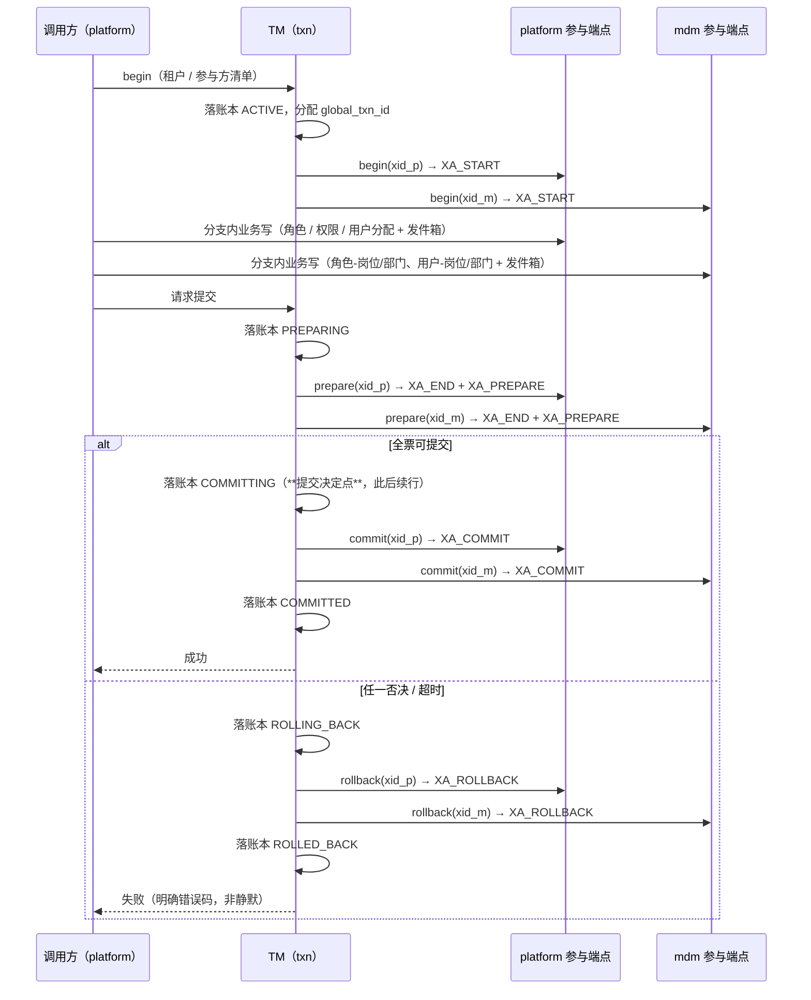

# 01 详细设计 · 跨服务事务管理器（强一致专项 · 评审稿）

> 后端基座与服务化地基 · 05_服务间通信与一致性 · 子任务 07（拟）· 详细设计（**评审稿，未立项**）

[文档首页](../../../../../../文档首页.md) › [05 服务间通信与一致性](../../05_服务间通信与一致性.md) › 详细设计

> **本稿用途**：按《后端开发规范》「强一致场景口径」的**专项立项前置**要求，先出可评审的详细设计。**评审通过后才**回写需求、阶段计划与任务状态并开工；**本稿不产生任何代码改动**。

## 0. 评审先读（结论摘要） <a id="brief"></a>

**目标**：把「角色保存（平台 + mdm 组织）」与「用户保存（用户-岗位 / 用户-部门分配）」这两条跨服务写从**最终一致**升级为**物理原子**——`prepare` 未 `commit` 前两侧变更对业务**均不可见**，从根上消除「一侧已改、另一侧未改」的业务残留。

**形态**：新增 **TM 协调服务**（服务键拟 `txn`）+ **全局事务账本库** + 各参与服务的 **2PC 参与端点**（同步引擎 + XA），按「能力基类 + 插件注册表 + 配置选择 + 提供者」落地；`[transaction_manager].provider` 默认 `null`（= 现状基线，零影响），改配置启用 `xa`，**业务调用面不变**。

**已具备的地基（无需从零造）**：

| 能力 | 现状 | 出处 |
| --- | --- | --- |
| 三库 XA 实测 | MySQL / PostgreSQL / 达梦 单进程 2PC 全员通过，悬挂分支可见性已取证 | 任务 05_06；`libs/bms_core/tests/integration/test_cross_db_2pc.py` |
| 达梦 XA 方言 | `DMXADialect`（`dmxa`，接 `DBMS_XA`），连接串自动归一 | 任务 05_05；`libs/bms_core/db/dialects/dm_xa.py` |
| 同步引擎门面 | `SYNC_ONLY_DIALECTS` + `SyncSession`（阻塞会话的异步门面）；`DbSession = AsyncSession \| SyncSession` | `libs/bms_core/db/sync.py` |
| 服务间身份 | 服务 JWT（`aud=service`）+ `require_service(*白名单)` 内部端点范式；出站客户端自动签调用方身份 | `libs/bms_core/api/base.py`、`libs/bms_core/servicecall/http.py` |
| 服务目录 / 契约门禁 | `SERVICE_CATALOG` / `PRODUCT_ROUTES`；契约快照 / 兼容门禁 / 事件契约 | `libs/bms_core/services/module_registry.py`、`backend/ops/` |
| 幂等 / 发件箱 / 屏障 | `IdempotencyStore`、`BaseOutboxStore` + 投递器、`BaseConsistencyBarrier` | `libs/bms_core/idempotency|outbox|consistency/` |

**代码现状（本场景）**：`grants-orchestrated` 编排端点、mdm 内部写端点、参与端点 —— **全部为零**（仅在文档中定义）；现有可用的是 platform 侧角色/权限/用户写服务与 mdm 侧 `user-posts` / `user-depts` 管理面。

**必须评审拍板的 6 项**见 §8（其中第 1、2 项若不通过，本方案不具备落地条件）。

## 1. 设计目标与范围 <a id="goal"></a>

### 1.1 纳入范围 <a id="scope-in"></a>

| # | 跨服务写链路 | 参与方 | 原子范围 |
| --- | --- | --- | --- |
| 1 | 角色保存（权限 / 字段 / 数据范围 / 用户分配 + 角色-岗位 / 角色-部门绑定） | platform、org(mdm) | 两个 XA 分支：platform 租户库、mdm `org` 租户库 |
| 2 | 用户保存（用户-岗位 / 用户-部门分配 + 主要项） | platform、org(mdm) | 同上按需使用（单侧写时不启全局事务） |
| 3 | 后续产品服务的同类跨服务原子写 | 平台 + 各产品服务 | 按同一协议接入 |

### 1.2 不在范围 <a id="scope-out"></a>

- **非原子链路**：仍走「本地事务 + 事务性 Outbox + 幂等 + 一致性屏障」基线，不改。
- **跨 ≥4 步长流程 / 含人工审批**：仍归编排式 Saga（外部运行时按判据再引入）。
- **异步 API 暴露两阶段**：SQLAlchemy 异步 API 不暴露 `begin_twophase`，本方案**不尝试绕过**（见 §8 第 1 项）。

### 1.3 与既有能力域的关系 <a id="relation"></a>

| 能力 | 本方案下的作用 |
| --- | --- |
| 本地事务（`UnitOfWork`） | 非原子链路不变；原子链路下由 XA 分支取代（分支内多写共用一个 `xid`） |
| 事务性 Outbox | **保留且强化**：分支内「业务数据 + `sys_outbox` 条目」同库同分支，`commit` 后投递器才可见 ⇒ 事件与数据仍是原子的 |
| 幂等（`IdempotencyStore`） | 请求级幂等不变；**新增分支级幂等**（TM 驱动消息与参与端点状态机） |
| 一致性屏障 | **作用面收窄**：原子链路不再需要「等收敛」；非原子链路继续使用 |
| Saga 执行器 | 保留给跨 ≥2 步的非原子流程；**不用于本方案的原子写**（TCC 的预占态仍属可见中间态） |

## 2. 总体架构与时序 <a id="arch"></a>





**为什么这样就没有业务残留**：`prepare` 之后、`commit` 之前，两侧分支**均未提交**，任何业务读取（含权限解析）看到的都是**旧值**——不存在「一侧新值一侧旧值」的组合。提交决定点写入账本后，恢复器**只做一件事**：把未确认的分支驱动到**决定点规定的终态**。

## 3. 协调算法与状态机 <a id="algorithm"></a>

### 3.1 全局事务状态机 <a id="state"></a>

```
ACTIVE ──请求提交──> PREPARING ──全票可提交──> COMMITTING ──全分支确认──> COMMITTED
   │                    │
   │                    └──任一否决 / 准备超时──> ROLLING_BACK ──> ROLLED_BACK
   └──调用方主动放弃──> ROLLING_BACK
异常终态：HEURISTIC_COMMIT / HEURISTIC_ROLLBACK / HEURISTIC_MIXED（参与方单方面完成，见 §6）
```

| 规则 | 口径 |
| --- | --- |
| 提交决定点 | 账本置 `COMMITTING` 的那一刻，**唯一权威**；此之前一切失败 → 回滚；此之后**只 commit，不再回滚** |
| 准备阶段超时 | 按失败处理（回滚）；决定点之后**不超时回滚**（靠恢复器重驱动） |
| 幂等 | 每条驱动消息带 `global_txn_id` + `branch_id`；参与端点按分支状态机判定（已 `PREPARED` 再 `prepare` 返回原结果；已 `COMMITTED` 再 `commit` 直接成功） |
| 重试 | TM 对未确认消息退避重试，直到确认；**不静默放弃** |
| 不变量 | 决定点后所有分支最终必须 `commit`；决定点前所有分支最终必须 `rollback` |

### 3.2 分支状态机（参与方侧） <a id="branch"></a>

```
ACTIVE ──prepare──> PREPARED ──commit──> COMMITTED
   │                    │
   └──rollback──> ROLLED_BACK <──rollback──┘
```

- 分支与**同步会话**绑定：`XA_START` 开分支 → 分支内多次业务写 → `XA_END` + `XA_PREPARE`。
- 分支内**必须**包含该服务本次变更的**全部**同库写入（业务表 + 发件箱），保证「数据与事件」同分支原子。
- 分支驱动端点**只做协议驱动，不承载业务语义**（业务写仍走各服务公开业务方法，在分支生命周期内完成）。

## 4. 全局事务账本 <a id="ledger"></a>

**库归属**：TM 专属库（`txn` 服务租户库；平台侧 `txn` 服务 + 平台/租户两条链），与业务库**物理分离**，避免「账本与分支同库」的恢复歧义。库键纳入 `SERVICE_CATALOG` 与表归属登记。

概念表（**字段级结构**按《数据库设计》另行新建表文件后落库，本稿只定语义）：

| 表 | 语义 | 关键字段（概念） |
| --- | --- | --- |
| `global_txn` | 全局事务主记录 | `global_txn_id`、`tenant`、`caller_service`、状态机、`created_at`/`updated_at`、`deadline_at`、`decided_at` |
| `global_txn_branch` | 参与方分支 | `global_txn_id`、`branch_id`、`service`、`xid`、分支状态、重试次数、最后错误、`request_hash`（幂等） |
| `global_txn_recovery` | 恢复 / 对账记录 | 发现时刻、悬挂时长、处置动作（`drive_commit` / `drive_rollback`）、处置方（恢复器 / 人工）、结论 |

**跨租户口径**：一次全局事务**只允许落在同一租户**（不跨租户），账本按 `tenant` 分区；库拓扑经既有租户库键解析能力取。

## 5. 服务侧参与端点（契约） <a id="participant"></a>

| 方法 | 路径（拟） | 语义 | 鉴权 |
| --- | --- | --- | --- |
| `POST` | `/api/v1/txn/branches` | `begin`：登记分支 + `XA_START(xid)` | `require_service("txn")` |
| `POST` | `/api/v1/txn/branches/{xid}/prepare` | `prepare`：`XA_END` → `XA_PREPARE` | 同上 |
| `POST` | `/api/v1/txn/branches/{xid}/commit` | `commit`：`XA_COMMIT` | 同上 |
| `POST` | `/api/v1/txn/branches/{xid}/rollback` | `rollback`：`XA_ROLLBACK` | 同上 |
| `GET` | `/api/v1/txn/branches/{xid}` | 分支状态查询（恢复 / 对账） | 同上 |
| `GET` | `/api/v1/txn/branches/{xid}/recover` | 本库悬挂分支列举（`XA_RECOVER`，对账用） | 同上 |

**分支承载**：参与方维护「`xid` → 同步会话」绑定；分支端点的实现**复用现有服务层**（`DbSession` 联合类型已支持同步会话），不复制业务逻辑。

**TM 侧对外契约**：`POST /api/v1/txn/global`（开启）、`POST /api/v1/txn/global/{id}/commit`、`DELETE /api/v1/txn/global/{id}`（回滚）、`GET /api/v1/txn/global/{id}`（状态）；走公开契约 + 服务身份，非开放接口。

**达梦前置（属「部署实例条件」，不是「能力未验证」）**：`dmxa` 方言 + **实例参数** `XA_COMPATIBLE_MODE ≠ 2` + **系统包** `DBMS_XA` 已建。

> **XA 能力本身已确认可用**：05_05 / 05_06 的实测实例为 `XA_COMPATIBLE_MODE = 0` 且 `DBMS_XA` 存在，达梦单库 `begin_twophase` 三态（`prepare→commit` / `rollback` / `prepare→rollback`）与跨库 2PC 真库用例**全部通过**（Kiwi 2245 / 2246）。
> 上述三条是**换实例 / 参数被改**时须重新满足的条件，由**启动期前置自检**负责拦下（处置见 §6 表；判定理由：`XA_COMPATIBLE_MODE = 2` 时达梦 `DBMS_XA` 包不可用，属实例级开关而非本方案缺陷）。

## 6. 失败分支与边界（穷举） <a id="edge"></a>

| 场景 | 处置 | 业务可见表现 |
| --- | --- | --- |
| TM 崩溃于**决定点之前** | 账本无提交决定 → 恢复时回滚全部分支；未 `prepare` 的分支通知参与方丢弃 | 保存失败，两侧无变更 |
| TM 崩溃于**决定点之后** | 账本有提交决定 → 恢复器**重发 `commit`** 至未确认分支 | 保存最终成功，两侧一致 |
| 某参与方 `prepare` 否决 / 超时 | 置 `ROLLING_BACK`，全分支 `rollback` | 保存失败，两侧无变更 |
| 参与方崩溃（`prepare` 后） | TM 重试驱动；参与方重启后本库 `XA_RECOVER` 恢复悬挂分支并配合归位 | 取决于决定点：终态一致 |
| **悬挂分支**（长期无主） | TM 定期扫描 + 参与方 `XA_RECOVER` 对账；无法自动判定者入 `global_txn_recovery` 队列，**依账本决定点**驱动 commit / rollback | 无业务残留（分支未提交、业务不可见） |
| 启发式完成（参与方单方提交 / 回滚） | 记 `HEURISTIC_*`，**不静默**；对账冲正或按决定点定终态 | 明确告警 + 处置记录 |
| TM ↔ 参与方网络分区 | 重试到恢复；分区期间**分支未提交、业务不可见** | 保存挂起或超时失败；终态一致 |
| **TM 自身不可用**（新增单点） | 调用方**快速失败**（拒绝发起全局事务），不降级为最终一致（避免回到残留模型） | 保存失败（明确可重试） |
| **部署实例**未满足达梦前置（参数被改为 `XA_COMPATIBLE_MODE=2` → `DBMS_XA` 不可用；或系统包未建） | `begin_twophase` 明确报错，不静默；启用前由**启动期前置自检**拦下 | 该实例上保存失败 + 启动告警。**非「当前不可用」**：实测实例为 `=0` 且包已建，XA 经真库用例确认可用 |
| **本地开发环境（SQLite）** | SQLite 无两阶段 ⇒ 不可用；开发环境 `provider=null`（见 §8 第 2 项） | 开发态退化为基线模型（与生产语义有差） |
| Redis 不可用（幂等 / 屏障） | 与现状同口径（幂等兜底靠唯一约束；屏障 `degrade-open`） | 不影响 2PC 主路径 |

> **人工处置的边界（硬口径）**：人工只出现在「悬挂 / 启发式完成」两类**基础设施级**事件的处置队列，且动作被定义为**依账本提交决定点驱动 `commit` / `rollback`**——**不是修改业务数据内容**，全程留痕（`global_txn_recovery`）。

## 7. 测试设计 <a id="test"></a>

| 层次 | 内容 | 落点 |
| --- | --- | --- |
| 单元 | TM 状态机（含决定点唯一权威）、分支幂等状态机、账本读写、恢复器决策（注入假时钟 / 模拟崩溃点） | `libs/bms_core/tests/` 或 `services/txn/tests/` |
| 集成（真库） | 四库单库 2PC 三态；**跨服务 2PC（platform × org）**；**崩溃注入**（决定点前 / 后各一例）；悬挂可见性与回收；幂等重放 | `tests/integration/`（MySQL / PG / 达梦，缺库 `skip`） |
| 契约 | TM 对外契约 + 参与端点契约快照、兼容门禁 | `ops/contract_snapshot.py` / `ops/contract_gate.py` |
| 环境矩阵 | SQLite（单测 / 假实现）、MySQL、PostgreSQL、达梦（**CI 作业当前因「连接阶段」`dmPython DatabaseError [CODE:-70089] Encryption module failed to load` 关闭——服务端加密模块 / 客户端环境问题，**与 XA 前置无关**；须恢复该作业**） | `.gitlab-ci.yml`、`ops/test_db.py` |
| 用例登记 | 一任务一条（编号以平台自增为准），代码标 `@pytest.mark.kiwi_id(<编号>)` | 平台用例库 |

## 8. 边界与开放项（**评审决策点**） <a id="open"></a>

| # | 待决 | 选项 | 影响 |
| --- | --- | --- | --- |
| 1 | **同步引擎策略**：2PC 分支只能走同步引擎，而现有服务写路径是异步 | (a) 全栈转同步；(b) 维持**双路径**（常路 async、2PC 路 sync），以 `DbSession` 联合类型承载 | **(a)** 改动面极大（连接池 / 并发 / 隔离级别 / 中间件全线复核）；**(b)** 双路径行为分叉风险需以共用服务层 + 一致性用例压住。**本项不通过则本方案不具备落地条件** |
| 2 | **本地开发环境无 XA**（SQLite） | (a) 为开发引入三库本地容器（新增 compose）；(b) 开发态 `provider=null`、强一致仅在真库环境验证 | (a) 抬高开发环境门槛但语义一致；**(b)** 开发-生产语义差异（回归靠 CI 真库作业兜底） |
| 3 | **TM 高可用** | (a) 单实例 + 快速恢复（重启即恢复驱动）；(b) 多实例 + 领导者选举 / 账本行锁 | 决定 TM 是否成为新的可用性瓶颈 |
| 4 | **参与方范围与产品化** | (a) 仅 `platform × org`；(b) `txn` 产品化（各产品服务均可参与） | 影响 `SERVICE_CATALOG` / 契约 / 网关 / 迁移链设计 |
| 5 | **达梦悬挂对账补齐** | 补 `do_recover_twophase`（`DBMS_XA.XA_RECOVER`，现恒返回空）+ 恢复达梦 CI 作业 | 不补则达梦侧悬挂分支**无法自动对账**（仅 `global_txn_recovery` 台账可见） |
| 6 | **人工处置队列的运行方式** | 台账 + 运维命令（一键 `drive_commit` / `drive_rollback`）+ 告警；**禁止改数据** | 决定运维面复杂度与责任边界 |

## 9. 实施分解（工序先后，数值归阶段计划） <a id="impl"></a>

1. **TM 服务骨架**：`txn` 服务（`SERVICE_CATALOG` 登记、服务身份、契约、健康检查）+ 账本表与迁移链 + 表归属登记。
2. **TM 协调器**：状态机 + 驱动（`begin/prepare/commit/rollback`）+ 幂等 + 退避重试 + 账本落库。
3. **TM 恢复器**：启动期扫描 + 定时对账（决定点前后分流）+ `global_txn_recovery` 台账 + 告警。
4. **参与方能力域**：`BaseTransactionParticipant`（端口）+ `xa` 提供者（同步引擎 + `dmxa`/MySQL/PG）+ `null` 缺省 + 配置分区 `[transaction_manager]` + 装配接线。
5. **参与端点**：各参与服务挂 `/api/v1/txn/branches*`（`require_service("txn")`）+ 契约快照。
6. **调用方接入**：把角色保存 / 用户保存的编排从「本地事务 + 反向补偿」切换为「全局事务」；**保留** `null` 提供者下的原基线分支（可回退）。
7. **达梦补齐**：`do_recover_twophase` 实现 + 达梦 CI 作业恢复。
8. **采集与运维面**：指标（全局事务数 / 准备成功率 / 悬挂数 / 恢复重驱动次数）+ 告警 + 处置命令。
9. **文档回写**：见 §11。

## 10. 迁移与回退 <a id="migration"></a>

| 项 | 口径 |
| --- | --- |
| 启用 | `[transaction_manager].provider`：`null`（缺省）→ `xa`；**改配置即切**，业务调用面不变 |
| 数据迁移 | **无**（纯能力启用，不搬数据、不改表结构） |
| 灰度 | 按环境 / 租户白名单开放；先单链路（角色保存）后全链路 |
| 前置自检 | 启动期校验各参与方 XA 前置（达梦 `XA_COMPATIBLE_MODE` / `DBMS_XA`、PG `max_prepared_transactions`），不满足**快速失败**而非静默降级 |
| 回退 | 先**等全部在途全局事务收敛**（账本无非终态记录），再切回 `null`；回退不丢数据 |
| 回退风险 | `null` 下重新使用「本地事务 + 反向补偿」基线 ⇒ **中间态风险回归**，需在切换说明中明示 |

## 11. 登记落点与回写清单 <a id="register"></a>

| 内容 | 落点 |
| --- | --- |
| 强制口径修订 | 《[后端开发规范](../../../../../../规范/后端开发规范.md)》「强一致场景口径」——「Python 无事务管理器 / `dmPython` 无 XA」的括注已被 05_05 / 05_06 实测推翻，须改为「默认排除、经专项立项启用」 |
| 架构口径 | 《[架构设计 · 服务间通信与分布式一致性](../../../../../../设计/架构设计/37_架构设计_子系统_服务间通信与一致性.md)》、[决策与风险](../../../../../../设计/架构设计/34_架构设计_决策与风险.md)（ADR）、[权限计算引擎](../../../../../../设计/架构设计/15_架构设计_子系统_权限计算引擎.md)（屏障与版本失效的交互） |
| 知识档案 | 《[跨服务 TM 方案](../../../../../../资料/知识档案/分布式事务/03_分布式事务_跨服务TM方案.md)》《[一致性屏障](../../../../../../资料/知识档案/分布式事务/04_分布式事务_一致性屏障.md)》《[选型对比（BMS）](../../../../../../资料/知识档案/分布式事务/05_分布式事务_选型对比（BMS）.md)》「触发条件」节 |
| 基类清单 | 《[后端基类清单](../../../../../../后端基类清单.md)》（`BaseTransactionManager` / `BaseTransactionParticipant` / `DMXADialect` 归属节） |
| 表设计 | TM 账本三表表文件 + 《[数据库设计 · 总览](../../../../../../设计/数据库设计/01_数据库设计_总览.md)》登记 |
| 需求 / 任务 / 计划 | 需求 `05-5` 补充；本子任务正式立项；阶段计划状态随实施回写（**数值唯一落点**） |
| 下游口径 | 角色侧与用户侧编排（`02_03` 追加子任务、`02_02` 追加子任务、mdm `01_02` 嵌套子任务）的编排协议按本稿改写 |

## 12. 参考文档 <a id="ref"></a>

- 规范 [后端开发规范](../../../../../../规范/后端开发规范.md)「强一致场景口径」
- 设计 [架构设计 · 服务间通信与分布式一致性](../../../../../../设计/架构设计/37_架构设计_子系统_服务间通信与一致性.md)
- 前置任务 [05_05 达梦 XA 自定义方言](../../05_服务间通信与一致性_05_达梦XA自定义方言/设计/01_详细设计_05_达梦XA自定义方言.md)、[05_06 分布式事务方案评估](../../05_服务间通信与一致性_06_分布式事务方案评估/设计/01_详细设计_06_分布式事务方案评估.md)
- 知识档案 [分布式事务总览](../../../../../../资料/知识档案/分布式事务/01_分布式事务_总览.md)、[两阶段提交与 XA](../../../../../../资料/知识档案/分布式事务/02_分布式事务_两阶段提交与XA.md)、[跨服务 TM 方案](../../../../../../资料/知识档案/分布式事务/03_分布式事务_跨服务TM方案.md)、[一致性屏障](../../../../../../资料/知识档案/分布式事务/04_分布式事务_一致性屏障.md)、[选型对比（BMS）](../../../../../../资料/知识档案/分布式事务/05_分布式事务_选型对比（BMS）.md)
- 实现落点：`libs/bms_core/db/sync.py`、`libs/bms_core/db/dialects/dm_xa.py`、`libs/bms_core/servicecall/`、`libs/bms_core/api/base.py`、`libs/bms_core/services/module_registry.py`

> 本文档依《[文档生成规范](../../../../../../规范/文档生成规范.md)》与《[AI开发规范](../../../../../../规范/AI开发规范.md)》编写
