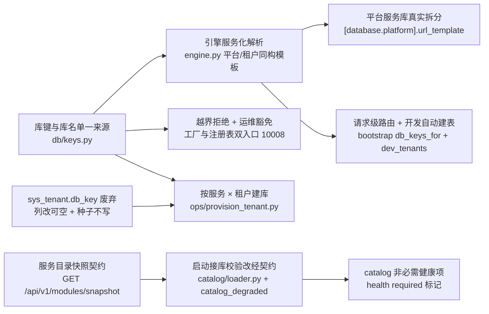

# 每服务每租户建库与路由实施记录

> 后端基座与服务化地基 · 06_数据拓扑升级 · 子任务 01 · 实施记录

## 1. 实施信息 

| 项 | 值 |
| --- | --- |
| 任务 | [01 每服务每租户建库与路由](../06_数据拓扑升级_01_每服务每租户建库与路由.md) |
| 对应需求 | [06-1](../../../../需求/06_需求_数据拓扑升级.md#r06-1) |
| 详细设计 | [01_详细设计_01_每服务每租户建库与路由](../设计/01_详细设计_01_每服务每租户建库与路由.md) |
| 实施日期 | 2026-09-23 |
| 实施人 | minjian |
| 实施环境 | 开发机（Ubuntu，Python 3.14 / uv）；SQLite 开发库（多文件服务化模板） |
| 提交 | 代码与文档分开提交（`feat(06_01)` / `docs(06_01)`） |
| 结论 | 已完成（含承接 06_03 遗留 2；三库真库建库迁移演练归 06_02） |

## 2. 实施概览 

结果小结：库键 / 库名收归单一来源并实现相对键与全限定键双形态；平台服务库按服务真实拆分（各服务连自身 `bms_{service}`）；越界拒绝在工厂与注册表双入口生效（10008）且运维侧显式豁免；`ops/provision_tenant.py` 按「服务 × 租户」幂等建库；启动接库校验改经服务目录快照（platform 本地权威 / 其余契约 + 降级）；`sys_tenant.db_key` 废弃。后端 1166 用例通过（36 跳过）、`pyright` 0 错误、`ruff` 干净、覆盖率 96%（门槛 70%）、预检全绿、边界护栏（含 `--self-test`）通过。

## 3. 实施过程 

1. **库键与库名单一来源**：新增 `libs/bms_core/src/bms_core/db/keys.py`——库类别常量（`PLATFORM_SERVICE_KEY` / `PLATFORM_DB_KEY` / `PLATFORM_DB_KEY_PREFIX` / `TENANT_DB_KEY_PREFIX` / `ARCHIVE_DB_KEY` / `ARCHIVE_DATABASE`）、`DbKey`（`raw` / `kind` / `service` / `tenant_code` / `is_qualified`）、派生（`build_platform_db_key` / `build_tenant_db_key`）、反解（`parse_db_key`——**`tenant_` 后首段命中 `known_service_keys()` 即按全限定键解，否则整体为租户编码**；已知服务集懒导入避免 `db ← services` 导入期耦合）、库名（`platform_database_name` / `tenant_database_name` / `database_name`，形态与 `db/admin.py` 同口径校验）、归属校验（`resolve_db_key`：全限定键越界抛 `DataOwnershipError` 10008、服务标识未登记抛 `ConfigError`、`allow_cross_service` 运维豁免）。`db/tenant.py` 与 `db/engine.py` 改为 re-export（导入面不变）。
2. **引擎服务化解析**：`EngineFactory.__init__(settings, *, allow_cross_service=False)` + 公共 `validate_key`；`_target` → `_resolve`（先校验后按库类别取目标）；`_target_url` 平台与租户**同构**解析（平台 `{service}` / `{database}` = `bms_{service}`；租户 `{service}` / `{tenant}` / `{database}` = `bms_{service}_{tenant}`；空模板回落 `url`；模板占位需要服务标识而缺失时 `ConfigError` 并提示改用全限定键）。`_resolve_url_role` / `replicas` / `drop` 改为按 `DbKey` 取键。
3. **越界拒绝与运维豁免**：`EngineRegistry.get` / `get_sync` / `is_sync_only` 入口经 `factory.validate_key` 校验（与工厂同源）；`_db_kind` 助手把「常驻键判定」由「等于 `PLATFORM_DB_KEY`」改为「库类别为 `tenant`」（平台类键不参与 LRU / 闲置回收，`release` 对平台类键直接返回）；`ops` 各脚本构造工厂时置 `allow_cross_service=True`（建库 / 批量迁移 / 目录与表归属种子），`alembic/env.py` 在 `-x db_key=` 出现时同样开启。
4. **配置与开发自动建表**：`DatabaseTargetSettings.url_template` 语义扩为「平台与租户通用」；新增 `[tenant].dev_tenants`（缺省 `["demo"]`）；`config.toml` 补平台模板注释与 `dev_tenants`；`config.dev.toml` 启用每服务每租户模板（平台 `sqlite+aiosqlite:///./bms_{service}.db`、租户 `sqlite+aiosqlite:///./bms_{service}_{tenant}.db`）与 `dev_tenants = ["demo", "acme"]`；`db/bootstrap.py` 删伪键 `DEFAULT_TENANT_DB_KEY`（`tenants`），新增 `db_keys_for(chain, settings)`（平台链本服务平台库、归档链 `archive`、租户链逐 `dev_tenants`），仍按 URL 去重保证空模板时的既有单库行为。
5. **测试环境隔离**：dev 默认启用模板后，各测试包 `isolate_settings` 夹具（清 `BMS_` 环境变量）之后**固定置空** `BMS_DATABASE__{PLATFORM,TENANTS}__URL_TEMPLATE`，使用例显式指定的临时库 URL 不被模板覆盖；`test_config.py` 两条最小配置用例补清模板环境变量。
6. **按服务 × 租户建库**：新增 `ops/provision_tenant.py`——服务集取 `enabled_service_keys()`（服务目录 `service_key` 非空且 `status=enabled`，当前 9 个）或 `--service`（须已登记）；平台服务库 + 服务租户库矩阵；租户维度 `--code` / `--all-tenants`（读租户注册库 `platform_tenant`）；`--skip-platform` / `--skip-tenants` / `--dry-run`；经 `db/admin.py::resolve_target` + `create_database` 幂等建库（不做迁移）；`services/module_registry.py` 新增 `enabled_service_keys`。
7. **启动接库校验改经契约（承接 06_03 遗留 2）**：`platform` 服务新增 `GET /api/v1/modules/snapshot`（全量清单，注册先于 `/modules/{service_key}` 以免被明细路由吞掉）；新增 `bms_core/catalog/loader.py`（`is_catalog_authority` + `load_catalog_snapshot`：目录权威本地经 `ModuleRepository` 读本服务平台库、读失败抛 `CatalogError`；其余服务经 `service_client` 调快照契约）；`application.py::_validate_service_catalog` 改用该编排并**降级放行**（非权威契约不可达 → WARNING + `app.state.catalog_degraded = True`，`app.state.catalog_degraded` 初始化于装配）；健康域新增检查项 `required` 标记（`aggregate` 只按必需项判整体就绪）+ `CatalogHealthCheck`（`required=False`，懒导入取数编排避免能力域导入期耦合）并登记进 `HealthCheckRegistryFactory`。
8. **`sys_tenant.db_key` 废弃**：表文件 `sys_tenant.md` 先行（`db_key` 改可空 + 废弃说明 + 归属库 / ORM 栏更正 + 变更记录 v4）→ 模型 `bms_tenant/models/tenant.py::SysTenant.db_key` 改 `Mapped[str | None]`（注明废弃）→ 平台链迁移 `0005_sys_tenant_db_key_nullable`（`batch_alter_table` 改可空，SQLite 兼容；降级路径先回填空串）→ 种子 `ops/seed_tenant.py` 不再写该列、`ops/migrate_tenants.py` 不再读该列（只取编码）。
9. **运维脚本适配**：`ops/seed_tenant.py::resolve_url(url, *, service=TENANT_SERVICE_KEY)` 与 `ops/seed_module.py`（`service=PLATFORM_SERVICE_KEY`）按**归属服务的平台库键**解析；`ops/migrate_tenants.py` 新增 `--service`、平台链按 `platform_{service}` 取库、租户链由编码派生 `tenant_{service}_{code}`、`_tenant_records` 只取编码；`ops/init_tenant.py` 新增 `--service` 并按全限定键解析（单服务单租户语义不变）。
10. **契约与用例**：导出公开契约快照（含快照接口）；新增用例 `tests/db/test_keys.py`（键形态 / 反解 / 库名 / 归属 / 运维豁免 / 模板解析）、`tests/ops/test_provision_tenant.py`（服务集 / 矩阵 / 幂等 / 干跑 / 租户来源）、`tests/health/test_catalog_check.py`（非必需项）；扩展 `tests/db/test_tenant_routing.py`（平台拆分 + 边界 + 常驻判定）、`tests/alembic/test_auto_create_tables.py`（服务化模板逐库建表）、`tests/core/test_service_catalog_startup.py`（契约桩 + 降级放行）；适配既有用例（链 head 号、健康检查项枚举、`db_keys_for` 断言、`migrate_tenants` 单链 head）。

## 4. 问题与处置 

| 问题 | 原因 | 处置 |
| --- | --- | --- |
| dev 默认启用连接串模板后 **80 条用例失败** | 各测试包 `isolate_settings` 夹具清空 `BMS_` 环境变量，模板只能从 `config.dev.toml` 读到 → 用例显式指定的临时库 URL 被模板覆盖 | 夹具在清空后**固定置空** `BMS_DATABASE__{PLATFORM,TENANTS}__URL_TEMPLATE`（模板行为由专门用例经环境变量显式开启验证）；两条最小配置用例补清该环境变量（否则不完整的库目标会触发校验失败） |
| 根级 `backend/conftest.py` 隔离无效 | 夹具在每个用例内清空 `BMS_` 环境变量，根级 `setdefault` 被覆盖 | 删除根级 `conftest.py`，改由各测试包夹具承担（与既有「按包隔离配置」形态一致） |
| `tenant_{service}_{code}` 反解歧义（服务段与租户编码均可能含 `_`） | 键形态由决策固定为下划线分隔 | 定案「`tenant_` 后**首段命中已知服务标识**（`known_service_keys()`）即按全限定键解，否则整体为编码」；含下划线的租户编码（如 `acme_corp`）在首段非服务标识时仍作相对键正确处理（用例覆盖） |
| 启动接库校验改经契约后，非权威服务在 dev / 测试（`service_client` 为 null 占位或目标服务未启动）必然不可达 | 06_01 决策：统一经契约 + 降级放行 | 落地降级：WARNING 放行 + `catalog_degraded` + `/readyz` `catalog` 非必需项；`platform` 自身为目录权威，走本地直读（读失败仍拒启，03_02 原语义与用例保留） |
| 健康聚合无「非必需项」概念 | 基座 `aggregate` 按 `all(结果 ok)` 判整体 | 检查项契约新增 `required: bool = True`，`aggregate` 只按必需项判 `ok`（响应形态 `{name, ok, error}` 不变）；`catalog` 为 `required=False` |
| `sys_tenant.db_key` 为 `NOT NULL`，「不写」无法落库 | 决策为「废弃不写」 | 列改**可空**（表文件 + 模型 + 平台链迁移 0005 三处同步）；存量取值保留不再消费；物理删列另立任务 |
| 平台链迁移编号与 06_03 设计的 `0005_sys_table_ownership` 撞车 | 06_03 规划未创建 | 本任务用 `0005_sys_tenant_db_key_nullable`，06_03 的归属登记表迁移**顺延为 0006**（回写 06_03 设计） |
| 归属迁移/新增基座类未登记导致 `check-backend-base` 拦截 | 06_03 第一轮与 06_01 新增类未回写《后端基类清单》 | 清单补充 `DbKey`（本任务）与 06_03 遗留的 `TableOwnershipRegistry` / `TableRecord` / `TenantSnapshot` / `LocalTenantSource` / `RemoteTenantSource` / `TenantRegistryRepository`；并更新 `EngineFactory` / `EngineRegistry` / `bootstrap` / 健康检查项 / 目录快照出口 / 建库入口条目 |

## 5. 验证结果 

| 门禁 | 命令 | 结果 |
| --- | --- | --- |
| 后端全量用例 | `cd backend && uv run pytest -q` | 通过（1166 passed / 36 skipped） |
| 覆盖率（CI 口径） | `uv run pytest --cov=bms_core … --cov-branch --cov-report=term` | 通过（TOTAL 96%，门槛 70%；`db/keys.py` / `catalog/loader.py` / `health/base.py` 新增模块 100%） |
| 类型检查 | `uv run pyright` | 通过（0 errors） |
| 静态检查与格式 | `uv run ruff check .` / `uv run ruff format --check .` | 通过 |
| 边界护栏（含自检） | `python3 scripts/tools/base-check/check-service-boundaries.py [--self-test]` | 通过 |
| 基座校验（含继承链 / 清单对账 / 迁移链） | `python3 scripts/tools/base-check/check-backend-base.py` | 通过（113 个基座类均登记 / 8 个 revision） |
| 预检（本地快速） | `python3 scripts/tools/preflight/check-preflight.py --fast` | 全部通过（含文档基座 / 网关 / 契约 / 事件契约零漂移） |
| 契约快照一致 | `uv run python -m ops.contract_snapshot export` 后 `check` | 通过（9 个启用服务快照与公开契约一致，含快照接口） |
| Kiwi 用例登记 | 平台回读 | 新增 **Kiwi 2177**（一任务一条；先登记后编码） |

## 6. 偏差与遗留 

- **偏差（已登记）**：
  1. **开发库自动建表的表集仍是「按链元数据」**（各服务库含该链全量表），未按归属登记派生：表集派生与迁移链分链同源切换，归 **06_03 收口**（设计 §4.4 / 第 8 节已登记）。
  2. **`catalog/base.py` 响应解析分支覆盖率偏低**（60%）：属 06_03 已交付客户端，本任务只消费；补充用例归 06_03 收口或 09_03 契约门禁。
  3. **`config.dev.toml` 启用模板后开发库文件名变化**（租户库由 `bms_tenant_demo.db` 变为 `bms_{service}_{tenant}.db`，如 `bms_platform_demo.db`）：需按 `ops/provision_tenant.py` 建库 + 迁移 + 种子重建开发库；属决策 06_03-14 的预期影响，已在 `config.dev.toml` 注释写明操作顺序。
  4. **`sys_tenant.db_key` 真库列注释**（迁移不写注释）与模型注释存在表述差异，随下次列变更迁移同步；SQLite 无注释语义，不影响零漂移断言。
- **遗留（本轮未实施，按设计归口）**：
  1. 三库真库**按服务建库 → 迁移 → 校验 → 清理**演练与按服务连接预算、库数量可观测 → **06_02**。
  2. 迁移链按服务分链（链名 `{service}:{datasource}`、版本目录归位、表集由归属登记派生、移除过渡豁免）与 `SysModule` / `SysModuleI18n` 迁出 → **06_03 收口**。
  3. 网关真实 `X-Tenant-Id` 注入与 `GET /api/v1/modules/snapshot` 的真实鉴权（服务身份 JWT）→ **07_03**。
  4. `catalog` 健康项与 `catalog_degraded` 状态的指标化 / 告警联动 → **08_01 / 08_02**。
  5. 字典 / 查询方案的真实数据与缓存实现迁出 → **阶段八**。
  6. `sys_tenant.db_key` **物理删列** → 后续数据库治理任务（另立）。
- **开放项**：`allow_cross_service` 运维通道的长期形态（现为工厂开关；若后续设「运维专用建库 / 读接口」届时收窄）；达梦下平台 / 租户模板的库名与模式组合 → 06_02 真库演练复核。

> 依《文档生成规范》编写 · 与《测试记录》配套
