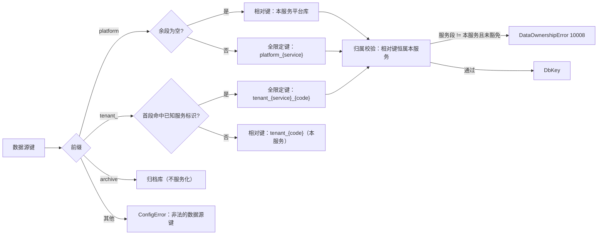
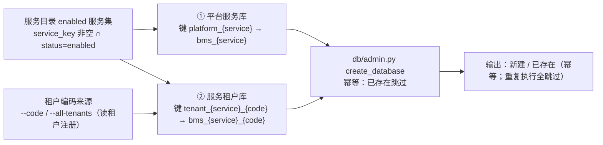

# 每服务每租户建库与路由详细设计

> 后端基座与服务化地基 · 06_数据拓扑升级 · 子任务 01 · 详细设计

[文档首页](../../../../../../文档首页.md) › [01 每服务每租户建库与路由](../06_数据拓扑升级_01_每服务每租户建库与路由.md) › 详细设计　|　[父任务：数据拓扑升级](../../06_数据拓扑升级.md) · [本阶段需求](../../../../需求/06_需求_数据拓扑升级.md) · [排期计划](../../../../计划/01_计划_后端基座与服务化地基.md)

## 1. 概述 <a id="overview"></a>

- **目标**：把数据拓扑由「平台库 + 租户库」升级为 **每服务独立库 × 每租户**——库命名（平台服务库 `bms_{service}` / 服务租户库 `bms_{service}_{tenant}`）成为**单一来源**并按 `{database}` 占位解析；数据源键服务化为 `platform_{service}` / `tenant_{service}_{code}`（派生与反解）；租户开通按「服务 × 租户」建库；平台服务库**真实拆分**（各服务只连自身 `bms_{service}`）＋租户上下文路由；**禁止访问他服务数据库**（越界即拒，数据所有权 10008）。同时补齐 06_03 遗留 2（服务目录快照只读契约 + 启动接库校验改经契约 + `catalog` 非必需健康项），使拆分后非 `platform` 服务不再依赖共享平台库直读。
- **依据**：《[架构设计 · 数据架构](../../../../../../设计/架构设计/07_架构设计_数据架构.md)》「数据分布」节；《[架构设计 · 多租户路由](../../../../../../设计/架构设计/12_架构设计_子系统_多租户路由.md)》「引擎注册表与生命周期」「三库命名与建库标准」节；《[微服务演进规划](../../../../../../规划/微服务演进规划.md)》「服务化地基要求与门禁」（S1 / S2）；《[后端开发规范](../../../../../../规范/后端开发规范.md)》「模块边界与数据所有权」节；《[数据库开发规范](../../../../../../规范/数据库开发规范.md)》「迁移与建表口径」节；需求 [06-1](../../../../需求/06_需求_数据拓扑升级.md#r06-1)；前置任务 [06_03 详细设计](../../06_数据拓扑升级_03_平台层表归属与按服务拆分/设计/01_详细设计_03_平台层表归属与按服务拆分.md)、[01_02 详细设计](../../../01_后端基座真实实现/01_后端基座真实实现_02_多租户数据拓扑落库与实测/设计/01_详细设计_02_多租户数据拓扑落库与实测.md)。
- **范围（本任务）**：
  1. **库键与库名单一来源**：新增 `bms_core/db/keys.py`（键形态常量、`DbKey` 解析、库名派生、归属校验）；平台目标与服务租户目标均按 `{database}` 占位解析。
  2. **键服务化**：`platform_{service}` / `tenant_{service}_{code}` 派生与反解；**相对键**（`platform` / `tenant_{code}`）与**全限定键**并存（缺省补当前服务）。
  3. **越界拒绝**：`EngineFactory` 与 `EngineRegistry` 双入口校验全限定键的服务段，越界抛 `DataOwnershipError`（10008）；`ops` 运维侧经显式豁免跨服务取键。
  4. **平台服务库真实拆分**：`[database.platform].url_template` 生效后各服务连自身 `bms_{service}`；租户上下文路由按服务派生租户库键。
  5. **按服务建库**：新增 `ops/provision_tenant.py`（服务 × 租户幂等建库；平台服务库 + 各服务租户库）。
  6. **启动接库校验改经契约（06_03 遗留 2）**：`platform` 服务新增 `GET /api/v1/modules/snapshot`；其余服务经 `service_client` 取快照，不可达降级放行 + `/readyz` `catalog` 非必需项。
  7. **`sys_tenant.db_key` 废弃**：列改可空且不再写入，库键一律由 `tenant_{code}`（本服务相对键）派生。
- **不含（明确归口，见第 8 节）**：迁移链按服务分链（`{service}:{datasource}`）与 `SysModule` 迁出（**06_03 收口**）；遍历「服务 × 租户」的批量迁移编排与幂等、按服务连接预算、库数量可观测、三库真库建库迁移演练（**06_02**）；网关真实 `X-Tenant-Id` 注入与内部接口真实鉴权（**07_03**）；字典 / 查询方案的真实数据与缓存实现迁出（**阶段八**）；自动建表与迁移版本号衔接机制（**01_04 后续**）。

## 2. 现状与差距 <a id="gap"></a>

| 关注点 | 现状 | 差距（本任务目标） |
| --- | --- | --- |
| 库命名 | `bms_{service}_{tenant}` 硬写在 `db/engine.py` 的模板格式化处；平台库无命名派生 | 库名派生收归 `db/keys.py` 单一来源；平台目标亦按 `{database}` = `bms_{service}` 解析 |
| 数据源键 | 平台键 `platform` 单键（唯一平台库）；租户键 `tenant_{code}`（无服务段）；`_target` 三分支无合法性校验 | `platform_{service}` / `tenant_{service}_{code}` 派生与反解；键合法性校验与越界拒绝 |
| 库名解析 | 仅 `tenant_` 前缀走 `url_template`；`platform_` 前缀不存在 | 平台 / 租户目标同构解析（`{service}` / `{tenant}` / `{database}`）；归档库保持单目标 |
| 引擎入口 | `EngineFactory._target` / `EngineRegistry.get` 无归属校验 | 双入口校验服务段归属；越界抛 10008；`ops` 显式豁免 |
| 平台服务库 | 全部服务连同一平台库（`[database.platform].url` 单库），`[database.platform].url_template` 形同虚设 | `[database.platform].url_template` 生效 → 各服务连 `bms_{service}`；空模板回落单库（基础默认不变） |
| 按服务建库 | `ops/init_tenant.py` 只建一个租户库（`tenant_{code}`），无服务维度 | 新增 `ops/provision_tenant.py`：服务 × 租户幂等建库（平台服务库 + 服务租户库） |
| 启动接库校验 | `_validate_service_catalog` 直读本进程平台库 `sys_module` | platform 服务本地读自身平台库（权威）；其余服务经 `service_client` 取快照，不可达降级放行 |
| 服务目录快照接口 | 不存在（`bms_core/catalog/base.py` 客户端已就位，提供方接口缺失） | `platform` 服务 `GET /api/v1/modules/snapshot`（全量、不分页） |
| 健康聚合 | `HealthCheckReport.ok = all(各结果 ok)`，无「非必需项」概念 | 检查项新增 `required` 标记；非必需项失败不参与整体就绪判定 |
| `sys_tenant.db_key` | `VARCHAR(64) NOT NULL`，语义「数据源键 `tenant_{code}`」，种子写入、批量迁移读取 | 列改可空、不再写入（废弃）；库键一律由 `tenant_{code}`（本服务相对键）派生 |
| 开发自动建表 | 按链取键：平台链 → `platform`；租户链 → 伪键 `tenants`（恒取 `tenants.url` 单库） | 按链取键服务化：平台链 → 本服务平台库；租户链 → `[tenant].dev_tenants` 逐租户相对键；伪键 `tenants` 删除 |

## 3. 交付物清单 <a id="tree"></a>

```text
backend/
├── libs/bms_core/src/bms_core/
│   ├── db/
│   │   ├── keys.py                                # 新增：库键与库名单一来源（常数 / DbKey / 派生 / 反解 / 归属校验）
│   │   ├── engine.py                              # 改：_target/_target_url 服务化；validate_key；allow_cross_service
│   │   ├── registry.py                            # 改：get/get_sync/is_sync_only 入口校验；常驻键判定按库类别
│   │   ├── tenant.py                              # 改：键助手改为 re-export；docstring 口径更新
│   │   ├── bootstrap.py                           # 改：链 → 键集合服务化（删伪键 tenants；租户链按 dev_tenants）
│   │   ├── migration.py                           # 改：chain_url 键参数对全链生效 + 运维豁免（分链归 06_03）
│   │   └── session.py                             # 改：docstring 口径更新（路由逻辑不变）
│   ├── catalog/
│   │   └── base.py                                # 改：补「快照取数编排」说明（客户端主体 06_03 已交付）
│   ├── health/
│   │   ├── base.py                                # 改：检查项新增 required 标记；aggregate 只按必需项判就绪
│   │   ├── checks.py                              # 改：新增 CatalogHealthCheck（catalog，非必需）
│   │   └── registry.py                            # 改：登记 CatalogHealthCheck
│   ├── application.py                             # 改：接库校验分支（platform 本地权威 / 其余契约）+ 降级 + catalog_degraded
│   └── core/config.py                             # 改：TenantSettings.dev_tenants；url_template 语义扩为平台 / 租户通用
├── services/platform/src/bms_platform/
│   └── api/modules.py                             # 改：新增 GET /modules/snapshot（全量清单，不分页）
├── services/tenant/src/bms_tenant/
│   └── models/tenant.py                           # 改：db_key 改可空 + 注释标注废弃
├── ops/
│   ├── provision_tenant.py                        # 新增：按「服务 × 租户」幂等建库（平台服务库 + 服务租户库）
│   ├── seed_tenant.py                             # 改：不再写入 db_key（废弃）
│   ├── migrate_tenants.py                         # 改：不再读 db_key；按服务键取数 + 运维豁免
│   └── init_tenant.py                             # 改：单服务单租户语义显式化（相对键，运维豁免）
├── alembic/versions/platform/
│   └── 0005_sys_tenant_db_key_nullable.py         # 新增：sys_tenant.db_key 改可空（废弃）
├── config.toml                                    # 改：platform.url_template 注释；[tenant].dev_tenants；url_template 口径说明
├── config.dev.toml                                # 改：启用每服务每租户模板 + dev_tenants（demo / acme）
└── config.prod.toml                               # 改：确认 platform / tenants 模板占位口径注释（不启用默认值）
bms文档/
├── 设计/架构设计/12_架构设计_子系统_多租户路由.md      # 回写：库键服务化与越界拒绝口径
├── 设计/架构设计/07_架构设计_数据架构.md              # 回写：每服务库命名与建库入口口径
├── 设计/数据库设计/数据表设计/sys_tenant.md           # 回写：db_key 废弃（可空）+ 归属库 / ORM 栏更正 + 变更记录
├── 设计/数据库设计/01_数据库设计_总览.md              # 回写：sys_tenant 登记行（归属库 / 状态）
├── 后端基类清单.md                                  # 回写：db/keys.py、CatalogHealthCheck、provision_tenant 等
├── 规范/数据库开发规范.md                            # 视需要回写：库键与库名派生口径（§ 迁移与建表口径）
└── 项目/.../任务/03_服务目录与契约登记/*              # 回写：启动接库校验取数路径变更 + 用例适配登记（03_02）
```

## 4. 领域设计 <a id="design"></a>

### 4.1 库键与库名单一来源 <a id="keys"></a>

新增 `bms_core/db/keys.py`，作为**库键形态**与**库名派生**的唯一事实源：

| 成员 | 说明 |
| --- | --- |
| `PLATFORM_DB_KEY = "platform"` | 平台库**相对键**（本服务平台库；`db/engine.py` re-export 保持导入面不变） |
| `PLATFORM_DB_KEY_PREFIX = "platform_"` | 平台库**全限定键**前缀 |
| `TENANT_DB_KEY_PREFIX = "tenant_"` | 租户库键前缀（相对 / 全限定共用前缀） |
| `ARCHIVE_DB_KEY = "archive"` | 归档库键（不服务化，架构定 `bms_archive` 统一收存） |
| `ARCHIVE_DATABASE = "bms_archive"` | 归档库名 |
| `DbKey`（frozen dataclass） | `raw` / `kind`（`platform` / `tenant` / `archive`）/ `service`（全限定键服务段，相对键为 `None`）/ `tenant_code` |
| `build_platform_db_key(service=None)` | 平台库键：`None` → `platform`（相对）；否则 `platform_{service}` |
| `build_tenant_db_key(code, *, service=None)` | 租户库键：`None` → `tenant_{code}`（相对）；否则 `tenant_{service}_{code}` |
| `parse_db_key(db_key)` | 语法解析（不做归属校验）；非法形态抛 `ConfigError` |
| `platform_database_name(service)` | `bms_{service}` |
| `tenant_database_name(service, code)` | `bms_{service}_{code}` |
| `database_name(key, *, service)` | 按库类别取库名（相对键用传入的当前服务补全） |
| `resolve_db_key(db_key, *, service, allow_cross_service=False)` | 解析 + **归属校验**；越界抛 `DataOwnershipError`（10008） |

**键形态与判定次序**（相对键优先判定，全限定键显式跨服务）：



- **反解歧义消解**：`tenant_` 之后按 `_` 切分，**首段命中 `known_service_keys()`（06_03 归属登记导出，含服务目录标签 ∪ 预留服务标识）即视为全限定键**（服务段 = 首段，其余为租户编码）；否则整体为租户编码（相对键）。服务标识与租户编码因此不得以「对方形态」混淆——服务标识集有限且已登记，判定确定可复现。
- **兼容**：`db/tenant.py` 的 `TENANT_DB_KEY_PREFIX` / `build_tenant_db_key` / `parse_tenant_db_key` 改为自 `db/keys.py` 导入（**re-export，公共契约名不变**）；存量 `build_tenant_db_key(code)` 调用点（`tenant_registry` / `tenant/null` / `tenant/base` / `ops/seed_tenant` / `ops/migrate_tenants` / `ops/init_tenant`）零改动即产出相对键，随运行服务自动服务化。`parse_tenant_db_key(db_key) -> str` 语义扩为「反解租户编码（全限定键剥离服务段）」。
- **库名单一来源**：`EngineFactory._target_url` 的 `{database}` 占位改由 `database_name(...)` 产出（平台 `bms_{service}` / 租户 `bms_{service}_{code}`），`ops/provision_tenant.py` 与 `ops/db_admin.py` 建库目标同源（前者经键 + 模板解析，后者取连接串内库名，二者以模板为桥）。

### 4.2 越界拒绝与运维豁免 <a id="guard"></a>

- **归属校验**：`EngineFactory.validate_key(db_key) -> DbKey` 内部调 `resolve_db_key(db_key, service=self._settings.app.service, allow_cross_service=self._allow_cross_service)`。
- **双入口**：工厂侧 `create` / `create_sync` / `resolve_url` / `resolved_url` 与注册表侧 `get` / `get_sync` / `is_sync_only` 均先校验（注册表经 `factory.validate_key`，与工厂**同源判定**，不复制规则）。
- **越界语义**：全限定键服务段 ≠ 本服务且未豁免 → `DataOwnershipError`（10008 / 500），消息含目标键、键内服务与当前服务；**相对键恒属本服务**，不触发越界。
- **运维豁免**：`EngineFactory(settings, *, allow_cross_service=False)`；`ops` 运维脚本（建库 / 批量迁移 / 目录种子 / 表归属种子）构造工厂时显式置 `True`，并在 CLI `--help` 与实施记录中登记为**运维专用通道**（运行期服务不得使用）。豁免只放宽「服务段归属」，不放宽键形态合法性（非法键仍 `ConfigError`）。
- **与既有边界守卫分工**：`boundary` 能力域守卫（05_02 / 06_03）判**表级**跨服务访问；本校验判**库级**跨服务取引擎，二者同属数据所有权（同一错误码 10008），库级在「取引擎入口」、表级在「运行期 SQL / 静态扫描」，互补不重复。
- **静态护栏**：`check-service-boundaries.py` 规则 6 已收窄为表级归属，本任务不改；新增用例覆盖「越界键被拒 / 相对键放行 / 运维豁免放行」。

### 4.3 引擎工厂与注册表：服务化解析 <a id="engine"></a>

`db/engine.py`：

- `__init__(settings=None, *, allow_cross_service=False)`；新增 `validate_key(db_key)`（公共校验入口，注册表复用）。
- `_target(db_key)` → `_target_and_key(db_key) -> tuple[DbKey, DatabaseTargetSettings]`：按 `kind` 映射目标（platform → `database.platform`；tenant → `database.tenants`；archive → `database.archive`），**先校验后取目标**。
- `_target_url(key, target)`：
  - `archive` → `target.url`（不参与模板）；
  - `platform` → `url_template` 非空时 `format(service=<生效服务>, database=bms_{service})`；空模板回落 `target.url`（单平台库，基础默认不变）；
  - `tenant` → `url_template` 非空时 `format(service=<生效服务>, tenant=<编码>, database=bms_{service}_{编码})`；空模板回落 `target.url`；
  - **生效服务** = 全限定键的服务段；相对键取 `[app].service`。
- `resolve_url` / `resolved_url` / `replicas` / `_resolve_url_role` / `_engine_kwargs` 口径不变（仅取目标改为「校验 + 解析」组合）。

`db/registry.py`：

- `get` / `get_sync` / `is_sync_only` 首行 `self._factory.validate_key(db_key)`（越界快速失败）。
- **常驻判定服务化**：`_tenant_keys()` / `_sync_keys` 记账口径由「不等于 `PLATFORM_DB_KEY`」改为「库类别为 `tenant`」（`parse_db_key(...).kind == "tenant"`），使跨服务取到的平台库键（运维场景，如 `platform_org`）不参与租户 LRU / 闲置回收；`release(db_key)` 对**平台类键**直接返回（原 `== PLATFORM_DB_KEY` 判定同义替换）。
- 连接预算与 LRU / 清扫逻辑不变。

### 4.4 请求级路由与开发库自动建表 <a id="session"></a>

- **请求级路由逻辑零改动**：`db/session.py` 的 `_resolve_db_key`（取租户上下文 `db_key`，缺省回落 `PLATFORM_DB_KEY`）与 `get_platform_read_db`（强制平台库只读）在双形态下**语义自动服务化**——相对键按当前服务解析，即「本服务平台库」/「本服务的该租户库」。仅更新 docstring 口径。
- **`db/bootstrap.py`**：
  - 删除伪键 `DEFAULT_TENANT_DB_KEY = "tenants"`（既非合法键形态，也无实际语义）；
  - `db_key_for(chain)` → `db_keys_for(chain, settings) -> list[str]`：
    - `platform` → `[PLATFORM_DB_KEY]`（相对键 → 本服务平台库，随服务化自动拆分）；
    - `archive` → `[ARCHIVE_DB_KEY]`；
    - `tenant` → `[build_tenant_db_key(code) for code in settings.tenant.dev_tenants]`（本服务 × 开发租户集）。
  - `ensure_development_schema` 遍历各链的键集合，按 `seen_urls` 去重后 `create_all(checkfirst=True)`；**表集口径保持按链元数据**（表集由归属登记派生与分链同源切换，归 06_03 收口，见第 8 节）——故开发环境下各服务库均含该链全量表（**开发便利**；数据所有权以运行期守卫与静态校验为准）。空模板时多个租户键解析到同一 `tenants.url`，去重后行为与既有单库一致。
- **`[tenant].dev_tenants`**：`list[str]`，缺省 `["demo"]`；`config.dev.toml` 置 `["demo", "acme"]`（与 `ops/seed_tenant.py` 种子一致）。仅 `auto_create=true` 且方言为 SQLite 时生效。

### 4.5 配置扩展 <a id="config"></a>

| 字段 | 位置 | 默认 | 说明 |
| --- | --- | --- | --- |
| `url_template` | `DatabaseTargetSettings`（既有字段，语义扩展） | `""` | **平台目标**：占位 `{service}` / `{database}`（= `bms_{service}`）；**租户目标**：占位 `{service}` / `{tenant}` / `{database}`；空串回落 `url` 单库 |
| `dev_tenants` | `TenantSettings`（新增） | `["demo"]` | 开发库自动建表覆盖的租户编码（仅 SQLite `auto_create` 生效） |

- `config.toml`：`[database.platform]` 补 `url_template` 注释示例（`sqlite+aiosqlite:///./bms_{service}.db`、`mysql+aiomysql://bms_dev@<host>:3306/{database}`）；`[database.tenants].url_template` 注释补 `{database}` = `bms_{service}_{tenant}`；新增 `[tenant].dev_tenants`。
- `config.dev.toml`：启用每服务每租户模板（06_03 决策 14）——
  - `[database.platform] url_template = "sqlite+aiosqlite:///./bms_{service}.db"`
  - `[database.tenants] url_template = "sqlite+aiosqlite:///./bms_{service}_{tenant}.db"`
  - `[tenant] dev_tenants = ["demo", "acme"]`
- `config.prod.toml` / `config.test.toml`：不启用模板（基础默认不变）；`config.test.toml` 保持独立 SQLite 目标以免影响用例夹具。
- 环境变量键：`BMS_DATABASE__PLATFORM__URL_TEMPLATE`、`BMS_TENANT__DEV_TENANTS`。

### 4.6 按服务建库入口 <a id="provision"></a>

新增 `ops/provision_tenant.py`（**建库幂等，不做迁移**——批量迁移与连接预算归 06_02）：



- **服务集**：`SERVICE_CATALOG` 中 `service_key` 非空且 `status = enabled`（当前 9 个：`platform` / `identity` / `tenant` / `org` / `file` / `notification` / `search` / `ai` / `report`）；`planned`（`workflow`）与无 `service_key` 的产品模块跳过。
- **租户集**：`--code`（可重复）显式指定；或 `--all-tenants` 从**租户注册库**（`platform_tenant` 键 → `bms_tenant`）读 `status=active` 且未软删的编码（要求租户注册库已建库 + 迁移 + 种子，否则提示先执行）；缺省要求二者之一。
- **参数**：`--code`（多值）/ `--all-tenants` / `--service`（多值，缺省全部启用服务）/ `--admin-url` / `--schema`（达梦）/ `--skip-platform` / `--dry-run`。
- **取键与豁免**：经 `EngineFactory(settings, allow_cross_service=True)` + `resolved_url(build_platform_db_key(service))` / `resolved_url(build_tenant_db_key(code, service=service))` 解析连接串，`db/admin.py::resolve_target` + `create_database` 建库（MySQL `CREATE DATABASE` / PG `CREATE DATABASE` / DM `CREATE SCHEMA` / SQLite 建文件；**幂等**）。
- **后置提示**：输出下一跳命令（迁移编排见 06_02；当前可先用 `alembic -n alembic:<链> -x db_key=<键> upgrade head` 单库执行）。
- `ops/init_tenant.py` **保留原语义**（单服务单租户：按本服务相对键建一个租户库 + 迁移 + 字典种子），仅在报错提示中指向 `provision_tenant.py` 用于多服务批量。

### 4.7 启动接库校验改经契约（06_03 遗留 2） <a id="startup"></a>

- **提供方接口**：`platform` 服务 `GET /api/v1/modules/snapshot`——全量清单（不分页），响应 `ApiResponse.ok([ModuleResponse, ...])`，字段与 `sys_module` 登记一致（供 `validate_catalog` 对账）；路径常量沿用 `bms_core/catalog/base.py::CATALOG_SNAPSHOT_PATH`（06_03 已交付客户端）。
- **取数编排**（`application.py`）：

| 运行服务 | 取数路径 | 失败处置 |
| --- | --- | --- |
| = `platform`（`identity.name == CATALOG_SERVICE_KEY`） | 经 `ModuleRepository` **本地直读本服务平台库**（自己是目录权威，非跨服务读） | `CatalogError` **拒启**（既有语义保留；空目录仍仅告警放行） |
| ≠ `platform` | `resolve_plugin("service_client", settings.service_client.provider)` → `fetch_catalog_snapshot(client)` | `ServiceUnavailableError` → WARNING 放行 + `app.state.catalog_degraded = True` |

- **降级可观测**：`/readyz` 的 `checks` 增加 `catalog` 项（`{name:"catalog", ok:false, error:"ServiceUnavailableError"}`），**标记非必需**（不参与整体就绪判定、不产生 503）；`health/base.py` 检查项契约新增 `required: bool = True`，`aggregate` 只按必需项判 `ok`（`HealthCheckResult` 与 `/readyz` 响应形态不变）。
- **强门禁不变**：CI 侧离线校验（`ops/check_modules.py` 离线清单 + 可选接库对账）为硬门禁，不依赖运行时降级。
- **03_02 用例适配**：Kiwi 2163 的「运行服务未登记：workflow」1 条改为**注入桩快照**（monkeypatch 取数编排返回已播种记录），其余冲突拒启用例（默认 `platform` 身份）语义不变；本项按契约 / 用例变更登记并回写 03_02。

### 4.8 `sys_tenant.db_key` 废弃 <a id="deprecate"></a>

- **表结构**（先改表文件 → 模型 → 迁移）：`db_key` 由 `NOT NULL` 改为**可空**，说明改为「已废弃（06_01 起不再写入；库键由 `tenant_{service}_{code}` 派生）」；表文件同步更正「归属库」（`bms_tenant`）与「ORM 模型」（`bms_tenant/models/tenant.py::SysTenant`）两栏（06_03 迁出后未回写的存量偏差）。
- **迁移**：`alembic/versions/platform/0005_sys_tenant_db_key_nullable.py`（`op.batch_alter_table("sys_tenant")` 改 `db_key` 可空；SQLite 需批处理模式）。**06_03 规划的 `0005_sys_table_ownership` 顺延为 `0006`**（回写 06_03 设计）。
- **代码**：`bms_tenant/models/tenant.py::SysTenant.db_key` 改 `Mapped[str | None]`；`ops/seed_tenant.py` 不再写入该列（移除 `build_tenant_db_key` 导入）；`ops/migrate_tenants.py` 不再读取该列，租户键一律由 `code` 派生。
- **历史行**：存量 `db_key` 取值保留不动（**取值失真但不再被消费**）；物理删列另立任务（数据库治理），登记为遗留。

### 4.9 与相邻能力域 / 任务分工 <a id="boundary-inner"></a>

| 相邻 | 分工 |
| --- | --- |
| `06_03` 平台层表归属与按服务拆分 | 表归属登记 / 校验收窄 / 租户注册迁出已交付；本任务承接其**遗留 2**（快照契约 + 启动校验降级）；**遗留 4 分链与遗留 5 `SysModule` 迁出归 06_03 收口**（本任务只把 `chain_url` 的键参数对全链生效，为 06_02 分链批量迁移留入口） |
| `06_02` 多服务多库迁移与连接预算 | 本任务交付「键 + 库 + 建库入口」，**不含**批量迁移编排、幂等自动执行、按服务连接预算、库数量可观测、三库真库演练 |
| `01_02` 多租户数据拓扑 | 本任务按其「契约变更登记」要求扩展库键契约（`tenant_{code}` → `tenant_{service}_{code}`，与 `platform_{service}` 同构），**回写 01_02 详细设计**第 4.3 / 4.6 节 |
| `05_01` 服务契约与同步调用 | 只**消费** `service_client`（快照出口调用），不新增其契约 |
| `05_02` 数据所有权与边界硬校验 | 表级守卫不动；本任务补**库级**归属校验（同一错误码 10008） |
| `03_02` 启动与 CI 唯一性校验 | 接库校验取数路径变更（本地权威 / 契约）与 1 条用例适配回写 |
| `09_03` 契约门禁 | `GET /api/v1/modules/snapshot` 纳入契约快照与 oasdiff 基线（消费方标注见第 7 节） |
| `08_01` / `08_02` 可观测性 | `catalog` 健康项与 `catalog_degraded` 状态供探针 / 指标消费（本任务只交付状态与项） |

## 5. 失败分支与边界 <a id="failures"></a>

| 场景 | 行为 |
| --- | --- |
| 数据源键非三种形态（如 `tenants` / `foo`） | `ConfigError`（10005）快速失败；伪键 `tenants` 已从 `bootstrap` 删除 |
| `platform_` 后服务段为空（`platform_`） | `ConfigError`（键形态非法） |
| `tenant_` 后为空 / 服务段命中已知服务但编码为空（`tenant_org_`） | `ConfigError`（键形态非法） |
| 全限定键服务段非本服务且未豁免 | `DataOwnershipError`（10008 / 500）；调用方事务回滚（取引擎阶段即失败） |
| `ops` 未开豁免却跨服务取键 | 同上 10008；脚本以参数显式开启豁免并登记为运维通道 |
| `url_template` 占位非法（含未知占位 / 花括号失衡） | `ConfigError`（提示模板文本与占位清单） |
| `url_template` 为空 | 平台 / 租户目标均回落各自 `url`（单库兼容；基础默认不变） |
| 平台服务库拆分后非 platform 服务读不到 `sys_module` | 不再直读：启动接库校验经契约（不可达降级放行 + `catalog` 降级项）；CI 离线校验为硬门禁 |
| 快照契约不可达 / 响应体非法 | `ServiceUnavailableError` → 记 WARNING 放行、置 `catalog_degraded`；**platform 自身本地读失败仍拒启**（`CatalogError`） |
| `--all-tenants` 而租户注册库未就绪 | 提示先建库 + 迁移 + 种子（`provision_tenant` 不代建注册库），退出码非 0 |
| 建库目标已存在 | `create_database` 幂等跳过（不重建、不清空）；重复执行输出全为「已存在（跳过）」 |
| 达梦建库 | 以**模式**为库级隔离单位（`CREATE SCHEMA`）；`--schema` 显式传入时以该模式为目标 |
| 开发自动建表遇新增迁移 | 既有「自动建表不写 Alembic 版本号」问题不变（01_04 后续）；本任务不扩大该问题面 |
| 分链未落地时执行平台链迁移 | `alembic -n alembic:platform -x db_key=platform_<服务> upgrade head` 只作用于该服务键解析出的库；**表集仍为平台链全量表**（分链归 06_03） |

## 6. 测试设计与验收映射 <a id="tests"></a>

| 完成标准 | 测试设计 | 落点 |
| --- | --- | --- |
| 库命名与键派生 / 反解为单一来源 | 键形态常量；`build` / `parse` 往返（相对 / 全限定）；库名派生（`bms_{service}` / `bms_{service}_{code}` / `bms_archive`）；非法键 | `tests/db/test_keys.py`（新增） |
| 每服务只路由自身库（越界被拒） | 全限定键越界 → 10008；相对键放行；运维豁免放行；注册表与工厂双入口同源 | `tests/db/test_keys.py`、`tests/db/test_engine_routing.py`、`tests/db/test_engine_registry.py` |
| 平台服务库真实拆分 | `platform` 目标模板解析（`{service}` / `{database}`）；空模板回落单库；四服务同进程各取自身平台库；租户目标模板 | `tests/db/test_tenant_routing.py`、`tests/db/test_keys.py` |
| 租户隔离用例通过 | 同一租户在两服务下的库键与库名分离；上下文路由按服务派生；开发自动建表按 `dev_tenants` 逐库 | `tests/db/test_tenant_routing.py`、`tests/db/test_auto_create_tables.py` |
| 按服务建库成功且命名合规 | `provision_tenant`：服务集筛选（仅 enabled）+ 平台 / 租户库矩阵；幂等（重复执行全跳过）；`--dry-run`；`--code` / `--all-tenants` | `tests/ops/test_provision_tenant.py`（新增） |
| 启动接库校验经契约 + 降级 | platform 本地权威读（拒启语义不变）；非 platform 契约取快照成功 / 不可达降级 + `catalog_degraded`；`/readyz` `catalog` 非必需项不影响整体就绪 | `tests/core/test_service_catalog_startup.py`（适配 + 新增）、`tests/health/test_catalog_check.py`（新增） |
| 快照契约客户端 | `fetch_catalog_snapshot` 成功 / 非 2xx / 响应体非法 | `tests/core/test_catalog_contract.py`（既有，随实现补齐） |
| 健康聚合非必需项 | `required=False` 失败不影响 `report.ok`；必需项失败仍不就绪 | `tests/health/test_health_registry.py`（既有，适配 + 新增） |
| `sys_tenant.db_key` 废弃 | 模型列可空；种子不再写该列；迁移可升（SQLite 批处理）；批量迁移不再读该列 | `tests/ops/test_tenant_ops.py`、`tests/alembic/test_alembic_chains.py` |
| 存量契约适配 | `build_tenant_db_key` 相对键语义；`parse_tenant_db_key` 全限定剥离；`chain_url` 键参数全链生效 | `tests/db/test_tenant.py`、`tests/alembic/test_alembic_env.py` |

- **Kiwi TCMS**：一任务一条用例；**先登记取得编号再编码**（编号回填本节与代码 `@pytest.mark.kiwi_id(N)`）。
- **验收映射**：需求 06-1 四条完成标准逐条对应上表；门禁 = `pytest` / `ruff check` / `ruff format --check` / `pyright` / `check-base.py` / `check-links.py` / `check-status.py --strict` / `check-service-boundaries.py`（含 `--self-test`）。

## 7. 登记落点 <a id="registry-writeback"></a>

| 落点 | 内容 |
| --- | --- |
| 《架构设计 · 多租户路由》 | 「三库命名与建库标准」节补库键形态（相对 / 全限定）、库名派生单一来源、越界拒绝与运维豁免口径 |
| 《架构设计 · 数据架构》 | 「数据分布」节补「平台服务库按服务拆分 + 按服务建库入口」；「迁移策略」节补按服务键执行单链迁移的入口口径 |
| 《后端基类清单》 | 新增 `db/keys.py`（`DbKey` / 键派生 / 库名派生 / 归属校验）、`CatalogHealthCheck`、`ops/provision_tenant.py`、`allow_cross_service` 运维通道；更新 `EngineFactory` / `EngineRegistry` / `bootstrap` 条目 |
| 《后端开发规范》 | 「模块边界与数据所有权」节补**库级**归属校验与越界 10008 口径、运维豁免边界 |
| 《数据库开发规范》 | 「迁移与建表口径」节补「按库键执行单链迁移」与平台 / 租户模板占位口径 |
| 《数据库设计总览》 + 表文件 | `sys_tenant.md`：`db_key` 改可空 + 废弃说明 + 归属库 / ORM 栏更正 + 变更记录 v4；总览登记行同步 |
| 01_02 详细设计 | 第 4.3 / 4.6 节库键契约扩展（服务化）与 `sys_tenant.db_key` 语义变更（**契约变更登记**） |
| 06_03 详细设计 | 本任务承接遗留 2；`sys_table_ownership` 迁移号由 `0005` 顺延为 `0006`；遗留 4 / 5 仍在 06_03 收口 |
| 03_02 详细设计 / 实施记录 | 启动接库校验取数路径变更（platform 本地权威 + 其余契约 + 降级）与 1 条用例适配 |
| 05_02 设计 / 实施记录 | 库级归属校验与表级守卫的分工说明（同码 10008） |
| 计划 | 06_01 工时 12h → 20h；06_03 偏差与遗留列同步；06_02 依赖补充（键与建库入口已就位） |
| 任务 / 计划状态 | 06_01 状态与完成日期；父任务 06 与阶段二计划两处一致 |
| 消费方标注 | 06_02（按服务键批量迁移与演练）、06_03（分链落地时改链表集来源）、08_01 / 08_02（`catalog` 健康项与降级状态）、09_03（快照接口入契约快照）、07_03（内部接口鉴权） |

## 8. 边界与开放项 <a id="open"></a>

- **明确归 06_03 收口**：迁移链按服务分链（链名 `{service}:{datasource}`、版本目录归位、表集由归属登记派生、移除过渡豁免）与 `SysModule` / `SysModuleI18n` 迁出。本任务**不**改链表集来源，故开发自动建表仍是「各服务库含该链全量表」（开发便利）；分链落地后表集自动收敛为该服务归属表集（同一处派生点）。
- **明确归 06_02**：服务 × 租户的批量迁移编排与幂等自动执行、按服务连接预算核算、库数量可观测、三库真库建库 → 迁移 → 校验 → 清理演练。
- **明确归 07_03**：网关 `X-Tenant-Id` 真实注入；`GET /api/v1/modules/snapshot` 的真实鉴权（服务身份 JWT）。
- **明确归阶段八**：字典 / 查询方案的真实数据与缓存实现迁出。
- **开放项**：
  1. `sys_tenant.db_key` **物理删列**（现为可空废弃列）——归后续数据库治理任务；
  2. 归档库键不服务化（`bms_archive` 统一收存）——若后续「每服务归档库」立项需重评；
  3. `allow_cross_service` 运维通道的长期形态（现为工厂开关；若后续设「运维专用读 / 建库接口」届时收窄）；
  4. 平台 / 租户模板在达梦下的库名与模式组合（达梦以模式为库级单位）——归 06_02 真库演练复核；
  5. 开发环境「各服务库含该链全量表」的收敛时点——随 06_03 分链落地。

## 9. 实施步骤 <a id="steps"></a>

1. **库键单一来源**：新增 `bms_core/db/keys.py`（常量 / `DbKey` / 派生 / 反解 / 库名 / 归属校验）与其用例；`db/tenant.py`、`db/engine.py` 改为 re-export。
2. **引擎服务化**：`engine.py` 的 `_target_and_key` / `_target_url` / `validate_key` / `allow_cross_service`；`registry.py` 入口校验与常驻判定按库类别。
3. **配置与自动建表**：`core/config.py` 的 `dev_tenants` 与 `url_template` 语义；`bootstrap.py` 的 `db_keys_for`；`config*.toml` 模板与注释。
4. **越界与豁免落地**：`ops/*` 构造工厂开启运维豁免；`migrate_tenants` / `init_tenant` / `seed_tenant` 适配。
5. **按服务建库**：新增 `ops/provision_tenant.py`（服务集筛选 + 平台 / 租户库矩阵 + 幂等 + dry-run）与其用例。
6. **`sys_tenant.db_key` 废弃**：表文件（含变更记录）→ 模型 → 迁移 `0005_sys_tenant_db_key_nullable` → 种子 / 批量迁移适配。
7. **启动接库校验改经契约**：`platform` 服务 `modules.py` 新增快照接口；`application.py` 取数编排（本地权威 / 契约）+ 降级 + `catalog_degraded`；`health` 域的 `required` 标记 + `CatalogHealthCheck` + 注册；03_02 用例适配。
8. **Kiwi 登记 + 自动化用例**：先登记取编号，再落第 6 节用例并标注 `kiwi_id`。
9. **门禁与记录**：全量 `pytest` / `ruff` / `pyright` / 基座与链接校验全绿；写实施记录与测试记录；登记回写（第 7 节）；代码与文档分开提交；偏差与遗留闭环另提。

关键命令：

```bash
cd backend
uv run pytest -q
uv run ruff check . && uv run ruff format --check . && uv run pyright
uv run python -m ops.provision_tenant --dry-run
uv run python -m ops.provision_tenant --code demo --code acme
alembic -n alembic:platform upgrade head
cd .. && python3 scripts/tools/base-check/check-service-boundaries.py --self-test
cd .. && python3 scripts/tools/base-check/check-base.py && python3 scripts/tools/base-check/check-links.py
```

## 10. 决策记录（对齐记录） <a id="align"></a>

| # | 决策 | 结论 | 来源 |
| --- | --- | --- | --- |
| 1 | 06_03 前置未收口 | 06_01 内补齐 06_03 **遗留 2**（快照契约 + 启动校验改经契约 + `catalog` 非必需项）；遗留 4 分链 / 遗留 5 `SysModule` 迁出仍归 06_03 收口；**工时 12h → 20h** | 本轮确认 1 |
| 2 | 键形态与兼容 | **相对键 + 全限定键双形态**：`platform` / `tenant_{code}`（缺省补当前服务，存量面零改动）＋ `platform_{service}` / `tenant_{service}_{code}`（跨服务显式） | 本轮确认 2 |
| 3 | `sys_tenant.db_key` | **废弃不写**（保留列改可空，路由一律由编码派生；物理删列归后续） | 本轮确认 3 |
| 4 | 越界拒绝落点 | `EngineFactory` + `EngineRegistry` **双入口校验**（同源判定）；`ops` 经 `allow_cross_service` 显式豁免 | 本轮确认 4 |
| 5 | 建库服务集 | `SERVICE_CATALOG` 中 `service_key` 非空且 `status = enabled`（当前 9 个） | 本轮确认 5 |
| 6 | 平台库拆分与建库入口 | `[database.platform]` 新增 `url_template`（`{service}` / `{database}` = `bms_{service}`，空模板回落单库）；新增 `ops/provision_tenant.py` 统一入口（平台服务库 + 服务租户库） | 本轮确认 6 |
| 7 | 旧入口处置 | `ops/init_tenant.py` 保留语义不变；`ops/migrate_tenants.py` 只适配键 / 链形态，批量编排归 06_02 | 本轮确认 7 |
| 8 | 归档库与验证范围 | 归档库保持单键 `archive`（不服务化）；本任务 SQLite 多文件 + 离线断言验证，三库真库演练归 06_02 | 本轮确认 8 |
| 9 | 开发自动建表租户覆盖 | 新增 `[tenant].dev_tenants`（缺省 `["demo"]`）；租户链逐租户相对键建表 | 本轮确认 9 |
| 10 | 快照取数路径 | **本服务即提供方（platform）本地直读本服务平台库**（读失败拒启，既有语义保留）；其余服务经 `service_client` 取契约，不可达降级放行 + `catalog` 非必需项 | 本轮确认 10 |
| 11 | 反解歧义消解 | `tenant_` 后首段命中 `known_service_keys()` 即视为全限定键（服务段 + 其余编码），否则整体为编码 | 设计推导（方案 2 的必要配套） |
| 12 | 常驻引擎判定 | 由「等于 `PLATFORM_DB_KEY`」改为「库类别为 `tenant`」，平台类键不参与租户 LRU / 闲置回收 | 设计推导 |
| 13 | 自动建表表集 | 保持按链元数据（表集由归属登记派生随分链同源切换，归 06_03 收口）；仅把**取键**服务化 | 设计推导（避免与 06_03 分链重复改动） |
| 14 | 迁移编号 | `sys_tenant` 列变更用 `0005_sys_tenant_db_key_nullable`；06_03 规划的 `sys_table_ownership` 迁移由 `0005` 顺延为 `0006` | 设计推导（编号不撞车） |

## 11. 参考文档 <a id="ref"></a>

- 《[架构设计 · 数据架构](../../../../../../设计/架构设计/07_架构设计_数据架构.md)》「数据分布」「迁移策略」节
- 《[架构设计 · 多租户路由](../../../../../../设计/架构设计/12_架构设计_子系统_多租户路由.md)》「引擎注册表与生命周期」「三库命名与建库标准」「隔离边界」节
- 《[微服务演进规划](../../../../../../规划/微服务演进规划.md)》「设计原则」「服务化地基要求与门禁」节
- 《[后端开发规范](../../../../../../规范/后端开发规范.md)》「模块边界与数据所有权」节；《[数据库开发规范](../../../../../../规范/数据库开发规范.md)》「迁移与建表口径」节
- 《[后端基类清单](../../../../../../后端基类清单.md)》
- 需求 [06-1](../../../../需求/06_需求_数据拓扑升级.md#r06-1)、[06-3](../../../../需求/06_需求_数据拓扑升级.md#r06-3)；前置任务 [06_03 详细设计](../../06_数据拓扑升级_03_平台层表归属与按服务拆分/设计/01_详细设计_03_平台层表归属与按服务拆分.md)、[01_02 详细设计](../../../01_后端基座真实实现/01_后端基座真实实现_02_多租户数据拓扑落库与实测/设计/01_详细设计_02_多租户数据拓扑落库与实测.md)、[05_01 详细设计](../../../05_服务间通信与一致性/05_服务间通信与一致性_01_服务契约与同步调用/设计/01_详细设计_01_服务契约与同步调用.md)、[05_02 详细设计](../../../05_服务间通信与一致性/05_服务间通信与一致性_02_数据所有权与边界硬校验/设计/01_详细设计_02_数据所有权与边界硬校验.md)
- [数据库设计 · sys_tenant](../../../../../../设计/数据库设计/数据表设计/sys_tenant.md)

> 本设计按《[文档生成规范](../../../../../../规范/文档生成规范.md)》与《[AI 开发规范](../../../../../../规范/AI开发规范.md)》编写 · 关键决策逐项确认
