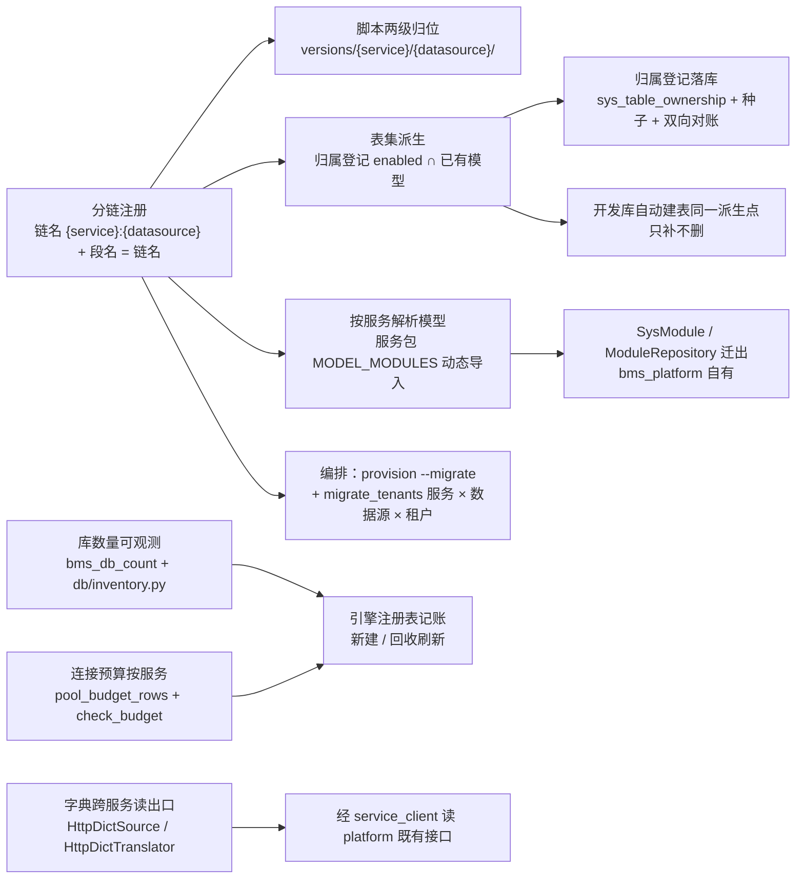

# 多服务多库迁移与连接预算实施记录

> 后端基座与服务化地基 · 06_数据拓扑升级 · 子任务 02 · 实施记录（含承接 06_03 全部余量）

## 1. 实施信息 

| 项 | 值 |
| --- | --- |
| 任务 | [02 多服务多库迁移与连接预算](../06_数据拓扑升级_02_多服务多库迁移与连接预算.md) |
| 对应需求 | [06-2](../../../../需求/06_需求_数据拓扑升级.md#r06-2)（并承接 [06-3](../../../../需求/06_需求_数据拓扑升级.md#r06-3) 全部余量） |
| 详细设计 | [01_详细设计_02_多服务多库迁移与连接预算](../设计/01_详细设计_02_多服务多库迁移与连接预算.md) |
| 实施日期 | 2026-09-23（第一轮 ~ 第三轮） |
| 实施人 | minjian |
| 实施环境 | 开发机（Ubuntu，Python 3.14 / uv）；SQLite 多文件服务化模板（`bms_{service}.db` / `bms_{service}_{tenant}.db`） |
| 提交 | 代码与文档分开提交（`feat(06_02)` / `docs(06_02)`） |
| 结论 | 进行中：分链机制 / 模型迁出 / 归属登记落库与对账 / 批量编排与开通即迁移 / 按服务连接预算 / 库数量可观测 / 字典跨服务读出口 / **三库真库建库迁移演练** 已交付；余量见 §5（Kiwi 用例编号） |

## 2. 实施概览 

结果小结：迁移链由「数据源级」升为「服务 × 数据源」（链名 `{service}:{datasource}`、配置段名 = 链名、版本目录两级、表集由表归属登记派生）；存量脚本按归属拆分归位（`sys_tenant` 归 `tenant` 服务、`sys_module` 归 `platform` 服务）；`SysModule` / `SysModuleI18n` / `ModuleRepository` 迁出共享基座库，`bms_core` 取数改「权威读取器注册点」模式；表归属登记落库并双向对账（含 `platform` 服务启动期接库对账）；批量迁移编排矩阵化并支持开通即迁移；连接预算按服务 × 库类别核算；库数量入指标域；字典跨服务读出口落地。后端 **1193 用例通过**（36 跳过）、`pyright` 0 错误、`ruff` 干净、基座 / 清单 / 边界 / 链接 / 状态校验全绿。

## 3. 实施过程 

1. **分链注册（`db/migration.py` 重写）**：`DATASOURCES`（platform / tenant / archive）、`DEFAULT_CHAIN_NAME = "platform:tenant"`、`build_chain_name` / `parse_chain_name` / `resolve_chain` / `chain_names` / `service_chains` / `archive_chain`；`MigrationChain` 增 `service` / `datasource` 与 `version_location`（`alembic/versions/{service}/{datasource}/`）；`config_section` 段名 = 链名（缺省链用 `[alembic]`）、`resolve_chain_from_section` 双向解析（缺省链误用全限定段名即失败并提示）；`chain_metadata` 改「派生表集 ∩ 已有模型」；`import_models(service)` + `service_model_modules`（服务包 `MODEL_MODULES` 动态导入，服务包不存在跳过、存在未声明即 `ConfigError`）；`chain_url` 平台链按服务取全限定键、租户链回落目标 `url`、归档链取归档目标。
2. **脚本拆分与归位**：`versions/platform/{platform,tenant}/`、`versions/tenant/{platform,tenant}/` 两级目录；原 `0001_sys_tenant_module` 拆为 `platform:platform/0001_sys_module`（`sys_module` + `sys_module_i18n`）与 `tenant:platform/0001_sys_tenant`（`sys_tenant`，`db_key` 直接建为可空 = 合并原 `0005_sys_tenant_db_key_nullable` 语义）；新增 `tenant:platform/0002~0003`、`tenant:tenant/0001~0002`（发件箱三表 + 事件版本列，同构）与 `platform:platform/0005_sys_table_ownership`；其余 7 个服务建空目录（`.gitkeep`，脚本随首次需要补）。
3. **表归属状态收口**：`chain_tables` 只取 `status = enabled`，基础设施表（发件箱三表）只进 `platform` / `tenant` 链（归档链不含）；8 张未定稿表（骨架表 `sys_task` / `sys_task_log` / `sys_user_preference` / `sys_icon` / `sys_icon_i18n` / `sys_notification` / `ai_chat_log` 与演示表 `demo`）改标 `planned`，不进链。
4. **`alembic.ini` 与 CI**：段名统一为链名（保留 `[alembic]` = 缺省链 + `[alembic:platform:platform]` / `[alembic:tenant:platform]` / `[alembic:tenant:tenant]`），不留数据源级别名段；CI catalog job 段名改 `alembic:platform:platform`。
5. **模型迁出与目录取数改注册点**：`SysModule` / `SysModuleI18n` → `bms_platform/models/catalog.py`，`ModuleRepository` → `bms_platform/repositories/module_repository.py`（删除共享基座库同名模块与仓储）；`bms_core/catalog/loader.py` 改「权威读取器注册点」（`register_catalog_reader` / `resolve_catalog_reader`），平台服务经 `bms_platform/sources/catalog_source.py` 在 `configure_service` 登记；各服务包声明 `MODEL_MODULES`。
6. **开发库自动建表同源**：`db/bootstrap.py` 只处理**本服务**且**有迁移脚本**的链，表集取 `chain_metadata`（与服务迁移同一派生点），只补不删；运行服务未登记服务目录时告警跳过（脚手架新工程不阻断启动）。
7. **归属登记落库与对账**：表文件 `sys_table_ownership.md` + 总览登记；迁移 `platform:platform/0005_sys_table_ownership`；`ops/seed_tables.py`（按 `table_name` 幂等 upsert）；`ops/check_tables.py`（离线四条断言：清单自校验 / 模型表必登记 / `enabled` 表必入链 / **脚本建表改表 ⊆ 派生表集**；`--url` 接库双向对账）；`application.py::_validate_table_ownership`（`platform` 服务启动期离线 + 接库对账，不一致 `CatalogError` 拒启、库不可读降级 + `app.state.ownership_degraded`）。
8. **批量迁移编排与开通即迁移**：`ops/migrate_tenants.py` 重写为「服务 × 数据源 × 租户」矩阵（`--service` 多值 / 缺省全部启用服务、`--code` / `--all-tenants`、`--target all|platform|tenants|tenant|archive`、`--url` / `--db-key` 单库模式、`--schema` 达梦、`--dry-run`），幂等（head 一致即跳过）、无脚本链输出「无脚本（跳过）」、单库失败不中断 + 汇总 + **库数量统计**；`ops/provision_tenant.py` 新增 `--migrate`（复用同一内核 `service_tasks` / `run_tasks` / `report`）；`ops/init_tenant.py` 按 `{service}:tenant` 链迁移并要求服务标识。
9. **按服务连接预算**：`DatabaseTargetSettings.max_connections_by_service` / `ServerSettings.workers_by_service`（含 `max_connections_for` / `workers_for`，缺省回落）；`db/registry.py` 新增 `PoolBudgetRow` 与 `pool_budget_rows`（服务 × 库类别；租户库可按活跃租户数核算），`pool_budget_warnings` / `tenant_pool_budget_warnings` 改按服务行输出；新增 `ops/check_budget.py`（离线核对，超限退出码 1）。
10. **库数量可观测**：`METRIC_NAMES` 增 `bms_db_count`；新增 `db/inventory.py`（`DbCount` / `db_count_rows` / `db_counts_by_kind`）；`EngineRegistry` 新增可选 `metrics` / `metrics_service` 与 `db_counts` / `record_db_counts`（引擎新建 / 回收记账）；`application.py::_record_db_inventory` 启动期记预期平台服务库数与归档库数；`migrate_tenants` / `provision_tenant` / `check_budget` 输出库数量统计。
11. **字典跨服务读出口**：新增 `dict/http.py`（`HttpDictSource` / `HttpDictTranslator`，`provider = "http"`）——经 `service_client` 读平台服务**既有**接口（`GET /api/v1/dicts/{type}` / `POST /api/v1/dicts/batch`），语言经 `Accept-Language`、租户经 `X-Tenant-Id` 透传；不可达 / 非 2xx / 响应非法降级为空结果、翻译回退原值；翻译按值子集分批（200/批）并复用已装配字典缓存域；`core/assembly.py` 登记 `http` 工厂（`_resolve_service_client`）。
12. **校验脚本与用例**：`check-backend-base.py` 迁移链断言改两级目录 + 段名 + 链内单 head / 分支标签（`--self-test` 样例同步）；`check-service-boundaries.py` 移除迁移链表集过渡豁免；新增用例 `test_seed_tables` / `test_check_tables` / `test_check_budget` / `test_db_inventory` / `test_http_dict` 与存量用例适配（分链 head 号、表集派生、按服务预算、指标名清单、模型迁出后的 import 面）。

## 4. 问题与处置 

| # | 问题 | 处置 |
| --- | --- | --- |
| 1 | 分链后 `alembic_version` 存量取值（如 `0005_sys_tenant_db_key_nullable`）在新链中不存在 | 明确**库重建口径**（开发库 / CI 临时库 / 演练库一律重建）并写入 `alembic/README.md` 与《数据库开发规范》；本次演练前把既有 `bms_*.db` 备份至 `/tmp/bms_devdb_backup` 后重建 |
| 2 | 分支标签误同时声明在链首与非链首 → Alembic 报「multiple heads」 | 分支标签只声明在链首（`0002_sys_module_catalog` 改回 `None`），并纳入 `check-backend-base.py` 断言 |
| 3 | `chain_metadata` 原对「链表集缺模型」直接抛错，与「表集 ∩ 模型」派生冲突 | 改为交集派生（缺模型不报错、自然不进链），原断言迁至 `ops/check_tables.py`（模型表必登记 + 脚本表集不越界） |
| 4 | 模型迁出后 `bms_core` 若要读本服务平台库会静态依赖服务包 | 改「权威读取器**注册点**」模式（与租户源装配点同模式），共享基座库依赖方向不变（边界护栏通过） |
| 5 | 未定稿骨架表 / 演示表被派生拉进链（与「骨架表由所属阶段自带迁移」口径冲突） | 8 张表改标 `planned`（`enabled` = 已定案且入链），随所属阶段转 `enabled` 时自动进链 |
| 6 | 其余 8 个服务的基础设施表脚本暂缺（避免 9 份同构 DDL 复制） | 建空目录占位；**迁移与开发库自动建表均以「有脚本的链」为准**（开发库与真库一致、无静默漂移），补脚本登记为计划 §7 待办（归 M10 / 该服务首次发事件） |
| 7 | `ops.check_tables` 的「模型表必登记」断言被同进程其它用例的临时模型污染 | 断言改为只统计「模块属于公共清单 / 服务 `MODEL_MODULES`」的模型（按 `__module__` 归属判定） |
| 8 | 脚手架生成的新服务未登记服务目录时启动自动建表报错 | `db/bootstrap.py` 对「服务未登记」降级为告警跳过（不阻断启动） |

## 5. 偏差与遗留 

- **三库真库建库 → 迁移 → 校验 → 清理演练已完成**（2026-09-23，主机 192.168.0.107；MySQL / PostgreSQL / 达梦各一轮，四步闭环 + 集成用例 9 / 9 / 13 通过，测试对象已清理）。演练暴露并当场修复：① 集成用例未随分链更新（MySQL / PG 2 例红，CI `verify/db` 档原会全红）；② 达梦不支持 `ALTER COLUMN ... DROP NOT NULL`（`platform:platform/0002` 冗余改写 → 移除，链首直接建为可空）；③ `ops/seed_tables.py` / `ops/check_tables.py` 缺同步方言路径（补 `is_sync_only_url` 分支与 `--schema`）。详见测试记录 §3.2。
- **Kiwi 用例编号未登记**：本任务需新登记一条用例（原预计 2178），受平台访问限制尚未取得编号，新增用例暂标 `@pytest.mark.kiwi_id(1078)`（与既有 06 域口径一致），取号后回填。
- **`bms_core` 侧 4 个用例改为 import 平台服务模型**（`test_check_modules` / `test_module_ops` / `test_service_catalog_startup` / `test_module_registry`）：模型迁出的连带影响；护栏不扫描 `tests/`，长期可改本地桩对象或随实现迁移（`test_module_repository.py` 已迁至 `services/platform/tests/repositories/`）。
- **其余服务基础设施表脚本**（发件箱三表）：建空目录占位，补脚本登记为计划 §7 待办第 17 项。
- **账号级遗留**：`sys_tenant.db_key` 物理删列（计划 §7 第 15 项）；`catalog` 内容修订触发（06_01 遗留）；字典 / 查询方案真实数据与缓存实现迁出（阶段八）。

## 6. 门禁自检 

| 门禁 | 结果 |
| --- | --- |
| `uv run pytest` | 1193 passed / 36 skipped |
| `uv run ruff check .` / `ruff format --check .` | 通过 / 已格式化 |
| `uv run pyright` | 0 errors |
| `check-base.py` | 通过（跨层引用 0 / 措辞残留 0 / 清单与磁盘一致：177 / 数据库设计登记一致：表文件 16） |
| `check-backend-base.py`（含 `--self-test`） | 通过（继承链 449 条 / 清单覆盖 113 类 / 错误码 37 / 迁移链 13 revision） |
| `check-service-boundaries.py`（含 `--self-test`） | 通过（过渡豁免已移除） |
| `ops/check_tables.py` | 通过（清单 39 项 + 模型表对账 + 脚本表集；SQLite / MySQL / PostgreSQL / 达梦接库对账均通过） |
| `ops/check_budget.py` | 通过（按服务 × 库类别核算） |
| 三库真库集成用例 | `pytest libs/bms_core/tests/integration -k {mysql,postgres,dm8}` → 9 / 9 / 13 passed（真库对象已清理） |
| `check-links.py` / `check-status.py --strict` | 通过 / 343 项 0 不合规 |

## 7. 关联文档 

- [06_01 实施记录](../../06_数据拓扑升级_01_每服务每租户建库与路由/实施/01_实施_01_每服务每租户建库与路由.md)（前置契约：库键 / 建库入口 / 目录快照契约）
- [06_03 实施记录](../../06_数据拓扑升级_03_平台层表归属与按服务拆分/实施/03_实施_01_平台层表归属与按服务拆分.md)（表归属登记与拆分第一轮，余量移交本任务）
- [06_02 测试记录](../测试/01_测试_02_多服务多库迁移与连接预算.md)
- 《[数据库开发规范](../../../../../../规范/数据库开发规范.md)》「迁移与建表口径」节、《[后端开发规范](../../../../../../规范/后端开发规范.md)》「模块边界与数据所有权」节、《[后端基类清单](../../../../../../后端基类清单.md)》
