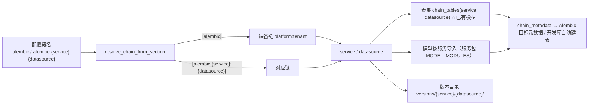
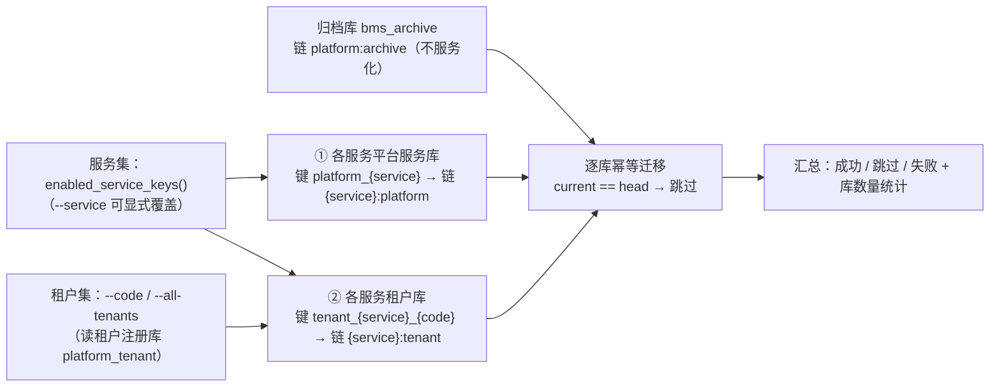

# 多服务多库迁移与连接预算详细设计

> 后端基座与服务化地基 · 06_数据拓扑升级 · 子任务 02 · 详细设计（含承接 06_03 全部余量）

[文档首页](../../../../../../文档首页.md) › [02 多服务多库迁移与连接预算](../06_数据拓扑升级_02_多服务多库迁移与连接预算.md) › 详细设计　|　[父任务：数据拓扑升级](../../06_数据拓扑升级.md) · [本阶段需求](../../../../需求/06_需求_数据拓扑升级.md) · [排期计划](../../../../计划/01_计划_后端基座与服务化地基.md)

## 1. 概述 <a id="overview"></a>

- **目标**：把「每服务每租户一库」从**可建可路由**（06_01 已交付）推进到**可迁移、可核算、可观测**——① Alembic 迁移链由「数据源」扩为「**服务 × 数据源**」（链名 `{service}:{datasource}`、版本目录 `alembic/versions/{service}/{datasource}/`、**表集由表归属登记派生**）；② 批量迁移按「服务 × 数据源 × 租户」逐库幂等执行、开通即迁移；③ 连接预算**按服务分别核算**（该服务 worker × (pool_size + max_overflow) ≤ 该服务库 max_connections 的 70%）；④ 库数量增长可观测。同时**承接 06_03 全部余量并使其收口**（平台层表归属登记落库与对账、`SysModule`/`SysModuleI18n` 迁出、字典跨服务读出口、分链与过渡豁免移除）。
- **依据**：《[架构设计 · 数据架构](../../../../../../设计/架构设计/07_架构设计_数据架构.md)》「数据分布」「迁移策略」节；《[架构设计 · 多租户路由](../../../../../../设计/架构设计/12_架构设计_子系统_多租户路由.md)》「引擎注册表与生命周期」「三库命名与建库标准」节；《[架构设计 · 性能与安全](../../../../../../设计/架构设计/31_架构设计_性能与安全.md)》「部署规模与连接规划」节；《[微服务演进规划](../../../../../../规划/微服务演进规划.md)》「服务化地基要求与门禁」（S1 / S2 / S7）；《[数据库开发规范](../../../../../../规范/数据库开发规范.md)》「迁移与建表口径」节；《[后端开发规范](../../../../../../规范/后端开发规范.md)》「模块边界与数据所有权」节；需求 [06-2](../../../../需求/06_需求_数据拓扑升级.md#r06-2) 与 [06-3](../../../../需求/06_需求_数据拓扑升级.md#r06-3)；前置任务 [06_01 详细设计](../06_数据拓扑升级_01_每服务每租户建库与路由/设计/01_详细设计_01_每服务每租户建库与路由.md)、[06_03 详细设计](../06_数据拓扑升级_03_平台层表归属与按服务拆分/设计/01_详细设计_03_平台层表归属与按服务拆分.md)。
- **范围（本任务）**：
  1. **分链机制**：链名 `{service}:{datasource}`、版本目录按服务与数据源归位、配置段名 = 链名、链元数据与表集按服务解析与派生、存量脚本按归属拆分与归位。
  2. **表集派生与收窄收口**：迁移链与开发库自动建表**同一派生点**（`chain_tables(service, datasource)` ∩ 已有模型）；表归属登记落库（`sys_table_ownership` 表文件 + 总览登记 + 迁移 + 幂等种子 + 启动 / CI 双向对账）；移除分链表集的**过渡豁免**与相关静态断言调整。
  3. **模型迁出**：`SysModule` / `SysModuleI18n` 与 `ModuleRepository` 迁至 `platform` 服务工程；`bms_core` 内不再直读平台层表；模型模块**由服务包自声明**、基座按链的服务解析。
  4. **字典跨服务读出口**（06_03 遗留）：`HttpDictSource` / `HttpDictTranslator`（复用 `platform` 服务既有字典接口）+ 装配与配置口径。
  5. **批量迁移编排**：`ops/migrate_tenants.py` 扩为「服务 × 数据源 × 租户」矩阵（幂等、失败不中断、汇总、dry-run）。
  6. **开通即迁移**：`ops/provision_tenant.py` 新增 `--migrate`（缺省关，一键「建库 + 迁移」）。
  7. **连接预算按服务**：按服务核算内核 + 可选按服务覆盖配置（`max_connections_by_service` / `workers_by_service`）+ 启动告警与离线核对命令。
  8. **库数量可观测**：`bms_db_count` 指标（按库类别与活跃库数）+ `ops` 侧统计输出。
  9. **真库演练**：MySQL / PostgreSQL / 达梦各一轮「建测试库 → 按服务建库 → 分链迁移 → 校验 → 清理」，结论入实施与测试记录。
- **不含（明确归口，见第 8 节）**：网关真实 `X-Tenant-Id` 注入与内部接口真实鉴权（**07_03**）；字典 / 查询方案的**真实数据与缓存实现**迁出（**阶段八**）；事件总线真实投递与订阅失效（**阶段十 M10**）；其余服务基础设施表（发件箱三表）迁移脚本（**M10 / 该服务首次发事件**）；`sys_tenant.db_key` 物理删列（**后续数据库治理任务**）；Prometheus 指标暴露端点与看板（**08_01 / 08_02**）。
- **承接口径（2026-09-23 确认）**：06_03 全部余量并入本任务，**06_03 一并收口**；并入清单取 06_03 任务文档与实施记录 §6 的**并集**——① `sys_table_ownership` 表文件 + 总览登记 + 迁移 + 种子 + 对账；② 字典跨服务读出口（`HttpDictSource` / `HttpDictTranslator`）；③ 分链（含移除过渡豁免）；④ `SysModule` / `SysModuleI18n` 迁出；⑤ Kiwi 用例与文档回写（遗留 2「快照契约 + 启动校验」已由 06_01 交付，不重复）。

## 2. 现状与差距 <a id="gap"></a>

| 关注点 | 现状 | 差距（本任务目标） |
| --- | --- | --- |
| 迁移链形态 | 三条链 `platform` / `tenant` / `archive`（数据源级），链名 = 配置段名 | 链名 `{service}:{datasource}`（如 `platform:platform` / `tenant:platform` / `org:tenant`）；段名 = 链名（缺省段 `[alembic]` = `platform:tenant`） |
| 版本目录 | `alembic/versions/<数据源>/`（平台链脚本内含 `sys_tenant` 与 `sys_module`，跨两个归属服务） | `alembic/versions/{service}/{datasource}/`；存量脚本按归属**拆分与归位** |
| 链表集 | `migration.py` 内字面量常量（`PLATFORM_TABLES` / `TENANT_TABLES`），含跨归属表名 → 依赖**过渡豁免** | 由 `chain_tables(service, datasource)` 派生（仅 `status = enabled`）∩ 已有模型；移除过渡豁免 |
| 链元数据 | 集中常量 `_MODEL_MODULES`（含服务包模块），硬编码在基座 | 服务包自声明 `MODEL_MODULES`，基座按链的**服务**解析（动态导入，不改静态依赖方向） |
| 表归属登记 | 常量 `TABLE_OWNERSHIP` 已就位（06_03 第一轮）；**落库载体 `sys_table_ownership` 未建表**（模型已就位，无表文件、无迁移、无种子、无对账） | 表文件 + 总览登记 + 平台链迁移 + `ops/seed_tables.py` 幂等种子 + `ops/check_tables.py` 与启动期双向对账 |
| 表归属状态语义 | `enabled` / `planned` 仅作标注，未与链派生挂钩；骨架表（`sys_task` 等）标 `enabled` 却无表文件、不进链 | `enabled` = 已定案且入链；`planned` = 归属已定但**未定稿 / 未落库**（不进链）；未定稿表统一改标 `planned` |
| `SysModule` 实现落点 | 模型与 `ModuleRepository` 仍在共享基座库 `bms_core`（归属 `platform`），`bms_core` 内直读平台库 | 迁至 `bms_platform`（模型 `models/catalog.py`、仓储 `repositories/module_repository.py`），`bms_core` 内零直读 |
| 字典跨服务读出 | `dict_source` / `dict_translator` 的 `sql` provider 读**本服务租户库**字典表 | `HttpDictSource` / `HttpDictTranslator` 经 `service_client` 读 `platform` 服务字典接口（契约不变、只换实现） |
| 批量迁移 | `ops/migrate_tenants.py` 按**单服务**（`--service` 单值）遍历 targets | 「服务 × 数据源 × 租户」矩阵（缺省全部启用服务），含库数量统计 |
| 开通即迁移 | `ops/provision_tenant.py` 只建库（明确「不做迁移」） | 新增 `--migrate`（缺省关）：建库后按同一编排内核迁移 |
| 连接预算 | `pool_budget_warnings` 按 `platform` / `tenants` / `archive` **三目标**核算；`max_connections` 目标级单值、worker 数全局 | 按**服务 × 库类别**核算；`[database.{platform,tenants}].max_connections_by_service`、`[server].workers_by_service` 可选覆盖（缺省回落） |
| 库数量 | 无统计与指标 | `bms_db_count`（标签 `kind` / `service`）+ `ops` 侧按类统计输出 |

## 3. 交付物清单 <a id="tree"></a>

```text
backend/
├── libs/bms_core/src/bms_core/
│   ├── db/
│   │   ├── migration.py                        # 改：链注册重写（链名 {service}:{datasource} / 段名 / 目录 / 表集派生 / 按服务模型导入）
│   │   ├── bootstrap.py                        # 改：按链的服务取键 + 表集派生 + 仅处理有脚本的链
│   │   ├── registry.py                         # 改：按服务连接预算核算内核 + bms_db_count 记账钩子 + db_counts()
│   │   ├── inventory.py                        # 新增：库数量统计内核（按库类别 / 服务，纯计算）
│   │   └── keys.py                             # 改：补链相关键派生助手（平台服务库键 / 租户库键按服务）
│   ├── services/
│   │   └── table_registry.py                   # 改：chain_tables 仅取 enabled、基础设施表限 platform/tenant 链、未定稿表改标 planned
│   ├── models/
│   │   ├── platform.py                         # 删：SysModule / SysModuleI18n 迁出（文件移除）
│   │   └── ownership.py                        # 保持：SysTableOwnership（本任务建表落库）
│   ├── repositories/
│   │   └── module_repository.py                # 删：迁至 platform 服务工程
│   ├── dict/
│   │   ├── http.py                             # 新增：HttpDictSource / HttpDictTranslator（经 service_client 读 platform 服务）
│   │   └── cache.py                            # 新增：字典读出口缓存域（复用既有缓存基座）
│   ├── metrics/
│   │   └── base.py                             # 改：METRIC_NAMES 追加 bms_db_count
│   ├── core/
│   │   ├── config.py                           # 改：max_connections_by_service / workers_by_service（含 for(service) 取值法）
│   │   └── assembly.py                         # 改：引擎注册表注入 metrics（库数量记账）
│   └── application.py                          # 改：启动期表归属对账（platform 服务）+ 库数量指标首次记录
├── services/platform/src/bms_platform/
│   ├── models/
│   │   ├── __init__.py                         # 改：声明 MODEL_MODULES
│   │   ├── catalog.py                          # 新增：SysModule / SysModuleI18n 落户
│   │   ├── system.py                           # 保持（骨架表模型；表标 planned，暂不进链）
│   │   └── demo.py                             # 保持（演示表模型；表标 planned，暂不进链）
│   └── repositories/
│       └── module_repository.py                # 迁入：服务目录仓储
├── services/tenant/src/bms_tenant/models/__init__.py    # 改：声明 MODEL_MODULES
├── services/{identity,org,file,notification,search,ai,report}/src/bms_*/models/__init__.py  # 改：声明 MODEL_MODULES（空清单）
├── ops/
│   ├── seed_tables.py                          # 新增：表归属幂等种子（sys_table_ownership）
│   ├── check_tables.py                         # 新增：表归属离线 + 接库双向对账（硬门禁）
│   ├── check_budget.py                         # 新增：按服务连接预算离线核对
│   ├── migrate_tenants.py                      # 改：服务 × 数据源 × 租户批量编排 + 库数量统计
│   ├── provision_tenant.py                     # 改：新增 --migrate（建库后按同一内核迁移）
│   ├── seed_module.py / check_modules.py       # 改：改用 bms_platform 模型与仓储 + 分链段名
│   ├── seed_tenant.py / init_tenant.py         # 改：分链段名与库键口径适配
│   └── test_db.py                              # 改：迁移按分链段名与库键执行（真库演练入口）
├── alembic.ini                                 # 改：段名 = 链名（[alembic] 缺省 = platform:tenant）
├── alembic/
│   ├── README.md                               # 改：分链形态、段名与命令口径
│   └── versions/
│       ├── platform/
│       │   ├── platform/                       # 平台服务的平台服务库链（bms_platform）
│       │   │   ├── 0001_sys_module.py          # 新增（由 0001_sys_tenant_module 拆分：只留 sys_module + sys_module_i18n）
│       │   │   ├── 0002_sys_module_catalog.py  # 归位（原 versions/platform/0002）
│       │   │   ├── 0003_sys_outbox.py          # 归位（原 versions/platform/0003）
│       │   │   ├── 0004_sys_outbox_event_version.py  # 归位（原 versions/platform/0004）
│       │   │   └── 0005_sys_table_ownership.py # 新增：表归属登记表
│       │   └── tenant/                         # 平台服务的租户库链（bms_platform_{tenant}）
│       │       ├── 0001_dict_and_query_scheme.py     # 归位（原 versions/tenant/0001）
│       │       ├── 0002_sys_outbox.py                # 归位（原 versions/tenant/0002）
│       │       └── 0003_sys_outbox_event_version.py  # 归位（原 versions/tenant/0003）
│       ├── tenant/
│       │   ├── platform/                       # 租户服务的平台服务库链（bms_tenant）
│       │   │   ├── 0001_sys_tenant.py          # 新增（由原 0001 拆分；db_key 直接建为可空，合并原 platform/0005 语义）
│       │   │   ├── 0002_sys_outbox.py          # 新增（与平台链同构）
│       │   │   └── 0003_sys_outbox_event_version.py  # 新增（与平台链同构）
│       │   └── tenant/                         # 租户服务的租户库链
│       │       ├── 0001_sys_outbox.py          # 新增
│       │       └── 0002_sys_outbox_event_version.py  # 新增
│       └── {identity,org,file,notification,search,ai,report}/{platform,tenant}/.gitkeep  # 空目录（脚本随首次需要补）
├── config.toml / config.dev.toml / config.prod.toml  # 改：按服务连接预算覆盖示例与注释口径
scripts/tools/base-check/
└── check-backend-base.py                       # 改：迁移链断言改两级目录 + 段名 {service}:{datasource}（含 --self-test）
└── check-service-boundaries.py                 # 改：移除分链表集过渡豁免
.gitlab-ci.yml                                  # 改：catalog job 的迁移段名（-n alembic:platform:platform）
bms文档/
├── 设计/架构设计/07_架构设计_数据架构.md            # 回写：迁移策略（分链形态、表集派生、批量编排与开通即迁移）
├── 设计/架构设计/12_架构设计_子系统_多租户路由.md    # 回写：三库命名与建库标准（分链执行口径）
├── 设计/架构设计/31_架构设计_性能与安全.md          # 回写：部署规模与连接规划（按服务核算口径）
├── 设计/数据库设计/数据表设计/sys_table_ownership.md  # 新增：表文件（含变更记录）
├── 设计/数据库设计/01_数据库设计_总览.md            # 回写：已设计数据表登记（新增行 + sys_tenant / sys_module 归属与 ORM 栏更正）
├── 后端基类清单.md                              # 回写：链注册 / SysTableOwnership / ops 脚本 / 迁出项标注
├── 规范/数据库开发规范.md                        # 回写：迁移与建表口径（链名与段名、表集派生、批量迁移与开通即迁移、按服务预算）
├── 规范/后端开发规范.md                          # 回写：模型模块按服务声明与解析口径
└── 项目/.../任务/06_数据拓扑升级/                 # 回写：06_02 内容与完成标准、06_03 移交与收口、01_0x 相关开放项闭环
```

## 4. 领域设计 <a id="design"></a>

### 4.1 迁移链按服务 × 数据源分链 <a id="chains"></a>

**链名与解析**（`bms_core/db/migration.py`）：

| 成员 | 说明 |
| --- | --- |
| `DATASOURCES` | `("platform", "tenant", "archive")` |
| `DEFAULT_CHAIN_NAME` | `"platform:tenant"`（缺省配置段 `[alembic]` 指向的链） |
| `build_chain_name(service, datasource)` | `"{service}:{datasource}"`（校验服务已登记、数据源合法） |
| `parse_chain_name(name)` | 反解 `(service, datasource)`；形态非法抛 `ConfigError` |
| `resolve_chain(name)` | 取链定义（链名 → `MigrationChain`） |
| `chain_names()` | 全部候选链名（服务集 × 数据源集，保序；空链由 `has_revisions` 过滤） |
| `service_chains(service)` | 某服务的三条链（启动自动建表用） |
| `MigrationChain` | `name` / `service` / `datasource` / `tables` / `scope`；`branch` = 链名；`version_location` = `alembic/versions/{service}/{datasource}` |

**配置段名 = 链名**（`config_section` / `resolve_chain_from_section`）：

- 缺省链（`platform:tenant`）→ `[alembic]`（**唯一**保留的兼容入口，保证裸命令 `alembic upgrade head` 语义不变）；
- 其余链 → `[alembic:{service}:{datasource}]`（如 `[alembic:platform:platform]`）；
- **不保留数据源级别名段**（`[alembic:platform]` 等一律移除）；对缺省链误用全限定段名时，`alembic_config` 以配置段缺 `version_locations` 快速失败并提示「缺省链请用 `-n alembic`」。
- `alembic.ini` 只登记**有迁移脚本的链**的段（当前 `[alembic]` + `[alembic:platform:platform]`）；新增服务首次迁移时补段（口径写入《数据库开发规范》）。

**链分流**：



**表集派生**（与 06_03 设计同源，本任务收口口径）：

- `chain_tables(service, datasource)` 仅取 `status = enabled` 的归属表 + 基础设施表（发件箱三表；**仅** `platform` / `tenant` 数据源计入，归档链不含）；
- 链表集 = `chain_tables(service, datasource)` ∩ `Base.metadata.tables`（导入该链服务与公共模型后）——`planned` 表与尚无模型的登记表自然不参与，随所属阶段补表文件与模型后**自动进链**；
- 归档链表集为空（归档表随归档阶段落地）。

**模型模块按服务解析**：

- 公共模型模块清单 `COMMON_MODEL_MODULES = ("bms_core.models.ownership", "bms_core.models.outbox", "bms_core.dict.models", "bms_core.listing.models")`；
- 服务包在 `bms_{service}/models/__init__.py` 声明 `MODEL_MODULES: tuple[str, ...]`（本服务模型模块清单；无模型的服务声明空元组）；
- `import_models(service)` = 导入公共清单 + 动态导入 `bms_{service}.models` 并读其 `MODEL_MODULES`；
  - 服务包不存在（`planned` / 预留服务）→ 跳过；
  - 服务包存在但未声明 `MODEL_MODULES` → `ConfigError`（显式声明，不静默）；
  - **动态导入（`importlib`）而非静态 `import`**：迁移 / 运维期按链的服务取模型，静态依赖方向不变（`bms_core` 不 `import` 任何服务模块，`tests/crosscut/test_module_boundary.py` 与 `check-service-boundaries.py` 口径不变）；该口径在《后端开发规范》与《后端基类清单》登记。
- `MODEL_MODULES` 为**公开契约名**，服务包新增模型时必须同步（CI 断言：模型文件里的 `__tablename__` 集合 ⊆ `chain_metadata(该服务对应链)` 的表集，见 §4.3）。

**连接串取法**（`chain_url(chain, settings, *, db_key=None, allow_cross_service=False)`）：

- 显式 `db_key` → 经 `EngineFactory` 解析（运维通道，现行语义不变）；
- 未给 `db_key`：
  - `datasource == archive` → `[database.archive].url`（归档库不服务化）；
  - `datasource == platform` → 按链的服务派生全限定键 `platform_{service}` 解析（链自带服务，属设计内跨服务，经运维豁免取库）；
  - `datasource == tenant` → 无租户编码，回落 `[database.tenants].url`（真库批量迁移一律经库键）。

**存量脚本拆分与归位**（内容口径）：

| 原脚本 | 归位 | 处置 |
| --- | --- | --- |
| `versions/platform/0001_sys_tenant_module.py` | 拆为 `platform/platform/0001_sys_module.py` 与 `tenant/platform/0001_sys_tenant.py` | 按归属拆表；`sys_tenant.db_key` 在拆分后的首个脚本里**直接建为可空**（原 `0005_sys_tenant_db_key_nullable` 语义合并入首建，历史合并） |
| `versions/platform/0002_sys_module_catalog.py` | `platform/platform/0002_...` | 仅目录归位，内容与 revision 不变，`branch_labels` 改 `("platform:platform",)` |
| `versions/platform/0003_sys_outbox.py` | `platform/platform/0003_...`；同构新增 `tenant/platform/0002_...`、`tenant/tenant/0001_...` | 分支标签分别改 `("platform:platform",)` / `("tenant:platform",)` / `("tenant:tenant",)` |
| `versions/platform/0004_sys_outbox_event_version.py` | `platform/platform/0004_...`；同构新增 `tenant/platform/0003_...`、`tenant/tenant/0002_...` | 同上 |
| `versions/platform/0005_sys_tenant_db_key_nullable.py` | 合并入 `tenant/platform/0001_sys_tenant.py` | 历史合并（不再单独成脚本） |
| `versions/tenant/*` | `platform/tenant/*` | 仅目录归位，`branch_labels` 改 `("platform:tenant",)` |

- **revision 编号口径**：**链内唯一、链内独立递增**（跨链允许同名）；`check-backend-base.py` 的断言由「revision 跨链唯一」改为「链内唯一 + 链内单 head + 分支标签与链名一致」。
- **库重建口径**：分链后 `alembic_version` 的存量取值（如 `0005_sys_tenant_db_key_nullable`）在新链中不存在，**既有开发库 / CI 临时库 / 演练库一律重建**（删 `bms_*.db` 或按文档重建）；真库（三库演练对象）同样重建。该口径写入实施记录与《数据库开发规范》。

### 4.2 表归属登记落库与双向对账（06_03 遗留 1） <a id="ownership-table"></a>

- **表文件**：新增《数据库设计 · 数据表设计/`sys_table_ownership`.md》（字段口径与 `bms_core/models/ownership.py::SysTableOwnership` 逐项一致：`table_name` / `owner` / `datasource` / `status` / `note` + `BaseModel` 公共字段；唯一约束 `(table_name, deleted_at)`），并在总览「已设计数据表登记」登记（状态 `已落库`）。
- **迁移**：`alembic/versions/platform/platform/0005_sys_table_ownership.py`（`branch_labels=("platform:platform",)`，`down_revision=0004_sys_outbox_event_version`）。
- **种子**：`ops/seed_tables.py`（幂等 upsert：按 `table_name` + 未软删判存；新增插入、存在则更新本清单字段；`--url` / `--dry-run`；URL 默认取 `platform` 服务的平台服务库键）。
- **对账**：`ops/check_tables.py`——
  - **离线**：`TableOwnershipRegistry.validate()` + 「模型表未登记」断言（导入全部启用服务模型后，所有 `Base.metadata.tables` 表名必须已登记）+ 「`enabled` 表须在归属服务的对应链中」；
  - **接库**（`--url`）：`validate_table_ownership(TABLE_OWNERSHIP, records)` 双向对账（缺行 / 清单外行 / 字段不符），只读不写；冲突退出码 1。
- **启动期对账**（`platform` 服务，`application.py`）：平台服务即表归属登记的权威持有方，启动期读**本服务平台服务库**做接库对账；不一致 → `CatalogError`（40003，登记类冲突，**复用既有错误码，不新增**）拒启；库不可读（未迁移）→ WARNING 放行 + `app.state.ownership_degraded = True`（与 `catalog` 降级同口径）；非 `platform` 服务不做该对账（登记表非其归属库，不跨服务直读）。

### 4.3 校验收窄收口与断言调整 <a id="assertions"></a>

- **移除过渡豁免**：`scripts/tools/base-check/check-service-boundaries.py::_LEGACY_CHAIN_TABLES_RELATIVE` 删除（`migration.py` 不再以字面量登记跨归属表名）；随分链落地同步删除其说明与 `--self-test` 相关样例。
- **新增断言（离线，CI 硬门禁）**：
  1. 每个已有模型的表名必须已登记在 `TABLE_OWNERSHIP`（未登记即失败）；
  2. 每个 `status = enabled` 的表必须出现在其归属服务 + 库类别对应链的 `chain_tables` 中（派生定义自证 + 防「登记了却没进链」的林奇情形）；
  3. 每条**有脚本**的链，其脚本实际建表的集合 ⊆ `chain_tables(service, datasource)`（防越界建表）；
  4. 模型表集合 ⊆ 该服务全部链的表集（防模型落在错链）。
- **`check-backend-base.py`**：迁移链断言改为「两级目录 `versions/{service}/{datasource}/`」+ 段名 `[alembic:{service}:{datasource}]`（缺省段 `[alembic]` 视为 `platform:tenant` 的合法登记）+ 链内单 head / 分支标签一致 / 链内 revision 唯一；`--self-test` 样例同步改（两级目录样例、段名缺失样例、同链双 head 样例）。
- **`TABLE_OWNERSHIP` 状态收口**：未定稿表改标 `planned`——`sys_task`、`sys_task_log`、`sys_user_preference`、`sys_icon`、`sys_icon_i18n`、`sys_notification`、`ai_chat_log`、`demo`（8 张）。语义定案：`enabled` = 已定案且进链；`planned` = 归属已定但未定稿 / 未落库（不进链，随所属阶段转 `enabled` 时自动进链）。据此保持「骨架表由所属阶段自带迁移、不进链、不自动建表」既有口径不变。

### 4.4 `SysModule` / `SysModuleI18n` 迁出（06_03 遗留 5） <a id="move-module"></a>

| 符号 | 迁出前 | 迁出后 | 连带改动 |
| --- | --- | --- | --- |
| `SysModule` / `SysModuleI18n` | `bms_core/models/platform.py` | `bms_platform/models/catalog.py` | `bms_core/models/platform.py` 删除；`ops/seed_module.py`、`ops/check_modules.py` 改 import；`bms_platform/models/__init__.py` 声明 `MODEL_MODULES`；迁移链 `platform:platform` 表集含两表 |
| `ModuleRepository` | `bms_core/repositories/module_repository.py` | `bms_platform/repositories/module_repository.py` | `bms_platform/api/modules.py`（清单与快照接口）改 import；`ops/check_modules.py` 接库校验改 import；`bms_core` 内删除 |
| `_MODEL_MODULES`（集中常量） | `bms_core/db/migration.py` | 删除，改服务包 `MODEL_MODULES` + `COMMON_MODEL_MODULES` | 见 §4.1 |

- **`bms_core` 零直读平台层表**：`catalog` 取数编排（06_01 已交付的 `bms_core/catalog/loader.py` + `service_client` 快照）已是唯一取数路径；本任务删除残留的模型与仓储，使《后端开发规范》「共享基座库不直读平台层表」彻底成立。
- **`ops` 侧口径**：`ops/seed_module.py` / `ops/check_modules.py` 属运维侧工具，允许 `import` 所属服务包读取模型（沿用 06_03 设计登记口径，不新增护栏白名单）。

### 4.5 字典跨服务读出口（06_03 遗留 3） <a id="dict-http"></a>

- 新增 `bms_core/dict/http.py`：`HttpDictSource` / `HttpDictTranslator`——经 `service_client` 调 `platform` 服务**既有**接口 `GET /api/v1/dicts/{dict_type}/items`（不新增接口），翻译按「取子集 → 本地映射」实现（避免全量拉取）；
- 新增 `bms_core/dict/cache.py`：读出口缓存域（复用既有 `DictCacheRegion` 与版本键语义）；
- 装配与配置：`[dict_source].provider` / `[dict_translator].provider` 支持 `http`（非 `platform` 服务用 `http`、`platform` 服务保持 `sql`）；`dev` / `test` 缺省不变；
- 失败语义：不可达按 `ServiceCallPolicy` 重试 / 熔断 → 返回空结果并标记降级（与字典 `null` 实现同语义，不抛业务错）；
- **不含**：字典 / 查询方案的**真实数据与缓存实现**迁出（阶段八）。

### 4.6 批量迁移编排（服务 × 数据源 × 租户） <a id="migrate"></a>

**目标矩阵**（`ops/migrate_tenants.py`，缺省 `--target all`）：



- **参数**：`--target all|platform|tenants|tenant|archive`（保留）；`--service`（**多值**，缺省全部启用服务）；`--code`（多值）/ `--all-tenants`（读租户注册库 `platform_tenant`）；`--db-key` / `--url` / `--schema`（单库演练与达梦模式，保留）；`--dry-run`。
- **链映射**：平台服务库 `bms_{service}` → 链 `{service}:platform`；服务租户库 `bms_{service}_{code}` → 链 `{service}:tenant`；归档库 → 链 `platform:archive`（服务段占位，表集为空）。
- **执行口径**：串行逐库；幂等（`current_revision == head_revision` → 「已是最新（跳过）」）；**单库失败不中断**整批（记 ERROR 继续），末尾汇总成功 / 跳过 / 失败，存在失败退出码 1；**无脚本的链输出「无脚本（跳过）」**（不视为失败）。
- **库数量统计**（输出与指标同源，见 §4.9）：按库类别统计本次目标数（平台服务库 / 服务租户库 / 归档库）与服务维度分布。
- **保留旧用法**：`--target platform|archive` 与 `--target tenant --url <连接串>`（单库演练）语义不变。

### 4.7 开通即迁移 <a id="provision-migrate"></a>

- `ops/provision_tenant.py` 新增 `--migrate`（缺省**关闭**）：建库成功后，对本次涉及的服务 × 数据源执行迁移（复用 §4.6 编排内核，同一实现、幂等可重跑）；
- 顺序：**先建库 → 后迁移**；单库建库失败不中断整批（沿用），迁移阶段同样「失败不中断 + 汇总 + 退出码 1」；
- 输出：建库汇总（新建 / 已存在 / 失败）+ 迁移汇总（成功 / 跳过 / 失败）+ 库数量统计；
- 「自动执行」口径落地为**一条命令完成开通**（`--code X --migrate`）；缺省不迁移的理由见第 10 节决策 4。

### 4.8 连接预算按服务核算 <a id="budget"></a>

**核算口径**（需求 06-2 内容 3）：对每个「服务 × 库类别」：`workers_for(service) × (pool_size + max_overflow) ≤ max_connections_for(service) × 70%`；租户库另按活跃引擎数核算（`max_active × workers × (pool + overflow) ≤ max_connections × 70%`）。

**配置扩展**（`core/config.py`）：

| 字段 | 位置 | 默认 | 说明 |
| --- | --- | --- | --- |
| `max_connections_by_service` | `DatabaseTargetSettings` | `{}` | 该库目标下按服务的最大连接数覆盖；`max_connections_for(service)` 缺省回落目标级 `max_connections`（`0` = 不校验） |
| `workers_by_service` | `ServerSettings` | `{}` | 按服务的 worker 数覆盖；`workers_for(service)` 缺省回落 `[server].workers` |

**核算内核与落点**：

- `bms_core/db/registry.py` 新增 `PoolBudgetRow`（`service` / `datasource` / `workers` / `pool_size` / `max_overflow` / `max_connections` / `total` / `ok`）与 `pool_budget_rows(settings, services=None)`；
- `pool_budget_warnings(settings)` **保留函数名与签名**（启动期调用点不变），实现改为遍历**启用服务 × {platform, tenants}**（+ archive）逐行核算，输出超限告警（含服务与库类别）；
- `tenant_pool_budget_warnings(settings, max_active)` 保留（活跃引擎口径），改为按服务行核算；
- 新增 `ops/check_budget.py`：离线输出按服务矩阵与超限明细；超限退出码 1（供 CI / 预检与运维核对；不阻断启动）。

### 4.9 库数量可观测 <a id="inventory"></a>

- **指标**：`bms_core/metrics/base.py::METRIC_NAMES` 追加 `bms_db_count`（gauge，标签 `kind` ∈ `platform|tenant|archive`、`service`）；
- **统计内核**：`bms_core/db/inventory.py`——`db_count_rows(services, tenants)` 纯计算（平台服务库数 = 服务数；服务租户库数 = 服务数 × 租户数；归档库 1）+ `EngineRegistry.db_counts()`（按库类别统计**活跃**引擎数，反映懒加载 / 回收）；
- **记录点**：
  - 启动期（`application.py` 装配后）记录一次（平台服务库数、活跃租户库数、归档库数）；
  - `EngineRegistry` 构造新增可选 `metrics`（由 `core/assembly.py` 从 `metrics` 能力域注入），在引擎**新建**与**回收**（`_dispose` / `release`）后异步记 `bms_db_count`——使「活跃租户懒加载与闲置回收」可观测；
  - `ops/migrate_tenants.py` / `ops/provision_tenant.py` / `ops/check_budget.py` 输出本类统计（运维侧实际目标数）；
- **不含**：Prometheus 暴露端点与看板（08_01 / 08_02）；指标实现为 `null` 时不产生副作用（既有 `null` 实现语义）。

### 4.10 开发库自动建表与迁移同口径 <a id="bootstrap"></a>

- `db/bootstrap.py`：
  - 只处理**本服务**的链（`chain.service == settings.app.service`）且 `has_revisions(chain)` 为真（**有脚本才建**，与真库迁移口径一致，消除「开发库有、真库没有」的静默漂移）；
  - 表集用 `chain_metadata(chain)`（= 派生表集 ∩ 模型，与服务迁移同一派生点）；
  - 取键沿用服务化口径（平台链本服务平台服务库 / 租户链逐 `[tenant].dev_tenants` / 归档链 `archive`），经 `seen_urls` 去重；
  - 只补不删（`create_all(checkfirst=True)`）：既有开发库多出的旧表不主动删除，需干净库时按文档删库文件重建（分链本身已要求重建，见 §4.1）。

### 4.11 与相邻能力域 / 任务分工 <a id="boundary-inner"></a>

| 相邻 | 分工 |
| --- | --- |
| `06_01` 每服务每租户建库与路由 | 库键与库名、越权拒绝、按服务建库入口已交付；本任务**消费**这些契约并承接其开放项 5（开发库表集收敛） |
| `06_03` 平台层表归属与按服务拆分 | 余量全部移交本任务，本任务交付后 **06_03 收口**（其设计 / 实施 / 测试记录作为本任务前序轮次引用） |
| `05_02` 数据所有权与边界硬校验 | 表级守卫与静态规则 5/6 口径不变；本任务移除其**分链表集过渡豁免** |
| `05_01` 服务契约与同步调用 | 只**消费** `service_client`（字典读出口），不新增契约 |
| `09_03` 契约门禁 | 分链后 CI 迁移命令段名变更（catalog job）需同步 **09_01 / 09_03** 的流水线口径 |
| `08_01` / `08_02` 可观测性 | 只交付指标名与记账（`bms_db_count`）；暴露端点与看板归其后 |
| `M10` 事件总线 | 其余服务基础设施表（发件箱三表）迁移脚本归其后（或该服务首次发事件时补） |

## 5. 失败分支与边界 <a id="failures"></a>

| 场景 | 行为 |
| --- | --- |
| 链名形态非法 / 服务未登记 / 数据源非法 | `ConfigError`（10005）快速失败（不误跑库） |
| 配置段缺 `version_locations`（如对缺省链误用 `alembic:platform:tenant`） | `ConfigError` 提示「缺省链请用 `-n alembic`」或「该链未在 `alembic.ini` 登记（新增服务首次迁移需补段）」 |
| 链无迁移脚本 | `has_revisions` 为假 → 迁移与自动建表均跳过，输出「无脚本（跳过）」；**不视为失败** |
| 服务包存在但未声明 `MODEL_MODULES` | `ConfigError`（显式声明口径，不静默空集） |
| 模型表未登记归属 | 离线断言失败（CI 硬门禁）；`chain_metadata` 不因之报错（派生取交集） |
| 迁移脚本建了归属外的表 | 断言 3 失败（CI 硬门禁） |
| 表归属登记库不可读（未迁移） | `platform` 服务启动 WARNING 放行 + `app.state.ownership_degraded = True`；CI 接库对账为硬门禁 |
| 表归属登记与清单不一致 | `platform` 服务启动期 `CatalogError`（40003）拒启；CI 退出码 1 |
| 分链后既有库 `alembic_version` 不在新链 | 迁移报「找不到 revision」→ 按 §4.1「库重建口径」重建（开发 / CI / 演练库）；真库重建由演练流程承担 |
| 批量迁移单库失败 | 记 ERROR 继续下一库，末尾汇总并退出码 1（幂等重跑补做） |
| 租户注册库不可读（`--all-tenants`） | 提示先建库 + 迁移 + 种子（`ops.seed_tenant`），或改用 `--code`；退出码非 0 |
| 连接预算超限 | 启动告警（WARNING，不阻断）；`ops/check_budget.py` 退出码 1 |
| 字典读出口不可达 | 按 `ServiceCallPolicy` 重试 / 熔断 → 返回空结果并标记降级（不抛业务错） |
| 达梦分链迁移 | 目标模式经 `-x schema=` 指定；版本目录与 `schema` 组合在真库演练中复核（本任务交付结论） |

## 6. 测试设计与验收映射 <a id="tests"></a>

| 完成标准 | 测试设计 | 落点 |
| --- | --- | --- |
| 链名 / 段名 / 目录为分链形态 | 链名派生与反解、段名映射（含缺省段）、目录路径、非法名快速失败 | `tests/alembic/test_alembic_chains.py`（改） |
| 表集由归属登记派生 | 派生集合（含 `planned` 排除、基础设施表仅 platform/tenant 链）、与脚本表集一致、模型表未登记拦截 | `tests/services/test_table_registry.py`（改）、`tests/alembic/test_alembic_drift.py`（改） |
| 迁移链按服务 × 数据源可取、可分链执行 | 逐链单 head / 分支标签 / 链内 revision 唯一 / 空链跳过 / 元数据子集 | `tests/alembic/test_alembic_chains.py`、`scripts/tools/base-check/check-backend-base.py --self-test` |
| 平台层每张表有唯一归属且校验生效 | 归属登记清单自校验、种子幂等、双向对账（缺行 / 清单外行 / 字段不符） | `tests/ops/test_seed_tables.py`（新）、`tests/ops/test_check_tables.py`（新） |
| `bms_core` 无平台层表直读 | AST / import 断言：`bms_core` 内无 `SysModule` / `ModuleRepository` 引用（模型迁出后） | `tests/crosscut/test_module_boundary.py`（改）、`tests/boundary/test_boundary.py`（改） |
| 字典跨服务读出 | 取数与翻译（含子集）映射正确、不可达降级 | `tests/dict/test_http_dict.py`（新） |
| 多服务多库批量迁移幂等且可演练 | 矩阵构建（服务 × 数据源 × 租户）、幂等跳过、失败不中断、dry-run 不建连、库数量统计 | `tests/ops/test_migration_ops.py`（改） |
| 开通自动执行迁移 | `--migrate` 建库 + 迁移两步幂等、缺省关闭 | `tests/ops/test_provision_tenant.py`（改） |
| 连接预算按服务生效 | 按服务核算行（覆盖 / 回落）、超限告警、租户活跃口径、离线核对退出码 | `tests/db/test_pool_config.py`（改）、`tests/ops/test_check_budget.py`（新） |
| 库数量可观测 | 统计内核计数、注册表活跃计数、指标记录（`metrics` 注入与 `null` 不副作用） | `tests/db/test_db_inventory.py`（新）、`tests/db/test_engine_registry.py`（改） |
| 开发库自动建表同口径 | 仅本服务有脚本链建表、表集与迁移一致、只补不删 | `tests/db/test_auto_create_tables.py`（改） |
| 三库真库演练 | MySQL / PostgreSQL / 达梦各一轮（建测试库 → 按服务建库 → 分链迁移 → 校验 → 清理），结论入记录 | `ops/test_db.py`（改）+ 任务测试记录（手工演练留痕） |

- **Kiwi TCMS**：一任务一条用例（**先登记取得编号再编码**，编号回填本节与代码 `@pytest.mark.kiwi_id(N)`）；06_03 既有用例 2176 保持不变。
- **验收映射**：需求 06-2 四条与 06-3 四条完成标准逐条对应上表；门禁 = `pytest` / `ruff check` / `ruff format --check` / `pyright` / `check-base.py` / `check-links.py` / `check-status.py --strict` / `check-service-boundaries.py`（含 `--self-test`）/ `check-backend-base.py`（含 `--self-test`）/ `ops/check_tables.py` / `ops/check_budget.py`。

## 7. 登记落点 <a id="registry"></a>

| 落点 | 内容 |
| --- | --- |
| 《架构设计 · 数据架构》 | 「数据分布」节补表归属登记落库与 `enabled` / `planned` 语义；「迁移策略」节链形态改「服务 × 数据源」、表集派生、批量编排与开通即迁移 |
| 《架构设计 · 多租户路由》 | 「三库命名与建库标准」节补分链执行口径（链名 / 段名 / 版本目录 / 库键） |
| 《架构设计 · 性能与安全》 | 「部署规模与连接规划」节补按服务核算与覆盖配置口径 |
| 《后端基类清单》 | 新增 `SysTableOwnership` 落库说明、`ops/{seed_tables,check_tables,check_budget}.py`、链注册新成员、`HttpDictSource` / `HttpDictTranslator`；标注 `SysModule` / `ModuleRepository` 归 `platform` 服务 |
| 《数据库开发规范》 | 「迁移与建表口径」节：链名 `{service}:{datasource}` 与段名、版本目录、表集派生、库重建口径、批量迁移与开通即迁移、按服务连接预算 |
| 《后端开发规范》 | 「模块边界与数据所有权」节补「模型模块由服务包声明、迁移 / 运维期按链服务动态导入」口径 |
| 《数据库设计总览》 + 表文件 | 新增 `sys_table_ownership.md` 并登记；`sys_tenant` / `sys_module` 的「归属库 / ORM 模型」栏更正（模型迁至服务工程）；表文件「变更记录」追加 |
| 06_01 设计 / 实施记录 | 开放项 5（开发库表集收敛）闭环；分链形态落地登记 |
| 06_03 任务 / 设计 / 实施 / 测试记录 | 余量移交登记；06_03 状态改「已完成」（完成日期 = 本任务完成日）；工时按「已交付 + 移交」重划 |
| 01_04 / 01_05 相关口径 | 「按数据源分链」表述更新为「按服务 × 数据源分链」（表集与库重建说明） |
| 计划 | §1 工时台账、§2 已完成表（06_02 / 06_03 两行）、§3 剩余排期（移除两行、顺延）、§4 甘特（去已完成节点）、§7 后续阶段待办（基础设施表脚本、库重建口径） |
| 消费方标注 | `09_01` / `09_03`（CI 迁移段名）、`08_01` / `08_02`（`bms_db_count` 与预算指标）、`M10`（基础设施表脚本）、租户管理阶段（建库 + 迁移一键化） |

## 8. 边界与开放项 <a id="open"></a>

- **明确归 07_03**：网关 `X-Tenant-Id` 真实注入与内部接口真实鉴权（含字典读出口鉴权）。
- **明确归阶段八**：字典 / 查询方案的真实数据、写路径、缓存实现迁出（本任务只落 http 读出口）。
- **明确归阶段十（M10）**：其余服务基础设施表迁移脚本（或该服务首次发事件时补）；事件总线真实投递与订阅失效。
- **明确归后续数据库治理任务**：`sys_tenant.db_key` 物理删列。
- **明确归 08_01 / 08_02**：`bms_db_count` 与预算指标的 Prometheus 暴露、看板与告警联动。
- **开放项**：
  1. `alembic.ini` 段按「有脚本的链」登记（新增服务首次迁移时补段）——若段数量增长带来维护负担，届时可评估生成式 ini 或统一版本目录方案；
  2. 历史脚本合并（`sys_tenant.db_key` 可空并入首建、`0005` 不再单独成脚本）以「库重建」为前提；若后续出现不可重建的真库，需补数据迁移脚本（本任务无此场景）；
  3. `planned` 表转 `enabled` 的时点由各所属阶段决定（转即自动进链，无需改链注册）；
  4. 其余服务基础设施表脚本补齐时点（M10 / 首次发事件）；
  5. 达梦分链下的版本目录与 `-x schema=` 组合结论以本任务真库演练为准（实测）。

## 9. 实施步骤 <a id="steps"></a>

1. **链注册重写**：`db/migration.py`（链名 / 段名 / 目录 / 表集派生 / 按服务模型导入 / `chain_url` 服务化）；`alembic.ini` 段改造；`alembic/README.md` 更新。
2. **脚本拆分与归位**：按 §4.1 表拆分与移动存量脚本（含同构复制），新增 `platform:platform/0005_sys_table_ownership`；`versions/{service}/{datasource}/` 空目录建 `.gitkeep`。
3. **表集与状态收口**：`services/table_registry.py`（`chain_tables` 取 `enabled`、基础设施表限 platform/tenant、未定稿表改标 `planned`）；`db/bootstrap.py`（本服务有脚本链 + 派生表集）。
4. **模型迁出**：`SysModule` / `SysModuleI18n` → `bms_platform/models/catalog.py`；`ModuleRepository` → `bms_platform/repositories/`；删 `bms_core/models/platform.py` 与 `bms_core/repositories/module_repository.py`；各服务包声明 `MODEL_MODULES`；`ops/*` 与接口 import 适配。
5. **归属登记落库**：表文件 + 总览登记 → 迁移 → 种子 `ops/seed_tables.py` → 对账 `ops/check_tables.py` → 启动期对账（`platform` 服务）。
6. **字典读出口**：`dict/http.py` + `dict/cache.py` + 装配 / 配置 + 用例。
7. **批量迁移编排**：`ops/migrate_tenants.py` 矩阵化 + 库数量统计；`ops/provision_tenant.py` 加 `--migrate`。
8. **连接预算与可观测**：`core/config.py` 覆盖配置；`db/registry.py` 核算内核与 `bms_db_count` 记账；`db/inventory.py`；`ops/check_budget.py`；`application.py` 启动记录；`metrics/base.py` 指标名。
9. **校验收口**：移除 `check-service-boundaries.py` 过渡豁免；`check-backend-base.py` 两级目录与段名断言 + `--self-test`；`.gitlab-ci.yml` 段名同步。
10. **Kiwi 登记 + 自动化用例**：先登记取编号，再落 §6 用例并标注 `kiwi_id`。
11. **真库演练**：MySQL / PostgreSQL / 达梦各一轮（建测试库 → 按服务建库 → 分链迁移 → 校验 → 清理），结论入实施与测试记录。
12. **门禁与记录**：全量 `pytest` / `ruff` / `pyright` / 基座与链接校验全绿；写实施记录与测试记录；登记回写（第 7 节）；代码与文档分开提交；偏差与遗留闭环另提。

关键命令：

```bash
cd backend
uv run pytest -q
uv run ruff check . && uv run ruff format --check . && uv run pyright
uv run python -m ops.seed_tables --dry-run && uv run python -m ops.seed_tables
uv run python -m ops.check_tables && uv run python -m ops.check_budget
uv run python -m ops.provision_tenant --code demo --code acme --dry-run
uv run python -m ops.provision_tenant --code demo --code acme --migrate
uv run python -m ops.migrate_tenants --target all --dry-run
uv run python -m ops.migrate_tenants --target all
uv run alembic -n alembic upgrade head                      # 缺省链 = platform:tenant
uv run alembic -n alembic:platform:platform upgrade head    # 平台服务的平台服务库
cd .. && python3 scripts/tools/base-check/check-backend-base.py --self-test
cd .. && python3 scripts/tools/base-check/check-service-boundaries.py --self-test
cd .. && python3 scripts/tools/base-check/check-base.py && python3 scripts/tools/base-check/check-links.py
```

## 10. 决策记录（对齐记录） <a id="align"></a>

| # | 决策 | 结论 | 来源 |
| --- | --- | --- | --- |
| 1 | 分链归属 | 分链机制（06_03 遗留 4）并入本任务实施 | 本轮确认 1 |
| 2 | 06_03 余量边界 | 06_03 全部余量并入（遗留 1 / 3 / 4 / 5 的并集）+ 06_03 一并收口 | 本轮确认 2 |
| 3 | 迁移入口 | 扩展 `ops/migrate_tenants.py`（保留旧名与旧用法，新增服务维度，缺省全部启用服务） | 本轮确认 3 |
| 4 | 开通即迁移 | `ops/provision_tenant.py` 新增 `--migrate`（**缺省关**），复用同一编排内核 | 本轮确认 4 |
| 5 | 连接预算 | 按服务核算内核 + `max_connections_by_service` / `workers_by_service` 可选覆盖（缺省回落）；启动告警与离线核对共用 | 本轮确认 5 |
| 6 | 表集派生 | `chain_tables(service, datasource)` ∩ 已有模型；断言「模型表必登记」「脚本表集 ⊆ 链派生表集」 | 本轮确认 6 |
| 7 | 模型模块解析 | 服务包自声明 `MODEL_MODULES`，基座按链的服务**动态导入**（不改静态依赖方向） | 本轮确认 7 |
| 8 | 库数量可观测 | `METRIC_NAMES` 新增 `bms_db_count` + 启动 / 引擎变更记账 + `ops` 侧统计；暴露端点归 08_01 | 本轮确认 8 |
| 9 | 段名与兼容 | 段名 = 链名；仅保留缺省段 `[alembic]` = `platform:tenant`；**不留数据源级别名**；同步改 CI / 校验脚本 / 文档 | 本轮确认 9 |
| 10 | 自动建表收敛 | `db/bootstrap.py` 用同一派生点；只补不删 | 本轮确认 10 |
| 11 | 真库演练 | 本地真库手工演练（三库各一轮）+ 结论留痕；CI 不新增 job | 本轮确认 11 |
| 12 | 任务与计划口径 | 06_03 标「已完成」（完成日期 = 本任务完成日、工时重划），06_02 内容 / 完成标准扩充并重估工时，计划两处同步 | 本轮确认 12 |
| 13 | 未定稿表处置 | 8 张未定稿表（骨架表 + `demo`）改标 `planned`，不进链；`enabled` = 已定案且入链 | 补充确认 1 |
| 14 | 基础设施表脚本 | 其余服务建空目录、不补脚本；派生表集为目标口径，**迁移与自动建表以「有脚本的链」为准**；补脚本归 M10 | 补充确认 2 |
| 15 | revision 编号 | 链内唯一、链内独立递增（跨链允许同名）；`check-backend-base.py` 断言改「链内唯一 + 单 head」 | 设计推导（分链必要配套） |
| 16 | 历史脚本合并 | `sys_tenant` 首建脚本直接建 `db_key` 可空（合并原 `0005` 语义）；以「库重建」为前提（开发 / CI / 演练库重建；无不可重建真库） | 设计推导（库重建前提下的最小脚本集） |
| 17 | 启动期归属对账 | 仅 `platform` 服务（登记表权威持有方）接库对账；不一致 `CatalogError`（40003，复用既有码）拒启；库不可读降级放行 + `ownership_degraded` | 设计推导（对 06_03 设计 §4.1 的降级细化，与 `catalog` 降级同口径） |
| 18 | 归档链服务段 | 归档库不服务化，链名固定 `platform:archive`（服务段占位），表集为空 | 设计推导（与 06_01「归档不服务化」一致） |
| 19 | 工时重估 | 06_03 工时（重估）20h（第一轮已交付）；移交 20h；06_02 工时（重估）= 8h（本体）+ 20h（承接余量）= **28h**；阶段二合计不变（48h） | 设计推导（按交付量与承接面重估，提交计划回写时同步） |

## 11. 参考文档 <a id="ref"></a>

- 《[架构设计 · 数据架构](../../../../../../设计/架构设计/07_架构设计_数据架构.md)》「数据分布」「迁移策略」节
- 《[架构设计 · 多租户路由](../../../../../../设计/架构设计/12_架构设计_子系统_多租户路由.md)》「引擎注册表与生命周期」「三库命名与建库标准」节
- 《[架构设计 · 性能与安全](../../../../../../设计/架构设计/31_架构设计_性能与安全.md)》「部署规模与连接规划」节
- 《[微服务演进规划](../../../../../../规划/微服务演进规划.md)》「设计原则」「服务化地基要求与门禁」节
- 《[数据库开发规范](../../../../../../规范/数据库开发规范.md)》「迁移与建表口径」节；《[后端开发规范](../../../../../../规范/后端开发规范.md)》「模块边界与数据所有权」节
- 《[后端基类清单](../../../../../../后端基类清单.md)》
- 需求 [06-2](../../../../需求/06_需求_数据拓扑升级.md#r06-2)、[06-3](../../../../需求/06_需求_数据拓扑升级.md#r06-3)
- 前置任务 [06_01 详细设计](../06_数据拓扑升级_01_每服务每租户建库与路由/设计/01_详细设计_01_每服务每租户建库与路由.md)、[06_03 详细设计](../06_数据拓扑升级_03_平台层表归属与按服务拆分/设计/01_详细设计_03_平台层表归属与按服务拆分.md)、[06_03 实施记录](../06_数据拓扑升级_03_平台层表归属与按服务拆分/实施/03_实施_01_平台层表归属与按服务拆分.md)
- [数据库设计 · sys_table_ownership](../../../../../../设计/数据库设计/数据表设计/sys_table_ownership.md)（本任务新增）

> 本设计按《[文档生成规范](../../../../../../规范/文档生成规范.md)》与《[AI 开发规范](../../../../../../规范/AI开发规范.md)》编写 · 关键决策逐项确认
