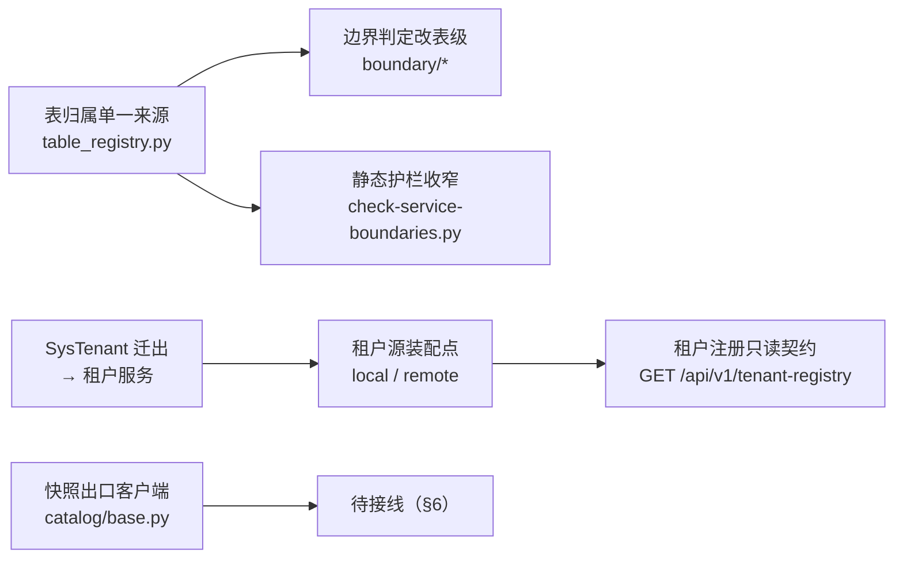

# 平台层表归属与按服务拆分实施记录

> 后端基座与服务化地基 · 06_数据拓扑升级 · 子任务 03 · 实施记录（第一轮：归属登记 + 校验收窄 + 租户注册归属）

## 1. 实施信息 

| 项 | 值 |
| --- | --- |
| 任务 | [03 平台层表归属与按服务拆分](../06_数据拓扑升级_03_平台层表归属与按服务拆分.md) |
| 对应需求 | [06-3](../../../../需求/06_需求_数据拓扑升级.md#r06-3) |
| 详细设计 | [01_详细设计_03_平台层表归属与按服务拆分](../设计/01_详细设计_03_平台层表归属与按服务拆分.md) |
| 实施日期 | 2026-09-23（第一轮；任务未收口，见 §6） |
| 实施人 | minjian |
| 实施环境 | 开发机（Ubuntu，Python 3.14 / uv）；SQLite 开发库 |
| 提交 | 代码与文档分开提交（`feat(06_03)` / `docs(06_03)`） |
| 结论 | 部分完成（归属登记与校验收窄已交付；读出口与分链余量见 §6） |

## 2. 实施概览 

结果小结：表归属登记与派生、静态 / 运行时校验收窄、租户注册模型与实现迁出、租户源装配点（`local` / `remote` 双实现）与租户注册只读契约均已落地；后端 1110 用例通过、`pyright` 0 错误、`ruff` 干净、边界护栏（含 `--self-test`）通过。

## 3. 实施过程 

1. **表归属单一来源**：新增 `bms_core/services/table_registry.py`（39 行登记：`TABLE_OWNERSHIP` 常量 + `TableRecord` + `Datasource` / `TableStatus` + 派生助手 `table_owner` / `owned_tables_for` / `chain_tables` / `infrastructure_tables` + `TableOwnershipRegistry.validate()` 与双向对账 `validate_table_ownership`）。库类别区分 `platform` / `tenant` / `archive`，基础设施表（发件箱三表）以 `OWNER_EVERY_SERVICE="*"` + `both` 表达「每服务自有」。
2. **边界判定改表级**：重写 `boundary/directory.py`（删除 `SHARED_TABLE_PREFIXES` / `is_shared_prefix` / `prefix_owner*`，改为按登记查询）、`boundary/assess.py`（基础设施表 / 未登记表名 / 自身归属放行，其余越界）；`boundary/table.py` 守卫去掉 `shared_prefixes` 入参；`boundary/exceptions.py` 例外目标改「表名或表前缀」匹配（字段名 `target_prefix` 保留）；`core/assembly.py` 守卫工厂同步。
3. **静态护栏收窄**：`scripts/tools/base-check/check-service-boundaries.py` 规则 5 增「声明表名须在归属登记中（未登记即失败）」、规则 6 声明侧按表级归属判定、例外校验改 `known_tables`；`--self-test` 重写为 12 个样例（含未登记拦截、基础设施放行、表名跨服务重复、跨服务引用、例外命中与 `access=write` 拦截）全部通过。
4. **归属迁出（`sys_tenant`）**：`SysTenant` 模型迁至 `bms_tenant/models/tenant.py`；新增租户注册仓储 `bms_tenant/repositories/tenant_registry.py`（读写入口 + 状态变更）。
5. **租户源装配点**：`db/tenant_source.py` 由「实现」改为「契约 + 装配点」（`register_tenant_lookup` / `build_tenant_lookup`，空名自动选源：租户服务 `local`、其余 `remote`）；新增远程源 `db/tenant_remote.py`（契约取数 + 缓存 + 全局版本键 `bms:global:tenant:version` 惰性比对 + 停用强制回收 + 契约不可达降级）与共享快照口径 `db/tenant_registry.py`；租户服务侧新增 `sources/tenant_source.py`（`LocalTenantSource`，直读自身平台服务库）。
6. **租户注册只读契约**：`bms_core` 新增 `catalog/base.py`（`fetch_catalog_snapshot`，供启动接库校验消费）；租户服务新增 `GET /api/v1/tenant-registry?code=|domain=`（未知 404 / 80001、停用 403 / 80002）；`application.py` 改经装配点构造租户源；配置新增 `[tenant].source`（空 = 自动）。
7. **测试随实现迁移**：`test_tenant_source.py` / `test_tenant_routing_integration.py` 随实现迁至 `services/tenant/tests/sources/`；`test_boundary.py` / `test_ordering.py` / `test_type_mapping.py` / `test_tenant_ops.py` / `test_boundary_metrics.py` 按新口径适配；契约快照重新导出（`ops/contract_snapshot.py export`，新增租户注册接口）。

## 4. 问题与处置 

| 问题 | 原因 | 处置 |
| --- | --- | --- |
| 收窄后护栏列出 6 项存量越界 | `sys_tenant` 归属租户服务但模型仍在共享基座库；`migration.py` 链表集字面量列跨归属表名；归属登记常量自身按定义引用全部表名 | 归属登记模块与迁移链表集模块按**过渡豁免**跳过引用扫描（迁移链表集豁免在分链落地后移除）；`sys_tenant` 模型随之迁出（本记录 §3.4） |
| 服务端请求普遍 503 | 租户源由「直读本库」改为「经契约取数」后，dev / 测试环境无租户服务可调用 | 按设计 §5 落地降级：契约不可达且 `env ∈ {dev,test}` 且 `allow_demo_fallback` 时按请求值构造兜底上下文并记 WARNING；生产解析失败 |
| 用户偏好 / 应用装配重复登记 | 装配点在同进程多次构建应用（测试）时重复登记 | 登记改为**幂等**（同名后登记者为准），登记点收敛到 `application.py` 与租户服务 `main.py` |
| 租户注册仓储无基类 | 归属校验要求自定义类继承基类 | `TenantRegistryRepository` 继承 `BaseObject`（薄会话绑定仓储） |
| 测试断言依赖 `sys_` 共享前缀 | 旧口径（整前缀放行）已废除 | 测试改用已登记表（`sys_tenant` / `sys_dict_type` / `sys_outbox` / `demo`）与表级归属断言 |

## 5. 验证结果 

| 门禁 | 命令 | 结果 |
| --- | --- | --- |
| 后端全量用例 | `cd backend && uv run pytest -q` | 通过（1110 passed / 36 skipped） |
| 类型检查 | `uv run pyright` | 通过（0 errors） |
| 静态检查与格式 | `uv run ruff check .` / `uv run ruff format --check .` | 通过 |
| 边界护栏（含自检） | `python3 scripts/tools/base-check/check-service-boundaries.py [--self-test]` | 通过（12 / 12 样例符合预期） |
| 契约快照一致 | `uv run python -m ops.contract_snapshot export` 后 `pytest tests/ops/test_contract_snapshot.py` | 通过（新增租户注册接口已入快照） |

## 6. 偏差与遗留 

- **偏差（已登记）**：
  1. 归属登记表 `sys_table_ownership` 的 **ORM 模型**（`bms_core/models/ownership.py`）与数据表文件、平台链迁移、种子 / 对账脚本（`ops/seed_tables.py` / `ops/check_tables.py`）**尚未落地**（模型已就位，未进链表集、未建表）。
  2. `SysModule` / `SysModuleI18n` **仍留共享基座库**（归属 `platform`，与服务目录常量同源）：其迁出与「迁移链按服务分链」互为前置（链元数据需按服务解析模型模块），故本轮只迁 `SysTenant`。
  3. 迁移链表集模块的引用扫描**过渡豁免**（`_LEGACY_CHAIN_TABLES_RELATIVE`）：分链改为由归属登记派生后**必须移除**。
  4. 租户注册版本键的递增以「读 + 1 回写」实现（`CacheRegion` 契约无原子自增；字典域有专用扩展 `DictCacheRegion`）；Redis 原生 INCR 待缓存基座扩展。
- **遗留（本轮未实施，按详细设计 §9 续做）**：
  1. `sys_table_ownership` 表文件 + 总览登记 + 平台链迁移 + `ops/seed_tables.py` / `ops/check_tables.py`（启动与 CI 双向对账）。
  2. 服务目录快照只读契约（`platform` 服务 `GET /api/v1/modules/snapshot`）+ `application.py` 启动接库校验改经契约 + `CatalogHealthCheck`（非必需项降级）。
  3. 字典 / 查询方案的跨服务读出（`HttpDictSource` / `HttpDictTranslator`，复用既有字典接口）。
  4. 迁移链按服务分链（链名 `{service}:{datasource}`、版本目录 `versions/{service}/{datasource}/`、表集由归属登记派生、`alembic.ini` 命名段与存量脚本归位）——并移除 §6 偏差 3 的过渡豁免。
  5. `SysModule` / `SysModuleI18n` 迁出至平台服务工程。
  6. Kiwi 用例登记（先登记后编码）与 §3 各项的自动化用例补齐；测试记录与文档回写（架构「数据分布」/「迁移策略」、基类清单、数据库设计总览与表文件、计划待办闭环）。
- **开放项**：生产环境下「契约不可达 + 无缓存」是否允许降级解析——本轮按**不允许**（解析失败）落地，待 07_03 网关注入接线后按实测复评。

> 依《文档生成规范》编写 · 与《测试记录》配套
