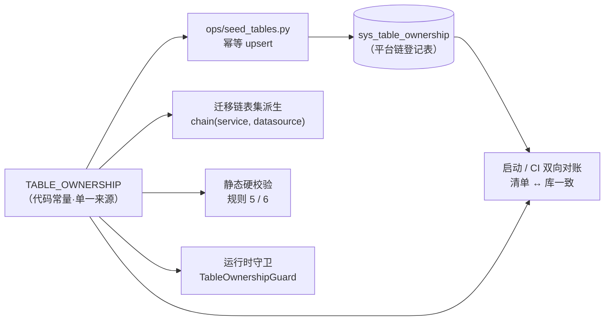
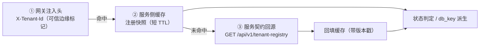

# 平台层表归属与按服务拆分详细设计

> 后端基座与服务化地基 · 06_数据拓扑升级 · 子任务 03 · 详细设计

[文档首页](../../../../../../文档首页.md) › [03 平台层表归属与按服务拆分](../06_数据拓扑升级_03_平台层表归属与按服务拆分.md) › 详细设计　|　[父任务：数据拓扑升级](../../06_数据拓扑升级.md) · [本阶段需求](../../../../需求/06_需求_数据拓扑升级.md) · [排期计划](../../../../计划/01_计划_后端基座与服务化地基.md)

## 1. 概述 <a id="overview"></a>

- **目标**：把「平台层表的服务归属」从**前缀级共享**改为**表级唯一归属**，并把共享基座库 `bms_core` 内对平台层表的直读实现按归属迁至所属服务，配套两个跨服务只读出口与「服务 × 数据源」迁移分链，使需求 06-1 的「每服务独立库 × 每租户」在平台库维度不再受阻（06_01 可真实拆分平台服务库）。
- **依据**：《[架构设计 · 数据架构](../../../../../../设计/架构设计/07_架构设计_数据架构.md)》「数据分布」「数据规范」「迁移策略」节；《[架构设计 · 多租户路由](../../../../../../设计/架构设计/12_架构设计_子系统_多租户路由.md)》「引擎注册表与生命周期」「三库命名与建库标准」节；《[微服务演进规划](../../../../../../规划/微服务演进规划.md)》「服务化地基要求与门禁」（S1 / S2）；《[后端开发规范](../../../../../../规范/后端开发规范.md)》「模块边界与数据所有权」节；《[数据库开发规范](../../../../../../规范/数据库开发规范.md)》「迁移与建表口径」节；需求 [06-3](../../../../需求/06_需求_数据拓扑升级.md#r06-3)。
- **范围（本任务）**：
  1. **表归属单一来源**：新增归属登记（代码常量 + 登记表 `sys_table_ownership` + 幂等种子 + 启动 / CI 双向对账），逐表登记「表名 → 归属服务 + 库类别」。
  2. **校验收窄**：静态硬校验（规则 5 / 6）与运行时守卫取消 `sys_` 前缀级放行，一律按**表级归属**判定；未登记表名即报错。
  3. **实现迁出**：`SysTenant` + 租户源 → `tenant` 服务；`SysModule` / `SysModuleI18n` + 服务目录仓储 → `platform` 服务；`bms_core` 内不再直读平台层表。
  4. **跨服务读出口**：新增「租户注册只读契约」与「服务目录快照只读契约」；租户上下文按「网关注入头 → 服务侧缓存 → 契约回源」三段解析；共享配置（字典取数 / 翻译）经 `platform` 服务既有字典接口以 http provider 接入。
  5. **缓存与即时失效**：租户注册 / 服务目录各设全局版本键，写方变更即 INCR，各服务按版本惰性比对重载。
  6. **迁移链按服务分链**：链名 `{service}:{datasource}`、版本目录 `alembic/versions/{service}/{datasource}/`，**表集由归属登记派生**。
- **不含（明确归口，见第 8 节）**：平台服务库的最终拆分与按服务建库（**06_01**）；多服务多库批量迁移编排、按服务连接预算与库数量可观测（**06_02**）；字典 / 查询方案的**真实数据与缓存实现**迁出（阶段八 通用能力）；事件总线真实投递与订阅失效（阶段十 M10）；网关真实 JWT 校验与 `X-Tenant-Id` 真实注入（**07_03**）；平台业务骨架表（`sys_task` / `sys_icon` / `sys_notification` / `ai_chat_log` 等）的迁移脚本补链（各所属阶段）。

## 2. 现状与差距 <a id="gap"></a>

| 关注点 | 现状 | 差距（本任务目标） |
| --- | --- | --- |
| 表归属 | `SHARED_TABLE_PREFIXES = ("sys_",)`：规则 5 对 `sys_` 前缀特例放行、规则 6 对 `sys_*` 一律不判越界 | 逐表唯一归属；`sys_` 不再整体放行；未登记表名即报错 |
| 归属登记 | 仅服务 / 模块级（`sys_module` + `SERVICE_CATALOG`），**无表级归属** | 表级归属登记（常量 + `sys_table_ownership` + 种子 + 对账） |
| 平台层表实现 | `SysTenant` / `SysModule` / `SysModuleI18n` 与 `TenantSource`、`ModuleRepository` 均在共享基座库，且直读平台库 | 按归属迁至 `tenant` / `platform` 服务；`bms_core` 无平台层表直读 |
| 租户解析取数 | `TenantSource` 直读**本进程平台库**的 `sys_tenant`（全服务共用，短 TTL 缓存） | 三段解析（注入头 → 缓存 → 契约回源）+ 版本键即时失效 |
| 启动接库校验 | `_validate_service_catalog` 直读本进程平台库 `sys_module`，不可读即抛 `CatalogError` | 经 `platform` 服务契约取快照；不可达告警放行 + 就绪探针体现 |
| 共享配置（字典 / 查询方案） | `dict_source` / `dict_translator` 的 `sql` provider 读**本服务租户库**的字典表 | 归 `platform` 服务；其他服务经 http provider 读出口（契约不变、只换实现） |
| 迁移链 | 三链（`platform` / `tenant` / `archive`），表集写死在 `migration.py` 常量 | 链名 `{service}:{datasource}`，表集**由归属登记派生** |

现状事实（探索结论，供实施对照）：`SERVICE_CATALOG` 16 行（9 个已建服务 + `workflow` 计划中 + 6 个产品模块）；`bms_core` 侧平台层模型 13 张表 / 服务侧 6 张表；`SHARED_TABLE_PREFIXES` 共 5 处使用点（`boundary/directory.py` 定义、`assess.py`、`table.py`、`core/assembly.py`、`scripts/tools/base-check/check-service-boundaries.py`）。

## 3. 交付物清单 <a id="tree"></a>

```text
backend/
├── libs/bms_core/src/bms_core/
│   ├── services/
│   │   ├── module_registry.py                     # 既有：服务目录（不改口径）
│   │   └── table_registry.py                      # 新增：表归属单一来源（TABLE_OWNERSHIP / TableRecord / TableRegistry / 派生助手）
│   ├── boundary/
│   │   ├── directory.py                           # 改：删 SHARED_TABLE_PREFIXES，新增按登记的表级归属查询
│   │   ├── assess.py                              # 改：判定改为表级归属（未登记即越界，不再按前缀放行）
│   │   ├── table.py                               # 改：运行时守卫按登记归属判定
│   │   └── exceptions.py                          # 改：例外校验的 known 来源改表级归属
│   ├── catalog/                                   # 新增：服务目录只读出口客户端（启动接库校验用）
│   │   ├── base.py                                #   CatalogSnapshotClient 契约 + 快照结构
│   │   └── http.py                                #   经 service_client 取快照实现（不可达降级语义）
│   ├── db/
│   │   ├── tenant.py                              # 改：解析链保留；新增三段解析编排（注入头 → 缓存 → 契约）
│   │   ├── tenant_source.py                       # 迁出：租户源实现移入 tenant 服务（见 §4.3）
│   │   ├── bootstrap.py                           # 改：db_key_for 与表集改由分链派生
│   │   └── migration.py                           # 改：链名 {service}:{datasource}、表集由 table_registry 派生
│   ├── models/platform.py                         # 迁出：SysModule/SysModuleI18n → platform 服务；SysTenant → tenant 服务
│   ├── repositories/module_repository.py          # 迁出：→ platform 服务
│   ├── dict/                                      # 新增 http provider（取数 / 翻译），复用既有契约
│   │   ├── http.py                                #   HttpDictSource / HttpDictTranslator
│   │   └── cache.py                               #   版本键（复用既有 DictCacheRegion）
│   ├── cache/                                     # 新增域版本键助手（租户 / 目录）
│   └── health/checks.py                           # 改 / 新增 CatalogHealthCheck（非必需项，降级可见）
├── libs/bms_core/src/bms_core/application.py       # 改：启动接库校验改经契约快照 + 降级放行
├── services/tenant/src/bms_tenant/
│   ├── models/tenant.py                           # 新增：SysTenant 落户
│   ├── repositories/tenant_registry.py            # 新增：租户注册仓储（含写路径失效入口）
│   ├── sources/tenant_source.py                   # 迁入：租户源（本地实现）
│   └── api/tenant_registry.py                     # 新增：租户注册只读契约接口
├── services/platform/src/bms_platform/
│   ├── models/catalog.py                          # 新增：SysModule / SysModuleI18n 落户
│   ├── repositories/module_repository.py          # 迁入：服务目录仓储
│   ├── api/modules.py                             # 改：新增快照只读接口
│   └── api/dict.py                                # 既有：字典取数接口（http provider 消费）
├── ops/
│   ├── seed_tables.py                             # 新增：表归属幂等种子
│   ├── check_tables.py                            # 新增：表归属双向对账（离线 / 接库）
│   ├── seed_tenant.py / seed_module.py            # 改：改用所属服务包 + 分链
│   └── migrate_tenants.py                         # 改：链名改分链形态（编排重做归 06_02）
├── alembic/
│   ├── versions/{service}/{datasource}/           # 改：版本目录按「服务 × 数据源」归位（存量脚本迁移）
│   └── versions/{service}/platform/0005_sys_table_ownership.py   # 新增：归属登记表迁移
└── alembic.ini                                    # 改：命名段按分链登记 version_locations
```

## 4. 领域设计 <a id="design"></a>

### 4.1 表归属单一来源 <a id="ownership"></a>

**单一来源**：`bms_core/services/table_registry.py` 的声明式常量 `TABLE_OWNERSHIP`（`TableRecord`：`table_name` / `owner`（归属服务标识，取 `service_key`；未建服务用预留标识）/ `datasource`（`platform` / `tenant` / `archive`）/ `status`（`enabled` / `planned`）/ `note`）。落库为平台链表 `sys_table_ownership`（字段同构，`(table_name, deleted_at)` 复合唯一），经 `ops/seed_tables.py` 幂等 upsert，启动与 CI 双向对账（口径完全复用 03_01 / 03_02 的服务目录模式：清单 ↔ 库不一致即拒）。

**归属清单（本期，`status = enabled`）**：

| 表 | 归属服务 | 库类别 | 说明 |
| --- | --- | --- | --- |
| `sys_tenant` | `tenant` | platform | 租户注册（模型迁出，见 §4.3） |
| `sys_module` / `sys_module_i18n` | `platform` | platform | 服务目录与契约登记（模型迁出） |
| `sys_outbox` / `sys_event_consumed` / `sys_event_dead_letter` | 每服务自有 | platform + tenant | 基础设施表：不参与跨服务归属判定，**每个服务的两条链各含三表** |
| `sys_dict_type` / `sys_dict_item` / `sys_dict_type_i18n` / `sys_dict_item_i18n` / `sys_dict_attr` / `sys_dict_attr_i18n` | `platform` | tenant | 字典：其他服务经读出口（§4.4） |
| `sys_query_scheme` | `platform` | tenant | 查询方案（当前仅 `platform` 服务使用，无跨服务需求） |
| `sys_task` / `sys_task_log` / `sys_user_preference` / `sys_icon` / `sys_icon_i18n` | `platform` | tenant | 平台业务骨架表（现落 platform 服务，随所属阶段补迁移脚本） |
| `sys_notification` | `notification` | tenant | 通知（02_03 已归属） |
| `ai_chat_log` | `ai` | tenant | AI 交互审计（02_03 已归属） |
| `demo` | `platform` | tenant | 平台服务五层示例表（演示资产） |

**预留归属（`status = planned`，库位「寄放」在当前平台服务库，随该服务建设动迁）**：

| 表 | 预留归属 | 说明 |
| --- | --- | --- |
| `sys_menu` / `sys_business` / `sys_action` | `permission` | 平台菜单与业务 / 动作权限码（权限服务未建） |
| `sys_form` / `sys_field` / `sys_button` / `sys_form_layout` / `sys_field_ext` | `platform` | 表单定制（现由 platform 服务 `sys` 域承载；最终归属随表单定制阶段复评，见第 8 节） |
| `sys_admin` / `sys_user_identity` / `sys_session` / `sys_account_lock` / `sys_identity_provider` / `sys_client` | `identity` | 平台超管与认证身份类表 |
| `sys_tenant_quota` / `sys_tenant_module` | `tenant` | 租户配额与模块开关 |
| `sys_ai_provider` | `ai` | AI 端点配置 |
| `wf_*` | `workflow` | 工作流（`planned` 服务） |
| `rpt_*` | `report` | 报表 |
| `sys_file` / `rpt_dataset` 等其余架构已定表 | 对应服务 | 租户库其余表随所属服务建设时按同一机制登记（机制就位即不再需要专项） |

**校验口径**（与 03_02 同源）：
- 归属标识必须存在于服务目录（`SERVICE_CATALOG` 的 `service_key` ∪ `module_key` ∪ 预留服务标识集），否则拒；
- 表名唯一；`table_name` 前缀须与归属服务的 `table_prefix` 一致（`sys_*` 例外：平台共享前缀，按表级归属判定）；
- `datasource` ∈ {`platform` / `tenant` / `archive`}；
- 未登记表名出现在源码 `__tablename__` 或跨服务引用中 → 失败（规则 5 / 6，见 §4.2）。



### 4.2 校验收窄 <a id="static"></a>

- **常量**：删除 `boundary/directory.py::SHARED_TABLE_PREFIXES` 与 `is_shared_prefix`；新增 `table_owner(table) -> str | None`（按 `TABLE_OWNERSHIP` 查，未登记返回 `None`）、`owned_tables_for(service)`、`known_tables()`、`INFRASTRUCTURE_TABLES`（发件箱三表，判定时放行）。
- **静态规则 5**（表 / 表前缀跨服务唯一）：保留「表名跨服务唯一」，**删除 `sys_` 前缀特例**；前缀冲突判定改为「同一前缀被两个服务声明即失败（含 `sys_`，但 `sys_` 前缀的**表级**归属仍可为多服务，故前缀冲突判定对 `sys_` 前缀仅在**同表号段**冲突时失败）」——落点为「表级归属优先、前缀仅作辅助检查」。
- **静态规则 6**（跨服务库访问）：`assess_table` / `assess_statement` 的判定改为：`table ∈ INFRASTRUCTURE_TABLES` → 放行；`table_owner(table) is None` → **未登记即失败**；`owner == service` → 放行；命中只读例外 → 放行并计数；否则失败。
- **运行时守卫**：`TableOwnershipGuard` 的 `shared_prefixes` 参数取消，改注入归属查询函数（与静态校验同源）；`off` / `warn` / `enforce` 三模式不变，越界仍抛 `DataOwnershipError`（10008）；指标 `bms_boundary_cross_access_total` 增加 `scope="database"` 维度时同步（本任务只保留既有维度，见第 8 节）。
- **自检**：`check-service-boundaries.py --self-test` 增补样例（未登记表名被拦、基础设施表放行、他服务表被拦、只读例外放行）。
- **消费方影响**：`core/assembly.py`（守卫工厂）、`scripts/tools/base-check/check-service-boundaries.py`、`scripts/tools/governance/boundary_metrics.py` 三处随常量删除同步改；`deploy/boundaries/data_ownership_exceptions.json` 结构不变（`target_prefix` 语义改为「表名或前缀」——**字段名保持 `target_prefix` 不变**，避免白名单格式破坏）。

### 4.3 实现迁出 <a id="move"></a>

| 符号 | 迁出前 | 迁出后 | 连带改动 |
| --- | --- | --- | --- |
| `SysTenant` | `bms_core/models/platform.py` | `bms_tenant/models/tenant.py` | `ops/seed_tenant.py`、`ops/migrate_tenants.py`、租户注册仓储新建 |
| `TenantSource` | `bms_core/db/tenant_source.py` | `bms_tenant/sources/tenant_source.py`（本地实现，读本服务平台库即 `bms_tenant` 平台库） | `application.py` 的 `app.state.tenant_source` 装配改为「远程租户源」；`api/deps.py`、`api/middleware.py`、`db/tenant.py` 的取用处保持（用 `TenantLookup` 契约，不判实现） |
| `SysModule` / `SysModuleI18n` | `bms_core/models/platform.py` | `bms_platform/models/catalog.py` | 迁移链平台列表集声明、`ops/seed_module.py` |
| `ModuleRepository` | `bms_core/repositories/module_repository.py` | `bms_platform/repositories/module_repository.py` | `application.py` 启动校验、`ops/check_modules.py`、`bms_platform/api/modules.py` |
| `_validate_service_catalog` | `bms_core/application.py`（直读平台库） | 改为经 `catalog` 出口客户端取快照（§4.4 / §4.7） | 保留函数名与调用位置（`service_lifespan` 内），内部实现替换 |

**契约保持**：`bms_core/db/tenant.py::TenantLookup` Protocol（`by_code` / `by_domain`）**签名不变**，`DEMO_TENANT` 兜底语义不变；`bms_core` 侧新增「远程租户源」实现（`bms_core/db/tenant_remote.py`），装配到 `app.state.tenant_source`，实现与 `TenantLookup` 一致。`ops/` 脚本属运维侧工具（不在服务边界扫描范围），允许 import 所属服务包读取模型，口径登记于设计（不新增护栏白名单）。

### 4.4 跨服务读出口 <a id="reads"></a>

| 出口 | 提供方 | 接口（新增） | 消费方 | 说明 |
| --- | --- | --- | --- | --- |
| 租户注册只读 | `tenant` 服务 | `GET /api/v1/tenant-registry?code=` / `?domain=` | 全部服务的租户解析（缓存未命中时） | 返回注册快照（编码 / 名称 / 域名 / 状态 / 到期）；未知租户 404（80001）、停用 403（80002）语义与现状一致 |
| 服务目录快照只读 | `platform` 服务 | `GET /api/v1/modules/snapshot` | 全部服务的启动接库校验 | 全量清单（不分页），字段与 `sys_module` 登记一致，供 `validate_catalog` 对账 |
| 字典取数 / 翻译 | `platform` 服务 | **复用既有** `GET /api/v1/dicts/{dict_type}/items`（支持版本比对与按值子集） | 其他服务的 `HttpDictSource` / `HttpDictTranslator` | 不新增接口：翻译按「取子集 → 本地映射」实现，避免超大字典拉全量 |

**实现口径**：三处均经 05_01 的 `service_client`（`HttpServiceClient`，含超时 / 重试 / 熔断 / 降级策略，`base_url_template` 缺省 `http://{service}:8000`）；请求路径以 `/api/v1` 开头（`validate_service_request` 已强制）；目标服务须 `service_enabled`。**鉴权**：本期无服务身份 JWT，出口为内部接口（网关按服务前缀路由），真实鉴权随 07_03（登记遗留）。

### 4.5 缓存与版本键即时失效 <a id="cache"></a>

**三段解析**（租户上下文，替换现「直读平台库」）：



- **缓存域与 key**：复用缓存能力域 `CacheRegion`；租户注册域 `tenant`（平台数据，key 租户位取 `global`，沿用 `bms_core/cache/base.py::build_cache_key`）；服务目录域 `catalog`。
- **版本键**：租户 `bms:global:tenant:version`、目录 `bms:global:catalog:version`（`INCR`，持久）；缓存值带版本戳，读取时按版本惰性比对（与字典版本键 `bms:{tenant}:dict:version` 同模式，复用 `is_stale` / `get_global_version` 既有语义）。
- **写方**：`tenant` 服务（开通 / 停用 / 改名 / 到期变更）与 `platform` 服务（目录种子 / 升格）在写事务提交后 INCR 对应版本键；**停用租户**仍执行「强制回收引擎」（`EngineRegistry.release`）不变。
- **降级**：缓存实现为 `null`（无 Redis / 测试）时直连契约回源，不阻断；契约不可达且无缓存时，注入头命中场景按「仅有编码」构造上下文（`TenantContext(tenant_code=…, db_key=…, name=…)`）并记 WARNING——**仅限开发 / 测试**（生产要求契约可达，见第 5 节）。

### 4.6 迁移链按服务分链 <a id="chains"></a>

- **链名**：`{service}:{datasource}`（如 `platform:platform`、`tenant:platform`、`org:tenant`）；`archive` 链同样服务化（`{service}:archive`，当前空表集）。
- **版本目录**：`alembic/versions/{service}/{datasource}/`；存量脚本按归属归位（`versions/platform/*` → `versions/platform/platform/*`、`versions/tenant/*` → `versions/platform/tenant/*`，其余服务建空目录直到有脚本）。
- **表集派生**：`chain_tables(service, datasource)` = `TABLE_OWNERSHIP` 中 `owner == service 且 datasource 匹配` ∪ `INFRASTRUCTURE_TABLES`（发件箱三表每服务每链）；平台服务的平台链额外含 `sys_table_ownership`（本任务新增登记表）。
- **配置段**：`alembic.ini` 命名段按分链登记 `version_locations`（**Alembic 在 `env.py` 之前读该字段，故必须写在 ini**）；缺省段 `[alembic]` 指向 `platform:tenant`（保持「直接 `alembic upgrade head` = 平台服务的租户库」向后兼容语义）。
- **执行入口**：`resolve_chain("{service}:{datasource}")`、`chain_url(chain, settings)`、`upgrade_chain` / `current_revision` / `head_revision` 签名不变（仅链定义变化）；`db_key_for(chain)` 由链名派生 `{service}` 与数据源键。
- **边界**：本任务只落**机制**（链注册、目录归位、表集派生、单链执行）；**遍历服务 × 租户的批量编排、幂等与自动执行、连接预算与库数量可观测归 06_02**。

### 4.7 启动期接库校验降级 <a id="startup"></a>

- 流程：启动 → `catalog` 出口客户端经 `service_client` 调 `GET /api/v1/modules/snapshot` → `validate_catalog(SERVICE_CATALOG, records, service_key=…, contract_version=…)` → 有冲突抛 `CatalogError`（语义不变，冲突即拒）。
- 降级：快照不可达 / 超时 → 记 WARNING 并放行启动，置 `app.state.catalog_degraded = True`；`/readyz` 的 `checks` 增加 `catalog` 项（`{ok: false, error: "ServiceUnavailable"}`），**该项标记为非必需**（不参与整体就绪判定，不产生 503），使降级可观测但不引发雪崩。
- 强门禁：CI 侧离线校验（`ops/check_modules.py` 的 `check_offline` / `check_catalog_db`）+ 表归属对账（`ops/check_tables.py`）为**硬门禁**，不依赖运行时。

### 4.8 与相邻能力域 / 任务分工 <a id="boundary"></a>

| 相邻 | 分工 |
| --- | --- |
| `boundary` 能力域（05_02） | 本任务**收窄其归属数据源**（前缀放行 → 表级归属），判定式与三模式守卫、错误码 10008、指标名均不变 |
| `service_client` 能力域（05_01） | 本任务只**消费**：两个只读出口经其调用，不新增其契约 |
| `cache` 能力域（阶段八前已有 L1 / Region） | 本任务只**新增版本键使用方式**（全局版本键 + 惰性比对），不新增缓存实现 |
| `09_03` 契约门禁 | 两个新增接口纳入契约快照与 oasdiff 基线（消费方标注见第 7 节） |
| `06_01` / `06_02` | 06_01 承接平台服务库真实拆分与建库路由；06_02 承接批量编排、连接预算、库数量可观测 |

## 5. 失败分支与边界 <a id="failures"></a>

| 场景 | 行为 |
| --- | --- |
| `sys_table_ownership` 未登记某表，而该表在源码 `__tablename__` 出现 | 规则 5 失败（未登记即拒）；`ops/check_tables.py` 输出缺失清单 |
| 服务引用他服务表（SQL / `ForeignKey` / 表名 token） | 规则 6 失败；已登记只读例外则放行并计数 |
| 运行期 SQL 触及他服务表 | 守卫按模式处置（`warn` 计数告警 / `enforce` 抛 10008） |
| 租户注册契约不可达且无缓存 | 开发 / 测试：按注入头构造上下文 + WARNING；**生产：租户解析失败（`TenantNotFoundError` 语义边界）**，登记为 07_03 前的过渡口径（见第 8 节） |
| 租户已停用但缓存未过期 | 版本键比对不符即重载 → 状态判定拒绝（`TenantSuspendedError`）+ 引擎强制回收 |
| 服务目录快照不可达 | 启动告警放行 + `/readyz` `catalog` 项降级；CI 硬门禁保证一致性 |
| 字典读出口不可达 | `HttpDictSource` 按 `ServiceCallPolicy` 重试 / 熔断 → 返回空结果并标记降级（与字典 null 实现同语义，不抛业务错） |
| 链表集与归属登记不一致 | `head_revision` / `chain_tables` 对账失败即 CI 拒（零漂移断言） |
| 存量迁移脚本目录迁移 | 迁移脚本内容与 revision 不变，仅目录归位；`alembic.ini` 段与 `version_locations` 同步，否则 Alembic 报「目录不存在」 |

## 6. 测试设计与验收映射 <a id="tests"></a>

| 完成标准 | 测试设计 | 落点 |
| --- | --- | --- |
| 平台层每张表有唯一归属且校验生效 | 归属常量与派生（表集 / 归属查询 / 唯一性 / 未登记拒绝）；种子幂等 + 双向对账 | `tests/boundary/test_table_registry.py`、`tests/ops/test_table_ownership_ops.py` |
| 未登记 / 跨服务引用被拒 | 静态规则 5 / 6 收窄用例（未登记拦、基础设施放行、他服务表拦、只读例外放行）+ 脚本 `--self-test` | `tests/boundary/test_boundary.py`、`scripts/tools/base-check/check-service-boundaries.py --self-test` |
| `bms_core` 无平台层表直读 | AST / import 断言：`bms_core` 内无 `SysTenant` / `SysModule` 引用；运行时守卫三模式 | `tests/crosscut/test_module_boundary.py`、`tests/boundary/test_boundary.py` |
| 租户解析三段与即时失效 | 注入头 / 缓存 / 契约三段解析；版本键变更后重载；停用拒绝与引擎回收 | `tests/db/test_tenant_remote.py`、`tests/services/tenant/test_tenant_registry.py` |
| 启动接库校验经契约 + 降级 | 快照对账通过 / 冲突拒 / 不可达告警放行 + `/readyz` `catalog` 降级 | `tests/core/test_catalog_contract.py`、`tests/health/test_catalog_check.py` |
| 字典 http provider | 取数与翻译（含子集）映射正确、不可达降级 | `tests/dict/test_http_dict.py` |
| 迁移链按服务 × 数据源 | 链名解析、版本目录存在性、表集由登记派生、单链 head / 零漂移 | `tests/alembic/test_alembic_chains.py`、`tests/alembic/test_alembic_drift.py` |

- **Kiwi TCMS**：一任务一条用例；**先登记取得编号再编码**（设计定稿后登记，编号回填本节与代码 `@pytest.mark.kiwi_id(N)`）。
- **验收映射**：需求 06-3 四条完成标准逐条对应上表；门禁 = `pytest` / `ruff check` / `ruff format --check` / `pyright` / `check-base.py` / `check-links.py` / `check-status.py --strict` / `check-service-boundaries.py`。

## 7. 登记落点 <a id="registry-writeback"></a>

| 落点 | 内容 |
| --- | --- |
| 《架构设计 · 数据架构》 | 「数据分布」节补「平台层表归属登记」与「基础设施表每服务自有」口径；「迁移策略」节链形态改为「服务 × 数据源」 |
| 《架构设计 · 多租户路由》 | §3 引擎注册表与 §8 三库命名与建库标准：补表归属与跨服务只读出口口径 |
| 《后端基类清单》 | 新增 `TABLE_OWNERSHIP` / `TableRegistry`、`catalog` 出口客户端、`HttpDictSource` / `HttpDictTranslator`、`CatalogHealthCheck`；标注 `TenantSource` / `ModuleRepository` 归服务 |
| 《后端开发规范》 | 「模块边界与数据所有权」节：归属判定口径由前缀改为表级，补「运维侧允许读服务模型」口径 |
| 《数据库设计总览》 + 数据表文件 | 新增表文件 `sys_table_ownership.md` 并在「已设计数据表登记」登记；其余表文件的「归属服务 / 库类别」栏随登记回写 |
| 《数据库开发规范》 | 「迁移与建表口径」节：链名 `{service}:{datasource}`、表集由归属登记派生 |
| 05_02 设计 / 实施记录 | 归属数据源变更（前缀 → 表级）回写，说明规则 5 / 6 判定式调整 |
| 03_01 / 03_02 设计 | 服务目录新增表归属登记（`sys_table_ownership`）与对账扩展 |
| 计划 | 「后续阶段待办」第 9 项闭环（已立项 06_03）；06_01 / 06_02 的任务与窗口依赖回写 |
| 任务 / 计划状态 | 06_03 状态与完成日期；父任务 06 与阶段二计划两处一致 |
| 消费方标注 | 06_01（平台服务库拆分）、06_02（分链批量编排）、08_01 / 08_02（`catalog` 探针与指标）、09_03（两个新接口入契约快照） |

## 8. 边界与开放项 <a id="boundary"></a>

- **明确归 06_01**：平台服务库 `bms_{service}` 的真实拆分与建库、库键服务化（`platform_{service}` / `tenant_{service}_{code}`）、越界拒绝的库维度落地。
- **明确归 06_02**：遍历服务 × 租户的批量迁移编排与幂等、自动执行、按服务连接预算、库数量可观测。
- **明确归阶段八**：字典 / 查询方案的真实数据、写路径、缓存实现迁出（本任务只落归属与http读出口）。
- **明确归 07_03**：网关注入 `X-Tenant-Id` 的真实实现（本任务按「注入头存在即用」设计，未注入时走缓存 / 契约）；两个新增内部接口的真实鉴权（服务身份 JWT）。
- **明确归阶段十（M10）**：事件总线真实投递与订阅式失效（本任务用版本键替代）。
- **开放项**：
  1. 表单三表（`sys_form` / `sys_field` / `sys_button`）最终归属（现登记 `platform`）随表单定制阶段复评；
  2. `ops/` 运维脚本直读服务模型的长期口径（现行设计允许；若后续设「运维专用读接口」，届时收窄）；
  3. `deploy/boundaries/data_ownership_exceptions.json` 中 `target_prefix` 字段名保留不变，语义已扩为「表名或前缀」，字段重命名随下次白名单格式升级；
  4. 生产环境下「契约不可达 + 无缓存 + 仅注入头」是否允许降级解析——本任务按**不允许**（解析失败）落地，待 07_03 后按实测复评；
  5. 达梦模式下的分链版本目录与 schema 参数组合在 06_02 真库演练中复核。

## 9. 实施步骤 <a id="steps"></a>

1. **表归属单一来源**：新增 `bms_core/services/table_registry.py`（常量 + 记录 + 派生助手 + 校验）与其用例。
2. **登记表与种子**：新增 `sys_table_ownership` 表文件 → ORM 模型 → 平台链迁移 `0005_sys_table_ownership` → `ops/seed_tables.py` 幂等 upsert → `ops/check_tables.py` 双向对账。
3. **校验收窄**：改 `boundary/directory.py` / `assess.py` / `table.py` / `exceptions.py` 与 `core/assembly.py` 守卫工厂；改 `check-service-boundaries.py` 规则 5 / 6 与 `--self-test`；跑全量存量扫描并处置越界项（必要时登记只读例外）。
4. **实现迁出**：`SysTenant` → `tenant` 服务；`SysModule` / `SysModuleI18n` + `ModuleRepository` → `platform` 服务；同步 `ops/*` 与迁移链表集声明；`bms_core` 内删除直读实现。
5. **读出口**：`tenant` 服务新增租户注册只读接口与读写仓储（含版本键 INCR）；`platform` 服务新增目录快照接口；`bms_core` 新增 `catalog` 出口客户端与远程租户源（三段解析 + 版本键比对）。
6. **启动校验改造**：`application.py::_validate_service_catalog` 改经快照；新增 `CatalogHealthCheck`（非必需项）并接线 `HealthCheckRegistryFactory`。
7. **字典 http provider**：`bms_core/dict/http.py`（`HttpDictSource` / `HttpDictTranslator`）+ 装配登记 + 配置项（`[dict_source].provider = "http"` 供非 platform 服务）。
8. **迁移链按服务分链**：`migration.py` 链定义与表集派生、`db/bootstrap.py::db_key_for`、`alembic.ini` 段与版本目录归位（存量脚本按归属移动）、`ops/migrate_tenants.py` 链名适配。
9. **Kiwi 登记 + 自动化用例**：先登记取编号，再落 §6 用例并标注 `kiwi_id`。
10. **门禁与记录**：全量 `pytest` / `ruff` / `pyright` / 基座与链接校验全绿；`check-service-boundaries.py`（含 `--self-test`）通过；写实施记录与测试记录；登记回写（第 7 节）；代码与文档分开提交；偏差与遗留闭环另提。

关键命令：

```bash
cd backend
uv run pytest -q
uv run ruff check . && uv run ruff format --check . && uv run pyright
uv run python -m ops.seed_tables --dry-run && uv run python -m ops.seed_tables
uv run python -m ops.check_tables
cd .. && python3 scripts/tools/base-check/check-service-boundaries.py --self-test
```

## 10. 决策记录（对齐记录） <a id="align"></a>

| # | 决策 | 结论 | 来源 |
| --- | --- | --- | --- |
| 1 | 平台库共享问题路线 | 「表归属 → 逐表迁出 → 拆库」；本任务承担前两步与分链，**不含拆库**（拆库归 06_01） | 专项讨论（2026-09-23）S1 / N1 |
| 2 | 租户解析数据来源 | 网关注入为主 + 服务侧缓存 + 版本键失效；未命中经契约回源 | S3 / T7 |
| 3 | 表归属登记落点 | 服务目录侧新增登记表 `sys_table_ownership` | T1 / T9 |
| 4 | 归属数据来源与对账 | 代码常量 + 幂等种子 + 启动 / CI 双向对账（同服务目录模式） | T10 |
| 5 | 未建服务的表归属 | 预留归属标识 + 库位「寄放」平台库，随服务建设动迁 | T2 |
| 6 | 基础设施表（发件箱三表） | 每服务自有，不参与跨服务归属判定 | T3 |
| 7 | 校验收窄强度 | 取消 `sys_` 前缀级放行，一律按表级归属；未登记即拒 | T4 |
| 8 | 本期迁出范围 | 平台层表全部迁出 + 两个读出口（租户注册 / 服务目录）；租户链字典实现迁出留阶段八 | T5 |
| 9 | 共享配置读出 | 经 `platform` 服务契约读出（http provider），不做只读共享表、不做每服务副本 | T6 |
| 10 | 启动接库校验降级 | 契约取快照；不可达告警放行 + `/readyz` `catalog` 非必需项降级；CI 为硬门禁 | T11 |
| 11 | 迁移链形态 | 链名 `{service}:{datasource}`，版本目录 `versions/{service}/{datasource}/`，表集由归属登记派生 | T8 |
| 12 | 分链职责边界 | 机制归本任务，批量编排归 06_02 | T12 |
| 13 | 库键服务化与建库 | `platform_{service}` / `tenant_{service}_{code}`、按服务建库与越界拒绝归 06_01；建库入口新增 `ops/provision_tenant.py` | Q1 / Q2 / N1 |
| 14 | 开发环境启用 | `config.dev.toml` 启用每服务每租户模板（基础默认不变） | Q4 |

## 11. 参考文档 <a id="ref"></a>

- 《[架构设计 · 数据架构](../../../../../../设计/架构设计/07_架构设计_数据架构.md)》「数据分布」「数据规范」「迁移策略」节
- 《[架构设计 · 多租户路由](../../../../../../设计/架构设计/12_架构设计_子系统_多租户路由.md)》「引擎注册表与生命周期」「三库命名与建库标准」「隔离边界」节
- 《[微服务演进规划](../../../../../../规划/微服务演进规划.md)》「设计原则」「服务化地基要求与门禁」节
- 《[后端开发规范](../../../../../../规范/后端开发规范.md)》「模块边界与数据所有权」节；《[数据库开发规范](../../../../../../规范/数据库开发规范.md)》「迁移与建表口径」节
- 《[后端基类清单](../../../../../../后端基类清单.md)》
- 需求 [06-3](../../../../需求/06_需求_数据拓扑升级.md#r06-3)；前置任务 [01_02 详细设计](../../../01_后端基座真实实现/01_后端基座真实实现_02_多租户数据拓扑落库与实测/设计/01_详细设计_02_多租户数据拓扑落库与实测.md)、[05_01 详细设计](../../../05_服务间通信与一致性/05_服务间通信与一致性_01_服务契约与同步调用/设计/01_详细设计_01_服务契约与同步调用.md)、[05_02 详细设计](../../../05_服务间通信与一致性/05_服务间通信与一致性_02_数据所有权与边界硬校验/设计/01_详细设计_02_数据所有权与边界硬校验.md)

> 本设计按《[文档生成规范](../../../../../../规范/文档生成规范.md)》与《[AI 开发规范](../../../../../../规范/AI开发规范.md)》编写 · 关键决策逐项确认
