# 租户解析与库键派生健壮性实施记录

> 后端基座与服务化地基 · 06 数据拓扑升级 · 04 租户解析与库键派生健壮性 · 实施记录

[文档首页](../../../../../../文档首页.md) › [04 租户解析与库键派生健壮性](../06_数据拓扑升级_04_租户解析与库键派生健壮性.md) › 实施　|　[详细设计](../设计/01_详细设计_04_租户解析与库键派生健壮性.md) · [测试记录](../测试/01_测试_04_租户解析与库键派生健壮性.md)

## 1. 实施信息 

| 项 | 值 |
| --- | --- |
| 任务 | [04 租户解析与库键派生健壮性](../06_数据拓扑升级_04_租户解析与库键派生健壮性.md) |
| 对应需求 | [06-4](../../../../需求/06_需求_数据拓扑升级.md#r06-4) |
| 详细设计 | [01_详细设计_04_租户解析与库键派生健壮性](../设计/01_详细设计_04_租户解析与库键派生健壮性.md) |
| 实施日期 | 2026-09-24 |
| 实施人 | minjian |
| 实施环境 | 开发机（Ubuntu，Python 3.14.4 / uv / 无本地 docker）；复现与验证用本机 `BMS_ENV=dev` + SQLite 起真实服务，Schemathesis 以 `uvx --from schemathesis==4.28.0` 同版本同参数运行（CI 走固定 tag 容器镜像，参数口径一致） |
| 提交 | 代码与文档分开提交（`docs(06_04)` / `feat(06_04)` / `test(06_04)` / `docs(06_04)`） |
| 结论 | 完成（工时按 6h 交付；本地门禁全绿 + 同口径 Schemathesis 由 7 failures 转 462 passed / exit 0） |

```mermaid
flowchart LR
    A["Issue #47 / 流水线 #362<br/>contract-smoke-platform 7 处 5xx"] --> B["本地同口径复现<br/>7 failures（同文案同端点）"]
    B --> C["定位根因链<br/>IP 主机名→当子域名→兜底当编码→非法库名→500"]
    C --> D["设计：来源形态先于取数 + 兜底收口"]
    D --> E["实施：tenant.py 形态判定 / tenant_remote.py 兜底"]
    E --> F["护栏：bms_core 形态用例 + platform dev 端点零 5xx 用例"]
    F --> G["门禁转阻断：CI 去 allow_failure + 档位/规范/规划/说明同步"]
    G --> H["验证：本地门禁 + 同口径 Schemathesis 462 passed"]
    H --> I["回写 + 记录 + 提交（推送待确认）"]
```

## 2. 实施概览 

## 3. 实施过程 

1. **缺陷定位**：从 GitLab Issue #47 与流水线 #362 job `3369` 取证（`Server error: 7`、`allow_failure: true`）。按 CI 同口径在开发机复现——`config.dev.toml` 启用「每服务每租户」URL 模板的 dev 服务 + Schemathesis 同版本同参数，**精确复现 7 failures**，错误文案一律 `库名形态非法：bms_platform_127.0.0.1`。**更正原归口判断**：与「dev 未迁移表 / 无 Redis 依赖」无关。
2. **根因链**：`tenant_hostname` 以「≥ 三段主机名」判子域名 → `Host: 127.0.0.1:8000`（四段）被判为带子域名的租户域名 → `RemoteTenantSource.by_domain` 取数时租户注册契约不可达 → dev 兜底把该值**原样**当租户编码 → 库键 `tenant_platform_127.0.0.1` → 库名 `bms_platform_127.0.0.1` 形态非法 → `ConfigError`(40001) 冒泡为 500。
3. **实施（基座）**：`db/tenant.py` 新增 `is_tenant_code` / `is_tenant_domain` / `is_local_hostname` 三个纯函数形态判定；`tenant_hostname` 收紧为「IP 字面量（IPv4 / IPv6）与本机名一律 `None`、域名形态非法一律 `None`」；`resolve_request_tenant` 的编码类来源（`X-Tenant-ID` / token 租户位）先过形态校验，形态非法视为未命中（新增私有 `_usable_code`）。
4. **实施（兜底）**：`db/tenant_remote.py::_resolve` 的兜底分支加条件——仅 `kind == "code"` 且编码形态合法才按请求值构造快照，否则抛 `TenantNotFoundError`（4xx / 80001），避免派生形态非法的库名并以 5xx 暴露；其余降级口径（不允许兜底时 503）不变。
5. **护栏用例**：`bms_core/tests/db/test_tenant.py`（形态判定边界 + 非法来源等同未命中：dev 回落演示租户、prod 抛未命中）、`test_tenant_remote.py`（契约不可达 + 域名 / 非法编码兜底 → 未命中）；新增 platform 服务侧 `tests/api/test_dev_contract_endpoints.py`（启用每服务每租户模板 + `Host: 127.0.0.1:8000`，契约全部 GET 端点零 5xx + 解析结果落演示租户）。
6. **门禁转阻断**：`.gitlab-ci.yml` 的 `.contract-smoke-service` 锚点移除 `allow_failure: true`（9 个 job 一处收口，注释说明转阻断依据与时间）；`deploy/ci/verify/contract-gate` 档位说明、《契约门禁与契约测试使用说明》§5/§6/§9/§10、《部署发布规范》「契约门禁」节、《开发部署规划》CI 流水线节同步为**阻断**。
7. **架构语义补充**：《架构设计 · 多租户路由》「租户解析链」节新增「来源形态先于取数」段（IP / 本机名不是租户域名；形态非法等同未命中；不得派生库名或以 5xx 暴露）。
8. **验证**：全量 `pytest` **1337 passed / 37 skipped**、`ruff check` / `ruff format --check` / `pyright`（0 error）全绿、基座 / 边界 / 状态 / 链接校验与 `.gitlab-ci.yml` Lint 通过；同口径 Schemathesis **462 passed / exit 0**（修复前同命令 7 failures）。

## 4. 问题与处置 

| # | 问题 | 现象 | 处置 |
| --- | --- | --- | --- |
| 1 | 原归口判断有误 | Issue #47 与计划 §7 第 32 项记为「dev 依赖缺口 / 未迁移表」 | 复现后更正为**租户解析来源形态**问题，并回写计划 §7 第 32 项与 09_03 实施 / 测试记录偏差项 |
| 2 | 本地 platform 用例未复现缺陷（首版用例 `2 passed`） | 测试包 conftest 固定置空每服务每租户 URL 模板 → 库名不由库键派生，`ConfigError` 不触发 | 用例内自带 fixture 打开租户 URL 模板（复现 CI 镜像内 `config.dev.toml` 条件），并**用旧代码反向验证用例必红**（`git stash` 后运行：7 处 500 全数报出） |
| 3 | CI 冒烟在本条流水线不会出现 | `contract-smoke-<服务>` / `trigger-<服务>` 的 `rules:changes` 只认 `backend/services/<服务>/**/*`，本任务改的是 `backend/libs/bms_core/**` | 用户拍板：新增 platform 侧回归用例使本条推送命中该路径（子流水线建镜像 → 阻断冒烟当场实证）；并把「共享基座变更下的冒烟覆盖口径」登记计划 §7 第 33 项（归 09 域后续） |
| 4 | `ruff format` 报 `tenant_remote.py` 需重排 | 新增多行 `raise` 语句换行不符合 formatter 口径 | `uv run ruff format` 就地格式化后复检通过 |
| 5 | 测试运行改写被跟踪的 `backend/services/platform/bms_tenant_demo.db` | 该 SQLite 开发库被误纳入版本控制（既有仓库卫生问题） | 提交前 `git checkout --` 还原，未夹带二进制改动；**未**在本任务扩范围处理 `*.db` 忽略规则（登记为观察项，见 §6） |

## 5. 验证结果 

| 验证项 | 命令 / 操作 | 结果 |
| --- | --- | --- |
| 全量用例 | `cd backend && uv run pytest -q` | **1337 passed / 37 skipped**（新增 5 例） |
| 静态检查 | `ruff check` / `ruff format --check` / `pyright` | 全通过（pyright 0 error） |
| 基座 / 边界 / 状态 / 链接 | `check-base.py` / `check-backend-base.py` / `check-service-boundaries.py` / `check-status.py` / `check-links.py` | 全通过（状态核对硬规则 0 不合规） |
| 本地预检 | `check-preflight.py --fast`（含 CI Lint） | 通过 |
| 同口径冒烟（修复前） | `uvx --from schemathesis==4.28.0 schemathesis run deploy/contracts/platform.json --url http://127.0.0.1:8010 …` | `256 generated, 7 found 7 unique failures`（与流水线 #362 一致） |
| 同口径冒烟（修复后） | 同命令打修复后服务（8013） | `462 generated, 462 passed`，`exit 0` |
| 回归护栏反向验证 | `git stash push` 还原两处实现后跑 platform 用例 | 用例报出 **7 处 500**（同一文案），证明护栏有效 |
| 真实流水线 | `contract-smoke-platform`（阻断）随本次推送运行 | 待用户确认推送后验收（见[测试记录](../测试/01_测试_04_租户解析与库键派生健壮性.md)） |

## 6. 偏差与遗留 

| # | 事项 | 归口 |
| --- | --- | --- |
| 1 | 共享基座路径变更下契约冒烟 / 服务镜像的覆盖（`rules:changes` 只认服务路径；本次不动规则） | 09 域后续（计划 §7 第 33 项） |
| 2 | 其余 8 个启用服务的 CI 冒烟实证（本次未命中其服务路径） | 随各服务下次变更自然命中；本次按同一基座能力 + 本地同口径抽验 |
| 3 | 计划软提示 S2「甘特仍含已完成任务节点」（08_01 / 08_02 / 09_01 ~ 09_03，5 项） | **非本任务引入**（09_03 收口遗留），本次按「不扩范围」不处理，登记为观察项 |
| 4 | `backend/services/platform/*.db` 被误纳入版本控制（测试运行会改写，需人工还原） | 仓库卫生（后续独立处理，勿夹带进本任务提交） |
| 5 | 契约基线 | 本次不改公开契约，无需刷新（已核对 `deploy/contracts/platform.json` 未变） |
| 6 | 认证 / 完整登录链路冒烟 | 认证 / E2E 阶段（09_03 既有遗留） |

> 本文档依《[文档生成规范](../../../../../../规范/文档生成规范.md)》编写
