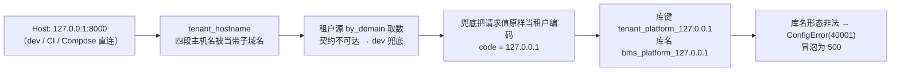
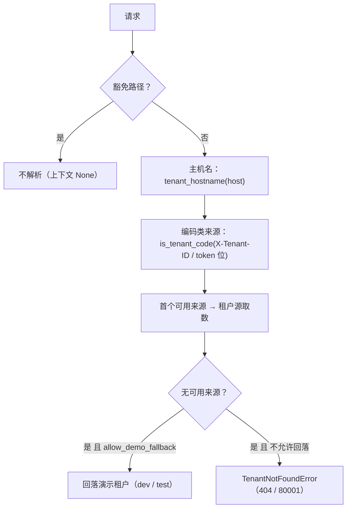

# 租户解析与库键派生健壮性详细设计

> 后端基座与服务化地基 · 06 数据拓扑升级 · 04 租户解析与库键派生健壮性 · 详细设计（开发核心文档）

[文档首页](../../../../../../文档首页.md) › [04 租户解析与库键派生健壮性](../06_数据拓扑升级_04_租户解析与库键派生健壮性.md) › 设计　|　[实施记录](../实施/01_实施_04_租户解析与库键派生健壮性.md) · [测试记录](../测试/01_测试_04_租户解析与库键派生健壮性.md)

## 1. 目标与边界 

**目标**：消除 dev 环境（`BMS_ENV=dev` + SQLite）公开契约端点的请求侧 5xx，使 `contract-smoke-<服务>` 具备转为**阻断**门禁的条件；同时把该缺陷的复现条件固化为回归用例。

**范围内**：

1. 租户解析链的**来源形态校验**（`bms_core/db/tenant.py`）：主机名（IP 字面量 / 本机名 / 域名形态）与编码类来源（`X-Tenant-ID` / token 租户位）先过形态，形态非法视为**未命中**。
2. 租户源**兜底收口**（`bms_core/db/tenant_remote.py`）：兜底仅在来源值可作租户编码时构造上下文，否则按 4xx 未命中返回。
3. 门禁转阻断：`contract-smoke-<服务>` 去掉 `allow_failure: true`，档位说明 / 规范 / 规划 / 部署说明同步。
4. 回归护栏：租户解析形态用例（`bms_core`）+ dev 环境公开契约全 GET 端点零 5xx 用例（`platform` 服务侧）。

**范围外**（登记归口，见 §8）：

- 共享基座路径变更下契约冒烟与镜像的覆盖口径（`rules:changes` 只认服务路径）——归 09 域后续（计划 §7 第 33 项）。
- 认证 / 完整登录链路冒烟、契约基线刷新（本设计不改公开契约，基线无需更新）。
- 其他启用服务的 CI 冒烟实证（本次仅 platform 命中路径；其余服务以同一基座能力与本地同口径抽验）。

## 2. 根因与复现证据 

**现象**：流水线 #362（commit `5dc8cd28`）`contract-smoke-platform` job `3369` 报 `Server error: 7` / `7 failures`，`allow_failure: true` 故未阻断；GitLab Issue #47 登记。7 处端点：`GET /api/v1/dicts/{dict_type}`、`/api/v1/dicts/{dict_type}/attrs`、`/api/v1/outbox/dead-letters`、`/api/v1/outbox/dead-letters/{dead_letter_id}`、`/api/v1/query-schemes`、`/api/v1/query-schemes/default`、`/api/v1/query-schemes/{scheme_id}`。

**根因链**（与「dev 未迁移表 / 无 Redis 依赖」无关）：

**复现证据**（开发机，与 CI 同口径：`BMS_ENV=dev` + 本机 SQLite + `uvx --from schemathesis==4.28.0`）：

| 阶段 | 命令 | 结果 |
| --- | --- | --- |
| 修复前 | `schemathesis run deploy/contracts/platform.json --url http://127.0.0.1:8010 --max-examples 1 --checks not_a_server_error --suppress-health-check all --include-method GET --include-method HEAD --exclude-path /healthz --exclude-path /readyz --exclude-path /metrics` | `256 generated, 7 found 7 unique failures`（错误文案一律 `库名形态非法：bms_platform_127.0.0.1`），与流水线 #362 完全一致 |
| 修复后 | 同命令打修好后的服务（8011） | `462 generated, 462 passed`，`exit 0` |

**归因反证**：`Host: demo`（合法编码形态主机名）与 `X-Tenant-ID: demo` 均正常 200；仅 IP 主机名触发——即触发条件为「主机名被当作租户来源」而非依赖缺失。

## 3. 交付物清单 

| # | 交付物 | 落点 |
| --- | --- | --- |
| 1 | 主机名 / 来源值形态判定与解析链收口 | `backend/libs/bms_core/src/bms_core/db/tenant.py` |
| 2 | 租户源兜底收口（不可作编码的来源值按未命中 4xx） | `backend/libs/bms_core/src/bms_core/db/tenant_remote.py` |
| 3 | 中间件语义说明同步 | `backend/libs/bms_core/src/bms_core/api/middleware.py` |
| 4 | 租户解析形态用例 + 未命中行为用例 | `backend/libs/bms_core/tests/db/test_tenant.py`、`test_tenant_remote.py` |
| 5 | dev 环境公开契约全 GET 端点零 5xx 回归用例 | `backend/services/platform/tests/api/test_dev_contract_endpoints.py` |
| 6 | 冒烟 job 转阻断（CI 配置） + 护栏用例 | `.gitlab-ci.yml`、`backend/libs/bms_core/tests/ops/test_contract_gate.py` |
| 7 | 档位说明 / 规范 / 规划 / 部署说明同步 | `deploy/ci/verify/contract-gate`、《部署发布规范》《开发部署规划》《契约门禁与契约测试使用说明》 |
| 8 | 架构语义补充（来源形态先于取数） | 《架构设计 · 多租户路由》「租户解析链」节 |
| 9 | 实施 / 测试记录 | 本任务 `实施/`、`测试/` |

## 4. 设计 

### 4.1 主机名判定（`db/tenant.py`） 

`tenant_hostname(host)` 语义收紧为「**只有可能是租户域名的主机名才返回**」：去端口 / 去方括号归一后，命中 IP 字面量（`ipaddress.ip_address` 可解析，覆盖 IPv4 / IPv6）或本机名（`localhost` / `localhost.localdomain`）→ `None`；域名形态非法（`is_tenant_domain` 不通过）→ `None`；标签数 < 3（非带子域名）→ `None`。

**为什么以「≥ 三段」判子域名**：租户子域名形如 `{tenant}.bms.example.com`，注册表 `domain` 按完整主机名匹配（既有口径，不变）；判定前先把不可能作为租户域名的主机名剔除，避免 IP 直连进入子域名解析。

### 4.2 来源值形态校验与解析链 

- 形态判定为**纯函数**（`is_tenant_code` / `is_tenant_domain` / `is_local_hostname`），与库键派生规则解耦；编码形态取 `^[A-Za-z][A-Za-z0-9_]{0,63}$`（与 `sys_tenant.code` 字段 `VARCHAR(64)` 口径一致），域名形态取 DNS 标签规则（单段 ≤ 63、不以连字符起止、总长 ≤ 253）。
- 形态非法的来源值**等同未提供**：既不送入租户源取数（省一跳、无脏缓存键），也不参与库键派生。

### 4.3 兜底收口（`db/tenant_remote.py`） 

契约不可达（`ServiceUnavailableError`）且允许兜底时，仅在 `kind == "code"` 且 `is_tenant_code(value)` 成立时才按请求值构造 `TenantSnapshot`；否则抛 `TenantNotFoundError`（4xx / 80001）。原因：子域名等取值无法作为租户编码，按原样构造会派生出形态非法的库名（如 `bms_platform_demo.example.com`）并以 5xx 暴露。降级口径其余部分不变：不允许兜底时仍然抛 `ServiceUnavailableError`（503）。

### 4.4 门禁转阻断 

`contract-smoke-<服务>` 去掉 `allow_failure: true`（9 个 job 共用锚点，一处收口）；dev 环境零 5xx 由真实流水线 `contract-smoke-platform` 实证（本次修复同时新增 platform 侧用例，使本条推送命中 `backend/services/platform/**/*`、正常拉起服务子流水线并产出镜像）。档位语义、`rules:changes`（仅变更服务）与工具口径均不变。

## 5. 接口与字段边界、失败分支 

| 接口 / 元素 | 语义 | 变更 |
| --- | --- | --- |
| `tenant_hostname(host)` | 提取带租户前缀主机名 | **语义收紧**：IP 字面量 / 本机名 / 形态非法域名 → `None` |
| `is_tenant_code(value)` | 编码形态判定（新增） | 新增公开助手 |
| `is_tenant_domain(value)` | 域名形态判定（新增） | 新增公开助手 |
| `is_local_hostname(value)` | 本机名 / IP 字面量判定（新增） | 新增公开助手 |
| `resolve_request_tenant(...)` | 解析链编排 | 来源值先过形态；形态非法等同未提供 |
| `TenantLookup.by_code/by_domain` | 租户源契约 | **不变**（签名与语义均不改；仅实现侧兜底分支收紧） |
| `TenantContext` | 租户上下文 | 不变 |

失败分支：

| 场景 | 行为 | 错误码 / 状态 |
| --- | --- | --- |
| 形态非法的来源值（dev / test） | 视为未命中 → 回落演示租户 | 2xx |
| 形态非法的来源值（prod，`allow_demo_fallback=false`） | 视为未命中 → 拒绝 | `TenantNotFoundError` 404 / 80001 |
| 来源合法但注册表无此租户 | 由租户源抛未命中 | 404 / 80001 |
| 来源合法但租户停用 | 由租户源抛停用（含引擎回收） | 403 / 80002 |
| 契约不可达且不允许兜底 | 降级为服务不可用（不变） | 503 |
| 契约不可达且兜底值不可作编码（如子域名） | 视为未命中 | 404 / 80001 |
| 契约不可达且兜底值可作编码 | 按请求值构造上下文（dev / test 既有口径，不变） | 2xx |

## 6. 测试设计与验收映射 

先登记 Kiwi 用例（**2187**：平台骨架 / P2 / CONFIRMED / 自动化），再编码。

| 用例 | 断言要点 | 验收映射（需求 06-4 完成标准） |
| --- | --- | --- |
| `bms_core/tests/db/test_tenant.py::test_tenant_hostname_and_exempt` | `127.0.0.1:8000` / `192.168.0.107` / `[::1]:8000` / `localhost:8000` / 形态非法域名 → `None`；合法三段域名照常返回 | IP / `localhost` 不入租户解析 |
| `…::test_source_value_shape_validation` | 编码 / 域名 / 本机名三类判定（含长度与字符边界） | 来源值形态校验 |
| `…::test_malformed_sources_treated_as_absent` | IP 主机名 + 非法来源值：dev 回落演示租户（且未送入租户源）；prod 口径抛 `TenantNotFoundError` | 非法来源不触发 5xx（dev 回落 / prod 4xx） |
| `bms_core/tests/db/test_tenant_remote.py::test_remote_source_fallback_rejects_non_code_values` | 契约不可达 + 域名 / 非法编码兜底 → `TenantNotFoundError` | 兜底不派生非法库名 |
| `platform/tests/api/test_dev_contract_endpoints.py::test_dev_contract_get_endpoints_have_no_server_error` | 启用「每服务每租户」模板 + `Host: 127.0.0.1:8000` 下，契约全部 GET 端点 `< 500` | dev 环境零 5xx（缺陷复现护栏：修复前该用例报 7 处 500） |
| `…::test_ip_host_resolves_to_demo_tenant` | 同一条件下解析结果为演示租户且库键合规 | IP 不入解析（应用级实证） |
| `bms_core/tests/ops/test_contract_gate.py::test_ci_contract_jobs_and_switch` | 9 个冒烟 job 均无 `allow_failure` | 冒烟为阻断 job |
| 真实流水线 | `contract-smoke-platform` 在**阻断**状态下通过 | platform 零 5xx（真实流水线实证） |

门禁口径：全量 `pytest` / `ruff check` / `ruff format --check` / `pyright`、基座 / 边界 / 状态 / 契约校验、`check-preflight --fast` 全绿。

## 7. 登记落点 

| 落点 | 内容 |
| --- | --- |
| 架构（《多租户路由》「租户解析链」节） | 来源形态先于取数（IP / 本机名不是租户域名；形态非法等同未命中；不得派生库名或以 5xx 暴露） |
| 《契约门禁与契约测试使用说明》 | 冒烟口径改为阻断、CI 表、排障与实测结论补 06_04 行 |
| 《部署发布规范》「契约门禁」节 / 《开发部署规划》CI 流水线节 | 冒烟 job 非阻断 → 阻断 |
| 档位说明 `deploy/ci/verify/contract-gate` | 同上（含根因与转阻断依据） |
| 计划 | §3 新增 06_04 剩余行；§7 第 32 项转 06_04 闭环、新增第 33 项（共享基座覆盖口径）；§1 计数与工时（剩余 8h → 14h、阶段合计 310h → 316h） |
| 任务 / 域总览 | 06_04 状态与完成日期两处一致；域六因追加子任务重开为「部分完成」（工时 68h → 74h） |
| 需求（不承载进度） | 06-4 与总览总清单、域文档地图计数一致 |
| 09_03 实施 / 测试记录 | 偏差项 7 与问题 8 转为「已由 06_04 闭环」 |
| Kiwi TCMS / 测试资产仓 | 用例 **2187** 登记并回读；输入与结果落 `test/scripts/kiwi/{cases,exports}/` |

## 8. 边界与开放项 

| # | 事项 | 归口 |
| --- | --- | --- |
| 1 | 共享基座路径变更下契约冒烟 / 服务镜像的覆盖（`rules:changes` 只认服务路径；本次不动） | 09 域后续（计划 §7 第 33 项，随 CI 容量与 runner 并发评估） |
| 2 | 其余 8 个启用服务的 CI 冒烟实证（未命中其服务路径） | 随各服务下次变更自然命中；本次以同一基座能力 + 本地同口径抽验 |
| 3 | 契约基线 | 本次不改公开契约（仅内部实现），基线无需刷新 |
| 4 | 认证 / 完整登录链路冒烟 | 认证 / E2E 阶段（09_03 既有遗留，不变） |
| 5 | 计划软提示 S2「甘特仍含已完成任务节点」（08_01 / 08_02 / 09_01 ~ 09_03） | 09_03 收口遗留（**非本任务引入**，`--strict` 下报 5 项；本任务不扩范围处理） |

## 9. 对齐记录 

- 与《AI开发规范》§3.1 补充需求口径对齐：域六顺延编号 `06-4`、挂现有父任务 `06_数据拓扑升级` 下作嵌套子任务 `06_04`、父任务重开为「部分完成」并回写工时。
- 与 06_01 / 06_03 既有口径不冲突：库键与库名派生规则、租户源装配点、降级口径（除兜底来源值范围）均不变；本次只收紧**来源形态**与**兜底可用性**。
- 与《测试规范》「被测物与执行范围」不冲突：CI 冒烟继续消费**已构建固定 tag 镜像**，按服务仅跑变更服务；本任务新增的 platform 侧用例属单元 / 集成层回归（内存 ASGI，不另起构建物）。

> 本文档依《[文档生成规范](../../../../../../规范/文档生成规范.md)》与《[任务文档规范](../../../../../../规范/任务文档规范.md)》编写
