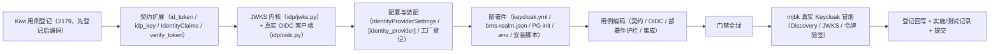

# OIDC IdP 接入实施记录

> 后端基座与服务化地基 · 07 认证与服务身份 · 01 OIDC IdP 接入 · 实施记录

[文档首页](../../../../../../文档首页.md) › [01 OIDC IdP 接入](../07_认证与服务身份_01_OIDC IdP 接入.md) › 01 实施　|　[详细设计](../设计/01_详细设计_01_OIDC IdP 接入.md) · [测试记录](../测试/01_测试_01_OIDC IdP 接入.md)

## 1. 实施信息 

| 项 | 值 |
| --- | --- |
| 任务 | [01 OIDC IdP 接入](../07_认证与服务身份_01_OIDC IdP 接入.md) |
| 对应需求 | [07-1](../../../../需求/07_需求_认证与服务身份.md#r07-1) |
| 详细设计 | [01_详细设计_01_OIDC IdP 接入](../设计/01_详细设计_01_OIDC IdP 接入.md) |
| 实施日期 | 2026-09-23 |
| 实施人 | minjian |
| 实施环境 | 开发机（Ubuntu，Python 3.14.4 / uv）；真实冒烟于开发服务器 mjbk（Docker，Keycloak 26.7.4） |
| 提交 | 设计与文档 / 代码与用例分开提交（`docs(07_01)` / `feat(07_01)`） |
| 结论 | 完成 |

## 2. 实施概览 

## 3. 实施过程 

1. **Kiwi 用例登记（先登记后编码）**：登记 1 条策展用例覆盖全部断言面，平台回读编号 **2179**；登记输入 `test/scripts/kiwi/cases/2026-09-23_阶段二07-01_OIDC IdP 接入.json`，回读 `exports/2026-09-23_阶段二07-01_登记回读.json`。
2. **契约扩展**：`bms_core/idp/base.py`——`IdentityToken` 增 `id_token` / `refresh_token`；`IdentityUser` 增 `idp_key`（外部身份来源标识）；新增 `IdentityClaims`（`subject` / `idp_key` / `issuer` / `audience` / `expires_at` / `issued_at` / `payload`，frozen dataclass）；`BaseIdentityProvider` 增可选入口 `verify_token(token, *, audience)`（默认抛 `ConfigError` 40001「该协议不支持 JWT 票据校验」）；`NullIdentityProvider` 补占位 `verify_token` 与 `idp_key="null"`。
3. **JWKS 内核**：新增 `bms_core/idp/jwks.py`——`JwksCache`（按 `jwks_uri` 缓存、`force` 强制刷新、TTL 命中）+ `verify_jwt`（经 authlib 的 JOSE 拆分包 `joserfc` 按 `kid` 选键验签，仅 `RS256`/`ES256` 白名单 + `JWTClaimsRegistry` 校验 `exp`/`iss`/`aud`）；失败语义：验签 / 过期 / `iss`/`aud` 不符 → `AuthError`（20001/401），JWKS 不可达 → `ServiceUnavailableError`（10007/503）。
4. **真实 OIDC 客户端**：新增 `bms_core/idp/oidc.py`——`OidcIdentityProvider`（`plugin_name = "oidc"`）：Discovery 元数据获取与缓存、`authorize` 授权 URL、`exchange_token` 换码（含 `id_token`/`refresh_token`）、`userinfo` 拉取（`idp_key = issuer`）、`verify_token`（JWKS 验签 + `kid` 未命中强制刷新一次）；`OidcIdentityProviderFactory`（读 `[identity_provider]`，配置不全 `PluginError` 40002）。
5. **配置与装配**：`core/config.py` 增 `IdentityProviderSettings`（`PluginSelection` 扩展 issuer / client_id / client_secret / redirect_uri / scopes / 缓存 TTL）与 `Settings.identity_provider`；`config.toml` 增 `[identity_provider]`（非敏感；secret 空串走环境变量）；`core/assembly.py` 登记 `register_plugin("identity_provider", "oidc", OidcIdentityProviderFactory(settings))`；`libs/bms_core/pyproject.toml` 增 `authlib>=1.8` 并 `uv lock`（引入 authlib / joserfc）。
6. **部署件**：新增 `deploy/compose/keycloak.yml`（Keycloak 26.7.4 + PG 独立库 + realm 导入 + 健康检查）、`deploy/keycloak/bms-realm.json`（realm `bms` + confidential 客户端 `bms-backend`，secret 占位 `${KEYCLOAK_CLIENT_SECRET}`）、`deploy/postgres/init/01-keycloak.sh`（幂等建角色 / 库，读环境变量）；改 `deploy/compose/base.yml`（postgres initdb 挂载 + `KEYCLOAK_DB_PASSWORD`）、`deploy/.env.example`（KEYCLOAK_* 变量）、`deploy/setup/install-all.sh`（放行端口）。
7. **用例与门禁**：新增 `services/identity/tests/idp/test_oidc.py`（契约 / OIDC 客户端 / JWKS 正反例 / 部署件护栏 / 集成跳过式），扩展 `services/identity/tests/idp/test_idp.py`（契约扩展断言）；全量 `pytest` / `ruff` / `pyright` / 基座校验 / 预检全绿。
8. **mjbk 真实冒烟**：建 `keycloak` 库 → 同步部署件与 `.env` → 拉起 Keycloak（healthy，realm `bms` 导入）→ Discovery / JWKS / 取令牌经 `verify_token` 校验通过（见 §5 与测试记录）。
9. **登记回写与记录**：见 §6 与测试记录。

## 4. 问题与处置 

| 问题 | 现象 | 处置 |
| --- | --- | --- |
| authlib JOSE 弃用 | `authlib.jose` 导入即告警「已弃用，请用 joserfc」；`authlib.integrations.httpx_client` 亦告警 | 采用 authlib 官方 JOSE 拆分包 **joserfc**（authlib 1.8 内置依赖）+ `httpx` 直连 OIDC 端点；契约（`verify_token` / `IdentityClaims`）不随库细节变化——已登记为偏差 |
| 应用级装配单测受进程全局注册表单次登记影响 | `provider=oidc` 经同一进程内多次建应用时，工厂仍绑定首次注册的默认配置，单测失败 | 装配断言改**独立子进程**执行（`sys.executable -c` + 环境变量），真实反映「全新进程冷启动装配」 |
| joserfc API 差异 | `jwt.encode` 需 Key 对象（非 PEM 字符串）；`RSAKey.kid` 缺省为 None | 测试用 `RSAKey.generate_key` + 手工 `kid`；验签经 `KeySet.import_key_set` + `JWTClaimsRegistry`（已按实测 API 编写） |
| pyright 严格模式 | JWKS 序列化类型 / httpx `response.json()` 未知类型 / 对称算法构造 | 显式 `cast` 收敛（`KeySetSerialization` / `Mapping[str, object]` / `list[object]`）；全量 pyright 0 error |
| 新增基座类的清单对账 | `check-backend-base.py` 报新类未登记 | 《后端基类清单》补 idp 行、`IdentityClaims` / OIDC 实现与 §10 继承链 |
| 部署件护栏 | realm JSON 的 client secret 明文风险 | 以 `${KEYCLOAK_CLIENT_SECRET}` 占位；单测断言 **无明文密钥**、字段正确 |

## 5. 验证结果 

| 验证项 | 命令 / 操作 | 结果 |
| --- | --- | --- |
| 全量用例 | `uv run pytest -q --cov=bms_core --cov-branch` | **1208 passed / 37 skipped**；总体覆盖率 **96%** |
| 新增模块覆盖率 | `uv run pytest services/identity/tests/idp --cov=bms_core.idp --cov-branch` | idp 包（base / jwks / oidc / null）语句 + 分支 **100%** |
| 静态检查 | `uv run ruff check .` / `ruff format --check .` / `uv run pyright` | 全通过（0 error） |
| 基座校验 | `check-base.py` / `check-backend-base.py` / `check-service-boundaries.py` / `check-status.py --stage 02_后端基座与服务化地基` | 全通过 |
| 本地预检 | `python3 scripts/tools/preflight/check-preflight.py --fast` | 全部通过 |

**mjbk 真实冒烟证据**（Keycloak 26.7.4，realm `bms`，issuer `http://<mjbk-IP>:8090/realms/bms`）：

| 场景 | 操作 | 结果 |
| --- | --- | --- |
| 容器就位 | `docker compose -f keycloak.yml --env-file ../.env up -d` | `bms-keycloak` **healthy**（管理端口 9000 探活）；日志 `Realm 'bms' imported` / `Bootstrap completed` |
| Discovery | `GET <issuer>/.well-known/openid-configuration` | `issuer` 与配置基址一致；返回 `jwks_uri` / `token_endpoint` / `userinfo_endpoint` |
| JWKS | `GET <issuer>/protocol/openid-connect/certs` | **2 个 RSA 公钥（`alg=RS256`）** |
| 令牌验签通过 | 服务账号 `client_credentials` 取令牌 → `OidcIdentityProvider.verify_token` 经 JWKS 验签 | **通过**；`claims.issuer == issuer`、`claims.idp_key == issuer`、`subject` 非空 |
| 集成用例 | `IDP_TEST_ISSUER/IDP_TEST_CLIENT_ID/IDP_TEST_CLIENT_SECRET` + `pytest -k real_keycloak` | **1 passed**（真实 Keycloak） |
| 元数据库 | `docker exec bms-postgres psql -c "\l"` | `keycloak` 库存在（复用 `bms-postgres` 容器） |

## 6. 登记回写 

| 落点 | 内容 |
| --- | --- |
| 《后端基类清单》 | 能力域横切 idp 行改「部分交付」；「IdP / 会话存储」行补真实 `OidcIdentityProvider` / `OidcIdentityProviderFactory` / `idp/jwks.py` / 契约扩展 / `[identity_provider]`；§10 继承链增 `OidcIdentityProvider` 与 `IdentityClaims` |
| 《后端开发规范》 | §3.1 增「认证与身份源接入必须走基座」强制条（含非对称算法白名单、`exp`/`iss`/`aud` 校验、凭据外部化、`idp_key + subject` 映射） |
| 《部署发布规范》 | 新增 §10「身份源（IdP）编排与凭据外部化」口径与检查项 |
| 《Keycloak 部署使用说明》 | 新增（部署形态 / 声明式来源 / 部署步骤 / 验证 / 运维 / 排障）；《开发服务器部署使用说明总览》登记（服务清单 / 端口 / 索引）；《基座文档清单》登记 |
| 《架构设计 · 后端基础类体系》 | 能力域全景已含「身份源与会话存储」，逐项状态由《后端基类清单》承载，本任务不改架构语义节点 |
| 计划 | §1 计数（已完成 22 / 剩余 8，244h / 62h）；§2 已完成表新增 07_01；§3 移除 07_01；§4 甘特调整 |
| 任务 / 父任务 | 任务 01 状态与完成日期；父任务子任务表一致 |
| 下游任务文档 | 07_02 / 07_03 补「前置契约（已交付）」（issuer / JWKS 端点 / `idp/jwks.py` 助手 / `OidcIdentityProvider.verify_token` / `aud` 口径） |
| Kiwi TCMS | 用例 **2179**（IdP 编排 / 声明式 realm / OIDC 客户端 / JWKS 验签覆盖面） |
| 测试资产仓 | `test/scripts/kiwi/cases/2026-09-23_阶段二07-01_OIDC IdP 接入.json` 与 `exports/2026-09-23_阶段二07-01_登记回读.json`；《Kiwi 用例台账》追加批次 |
| 实施 / 测试记录 | 本文件与[测试记录](../测试/01_测试_01_OIDC IdP 接入.md) |

## 7. 偏差与遗留 

- **偏差（已登记）**：① 客户端实现以 **authlib 的 JOSE 拆分包 joserfc + httpx** 落地（authlib `jose` 模块与 `integrations.httpx_client` 均已弃用告警），契约不变；② 部署件 postgres 初始化脚本用 **`.sh`（读环境变量）替代设计中的 `.sql`**，避免明文密码入库；③ Keycloak 镜像走 Docker 镜像加速器拉取。
- **契约变更（消费方为零）**：`IdentityToken` 增 `id_token`/`refresh_token`、`IdentityUser` 增 `idp_key`、新增 `IdentityClaims`、`BaseIdentityProvider` 增默认可选 `verify_token`；消费方 07_02 / 07_03 已标注前置契约。
- **遗留（归口）**：① 双类 JWT（`aud=api`/`aud=service`）签发与 JWKS **分发** → **07_02**（realm 客户端补 audience mapper）；② 网关 `openid-connect` 接线与服务 JWT 校验 → **07_03**；③ 完整登录链路（回调路由 / state 与 nonce / PKCE）/ CAS / 企业微信 / 钉钉 / JIT 建号与 `sys_user_identity` 落库 → **阶段六 / 七**；④ BMS 兼作 OIDC Provider → **阶段六**；⑤ 生产 TLS / 域名 / `sslRequired=external` / K8s Operator 平移 → **部署阶段**。
- **不改**：`IDP_PROTOCOLS` 协议清单、`get_identity_provider` 签名、既有服务内 `/api/v1` 前缀与响应体、`BaseIdentityProvider` 三抽取方法签名、既有 Kiwi 用例号。

> 依《文档生成规范》编写 · 与《测试记录》配套
