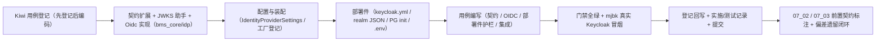

# OIDC IdP 接入详细设计

> 后端基座与服务化地基 · 07 认证与服务身份 · 01 OIDC IdP 接入 · 详细设计

[文档首页](../../../../../../文档首页.md) › [01 OIDC IdP 接入](../07_认证与服务身份_01_OIDC%20IdP%20接入.md) › 详细设计　|　[父任务：认证与服务身份](../../07_认证与服务身份.md) · [本阶段需求](../../../../需求/07_需求_认证与服务身份.md) · [排期计划](../../../../计划/01_计划_后端基座与服务化地基.md)

## 1. 概述 <a id="overview"></a>

- **目标**：交付**自托管 OIDC IdP（Keycloak）随 `deploy` 编排一体、本地一键拉起**，以及 **BMS 作为 OIDC 客户端接入**的真实能力（OIDC Discovery / 授权码授权 / 换码 / userinfo / **ID Token 经 JWKS 校验**）；客户端凭据与 IdP 密钥一律走**环境变量 / Secret**，不落库、不入镜像、不入 Git。
- **依据**：《[架构设计 · 认证与会话](../../../../../../设计/架构设计/14_架构设计_子系统_认证与会话.md)》「SSO 集成」「服务身份与服务间认证」节；《[架构设计 · API 网关与边缘](../../../../../../设计/架构设计/36_架构设计_子系统_API网关与边缘.md)》「安全边界」节；《[微服务演进规划](../../../../../../规划/微服务演进规划.md)》「技术选型」（服务身份 = 网关 OIDC + 双类 JWT，Keycloak 自托管）；《[部署发布规范](../../../../../../规范/部署发布规范.md)》；知识档案《[authlib 技术介绍](../../../../../../资料/知识档案/后端核心/authlib技术介绍.md)》；需求 [07-1](../../../../需求/07_需求_认证与服务身份.md#r07-1)；前置任务 [04_01 详细设计](../../04_API网关与边缘/04_API网关与边缘_01_网关接入与声明式配置/设计/01_详细设计_01_网关接入与声明式配置.md)。
- **范围（本任务）**：
  1. **IdP 容器化编排**：新增 `deploy/compose/keycloak.yml`（Keycloak 26.7.4）与既有 `base.yml`（PostgreSQL / Redis 等）组合，本地一键拉起；Keycloak 元数据落**独立库 `keycloak`**（复用 `bms-postgres` 容器）。
  2. **声明式 realm / 客户端供给**：`deploy/keycloak/bms-realm.json` 入 Git，启动 `--import-realm` 自动导入；**client secret 用 `${KEYCLOAK_CLIENT_SECRET}` 占位**经 `.env` 注入。
  3. **BMS 作为 OIDC 客户端（真实实现）**：扩展 `bms_core/idp/` 能力域，新增真实 `OidcIdentityProvider`（`provider = oidc`）——Discovery 元数据获取与缓存、授权 URL 构造、授权码换令牌、userinfo 拉取、**ID Token / JWT 经 JWKS 验签**（校验 `exp` / `iss` / `aud`）。
  4. **数据契约扩展**：`IdentityToken` 增 `id_token` / `refresh_token`；`IdentityUser` 增 `idp_key`；新增 `IdentityClaims`（验签后的身份声明）；`BaseIdentityProvider` 增可选票据校验入口 `verify_token`（默认不支持该协议的实现抛配置错误）。
  5. **外部身份映射与 JIT 口径**：登记 `idp_key`（来源）+ `subject`（外部标识 = external_id）映射与 JIT 建号职责边界，**本任务不建表、不落库**，实现随阶段六。
  6. **凭据外部化**：`[identity_provider]` 配置节（issuer / client_id / redirect_uri / scopes / TTL 等非敏感项）+ `client_secret` 经 `BMS_IDENTITY_PROVIDER__CLIENT_SECRET` 注入；Keycloak admin / DB / client 三处密码经 `.env`。
  7. **部署资料**：新增《Keycloak 部署使用说明》并登记《开发服务器部署使用说明总览》。
- **不含（明确归口，见第 8 节）**：双类 JWT 签发与 JWKS 分发（07_02）；网关 `openid-connect` 接线与服务 JWT 校验（07_03）；完整登录链路 / RBAC / 会话与 JIT 落库（阶段六 / 七）；BMS 兼作 OIDC Provider（阶段六）；CAS / 企业微信 / 钉钉真实适配（阶段六，本任务只为 `idp` 契约增可选校验入口，不实现）。

## 2. 现状与差距 <a id="gap"></a>

| 关注点 | 现状（04_02 交付后） | 差距（本任务目标） |
| --- | --- | --- |
| 自托管 IdP | 无；`deploy/compose/` 仅基础设施与网关 / GitLab / Kiwi | 新增 Keycloak 编排（含 PG 库、realm 导入、健康检查），一键拉起 |
| realm / 客户端 | 无 | 声明式 `bms-realm.json` 入 Git，secret 走环境变量，启动自动导入 |
| OIDC 客户端 | `bms_core/idp/` 仅占位 `NullIdentityProvider`（固定返回、不连外部 IdP） | 真实 `OidcIdentityProvider`：Discovery / 授权 / 换码 / userinfo / JWKS 验签 |
| 票据校验 | 无（`BaseIdentityProvider` 无校验入口） | `verify_token`（JWKS + `exp`/`iss`/`aud`）+ `IdentityClaims` 数据契约 |
| 身份来源标识 | `IdentityUser` 仅 `subject` / `username` / `email` / `tenant` | 增 `idp_key`（来源标识）与 `IdentityToken.id_token` |
| 凭据管理 | `[identity_provider]` 配置节不存在；`config.toml` 无该分区 | `IdentityProviderSettings` + `[identity_provider]` 节；secret 经环境变量 |
| 部署资料 | 无 Keycloak 说明 | 新增《Keycloak 部署使用说明》并登记总览 |

## 3. 交付物清单 <a id="tree"></a>

```text
backend/
├── libs/bms_core/src/bms_core/
│   ├── idp/
│   │   ├── base.py                            # 改：IdentityToken 增 id_token/refresh_token；IdentityUser 增 idp_key；
│   │   │                                      #     新增 IdentityClaims；BaseIdentityProvider 增 verify_token 默认实现
│   │   ├── jwks.py                            # 新：JWKS 获取与缓存 + JWT 验签助手（iss/aud/exp；RS256/ES256）
│   │   ├── oidc.py                            # 新：OidcIdentityProvider 真实 OIDC 客户端 + OidcIdentityProviderFactory
│   │   └── null.py                            # 改：NullIdentityProvider 补 verify_token 占位
│   ├── core/config.py                         # 改：IdentityProviderSettings + Settings.identity_provider 类型
│   └── core/assembly.py                       # 改：register_plugin("identity_provider", "oidc", OidcIdentityProviderFactory(settings))
├── libs/bms_core/pyproject.toml               # 改：依赖增 authlib>=1.8
├── uv.lock                                    # 改：重新锁定（新增 authlib / joserfc）
├── config.toml                                # 改：新增 [identity_provider] 节（非敏感；secret 空串走环境变量）
└── services/identity/tests/
    ├── idp/test_oidc.py                       # 新：OIDC 客户端单测（MockTransport 造 Discovery/JWKS/token）+ JWKS 验签正反例
    └── idp/test_idp.py                        # 改：契约扩展断言（id_token / idp_key / IdentityClaims / verify_token）

deploy/
├── compose/keycloak.yml                       # 新：Keycloak 26.7.4 编排（与 base.yml 组合）
├── compose/base.yml                           # 改：postgres 挂载 initdb 目录（/docker-entrypoint-initdb.d）
├── postgres/init/01-keycloak.sql               # 新：幂等建 keycloak 角色与库（新卷自动执行；存量实例手动执行一次）
├── keycloak/bms-realm.json                    # 新：realm `bms` + OIDC 客户端 `bms-backend`（secret 占位，无明文）
└── .env.example                                # 改：KEYCLOAK_* 变量（admin / db / client secret / 端口 / 对外基址）

setup/install-all.sh                            # 改：防火墙放行 Keycloak 宿主端口

bms文档/
├── 资料/开发服务器/linux/Keycloak部署使用说明.md  # 新：部署形态 / 声明式来源 / 步骤 / 验证 / 排障
├── 资料/开发服务器/linux/开发服务器部署使用说明总览.md  # 改：登记 Keycloak 说明
├── 后端基类清单.md                              # 改：idp 行补真实实现与继承链；§跨阶段基座补充
├── 设计/架构设计/04_架构设计_后端基础类体系.md    # 改：idp 能力域登记（真实 OIDC 客户端 + JWKS 校验）
├── 规范/后端开发规范.md                         # 改：§3.1 增「认证 / 身份源必须走 idp 能力域」条（含凭据外部化）
├── 规范/部署发布规范.md                         # 改：§9 或新节增「IdP 编排与凭据外部化」口径（原则）
├── 项目/02_后端基座与服务化地基/…
│   ├── 计划/01_计划_后端基座与服务化地基.md      # 改：§1 台账/§2 已完成/§3 移除 07_01/§4 甘特
│   ├── 任务/07_认证与服务身份/07_认证与服务身份.md  # 改：子任务表状态与完成日期
│   ├── 任务/07_…_01_…/                          # 改：任务状态/完成日期 + 实施/测试记录
│   └── 任务/07_…_02 / _03 任务文档              # 改：补「前置契约（已交付）」

test/
└── scripts/kiwi/cases|exports/…                 # 新：本任务用例登记输入与回读
```

## 4. 领域设计 <a id="design"></a>

### 4.1 部署形态与编排 <a id="deploy"></a>

- **形态**：Keycloak 官方镜像 `quay.io/keycloak/keycloak:26.7.4`，`start --import-realm --http-enabled=true --optimized`（源码发行版镜像无需 `--optimized`；如用优化构建则加）**非开发模式**（`KC_DB=postgres` 持久化）。
- **数据存储**：复用 `base.yml` 的 `bms-postgres` 容器、**独立库 `keycloak`** 与独立角色 `keycloak`（`deploy/postgres/init/01-keycloak.sql` 幂等创建；新卷由 postgres entrypoint 自动执行，存量 mjbk 实例按说明手动执行一次）。
- **编排**：`deploy/compose/keycloak.yml` 与既有组合一致（共享默认网络，服务名即 DNS 名）：

| 服务 | 镜像 | 容器 | 端口 | 挂载 |
| --- | --- | --- | --- | --- |
| `keycloak` | `quay.io/keycloak/keycloak:26.7.4` | `bms-keycloak` | `${KEYCLOAK_PORT:-8090}:8080` | `../keycloak` → `/opt/keycloak/data/import`（ro） |

- **关键环境变量**（对照 Keycloak 容器配置）：
  - `KC_DB=postgres`、`KC_DB_URL=jdbc:postgresql://postgres:5432/keycloak`、`KC_DB_USERNAME=keycloak`、`KC_DB_PASSWORD=${KEYCLOAK_DB_PASSWORD}`；
  - `KC_BOOTSTRAP_ADMIN_USERNAME=admin`、`KC_BOOTSTRAP_ADMIN_PASSWORD=${KEYCLOAK_ADMIN_PASSWORD}`（26.x 引导管理员口径）；
  - `KC_HTTP_PORT=8080`、`KC_HTTP_ENABLED=true`、`KC_HOSTNAME=http://${KEYCLOAK_HOSTNAME:-localhost}:${KEYCLOAK_PORT:-8090}`、`KC_HOSTNAME_STRICT=false`（dev 口径；生产按域名与 TLS 收紧）、`KC_HEALTH_ENABLED=true`；
  - `KEYCLOAK_CLIENT_SECRET=${KEYCLOAK_CLIENT_SECRET}`（**仅供 realm 导入占位解析**，不落配置）。
- **健康检查**：Keycloak 26 健康端点在管理端口 `9000`（`/health/ready`）；容器 `healthcheck` 用镜像内 `curl`/`bash` 探活（8980/9000 口径按镜像实测，实施时以真机为准）。
- **一键拉起**（`deploy/` 目录，`.env` 提供变量）：

```bash
docker compose -f compose/base.yml -f compose/keycloak.yml --env-file .env up -d
```

- **不引入**：Keycloak 不作业务服务、不进服务目录（`SERVICE_CATALOG`）、不经 APISIX 网关暴露（IdP 属基础设施身份源，Discovery / 回调需稳定基址；网关只处理业务 API 流量）。
- **无状态与可平移**：容器无本地状态（元数据在 PG）；迁 K8s 时换 StatefulSet / Operator 承载，`realm` 仍声明式导入，客户端配置模型不变。

### 4.2 realm 与 OIDC 客户端声明式供给 <a id="realm"></a>

`deploy/keycloak/bms-realm.json`（文件名须为 `<realm>-realm.json`，realm 名 `bms`；启动 `--import-realm` 从 `/opt/keycloak/data/import` 读取；已存在则跳过导入）：

| 项 | 取值 | 说明 |
| --- | --- | --- |
| `realm` | `bms` | 平台统一身份域 |
| `enabled` | `true` | — |
| `sslRequired` | `external`（dev 可 `none`） | 传输安全口径随环境 |
| 客户端 `clientId` | `bms-backend` | BMS 后端作为 OIDC 客户端（confidential） |
| `secret` | `${KEYCLOAK_CLIENT_SECRET}` | **占位符，明文不入 Git**（Keycloak 支持 `${ENV}` 解析） |
| `standardFlowEnabled` | `true` | 授权码流程（阶段六登录链路） |
| `directAccessGrantsEnabled` | `false`（默认） | 不启密码直授；冒烟走 client_credentials |
| `serviceAccountsEnabled` | `true` | 服务账号（07_02 服务 JWT 预置；本任务仅创建） |
| `redirectUris` / `webOrigins` | 本机回调（如 `http://localhost:8000/api/v1/auth/callback`、网关外部回调占位） | 精确白名单，防开放重定向 |
| `publicClient` | `false` | confidential |

- **凭据三处外部化**：Keycloak admin 密码、DB 密码、client secret 全部经 `.env`（对齐 `.env.example` 占位），**不入 Git、不入镜像**；realm JSON 内仅占比位符。
- **演进**：07_02 需在客户端补 audience protocol mapper（`aud=api`）与 scope；本任务只保证 OIDC 客户端可 discovery / 验签，audience 口径随 07_02 落地时在该 JSON 追加（不改导入机制）。

### 4.3 idp 能力域扩展：真实 OIDC 客户端 <a id="oidc"></a>

在既有 `bms_core/idp/`（客户端侧身份源）下新增真实实现，**不改协议清单与既有三方法签名**：

**契约扩展** `bms_core/idp/base.py`：

```text
idp/base.py
├── IDP_PROTOCOLS（不变）
├── IdentityToken（改）：access_token / token_type / expires_in + 新增 id_token: str | None / refresh_token: str | None
├── IdentityUser（改）：subject / username / email / tenant + 新增 idp_key: str（身份来源标识）
├── IdentityClaims（新，frozen dataclass，BaseObject）：subject / idp_key / issuer / audience: tuple[str,...] / expires_at / issued_at / payload
├── BaseIdentityProvider（改）：三方法不变 + 新增可选入口 verify_token(token, *, audience=None) -> IdentityClaims
│     （默认实现抛 ConfigError 40001「该身份源协议不支持 JWT 票据校验」，供 OIDC 实现覆盖）
└── get_identity_provider（不变）
```

**真实实现** `bms_core/idp/oidc.py`：

| 成员 | 语义 |
| --- | --- |
| `OidcIdentityProvider`（`plugin_name = "oidc"`） | 构造注入 `issuer` / `client_id` / `client_secret` / `redirect_uri` / `scopes` / TTL；`key = plugin_key = "identity_provider"`；`contract_version` 继承 |
| `authorize(state)` | 取 Discovery 元数据 → 用 `authorization_endpoint` 构造授权 URL（`response_type=code`、`client_id`、`redirect_uri`、`scope`、`state`） |
| `exchange_token(code)` | 向 `token_endpoint` 以授权码换令牌；映射为 `IdentityToken`（含 `id_token` / `refresh_token`） |
| `userinfo(access_token)` | 向 `userinfo_endpoint` 拉取；映射为 `IdentityUser`（`subject=sub`、`username` 取 preferred_username/name、`email`、`idp_key=issuer`） |
| `verify_token(token, *, audience=None)` | 取 JWKS → 验签 → 校验 `exp`（未过期）与 `iss == issuer`，`audience` 给定则要求命中 `aud` → 返回 `IdentityClaims`（`exp` / `iss` / `aud` / `sub` 等入 `payload`） |
| `OidcIdentityProviderFactory` | 显式工厂（读取 `Settings.identity_provider`）；配置不全（issuer / client_id / client_secret 缺）抛 `PluginError` 40002 |

**JWKS 与验签助手** `bms_core/idp/jwks.py`（供 OIDC 客户端使用，后续 07_02 / 07_03 可复用）：

- `JwksCache`：按 `jwks_uri` 拉取并缓存 JWK Set（`ttl` 内命中；`kid` 未命中时强制刷新一次），经 `httpx.AsyncClient` 出站；
- `verify_jwt(token, keys, *, issuer, audience=None, algorithms=("RS256","ES256"), leeway=...)`：用 **authlib JOSE（authlib ≥1.8 内置 joserfc）** 按 `kid` 选键验签，返回 claims；
- 失败一律转 **`AuthError`（20001 / 401）**（验签失败 / 过期 / iss 不符 / aud 不符）；IdP 不可达转 `ServiceUnavailableError`（10007 / 503）；配置缺失转 `ConfigError`（40001）。

- **库选型**：**authlib**（项目既定选型，覆盖 OIDC 客户端 + 后续 Provider / CAS 兼容，避免阶段六换库）；出站 HTTP 统一经 `httpx`（与既有 `outbound` 口径一致）。授权 URL 与 token 交换按 **authlib OAuth2/OIDC 客户端**语义实现，Discovery 经 `/.well-known/openid-configuration` 获取并缓存（`discovery_cache_ttl`）。

### 4.4 外部身份映射与 JIT 建号口径（登记，不落库） <a id="jit"></a>

- **映射键**：外部身份以 `idp_key`（身份来源，本任务取 `issuer`）+ `external_id`（= 令牌 `sub` / `IdentityUser.subject`）唯一定位；对应表 `sys_user_identity`（租户库）与 JIT 建号实现**随阶段六**（用户最小模型与登录链路），本任务只在契约注释与《后端基类清单》登记该口径。
- **JIT 边界**：首次 SSO 登录自动建号（`identity.user.jit_created` 事件）属登录链路，归阶段六；本任务交付的 `userinfo` / `verify_token` 仅提供可信身份声明，不做建号副作用。
- **本地登录并存**：超管应急通道与密码策略归认证阶段，本任务不涉及。

### 4.5 配置与装配 <a id="config"></a>

`config.toml` 新增（**非敏感项；secret 空串经环境变量注入**）：

```toml
[identity_provider]
# 身份源实现选择（插件化；空串 = null 占位不连外部 IdP；oidc = 真实 OIDC 客户端）
provider = ""
# OIDC issuer（如 http://<idp-host>:8090/realms/bms；本机测试可为 http://localhost:8090/realms/bms）
issuer = ""
# OIDC 客户端标识
client_id = "bms-backend"
# OIDC 客户端密钥（空串；经 BMS_IDENTITY_PROVIDER__CLIENT_SECRET 环境变量注入，不写入本文件）
client_secret = ""
# 授权回调地址（精确注册于 IdP redirectUris）
redirect_uri = "http://localhost:8000/api/v1/auth/callback"
# 请求 scope
scopes = ["openid", "profile", "email"]
# Discovery 元数据缓存 TTL（秒）
discovery_cache_ttl = 3600
# JWKS 缓存 TTL（秒）
jwks_cache_ttl = 300
```

- `IdentityProviderSettings(PluginSelection)` 追加上述字段；`Settings.identity_provider: IdentityProviderSettings`。
- `PLUGIN_WIRINGS` 的 `identity_provider` 接线不变（`plugin_key="identity_provider"` / 配置分区 `identity_provider` / `app.state.identity_provider`）。
- `register_platform_plugins` 增 `register_plugin("identity_provider", "oidc", OidcIdentityProviderFactory(settings))`；`_NULL_MODULES` 不变（`bms_core.idp.null` 已在册）。
- `get_identity_provider`（既有依赖）按 `[identity_provider].provider` 解析，`oidc` 实现经 `resolve_plugin` + 契约版本校验实例化缓存。

### 4.6 K8s 平移口径 <a id="k8s"></a>

| 单机（本任务） | K8s 阶段 | 说明 |
| --- | --- | --- |
| `keycloak.yml` 容器 + PG 库 | Keycloak Operator / StatefulSet + 托管 PG | 身份源角色不变 |
| `bms-realm.json` 声明式导入 | ConfigMap / Operator Realm CR + Secret | 声明式 + 凭据外部化不变 |
| `[identity_provider].issuer` + JWKS | 同（网关 / 后端按 issuer 取 JWKS） | OIDC 语义不变 |
| client secret 经 `.env` | K8s Secret | 凭据外部化平移 |

## 5. 失败分支与边界 <a id="failures"></a>

| 场景 | 处理 |
| --- | --- |
| IdP 未就绪 / Discovery 或 JWKS 不可达 | `ServiceUnavailableError`（10007 / 503）；客户端缓存期内沿用旧元数据 / JWKS，不整体失败 |
| `[identity_provider].provider` 空 / 未配置 issuer / client_id / secret | 空 → `NullIdentityProvider`（占位不连外部 IdP）；配 `oidc` 但配置不全 → 启动期 `PluginError`（40002）拒启 |
| 令牌验签失败（签名 / 算法 / `kid` 无匹配） | `AuthError`（20001 / 401）；`kid` 未命中先强制刷新 JWKS 一次再判 |
| 令牌过期 / `iss` 不符 | `AuthError`（20001 / 401） |
| `aud` 不符（给定 audience 时） | `AuthError`（20001 / 401） |
| 允许算法含对称（HS）与不对称混用 | **禁止**：验签仅接受 `RS256` / `ES256`（白名单），防 CVE-2016-10555 类签名绕过 |
| 授权 URL 回调地址未在 IdP 注册 | IdP 侧拒（redirect_uri mismatch）；`redirect_uri` 与 realm 白名单一致由配置保证 |
| realm JSON 含明文 secret | 禁止（占位符 `${KEYCLOAK_CLIENT_SECRET}`）；由单测断言无明文密钥字段 |
| postgres 无 `keycloak` 库（存量实例） | Keycloak 启动失败（连库错误）；按《Keycloak 部署使用说明》执行 `01-keycloak.sql` 一次 |
| Keycloak 重启后 realm 已存在 | `--import-realm` 跳过导入（不覆盖），幂等；配置变更须经 Admin 控制台或显式 `import --override`（文档说明） |
| 完整登录链路未接 | 明确归阶段六：本任务交付客户端能力与验签，**不接登录路由**（授权/换码作为能力方法可单测） |
| JIT 建号 | 归阶段六；本任务只登记口径，不落表、不写库 |
| 达梦 / 三库方言 | 不涉及（IdP 用 PG，客户端逻辑不直连业务库） |

## 6. 测试设计与验收映射 <a id="tests"></a>

用例先登记 Kiwi TCMS（本任务登记 **1 条策展用例**，多条断言共用同一 `kiwi_id`，编号以平台回读为准，见第 9 节）。

| 用例 / 文件 | 类型 | 断言要点 |
| --- | --- | --- |
| `services/identity/tests/idp/test_oidc.py` | 单元 | `OidcIdentityProvider` 经 `httpx.MockTransport` 造 Discovery：`authorize` 拼出正确授权 URL（endpoint / client_id / redirect_uri / scope / state）；`exchange_token` 映射 `IdentityToken`（含 `id_token`）；`userinfo` 映射 `IdentityUser`（`idp_key=issuer`）；`verify_token` 用自签 JWKS **正例通过**，**反例**（签名错 / 过期 / `iss` 不符 / `aud` 不符 / 算法不在白名单）抛 `AuthError`；Discovery / JWKS 不可达抛 `ServiceUnavailableError`；`jwks_cache` 命中与 `kid` 未命中刷新 |
| `services/identity/tests/idp/test_idp.py` | 单元 | 契约扩展：`IdentityToken` 默认 `id_token`/`refresh_token` 为 None；`IdentityUser.idp_key` 默认；`IdentityClaims` 不可变；`NullIdentityProvider.verify_token` 占位返回；`BaseIdentityProvider.verify_token` 默认抛 `ConfigError`；`get_identity_provider` 按 provider 解析 |
| `services/identity/tests/idp/test_oidc.py`（装配） | 单元 | `IdentityProviderSettings` 字段与 `[identity_provider]` 解析；`register_platform_plugins` 登记 `oidc` 工厂；provider=`oidc` 且配置齐时应用可启动、依赖解析到 `OidcIdentityProvider` |
| `services/identity/tests/idp/test_oidc.py`（部署件护栏） | 单元 | `deploy/keycloak/bms-realm.json` 可解析、realm/client 字段正确、**client secret 为 `${...}` 占位（无明文）** |
| `services/identity/tests/idp/test_oidc.py`（集成，`@pytest.mark.integration`） | 集成（真机，跳过式） | 环境变量给 issuer/client_id/secret 时：经 client_credentials 取令牌 → `verify_token` 通过并回读 claims；未配置则 skip |
| mjbk 真实冒烟 | 集成（人工留痕） | 部署 Keycloak → `curl .well-known` 与 JWKS 可达 → 取 client_credentials 令牌 → 经 `OidcIdentityProvider.verify_token` 校验通过；留痕到测试记录 |
| 既有全量回归 | 单元 + 集成 | 全量 `pytest` / `ruff` / `pyright` / 基座校验全绿（无行为回归） |

验收映射：

| 完成标准（需求 07-1） | 验证方式 |
| --- | --- |
| IdP 随编排就位 | `deploy/compose/keycloak.yml` + realm 导入；mjbk 一键拉起冒烟 |
| 完成 OIDC 客户端接入（JWKS 校验通过） | `OidcIdentityProvider` 单测（Discovery/授权/换码/userinfo/验签）+ mjbk 真实 Keycloak 令牌经 JWKS 校验通过 |
| 客户端凭据不落库不入镜像 | secret 经 `.env` / 环境变量；realm JSON 占位符单测断言；`config.toml` 无明文密钥 |
| 外部身份映射与 JIT 口径沿用 | 契约注释 + 《后端基类清单》登记（`idp_key` + `subject`）；阶段六实现 |
| 校验通过 | `pytest` / `ruff` / `pyright` / `check-base` / `check-backend-base` / `check-service-boundaries` / `check-status` 全绿 |

## 7. 登记落点 <a id="registry-writeback"></a>

| 落点 | 内容 |
| --- | --- |
| 《后端基类清单》 | idp 行补真实 `OidcIdentityProvider`（`provider = oidc`）+ `IdentityClaims` / `IdentityToken` / `IdentityUser` 契约扩展 + JWKS 助手；跨阶段基座补充 |
| 《架构设计 · 后端基础类体系》 | idp 能力域登记补真实实现与 JWKS 校验语义（只写语义与落点） |
| 《后端开发规范》 | §3.1 增「认证 / 身份源接入必须走 idp 能力域（禁旁路直连外部 IdP）；客户端凭据一律经环境变量 / Secret」强制条 |
| 《部署发布规范》 | 增「IdP 编排与凭据外部化」口径：Keycloak 声明式 realm 入 Git、secret 外部化、健康检查与库归属 |
| 《Keycloak 部署使用说明》 | 新增（部署形态 / 声明式来源 / 步骤 / 验证 / 排障）；总览登记 |
| 计划 | §1 工时台账与计数；§2 已完成表（07_01 行）；§3 移除 07_01；§4 甘特调整 |
| 任务 / 父任务 | 状态与完成日期两处一致（需求文档不承载进度） |
| 下游任务文档 | 07_02 / 07_03 补「前置契约（已交付）」：IdP issuer 与 JWKS 端点、OIDC 客户端契约、JWKS 验签助手、`aud` 口径约定 |
| Kiwi TCMS / 测试资产仓 | 登记本任务用例并回读编号；`test/scripts/kiwi/cases|exports/` 对应文件；台账更新 |
| 实施 / 测试记录 | 任务目录 `实施/`、`测试/` 各一份 |

## 8. 边界与开放项 <a id="boundary"></a>

- **归 07_02**：双类 JWT（`aud=api` / `aud=service`）签发与 JWKS **分发**（BMS 作为签发方）；realm 客户端补 audience mapper；可复用 `idp/jwks.py` 的 JWKS 缓存与验签助手。
- **归 07_03**：网关 `openid-connect` 接线（APISIX 侧按 issuer 取 JWKS 校验用户 JWT）与服务 JWT 校验；`ROUTE_HEADERS_SET` 填真实 claims。
- **归阶段六 / 七**：完整登录链路（登录页 / 回调路由 / state 与 nonce 校验 / PKCE）、CAS / 企业微信 / 钉钉适配、JIT 建号与 `sys_user_identity` 落库、RBAC 与权限。
- **开放项（安全）**：dev 环境 `KC_HOSTNAME_STRICT=false` 与 HTTP；生产须配域名 + TLS + `sslRequired=external` + `KC_PROXY_HEADERS`（随部署阶段）。
- **开放项（JIT）**：`sys_user_identity` 表结构与 JIT 并发唯一约束随阶段六定案；本任务只登记映射键口径。
- **开放项（库版本）**：authlib 1.8 的 JOSE 已拆入 joserfc（authlib 内部依赖）；若实施中 JOSE API 有差异，按「authlib（joserfc）」实现，契约（本域 `verify_token`）不变。
- **不改**：`IDP_PROTOCOLS` 协议清单、`get_identity_provider` 提供者签名、既有服务内 `/api/v1` 前缀与响应体、`BaseIdentityProvider` 三方法签名、既有 Kiwi 用例号。

## 9. 实施步骤 <a id="steps"></a>



1. 读《[KiwiTCMS 部署使用说明](../../../../../../资料/开发服务器/linux/KiwiTCMS部署使用说明.md)》「用例约定」节，登记本任务用例并**回读编号**（输入文件落 `test/scripts/kiwi/cases/`；先登记后编码）。
2. 改 `bms_core/idp/base.py`（契约扩展 + `verify_token`）；新增 `idp/jwks.py`（JWKS 缓存 + 验签）；新增 `idp/oidc.py`（真实客户端 + 工厂）；改 `idp/null.py`。
3. 改 `core/config.py`（`IdentityProviderSettings` + `Settings`）；改 `core/assembly.py`（登记 `oidc` 工厂）；`config.toml` 增 `[identity_provider]`；`libs/bms_core/pyproject.toml` 增 authlib 并 `uv lock`。
4. 新增 `deploy/compose/keycloak.yml`、`deploy/keycloak/bms-realm.json`、`deploy/postgres/init/01-keycloak.sql`；改 `deploy/compose/base.yml`（postgres initdb 挂载）与 `deploy/.env.example`、`deploy/setup/install-all.sh`（放行端口）。
5. 用例：契约扩展 + OIDC 客户端（MockTransport）+ 部署件护栏 + 集成（真机跳过式）；既有全量回归。
6. 门禁：`uv run pytest -q --cov=bms_core --cov-branch` / `ruff check` / `ruff format --check` / `pyright`；`check-base` / `check-backend-base` / `check-service-boundaries` / `check-status` / `check-preflight --fast` 全绿。
7. **mjbk 真实冒烟**（远程操作，先读《Keycloak 部署使用说明》）：建 `keycloak` 库 → 同步 `deploy/` 与 `.env` → 拉起 Keycloak → `curl` Discovery / JWKS → 取令牌 → `verify_token` 通过；留痕到测试记录。
8. 登记回写（基类清单 / 架构 / 规范 / 部署发布规范 / Keycloak 说明 / 计划 / 任务状态）+ 实施 / 测试记录 + 代码与文档分开提交。
9. 07_02 / 07_03 前置契约标注与偏差遗留闭环（另提交）。

关键命令：

```bash
cd backend
uv lock && uv sync
uv run pytest -q --cov=bms_core --cov-branch
uv run ruff check . && uv run ruff format --check . && uv run pyright
# 仓库根
python3 scripts/tools/base-check/check-base.py
python3 scripts/tools/base-check/check-backend-base.py
python3 scripts/tools/base-check/check-service-boundaries.py
python3 scripts/tools/check-docs/check-status.py
python3 scripts/tools/preflight/check-preflight.py --fast
# 一键拉起（deploy/，含 Keycloak）
docker compose -f compose/base.yml -f compose/keycloak.yml --env-file .env up -d
```

## 10. 决策记录（对齐记录） <a id="align"></a>

| # | 事项 | 结论（逐项确认） |
| --- | --- | --- |
| 1 | OIDC 接入落点 | 扩展 `idp` 能力域，新增真实 `OidcIdentityProvider`（provider=`oidc`） |
| 2 | 库选型 | authlib（OIDC 客户端 + 后续 Provider / CAS；出站经 httpx） |
| 3 | Keycloak 数据库 | 复用现有 PostgreSQL 容器，独立库 `keycloak` |
| 4 | Keycloak 暴露 | 直连宿主端口（默认 8090），不经 APISIX |
| 5 | realm / 客户端供给 | 声明式 realm JSON 入 Git + `--import-realm`；secret 走环境变量 |
| 6 | Keycloak 版本 | 锁定 `26.7.4`（固定 tag） |
| 7 | 客户端能力范围 | 完整客户端：Discovery + authorize + exchange_token + userinfo + ID Token JWKS 校验 |
| 8 | 外部身份映射与 JIT | 仅登记契约与口径（`idp_key` + `subject`），不建表不落库 |
| 9 | 契约扩展 | `IdentityToken` 增 `id_token` / `refresh_token`；`IdentityUser` 增 `idp_key`；新增 `IdentityClaims` |
| 10 | 验证深度 | 本机单元 / 装配 + mjbk 真实 Keycloak 冒烟 |

## 11. 参考文档 <a id="ref"></a>

- [架构设计 · 认证与会话](../../../../../../设计/架构设计/14_架构设计_子系统_认证与会话.md)「SSO 集成」「服务身份与服务间认证」节
- [架构设计 · API 网关与边缘](../../../../../../设计/架构设计/36_架构设计_子系统_API网关与边缘.md)「安全边界」节
- [架构设计 · 部署与运维](../../../../../../设计/架构设计/33_架构设计_部署与运维.md)
- [微服务演进规划](../../../../../../规划/微服务演进规划.md)「技术选型」「服务化地基要求与门禁（S4）」节
- [部署发布规范](../../../../../../规范/部署发布规范.md)
- [知识档案 · authlib 技术介绍](../../../../../../资料/知识档案/后端核心/authlib技术介绍.md)
- [需求 07-1：OIDC IdP 接入](../../../../需求/07_需求_认证与服务身份.md#r07-1)
- [04_01 网关接入与声明式配置详细设计](../../04_API网关与边缘/04_API网关与边缘_01_网关接入与声明式配置/设计/01_详细设计_01_网关接入与声明式配置.md)
- [04_02 边缘认证与请求净化详细设计](../../04_API网关与边缘/04_API网关与边缘_02_边缘认证与请求净化/设计/01_详细设计_02_边缘认证与请求净化.md)
- [Keycloak · Importing and exporting realms](https://www.keycloak.org/server/importExport)
- [Keycloak · Configuring the database](https://www.keycloak.org/server/db)
- [authlib · OAuth 2.0 for HTTPX](https://docs.authlib.org/en/latest/oauth2/client/http/httpx.html)
- [authlib · JSON Web Token (JWT)](https://docs.authlib.org/en/latest/jose/jwt.html)
- [KiwiTCMS 部署使用说明](../../../../../../资料/开发服务器/linux/KiwiTCMS部署使用说明.md)「用例约定」节

> 本文档依《[文档生成规范](../../../../../../规范/文档生成规范.md)》编写 · 关键决策逐项确认
