# 双类 JWT 实施记录

> 后端基座与服务化地基 · 07 认证与服务身份 · 02 双类 JWT · 实施记录

[文档首页](../../../../../../文档首页.md) › [02 双类 JWT](../07_认证与服务身份_02_双类 JWT.md) › 02 实施　|　[详细设计](../设计/02_详细设计_01_双类 JWT.md) · [测试记录](../测试/02_测试_01_双类 JWT.md)

## 1. 实施信息 

| 项 | 值 |
| --- | --- |
| 任务 | [02 双类 JWT](../07_认证与服务身份_02_双类 JWT.md) |
| 对应需求 | [07-2](../../../../需求/07_需求_认证与服务身份.md#r07-2) |
| 详细设计 | [02_详细设计_01_双类 JWT](../设计/02_详细设计_01_双类 JWT.md) |
| 实施日期 | 2026-09-23 |
| 实施人 | minjian |
| 实施环境 | 开发机（Ubuntu，Python 3.14.4 / uv）；真实冒烟于开发服务器 mjbk（Docker，Keycloak 26.7.4） |
| 提交 | 设计与文档 / 代码与用例分开提交（`docs(07_02)` / `feat(07_02)`） |
| 结论 | 完成 |

```mermaid
flowchart LR
    A["Kiwi 用例登记（2180，先登记后编码）"] --> B["契约与内核（oauth/token·keys·jwt·verify·null）"]
    B --> C["配置与装配（ServiceTokenSettings / 两 wiring / 工厂登记 / deps）"]
    C --> D["JWKS 端点（identity /.well-known/jwks.json + 豁免）"]
    D --> E["出站换券（servicecall policy+client+factory）"]
    E --> F["realm audience mapper + 部署件护栏"]
    F --> G["用例编码（4 文件）+ 门禁全绿"]
    G --> H["mjbk 真实冒烟（JWKS 端点 / 服务 JWT / Keycloak 用户令牌 aud=api）"]
    H --> I["登记回写 + 实施/测试记录 + 提交"]
```

## 2. 实施概览 

## 3. 实施过程 

1. **Kiwi 用例登记（先登记后编码）**：登记 1 条策展用例覆盖全部断言面，平台回读编号 **2180**；登记输入 `test/scripts/kiwi/cases/2026-09-23_阶段二07-02_双类 JWT.json`，回读 `exports/2026-09-23_阶段二07-02_登记回读.json`。
2. **服务 JWT 自签契约与内核**：`bms_core/oauth/token.py`（受众 / 类型 / 时长 / issuer 常量 + `ServiceTokenSpec` + `BaseServiceTokenIssuer`（`issue` / `jwks` / `verify`）+ `get_service_token_issuer`）；`oauth/keys.py`（`TokenKey` + `build_jwks` + `to_key_set`，joserfc 密钥导入与 JWKS 构建）；`oauth/jwt.py`（`JwtServiceTokenIssuer` + `JwtServiceTokenIssuerFactory`：`active_kid` 选键、多密钥并行、RS256/ES256 白名单、固定 + 扩展 claims）。
3. **统一校验内核**：`bms_core/oauth/verify.py`（`VerifiedToken` + `BaseTokenVerifier` + `UnifiedTokenVerifier` + 工厂 + `get_token_verifier`）——按期望受众分流：`service` → 本地 JWKS（`service_token` 的 `verify`），`api` → IdP JWKS（`identity_provider.verify_token`）；`null` 实现（`NullServiceTokenIssuer` / `NullTokenVerifier`）补入 `oauth/null.py`；`oauth/base.py` / `__init__.py` 域说明更新。
4. **配置与装配**：`core/config.py` 增 `TokenKeySettings` / `ServiceTokenSettings`（`issuer` / `ttl_seconds` / `active_kid` / `keys`）与 `Settings.service_token` / `token_verifier`；`config.toml` 增 `[service_token]`（`provider = "jwt"`、`keys = {}`）与 `[token_verifier]`（`provider = "unified"`）；`core/assembly.py` 增两 `PluginWiring` 与两真实工厂登记；`api/deps.py` 导出两提供者。
5. **JWKS 分发端点**：新增 `bms_identity/api/wellknown.py`（`GET /.well-known/jwks.json`，`default_responses=False`、纯 JWKS 文档）；`api/router.py` 聚合、`main.py::service_routers` 纳入；`db/tenant.py::DEFAULT_EXEMPT_PATHS` 与 `TenantSettings` / `EdgeSettings` / `config.toml` 豁免路径补 `/.well-known/jwks.json`。
6. **出站换券（外部 token 不透传）**：`servicecall/base.py` 增 `SERVICE_CLIENT_OPTION_ATTACH_TOKEN` 与 `ServiceCallPolicy.scopes`；`servicecall/http.py` 注入可选 `BaseServiceTokenIssuer` 与开关，出站无条件剥离入站 `Authorization`、开启时按目标服务签发并附服务 JWT；`assembly.py::HttpServiceClientFactory` 解析 `service_token` 与 `[service_client].options.attach_service_token`（缺省关）。
7. **realm 声明**：`deploy/keycloak/bms-realm.json` 客户端 `bms-backend` 增 `aud-api`（`oidc-audience-mapper`，`included.custom.audience = "api"`）；`deploy/.env.example` 增服务 JWT 密钥占位与生成 / 注入说明。
8. **用例与门禁**：新增 `services/identity/tests/oauth/test_service_token.py` / `test_token_verifier.py` / `test_wellknown_jwks.py`，扩展 `libs/bms_core/tests/servicecall/test_servicecall.py`（出站换券三例）；修 `services/platform/tests/crosscut/test_plugin_registration.py` 端口清单；重生成公开契约快照 `deploy/contracts/identity.json`；全量 `pytest` / `ruff` / `pyright` / 基座校验 / 预检全绿。
9. **mjbk 真实冒烟**：见 §5 与测试记录。
10. **登记回写与记录**：见 §6 与测试记录。

## 4. 问题与处置 

| 问题 | 现象 | 处置 |
| --- | --- | --- |
| joserfc 密钥对象无 `algorithm` 属性 | 签发取 `key.algorithm` 报 `AttributeError`（键对象属性为 `alg` 且只读、`kid` 需导入时经 `parameters` 设定） | `JwtServiceTokenIssuer` 另存 `kid → algorithm` 映射（`_signing_algorithms`）供 JOSE header 使用；密钥导入统一经 `RSAKey.import_key` / `ECKey.import_key` + `parameters={kid,alg,use}` |
| joserfc `as_pem()` 缺省返回**公钥** | 测试把 `as_pem()` 当私钥注入，签发报「Invalid key_op 'sign' for public key」 | 测试统一 `as_pem(private=True)`；`TokenKey` 私钥字段语义即私钥 PEM |
| `keys` 为 list 时无法按键位环境变量注入 | pydantic-settings 对 list-of-model 的 `__0__` 键位解析为 dict（校验失败） | 改为 `kid → TokenKeySettings` 映射；支持 `BMS_SERVICE_TOKEN__KEYS__<kid>__PRIVATE_KEY` 键位与 `BMS_SERVICE_TOKEN__KEYS` JSON 两种注入（实测均生效） |
| 公开契约快照漂移 | 新增 `/.well-known/jwks.json` 后 `test_contract_snapshot` 失败 | `uv run python -m ops.contract_snapshot export` 重生成 `deploy/contracts/identity.json` |
| 能力域端口清单硬编码 | `test_plugin_registration` 期望集合不含新能力 | 补 `service_token` / `token_verifier` 两键 |
| pyright 严格模式 | `KeyParameters` / JWKS 返回值未知类型 / 测试枚举对象 | 显式 `KeyParameters` 注解与 `cast` 收敛；全量 pyright 0 error |
| 存量 realm 不随 `--import-realm` 更新 | mjbk 既有 realm 无 audience mapper，令牌 `aud` 仅 `account` | 经 Admin REST API 补挂 `aud-api` mapper（实测令牌 `aud` 变为 `["api","account"]`）；重导入口径写入《Keycloak 部署使用说明》 |

## 5. 验证结果 

| 验证项 | 命令 / 操作 | 结果 |
| --- | --- | --- |
| 全量用例 | `uv run pytest -q` | **1240 passed / 37 skipped** |
| 新增模块覆盖率 | `uv run pytest services/identity/tests/oauth libs/bms_core/tests/servicecall --cov=bms_core.oauth --cov=bms_core.servicecall.http --cov-branch` | oauth 包语句 + 分支 **100%**；`servicecall/http.py` **100%** |
| 静态检查 | `uv run ruff check .` / `ruff format --check .` / `uv run pyright` | 全通过（0 error） |
| 契约快照 | `uv run python -m ops.contract_snapshot check` | 9 个启用服务零漂移 |
| 基座校验 | `check-base.py` / `check-backend-base.py` / `check-service-boundaries.py` / `check-status.py --stage 02_后端基座与服务化地基` | 全通过 |
| 本地预检 | `python3 scripts/tools/preflight/check-preflight.py --fast` | 全部通过（见 §6 记录） |

**mjbk 真实冒烟证据**（Keycloak 26.7.4，realm `bms`，issuer `http://<mjbk-IP>:8090/realms/bms`）：

| 场景 | 操作 | 结果 |
| --- | --- | --- |
| audience mapper | 经 Admin REST API 为客户端 `bms-backend` 补 `aud-api`（`included.custom.audience=api`） | mapper 创建 `201`，回读存在 |
| 用户令牌 `aud=api` | `client_credentials` 取令牌 → 解码载荷 | `aud: ["api","account"]`、`iss` 与配置基址一致 |
| 用户令牌校验 | 本地 `UnifiedTokenVerifier.verify(token, audience="api")`（IdP 经 mjbk Keycloak JWKS） | **通过**（`issuer` 一致、`scopes` 回读 `profile email`） |
| `aud` 隔离 | 同一用户令牌以 `audience="service"` 校验 | **被拒**（`AuthError` 20001） |
| 服务 JWT 自签 | 本地 `JwtServiceTokenIssuer` 签发 → 经 `token_verifier`（`audience="service"`）验签 | **通过**（`service` / `tenant` / `scopes` 回读正确） |
| JWKS 端点 | 以 `BMS_SERVICE_TOKEN__KEYS` 起 identity 服务 → `GET /.well-known/jwks.json` | **200**，返回公钥（`kid=k1` / `alg=RS256` / `use=sig`，无私有参数） |

## 6. 登记回写 

| 落点 | 内容 |
| --- | --- |
| 《后端基类清单》 | 开放接口行扩为「开放接口 / scope / 服务 JWT 签发校验」，状态「部分交付（07_02）」；oauth 横切扩展行补 `service_token` / `token_verifier` / `VerifiedToken` / `TokenKey` / `ServiceTokenSpec`；§10 继承链补两链与数据契约 |
| 《架构设计 · 后端基础类体系》 | 能力域全景 / 跨阶段契约补「服务身份签发与校验」（只写语义与落点） |
| 《后端开发规范》 | §3.1 增「服务间身份与服务 JWT 必须走基座（强制）」条 |
| 《部署发布规范》 | §10 增「服务 JWT 自签密钥与 JWKS 分发」「realm 变更重导入」口径与检查项 |
| 《Keycloak 部署使用说明》 | 增 `aud=api` audience mapper 验证与重导入（Admin REST API / `import --override`）实测结论 |
| 计划 | §1 计数（已完成 23 / 剩余 7，252h / 54h）；§2 已完成表新增 07_02；§3 移除 07_02；§4 甘特调整 |
| 任务 / 父任务 | 任务 02 状态与完成日期；父任务子任务表一致 |
| 下游任务文档 | 07_03 补「前置契约（已交付 · 07_02）」块（签发 / 校验 / JWKS / 出站换券接线点） |
| Kiwi TCMS | 用例 **2180**（服务 JWT 自签 / JWKS 分发 / aud 分流统一校验 / 外部 token 不透传） |
| 测试资产仓 | `test/scripts/kiwi/cases/2026-09-23_阶段二07-02_双类 JWT.json` 与 `exports/2026-09-23_阶段二07-02_登记回读.json` |
| 实施 / 测试记录 | 本文件与[测试记录](../测试/02_测试_01_双类 JWT.md) |

## 7. 偏差与遗留 

- **偏差（已登记）**：① `[service_token].keys` 由设计初稿的「数组」落地为 **`kid → 密钥映射`**——pydantic-settings 对 list-of-model 支持按键位环境变量注入（实测键位解析为 dict 校验失败），改映射后 `BMS_SERVICE_TOKEN__KEYS__<kid>__PRIVATE_KEY` 与 `BMS_SERVICE_TOKEN__KEYS` JSON 两种注入均生效（契约与语义不变）；② 出站换券由「`HttpServiceClient` 注入签发者」落地，`[service_client].options.attach_service_token` 缺省关（dev 关、prod 开）。以上均不改变对外契约。
- **契约变更（消费方为零）**：新增 `service_token` / `token_verifier` 能力域与 `ServiceTokenSpec` / `TokenKey` / `VerifiedToken` 契约、`ServiceCallPolicy.scopes`、`HttpServiceClient` 构造参数；消费方 07_03 已标注前置契约。
- **遗留（归口）**：① 网关 `openid-connect` 接线与 `ROUTE_HEADERS_SET` 真实 claims 注入 → **07_03**；② 后端服务间入站服务 JWT 校验（替换 `[edge].provider`）→ **07_03**；③ `require_auth` 真实用户体系 → **07_03 / 认证阶段**；④ 完整登录链路与用户 JWT 租户等 claims 映射（Keycloak mappers）/ JIT 建号 → **阶段六**；⑤ OAuth2 token 端点（client_credentials）与 `sys_client` 注册 / scope 白名单 / 按 client 限流审计、`oauth_server` 真实实现 → **阶段十**；⑥ 出站服务 JWT 按服务 + scope 缓存优化、Vault/KMS 密钥托管、生产 TLS → **性能 / 运维 / 部署阶段**。
- **不改**：`oauth` 既有 `BaseOAuthServer` / `BaseScopeChecker` 契约与 `GRANT_TYPES` 等常量、`idp` 既有契约、服务内 `/api/v1` 前缀与响应体、既有 Kiwi 用例号（46 / 2179）。

> 依《文档生成规范》编写 · 与《测试记录》配套
